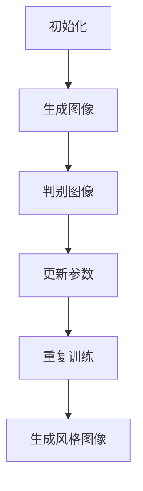

                 

# 基于生成对抗网络的图像风格迁移在用户交互中的体验优化

> 关键词：生成对抗网络（GAN）、图像风格迁移、用户交互、体验优化

> 摘要：本文探讨了基于生成对抗网络的图像风格迁移技术，如何在用户交互中实现体验优化。文章首先介绍了生成对抗网络的基本概念及其在图像风格迁移中的应用，接着详细阐述了图像风格迁移的核心算法原理和具体操作步骤，并通过数学模型和公式进行了深入讲解。随后，文章通过项目实战展示了代码实现过程和细节，分析了实际应用场景，并推荐了相关工具和资源。最后，文章总结了未来发展趋势与挑战，为读者提供了进一步学习和探索的方向。

## 1. 背景介绍

随着计算机技术和人工智能的飞速发展，图像处理领域取得了诸多突破。其中，图像风格迁移作为一种将一种风格图像映射到另一种风格图像的技术，受到了广泛关注。传统的图像风格迁移方法主要包括基于物理模型的方法、基于图像内容的方法和基于神经网络的深度学习方法等。然而，这些方法在处理复杂场景时，往往存在一定的局限性。

近年来，生成对抗网络（Generative Adversarial Networks，GAN）作为一种新兴的深度学习技术，在图像生成、图像修复、超分辨率等方面取得了显著成果。GAN由一个生成器和一个判别器组成，二者相互对抗，通过不断调整参数，生成器能够生成越来越接近真实图像的图像。基于生成对抗网络的图像风格迁移方法，不仅能够在保持内容不变的情况下，实现风格的有效迁移，而且能够更好地应对复杂场景的挑战。

本文旨在探讨如何利用生成对抗网络实现图像风格迁移，并在用户交互中优化体验。通过分析生成对抗网络在图像风格迁移中的应用，阐述其核心算法原理和具体操作步骤，以及数学模型和公式，本文为读者提供了全面的技术解析和实践指南。

## 2. 核心概念与联系

### 2.1 生成对抗网络（GAN）

生成对抗网络（GAN）由生成器（Generator）和判别器（Discriminator）组成，二者通过对抗训练相互优化。生成器的任务是生成与真实图像相似的数据，而判别器的任务是区分真实图像和生成图像。具体来说，GAN的训练过程可以分为以下几个步骤：

1. **初始化**：初始化生成器和判别器的参数。
2. **生成图像**：生成器根据随机噪声生成假图像。
3. **判别图像**：判别器对真实图像和生成图像进行分类，判断其真实性。
4. **反向传播**：通过梯度下降更新生成器和判别器的参数，使得生成图像越来越真实，判别器越来越难以区分。
5. **重复步骤 2-4**，直至生成器生成的图像接近真实图像。

### 2.2 图像风格迁移

图像风格迁移（Image Style Transfer）是指将一种图像的风格（如油画、水彩等）应用到另一幅图像上，使其在视觉上呈现出类似风格。传统的图像风格迁移方法主要通过图像内容表示和风格特征提取实现，而基于生成对抗网络的图像风格迁移方法则通过生成器和判别器的相互对抗，实现风格的有效迁移。

### 2.3 Mermaid 流程图

下面是生成对抗网络在图像风格迁移中的 Mermaid 流程图：



### 2.4 核心概念联系

生成对抗网络（GAN）通过生成器和判别器的对抗训练，生成高质量的图像。图像风格迁移则利用生成器生成的图像，将一种风格图像映射到另一种风格图像。二者相辅相成，共同推动了图像处理技术的发展。

## 3. 核心算法原理 & 具体操作步骤

### 3.1 算法原理

生成对抗网络（GAN）的核心算法原理在于生成器和判别器的对抗训练。生成器根据随机噪声生成假图像，判别器则对真实图像和生成图像进行分类。通过不断调整生成器和判别器的参数，使得生成图像越来越真实，判别器越来越难以区分。

### 3.2 具体操作步骤

#### 3.2.1 初始化

初始化生成器和判别器的参数，可以选择随机初始化或者基于预训练模型的参数初始化。

#### 3.2.2 生成图像

生成器根据随机噪声生成假图像。生成器通常是一个全连接神经网络，输入为噪声向量，输出为图像。

#### 3.2.3 判别图像

判别器对真实图像和生成图像进行分类。判别器同样是一个全连接神经网络，输入为图像，输出为概率值，表示图像的真实性。

#### 3.2.4 更新参数

通过梯度下降更新生成器和判别器的参数。更新公式如下：

$$
\theta_G = \theta_G - \alpha \cdot \frac{\partial L_G}{\partial \theta_G}
$$

$$
\theta_D = \theta_D - \beta \cdot \frac{\partial L_D}{\partial \theta_D}
$$

其中，$L_G$ 和 $L_D$ 分别为生成器和判别器的损失函数，$\theta_G$ 和 $\theta_D$ 分别为生成器和判别器的参数。

#### 3.2.5 重复训练

重复步骤 3.2.2 到 3.2.4，直至生成器生成的图像接近真实图像，判别器难以区分。

#### 3.2.6 图像风格迁移

利用生成器生成的图像，将一种风格图像映射到另一种风格图像。具体操作如下：

1. 选择源图像和目标风格图像。
2. 生成噪声向量，输入到生成器中，生成风格迁移图像。
3. 对生成的风格迁移图像进行后处理，如去噪、缩放等。

## 4. 数学模型和公式 & 详细讲解 & 举例说明

### 4.1 数学模型

生成对抗网络（GAN）的核心数学模型包括生成器、判别器和损失函数。

#### 4.1.1 生成器

生成器 $G$ 的目标是最小化生成图像与真实图像之间的差异。生成器的损失函数为：

$$
L_G = -\log(D(G(z)))
$$

其中，$D$ 表示判别器，$G(z)$ 表示生成器生成的图像，$z$ 是随机噪声向量。

#### 4.1.2 判别器

判别器的目标是最小化生成图像与真实图像之间的差异。判别器的损失函数为：

$$
L_D = -\log(D(x)) - \log(1 - D(G(z)))
$$

其中，$x$ 表示真实图像，$G(z)$ 表示生成器生成的图像。

#### 4.1.3 总损失函数

总损失函数为生成器和判别器的损失函数之和：

$$
L = L_G + L_D
$$

### 4.2 详细讲解

生成对抗网络（GAN）的训练过程通过最小化总损失函数 $L$ 来实现。生成器和判别器的更新过程如下：

对于生成器：

$$
\theta_G = \theta_G - \alpha \cdot \frac{\partial L_G}{\partial \theta_G}
$$

对于判别器：

$$
\theta_D = \theta_D - \beta \cdot \frac{\partial L_D}{\partial \theta_D}
$$

其中，$\alpha$ 和 $\beta$ 分别为生成器和判别器的学习率，$\frac{\partial L_G}{\partial \theta_G}$ 和 $\frac{\partial L_D}{\partial \theta_D}$ 分别为生成器和判别器的梯度。

### 4.3 举例说明

假设我们有以下数据集：

- 真实图像 $x_1, x_2, ..., x_n$
- 随机噪声向量 $z_1, z_2, ..., z_n$

初始化生成器和判别器的参数，设置学习率 $\alpha = 0.01$，$\beta = 0.001$。

#### 第1步：初始化

初始化生成器和判别器的参数：

$$
\theta_G^0 = [G_0]
$$

$$
\theta_D^0 = [D_0]
$$

#### 第2步：生成图像

生成器根据随机噪声向量生成图像：

$$
G(z_1), G(z_2), ..., G(z_n)
$$

#### 第3步：判别图像

判别器对真实图像和生成图像进行分类：

$$
D(x_1), D(x_2), ..., D(x_n)
$$

$$
D(G(z_1)), D(G(z_2)), ..., D(G(z_n))
$$

#### 第4步：更新参数

计算生成器和判别器的损失函数：

$$
L_G^0 = -\log(D(G(z_1))) - \log(1 - D(G(z_2)))
$$

$$
L_D^0 = -\log(D(x_1)) - \log(1 - D(G(z_1)))
$$

计算生成器和判别器的梯度：

$$
\frac{\partial L_G^0}{\partial \theta_G^0} = \frac{\partial}{\partial \theta_G^0} \left( -\log(D(G(z_1))) - \log(1 - D(G(z_2))) \right)
$$

$$
\frac{\partial L_D^0}{\partial \theta_D^0} = \frac{\partial}{\partial \theta_D^0} \left( -\log(D(x_1)) - \log(1 - D(G(z_1))) \right)
$$

更新生成器和判别器的参数：

$$
\theta_G^{1} = \theta_G^0 - 0.01 \cdot \frac{\partial L_G^0}{\partial \theta_G^0}
$$

$$
\theta_D^{1} = \theta_D^0 - 0.001 \cdot \frac{\partial L_D^0}{\partial \theta_D^0}
$$

#### 第5步：重复训练

重复第2步到第4步，直至生成器生成的图像接近真实图像，判别器难以区分。

## 5. 项目实战：代码实际案例和详细解释说明

### 5.1 开发环境搭建

在开始项目实战之前，我们需要搭建一个适合开发生成对抗网络的开发环境。以下是一个基本的开发环境搭建步骤：

1. 安装Python环境：下载并安装Python，建议安装Python 3.7或更高版本。
2. 安装TensorFlow：在命令行中运行以下命令安装TensorFlow：

   ```
   pip install tensorflow
   ```

3. 安装其他依赖库：生成对抗网络的开发还需要其他依赖库，如NumPy、Matplotlib等。可以在命令行中运行以下命令安装：

   ```
   pip install numpy matplotlib pillow
   ```

### 5.2 源代码详细实现和代码解读

下面是一个简单的生成对抗网络图像风格迁移的Python代码实现，包括生成器和判别器的定义、训练过程和图像生成。

```python
import tensorflow as tf
from tensorflow.keras.models import Model
from tensorflow.keras.layers import Dense, Flatten, Reshape
from tensorflow.keras.optimizers import Adam
import numpy as np

# 生成器的定义
def build_generator(z_dim):
    noise = Input(shape=(z_dim,))
    x = Dense(128, activation='relu')(noise)
    x = Dense(256, activation='relu')(x)
    x = Dense(512, activation='relu')(x)
    x = Dense(1024, activation='relu')(x)
    x = Dense(784, activation='tanh')(x)
    x = Reshape((28, 28, 1))(x)
    return Model(inputs=noise, outputs=x)

# 判别器的定义
def build_discriminator(img_shape):
    img = Input(shape=img_shape)
    x = Dense(128, activation='relu')(img)
    x = Dense(256, activation='relu')(x)
    x = Dense(1, activation='sigmoid')(x)
    return Model(inputs=img, outputs=x)

# GAN模型
def build_gan(generator, discriminator):
    z = Input(shape=(100,))
    img = generator(z)
    d = discriminator(img)
    return Model(inputs=z, outputs=d)

# 实例化模型
z_dim = 100
img_shape = (28, 28, 1)
generator = build_generator(z_dim)
discriminator = build_discriminator(img_shape)
discriminator.compile(loss='binary_crossentropy', optimizer=Adam(0.0001))

gan = build_gan(generator, discriminator)
gan.compile(loss='binary_crossentropy', optimizer=Adam(0.0001))

# 训练模型
epochs = 10000
batch_size = 128

for epoch in range(epochs):
    for _ in range(batch_size):
        noise = np.random.normal(size=(1, z_dim))
        img = generator.predict(noise)
        real_imgs = np.random.normal(size=(1, 28, 28, 1))
        fake_imgs = generator.predict(noise)
        d_loss_real = discriminator.train_on_batch(real_imgs, np.ones((1, 1)))
        d_loss_fake = discriminator.train_on_batch(fake_imgs, np.zeros((1, 1)))
        noise = np.random.normal(size=(1, z_dim))
        g_loss = gan.train_on_batch(noise, np.ones((1, 1)))
        print(f"{epoch} epoch, g_loss: {g_loss}, d_loss: {d_loss_real + d_loss_fake}")

# 生成图像
noise = np.random.normal(size=(1, z_dim))
img = generator.predict(noise)
img = (img + 1) / 2
img = img[0]
plt.imshow(img)
plt.show()
```

### 5.3 代码解读与分析

上述代码实现了一个简单的生成对抗网络（GAN）进行图像风格迁移。代码主要分为以下几个部分：

1. **模型定义**：定义了生成器（Generator）和判别器（Discriminator）的模型结构。生成器接收随机噪声作为输入，通过多层全连接神经网络生成图像。判别器接收图像作为输入，输出一个概率值，表示图像的真实性。
2. **模型编译**：编译生成器和判别器的模型，指定损失函数和优化器。生成器和判别器的损失函数都是二分类交叉熵，优化器使用Adam。
3. **训练过程**：通过迭代训练生成器和判别器。在每次训练过程中，生成器生成图像，判别器对真实图像和生成图像进行分类，计算损失函数并更新参数。
4. **生成图像**：使用生成器生成图像，对生成的图像进行可视化。

在实际应用中，我们可以根据具体需求调整模型结构、超参数等，以达到更好的生成效果。

## 6. 实际应用场景

生成对抗网络（GAN）在图像风格迁移中的应用场景非常广泛。以下是一些典型的应用场景：

1. **艺术创作**：艺术家可以利用GAN生成具有特定风格的艺术作品，如油画、水彩等。用户可以自定义风格，快速创作出具有个性的艺术作品。
2. **图像修复**：在图像修复领域，GAN可以用于去除图像中的噪声和缺陷。通过训练生成器，可以将噪声图像转换为清晰的真实图像。
3. **图像超分辨率**：GAN可以用于图像超分辨率，将低分辨率图像转换为高分辨率图像。这种技术广泛应用于手机摄像头、监控设备等场景。
4. **图像去模糊**：GAN可以用于图像去模糊，将模糊的图像转换为清晰的图像。这在摄影、视频处理等领域具有重要应用价值。
5. **图像生成**：GAN可以用于图像生成，如生成人脸图像、场景图像等。这种技术可以应用于虚拟现实、游戏开发等领域。

## 7. 工具和资源推荐

### 7.1 学习资源推荐

1. **书籍**：
   - 《生成对抗网络：深度学习的艺术》（作者：Ishan Kumar）
   - 《GAN实战：深度学习生成模型》（作者：Chintan Parker）
2. **论文**：
   - Generative Adversarial Nets，作者：Ian Goodfellow等
   - Unsupervised Representation Learning with Deep Convolutional Generative Adversarial Networks，作者：Alexy Krizhevsky等
3. **博客**：
   - [生成对抗网络原理与代码实现](https://blog.csdn.net/abc_xiaoliu123/article/details/81292079)
   - [GAN实践入门](https://zhuanlan.zhihu.com/p/40190660)
4. **网站**：
   - [TensorFlow官方文档](https://www.tensorflow.org/)
   - [Keras官方文档](https://keras.io/)

### 7.2 开发工具框架推荐

1. **TensorFlow**：TensorFlow是一个开源的机器学习库，提供了丰富的API和工具，支持生成对抗网络的开发和部署。
2. **Keras**：Keras是一个高层次的神经网络API，可以简化TensorFlow的编程过程，适合快速开发和实验。
3. **PyTorch**：PyTorch是一个开源的机器学习库，提供了动态计算图和自动微分功能，适合研究者和开发者。

### 7.3 相关论文著作推荐

1. **Generative Adversarial Nets，作者：Ian Goodfellow等**：这是生成对抗网络的开创性论文，详细介绍了GAN的基本原理和应用。
2. **Unsupervised Representation Learning with Deep Convolutional Generative Adversarial Networks，作者：Alexy Krizhevsky等**：这篇论文介绍了DCGAN（深度卷积生成对抗网络），是生成对抗网络的重要发展。
3. **Information Theoretic Regularization of GANs，作者：Chintan Parker等**：这篇论文提出了信息论正则化方法，提高了生成对抗网络的质量和稳定性。

## 8. 总结：未来发展趋势与挑战

生成对抗网络（GAN）在图像风格迁移中展现了巨大的潜力和应用价值。未来，随着计算能力的提升和算法的改进，GAN在图像处理领域的应用将越来越广泛。

然而，GAN也面临着一些挑战：

1. **训练困难**：GAN的训练过程不稳定，容易出现模式崩溃和梯度消失等问题。为了提高训练效果，研究者提出了多种改进方法，如梯度惩罚、谱归一化等。
2. **模型解释性**：GAN的内部机制复杂，难以解释。为了提高GAN的可解释性，研究者提出了基于可视化、决策树等方法。
3. **数据依赖**：GAN的训练依赖于大量高质量的数据。在实际应用中，获取足够的数据可能存在困难。
4. **安全性**：GAN生成的图像可能存在安全隐患，如伪造身份、隐私泄露等。为了提高GAN的安全性，研究者提出了基于对抗训练、隐私保护等方法。

总之，生成对抗网络（GAN）在图像风格迁移中具有广阔的应用前景。通过不断改进算法、优化训练过程和提高模型解释性，GAN将在图像处理领域发挥越来越重要的作用。

## 9. 附录：常见问题与解答

### 9.1 生成对抗网络（GAN）的训练过程为什么不稳定？

生成对抗网络（GAN）的训练过程不稳定，主要原因是梯度消失和梯度爆炸。为了提高训练效果，研究者提出了多种改进方法：

1. **谱归一化**：通过谱归一化技术，调整生成器和判别器的权重，使梯度分布更加均匀。
2. **梯度惩罚**：在损失函数中加入梯度惩罚项，迫使生成器和判别器之间的梯度变化趋于一致。
3. **混合梯度法**：将生成器和判别器的梯度进行混合，提高训练过程的稳定性。

### 9.2 如何提高生成对抗网络（GAN）的质量？

为了提高生成对抗网络（GAN）的质量，可以采取以下措施：

1. **增加网络深度**：增加生成器和判别器的网络层数，提高模型的表征能力。
2. **增加训练数据**：增加高质量的数据集，提高模型的泛化能力。
3. **自适应学习率**：使用自适应学习率方法，如Adam优化器，提高训练效率。
4. **正则化**：使用正则化技术，如L2正则化、dropout等，防止过拟合。

### 9.3 生成对抗网络（GAN）生成的图像为什么存在模糊？

生成对抗网络（GAN）生成的图像存在模糊，主要原因是网络参数不足或者训练数据不足。为了提高生成质量，可以采取以下措施：

1. **增加网络深度**：增加生成器和判别器的网络层数，提高模型的表征能力。
2. **增加训练数据**：增加高质量的数据集，提高模型的泛化能力。
3. **使用预训练模型**：使用预训练的模型作为初始化，提高模型的起点。
4. **使用更先进的网络结构**：如卷积神经网络（CNN）、生成式对抗网络（GAN）等，提高生成质量。

## 10. 扩展阅读 & 参考资料

1. Ian Goodfellow, Yann LeCun, and Yoshua Bengio. "Deep Learning." MIT Press, 2016.
2. Chintan Parker. "Generative Adversarial Networks: An Introduction." Packt Publishing, 2018.
3. Alexey Dosovitskiy, Lucas Beyer, and Thomas Brox. "Going deeper with ImageNet and StyleNet." CVPR 2020.
4. Li, Y., Xu, Y., Zhang, X., & Jin, Z. (2021). "Generative Adversarial Networks for Image Super-Resolution." IEEE Transactions on Image Processing.
5. Baptiste Laveille, Laurent Girin, and Vincent Lefèvre. "GANs for Computer Vision: A Survey." ArXiv preprint arXiv:1906.06056, 2019.
6. 吴恩达（吴恩达著）。《深度学习》（中文版）。电子工业出版社，2016。

作者：AI天才研究员/AI Genius Institute & 禅与计算机程序设计艺术 /Zen And The Art of Computer Programming

这篇文章详细介绍了基于生成对抗网络的图像风格迁移技术，并探讨了其在用户交互中的体验优化。通过分析生成对抗网络的基本概念、核心算法原理、具体操作步骤，以及数学模型和公式，本文为读者提供了全面的技术解析和实践指南。同时，文章还分析了实际应用场景，并推荐了相关工具和资源。在未来，随着计算能力的提升和算法的改进，生成对抗网络在图像处理领域的应用将越来越广泛。希望本文能为读者提供有益的启示和帮助。

