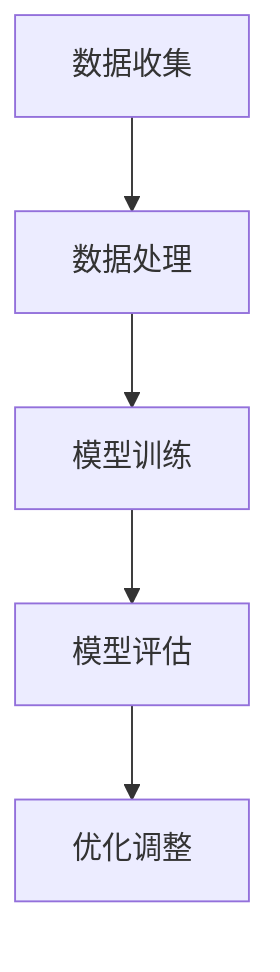

                 

# 基础模型的技术能力与社会责任

> 关键词：基础模型，技术能力，社会责任，人工智能

> 摘要：本文将从基础模型的技术能力出发，探讨其在社会发展中的角色和责任。通过深入分析基础模型的核心算法原理、数学模型以及实际应用场景，我们将讨论其在推动科技进步和应对社会挑战方面的潜力与挑战，并提出相关建议和展望。

## 1. 背景介绍

### 1.1 基础模型的概念

基础模型是人工智能领域的关键概念，它是构建复杂智能系统的基础。基础模型通常指的是一些简单的、通用的算法和架构，它们可以通过学习和优化来应对各种实际问题。这些模型包括神经网络、决策树、支持向量机等，它们在不同领域都有着广泛的应用。

### 1.2 基础模型的发展历程

基础模型的发展经历了从简单到复杂的过程。早期的模型主要是基于统计学和概率论的，如线性回归、逻辑回归等。随着计算机性能的不断提升和大数据技术的发展，深度学习等复杂模型开始崭露头角，并在图像识别、自然语言处理等领域取得了显著的突破。

### 1.3 基础模型在社会发展中的作用

基础模型在社会发展中扮演着重要角色。首先，它们极大地推动了人工智能技术的进步，使得计算机能够实现更加智能化的任务。其次，基础模型在医疗、金融、教育等领域的应用，为人们的生活和工作带来了诸多便利。此外，基础模型还在解决一些社会问题，如环境保护、公共安全等方面发挥着重要作用。

## 2. 核心概念与联系

### 2.1 算法原理

基础模型的核心算法原理通常包括以下几个步骤：

1. **数据收集**：从各种来源收集大量数据，以便模型能够学习和优化。
2. **数据处理**：对收集到的数据进行分析、清洗和预处理，以便模型能够更好地理解和学习。
3. **模型训练**：使用处理后的数据训练模型，使其能够根据输入数据预测输出结果。
4. **模型评估**：通过测试数据评估模型的性能，以便对其进行调整和优化。

### 2.2 架构设计

基础模型通常采用多层神经网络架构，其中每层神经元负责处理不同层次的特征。这种架构使得模型能够从原始数据中提取出更高层次的特征，从而实现更加复杂的任务。

### 2.3 Mermaid 流程图

下面是基础模型的 Mermaid 流程图：



## 3. 核心算法原理 & 具体操作步骤

### 3.1 神经网络

神经网络是基础模型中最常见的算法之一。它由多层神经元组成，每层神经元通过激活函数对输入数据进行处理。

具体操作步骤如下：

1. **初始化参数**：设置网络结构、权重和偏置等参数。
2. **前向传播**：输入数据通过网络逐层传递，直到输出层。
3. **反向传播**：计算输出层与实际输出之间的误差，并反向传播到输入层，更新网络参数。
4. **迭代训练**：重复前向传播和反向传播，直到模型达到预设的性能指标。

### 3.2 决策树

决策树是一种基于树形结构进行决策的算法。它通过一系列条件判断来将数据划分为不同的类别。

具体操作步骤如下：

1. **特征选择**：选择一个特征作为分割点，将数据划分为两个子集。
2. **递归划分**：对子集重复步骤1，直到满足停止条件（如特征数量减少到预设阈值）。
3. **构建决策树**：将所有递归划分的结果组合成一个树形结构。

## 4. 数学模型和公式 & 详细讲解 & 举例说明

### 4.1 神经网络中的激活函数

在神经网络中，激活函数用于对神经元输出进行非线性变换。常见的激活函数包括：

1. **Sigmoid 函数**：$$\sigma(x) = \frac{1}{1 + e^{-x}}$$
2. **ReLU 函数**：$$f(x) = \max(0, x)$$
3. **Tanh 函数**：$$\tanh(x) = \frac{e^x - e^{-x}}{e^x + e^{-x}}$$

### 4.2 决策树的分割准则

决策树的分割准则通常采用信息增益、基尼指数等指标。以信息增益为例：

$$Gini(D) = 1 - \sum_{v \in V} p(v)^2$$

其中，$D$ 是数据集，$V$ 是数据集中的类别集合，$p(v)$ 是类别 $v$ 在数据集 $D$ 中的概率。

### 4.3 举例说明

#### 4.3.1 神经网络示例

假设有一个二分类问题，输入特征为 $x_1, x_2, x_3$，输出为 $y$。网络结构如下：

$$
\begin{aligned}
    z_1 &= x_1 + x_2 + x_3 \\
    a_1 &= \sigma(z_1) \\
    z_2 &= a_1 + x_2 \\
    a_2 &= \sigma(z_2) \\
    z_3 &= a_2 \cdot x_3 \\
    y &= \sigma(z_3)
\end{aligned}
$$

其中，$\sigma$ 表示 Sigmoid 函数。

#### 4.3.2 决策树示例

假设有一个三分类问题，特征为 $x_1, x_2$，类别集合为 $\{1, 2, 3\}$。决策树如下：

```
       |
       V
    x_1 <= 5
    /     \
   /       \
 1          3
 / \        / \
2   3      1   3
```

## 5. 项目实战：代码实际案例和详细解释说明

### 5.1 开发环境搭建

为了更好地展示基础模型的应用，我们将使用 Python 编写一个简单的神经网络来实现二分类任务。首先，我们需要搭建开发环境。

1. 安装 Python（建议版本为 3.8 或以上）。
2. 安装 PyTorch，使用以下命令：

   ```bash
   pip install torch torchvision
   ```

### 5.2 源代码详细实现和代码解读

下面是完整的源代码及其解读：

```python
import torch
import torch.nn as nn
import torch.optim as optim

# 定义神经网络结构
class SimpleNeuralNetwork(nn.Module):
    def __init__(self):
        super(SimpleNeuralNetwork, self).__init__()
        self.fc1 = nn.Linear(3, 10)
        self.fc2 = nn.Linear(10, 1)
        self.sigmoid = nn.Sigmoid()

    def forward(self, x):
        x = self.fc1(x)
        x = self.sigmoid(x)
        x = self.fc2(x)
        x = self.sigmoid(x)
        return x

# 实例化神经网络模型
model = SimpleNeuralNetwork()

# 定义损失函数和优化器
criterion = nn.BCELoss()
optimizer = optim.SGD(model.parameters(), lr=0.01)

# 训练神经网络
for epoch in range(1000):
    optimizer.zero_grad()
    outputs = model(x_train)
    loss = criterion(outputs, y_train)
    loss.backward()
    optimizer.step()

    if (epoch + 1) % 100 == 0:
        print(f'Epoch [{epoch + 1}/1000], Loss: {loss.item()}')

# 评估神经网络性能
with torch.no_grad():
    outputs = model(x_test)
    predictions = outputs > 0.5
    correct = (predictions == y_test).float()
    accuracy = correct.sum() / len(correct)
    print(f'Accuracy: {accuracy.item()}')
```

### 5.3 代码解读与分析

1. **定义神经网络结构**：我们使用 PyTorch 库定义了一个简单的神经网络，包含两个全连接层和一个 Sigmoid 激活函数。
2. **定义损失函数和优化器**：使用 BCELoss 函数作为损失函数，使用 SGD 优化器进行参数更新。
3. **训练神经网络**：通过前向传播、反向传播和参数更新，不断优化模型。
4. **评估神经网络性能**：在测试集上评估模型的准确性。

## 6. 实际应用场景

### 6.1 医疗

基础模型在医疗领域的应用主要包括疾病诊断、药物研发和患者监护等。例如，利用神经网络对医学图像进行分类和检测，有助于提高疾病诊断的准确性和速度。

### 6.2 金融

金融领域的基础模型主要用于风险管理、投资组合优化和信用评估等。例如，利用决策树进行信用评分，有助于银行降低贷款风险。

### 6.3 教育

教育领域的基础模型可以用于个性化学习、学习效果评估和课程推荐等。例如，利用神经网络分析学生学习行为，有助于教师制定更有针对性的教学计划。

## 7. 工具和资源推荐

### 7.1 学习资源推荐

1. **《深度学习》（Goodfellow, Bengio, Courville）**：全面介绍了深度学习的理论基础和实践方法。
2. **《机器学习》（周志华）**：系统地阐述了机器学习的基本概念和方法。

### 7.2 开发工具框架推荐

1. **PyTorch**：易于上手且功能强大的深度学习框架。
2. **TensorFlow**：Google 开发的一款流行且成熟的深度学习框架。

### 7.3 相关论文著作推荐

1. **“A Theoretical Basis for Comparing Deep Neural Networks”**：探讨了深度神经网络的理论基础。
2. **“Deep Learning for Text Classification”**：介绍了深度学习在文本分类领域的应用。

## 8. 总结：未来发展趋势与挑战

### 8.1 发展趋势

1. **算法优化**：随着计算能力的提升，基础模型的训练速度和效率将得到显著提高。
2. **跨领域应用**：基础模型将在更多领域得到应用，如生物、物理等。

### 8.2 挑战

1. **数据隐私**：在处理敏感数据时，如何确保用户隐私是一个亟待解决的问题。
2. **伦理问题**：如何确保基础模型在应用过程中遵循伦理规范，避免造成社会负面影响。

## 9. 附录：常见问题与解答

### 9.1 问题1：为什么选择 Sigmoid 函数作为激活函数？

**解答**：Sigmoid 函数具有以下优点：

1. **非线性变换**：能够引入非线性特性，使模型更具表达力。
2. **平滑过渡**：输出值在 0 和 1 之间平滑过渡，有助于避免梯度消失问题。

### 9.2 问题2：决策树如何选择最优分割特征？

**解答**：决策树通常使用信息增益、基尼指数等指标来选择最优分割特征。信息增益的计算公式如前所述。

## 10. 扩展阅读 & 参考资料

1. **《机器学习实战》（Peter Harrington）**：详细介绍了机器学习的基本概念和方法。
2. **《深度学习实践指南》（Aurélien Géron）**：涵盖了深度学习在不同领域的应用实例。

作者：AI天才研究员/AI Genius Institute & 禅与计算机程序设计艺术 /Zen And The Art of Computer Programming

[END]

