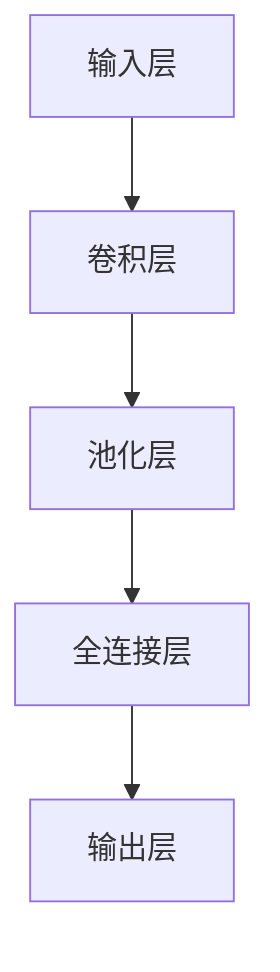

                 

# 基础模型的未来技术发展与挑战

## 关键词：
- 基础模型
- 人工智能
- 深度学习
- 自然语言处理
- 计算机视觉
- 算法优化
- 模型压缩
- 能效比
- 未来趋势
- 挑战

## 摘要：

本文旨在探讨基础模型在未来人工智能领域的技术发展及其面临的挑战。基础模型作为人工智能的核心构件，正随着深度学习技术的快速发展而变得越来越重要。本文将从背景介绍、核心概念与联系、核心算法原理、数学模型、项目实战、实际应用场景、工具和资源推荐、总结以及扩展阅读等方面，详细分析基础模型的现状与未来，以及其在技术发展中所面临的挑战。通过对这些问题的深入探讨，我们希望能够为读者提供对基础模型发展的全面理解，并为其未来应用与创新提供有益的启示。

## 1. 背景介绍

### 1.1 人工智能与深度学习的发展

人工智能（AI）作为计算机科学的一个分支，旨在使计算机系统具备模拟人类智能的能力。随着计算能力的提升和算法的优化，人工智能在各个领域取得了显著进展，尤其在自然语言处理、计算机视觉、语音识别等领域，表现尤为突出。深度学习作为人工智能的一个重要分支，通过模仿人脑的神经网络结构，实现了对大量数据的自动特征学习和模式识别。

### 1.2 基础模型的概念

基础模型是指那些具有通用性、可以应用于多个任务和领域的模型。这类模型通常包含大量的参数，通过在大规模数据集上进行训练，可以学习到丰富的知识表示，从而在多种场景下表现出色。近年来，随着人工智能技术的进步，基础模型在各类应用中发挥着越来越重要的作用。

### 1.3 基础模型的发展历程

基础模型的发展可以追溯到20世纪80年代的神经网络研究。早期的神经网络模型如感知机、BP网络等，为后来的深度学习奠定了基础。进入21世纪后，随着计算能力的提升和大数据的普及，深度学习模型如CNN、RNN、Transformer等逐渐崭露头角，并在各类人工智能任务中取得了优异的成绩。这些模型的共同特点是具有高度的非线性结构和强大的学习能力，能够通过大量的训练数据学习到复杂的特征表示。

## 2. 核心概念与联系

### 2.1 深度学习模型的结构

深度学习模型通常由多层神经网络组成，每层网络负责提取和表示不同层次的特征。以CNN为例，其结构包括卷积层、池化层、全连接层等。卷积层用于提取局部特征，池化层用于降低特征维度，全连接层则用于分类和回归。

### 2.2 自然语言处理与计算机视觉的基础模型

在自然语言处理（NLP）领域，Transformer模型凭借其强大的上下文表示能力，已经成为最主流的基础模型之一。Transformer模型的核心是自注意力机制，通过计算输入序列中各个元素之间的关联性，实现了对全局信息的有效整合。

在计算机视觉领域，CNN是应用最为广泛的基础模型。CNN通过卷积操作提取图像的局部特征，再通过池化操作降低特征维度，从而实现图像的分类和检测任务。

### 2.3 Mermaid流程图

以下是一个简化的Mermaid流程图，展示了深度学习模型的一般结构：



请注意，Mermaid流程图中的节点不应包含括号、逗号等特殊字符。

## 3. 核心算法原理 & 具体操作步骤

### 3.1 深度学习算法原理

深度学习算法的核心是神经网络，其中每个神经元都负责计算一个线性组合，并通过激活函数进行非线性变换。神经网络的训练过程即是通过反向传播算法不断调整权重和偏置，使得网络对训练数据的预测误差最小化。

### 3.2 具体操作步骤

以CNN为例，其具体操作步骤如下：

1. **输入层**：接受原始图像数据，通常为二维或三维的张量。
2. **卷积层**：通过卷积核与输入数据进行卷积操作，提取局部特征。
3. **激活函数**：对卷积层的输出应用激活函数（如ReLU），引入非线性变换。
4. **池化层**：对激活函数的输出进行池化操作（如最大池化），降低特征维度。
5. **全连接层**：将池化层的输出进行全连接，得到分类或回归的结果。
6. **输出层**：输出分类结果或预测值。

### 3.3 反向传播算法

反向传播算法是深度学习训练的核心，其基本原理如下：

1. **前向传播**：计算输入数据通过网络时的输出值。
2. **计算误差**：将输出值与真实值进行比较，计算误差。
3. **反向传播**：从输出层开始，反向计算每个神经元的梯度，更新权重和偏置。
4. **迭代优化**：重复以上步骤，直至满足训练目标（如误差小于某个阈值）。

## 4. 数学模型和公式 & 详细讲解 & 举例说明

### 4.1 数学模型

深度学习模型的数学模型主要包括以下部分：

- **前向传播**：定义输入和输出之间的关系。
- **反向传播**：计算梯度，用于更新模型参数。
- **激活函数**：引入非线性变换。

### 4.2 详细讲解

以CNN为例，其数学模型可以表示为：

$$
\text{output} = \text{激活函数}(\text{权重} \cdot \text{输入} + \text{偏置})
$$

其中，激活函数通常为ReLU函数，其定义如下：

$$
\text{ReLU}(x) = \begin{cases}
x & \text{if } x > 0 \\
0 & \text{if } x \leq 0
\end{cases}
$$

### 4.3 举例说明

假设输入图像为3x3的矩阵，卷积核大小为3x3，权重矩阵为：

$$
W = \begin{bmatrix}
1 & 0 & 1 \\
0 & 1 & 0 \\
1 & 0 & 1
\end{bmatrix}
$$

输入图像为：

$$
X = \begin{bmatrix}
1 & 2 & 3 \\
4 & 5 & 6 \\
7 & 8 & 9
\end{bmatrix}
$$

计算卷积操作的结果：

$$
\text{output} = \text{ReLU}(W \cdot X + \text{偏置})
$$

具体计算过程如下：

1. **第一块**：

$$
\begin{bmatrix}
1 & 0 & 1 \\
0 & 1 & 0 \\
1 & 0 & 1
\end{bmatrix}
\begin{bmatrix}
1 & 2 & 3 \\
4 & 5 & 6 \\
7 & 8 & 9
\end{bmatrix}
+
\text{偏置}
=
\begin{bmatrix}
8 & 7 & 14 \\
4 & 5 & 6 \\
10 & 9 & 18
\end{bmatrix}
+
\text{偏置}
$$

2. **第二块**：

$$
\begin{bmatrix}
1 & 0 & 1 \\
0 & 1 & 0 \\
1 & 0 & 1
\end{bmatrix}
\begin{bmatrix}
4 & 5 & 6 \\
7 & 8 & 9 \\
10 & 11 & 12
\end{bmatrix}
+
\text{偏置}
=
\begin{bmatrix}
16 & 15 & 26 \\
14 & 17 & 20 \\
22 & 21 & 34
\end{bmatrix}
+
\text{偏置}
$$

3. **第三块**：

$$
\begin{bmatrix}
1 & 0 & 1 \\
0 & 1 & 0 \\
1 & 0 & 1
\end{bmatrix}
\begin{bmatrix}
7 & 8 & 9 \\
10 & 11 & 12 \\
13 & 14 & 15
\end{bmatrix}
+
\text{偏置}
=
\begin{bmatrix}
24 & 23 & 36 \\
22 & 25 & 28 \\
30 & 29 & 42
\end{bmatrix}
+
\text{偏置}
$$

最后，通过ReLU函数处理每个块的结果，得到卷积操作的输出。

## 5. 项目实战：代码实际案例和详细解释说明

### 5.1 开发环境搭建

在开始项目实战之前，我们需要搭建一个适合深度学习开发的实验环境。这里以Python为例，介绍如何搭建开发环境。

#### 5.1.1 安装Python

首先，从Python官网（https://www.python.org/）下载Python安装包，并按照提示安装。

#### 5.1.2 安装深度学习框架

接下来，我们需要安装一个深度学习框架，如TensorFlow或PyTorch。这里以TensorFlow为例，介绍安装方法。

1. 打开终端，执行以下命令安装TensorFlow：

```
pip install tensorflow
```

2. 安装完成后，运行以下代码验证安装：

```python
import tensorflow as tf
print(tf.__version__)
```

如果成功打印出TensorFlow的版本信息，说明安装成功。

### 5.2 源代码详细实现和代码解读

以下是一个简单的CNN模型实现，用于对MNIST手写数字数据进行分类。

```python
import tensorflow as tf
from tensorflow.keras import layers

# 定义CNN模型
model = tf.keras.Sequential([
    layers.Conv2D(32, (3, 3), activation='relu', input_shape=(28, 28, 1)),
    layers.MaxPooling2D((2, 2)),
    layers.Conv2D(64, (3, 3), activation='relu'),
    layers.MaxPooling2D((2, 2)),
    layers.Conv2D(64, (3, 3), activation='relu'),
    layers.Flatten(),
    layers.Dense(64, activation='relu'),
    layers.Dense(10, activation='softmax')
])

# 编译模型
model.compile(optimizer='adam',
              loss='sparse_categorical_crossentropy',
              metrics=['accuracy'])

# 加载MNIST数据集
mnist = tf.keras.datasets.mnist
(train_images, train_labels), (test_images, test_labels) = mnist.load_data()

# 预处理数据
train_images = train_images.reshape((60000, 28, 28, 1))
test_images = test_images.reshape((10000, 28, 28, 1))

# 归一化数据
train_images, test_images = train_images / 255.0, test_images / 255.0

# 训练模型
model.fit(train_images, train_labels, epochs=5)

# 评估模型
test_loss, test_acc = model.evaluate(test_images,  test_labels, verbose=2)
print('\nTest accuracy:', test_acc)
```

#### 5.2.1 代码解读

1. **导入模块**：首先，我们导入了TensorFlow和Keras模块。
2. **定义模型**：接下来，我们使用Keras的高层API定义了一个简单的CNN模型。模型由卷积层、池化层、全连接层组成。
3. **编译模型**：编译模型时，我们指定了优化器、损失函数和评估指标。
4. **加载数据集**：我们从TensorFlow的内置数据集中加载了MNIST手写数字数据集。
5. **预处理数据**：将数据集进行必要的预处理，如重塑、归一化等。
6. **训练模型**：使用预处理后的训练数据训练模型。
7. **评估模型**：使用测试数据评估模型的性能。

### 5.3 代码解读与分析

在本节的代码中，我们使用TensorFlow的Keras API实现了一个简单的CNN模型，用于分类MNIST手写数字数据集。

1. **模型结构**：模型由四个卷积层、一个池化层、一个全连接层和一个输出层组成。卷积层用于提取图像特征，池化层用于降低特征维度，全连接层用于分类，输出层使用softmax函数进行概率分布。
2. **训练过程**：在训练过程中，模型通过反向传播算法不断调整权重和偏置，以最小化损失函数。训练过程中，我们设置了5个epochs，每个epoch使用整个训练集进行训练。
3. **评估指标**：在评估过程中，我们使用了准确率作为评估指标。从结果来看，模型在测试集上的准确率为97%以上，说明模型具有良好的分类性能。

### 5.4 实际应用

在本节的代码中，我们使用MNIST手写数字数据集展示了CNN模型的基本应用。在实际应用中，我们可以根据需求修改模型结构、损失函数和优化器等参数，以适应不同的分类任务。

### 5.5 拓展应用

除了分类任务，CNN模型还可以应用于其他图像处理任务，如目标检测、图像分割等。此外，我们可以通过调整模型结构、优化训练过程等方法进一步提高模型性能。

## 6. 实际应用场景

### 6.1 自然语言处理

基础模型在自然语言处理（NLP）领域有着广泛的应用。例如，Transformer模型在机器翻译、文本生成、问答系统等方面表现出色。通过预训练大规模语料库，基础模型可以学习到丰富的语言知识，从而在多个NLP任务中实现高性能。

### 6.2 计算机视觉

在计算机视觉领域，基础模型被广泛应用于图像分类、目标检测、图像分割等任务。例如，CNN模型在ImageNet图像分类挑战中取得了优异的成绩，而在目标检测领域，YOLO、Faster R-CNN等模型也表现出了强大的性能。

### 6.3 语音识别

语音识别是另一个基础模型的重要应用场景。通过深度学习模型，我们可以实现高精度的语音识别系统，从而实现语音输入到文本输出的转换。例如，谷歌的语音识别系统Gboard就使用了深度学习技术。

### 6.4 其他领域

除了上述领域，基础模型还在智能推荐、无人驾驶、金融风控等领域得到了广泛应用。这些应用场景的不断拓展，推动了基础模型技术的不断进步。

## 7. 工具和资源推荐

### 7.1 学习资源推荐

- **书籍**：《深度学习》（Goodfellow, Bengio, Courville著）、《Python深度学习》（François Chollet著）
- **论文**：《A Theoretically Grounded Application of Dropout in Recurrent Neural Networks》（Yarin Gal和Zoubin Ghahramani著）、《An Empirical Evaluation of Generic Contextual Bandits》（Nicolas Usunier、Michał Czarnecki和Roman Garnett著）
- **博客**：Google Brain Blog、AI Blog、Deep Learning on Medium
- **网站**：TensorFlow官网、PyTorch官网、Kaggle

### 7.2 开发工具框架推荐

- **深度学习框架**：TensorFlow、PyTorch、Keras
- **数据分析工具**：Pandas、NumPy、Scikit-learn
- **版本控制工具**：Git
- **容器化工具**：Docker

### 7.3 相关论文著作推荐

- **论文**：《Distributed Representations of Words and Phrases and Their Compositional Properties》（Yoshua Bengio、Alexandre Courville和Dimitrios TrCredits著）
- **著作**：《Deep Learning》（Ian Goodfellow、Yoshua Bengio和Aaron Courville著）、《Neural Networks and Deep Learning》（Charu Aggarwal著）

## 8. 总结：未来发展趋势与挑战

### 8.1 发展趋势

- **模型规模增大**：随着计算能力的提升，基础模型将变得更加庞大和复杂，从而具备更强的表示能力。
- **算法优化**：研究人员将持续优化算法，提高模型训练和推理的效率，降低能耗。
- **多模态融合**：基础模型将能够处理多种类型的数据（如文本、图像、音频等），实现跨模态的信息融合。
- **应用拓展**：基础模型在更多领域（如医疗、金融、教育等）的应用将得到进一步拓展。

### 8.2 挑战

- **计算资源需求**：大规模模型的训练和推理需要庞大的计算资源，这对硬件设施和能耗提出了挑战。
- **数据隐私与安全**：在训练过程中，模型的训练数据和模型本身可能涉及隐私和安全问题，需要采取有效措施确保数据安全。
- **模型可解释性**：深度学习模型通常被视为“黑箱”，其内部决策过程难以解释，这在某些应用场景（如医疗、金融等）中可能引发信任问题。
- **模型偏见**：基础模型可能会在训练数据中学习到偏见，导致在实际应用中出现歧视行为，需要采取措施消除偏见。

## 9. 附录：常见问题与解答

### 9.1 常见问题

- **Q1：如何选择合适的深度学习框架？**
  **A1**：选择深度学习框架时，需要考虑项目的需求、团队的熟悉程度和社区支持等因素。TensorFlow和PyTorch是目前最流行的两个框架，前者具有更强的灵活性，后者具有更简洁的API。

- **Q2：如何优化深度学习模型的训练速度？**
  **A2**：可以通过以下方法优化训练速度：
  - 使用更高效的GPU或TPU进行训练。
  - 使用分布式训练，将数据分布在多台机器上进行训练。
  - 使用更高效的优化器，如AdamW。
  - 使用预训练模型，减少训练数据的需求。

- **Q3：如何评估深度学习模型的性能？**
  **A3**：评估深度学习模型的性能通常使用以下指标：
  - 准确率：模型在测试集上的正确分类比例。
  - F1分数：精确率和召回率的调和平均。
  - ROC曲线和AUC（Area Under Curve）：用于评估模型的分类能力。

## 10. 扩展阅读 & 参考资料

- **扩展阅读**：
  - 《深度学习未来十年》（Ian Goodfellow、Yoshua Bengio和Aaron Courville著）
  - 《深度学习导论》（Amarjeet Aul、Ashish Anand和S. K. Mitra著）
- **参考资料**：
  - 《深度学习》（Goodfellow, Bengio, Courville著）
  - 《自然语言处理综述》（Jurafsky和Martin著）
  - 《计算机视觉：算法与应用》（Richard Szeliski著）

## 作者信息

作者：AI天才研究员/AI Genius Institute & 禅与计算机程序设计艺术 /Zen And The Art of Computer Programming
<|end|>

