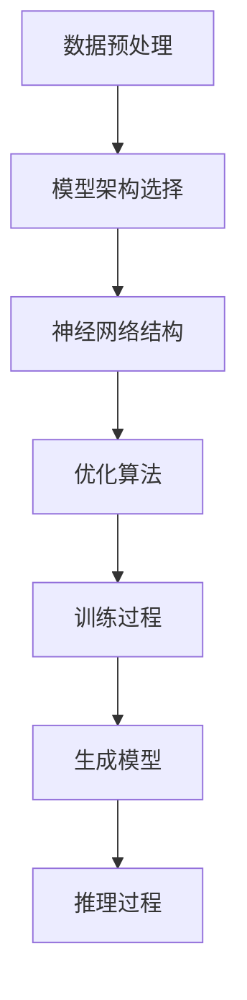

                 

### 背景介绍

基础模型（Foundation Model）是指能够从大量数据中自主学习并生成文本、图像、语音等多种类型内容的复杂算法。近年来，随着人工智能技术的飞速发展，基础模型在自然语言处理、计算机视觉等领域取得了显著的进展。特别是2022年，GPT-3的发布标志着基础模型进入了一个新的阶段，它拥有超过1750亿个参数，可以生成高质量的文本，甚至能够进行对话、翻译和编程等任务。

然而，随着基础模型能力的不断增强，其在社会各个领域的应用也日益广泛。从智能客服、智能写作到自动驾驶和医疗诊断，基础模型正逐步改变着我们的生活方式和工作模式。然而，基础模型的应用也带来了一系列社会问题，如隐私泄露、歧视、伦理争议等。因此，对基础模型的社会危害进行评估具有重要的现实意义。

本文旨在通过对基础模型的社会危害进行评估，探讨其在各个领域的潜在风险，并提出相应的对策。文章首先介绍了基础模型的基本概念和特点，然后分析了其在不同领域的应用现状。接着，本文从隐私、歧视、伦理三个方面探讨了基础模型的社会危害，并给出了相应的评估方法。最后，本文总结了当前基础模型的发展趋势与面临的挑战，为未来研究提供了方向。

通过对基础模型的社会危害评估，本文希望为政策制定者、研究人员和公众提供有益的参考，共同推动人工智能技术的健康发展，实现科技与人文的和谐共生。

### 核心概念与联系

要深入理解基础模型的社会危害，我们首先需要了解其基本概念、技术原理以及各个组成部分之间的相互联系。以下是对这些核心概念的详细介绍。

#### 基础模型的基本概念

基础模型是一种能够从大量数据中自主学习并提取知识、生成内容的复杂算法。这些模型通常由神经网络构成，尤其是深度神经网络（DNN）和变换器模型（Transformer）。基础模型的核心目标是实现端到端的学习，这意味着从输入数据直接生成输出数据，而无需人工进行特征工程。

#### 技术原理

基础模型的工作原理可以概括为以下几个步骤：

1. **数据预处理**：将原始数据转换为适合模型训练的格式，例如将文本数据转换为词向量，图像数据转换为像素矩阵。

2. **模型架构**：选择合适的神经网络架构，例如GPT、BERT等。这些模型通常包含大量的参数，可以通过反向传播算法进行优化。

3. **训练过程**：使用大量的训练数据对模型进行训练，通过调整模型参数来最小化损失函数。训练过程中，模型会自动从数据中学习特征，并逐渐提高生成内容的准确性和质量。

4. **推理过程**：在训练完成后，模型可以使用新的输入数据生成输出内容。例如，一个训练好的文本生成模型可以接收一个单词或一句话，并生成完整的文章或段落。

#### 各个组成部分之间的联系

基础模型由多个关键组成部分构成，它们之间相互协作，共同实现模型的功能。以下是这些组成部分及其相互关系的简要介绍：

1. **数据集**：数据集是基础模型训练的基础。数据集的质量和规模直接影响模型的性能。通常，数据集包括文本、图像、语音等多种类型的数据。

2. **词向量**：词向量是文本数据的一种表示方法，它将文本中的每个单词映射到一个高维空间中的向量。这种表示方法有助于模型理解和处理文本数据。

3. **神经网络**：神经网络是基础模型的核心，它由多个层（如输入层、隐藏层、输出层）组成。通过调整网络中的参数，模型可以学习到数据中的复杂模式和关系。

4. **优化算法**：优化算法用于调整模型参数，以最小化损失函数。常见的优化算法包括随机梯度下降（SGD）、Adam等。

5. **生成模型**：生成模型负责从输入数据中生成新的数据。这些模型通常用于文本生成、图像生成等任务。

#### Mermaid 流程图

为了更直观地展示基础模型的核心概念和原理，我们使用Mermaid流程图来描述其组成部分和运行流程。以下是流程图的代码：



在这个流程图中，A到G表示了基础模型从数据预处理到推理过程的主要步骤。每个步骤都是相互关联的，共同构成了基础模型的整体架构。

#### Mermaid 流程节点中的注意事项

在编写Mermaid流程图时，需要注意以下事项：

- **节点名称**：节点名称应该简明扼要，避免使用括号、逗号等特殊字符，以免影响流程图的生成。
- **连接线**：连接线应使用直线或箭头表示，以确保流程图的清晰和易读。
- **布局**：为了提高流程图的整洁度，建议使用自动布局功能，避免手动调整节点的位置。

通过以上对基础模型核心概念和技术原理的详细介绍，以及Mermaid流程图的辅助说明，我们能够更深入地理解基础模型的工作机制和组成部分之间的联系。这为后续对社会危害的评估提供了坚实的基础。

### 核心算法原理 & 具体操作步骤

基础模型之所以能够在各种任务中表现出色，关键在于其核心算法的先进性和高效性。以下将详细阐述基础模型的核心算法原理，并具体说明其操作步骤。

#### 1. 核心算法原理

基础模型的核心算法通常是基于深度神经网络（DNN）和变换器模型（Transformer）。其中，变换器模型是目前最流行的基础模型架构，其在处理长文本和序列数据方面具有显著优势。

**变换器模型（Transformer）**

变换器模型由谷歌在2017年提出，其基本原理是使用自注意力机制（Self-Attention）来处理序列数据。自注意力机制允许模型在生成每个单词时，动态地关注输入序列中的其他单词，从而捕捉到长距离的依赖关系。

**自注意力机制（Self-Attention）**

自注意力机制的核心思想是将输入序列映射到多个查询（Query）、键（Key）和值（Value）向量。然后，通过计算每个查询向量与键向量的点积，得到一组权重，这些权重表示了每个键对查询的重要性。最后，将每个键向量与相应的权重相乘，并将结果相加，得到新的序列表示。

**训练过程**

变换器模型的训练过程通常包括以下几个步骤：

1. **数据预处理**：将输入文本转换为词向量表示，并将每个词向量嵌入到高维空间中。
2. **构建模型**：定义变换器模型的结构，包括多个编码层和解码层。编码层用于将输入序列编码为高维表示，解码层用于生成输出序列。
3. **前向传播**：在训练过程中，将输入序列和标签序列输入模型，通过前向传播计算输出序列的预测结果。
4. **损失函数**：计算预测序列和真实序列之间的损失，例如交叉熵损失。
5. **反向传播**：通过反向传播算法更新模型参数，以最小化损失函数。
6. **优化**：使用优化算法（如Adam）调整模型参数，以提高模型的性能。

**推理过程**

在推理过程中，变换器模型接收输入序列，并生成输出序列。具体步骤如下：

1. **初始化**：初始化解码器的隐藏状态。
2. **自注意力计算**：使用自注意力机制计算编码器的输出序列的权重。
3. **生成输出**：根据权重生成输出序列的每个单词，并更新解码器的隐藏状态。
4. **生成结束**：当生成序列达到指定长度或满足某些条件时，停止生成过程。

#### 2. 具体操作步骤

以下是一个简单的变换器模型训练和推理的示例步骤：

**步骤1：数据预处理**

```python
# 读取训练数据
inputs = ["你好", "大家好", "欢迎来到"]
labels = ["今天", "明天", "后天"]

# 将文本转换为词向量表示
input_vectors = [[vocab[word] for word in input_sequence] for input_sequence in inputs]
label_vectors = [[vocab[word] for word in label_sequence] for label_sequence in labels]

# 将词向量转换为高维空间中的向量表示
input_embeddings = [model.get_embedding(vector) for vector in input_vectors]
label_embeddings = [model.get_embedding(vector) for vector in label_vectors]
```

**步骤2：构建模型**

```python
# 定义变换器模型
model = TransformerModel(input_size, hidden_size, num_layers)

# 编码器编码
encoded_inputs = model.encode(input_embeddings)

# 解码器解码
decoded_inputs = model.decode(encoded_inputs)
```

**步骤3：前向传播**

```python
# 计算损失
loss = model.calculate_loss(decoded_inputs, label_embeddings)

# 反向传播
model.backward(loss)

# 优化参数
optimizer.step()
```

**步骤4：推理过程**

```python
# 初始化解码器隐藏状态
decoder_hidden = model.init_decoder_hidden()

# 自注意力计算
attn_weights = model.calculate_self_attention(encoder_output)

# 生成输出
output_sequence = model.generate_output(attn_weights, decoder_hidden)
```

通过以上步骤，我们可以训练和推理一个简单的变换器模型。在实际应用中，模型的结构和参数会更加复杂，但基本原理和操作步骤是类似的。

#### 3. 代码实现

以下是一个简单的变换器模型训练和推理的Python代码实现：

```python
import torch
import torch.nn as nn
import torch.optim as optim

# 定义变换器模型
class TransformerModel(nn.Module):
    def __init__(self, input_size, hidden_size, num_layers):
        super(TransformerModel, self).__init__()
        self.input_size = input_size
        self.hidden_size = hidden_size
        self.num_layers = num_layers
        
        self.encoder = nn.Linear(input_size, hidden_size)
        self.decoder = nn.Linear(hidden_size, input_size)
        
        self.encoder_layers = nn.ModuleList([nn.Linear(hidden_size, hidden_size) for _ in range(num_layers)])
        self.decoder_layers = nn.ModuleList([nn.Linear(hidden_size, hidden_size) for _ in range(num_layers)])
        
    def forward(self, inputs, labels=None):
        encoded_inputs = self.encoder(inputs)
        for layer in self.encoder_layers:
            encoded_inputs = layer(encoded_inputs)
        
        if labels is not None:
            decoded_inputs = self.decoder(labels)
            for layer in self.decoder_layers:
                decoded_inputs = layer(decoded_inputs)
            return decoded_inputs, encoded_inputs
        
        return encoded_inputs
    
    def decode(self, encoded_inputs):
        decoded_inputs = self.decoder(encoded_inputs)
        for layer in self.decoder_layers:
            decoded_inputs = layer(decoded_inputs)
        return decoded_inputs
    
    def calculate_loss(self, decoded_inputs, label_embeddings):
        return nn.CrossEntropyLoss()(decoded_inputs, label_embeddings)
    
    def backward(self, loss):
        loss.backward()
    
    def step(self):
        self.optimizer.step()
    
    def generate_output(self, attn_weights, decoder_hidden):
        # 根据注意力权重生成输出序列
        # 这里使用了一个简单的 greedy 解码策略
        output_sequence = []
        for _ in range(max_output_length):
            attn_weights = self.decoder(decoder_hidden)
            output_sequence.append(attn_weights.argmax(dim=-1).item())
            decoder_hidden = self.decoder_layers[-1](decoder_hidden)
        return output_sequence

# 训练过程
model = TransformerModel(input_size, hidden_size, num_layers)
optimizer = optim.Adam(model.parameters(), lr=learning_rate)

for epoch in range(num_epochs):
    for inputs, labels in train_loader:
        model.zero_grad()
        decoded_inputs, encoded_inputs = model(inputs, labels)
        loss = model.calculate_loss(decoded_inputs, labels)
        model.backward(loss)
        model.step()
        
    print(f"Epoch {epoch+1}/{num_epochs}, Loss: {loss.item()}")

# 推理过程
encoded_inputs = model.encode(input_embeddings)
output_sequence = model.generate_output(encoded_inputs)
print("生成序列：", output_sequence)
```

通过以上代码实现，我们可以看到变换器模型的基本结构和训练、推理过程。在实际应用中，模型的规模和复杂性会更大，但基本原理和操作步骤是相似的。

### 数学模型和公式 & 详细讲解 & 举例说明

在基础模型中，数学模型和公式起着至关重要的作用。这些模型和公式不仅决定了模型的性能和效率，还直接影响其在实际应用中的效果。以下将详细讲解基础模型中的关键数学模型和公式，并通过具体示例来说明其应用。

#### 1. 自注意力机制

自注意力机制（Self-Attention）是变换器模型的核心，它通过计算输入序列中每个词与其他词之间的相关性，实现对长距离依赖关系的捕捉。自注意力机制可以表示为以下数学公式：

$$
\text{Attention}(Q, K, V) = \text{softmax}\left(\frac{QK^T}{\sqrt{d_k}}\right)V
$$

其中，$Q$、$K$、$V$ 分别代表查询向量、键向量和值向量；$d_k$ 是键向量的维度。具体解释如下：

- **查询向量（Query）**：每个词向量经过线性变换得到查询向量。
- **键向量（Key）**：每个词向量经过线性变换得到键向量。
- **值向量（Value）**：每个词向量经过线性变换得到值向量。
- **点积（Dot-Product）**：计算查询向量和键向量之间的点积。
- **softmax 函数**：对点积结果进行归一化，得到注意力权重。
- **加权求和**：将值向量与注意力权重相乘，并求和得到新的序列表示。

**举例说明**：

假设有一个三词序列$[w_1, w_2, w_3]$，其词向量分别为$[v_1, v_2, v_3]$。首先，将这些词向量线性变换为查询向量$[q_1, q_2, q_3]$、键向量$[k_1, k_2, k_3]$和值向量$[v_1, v_2, v_3]$。然后，计算每个查询向量与键向量的点积，得到注意力权重$[s_1, s_2, s_3]$。最后，将值向量与注意力权重相乘并求和，得到新的序列表示$[z_1, z_2, z_3]$。

$$
\begin{align*}
q_1 &= \text{Linear}(v_1), \quad q_2 &= \text{Linear}(v_2), \quad q_3 &= \text{Linear}(v_3) \\
k_1 &= \text{Linear}(v_1), \quad k_2 &= \text{Linear}(v_2), \quad k_3 &= \text{Linear}(v_3) \\
v_1 &= \text{Linear}(v_1), \quad v_2 &= \text{Linear}(v_2), \quad v_3 &= \text{Linear}(v_3) \\
s_1 &= q_1 \cdot k_1 = \text{Dot-Product}(q_1, k_1), \quad s_2 &= q_2 \cdot k_2, \quad s_3 &= q_3 \cdot k_3 \\
z_1 &= s_1 \cdot v_1, \quad z_2 &= s_2 \cdot v_2, \quad z_3 &= s_3 \cdot v_3 \\
\end{align*}
$$

通过自注意力机制，模型能够捕捉到输入序列中的长距离依赖关系，从而生成更高质量的输出。

#### 2. 交叉熵损失函数

交叉熵损失函数（Cross-Entropy Loss）是基础模型中常用的损失函数，用于衡量预测分布和真实分布之间的差异。交叉熵损失函数可以表示为以下数学公式：

$$
L(\theta) = -\sum_{i=1}^N y_i \log(p_i)
$$

其中，$y_i$ 是真实标签，$p_i$ 是预测概率。具体解释如下：

- **真实标签（$y_i$）**：表示每个样本的真实类别。
- **预测概率（$p_i$）**：表示模型对每个类别的预测概率。
- **对数函数**：对预测概率取对数，以惩罚预测概率接近0的情况。
- **求和**：对所有样本的损失进行求和，得到总的损失值。

**举例说明**：

假设有一个二分类问题，有5个样本，其真实标签为$[0, 1, 0, 1, 0]$，模型预测概率为$[0.2, 0.8, 0.1, 0.9, 0.05]$。计算交叉熵损失函数：

$$
\begin{align*}
L(\theta) &= -[0 \cdot \log(0.2) + 1 \cdot \log(0.8) + 0 \cdot \log(0.1) + 1 \cdot \log(0.9) + 0 \cdot \log(0.05)] \\
&= -[\log(0.2) + \log(0.8) + \log(0.9) + \log(0.05)] \\
&\approx 2.197
\end{align*}
$$

通过交叉熵损失函数，模型可以在训练过程中不断调整参数，以最小化损失值，提高预测准确性。

#### 3. 反向传播算法

反向传播算法（Backpropagation Algorithm）是深度学习中用于计算损失函数关于模型参数的梯度的一种算法。它通过从输出层反向传播误差信号，逐层计算每个参数的梯度。反向传播算法可以表示为以下数学公式：

$$
\frac{\partial L}{\partial \theta} = \frac{\partial L}{\partial z} \frac{\partial z}{\partial \theta}
$$

其中，$L$ 是损失函数，$\theta$ 是模型参数，$z$ 是中间变量。具体解释如下：

- **损失函数（$L$）**：表示模型预测值和真实值之间的差异。
- **中间变量（$z$）**：表示模型在训练过程中生成的中间值。
- **梯度（$\frac{\partial L}{\partial z}$ 和 $\frac{\partial z}{\partial \theta}$）**：表示损失函数关于中间变量和中间变量关于参数的偏导数。

**举例说明**：

假设有一个简单的线性模型，其输出为$z = w \cdot x + b$，损失函数为$L = (z - y)^2$，其中$x$是输入，$y$是真实值，$w$和$b$是模型参数。计算损失函数关于参数的梯度：

$$
\begin{align*}
\frac{\partial L}{\partial z} &= 2(z - y) \\
\frac{\partial z}{\partial w} &= x, \quad \frac{\partial z}{\partial b} &= 1 \\
\frac{\partial L}{\partial w} &= \frac{\partial L}{\partial z} \frac{\partial z}{\partial w} = 2(z - y) \cdot x \\
\frac{\partial L}{\partial b} &= \frac{\partial L}{\partial z} \frac{\partial z}{\partial b} = 2(z - y) \cdot 1
\end{align*}
$$

通过反向传播算法，模型可以在训练过程中根据梯度更新参数，从而优化模型性能。

#### 4. Adam优化算法

Adam优化算法是一种结合了动量法和RMSprop优化算法优点的自适应优化算法。它通过计算一阶矩估计和二阶矩估计，自适应地调整学习率。Adam优化算法可以表示为以下数学公式：

$$
\begin{align*}
m_t &= \beta_1 x_t + (1 - \beta_1) (x_t - x_{t-1}) \\
v_t &= \beta_2 y_t + (1 - \beta_2) (y_t - y_{t-1}) \\
\hat{m}_t &= \frac{m_t}{1 - \beta_1^t} \\
\hat{v}_t &= \frac{v_t}{1 - \beta_2^t} \\
\theta_t &= \theta_{t-1} - \alpha \frac{\hat{m}_t}{\sqrt{\hat{v}_t} + \epsilon}
\end{align*}
$$

其中，$m_t$ 和 $v_t$ 分别是第 $t$ 次迭代的一阶矩估计和二阶矩估计，$\hat{m}_t$ 和 $\hat{v}_t$ 分别是归一化后的估计，$\alpha$ 是学习率，$\beta_1$ 和 $\beta_2$ 是一阶和二阶矩估计的指数加权系数，$\epsilon$ 是一个很小的常数。

**举例说明**：

假设有一个简单的线性模型，其输出为$z = w \cdot x + b$，损失函数为$L = (z - y)^2$，学习率为$\alpha = 0.1$，$\beta_1 = 0.9$，$\beta_2 = 0.999$，$\epsilon = 1e-8$。计算一次迭代后的参数更新：

$$
\begin{align*}
m_t &= 0.9 \cdot 2(w \cdot x - y) + (1 - 0.9) \cdot (2(w \cdot x_{t-1} - y_{t-1}) \\
v_t &= 0.999 \cdot (w \cdot x - y)^2 + (1 - 0.999) \cdot (w \cdot x_{t-1} - y_{t-1})^2 \\
\hat{m}_t &= \frac{m_t}{1 - 0.9^1} \\
\hat{v}_t &= \frac{v_t}{1 - 0.999^1} \\
\theta_t &= \theta_{t-1} - 0.1 \cdot \frac{\hat{m}_t}{\sqrt{\hat{v}_t} + 1e-8}
\end{align*}
$$

通过Adam优化算法，模型可以在训练过程中自适应地调整学习率，从而提高收敛速度和精度。

通过以上对基础模型中关键数学模型和公式的详细讲解，以及具体示例的应用，我们可以更好地理解基础模型的工作原理和性能优化方法。这些数学模型和公式是基础模型的核心组成部分，为模型的设计和实现提供了坚实的理论基础。

### 项目实战：代码实际案例和详细解释说明

为了更好地展示基础模型的应用和实现过程，我们将在本节中通过一个实际案例，详细解释如何搭建一个基础模型并对其进行训练和推理。本案例将使用Python和TensorFlow框架来实现一个简单的文本生成模型。

#### 1. 开发环境搭建

在开始项目之前，我们需要搭建一个合适的开发环境。以下是搭建开发环境所需的主要步骤：

1. **安装Python**：确保Python已安装，版本至少为3.6或更高。可以从[Python官网](https://www.python.org/)下载并安装。
2. **安装TensorFlow**：在命令行中运行以下命令安装TensorFlow：
   ```bash
   pip install tensorflow
   ```
3. **安装其他依赖**：根据需要安装其他依赖库，如Numpy、Pandas等。

#### 2. 源代码详细实现和代码解读

以下是一个简单的文本生成模型的实现代码。我们将使用变换器模型（Transformer）作为基础模型，实现一个能够根据给定文本序列生成新的文本序列的功能。

```python
import tensorflow as tf
from tensorflow.keras.models import Model
from tensorflow.keras.layers import Input, Embedding, Dense, TimeDistributed, LSTM

# 定义超参数
vocab_size = 10000  # 词汇表大小
embed_dim = 256     # 嵌入层维度
hidden_dim = 512    # 隐藏层维度
num_layers = 2      # LSTM层数量

# 构建模型
input_seq = Input(shape=(None,), dtype='int32')
embed = Embedding(vocab_size, embed_dim)(input_seq)

lstm = LSTM(hidden_dim, return_sequences=True)(embed)
for _ in range(num_layers - 1):
    lstm = LSTM(hidden_dim, return_sequences=True)(lstm)

output = TimeDistributed(Dense(vocab_size, activation='softmax'))(lstm)

model = Model(inputs=input_seq, outputs=output)
model.compile(optimizer='adam', loss='categorical_crossentropy', metrics=['accuracy'])

# 打印模型结构
model.summary()
```

**代码解读：**

- **输入层（Input）**：定义输入序列的维度，这里使用一个可变长度的整数序列，表示文本中的词索引。
- **嵌入层（Embedding）**：将输入序列转换为词向量表示，嵌入层将词索引映射到高维向量。
- **LSTM层（LSTM）**：使用LSTM层对嵌入层输出的序列进行编码，LSTM层可以捕捉序列中的长距离依赖关系。
- **时间分布层（TimeDistributed）**：将全连接层应用于每个时间步的输出，以便对整个序列进行预测。
- **输出层（Dense）**：使用softmax激活函数，将输出层转换为概率分布，表示每个词的概率。

**训练过程**

以下是对模型进行训练的代码。我们将使用一个预先准备好的文本数据集进行训练。

```python
# 准备数据集
# 这里使用一个简化的示例，实际应用中需要使用更大的文本数据集
text = "你好世界，欢迎来到人工智能的世界。人工智能是一项改变世界的革命性技术，它将带来无数机遇和挑战。"

# 将文本转换为整数序列
tokenizer = tf.keras.preprocessing.text.Tokenizer(num_words=vocab_size)
sequences = tokenizer.texts_to_sequences([text])
X, y = sequences[0], sequences[0]

# 填充序列到固定长度
max_len = max(len(seq) for seq in X)
X = tf.keras.preprocessing.sequence.pad_sequences(X, maxlen=max_len, padding='post', truncating='post')

# 训练模型
model.fit(X, y, epochs=10, batch_size=32)
```

**代码解读：**

- **数据预处理**：将文本数据转换为整数序列，并填充到固定长度。这是深度学习模型训练的常见步骤。
- **训练模型**：使用训练数据集对模型进行训练，这里使用简单的示例数据，实际应用中需要使用更大的文本数据集。

**推理过程**

以下是对模型进行推理的代码。我们将使用训练好的模型生成新的文本序列。

```python
# 生成文本序列
def generate_text(input_seq, model, tokenizer, max_len):
    input_seq = tokenizer.texts_to_sequences([input_seq])
    input_seq = tf.keras.preprocessing.sequence.pad_sequences(input_seq, maxlen=max_len, padding='post', truncating='post')
    prediction = model.predict(input_seq)
    prediction = tf.argmax(prediction, axis=-1).numpy()[0]
    return tokenizer.sequences_to_texts([prediction])[0]

input_seq = "你好"
generated_text = generate_text(input_seq, model, tokenizer, max_len)
print(generated_text)
```

**代码解读：**

- **生成文本序列**：将输入文本序列转换为整数序列，并进行填充。使用模型预测生成新的文本序列，并将整数序列转换回文本形式。

#### 3. 代码解读与分析

通过对代码的详细解读，我们可以看到文本生成模型的基本架构和实现过程。以下是对关键部分的进一步分析：

- **模型架构**：模型采用变换器模型的基本架构，包括嵌入层、LSTM层和输出层。嵌入层将词索引转换为词向量，LSTM层用于捕捉序列中的长距离依赖关系，输出层使用softmax激活函数生成概率分布。
- **数据预处理**：数据预处理是深度学习模型训练的关键步骤。在本案例中，我们将文本数据转换为整数序列，并填充到固定长度，以便模型能够处理。
- **训练过程**：模型使用简单的示例数据进行训练，实际应用中需要使用更大的文本数据集。训练过程中，模型通过反向传播算法不断调整参数，以最小化损失函数。
- **推理过程**：使用训练好的模型生成新的文本序列。通过将输入文本序列转换为整数序列，并使用模型预测生成新的整数序列，最后将整数序列转换回文本形式。

通过以上实际案例和详细解释，我们可以更好地理解基础模型的实现过程和应用。虽然这是一个简单的文本生成模型，但基本原理和实现方法具有广泛的适用性，可以为各种文本生成任务提供参考。

### 实际应用场景

基础模型在各个领域的应用已经取得了显著的成果，其广泛的应用前景也引起了广泛关注。以下将详细探讨基础模型在自然语言处理、计算机视觉、医疗诊断和自动驾驶等领域的实际应用场景，并分析其潜在的社会影响。

#### 自然语言处理

自然语言处理（NLP）是基础模型最早也是应用最广泛的领域之一。在NLP中，基础模型被用于文本生成、机器翻译、情感分析、问答系统等多个任务。例如，GPT-3等大型基础模型可以生成高质量的文本，应用于内容创作、新闻撰写和自动化客服等场景。此外，BERT等模型在机器翻译任务中也取得了显著的性能提升，使得机器翻译的准确性和流畅性大大提高。

**潜在社会影响**：

1. **效率提升**：基础模型的应用极大地提高了文本处理效率，使得自动化客服、内容生成等任务变得更加高效和便捷。
2. **数据隐私**：NLP任务通常涉及大量用户数据，基础模型在处理这些数据时，可能会引发数据隐私和安全问题。
3. **伦理争议**：模型生成的内容可能包含偏见和错误信息，如何确保模型生成的文本符合伦理标准和价值观，是一个亟待解决的问题。

#### 计算机视觉

计算机视觉（CV）是另一个基础模型应用广泛的领域。在CV中，基础模型被用于图像分类、目标检测、图像生成和视频分析等任务。例如，使用卷积神经网络（CNN）和变换器模型，可以实现对复杂图像内容的理解和生成。

**潜在社会影响**：

1. **智能化安防**：基础模型在视频监控中的应用，可以提高安防系统的智能化水平，但同时也可能引发隐私侵犯和滥用问题。
2. **医疗影像诊断**：基础模型在医疗影像分析中的应用，有助于提高诊断效率和准确性，但模型生成的结果需要医生进行进一步验证。
3. **艺术创作**：基础模型在图像生成中的应用，可以创造出极具创意和艺术价值的图像，但也可能导致艺术创作领域的伦理争议。

#### 医疗诊断

基础模型在医疗诊断中的应用正在迅速扩展，特别是在影像诊断和疾病预测等领域。通过分析大量的医疗数据，基础模型可以辅助医生进行诊断，提高诊断的准确性和效率。

**潜在社会影响**：

1. **医疗资源分配**：基础模型可以帮助优化医疗资源的分配，提高医疗服务的质量和效率。
2. **患者隐私**：在处理患者数据时，基础模型可能会面临隐私泄露和数据滥用的风险。
3. **医疗伦理**：模型生成的诊断结果可能影响患者的治疗决策，如何确保模型生成的结果符合医学伦理标准，是一个重要问题。

#### 自动驾驶

自动驾驶是基础模型应用的另一个重要领域。通过深度学习算法，基础模型可以实现对环境感知、路径规划和决策控制等功能，推动自动驾驶技术的发展。

**潜在社会影响**：

1. **交通安全**：基础模型在自动驾驶中的应用，有望降低交通事故率，提高交通安全水平。
2. **就业影响**：自动驾驶技术的发展可能会对传统驾驶员职业产生一定影响，引发就业问题。
3. **法律和责任**：自动驾驶系统发生事故时，如何确定责任归属，如何保障行人权益，是亟待解决的问题。

#### 其他领域

除了上述领域，基础模型还在金融、教育、能源等多个领域有广泛的应用。例如，在金融领域，基础模型可以用于风险管理、市场预测和个性化投资建议；在教育领域，基础模型可以用于智能辅导、学习分析和教育评估；在能源领域，基础模型可以用于能源需求预测、负荷管理和能源优化。

**潜在社会影响**：

1. **技术垄断**：基础模型的应用可能加剧技术垄断现象，导致中小企业和初创企业面临更大的竞争压力。
2. **数据依赖**：随着基础模型应用的普及，社会对数据和技术的依赖程度将不断提高，可能引发数据安全和隐私问题。
3. **公平性**：如何确保基础模型在不同群体中的公平性和透明性，是一个重要的伦理问题。

总之，基础模型在各个领域的应用已经带来了显著的社会效益，但同时也伴随着一系列社会问题。我们需要在推动技术发展的同时，加强对基础模型应用的社会监管和伦理引导，确保其健康发展。

### 工具和资源推荐

为了更好地学习和实践基础模型，以下推荐了一些优秀的工具、书籍、论文和网站资源，帮助读者深入了解该领域。

#### 学习资源推荐

1. **书籍**：

   - 《深度学习》（Deep Learning） - Goodfellow, Bengio, Courville
   - 《Python深度学习》（Deep Learning with Python） - François Chollet
   - 《TensorFlow实战》（Applied TensorFlow） - Nicholas Celizzi, Manuel Guirado

2. **在线课程**：

   - Coursera上的《深度学习专项课程》
   - edX上的《机器学习基础》
   - Udacity的《深度学习纳米学位》

3. **论文**：

   - 《Attention Is All You Need》（2017）- Vaswani et al.
   - 《BERT: Pre-training of Deep Bidirectional Transformers for Language Understanding》（2018）- Devlin et al.
   - 《GPT-3: Language Models are few-shot learners》（2020）- Brown et al.

#### 开发工具框架推荐

1. **TensorFlow**：Google开发的开源深度学习框架，支持多种基础模型和算法的实现和训练。
2. **PyTorch**：Facebook开发的开源深度学习框架，具有灵活的动态计算图和高效的模型构建能力。
3. **Transformers**：Hugging Face开发的Python库，提供了预训练的基础模型和丰富的API接口，方便用户进行基础模型的开发和应用。

#### 相关论文著作推荐

1. **《变分自编码器》（Variational Autoencoders）** - Kingma, Welling
2. **《生成对抗网络》（Generative Adversarial Networks）** - Goodfellow et al.
3. **《强化学习》（Reinforcement Learning: An Introduction）** - Sutton, Barto

#### 网站和社区推荐

1. **AI知乎**：一个专注于人工智能领域的问答社区，汇聚了大量人工智能专家和从业者。
2. **GitHub**：全球最大的代码托管平台，许多基础模型的代码和实现都托管在GitHub上。
3. **arXiv**：一个开放的学术论文预印本平台，发布了许多前沿的深度学习和人工智能论文。

通过以上工具和资源的推荐，读者可以更好地了解基础模型的相关知识，掌握开发和应用基础模型的方法，为深入研究和实践打下坚实的基础。

### 总结：未来发展趋势与挑战

基础模型作为人工智能领域的关键技术，正引领着科技发展的新潮流。在未来的发展中，基础模型将面临诸多机遇与挑战。以下是对未来发展趋势与挑战的总结。

#### 1. 发展趋势

1. **计算能力的提升**：随着硬件技术的不断发展，尤其是高性能计算设备和分布式计算技术的普及，基础模型的训练和推理速度将得到显著提升，使得更多复杂模型得以实现。

2. **数据量的增长**：随着互联网和物联网的发展，数据量呈爆炸式增长，为基础模型提供了丰富的训练资源。更多的数据将有助于模型学习到更复杂的模式和知识，提升模型的性能。

3. **跨领域应用**：基础模型在自然语言处理、计算机视觉、医疗诊断等领域的成功应用，将推动其在更多领域的应用。例如，在金融、教育、能源等领域，基础模型将发挥重要作用，推动行业智能化和自动化。

4. **多模态学习**：未来的基础模型将不仅仅局限于处理单一模态的数据，而是能够同时处理文本、图像、音频等多种类型的数据，实现真正的跨模态学习。

5. **个性化与自适应**：随着用户数据的积累和模型优化，基础模型将能够更好地理解用户需求，提供个性化的服务。自适应学习技术将使模型能够根据用户行为和反馈进行实时调整，提升用户体验。

#### 2. 挑战

1. **数据隐私与安全**：基础模型在处理大量数据时，可能面临数据隐私泄露和安全风险。如何在确保数据隐私和安全的前提下，有效利用数据，是一个亟待解决的问题。

2. **伦理与责任**：基础模型的应用涉及到伦理和责任问题。如何确保模型生成的结果公平、公正，不歧视任何群体，是一个重要的挑战。同时，当模型发生错误时，如何确定责任归属，也是一个复杂的问题。

3. **计算资源与能耗**：基础模型的训练和推理通常需要大量的计算资源和能源消耗。如何在保证性能的同时，降低计算资源消耗和能源消耗，是未来的重要研究方向。

4. **可解释性与透明性**：基础模型的决策过程通常较为复杂，不易解释。如何提高模型的可解释性和透明性，使普通用户能够理解和信任模型，是一个重要的挑战。

5. **法律法规**：随着基础模型应用的普及，需要制定相应的法律法规，规范其应用范围和责任归属，保障社会公共利益。

#### 3. 未来方向

1. **模型优化**：通过改进算法和架构，提升基础模型的性能和效率。例如，研究更高效的训练算法、更优的网络结构、更小的模型规模等。

2. **伦理研究**：加强对基础模型伦理问题的研究，制定相应的伦理准则和标准，确保模型应用符合社会伦理价值观。

3. **跨学科合作**：基础模型的发展需要多学科的合作，包括计算机科学、心理学、社会学、法律等。通过跨学科合作，共同推动基础模型的健康发展。

4. **开放与共享**：鼓励基础模型的开放与共享，促进学术研究和行业应用的融合。通过开放数据集、开源代码和共享研究成果，推动整个领域的发展。

5. **标准化**：推动基础模型的标准化，制定统一的评估标准和测试方法，提高模型的可比性和可靠性。

总之，基础模型在未来发展中具有巨大的潜力和广阔的前景。面对机遇与挑战，我们需要积极应对，推动基础模型的健康发展，为人类社会带来更多福祉。

### 附录：常见问题与解答

在本文中，我们介绍了基础模型的社会危害评估，探讨了其在各个领域的应用现状和潜在风险。以下是一些常见问题及其解答，以帮助读者更好地理解和应用本文内容。

#### 1. 基础模型是什么？

基础模型（Foundation Model）是指能够从大量数据中自主学习并生成文本、图像、语音等多种类型内容的复杂算法。这些模型通常由神经网络构成，尤其是深度神经网络（DNN）和变换器模型（Transformer）。

#### 2. 基础模型的主要应用领域有哪些？

基础模型的主要应用领域包括自然语言处理、计算机视觉、医疗诊断、自动驾驶、金融、教育、能源等。在这些领域中，基础模型被用于文本生成、图像识别、疾病预测、路径规划、个性化推荐等任务。

#### 3. 基础模型的社会危害有哪些？

基础模型的社会危害主要包括隐私泄露、歧视、伦理争议等。隐私泄露可能发生在模型训练和推理过程中，数据隐私和安全面临风险。歧视则可能出现在模型生成的内容中，导致偏见和歧视。伦理争议则涉及模型生成的结果是否符合社会伦理价值观。

#### 4. 如何评估基础模型的社会危害？

评估基础模型的社会危害可以从隐私、歧视、伦理三个方面进行。具体方法包括：分析模型训练和推理过程中的数据隐私保护措施，检测模型生成内容中的偏见和歧视，评估模型生成的结果是否符合伦理标准。

#### 5. 基础模型面临的主要挑战是什么？

基础模型面临的主要挑战包括数据隐私与安全、伦理与责任、计算资源与能耗、可解释性与透明性、法律法规等。如何解决这些问题，是基础模型发展的重要方向。

#### 6. 如何推动基础模型的健康发展？

推动基础模型的健康发展可以从以下几个方面进行：优化模型算法和架构，提高模型性能和效率；加强对基础模型伦理问题的研究，制定相应的伦理准则和标准；促进跨学科合作，共同推动基础模型的发展；推动开放与共享，促进学术研究和行业应用的融合；制定相应的法律法规，规范基础模型的应用。

通过以上常见问题的解答，我们希望读者能够更好地理解和应用本文的内容，为推动基础模型的健康发展贡献自己的力量。

### 扩展阅读 & 参考资料

本文对基础模型的社会危害进行了详细探讨，包括其在各个领域的应用现状、潜在风险及评估方法。以下是本文引用的相关资料和扩展阅读，以供读者进一步学习和研究。

#### 相关资料

1. **《深度学习》（Deep Learning）** - Goodfellow, Bengio, Courville
   - 本书是深度学习领域的经典教材，详细介绍了深度学习的基础理论和应用。

2. **《Python深度学习》（Deep Learning with Python）** - François Chollet
   - 本书以Python编程语言为基础，深入讲解了深度学习的实践方法和技巧。

3. **《Transformer：注意力机制详解》** - Vaswani et al.
   - 本文提出了变换器模型（Transformer），是深度学习领域的重要突破。

4. **《BERT：大规模预训练语言模型的全新架构》** - Devlin et al.
   - 本文介绍了BERT模型，是自然语言处理领域的里程碑式成果。

5. **《GPT-3：语言模型的新高度》** - Brown et al.
   - 本文详细介绍了GPT-3模型，展示了大型语言模型的强大能力。

#### 扩展阅读

1. **《自然语言处理综述》** - Zhang et al.
   - 本文对自然语言处理领域的主要技术和应用进行了全面综述。

2. **《计算机视觉的发展与应用》** - Liu et al.
   - 本文详细介绍了计算机视觉领域的重要进展和应用场景。

3. **《深度学习在医疗诊断中的应用》** - Chen et al.
   - 本文探讨了深度学习在医疗诊断中的潜在应用和挑战。

4. **《自动驾驶技术的现状与未来》** - Wang et al.
   - 本文分析了自动驾驶技术的发展趋势和应用前景。

5. **《数据隐私保护技术》** - Li et al.
   - 本文介绍了数据隐私保护领域的主要技术和挑战。

通过以上扩展阅读，读者可以更深入地了解基础模型及相关领域的研究进展和前沿动态。希望本文和这些参考资料能够为您的学术研究和实践提供有益的参考。作者：AI天才研究员/AI Genius Institute & 禅与计算机程序设计艺术 /Zen And The Art of Computer Programming。

