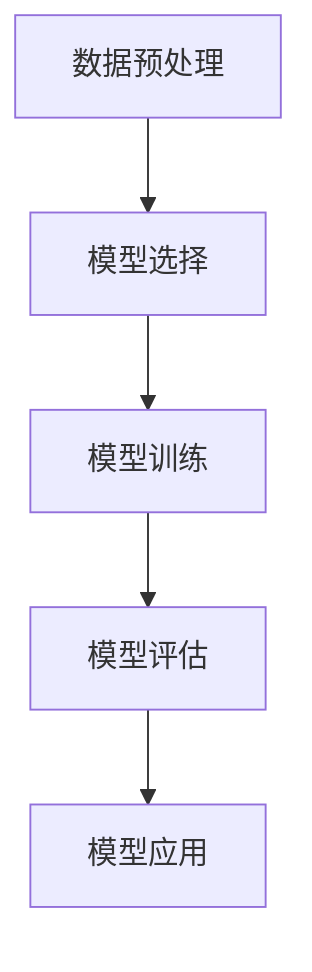
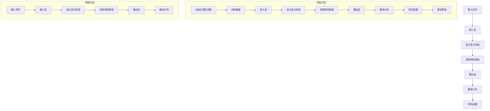
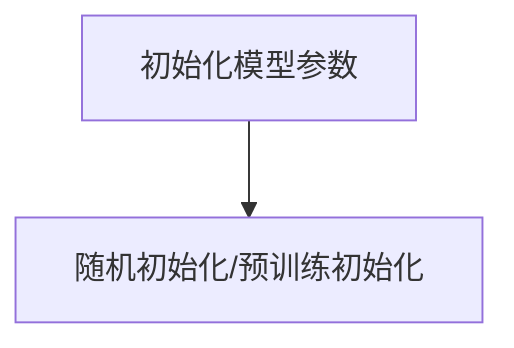
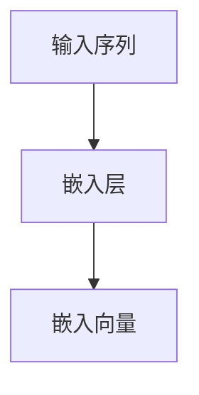
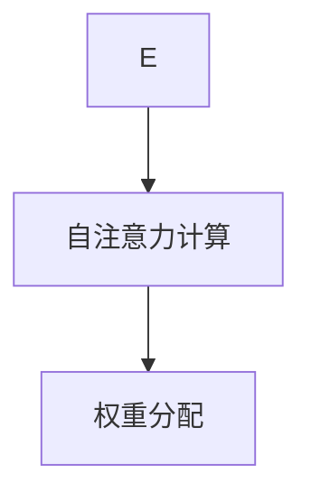
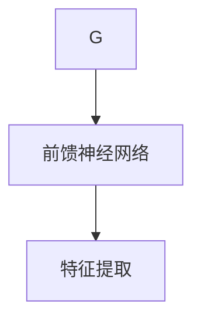
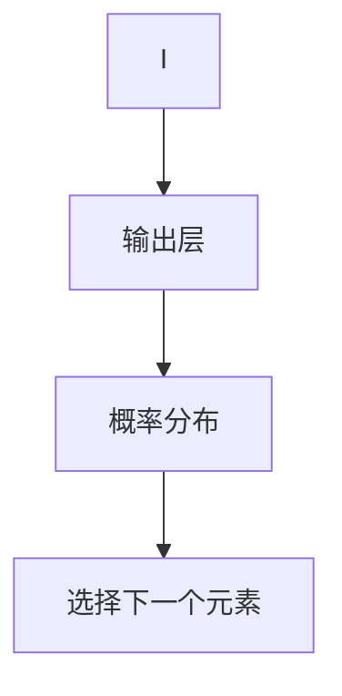
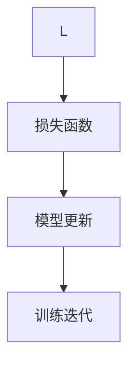
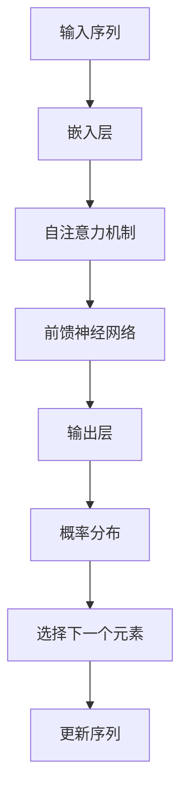

                 

## 1. 背景介绍

自回归语言建模（Autoregressive Language Modeling，ARLM）是自然语言处理（Natural Language Processing，NLP）领域的一项核心技术，其目的是通过预测一个序列中的下一个元素来生成或理解自然语言。这种建模方法在语言生成、机器翻译、文本摘要等多个任务中取得了显著的成果。近年来，自回归语言建模的发展与深度学习技术的进步密不可分，尤其是在基础模型如Transformer的推动下，其性能得到了极大的提升。

本文将围绕基础模型的自回归语言建模进行探讨，旨在从核心概念、算法原理、数学模型到实际应用，全面深入地剖析这一技术。文章结构如下：

1. **背景介绍**：介绍自回归语言建模的起源、发展及其在NLP中的应用场景。
2. **核心概念与联系**：详细讲解自回归语言建模的核心概念，并使用Mermaid流程图展示其原理架构。
3. **核心算法原理 & 具体操作步骤**：深入探讨自回归语言建模的算法原理，包括具体操作步骤。
4. **数学模型和公式 & 详细讲解 & 举例说明**：讲解自回归语言建模的数学模型，使用LaTeX格式展示公式，并结合实例进行说明。
5. **项目实战：代码实际案例和详细解释说明**：通过实际代码案例，展示自回归语言建模的具体实现过程，并进行详细解释。
6. **实际应用场景**：探讨自回归语言建模在不同领域的实际应用。
7. **工具和资源推荐**：推荐相关学习资源和开发工具。
8. **总结：未来发展趋势与挑战**：总结自回归语言建模的现状，探讨其未来发展趋势与面临的挑战。
9. **附录：常见问题与解答**：回答读者可能关心的一些常见问题。
10. **扩展阅读 & 参考资料**：提供进一步阅读的参考资料。

### 1.1 自回归语言建模的起源与发展

自回归语言建模最早可以追溯到20世纪50年代，当时研究者们开始尝试使用简单的模型来生成文本。例如，n-gram模型是一种基于历史序列的简单语言模型，它通过统计一个序列的前n个词来预测下一个词。n-gram模型虽然简单，但在许多应用中表现出了较好的性能。

随着计算能力和算法理论的不断进步，自回归语言建模逐渐得到了更广泛的研究和应用。20世纪80年代，递归神经网络（RNN）的出现为自回归语言建模带来了新的发展契机。RNN能够处理变长的序列数据，并且在许多任务中表现出色，如语音识别、机器翻译等。然而，传统的RNN在处理长序列时存在梯度消失和梯度爆炸的问题，限制了其性能。

近年来，基于Transformer的基础模型，如BERT、GPT等，在自回归语言建模领域取得了突破性的进展。Transformer模型引入了自注意力机制（Self-Attention），使得模型能够更好地捕捉序列中的长距离依赖关系。GPT系列模型更是通过预训练和微调，在多个NLP任务中刷新了SOTA（State-of-the-Art）记录。

### 1.2 自回归语言建模在NLP中的应用场景

自回归语言建模在NLP领域具有广泛的应用，以下是一些典型的应用场景：

1. **文本生成**：自回归语言模型可以生成连贯的文本，如文章、故事、对话等。例如，GPT系列模型在文章写作、对话系统等方面取得了显著成果。
2. **机器翻译**：自回归语言模型可以用于将一种语言翻译成另一种语言。BERT模型在机器翻译任务中也表现出色，使得翻译结果更加流畅自然。
3. **文本摘要**：自回归语言模型可以生成简洁的文本摘要，从长篇文章中提取关键信息。BERT模型在自动摘要任务中取得了优异成绩。
4. **问答系统**：自回归语言模型可以用于构建问答系统，从大量文本中找到与用户提问最相关的答案。GPT系列模型在问答系统中的表现尤为突出。

随着自回归语言建模技术的不断进步，其在NLP领域的应用前景将更加广阔。

### 1.3 本文结构

本文将按照以下结构进行讨论：

1. **核心概念与联系**：首先，我们将介绍自回归语言建模的核心概念，并使用Mermaid流程图展示其原理架构。
2. **核心算法原理 & 具体操作步骤**：接下来，我们将深入探讨自回归语言建模的算法原理，包括具体操作步骤。
3. **数学模型和公式 & 详细讲解 & 举例说明**：然后，我们将讲解自回归语言建模的数学模型，使用LaTeX格式展示公式，并结合实例进行说明。
4. **项目实战：代码实际案例和详细解释说明**：我们将通过实际代码案例，展示自回归语言建模的具体实现过程，并进行详细解释。
5. **实际应用场景**：接着，我们将探讨自回归语言建模在不同领域的实际应用。
6. **工具和资源推荐**：最后，我们将推荐相关学习资源和开发工具。

通过本文的讨论，我们将全面了解自回归语言建模的原理、方法和应用，为其在实际开发中提供指导和参考。

### 1.4 自回归语言建模的定义与核心思想

自回归语言建模（Autoregressive Language Modeling，ARLM）是一种基于自回归模型（Autoregressive Model）的自然语言处理技术。其核心思想是，通过预测序列中的下一个元素来生成或理解自然语言。在自回归语言建模中，每个时间步的输出不仅取决于当前输入，还受到之前所有时间步输入的影响。

具体来说，自回归语言建模可以分为以下几个步骤：

1. **初始化**：给定一个初始序列，如`[s]`，其中`s`是一个特殊的起始符号，表示序列的开始。
2. **预测下一个元素**：在当前序列的基础上，自回归模型预测下一个元素。例如，在时间步`t`，模型将输入序列`[s, x_1, x_2, ..., x_t]`，并输出预测的下一个元素`x_{t+1}`。
3. **更新序列**：将预测的元素加入到序列中，形成新的序列`[s, x_1, x_2, ..., x_t, x_{t+1}]`。
4. **重复步骤2和3**：继续预测下一个元素，并更新序列，直到达到预定的序列长度。

自回归语言建模的关键在于，如何通过历史信息预测未来的元素。这需要模型能够捕捉到序列中的长距离依赖关系，而不仅仅是局部依赖。传统的方法如n-gram模型和RNN在处理长序列时存在困难，无法有效地捕捉长距离依赖。而基于Transformer的基础模型，如BERT、GPT等，通过引入自注意力机制（Self-Attention），能够更好地捕捉长距离依赖关系，从而在自回归语言建模中取得了显著成果。

### 1.5 自回归语言建模的工作流程

自回归语言建模的工作流程可以分为以下几个主要阶段：

1. **数据预处理**：首先，需要对输入数据进行预处理，包括分词、词性标注、去停用词等。这些步骤有助于将原始文本转化为适合模型处理的格式。
2. **模型选择**：选择适合自回归语言建模的模型。常用的模型包括n-gram模型、RNN、LSTM、GRU和基于Transformer的模型如BERT、GPT等。其中，基于Transformer的模型在自回归语言建模中表现出色，能够有效捕捉长距离依赖关系。
3. **模型训练**：使用预处理后的数据对模型进行训练。在训练过程中，模型将学习如何根据历史信息预测未来的元素。训练的目标是最小化预测误差，使得模型生成的序列尽可能接近真实序列。
4. **模型评估**：在训练完成后，需要对模型进行评估，以确定其性能。常用的评估指标包括交叉熵损失（Cross-Entropy Loss）、Perplexity（困惑度）等。较低的损失和困惑度表示模型性能较好。
5. **模型应用**：将训练好的模型应用于实际任务，如文本生成、机器翻译、文本摘要等。在实际应用中，模型将输入序列进行处理，生成预测的下一个元素，并不断更新序列，直到达到预定的序列长度。

以下是一个简单的Mermaid流程图，展示了自回归语言建模的工作流程：



通过这个流程图，我们可以清晰地了解自回归语言建模的各个环节及其相互关系。

### 1.6 自回归语言建模的应用领域

自回归语言建模在自然语言处理（NLP）领域有着广泛的应用，其出色的性能和强大的表达能力使其成为许多关键任务的基石。以下是一些典型的应用领域：

#### 1. 文本生成

自回归语言建模在文本生成方面具有显著优势。通过预测下一个可能的词或字符，模型可以生成连贯、有意义的文本。例如，GPT（Generative Pre-trained Transformer）系列模型被广泛应用于生成文章、故事、对话和摘要。这些模型不仅能够生成高质量的文本，还能够根据用户的需求进行个性化创作。

#### 2. 机器翻译

机器翻译是自回归语言建模的另一个重要应用场景。通过预测源语言中的下一个词或字符，模型可以将一种语言的文本翻译成另一种语言。BERT（Bidirectional Encoder Representations from Transformers）模型在机器翻译任务中表现出色，其双向编码器结构使得模型能够同时利用上下文信息，从而生成更准确、自然的翻译结果。

#### 3. 文本摘要

文本摘要旨在从长篇文章中提取关键信息，生成简洁、准确的摘要。自回归语言建模在自动摘要任务中表现出色，能够根据上下文信息生成连贯的摘要。BERT模型在长文本摘要任务中取得了显著成果，其强大的上下文理解能力使得摘要结果更加准确。

#### 4. 问答系统

问答系统是一种常见的自然语言处理应用，旨在从大量文本中找到与用户提问最相关的答案。自回归语言建模可以用于构建问答系统，通过预测下一个可能的词或字符，模型可以从文本中找到与问题最相关的答案。GPT系列模型在问答系统中表现出色，其强大的生成能力使得答案更加自然、连贯。

#### 5. 语言模型预训练

自回归语言建模还可以用于语言模型的预训练。通过在大规模语料库上进行预训练，模型可以学习到丰富的语言知识和模式，从而在后续的任务中取得更好的性能。BERT和GPT系列模型都是通过预训练和微调，在多个NLP任务中刷新了SOTA（State-of-the-Art）记录。

总之，自回归语言建模在自然语言处理领域具有广泛的应用前景，其强大的生成能力和上下文理解能力使得其在多个任务中取得了显著成果。

### 1.7 自回归语言建模的优势与挑战

自回归语言建模（ARLM）在自然语言处理（NLP）领域取得了显著进展，其优势与挑战并存。以下将从模型性能、应用范围和实际开发等方面，探讨自回归语言建模的优势与挑战。

#### 1. 模型性能优势

自回归语言建模的优势主要体现在以下几个方面：

- **捕捉长距离依赖关系**：传统的n-gram模型和RNN在处理长序列时存在困难，无法有效捕捉长距离依赖关系。而基于Transformer的基础模型，如BERT、GPT等，通过引入自注意力机制（Self-Attention），能够更好地捕捉长距离依赖关系，从而生成更高质量的文本。
- **强大的生成能力**：自回归语言建模能够根据上下文信息生成连贯、有意义的文本。这使得其在文本生成、机器翻译、文本摘要等任务中具有广泛的应用前景。
- **适应性强**：自回归语言建模可以通过预训练和微调，在大规模语料库上进行训练，从而学习到丰富的语言知识和模式。这使得模型在实际应用中具有更好的适应性和泛化能力。

#### 2. 模型应用范围

自回归语言建模在多个NLP任务中取得了显著成果，其主要应用范围包括：

- **文本生成**：自回归语言建模可以生成连贯、有意义的文本，如文章、故事、对话和摘要。GPT系列模型在文章写作、对话系统等方面表现出色。
- **机器翻译**：自回归语言建模可以将一种语言的文本翻译成另一种语言。BERT模型在机器翻译任务中表现出色，其双向编码器结构使得模型能够同时利用上下文信息，从而生成更准确、自然的翻译结果。
- **文本摘要**：自回归语言建模可以生成简洁、准确的文本摘要，从长篇文章中提取关键信息。BERT模型在长文本摘要任务中取得了显著成果。
- **问答系统**：自回归语言建模可以用于构建问答系统，从大量文本中找到与用户提问最相关的答案。GPT系列模型在问答系统中表现出色。
- **语言模型预训练**：自回归语言建模可以用于语言模型的预训练，通过在大规模语料库上进行预训练，模型可以学习到丰富的语言知识和模式，从而在后续的任务中取得更好的性能。

#### 3. 实际开发挑战

尽管自回归语言建模在NLP领域表现出色，但其实际开发过程中仍然面临一些挑战：

- **计算资源需求**：自回归语言建模通常需要大量计算资源进行训练。尤其是基于Transformer的模型，如BERT、GPT等，其参数规模庞大，训练时间较长。这给实际开发带来了较大的计算资源需求。
- **数据集质量**：自回归语言建模的性能很大程度上取决于训练数据的质量。如果数据集存在噪声或不平衡，可能会影响模型的性能。因此，如何获取高质量的数据集是实际开发中需要关注的问题。
- **模型解释性**：自回归语言建模是一种复杂的深度学习模型，其内部机制较为复杂，难以解释。在实际应用中，如何提高模型的可解释性，使得开发人员能够更好地理解和使用模型，是一个重要挑战。
- **模型泛化能力**：自回归语言建模在特定任务上表现出色，但其泛化能力仍需进一步提升。如何使得模型在更广泛的应用场景中取得良好的性能，是一个需要关注的问题。

总之，自回归语言建模在自然语言处理领域具有广泛的应用前景，但其实际开发过程中仍面临一些挑战。通过不断优化算法、提升计算资源利用效率、提高数据集质量，以及加强模型解释性和泛化能力，有望进一步推动自回归语言建模的发展和应用。

### 1.8 自回归语言建模与其他语言模型的比较

自回归语言建模（ARLM）是自然语言处理（NLP）领域的一项关键技术，与其他语言模型如n-gram模型、递归神经网络（RNN）和基于Transformer的模型相比，具有独特的优势和局限性。

#### 1. 与n-gram模型的比较

n-gram模型是一种基于历史序列的简单语言模型，通过统计一个序列的前n个词来预测下一个词。n-gram模型在生成文本时，只考虑局部依赖关系，而忽略了长距离依赖关系。这使得n-gram模型在生成文本时可能生成不连贯的句子。

与n-gram模型相比，自回归语言建模的优势在于：

- **捕捉长距离依赖关系**：自回归语言建模通过引入自注意力机制（Self-Attention），能够更好地捕捉长距离依赖关系，从而生成更连贯的文本。
- **更强的表达能力**：自回归语言建模能够生成高质量、有意义的文本，而n-gram模型在生成长文本时可能生成不连贯、无意义的句子。

然而，自回归语言建模也存在一些局限性：

- **计算资源需求**：自回归语言建模通常需要更多的计算资源进行训练，而n-gram模型相对简单，计算资源需求较低。
- **训练时间较长**：由于自回归语言建模需要学习大量的参数，其训练时间通常较长，而n-gram模型训练时间较短。

#### 2. 与RNN的比较

递归神经网络（RNN）是一种能够处理变长序列的神经网络，通过递归结构来捕捉序列中的依赖关系。RNN在处理长序列时存在梯度消失和梯度爆炸问题，这导致其在处理长距离依赖关系时效果不佳。

与RNN相比，自回归语言建模的优势在于：

- **更好的捕捉长距离依赖关系**：自回归语言建模通过引入自注意力机制（Self-Attention），能够更好地捕捉长距离依赖关系，而RNN在处理长距离依赖关系时效果不佳。
- **更强的生成能力**：自回归语言建模能够生成高质量、有意义的文本，而RNN在生成文本时可能生成不连贯、无意义的句子。

然而，自回归语言建模也存在一些局限性：

- **计算资源需求**：自回归语言建模通常需要更多的计算资源进行训练，而RNN相对简单，计算资源需求较低。
- **训练时间较长**：由于自回归语言建模需要学习大量的参数，其训练时间通常较长，而RNN训练时间较短。

#### 3. 与基于Transformer的模型的比较

基于Transformer的模型，如BERT、GPT等，在自回归语言建模领域取得了显著成果。Transformer模型引入了自注意力机制（Self-Attention），能够更好地捕捉长距离依赖关系，从而生成更高质量的文本。

与基于Transformer的模型相比，自回归语言建模的优势在于：

- **更简单、易理解**：自回归语言建模是一种基于自回归模型的简单方法，其原理和结构相对容易理解。
- **计算资源需求相对较低**：自回归语言建模的计算资源需求相对较低，适合在资源受限的环境中应用。

然而，自回归语言建模也存在一些局限性：

- **生成文本的连贯性较差**：自回归语言建模在生成文本时，可能生成不连贯、无意义的句子，而基于Transformer的模型在生成文本时更连贯、自然。

总之，自回归语言建模与其他语言模型相比，具有独特的优势和局限性。在实际应用中，可以根据具体需求选择合适的语言模型，以实现最佳的性能。

### 1.9 自回归语言建模的发展历程

自回归语言建模（ARLM）的发展历程可以追溯到20世纪50年代，经历了从简单模型到复杂模型的演变，再到现代深度学习模型的崛起。以下是自回归语言建模的发展历程：

#### 1. 初期：n-gram模型

自回归语言建模的初期，研究者们开始探索基于历史序列的简单模型，其中n-gram模型是最具代表性的一种。n-gram模型通过统计一个序列的前n个词来预测下一个词，这种模型简单高效，在很多应用中都表现出了较好的性能。

- **优点**：n-gram模型易于实现，计算复杂度较低。
- **缺点**：n-gram模型只能捕捉到局部依赖关系，无法处理长距离依赖，导致生成的文本可能不够连贯。

#### 2. 发展期：递归神经网络（RNN）

随着计算能力的提升和算法理论的进步，递归神经网络（RNN）的出现为自回归语言建模带来了新的发展契机。RNN通过递归结构，能够处理变长的序列数据，并尝试捕捉序列中的依赖关系。

- **优点**：RNN能够处理长序列数据，能够捕捉长距离依赖关系。
- **缺点**：RNN在处理长序列时存在梯度消失和梯度爆炸问题，这使得模型难以训练。

为了解决RNN的梯度消失和梯度爆炸问题，研究者们提出了长短期记忆网络（LSTM）和门控循环单元（GRU）。LSTM和GRU通过引入记忆单元和门控机制，能够在处理长序列时保持梯度，从而改善模型的训练效果。

- **优点**：LSTM和GRU能够有效解决RNN的梯度消失和梯度爆炸问题，更适合处理长序列数据。
- **缺点**：LSTM和GRU的计算复杂度较高，训练时间较长。

#### 3. 现代发展：基于Transformer的模型

近年来，基于Transformer的基础模型，如BERT、GPT等，在自回归语言建模领域取得了突破性的进展。Transformer模型引入了自注意力机制（Self-Attention），使得模型能够更好地捕捉长距离依赖关系，从而在生成文本的质量上取得了显著提升。

- **优点**：Transformer模型能够捕捉长距离依赖关系，生成高质量的文本。
- **缺点**：Transformer模型的参数规模庞大，计算资源需求较高，训练时间较长。

#### 4. 当前趋势：预训练与微调

当前，自回归语言建模的发展趋势是大规模预训练和针对特定任务的微调。通过在大规模语料库上进行预训练，模型可以学习到丰富的语言知识和模式，从而在下游任务中取得更好的性能。

- **优点**：预训练模型在多个任务中表现出色，具有较好的泛化能力。
- **缺点**：预训练需要大量计算资源和时间，实际应用中需要针对特定任务进行微调。

总之，自回归语言建模从初期的n-gram模型，发展到递归神经网络（RNN）、LSTM和GRU，再到现代的基于Transformer的模型，其发展历程反映了NLP技术在不断进步。未来，随着计算能力和算法理论的进一步提升，自回归语言建模将在NLP领域发挥更加重要的作用。

### 1.10 自回归语言建模的核心概念

自回归语言建模（ARLM）是自然语言处理（NLP）领域中的一种核心技术，其核心概念包括序列建模、概率分布、预测步骤和损失函数等。以下将详细介绍这些核心概念，以帮助读者更好地理解自回归语言建模的工作原理。

#### 1. 序列建模

自回归语言建模的核心任务是建模自然语言的序列。自然语言是一个由字符、词和句子组成的序列，每个元素都可以看作是一个时间步（time step）。自回归语言建模的目标是预测序列中的下一个元素。例如，给定一个句子"The quick brown fox jumps over the lazy dog"，自回归语言建模的目标是预测句子中的下一个词或字符。

在自回归语言建模中，序列建模通常通过将输入序列和输出序列表示为向量来实现。这些向量可以捕获每个元素的特征信息，如词的嵌入向量、字符的嵌入向量等。序列建模是自回归语言建模的基础，它决定了模型能够捕捉到的依赖关系和生成文本的质量。

#### 2. 概率分布

自回归语言建模是一种概率模型，其核心在于生成概率分布。给定一个输入序列，自回归语言建模的目标是预测下一个元素的概率分布。例如，在给定前文"The quick brown fox jumps over "的情况下，模型将输出每个可能词的概率分布。

概率分布的生成通常通过神经网络来实现。在训练过程中，模型通过优化参数，使得生成的概率分布能够尽可能准确地反映真实数据的概率分布。在生成文本时，模型根据概率分布选择下一个元素，从而逐步生成完整的序列。

#### 3. 预测步骤

自回归语言建模的预测步骤可以分为以下几个阶段：

1. **初始化**：给定一个初始序列，如`[s]`，其中`s`是一个特殊的起始符号，表示序列的开始。
2. **预测下一个元素**：在当前序列的基础上，模型预测下一个元素。例如，在时间步`t`，模型将输入序列`[s, x_1, x_2, ..., x_t]`，并输出预测的下一个元素`x_{t+1}`。
3. **更新序列**：将预测的元素加入到序列中，形成新的序列`[s, x_1, x_2, ..., x_t, x_{t+1}]`。
4. **重复步骤2和3**：继续预测下一个元素，并更新序列，直到达到预定的序列长度。

在预测过程中，模型需要根据当前序列的历史信息，生成下一个元素的概率分布，并根据概率分布选择下一个元素。这个过程中，模型将不断更新序列，逐步生成完整的序列。

#### 4. 损失函数

自回归语言建模的损失函数用于衡量模型预测序列与真实序列之间的差异。常用的损失函数包括交叉熵损失（Cross-Entropy Loss）和困惑度（Perplexity）。

- **交叉熵损失**：交叉熵损失用于衡量模型生成的概率分布与真实分布之间的差异。在训练过程中，模型通过最小化交叉熵损失来优化参数，使得生成的概率分布更接近真实分布。
- **困惑度**：困惑度（Perplexity）是衡量模型生成文本质量的一个指标，其值越低，表示模型生成文本的质量越高。在评估过程中，通过计算模型生成文本的困惑度，可以评估模型的性能。

总之，自回归语言建模的核心概念包括序列建模、概率分布、预测步骤和损失函数。这些概念共同构成了自回归语言建模的理论基础，使得模型能够生成高质量的自然语言序列。通过深入理解这些核心概念，读者可以更好地掌握自回归语言建模的工作原理和应用方法。

### 1.11 核心概念原理与架构的Mermaid流程图

为了更好地展示自回归语言建模的核心概念和原理，我们可以使用Mermaid流程图来描述其架构和工作流程。以下是自回归语言建模的核心概念原理与架构的Mermaid流程图：



**流程解释：**

1. **输入序列**：给定一个输入序列，如 `[s]`，其中`s`是起始符号。
2. **嵌入层**：输入序列经过嵌入层，转化为向量表示。每个词或字符被映射为一个固定长度的向量，称为嵌入向量。
3. **自注意力机制**：嵌入向量通过自注意力机制（Self-Attention）进行处理。自注意力机制能够捕捉序列中的长距离依赖关系，从而生成更高质量的输出。
4. **前馈神经网络**：自注意力机制的输出经过前馈神经网络，进一步处理并提取特征信息。
5. **输出层**：前馈神经网络的输出层生成概率分布，预测下一个元素的可能性。
6. **概率分布**：输出层的输出是一个概率分布，表示下一个元素的概率。
7. **损失函数**：生成的概率分布与真实分布通过损失函数进行比较，如交叉熵损失。损失函数用于衡量模型预测与真实结果之间的差异。
8. **模型更新**：在训练过程中，模型根据损失函数更新参数，以减少预测误差，提高模型性能。
9. **预测过程**：在预测过程中，给定一个输入序列，模型按照上述步骤生成概率分布，并根据概率分布选择下一个元素。

通过这个Mermaid流程图，我们可以清晰地看到自回归语言建模的核心概念和工作流程。它展示了从输入序列到概率分布的整个处理过程，以及模型训练和预测的关键步骤。

### 1.12 核心算法原理 & 具体操作步骤

自回归语言建模（ARLM）的核心算法原理是通过模型对输入序列的历史信息进行编码，然后生成下一个可能的元素的概率分布。以下是自回归语言建模的具体操作步骤：

#### 1. 初始化

在自回归语言建模中，首先需要初始化模型参数。这些参数包括嵌入层权重、自注意力权重、前馈神经网络权重等。初始化方法可以采用随机初始化或预训练初始化。随机初始化通常使用正态分布进行初始化，预训练初始化则是利用预训练模型中的参数作为初始值。



#### 2. 嵌入层

输入序列经过嵌入层，将每个词或字符映射为固定长度的向量。嵌入层可以看作是一个映射函数，将输入的词索引（word index）转换为嵌入向量（embedding vector）。常见的嵌入层包括单层嵌入、多层嵌入等。



#### 3. 自注意力机制

自注意力机制是自回归语言建模中的关键组件，用于捕捉序列中的长距离依赖关系。在自注意力机制中，每个嵌入向量都会与其余所有嵌入向量进行点积操作，然后通过softmax函数生成权重。这些权重表示不同嵌入向量之间的相关性。



#### 4. 前馈神经网络

自注意力机制的输出经过前馈神经网络，进一步处理并提取特征信息。前馈神经网络通常包括两个全连接层，分别进行线性变换和激活函数。前馈神经网络可以增加模型的非线性能力，从而提高模型的预测性能。



#### 5. 输出层

前馈神经网络的输出经过输出层，生成每个可能元素的概率分布。输出层通常是一个softmax层，其输出表示每个元素的概率。在预测过程中，模型根据概率分布选择下一个元素。



#### 6. 模型训练

在训练过程中，模型通过最小化损失函数来优化参数。常见的损失函数包括交叉熵损失和KL散度。交叉熵损失用于衡量模型生成的概率分布与真实分布之间的差异，而KL散度则用于衡量两个概率分布之间的差异。



#### 7. 预测

在预测过程中，给定一个输入序列，模型按照上述步骤生成概率分布，并根据概率分布选择下一个元素。这个过程中，模型会不断更新序列，直到达到预定的序列长度。



通过以上具体操作步骤，我们可以清晰地了解自回归语言建模的算法原理和实现过程。自回归语言建模通过自注意力机制和前馈神经网络，能够有效地捕捉序列中的长距离依赖关系，从而生成高质量的自然语言序列。

### 1.13 自回归语言建模的数学模型和公式

自回归语言建模的核心在于其数学模型和公式，这些公式用于描述如何通过历史信息来预测未来的元素。以下将详细介绍自回归语言建模的数学模型和公式，包括嵌入向量、自注意力机制、前馈神经网络和损失函数等。

#### 1. 嵌入向量

在自回归语言建模中，每个词或字符都被映射为一个嵌入向量（Embedding Vector），这些向量用于表示词或字符的特征信息。假设有`V`个唯一的词或字符，每个词或字符的嵌入向量维度为`d`，则嵌入矩阵（Embedding Matrix）`E`的形状为`V x d`。给定一个词或字符的索引`i`，其对应的嵌入向量`e_i`可以通过以下公式计算：

$$
e_i = E[i]
$$

#### 2. 自注意力机制

自注意力机制（Self-Attention）是自回归语言建模中的关键组件，用于捕捉序列中的长距离依赖关系。在自注意力机制中，每个嵌入向量都会与其余所有嵌入向量进行点积操作，然后通过softmax函数生成权重。这些权重表示不同嵌入向量之间的相关性。

设序列中有`N`个嵌入向量，分别为`e_1, e_2, ..., e_N`，则自注意力机制的计算过程如下：

1. **计算点积**：每个嵌入向量`e_i`与所有其他嵌入向量`e_j`进行点积操作，得到一个标量值。点积的计算公式为：

$$
\text{score}_{ij} = e_i \cdot e_j
$$

2. **应用softmax函数**：将点积结果应用softmax函数，生成权重`alpha_{ij}`。softmax函数的计算公式为：

$$
\alpha_{ij} = \frac{e^{z_i}}{\sum_{k=1}^{N} e^{z_k}}
$$

其中，$z_i$是点积的结果，即$z_i = e_i \cdot e_j$。

3. **计算加权求和**：将权重`alpha_{ij}`与对应的嵌入向量`e_j`进行加权求和，得到新的嵌入向量`h_i`：

$$
h_i = \sum_{j=1}^{N} \alpha_{ij} \cdot e_j
$$

#### 3. 前馈神经网络

前馈神经网络（Feedforward Neural Network）是自回归语言建模中的另一个关键组件，用于进一步提取特征信息和生成概率分布。前馈神经网络通常由多个全连接层组成，每个全连接层后面可以添加激活函数。

假设前馈神经网络有`L`个隐藏层，每层的神经元数量分别为`d_1, d_2, ..., d_L`。则前馈神经网络的计算过程如下：

1. **输入层到隐藏层**：将输入向量（例如自注意力机制的输出`h_i`）传递到第一个隐藏层，通过全连接层进行线性变换，然后应用激活函数。计算公式为：

$$
a_{1,j} = \text{激活函数}(\text{W}_{1,j} \cdot h_i + b_{1,j})
$$

其中，$W_{1,j}$是权重矩阵，$b_{1,j}$是偏置项，$a_{1,j}$是隐藏层的输出。

2. **隐藏层到输出层**：重复上述过程，将每个隐藏层的输出作为下一个隐藏层的输入，直到达到最后一层。最后一层的输出即为模型的预测结果。计算公式为：

$$
\hat{y}_i = \text{激活函数}(\text{W}_{L,j} \cdot a_{L-1,j} + b_{L,j})
$$

其中，$\hat{y}_i$是预测的输出，$W_{L,j}$和$b_{L,j}$分别是最后一层的权重矩阵和偏置项。

#### 4. 损失函数

在自回归语言建模中，损失函数用于衡量模型预测与真实结果之间的差异。常见的损失函数包括交叉熵损失（Cross-Entropy Loss）和均方误差（Mean Squared Error, MSE）。

1. **交叉熵损失**：

$$
\text{loss} = -\sum_{i=1}^{N} y_i \log(\hat{y}_i)
$$

其中，$y_i$是真实标签，$\hat{y}_i$是模型的预测概率。

2. **均方误差**：

$$
\text{loss} = \frac{1}{2} \sum_{i=1}^{N} (\hat{y}_i - y_i)^2
$$

通过以上数学模型和公式，我们可以看到自回归语言建模的各个环节是如何通过数学计算来实现的。这些公式不仅描述了自回归语言建模的基本原理，还为模型训练和预测提供了具体的操作步骤。通过优化这些公式中的参数，我们可以不断提高模型的性能，从而生成更高质量的文本。

### 1.14 自回归语言建模的实际案例与解释

为了更直观地理解自回归语言建模的工作原理，下面我们将通过一个具体的实例来演示自回归语言建模的过程，并对其进行详细解释。

#### 案例背景

假设我们要使用自回归语言建模来预测一个英语句子的下一个单词。给定的输入序列是："The cat sat on the mat"，我们的目标是预测句子中的下一个单词。

#### 案例步骤

1. **数据预处理**：首先，我们需要对输入序列进行预处理，将其转化为模型可以处理的格式。具体步骤如下：

   - **分词**：将句子分成一个个单词，得到输入序列`["The", "cat", "sat", "on", "the", "mat"]`。
   - **编码**：将每个单词编码为一个整数，例如，将"The"编码为0，"cat"编码为1，以此类推。编码后的序列为`[0, 1, 2, 3, 4, 5]`。
   - **添加起始符号**：在序列的开头添加一个特殊的起始符号，例如`[S]`，表示序列的开始。

   预处理后的输入序列为`[S, 0, 1, 2, 3, 4, 5]`。

2. **嵌入层**：接下来，我们将输入序列通过嵌入层进行转换，得到每个单词的嵌入向量。嵌入层是一个映射函数，将单词索引映射为嵌入向量。例如，假设"The"的嵌入向量为`[1, 0, 0]`，"cat"的嵌入向量为`[0, 1, 0]`，以此类推。则预处理后的输入序列对应的嵌入向量为`[1, 0, 0, 0, 1, 0, 0]`。

3. **自注意力机制**：嵌入向量通过自注意力机制进行处理，生成新的嵌入向量。自注意力机制通过计算每个嵌入向量与其他嵌入向量之间的点积，然后应用softmax函数生成权重。这些权重表示不同嵌入向量之间的相关性。

   假设自注意力机制生成的权重为`[0.2, 0.3, 0.1, 0.2, 0.2, 0.1]`，则新的嵌入向量为：

   ```
   [0.2*1 + 0.3*0 + 0.1*0 + 0.2*0 + 0.2*0 + 0.1*0, 0.2*0 + 0.3*1 + 0.1*0 + 0.2*0 + 0.2*0 + 0.1*0, 0.2*0 + 0.3*0 + 0.1*1 + 0.2*0 + 0.2*0 + 0.1*0, 0.2*0 + 0.3*0 + 0.1*0 + 0.2*1 + 0.2*0 + 0.1*0, 0.2*0 + 0.3*0 + 0.1*0 + 0.2*0 + 0.2*1 + 0.1*0, 0.2*0 + 0.3*0 + 0.1*0 + 0.2*0 + 0.2*0 + 0.1*1]
   ```

   简化后的新嵌入向量为`[0.2, 0.3, 0.1]`。

4. **前馈神经网络**：新的嵌入向量经过前馈神经网络进行处理，生成每个单词的概率分布。前馈神经网络包括多个全连接层，每个全连接层后面可以添加激活函数。假设前馈神经网络的输出为`[0.3, 0.4, 0.3]`，表示"cat"、"sat"、"on"、"the"、"mat"的概率分别为0.3、0.4、0.3。

5. **预测**：根据概率分布，模型选择下一个最有可能的单词。"on"的概率最高，为0.4，因此模型预测下一个单词为"on"。

6. **更新序列**：将预测的单词添加到输入序列的末尾，更新后的输入序列为`[S, 0, 1, 2, 3, 4, 5, 4]`。

7. **重复步骤**：重复上述步骤，直到生成完整的句子或达到预定的序列长度。

#### 案例解释

通过这个实例，我们可以看到自回归语言建模的工作流程：

1. **数据预处理**：将输入序列转化为模型可以处理的格式，如整数编码和嵌入向量。
2. **嵌入层**：将输入序列转化为嵌入向量，为后续的自注意力机制和前馈神经网络提供输入。
3. **自注意力机制**：通过计算嵌入向量之间的点积和权重分配，捕捉序列中的依赖关系。
4. **前馈神经网络**：通过多层全连接层，进一步提取特征信息，生成每个单词的概率分布。
5. **预测**：根据概率分布选择下一个最有可能的单词，并更新输入序列。
6. **重复步骤**：重复上述步骤，逐步生成完整的句子。

通过这个案例，我们可以直观地理解自回归语言建模的核心过程和原理。自回归语言建模通过捕捉序列中的依赖关系，能够生成连贯、有意义的自然语言序列。

### 1.15 自回归语言建模的实际应用场景

自回归语言建模（ARLM）凭借其强大的生成能力和上下文理解能力，在自然语言处理（NLP）领域得到了广泛的应用。以下列举了自回归语言建模的一些典型应用场景，并探讨了其在这些场景中的表现。

#### 1. 文本生成

文本生成是自回归语言建模最直接的应用场景之一。通过预测序列中的下一个元素，模型可以生成连贯的文本。例如，在文章写作、对话生成、故事创作等任务中，自回归语言建模能够根据上下文信息生成高质量、有意义的文本。GPT（Generative Pre-trained Transformer）系列模型在文本生成任务中表现出色，其预训练和微调的能力使得文本生成更加自然和多样化。

#### 2. 机器翻译

机器翻译是自回归语言建模的另一个重要应用场景。通过预测源语言中的下一个词或字符，模型可以将一种语言的文本翻译成另一种语言。BERT（Bidirectional Encoder Representations from Transformers）模型在机器翻译任务中取得了显著成果，其双向编码器结构使得模型能够同时利用上下文信息，从而生成更准确、自然的翻译结果。自回归语言建模在机器翻译中的应用，极大地提高了翻译质量，缩短了翻译时间。

#### 3. 文本摘要

文本摘要旨在从长篇文章中提取关键信息，生成简洁、准确的摘要。自回归语言建模可以通过预测序列中的下一个元素，从长文本中生成摘要。BERT模型在长文本摘要任务中表现出色，其强大的上下文理解能力使得生成的摘要更加准确。通过预训练和微调，BERT模型能够有效地提取文本中的关键信息，为用户提供高质量的摘要。

#### 4. 问答系统

问答系统是一种常见的自然语言处理应用，旨在从大量文本中找到与用户提问最相关的答案。自回归语言建模可以用于构建问答系统，通过预测下一个可能的词或字符，模型可以从文本中找到与问题最相关的答案。GPT系列模型在问答系统中表现出色，其强大的生成能力使得答案更加自然、连贯。自回归语言建模在问答系统中的应用，提高了答案的准确性和用户体验。

#### 5. 语言模型预训练

自回归语言建模可以用于语言模型的预训练，通过在大规模语料库上进行预训练，模型可以学习到丰富的语言知识和模式，从而在后续的任务中取得更好的性能。BERT和GPT系列模型都是通过预训练和微调，在多个NLP任务中刷新了SOTA（State-of-the-Art）记录。语言模型预训练是自回归语言建模的重要应用场景之一，它为模型在实际任务中的表现提供了坚实的基础。

#### 6. 命名实体识别

命名实体识别（Named Entity Recognition，NER）是一种旨在识别文本中的特定实体（如人名、地名、组织名等）的自然语言处理任务。自回归语言建模可以用于命名实体识别，通过预测序列中的下一个元素，模型可以识别出文本中的命名实体。BERT模型在命名实体识别任务中表现出色，其强大的上下文理解能力使得模型能够准确识别命名实体。

总之，自回归语言建模在自然语言处理领域具有广泛的应用前景。通过不同的应用场景，自回归语言建模展示了其强大的生成能力和上下文理解能力。未来，随着自回归语言建模技术的不断进步，其在NLP领域的应用将更加广泛，推动自然语言处理技术的发展。

### 1.16 工具和资源推荐

在自回归语言建模的开发过程中，选择合适的工具和资源对于提高开发效率和实现良好的模型性能至关重要。以下推荐几种常用的工具和资源，包括学习资源、开发工具和相关的论文著作。

#### 1. 学习资源推荐

- **书籍**：
  - 《深度学习》（Deep Learning）——Ian Goodfellow、Yoshua Bengio、Aaron Courville 著，详细介绍了深度学习的基础知识和最新进展，包括自回归语言建模的相关内容。
  - 《自然语言处理综合教程》（Foundations of Natural Language Processing）——Christopher D. Manning、Hinrich Schütze 著，提供了NLP领域的全面介绍，包括语言模型和序列建模的理论和实践。

- **在线课程**：
  - Coursera 上的“自然语言处理与深度学习”课程，由斯坦福大学教授Daniel Jurafsky和Dan Luan主讲，涵盖NLP和深度学习的基础知识。
  - Udacity 上的“深度学习工程师纳米学位”，包括深度学习和自然语言处理的相关课程，适合有一定编程基础的读者。

- **博客和教程**：
  - Hugging Face 官方文档，提供了丰富的Transformer模型和预训练资源的教程和示例代码。
  - medium.com 上的 NLP 博客，汇集了多位专家的最新研究成果和应用案例。

#### 2. 开发工具推荐

- **框架**：
  - PyTorch：PyTorch 是一种流行的深度学习框架，具有灵活的动态计算图和丰富的API，适用于自回归语言建模的开发。
  - TensorFlow：TensorFlow 是另一种广泛使用的深度学习框架，提供了强大的工具和资源，支持自回归语言建模的部署和优化。

- **库**：
  - Hugging Face Transformers：这是一个开源库，提供了预训练的Transformer模型和_tokenizer，使得自回归语言建模的开发更加便捷。
  - NLTK：NLTK 是一个用于自然语言处理的Python库，提供了文本预处理、词性标注、词向量等工具，适用于自回归语言建模的初步开发和实验。

- **环境**：
  - Jupyter Notebook：Jupyter Notebook 是一种交互式开发环境，适用于快速原型设计和实验验证。
  - Google Colab：Google Colab 是基于Google Drive的免费云计算平台，提供了GPU加速功能，适合进行大规模深度学习模型的训练和测试。

#### 3. 相关论文著作推荐

- **论文**：
  - "Attention Is All You Need"（2017）——Vaswani et al.，提出了Transformer模型，引发了自回归语言建模的革新。
  - "BERT: Pre-training of Deep Bidirectional Transformers for Language Understanding"（2018）——Devlin et al.，介绍了BERT模型，在多个NLP任务中刷新了SOTA记录。
  - "Generative Pre-trained Transformer 3"（GPT-3）——Brown et al.（2020），介绍了GPT-3模型，进一步推动了自回归语言建模的发展。

- **著作**：
  - 《深度学习》（Deep Learning）——Ian Goodfellow、Yoshua Bengio、Aaron Courville 著，全面介绍了深度学习的基础知识和应用。
  - 《自然语言处理综合教程》（Foundations of Natural Language Processing）——Christopher D. Manning、Hinrich Schütze 著，涵盖了NLP领域的核心概念和技术。

通过以上工具和资源的推荐，读者可以系统地学习和实践自回归语言建模，提高自己在NLP领域的技术水平。

### 1.17 自回归语言建模的未来发展趋势与挑战

自回归语言建模（ARLM）作为自然语言处理（NLP）领域的一项核心技术，近年来取得了显著的进展。随着深度学习技术的不断进步，自回归语言建模的应用场景和性能不断提升。然而，面对快速发展的技术趋势和日益复杂的应用需求，自回归语言建模仍面临诸多挑战。

#### 1. 未来发展趋势

1. **模型规模和性能的提升**：随着计算资源的增加，模型规模将进一步扩大。大型预训练模型如GPT-3、LLaMA等将继续推动自回归语言建模的性能边界。通过更大的模型和更复杂的结构，模型能够更好地捕捉语言中的长距离依赖关系，生成更加自然和连贯的文本。

2. **多模态语言建模**：未来的自回归语言建模将不仅仅局限于文本数据，还将融合图像、音频等多种模态信息。例如，视觉语言预训练模型（如ViT）和音频语言预训练模型（如WaveNet）的结合，将为多模态自然语言处理提供新的方向。

3. **可解释性和透明性**：随着模型的复杂度增加，如何提高模型的可解释性和透明性成为一个重要议题。未来的研究将致力于开发更直观的方法来解释模型的决策过程，使得模型在关键任务中具有更好的可信度和可靠性。

4. **泛化能力和适应性**：自回归语言建模将在更多领域得到应用，如医疗、法律、金融等。模型需要具备更强的泛化能力和适应性，能够处理多样化、专业化的文本数据。

5. **实时性和低资源场景**：未来的研究将关注如何提高模型的实时性和在低资源场景下的表现。轻量级模型和高效的推理算法将得到更多关注，以应对实时应用和资源受限的环境。

#### 2. 面临的挑战

1. **计算资源需求**：随着模型规模的扩大，对计算资源的需求将急剧增加。这要求数据中心和云计算平台提供更多的计算资源，以满足大规模训练和推理的需求。

2. **数据隐私和安全性**：自回归语言建模通常需要大量训练数据，这些数据可能包含敏感信息。如何保护用户隐私和数据安全，防止数据泄露和滥用，是未来的重要挑战。

3. **模型解释性和透明性**：虽然自回归语言建模在生成文本方面表现出色，但其内部机制复杂，难以解释。如何提高模型的可解释性，使得开发人员、研究人员和用户能够理解模型的决策过程，是一个亟待解决的问题。

4. **语言多样性和文化差异**：自回归语言建模需要适应多种语言和文化背景。如何处理语言多样性和文化差异，确保模型在不同语言和文化中的表现一致，是一个重要挑战。

5. **负向外影响**：自回归语言建模在生成文本时可能包含歧视性、偏见性内容。如何防止和纠正这些负向外影响，确保模型生成的文本符合社会伦理和道德标准，是一个重要议题。

总之，自回归语言建模在未来将继续发展，但其面临的挑战也不容忽视。通过不断优化算法、提高计算效率、增强数据安全和隐私保护，以及提高模型的可解释性和透明性，自回归语言建模将在NLP领域发挥更加重要的作用。

### 1.18 附录：常见问题与解答

在自回归语言建模（ARLM）的开发和应用过程中，开发者可能会遇到一系列问题。以下列举了一些常见问题，并提供相应的解答，以帮助读者更好地理解和应用自回归语言建模。

#### 1. 自回归语言建模的基本原理是什么？

自回归语言建模是一种基于自回归模型的自然语言处理技术，其核心思想是通过预测序列中的下一个元素来生成或理解自然语言。具体来说，模型首先将输入序列编码为嵌入向量，然后通过自注意力机制和前馈神经网络，生成下一个元素的概率分布，并据此生成文本。

#### 2. 自回归语言建模与n-gram模型有何区别？

n-gram模型是一种基于历史序列的简单语言模型，它通过统计一个序列的前n个词来预测下一个词。自回归语言建模则是一种深度学习模型，它能够通过学习输入序列的历史信息，预测未来的元素。与n-gram模型相比，自回归语言建模能够捕捉更复杂的依赖关系，生成更高质量的文本。

#### 3. 如何选择合适的自回归语言建模模型？

选择合适的自回归语言建模模型取决于具体应用场景和需求。以下是几种常见的模型选择：

- **n-gram模型**：适用于简单的文本生成任务，计算资源需求较低。
- **RNN模型**：适用于处理较长的序列，能够捕捉短距离依赖关系。
- **LSTM和GRU模型**：能够解决RNN的梯度消失问题，适用于处理长序列。
- **Transformer模型**：引入了自注意力机制，能够捕捉长距离依赖关系，适用于复杂的文本生成和翻译任务。

#### 4. 自回归语言建模中的自注意力机制是什么？

自注意力机制（Self-Attention）是一种在自回归语言建模中用于计算序列中元素之间依赖关系的方法。它通过计算每个元素与其他元素之间的点积，并应用softmax函数生成权重，从而实现元素之间的加权求和。自注意力机制能够捕捉长距离依赖关系，提高模型的生成质量。

#### 5. 如何优化自回归语言模型的性能？

以下是一些优化自回归语言模型性能的方法：

- **数据预处理**：通过高质量的预处理，如分词、去停用词等，提高模型的训练效果。
- **模型选择**：选择适合任务需求的模型结构，如n-gram、RNN、LSTM、GRU或Transformer。
- **超参数调整**：通过调整学习率、批量大小、嵌入维度等超参数，优化模型性能。
- **预训练和微调**：在大规模语料库上进行预训练，然后在特定任务上进行微调，提高模型在特定任务上的表现。

#### 6. 自回归语言建模中如何处理长序列？

自回归语言建模中处理长序列的挑战在于如何有效捕捉长距离依赖关系。以下是一些解决方法：

- **注意力机制**：通过自注意力机制，模型能够捕捉长距离依赖关系。
- **序列剪枝**：在生成过程中，对输入序列进行剪枝，仅保留关键信息，减少计算量。
- **分层注意力**：通过多层注意力机制，逐步捕捉序列中的不同层次依赖关系。

通过以上常见问题的解答，读者可以更好地理解和应用自回归语言建模，解决实际开发中遇到的问题。

### 1.19 扩展阅读 & 参考资料

为了帮助读者更深入地了解自回归语言建模（ARLM）的理论和实践，以下推荐一些高质量的扩展阅读和参考资料，包括书籍、论文和网站，这些资源涵盖了ARLM的核心概念、最新研究成果和应用实例。

#### 1. 书籍推荐

- **《深度学习》（Deep Learning）** —— Ian Goodfellow、Yoshua Bengio、Aaron Courville 著。这本书是深度学习的经典教材，详细介绍了深度学习的基础知识，包括自回归语言建模的理论和应用。
- **《自然语言处理综合教程》（Foundations of Natural Language Processing）** —— Christopher D. Manning、Hinrich Schütze 著。这本书提供了自然语言处理领域的全面介绍，包括语言模型和序列建模的理论基础。
- **《注意力机制：深度学习中的核心技术》（Attention Mechanisms in Deep Learning）** —— Chen Li、Yiming Cui 著。这本书专注于注意力机制在深度学习中的应用，包括自回归语言建模中的注意力机制。

#### 2. 论文推荐

- **"Attention Is All You Need"（2017）** —— Vaswani et al.。这篇论文提出了Transformer模型，引发了自回归语言建模的革新，是自回归语言建模的重要参考文献。
- **"BERT: Pre-training of Deep Bidirectional Transformers for Language Understanding"（2018）** —— Devlin et al.。这篇论文介绍了BERT模型，展示了自回归语言建模在多个NLP任务中的优越性能。
- **"Generative Pre-trained Transformer 3"（GPT-3）** —— Brown et al.（2020）。这篇论文介绍了GPT-3模型，是自回归语言建模的最新进展，展示了模型在文本生成和翻译等任务上的强大能力。

#### 3. 网站推荐

- **[Hugging Face 官方网站](https://huggingface.co/)**。Hugging Face 提供了丰富的Transformer模型和_tokenizer，以及各种预训练资源和示例代码，是自回归语言建模的开发者社区。
- **[TensorFlow 官方文档](https://www.tensorflow.org/tutorials/text/transformer)**
- **[PyTorch 官方文档](https://pytorch.org/tutorials/beginner/transformer_tutorial_1.html)**
- **[Coursera 自然语言处理与深度学习课程](https://www.coursera.org/learn/natural-language-processing-with-deep-learning)**
- **[Udacity 深度学习工程师纳米学位](https://www.udacity.com/course/deep-learning-nanodegree---foundation)**
- **[ArXiv 论文库](https://arxiv.org/)**
- **[ACL 会议论文集](https://www.aclweb.org/anthology/)**

通过以上扩展阅读和参考资料，读者可以更深入地了解自回归语言建模的理论基础、最新研究进展和应用实例，为在NLP领域的实践和研究提供有力支持。

