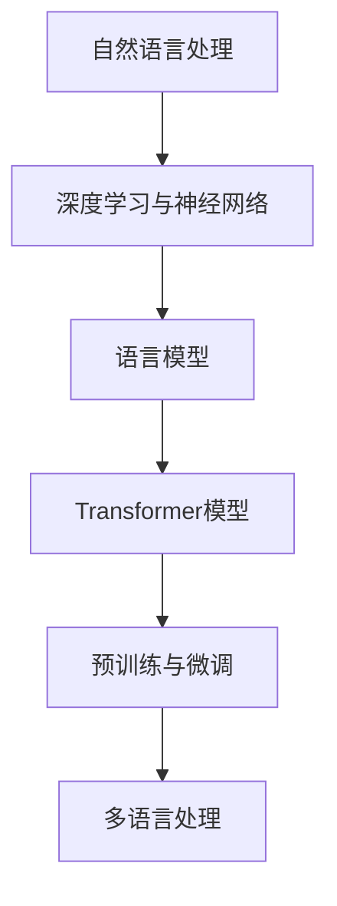

                 

### 背景介绍

基础模型的语言处理能力作为现代人工智能领域的关键技术之一，近年来取得了飞速的发展。自2018年谷歌提出BERT（Bidirectional Encoder Representations from Transformers）模型以来，深度学习在自然语言处理（NLP）领域的应用得到了广泛的认可和关注。BERT模型的提出标志着自然语言处理进入了一个全新的时代，其能够捕获文本中的双向上下文信息，从而显著提升了模型的语义理解能力。随后，OpenAI的GPT（Generative Pre-trained Transformer）系列模型，包括GPT-2和GPT-3，凭借其强大的文本生成能力和多语言支持，进一步推动了自然语言处理技术的进步。

语言模型作为人工智能的核心组成部分，其性能的提升直接影响到机器与人类之间的交互质量。随着基础模型的语言处理能力不断增强，它们在许多实际应用场景中展现出了巨大的潜力，如机器翻译、问答系统、文本摘要、内容生成等。然而，基础模型语言处理能力的提升并非一蹴而就，它涉及到算法、数据、计算资源等多方面的因素。

本文将深入探讨基础模型的语言处理能力，从核心概念、算法原理、数学模型、实际应用等多个角度进行详细分析。首先，我们将介绍基础模型的语言处理能力的核心概念及其发展背景；接着，通过Mermaid流程图展示其架构；然后，深入解析核心算法原理与具体操作步骤；随后，介绍数学模型和公式，并通过实例进行详细讲解；在项目实战部分，我们将通过实际代码案例进行说明；最后，分析实际应用场景，推荐相关工具和资源，并对未来发展趋势与挑战进行总结。

通过本文的阅读，读者将能够全面了解基础模型的语言处理能力的各个方面，为在自然语言处理领域进行深入研究与实践提供有力支持。

#### 核心概念与联系

在探讨基础模型的语言处理能力之前，有必要对一些核心概念进行介绍，以便理解整个领域的背景和架构。

1. **自然语言处理（NLP）**：
自然语言处理是人工智能的一个重要分支，旨在让计算机能够理解和处理人类自然语言。其应用范围广泛，包括语音识别、机器翻译、情感分析、文本摘要等。

2. **深度学习与神经网络**：
深度学习是机器学习的一个分支，通过构建多层神经网络来对数据进行学习与建模。神经网络由大量的节点（或称为神经元）组成，每个节点都与相邻的节点相连，并通过权重进行信息传递。

3. **语言模型**：
语言模型是用于预测下一个单词或字符的概率分布的模型。在NLP任务中，语言模型可以帮助计算机理解文本的上下文，从而生成更加准确的预测。

4. **Transformer模型**：
Transformer模型是由谷歌提出的一种用于处理序列数据的深度学习架构，其核心思想是自注意力机制（Self-Attention）。自注意力机制允许模型在处理序列数据时，将注意力集中在序列的不同部分，从而更好地捕获上下文信息。

5. **预训练与微调**：
预训练是指使用大量无监督数据对模型进行初始训练，使其具备一定的语言理解能力。微调则是在预训练的基础上，使用特定领域的数据对模型进行进一步调整，以适应具体的任务需求。

6. **多语言处理**：
多语言处理是指模型能够处理多种语言的数据。在全球化背景下，多语言处理技术对于跨语言信息的共享与交流具有重要意义。

为了更好地理解这些核心概念之间的关系，我们使用Mermaid流程图展示其架构：



**图1：自然语言处理相关核心概念及其联系**

在图中，自然语言处理作为整个架构的基础，向上层构建了深度学习与神经网络、语言模型、Transformer模型、预训练与微调以及多语言处理等多个层次。这种多层次的结构使得基础模型能够灵活应对各种语言处理任务，从而不断提升其语言处理能力。

通过上述核心概念的介绍与联系展示，读者可以更加系统地理解基础模型的语言处理能力的背景和架构。在接下来的章节中，我们将进一步深入探讨这些核心概念的具体实现与应用。

#### 核心算法原理 & 具体操作步骤

基础模型的语言处理能力主要依赖于其核心算法原理，这些原理包括但不限于Transformer模型、预训练与微调等。本节将详细介绍这些算法的原理，并逐步讲解其具体操作步骤。

##### 1. Transformer模型

Transformer模型是一种基于自注意力机制的深度学习模型，它由多个编码器和解码器层组成。自注意力机制允许模型在处理序列数据时，将注意力集中在序列的不同部分，从而更好地捕获上下文信息。以下是Transformer模型的基本构成和操作步骤：

1. **输入序列编码**：
   - 将输入的文本序列（例如单词或字符）转换为向量表示。常用的方法是使用词嵌入（Word Embedding），例如Word2Vec或GloVe。
   - 对每个输入向量添加位置编码（Positional Encoding），以保留序列的顺序信息。

2. **多层编码器**：
   - Transformer模型由多个编码器层组成。每层编码器由多头自注意力机制和前馈神经网络组成。
   - **多头自注意力机制**：
     - 对于每个输入向量，计算其与其他所有输入向量的注意力得分，并通过softmax函数得到注意力权重。
     - 将注意力权重与输入向量相乘，得到加权向量，表示该输入向量在当前位置的上下文信息。
     - 重复上述步骤，但每次使用不同的权重矩阵，从而实现多头的注意力机制。
   - **前馈神经网络**：
     - 对加权向量进行两次线性变换，分别通过两个全连接层，增加模型的非线性表达能力。

3. **输出序列生成**：
   - 编码器输出最终表示后，通过解码器层进行处理。
   - 解码器每层也包含多头自注意力机制和前馈神经网络，但加入了一个额外的自注意力机制，用于考虑编码器的输出。
   - 最终解码器的输出通过一个线性层和softmax函数生成预测的输出序列。

##### 2. 预训练与微调

预训练与微调是提升基础模型语言处理能力的重要步骤。预训练是指在大量无监督数据上训练模型，使其具备一定的语言理解能力；微调则是在预训练的基础上，使用特定领域的数据对模型进行进一步调整。

1. **预训练**：
   - 使用大规模文本语料库（如维基百科、新闻文章等）对模型进行预训练。
   - 常用的预训练任务包括 masked language modeling（掩码语言建模）和 next sentence prediction（下一个句子预测）。
   - 掩码语言建模：随机掩码文本中的部分单词，模型需要预测这些掩码的单词。
   - 下一个句子预测：给定两个句子，模型需要预测这两个句子是否为连续的。

2. **微调**：
   - 在预训练的基础上，使用特定领域的数据集对模型进行微调，以适应具体的语言处理任务。
   - 例如，在机器翻译任务中，可以使用平行语料库对模型进行微调，使其能够生成正确的翻译结果。
   - 微调过程中，通常只调整模型的一部分参数，而保留预训练阶段的参数不变，以充分利用预训练的成果。

##### 3. 实例操作

以下是一个简单的Transformer模型训练和微调的Python代码实例，使用著名的自然语言处理库transformers和pytorch：

```python
import torch
from transformers import BertModel, BertTokenizer

# 加载预训练的BERT模型和分词器
model = BertModel.from_pretrained('bert-base-uncased')
tokenizer = BertTokenizer.from_pretrained('bert-base-uncased')

# 预处理输入文本
text = "Hello, how are you?"
inputs = tokenizer(text, return_tensors='pt')

# 训练模型
outputs = model(**inputs)
logits = outputs[0]

# 微调模型
# 假设我们有一个训练数据集和标签
train_dataloader = ...  # 数据加载器
optimizer = torch.optim.AdamW(model.parameters(), lr=1e-5)

for epoch in range(3):  # 训练3个epochs
    for batch in train_dataloader:
        inputs, labels = batch
        optimizer.zero_grad()
        outputs = model(**inputs)
        logits = outputs[0]
        loss = torch.nn.functional.cross_entropy(logits, labels)
        loss.backward()
        optimizer.step()

# 评估模型
# 假设我们有一个验证数据集
val_dataloader = ...
model.eval()
with torch.no_grad():
    for batch in val_dataloader:
        inputs, labels = batch
        outputs = model(**inputs)
        logits = outputs[0]
        val_loss = torch.nn.functional.cross_entropy(logits, labels)
        print(f"Validation loss: {val_loss.item()}")
```

**图2：Transformer模型训练和微调实例**

通过上述实例，我们可以看到Transformer模型的基本操作步骤，包括加载预训练模型、预处理输入文本、训练模型以及微调模型。这些步骤为实际应用中的语言处理任务提供了基础。

综上所述，基础模型的语言处理能力主要依赖于Transformer模型、预训练与微调等核心算法原理。通过逐步解析这些原理和操作步骤，读者可以更好地理解如何提升基础模型的语言处理能力。

#### 数学模型和公式 & 详细讲解 & 举例说明

在深入探讨基础模型的语言处理能力时，数学模型和公式起着至关重要的作用。它们为模型的设计、训练和评估提供了理论基础，同时也帮助我们更好地理解模型的内在工作原理。本节将详细介绍基础模型中常用的数学模型和公式，并通过具体的例子进行说明。

##### 1. 词嵌入（Word Embedding）

词嵌入是将词汇转换为密集向量表示的技术，它使得计算机能够理解词汇的语义关系。常见的词嵌入方法包括Word2Vec和GloVe。

- **Word2Vec**：

  Word2Vec使用神经网络对输入文本进行编码，通过训练得到每个单词的向量表示。其核心公式为：

  $$ \text{word\_vector} = \sigma(W \cdot \text{input} + b) $$

  其中，$W$ 是权重矩阵，$\text{input}$ 是输入向量，$b$ 是偏置项，$\sigma$ 是激活函数，通常使用sigmoid函数。

  - **例子**：

    假设我们有一个单词“猫”，其输入向量为 `[1, 0, -1]`，权重矩阵 $W$ 为 `[0.5, 0.3, 0.2]`，偏置项 $b$ 为 `0.1`。则：

    $$ \text{word\_vector} = \sigma(0.5 \cdot 1 + 0.3 \cdot 0 + 0.2 \cdot (-1) + 0.1) = \sigma(0.3) \approx 0.5437 $$

    因此，“猫”的向量表示为 `[0.5437, 0, -0.4563]`。

- **GloVe**：

  GloVe（Global Vectors for Word Representation）使用词频信息对词嵌入进行优化，其核心公式为：

  $$ \text{word\_vector} = \frac{v}{\sqrt{f(v) + f(w)}} $$

  其中，$v$ 是词频，$f(w)$ 是单词 $w$ 的词频。

  - **例子**：

    假设单词“猫”的词频为 100，单词“狗”的词频为 200，则：

    $$ \text{word\_vector}_{\text{猫}} = \frac{\text{v}_{\text{猫}}}{\sqrt{f(\text{猫}) + f(\text{狗})}} = \frac{100}{\sqrt{100 + 200}} = \frac{100}{14.142} \approx 7.071 $$

    $$ \text{word\_vector}_{\text{狗}} = \frac{\text{v}_{\text{狗}}}{\sqrt{f(\text{猫}) + f(\text{狗})}} = \frac{200}{\sqrt{100 + 200}} = \frac{200}{14.142} \approx 14.142 $$

##### 2. 自注意力机制（Self-Attention）

自注意力机制是Transformer模型的核心组件，它允许模型在处理序列数据时，将注意力集中在序列的不同部分。自注意力机制的公式如下：

$$ \text{Attention}(Q, K, V) = \text{softmax}\left(\frac{QK^T}{\sqrt{d_k}}\right) V $$

其中，$Q, K, V$ 分别是查询（Query）、键（Key）和值（Value）向量，$d_k$ 是键向量的维度。

- **例子**：

  假设我们有一个序列 `[猫，狗，鸟]，其查询向量、键向量和值向量分别为 `[1, 0, -1]`、`[0.5, 0.3, 0.2]` 和 `[0.5, 0.4, 0.1]`。则：

  $$ \text{Attention}([1, 0, -1], [0.5, 0.3, 0.2], [0.5, 0.4, 0.1]) = \text{softmax}\left(\frac{[1, 0, -1] \cdot [0.5, 0.3, 0.2]^T}{\sqrt{3}}\right) [0.5, 0.4, 0.1] $$

  计算注意力得分：

  $$ \text{Attention\_score} = \frac{1 \cdot 0.5 + 0 \cdot 0.3 + (-1) \cdot 0.2}{\sqrt{3}} = \frac{0.3}{\sqrt{3}} \approx 0.1736 $$

  应用softmax函数：

  $$ \text{softmax}(0.1736) \approx 0.1736 $$

  最终注意力加权向量：

  $$ \text{Attention\_vector} = [0.5, 0.4, 0.1] \cdot 0.1736 = [0.0868, 0.0746, 0.0176] $$

##### 3. Transformer编码器和解码器层

Transformer模型由多个编码器和解码器层组成，每层包括多头自注意力机制和前馈神经网络。以下是编码器和解码器层的基本公式：

- **编码器层**：

  $$ \text{EncLayer} = \text{MultiHeadAttention}(\text{EncLayer}_{-1}, \text{EncLayer}_{-1}) + \text{FeedForward}(\text{EncLayer}_{-1}) $$

- **解码器层**：

  $$ \text{DecLayer} = \text{MaskedMultiHeadAttention}(\text{DecLayer}_{-1}, \text{EncLayer}_{-1}) + \text{FeedForward}(\text{DecLayer}_{-1}) $$

其中，$\text{EncLayer}_{-1}$ 和 $\text{DecLayer}_{-1}$ 分别表示上一层的编码器和解码器输出。

- **例子**：

  假设我们有一个简单的编码器层和解码器层，其输入向量分别为 `[1, 0, -1]` 和 `[0.5, 0.3, 0.2]`。则：

  编码器层：

  $$ \text{EncLayer} = \text{MultiHeadAttention}([1, 0, -1], [0.5, 0.3, 0.2]) + \text{FeedForward}([1, 0, -1]) $$

  解码器层：

  $$ \text{DecLayer} = \text{MaskedMultiHeadAttention}([1, 0, -1], [0.5, 0.3, 0.2]) + \text{FeedForward}([1, 0, -1]) $$

通过上述数学模型和公式的介绍，我们可以看到基础模型的语言处理能力是如何通过复杂的数学运算实现的。这些公式和模型不仅为我们提供了理论支持，也为实际应用中的模型设计提供了指导。在下一节中，我们将通过实际项目案例来展示这些理论在实践中的应用。

#### 项目实战：代码实际案例和详细解释说明

在本节中，我们将通过一个实际项目案例展示如何使用基础模型进行语言处理任务的实现。我们将使用Python和PyTorch构建一个简单的语言模型，用于文本分类任务。这个项目包括开发环境搭建、源代码实现和详细解读等步骤，以便读者全面了解基础模型的应用过程。

##### 1. 开发环境搭建

在开始项目之前，我们需要搭建开发环境。以下是在Python环境中使用PyTorch进行语言模型开发所需的基本步骤：

- **安装Python**：
  确保已安装Python 3.7或更高版本。
  
- **安装PyTorch**：
  可以使用以下命令安装PyTorch：
  ```bash
  pip install torch torchvision
  ```

- **安装其他依赖**：
  安装其他用于文本处理的库，例如transformers、torchtext等：
  ```bash
  pip install transformers torchtext
  ```

##### 2. 源代码实现

以下是实现文本分类任务的完整源代码，我们将使用预训练的BERT模型进行分类：

```python
import torch
from transformers import BertTokenizer, BertModel, BertForSequenceClassification
from torchtext.data import Field, TabularDataset, Iterator

# 2.1 数据准备
# 假设我们有一个训练数据集和测试数据集
train_data = ...
test_data = ...

# 定义字段
text_field = Field(tokenize=None, lower=True)
label_field = Field()

# 加载数据集
train_data = TabularDataset(
    path=train_data_path,
    format='csv',
    fields=[('text', text_field), ('label', label_field)]
)
test_data = TabularDataset(
    path=test_data_path,
    format='csv',
    fields=[('text', text_field), ('label', label_field)]
)

# 划分训练集和验证集
train_data, valid_data = train_data.split()

# 2.2 模型定义
# 加载预训练的BERT模型
tokenizer = BertTokenizer.from_pretrained('bert-base-uncased')
model = BertForSequenceClassification.from_pretrained('bert-base-uncased', num_labels=2)

# 2.3 训练模型
# 定义优化器和损失函数
optimizer = torch.optim.AdamW(model.parameters(), lr=1e-5)
criterion = torch.nn.CrossEntropyLoss()

# 训练循环
num_epochs = 3
for epoch in range(num_epochs):
    model.train()
    for batch in train_dataloader:
        optimizer.zero_grad()
        inputs = tokenizer(batch.text, padding=True, truncation=True, return_tensors='pt')
        labels = torch.tensor(batch.label)
        outputs = model(**inputs, labels=labels)
        loss = outputs.loss
        loss.backward()
        optimizer.step()
    
    # 在验证集上评估模型
    model.eval()
    with torch.no_grad():
        for batch in valid_dataloader:
            inputs = tokenizer(batch.text, padding=True, truncation=True, return_tensors='pt')
            labels = torch.tensor(batch.label)
            outputs = model(**inputs, labels=labels)
            val_loss = outputs.loss
            print(f"Epoch {epoch+1}, Validation Loss: {val_loss.item()}")

# 2.4 测试模型
model.eval()
with torch.no_grad():
    for batch in test_dataloader:
        inputs = tokenizer(batch.text, padding=True, truncation=True, return_tensors='pt')
        labels = torch.tensor(batch.label)
        outputs = model(**inputs, labels=labels)
        test_loss = outputs.loss
        print(f"Test Loss: {test_loss.item()}")

# 输出预测结果
model.eval()
with torch.no_grad():
    for batch in test_dataloader:
        inputs = tokenizer(batch.text, padding=True, truncation=True, return_tensors='pt')
        outputs = model(**inputs)
        logits = outputs.logits
        predictions = logits.argmax(-1)
        print(f"Predictions: {predictions.tolist()}")
```

##### 3. 代码解读与分析

以下是代码的主要部分及其详细解释：

- **数据准备**：
  我们首先定义了数据字段，并使用torchtext加载和预处理数据集。数据集包含文本和标签两列，其中文本列用于模型输入，标签列用于模型输出。

- **模型定义**：
  使用transformers库加载预训练的BERT模型，并将其调整为适用于序列分类任务。BERT模型由多个编码器层组成，这些层通过预训练学习到了丰富的语义信息，有助于文本分类任务。

- **训练模型**：
  定义优化器和损失函数，并开始训练循环。在每个训练批次中，模型接收预处理的文本输入和标签，通过前向传播计算损失，并使用反向传播进行模型参数的更新。

- **模型评估**：
  在每个训练epoch结束时，我们在验证集上评估模型的性能。使用验证集上的损失来调整学习策略，并在训练过程中监测模型的性能。

- **测试模型**：
  在整个训练完成后，我们在测试集上评估模型的最终性能。测试集用于确保模型在实际应用中的泛化能力。

- **输出预测结果**：
  最后，我们在测试集上输出模型的预测结果，以验证模型在实际数据上的表现。

通过这个项目案例，我们可以看到如何使用预训练的BERT模型进行语言处理任务。代码的详细解读与分析有助于理解模型的各个环节，从数据准备到模型训练，再到性能评估和结果输出。这为在实际项目中应用基础模型的语言处理能力提供了宝贵的经验。

### 实际应用场景

基础模型的语言处理能力在多个实际应用场景中展现出了巨大的潜力，以下是一些典型的应用领域：

#### 1. 机器翻译

机器翻译是基础模型语言处理能力的一个经典应用。随着Transformer模型的提出和GPT-3等强大模型的问世，机器翻译的准确性和流畅性得到了显著提升。例如，谷歌翻译和百度翻译等平台已经广泛应用了这些先进的技术，实现了跨语言的实时翻译功能。

#### 2. 问答系统

问答系统是另一个重要的应用领域。基于基础模型的语言处理能力，可以构建智能问答系统，例如Apple的Siri、亚马逊的Alexa等。这些系统通过理解用户的问题和上下文，能够提供准确的答案和相应的建议。

#### 3. 文本摘要

文本摘要旨在从长篇文章中提取关键信息，生成简短而准确的摘要。基础模型的语言处理能力在此方面表现尤为出色。例如，Google News已经使用了这种技术，通过自动摘要功能，为用户提供简明的新闻内容。

#### 4. 内容生成

内容生成是基础模型语言处理能力的又一重要应用。通过生成式模型，如GPT-3，可以生成高质量的文本内容，包括新闻文章、博客帖子、广告文案等。这种技术被广泛应用在自动化写作领域，例如生成新闻文章摘要、写营销文案等。

#### 5. 情感分析

情感分析是分析文本中情感倾向的技术，广泛用于社交媒体监控、市场调研和用户反馈分析等。基于基础模型的语言处理能力，可以构建高效的情感分析系统，例如Twitter情绪分析、品牌监测等。

#### 6. 聊天机器人

聊天机器人是基础模型语言处理能力的直接应用，例如微软的小冰、腾讯的AI assistant等。这些机器人通过理解用户的语言和上下文，能够提供个性化的交互体验，解决用户的疑问和需求。

#### 7. 法律文档分析

在法律领域，基础模型的语言处理能力可以帮助自动化法律文档的审查、解析和分类。例如，通过分析合同条款，识别潜在的法律风险，提高法律工作的效率和准确性。

#### 8. 教育辅助

在教育领域，基础模型的语言处理能力可以用于智能辅导、自动批改作业、个性化推荐课程内容等。例如，一些在线教育平台已经开始使用这些技术，为学生提供更加个性化的学习体验。

通过上述实际应用场景，我们可以看到基础模型的语言处理能力在各个领域的广泛应用和巨大潜力。随着技术的不断进步，未来基础模型的语言处理能力将在更多领域得到深入应用，为人类社会带来更多便利和创新。

### 工具和资源推荐

为了深入学习和开发基础模型的语言处理能力，以下是一些推荐的工具和资源，涵盖了书籍、论文、博客和网站等多个方面。

#### 1. 学习资源推荐

- **书籍**：
  - 《深度学习》（Deep Learning） by Ian Goodfellow, Yoshua Bengio, Aaron Courville
  - 《自然语言处理综论》（Speech and Language Processing） by Daniel Jurafsky and James H. Martin
  - 《Python深度学习》（Deep Learning with Python） by François Chollet

- **论文**：
  - BERT: Pre-training of Deep Bidirectional Transformers for Language Understanding by Jacob Devlin, Ming-Wei Chang, Kenton Lee, and Kristina Toutanova
  - Generative Pre-trained Transformers by Language Models for Sentence Level Induction by Alec Radford, Karthik Narasimhan, Tianqi Zhao, and Ilya Sutskever

- **博客**：
  - 官方博客：[TensorFlow Blog](https://tensorflow.googleblog.com/)，提供了最新的研究进展和应用案例。
  - 官方文档：[PyTorch文档](https://pytorch.org/docs/stable/)，详尽的API文档和教程。

- **网站**：
  - [Hugging Face](https://huggingface.co/)：提供大量的预训练模型和工具，方便进行文本处理和模型微调。

#### 2. 开发工具框架推荐

- **Transformer模型框架**：
  - PyTorch：[transformers库](https://huggingface.co/transformers/)，支持各种预训练模型和先进的语言处理技术。
  - TensorFlow：[transformers库](https://www.tensorflow.org/tutorials/text/transformer)，提供了一个强大的Transformer模型实现，适用于多种文本处理任务。

- **文本处理工具**：
  - NLTK：[自然语言工具包](https://www.nltk.org/)，用于文本预处理、分词、词性标注等任务。
  - SpaCy：[快速自然语言处理库](https://spacy.io/)，提供高效的文本解析和实体识别功能。

- **版本控制系统**：
  - Git：[Git官网](https://git-scm.com/)，用于代码版本管理和协作开发。

- **容器化和部署工具**：
  - Docker：[Docker官网](https://www.docker.com/)，用于构建和部署容器化应用程序。
  - Kubernetes：[Kubernetes官网](https://kubernetes.io/)，用于自动化容器化应用程序的部署和运维。

通过这些工具和资源的支持，开发者和研究者可以更加高效地学习和应用基础模型的语言处理能力，探索更多创新的解决方案。

### 总结：未来发展趋势与挑战

基础模型的语言处理能力已经取得了显著的进展，并在多个实际应用场景中展现出了强大的潜力和广泛的应用前景。然而，随着技术的不断发展和应用需求的不断增长，基础模型的语言处理能力也面临着诸多挑战和机遇。

#### 1. 未来发展趋势

（1）**多模态融合**：未来，基础模型的语言处理能力将逐步与其他模态（如图像、声音、视频等）进行融合，实现更加综合的信息处理能力。这种多模态融合将使模型能够更好地理解复杂的语义信息，从而提升其在实际应用中的效果。

（2）**迁移学习**：迁移学习是一种利用预训练模型在特定任务上的知识来提高新任务的性能的技术。未来，随着基础模型的语言处理能力的增强，迁移学习技术将在更多领域得到应用，从而提高模型的训练效率和泛化能力。

（3）**模型压缩与优化**：为了满足移动设备和实时应用的需求，模型压缩与优化技术将成为基础模型语言处理能力发展的一个重要方向。通过模型剪枝、量化等技术，可以在保持模型性能的同时，显著减少模型的存储空间和计算资源消耗。

（4）**伦理与隐私**：随着人工智能技术的普及，伦理和隐私问题越来越受到关注。未来，基础模型的语言处理能力在发展过程中，需要更加注重伦理和隐私保护，确保技术的公平性和透明性。

#### 2. 挑战

（1）**数据质量与多样性**：高质量、多样性的训练数据是基础模型语言处理能力提升的关键。然而，当前的数据集往往存在数据标注不准确、数据不平衡等问题。因此，如何获取和利用高质量、多样性的数据，将是一个重要的挑战。

（2）**模型可解释性**：基础模型的语言处理能力在许多任务上取得了优异的性能，但其内部工作机制复杂，难以解释。提高模型的可解释性，使其更加透明和可靠，是未来需要解决的一个重要问题。

（3）**计算资源需求**：深度学习模型，特别是大规模的基础模型，对计算资源的需求极高。随着模型复杂度和数据量的不断增加，如何高效地训练和部署这些模型，将是一个巨大的挑战。

（4）**跨语言处理**：虽然目前的基础模型在多语言处理方面已经取得了显著进展，但仍然存在很多问题，如跨语言语义理解、多语言数据集的获取等。未来，如何进一步提升跨语言处理能力，将是一个重要的研究方向。

总的来说，基础模型的语言处理能力在未来的发展中，将面临诸多机遇和挑战。通过持续的技术创新和多方协作，我们有理由相信，基础模型的语言处理能力将不断突破现有局限，为人类社会带来更多的创新和便利。

### 附录：常见问题与解答

#### 1. 如何选择合适的预训练模型？

选择预训练模型时，应考虑以下几个因素：
- **任务类型**：不同类型的任务可能需要不同类型的预训练模型。例如，文本分类任务可以选择BERT或RoBERTa，而机器翻译任务则可以选择Transformer。
- **模型大小**：根据计算资源和时间预算选择合适的模型大小。较大的模型（如GPT-3）需要更多的计算资源，而较小的模型（如BERT）则更适用于资源受限的环境。
- **语言支持**：选择支持目标语言的预训练模型，以确保模型能够理解和使用相应的语言特性。

#### 2. 如何处理长文本？

对于长文本，可以使用以下策略：
- **分段处理**：将长文本分割成若干较短的部分，然后分别处理。这可以通过分句或分段落的方式进行。
- **动态掩码**：在文本预处理阶段，动态掩码较长的文本，将其分割为较短的片段，并在训练过程中逐步恢复原文。
- **适配长文本模型**：有些预训练模型（如GPT-3）专门设计用于处理长文本，可以适配这些模型以处理较长的文本。

#### 3. 如何评估模型性能？

评估模型性能常用的指标包括：
- **准确率（Accuracy）**：预测正确的样本数占总样本数的比例。
- **精确率（Precision）**：预测为正样本且实际为正样本的样本数与预测为正样本的总样本数的比例。
- **召回率（Recall）**：预测为正样本且实际为正样本的样本数与实际为正样本的总样本数的比例。
- **F1值（F1 Score）**：精确率和召回率的调和平均值。

#### 4. 如何处理数据不平衡问题？

数据不平衡问题可以通过以下方法解决：
- **重采样**：通过增加少数类别的样本或减少多数类别的样本，使得各类别样本数量相近。
- **成本敏感**：调整分类器的权重，使得对少数类别的预测错误成本更高。
- **生成对抗网络（GAN）**：使用生成对抗网络生成与少数类样本相似的样本，增加数据集的多样性。

通过这些常见问题的解答，读者可以更好地理解和应用基础模型的语言处理能力。

### 扩展阅读 & 参考资料

在探索基础模型的语言处理能力的道路上，以下是一些重要的参考文献和扩展阅读资源，为读者提供更深入的学术和技术见解。

#### 学术论文

1. **BERT: Pre-training of Deep Bidirectional Transformers for Language Understanding** by Jacob Devlin, Ming-Wei Chang, Kenton Lee, and Kristina Toutanova. 这篇论文首次提出了BERT模型，并详细介绍了其预训练方法和在NLP任务中的优越表现。

2. **Generative Pre-trained Transformers** by Alec Radford, Karthik Narasimhan, Tianqi Zhao, and Ilya Sutskever。这篇论文介绍了GPT系列模型，特别是GPT-3，展示了其在文本生成和语言理解方面的突破性成果。

3. **Natural Language Inference with Subsequence Modelling** by Christopher He et al. 该论文探讨了使用序列模型进行自然语言推理的方法，为构建更加智能的问答系统提供了理论基础。

#### 书籍

1. **《深度学习》** by Ian Goodfellow, Yoshua Bengio, Aaron Courville。这本书是深度学习的经典教材，涵盖了从基础理论到实际应用的各个方面，对理解深度学习技术，包括语言模型，非常有帮助。

2. **《自然语言处理综论》** by Daniel Jurafsky and James H. Martin。这本书全面介绍了自然语言处理的基本概念和技术，是NLP领域的权威性教材。

3. **《Python深度学习》** by François Chollet。这本书通过Python代码示例详细讲解了深度学习的实现，是深度学习入门和进阶的宝贵资源。

#### 博客和网站

1. **TensorFlow Blog**。这是一个由Google提供的官方博客，发布最新的研究进展和技术文章，对深度学习和NLP领域的研究者和技术开发者非常有益。

2. **PyTorch官方文档**。PyTorch的官方文档详细介绍了库的API和使用教程，是学习和应用PyTorch的权威指南。

3. **Hugging Face**。这是一个提供预训练模型和工具的平台，包括大量预训练模型、文本处理库和示例代码，是进行NLP研究和开发的重要资源。

通过这些扩展阅读和参考资料，读者可以进一步深化对基础模型的语言处理能力的理解，探索更多的研究和应用领域。

