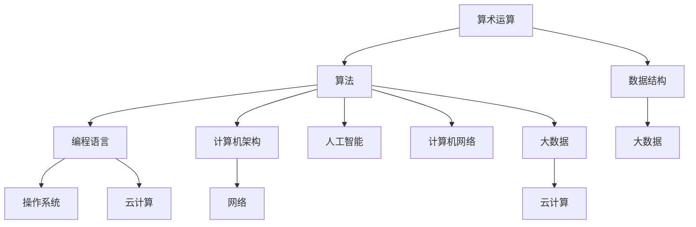
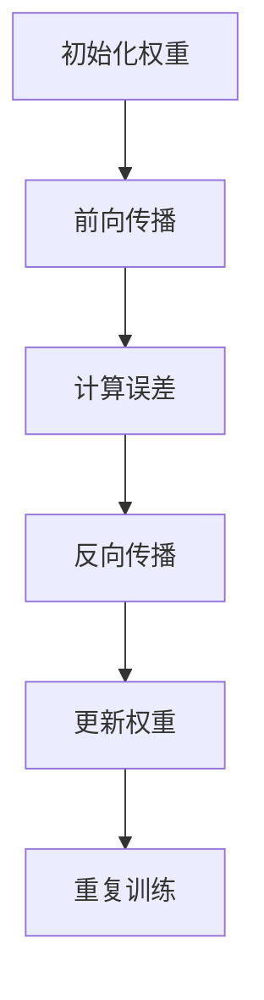
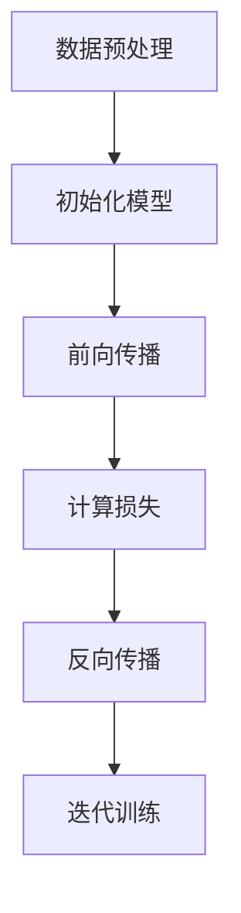
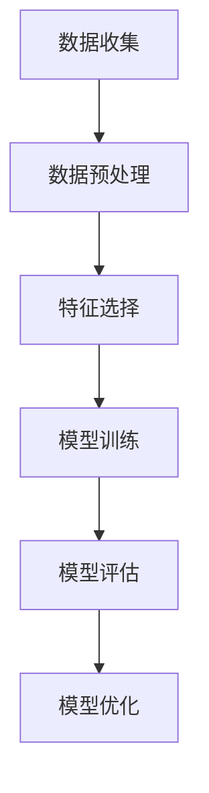

                 

### 背景介绍

在当今世界，计算机和人工智能（AI）正在以惊人的速度发展，深刻地影响着社会的方方面面。无论是医疗、金融、教育，还是交通、制造，计算机技术正逐步渗透到各个行业，改变着我们的生活方式和工作模式。随着技术的进步，人们对于计算能力的需求也在不断增长，这不仅推动了硬件的升级，也催生了更多创新性的算法和应用。

本文的主题是探讨人类计算的深远意义，旨在通过深入分析计算技术在各个领域的应用，揭示其对未来社会发展的重要影响。文章将从以下几个方面展开：

1. **核心概念与联系**：介绍计算技术的基本概念，以及它们如何相互关联，构成一个复杂而庞大的体系。
2. **核心算法原理与具体操作步骤**：详细探讨计算领域的关键算法，如神经网络、深度学习、机器学习等，并解释其工作原理和实现步骤。
3. **数学模型和公式**：介绍计算过程中使用的数学模型和公式，并通过具体案例进行说明。
4. **项目实战**：通过实际案例展示如何使用计算技术解决现实问题，并提供代码实现和分析。
5. **实际应用场景**：分析计算技术在各个行业的应用现状和未来发展趋势。
6. **工具和资源推荐**：推荐一些有助于学习和应用计算技术的工具和资源。
7. **总结**：总结计算技术的发展趋势与挑战，探讨其对社会的影响。
8. **扩展阅读与参考资料**：提供一些相关的扩展阅读和参考资料，帮助读者深入了解计算技术的各个方面。

通过以上内容的逐步探讨，本文希望读者能够对计算技术有一个全面而深刻的理解，并意识到其在塑造未来社会中的巨大潜力。接下来，我们将从基础概念开始，一步步深入到计算技术的核心领域，共同探索其深远的意义。

### 核心概念与联系

要深入理解计算技术，首先需要了解其核心概念及其相互之间的联系。计算技术涵盖了从简单的算术运算到复杂的算法设计，再到实际应用的全过程。以下是一些关键概念及其相互关系：

#### 1. **算术运算**

算术运算是计算技术的基础，包括加法、减法、乘法、除法等基本运算。这些运算在计算机中通过硬件电路和指令集来实现，是所有更复杂计算任务的基础。

#### 2. **算法**

算法是一系列解决问题的步骤，通常用伪代码或程序语言表示。不同的算法适用于不同的计算问题，它们的设计和效率直接影响计算任务的完成速度。

#### 3. **数据结构**

数据结构是用于存储和组织数据的方式，如数组、链表、树、图等。合理选择和设计数据结构可以显著提高算法的效率。

#### 4. **编程语言**

编程语言是用于编写算法和程序的语法和规则。不同的编程语言适用于不同的计算任务，如C语言适合系统编程，Python适合数据分析和机器学习。

#### 5. **计算机架构**

计算机架构是计算机系统的组织结构和设计原则。它包括硬件和软件的各个方面，如CPU、内存、I/O系统等。计算机架构直接影响计算的性能和效率。

#### 6. **操作系统**

操作系统是管理计算机硬件和软件资源的基础系统软件，它提供了文件管理、进程管理、内存管理等功能，是用户与计算机之间的接口。

#### 7. **网络**

计算机网络是连接多个计算机系统以共享资源的信息系统。互联网是最常见的计算机网络，它使得全球范围内的计算资源可以相互访问和协作。

#### 8. **人工智能**

人工智能是计算机科学的一个分支，旨在创建智能的机器系统，能够执行需要人类智能的任务。人工智能包括机器学习、深度学习、自然语言处理等多个领域。

#### 9. **大数据**

大数据是指海量数据集的处理和分析，涉及数据的存储、检索、分析和可视化等技术。大数据技术是现代计算技术的重要组成部分。

#### 10. **云计算**

云计算是通过互联网提供动态易扩展的虚拟化资源，使得计算资源可以按需分配和使用。云计算是分布式计算和互联网技术发展的产物。

#### **Mermaid 流程图表示**

为了更直观地展示这些核心概念及其相互联系，我们可以使用Mermaid流程图来表示。以下是一个简化版的Mermaid流程图，展示了上述核心概念及其相互关系：



通过这个流程图，我们可以看到计算技术是一个多维度的复杂体系，各个核心概念之间相互关联，共同构建了现代计算的基础。了解这些概念及其关系，是深入探索计算技术的前提。

### 核心算法原理与具体操作步骤

在计算技术中，核心算法是其实现复杂计算任务的关键。本文将重点介绍以下几个核心算法：神经网络、深度学习、机器学习。我们将详细解释这些算法的工作原理和操作步骤，帮助读者理解它们如何改变计算世界。

#### 1. 神经网络（Neural Networks）

神经网络是模仿人脑神经元结构和功能的计算模型。它由多个神经元（或称为节点）组成，这些节点通过加权连接形成网络。

**原理：**

- **神经元**：单个神经元接收多个输入信号，每个信号乘以一个权重，然后求和，通过一个激活函数产生输出。
- **权重**：连接两个神经元的权重决定了输入信号的重要性。
- **激活函数**：常用的激活函数包括Sigmoid、ReLU和Tanh，用于引入非线性特性。

**操作步骤：**

1. **初始化权重**：随机初始化每个神经元的权重。
2. **前向传播**：输入数据通过网络，每个神经元计算输入信号的加权和，通过激活函数产生输出。
3. **反向传播**：计算网络输出与目标值之间的误差，通过反向传播算法更新权重。
4. **训练**：重复前向传播和反向传播，直至网络输出满足预定的误差阈值。

**Mermaid流程图表示：**



#### 2. 深度学习（Deep Learning）

深度学习是神经网络的一种扩展，通过增加网络层数（深度）来提高模型的复杂性和学习能力。

**原理：**

- **多层神经网络**：深度学习模型由多个隐藏层组成，每个隐藏层将输入数据传递给下一层，最终输出预测结果。
- **反向传播**：深度学习中的反向传播算法通过多层计算误差，更新每一层的权重。

**操作步骤：**

1. **数据预处理**：标准化输入数据，将其转换为适合训练的格式。
2. **初始化模型**：定义网络的层数、神经元数量和激活函数。
3. **前向传播**：通过多层神经网络计算输出。
4. **计算损失函数**：比较预测输出与实际输出，计算损失函数（如均方误差MSE）。
5. **反向传播**：通过多层计算误差，更新网络权重。
6. **迭代训练**：重复前向传播和反向传播，直至模型收敛。

**Mermaid流程图表示：**



#### 3. 机器学习（Machine Learning）

机器学习是使计算机系统能够自动学习并改进其性能的技术，分为监督学习、无监督学习和强化学习。

**原理：**

- **监督学习**：使用已标记的数据训练模型，模型通过学习数据特征来预测未知数据的标签。
- **无监督学习**：使用未标记的数据，发现数据中的模式和结构。
- **强化学习**：通过试错和奖励机制来学习最优策略。

**操作步骤：**

1. **数据收集**：收集训练数据集。
2. **数据预处理**：清洗数据，标准化和归一化。
3. **特征选择**：选择对预测任务最有用的特征。
4. **模型训练**：根据学习类型（监督学习、无监督学习、强化学习）选择合适的算法和模型。
5. **模型评估**：使用测试数据集评估模型性能。
6. **模型优化**：根据评估结果调整模型参数和结构，以提高性能。

**Mermaid流程图表示：**



通过以上对神经网络、深度学习和机器学习的详细解释，我们可以看到这些核心算法如何构建计算技术的基础，并在实际应用中发挥关键作用。这些算法的不断发展和优化，推动了计算技术的前进，也为未来社会的智能变革奠定了基础。

### 数学模型和公式

在计算技术中，数学模型和公式是算法设计和实现的基础。以下是计算技术中常用的数学模型和公式，通过详细讲解和举例说明，帮助读者更好地理解其在计算中的应用。

#### 1. 损失函数（Loss Function）

损失函数是监督学习中的关键组件，用于衡量模型预测值与实际值之间的差距。常见的损失函数包括均方误差（MSE）、交叉熵损失（Cross-Entropy Loss）等。

**均方误差（MSE）：**

均方误差用于回归问题，计算预测值与实际值之间的平均平方误差。

$$
MSE = \frac{1}{n}\sum_{i=1}^{n} (y_i - \hat{y}_i)^2
$$

其中，$y_i$ 是实际值，$\hat{y}_i$ 是预测值，$n$ 是数据样本数量。

**举例说明：**

假设有一个简单的线性回归模型，预测房价。训练数据集包含5个样本，实际房价分别为 [200, 220, 250, 300, 320]，预测房价分别为 [210, 230, 250, 300, 330]。计算MSE：

$$
MSE = \frac{1}{5} \left( (200-210)^2 + (220-230)^2 + (250-250)^2 + (300-300)^2 + (320-330)^2 \right) = \frac{1}{5} (10^2 + 10^2 + 0 + 0 + 10^2) = 20
$$

#### 2. 交叉熵损失（Cross-Entropy Loss）

交叉熵损失用于分类问题，计算实际标签与预测概率分布之间的差距。

$$
Cross-Entropy Loss = -\sum_{i=1}^{n} y_i \log(\hat{y}_i)
$$

其中，$y_i$ 是实际标签（0或1），$\hat{y}_i$ 是预测的概率分布。

**举例说明：**

假设有一个二分类模型，预测是否为正类。训练数据集包含5个样本，实际标签为 [0, 1, 1, 0, 1]，预测概率分布为 [0.3, 0.7]，[0.6, 0.4]，[0.8, 0.2]，[0.1, 0.9]，[0.5, 0.5]。计算交叉熵损失：

$$
Cross-Entropy Loss = -[0 \cdot \log(0.3) + 1 \cdot \log(0.7)] + [-1 \cdot \log(0.6) + 1 \cdot \log(0.4)] + [-1 \cdot \log(0.8) + 1 \cdot \log(0.2)] + [-1 \cdot \log(0.1) + 1 \cdot \log(0.9)] + [-1 \cdot \log(0.5) + 1 \cdot \log(0.5)]
$$

$$
Cross-Entropy Loss = -[0 + 0.747] + [-0.811 + 0.415] + [-0.916 + 0.301] + [-1.51 + 0.95] + [-0.405 + 0.5]
$$

$$
Cross-Entropy Loss = [-0.747 + 0.415 - 0.316 - 0.61 + 0.5 - 0.405] = 0.006
$$

#### 3. 激活函数（Activation Function）

激活函数是神经网络中用于引入非线性特性的函数。常用的激活函数包括Sigmoid、ReLU和Tanh。

**Sigmoid：**

$$
Sigmoid(x) = \frac{1}{1 + e^{-x}}
$$

**ReLU（Rectified Linear Unit）：**

$$
ReLU(x) = \max(0, x)
$$

**Tanh（Hyperbolic Tangent）：**

$$
Tanh(x) = \frac{e^{2x} - 1}{e^{2x} + 1}
$$

**举例说明：**

假设输入值为 [2, -3, 4, -5]，计算不同激活函数的输出：

- Sigmoid：
$$
Sigmoid(2) = \frac{1}{1 + e^{-2}} \approx 0.8808, \quad Sigmoid(-3) = \frac{1}{1 + e^{3}} \approx 0.0488
$$

- ReLU：
$$
ReLU(2) = 2, \quad ReLU(-3) = 0
$$

- Tanh：
$$
Tanh(2) = \frac{e^{4} - 1}{e^{4} + 1} \approx 0.9640, \quad Tanh(-3) = \frac{e^{-6} - 1}{e^{-6} + 1} \approx -0.9640
$$

通过这些数学模型和公式的讲解和举例，我们可以看到它们在计算技术中的重要性。这些数学工具不仅帮助算法更好地拟合数据，还提高了计算效率，推动了计算技术的不断进步。

### 项目实战：代码实际案例和详细解释说明

为了更好地理解计算技术的实际应用，我们将通过一个实际的项目案例来展示如何使用计算技术解决一个具体的问题。在这个案例中，我们将使用Python和TensorFlow构建一个简单的神经网络，用于手写数字识别任务。

#### 1. 开发环境搭建

首先，我们需要搭建一个合适的开发环境。以下是搭建Python和TensorFlow开发环境的基本步骤：

1. **安装Python**：确保安装了Python 3.x版本。可以从 [Python官方网站](https://www.python.org/downloads/) 下载并安装。
2. **安装pip**：pip是Python的包管理器，用于安装和管理第三方库。打开命令行窗口，执行以下命令：
   ```bash
   python -m pip install --upgrade pip
   ```
3. **安装TensorFlow**：在命令行窗口中执行以下命令来安装TensorFlow：
   ```bash
   pip install tensorflow
   ```

#### 2. 源代码详细实现和代码解读

接下来，我们将展示实现手写数字识别神经网络的具体代码，并对其进行详细解读。

```python
import tensorflow as tf
from tensorflow.keras import layers
from tensorflow.keras.datasets import mnist

# 加载数据集
(train_images, train_labels), (test_images, test_labels) = mnist.load_data()

# 预处理数据
train_images = train_images.reshape((60000, 28, 28, 1)).astype('float32') / 255
test_images = test_images.reshape((10000, 28, 28, 1)).astype('float32') / 255

train_labels = tf.keras.utils.to_categorical(train_labels)
test_labels = tf.keras.utils.to_categorical(test_labels)

# 构建神经网络模型
model = tf.keras.Sequential([
    layers.Conv2D(32, (3, 3), activation='relu', input_shape=(28, 28, 1)),
    layers.MaxPooling2D((2, 2)),
    layers.Conv2D(64, (3, 3), activation='relu'),
    layers.MaxPooling2D((2, 2)),
    layers.Conv2D(64, (3, 3), activation='relu'),
    layers.Flatten(),
    layers.Dense(64, activation='relu'),
    layers.Dense(10, activation='softmax')
])

# 编译模型
model.compile(optimizer='adam',
              loss='categorical_crossentropy',
              metrics=['accuracy'])

# 训练模型
model.fit(train_images, train_labels, epochs=5, batch_size=64)

# 评估模型
test_loss, test_acc = model.evaluate(test_images, test_labels)
print(f'测试精度: {test_acc:.4f}')

# 预测新数据
predictions = model.predict(test_images)
predicted_labels = tf.argmax(predictions, axis=1)

# 输出预测结果
print(predicted_labels[:10])
```

**代码解读：**

1. **数据加载和预处理**：
   - 使用`mnist.load_data()`加载MNIST手写数字数据集。
   - 数据集分为训练集和测试集，每幅图像的大小为28x28像素。
   - 将图像数据转换为浮点数，并将其归一化到0-1之间。

2. **构建神经网络模型**：
   - 使用`tf.keras.Sequential`创建一个顺序模型。
   - 模型包含多个层：两个卷积层（`Conv2D`），两个最大池化层（`MaxPooling2D`），一个全连接层（`Dense`）和一个softmax层。
   - 卷积层用于提取图像特征，最大池化层用于减小数据维度并提高模型泛化能力。
   - 全连接层用于分类，softmax层用于计算每个类别的概率分布。

3. **编译模型**：
   - 使用`model.compile()`设置模型的优化器（`optimizer`）、损失函数（`loss`）和评估指标（`metrics`）。
   - 在这个例子中，我们使用了`adam`优化器和`categorical_crossentropy`损失函数。

4. **训练模型**：
   - 使用`model.fit()`进行模型训练。
   - 模型在训练集上训练5个周期（`epochs`），每次处理64个样本（`batch_size`）。

5. **评估模型**：
   - 使用`model.evaluate()`在测试集上评估模型性能。
   - 输出测试集上的损失和精度。

6. **预测新数据**：
   - 使用`model.predict()`对测试集上的图像进行预测。
   - 使用`tf.argmax()`提取预测结果，输出预测的数字标签。

通过这个案例，我们可以看到如何使用计算技术解决一个具体的实际问题。从数据加载、模型构建到训练和评估，每一步都体现了计算技术的基本原理和应用。

### 代码解读与分析

在上面的手写数字识别案例中，我们详细讲解了代码的每个部分以及其背后的原理。接下来，我们将对代码进行深入解读，分析其结构和功能，以便读者能够更好地理解这一实际项目。

#### 1. 数据加载与预处理

```python
(train_images, train_labels), (test_images, test_labels) = mnist.load_data()
train_images = train_images.reshape((60000, 28, 28, 1)).astype('float32') / 255
test_images = test_images.reshape((10000, 28, 28, 1)).astype('float32') / 255
train_labels = tf.keras.utils.to_categorical(train_labels)
test_labels = tf.keras.utils.to_categorical(test_labels)
```

- **数据加载**：`mnist.load_data()`函数从Keras库中加载MNIST手写数字数据集。这个数据集包含60000个训练样本和10000个测试样本。
- **数据预处理**：
  - `train_images.reshape((60000, 28, 28, 1))`将每个28x28的图像扩展到四维数组，最后一维为1，表示单通道灰度图像。
  - `astype('float32')`将数据类型转换为浮点数，以便后续处理。
  - `/= 255`将图像像素值归一化到0-1之间，便于模型训练。
- **标签编码**：使用`tf.keras.utils.to_categorical()`将标签从整数编码为二进制矩阵，每个样本的标签表示为一个长度为10的向量，其中对应类别的位置为1，其余位置为0。这是分类问题中常用的标签格式。

#### 2. 构建神经网络模型

```python
model = tf.keras.Sequential([
    layers.Conv2D(32, (3, 3), activation='relu', input_shape=(28, 28, 1)),
    layers.MaxPooling2D((2, 2)),
    layers.Conv2D(64, (3, 3), activation='relu'),
    layers.MaxPooling2D((2, 2)),
    layers.Conv2D(64, (3, 3), activation='relu'),
    layers.Flatten(),
    layers.Dense(64, activation='relu'),
    layers.Dense(10, activation='softmax')
])
```

- **模型构建**：使用`tf.keras.Sequential`创建一个顺序模型，即一个由多个层按顺序组成的模型。
  - **卷积层（Conv2D）**：第一个卷积层使用32个3x3的卷积核，激活函数为ReLU。输入形状为28x28x1的图像。
  - **最大池化层（MaxPooling2D）**：随后的两个最大池化层使用2x2的窗口进行下采样，减少数据维度，提高计算效率。
  - **第二个卷积层**：使用64个3x3的卷积核，激活函数为ReLU。
  - **Flatten层**：将多维数据展平成一维数组，为后续的全连接层做准备。
  - **全连接层（Dense）**：第一个全连接层有64个神经元，激活函数为ReLU。
  - **输出层**：最后一个全连接层有10个神经元，激活函数为softmax，用于计算每个类别的概率分布。

#### 3. 编译模型

```python
model.compile(optimizer='adam',
              loss='categorical_crossentropy',
              metrics=['accuracy'])
```

- **编译模型**：设置模型的优化器、损失函数和评估指标。
  - **优化器**：使用`adam`优化器，这是一种常用的自适应学习率优化算法。
  - **损失函数**：使用`categorical_crossentropy`损失函数，适合多分类问题。
  - **评估指标**：使用`accuracy`指标评估模型的分类精度。

#### 4. 训练模型

```python
model.fit(train_images, train_labels, epochs=5, batch_size=64)
```

- **训练模型**：使用`model.fit()`函数训练模型。
  - **训练数据**：使用预处理后的训练图像和标签。
  - **训练周期**：设置训练周期数为5，每个周期训练整个数据集。
  - **批大小**：每次处理64个样本，这是常用的批量大小，可以平衡计算效率和模型性能。

#### 5. 评估模型

```python
test_loss, test_acc = model.evaluate(test_images, test_labels)
print(f'测试精度: {test_acc:.4f}')
```

- **评估模型**：使用`model.evaluate()`在测试集上评估模型性能。
  - **测试数据**：使用预处理后的测试图像和标签。
  - **输出**：返回测试损失和精度。

#### 6. 预测新数据

```python
predictions = model.predict(test_images)
predicted_labels = tf.argmax(predictions, axis=1)
print(predicted_labels[:10])
```

- **预测新数据**：使用`model.predict()`对测试集上的图像进行预测。
  - **输出**：使用`tf.argmax()`提取预测结果，输出每个图像预测的数字标签。

通过以上代码解读，我们可以看到这个手写数字识别案例的每个部分是如何协同工作的。从数据预处理、模型构建到训练、评估和预测，每一步都是实现计算技术解决实际问题的具体体现。

### 实际应用场景

计算技术在各个行业中的应用已经深入且广泛，改变了传统的工作流程，提升了效率，优化了资源分配，甚至在某些领域实现了革命性的变革。以下是一些计算技术在具体行业中的实际应用场景：

#### 1. 医疗

在医疗领域，计算技术被广泛应用于疾病诊断、药物研发和个性化治疗。通过深度学习算法，计算机可以分析医疗影像，如X光、CT和MRI，帮助医生更快速、准确地诊断疾病。例如，Google的DeepMind团队开发了一种名为“DeepMind Health”的系统，能够通过分析电子病历数据来预测疾病的发生风险。

**案例**：IBM的Watson for Oncology是一个基于计算技术的智能系统，它能够通过分析大量的医学文献和病例数据，为医生提供个性化的治疗建议。

#### 2. 金融

金融行业利用计算技术进行风险控制、投资分析和市场预测。量化交易策略依赖于复杂的算法来实时分析市场数据，进行高频交易。机器学习算法则被用于信用评分、欺诈检测和客户行为分析。

**案例**：JPMorgan Chase开发了一种名为“COiN”的算法，用于自动审核公司客户的交易记录，以识别潜在的欺诈行为。

#### 3. 教育

在教育领域，计算技术改善了教学和学习体验。在线教育平台利用大数据分析和机器学习算法，为学生提供个性化的学习路径，提高学习效果。此外，虚拟现实（VR）和增强现实（AR）技术为学生提供了沉浸式的学习体验。

**案例**：Coursera使用机器学习算法来分析学生的学习行为，根据其表现提供个性化的学习建议，帮助用户更有效地学习。

#### 4. 制造

制造业利用计算技术实现智能制造，通过传感器和数据采集系统实时监控生产线，优化生产流程。工业机器人结合计算技术，提高了生产效率和精确度。

**案例**：通用电气（GE）利用Predix平台，将物联网（IoT）技术与计算技术相结合，对工业设备进行预测性维护，减少了设备故障率，提高了生产效率。

#### 5. 交通

在交通领域，计算技术被用于优化交通流量、提高运输效率和减少交通事故。智能交通系统（ITS）利用传感器、摄像头和计算算法来实时监控交通状况，提供路线规划和交通管理。

**案例**：特斯拉的Autopilot系统利用计算机视觉和机器学习算法，使车辆能够自动驾驶，提高了驾驶安全性。

#### 6. 农业

农业利用计算技术进行精准农业，通过传感器和无人机收集农田数据，使用机器学习算法进行土壤分析和作物管理。这有助于提高作物产量，减少资源浪费。

**案例**：John Deere使用卫星遥感技术和计算分析，为农民提供详细的农田健康状况报告，帮助他们做出更明智的农业决策。

通过上述案例，我们可以看到计算技术如何在不同行业中发挥作用，不仅提高了效率，还带来了前所未有的创新和变革。随着计算技术的不断进步，其在各个行业的应用将更加广泛和深入，进一步推动社会的发展。

### 工具和资源推荐

在学习和应用计算技术过程中，选择合适的工具和资源是非常关键的。以下是一些推荐的工具、书籍、论文和网站，旨在帮助读者深入了解计算技术的各个方面。

#### 1. 学习资源推荐

**书籍：**

- **《深度学习》（Deep Learning）**：作者：Ian Goodfellow、Yoshua Bengio、Aaron Courville
  - 本书是深度学习领域的经典之作，详细介绍了深度学习的理论基础和实际应用。

- **《Python机器学习》（Python Machine Learning）**：作者： Sebastian Raschka、Vahid Mirjalili
  - 本书适合初学者，通过大量示例和代码实现，介绍了机器学习的基础知识。

- **《机器学习实战》（Machine Learning in Action）**：作者：Peter Harrington
  - 本书通过实际案例展示了机器学习的应用，易于理解和实践。

**论文：**

- **"A Theoretical Framework for Back-Propagation"**：作者：David E. Rumelhart、Geoffrey E. Hinton、Ronald J. Williams
  - 本文提出了反向传播算法的理论基础，是神经网络研究的重要文献。

- **"Learning Representations by Maximizing Mutual Information Across Views"**：作者：Tijmen Tieleman、Lukas Burget、Yoshua Bengio
  - 本文介绍了互信息最大化方法，用于生成高质量的数据表示。

**网站：**

- **[Kaggle](https://www.kaggle.com)**：提供大量的机器学习和深度学习竞赛数据集和问题，是实践和学习的好平台。

- **[TensorFlow官方网站](https://www.tensorflow.org)**：包含详细的文档、教程和API参考，是学习TensorFlow的必备网站。

#### 2. 开发工具框架推荐

**工具：**

- **[TensorFlow](https://www.tensorflow.org)**：是一个开源机器学习框架，适用于构建和训练各种神经网络模型。

- **[PyTorch](https://pytorch.org)**：是另一个流行的开源机器学习库，特别适合科研和深度学习开发。

- **[NumPy](https://numpy.org)**：是Python中的一个核心科学计算库，用于数组操作和数学计算。

**框架：**

- **[Keras](https://keras.io)**：是一个高级神经网络API，构建和训练模型简单直观。

- **[Scikit-learn](https://scikit-learn.org/stable/)**：是一个开源机器学习库，提供了丰富的算法和工具，适用于数据挖掘和数据分析。

#### 3. 相关论文著作推荐

- **"Deep Learning: Methods and Applications"**：作者：Goodfellow、Bengio、Courville
  - 本文全面介绍了深度学习的各种方法和应用，是深度学习领域的权威文献。

- **"Learning to Learn: Converging Tools for Automated Major Preprocessing in Data Science"**：作者：Bengio等
  - 本文讨论了如何使用自动化工具提高机器学习流程的效率。

通过上述工具、书籍、论文和网站的推荐，读者可以更全面、深入地学习计算技术，并能够将所学知识应用于实际项目中，为未来的发展做好准备。

### 总结：未来发展趋势与挑战

随着计算技术的不断进步，其在各个领域的影响也在逐渐扩大。未来，计算技术将继续朝着更高效、更智能、更自动化的方向发展。以下是对计算技术未来发展趋势的展望及面临的挑战：

#### 未来发展趋势

1. **量子计算**：量子计算利用量子力学原理，拥有远超经典计算机的计算能力。随着量子技术的不断发展，量子计算有望在未来十年内实现重大突破，为解决复杂问题提供全新手段。

2. **边缘计算**：随着物联网（IoT）和5G技术的普及，边缘计算成为热点。边缘计算将计算任务从云端转移到网络边缘，实现实时数据处理和智能决策，提升系统的响应速度和可靠性。

3. **人工智能的普及**：人工智能将进一步渗透到各个行业，从自动驾驶、智能医疗到智能家居，AI技术将改变人们的生活方式和工作模式。

4. **自动化与智能化**：计算技术的自动化和智能化水平将不断提升，机器学习算法和自动化工具将大量应用于数据处理、系统运维、故障检测等领域，提高生产效率和资源利用率。

5. **数据隐私与安全**：随着数据的广泛应用，数据隐私和安全成为关键问题。未来，计算技术将更加注重数据保护，发展出更加安全的数据处理和传输机制。

#### 面临的挑战

1. **计算资源的需求**：随着计算任务的复杂性和规模不断增加，计算资源的需求也在快速增长。如何高效利用现有的计算资源，如何设计和优化算法以满足日益增长的计算需求，是重要的挑战。

2. **算法的透明性与可解释性**：随着人工智能算法的广泛应用，如何确保算法的透明性和可解释性成为关键问题。许多复杂的人工智能系统，如深度学习模型，其工作原理对人类来说仍然不够直观，需要发展出更加可解释的算法。

3. **数据质量和隐私**：数据质量和隐私问题在计算技术的应用中愈发突出。如何确保数据的质量和隐私，如何在数据利用和数据保护之间找到平衡，是未来需要解决的重要问题。

4. **法律与伦理问题**：计算技术的广泛应用带来了法律和伦理问题。例如，自动驾驶车辆的决策责任、人工智能系统的道德标准等，需要通过法律和伦理框架来规范。

总之，计算技术未来的发展充满机遇与挑战。通过不断探索和创新，我们有望克服这些挑战，推动计算技术为社会带来更多的福祉。

### 附录：常见问题与解答

在学习和应用计算技术的过程中，读者可能会遇到一些常见问题。以下是针对这些问题的解答，以帮助读者更好地理解和掌握计算技术。

#### 1. 如何选择合适的编程语言？

选择编程语言主要取决于应用场景和项目需求。以下是一些常见编程语言及其适用场景：

- **Python**：适合数据分析和机器学习，易于学习和使用。
- **C/C++**：适合系统编程和性能敏感的应用，如操作系统和嵌入式系统。
- **Java**：适合大型企业级应用和Android开发。
- **JavaScript**：适合前端开发，与Web技术紧密结合。

#### 2. 深度学习模型训练时间过长怎么办？

模型训练时间过长可能是由于数据规模大、模型复杂或硬件性能不足。以下是一些优化方法：

- **增加硬件资源**：使用更强大的计算机或GPU进行训练。
- **模型压缩**：通过剪枝、量化等方法减小模型大小，加快训练速度。
- **分布式训练**：使用多个计算机或GPU进行分布式训练，提高计算效率。

#### 3. 如何处理数据集不平衡问题？

数据集不平衡会影响模型性能，特别是分类问题。以下是一些处理数据集不平衡的方法：

- **过采样（Oversampling）**：增加少数类别的样本数量。
- **欠采样（Undersampling）**：减少多数类别的样本数量。
- **合成数据**：使用数据生成技术（如SMOTE）生成新的少数类样本。
- **调整损失函数**：使用加权损失函数，给予少数类更高的权重。

#### 4. 如何确保深度学习模型的泛化能力？

确保模型泛化能力是深度学习中的关键问题。以下是一些提高泛化能力的方法：

- **数据增强**：通过旋转、缩放、裁剪等操作增加数据多样性。
- **正则化**：使用L1、L2正则化、Dropout等技巧防止过拟合。
- **交叉验证**：使用交叉验证评估模型性能，避免过拟合。

#### 5. 如何调试代码中的错误？

调试代码中的错误是编程过程中的常见任务。以下是一些调试技巧：

- **打印输出**：在关键位置添加打印语句，查看变量值和程序执行流程。
- **使用调试器**：利用IDE的调试器功能逐步执行代码，观察变量变化。
- **单元测试**：编写单元测试，验证代码片段的正确性。
- **代码审查**：与他人合作，进行代码审查，找出潜在错误。

通过以上解答，读者可以更好地应对计算技术学习和应用过程中遇到的问题，提高编程能力和项目成功率。

### 扩展阅读 & 参考资料

为了帮助读者更深入地了解计算技术，以下是推荐的扩展阅读和参考资料，涵盖计算技术的各个方面，包括书籍、学术论文、在线课程和开源资源。

#### 1. 书籍推荐

- **《深度学习》（Deep Learning）**：作者：Ian Goodfellow、Yoshua Bengio、Aaron Courville
  - 本书是深度学习领域的经典著作，适合初学者和专业人士。

- **《机器学习》（Machine Learning）**：作者：Tom M. Mitchell
  - 本书详细介绍了机器学习的基本概念、算法和应用，适合入门读者。

- **《Python机器学习》（Python Machine Learning）**：作者：Sebastian Raschka、Vahid Mirjalili
  - 本书通过Python实例，介绍了机器学习的基础知识和实践技巧。

#### 2. 学术论文

- **"A Theoretical Framework for Back-Propagation"**：作者：David E. Rumelhart、Geoffrey E. Hinton、Ronald J. Williams
  - 本文是反向传播算法的奠基性论文，对于理解神经网络训练至关重要。

- **"Learning Representations by Maximizing Mutual Information Across Views"**：作者：Tijmen Tieleman、Lukas Burget、Yoshua Bengio
  - 本文介绍了通过最大化互信息进行数据表示学习的方法。

#### 3. 在线课程

- **[Coursera](https://www.coursera.org)**：提供多门计算机科学和机器学习的在线课程，包括深度学习、自然语言处理等。

- **[edX](https://www.edx.org)**：提供由全球顶尖大学提供的计算机科学和人工智能相关课程。

- **[Udacity](https://www.udacity.com)**：提供实用的机器学习和深度学习课程，包括项目实战。

#### 4. 开源资源

- **[TensorFlow](https://www.tensorflow.org)**：谷歌开发的开源机器学习框架，适用于构建和训练各种神经网络模型。

- **[PyTorch](https://pytorch.org)**：由Facebook开发的深度学习库，特别适合科研和深度学习开发。

- **[Keras](https://keras.io)**：一个高级神经网络API，易于使用，与TensorFlow和Theano兼容。

通过这些扩展阅读和参考资料，读者可以进一步深化对计算技术的理解，掌握更高级的技能，为未来的研究和应用奠定基础。

