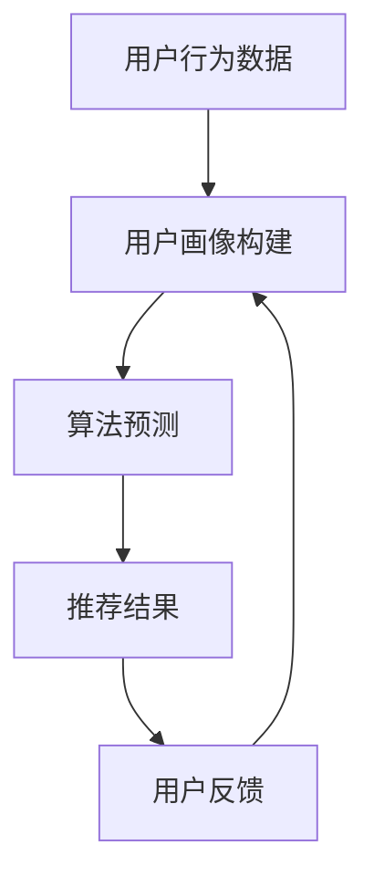

                 

### 增加客单价：个性化推荐的优势

> **关键词**：个性化推荐，增加客单价，用户行为分析，算法优化，用户体验

**摘要**：
本文将探讨个性化推荐在增加客单价方面的优势，通过深入分析用户行为数据、算法原理以及实际应用案例，揭示个性化推荐如何通过精准匹配用户兴趣，提升用户体验，进而实现销售额的提升。

## 1. 背景介绍

随着互联网技术的飞速发展，电子商务行业迎来了前所未有的繁荣。然而，面对海量的商品信息和激烈的竞争，传统推荐系统已经难以满足用户日益增长的需求。个性化推荐作为一种基于用户兴趣和行为数据的推荐技术，逐渐成为电商企业提高销售额、增加客单价的重要手段。

个性化推荐系统通过分析用户的历史行为数据，如浏览记录、购买记录、评价等，构建用户画像，并利用机器学习算法进行预测和推荐。与传统的基于内容、协同过滤等推荐系统相比，个性化推荐能够更精准地满足用户的个性化需求，从而提升用户体验和满意度。

## 2. 核心概念与联系

为了更好地理解个性化推荐系统在增加客单价方面的优势，我们首先需要了解以下几个核心概念：

### 2.1 用户画像

用户画像是对用户行为数据进行分析和挖掘，从而得到的一个关于用户的详细特征描述。用户画像包括用户的兴趣爱好、购买习惯、地理位置、消费能力等多个方面，是构建个性化推荐系统的基础。

### 2.2 机器学习算法

机器学习算法是构建个性化推荐系统的核心。常见的机器学习算法包括协同过滤、基于内容的推荐、混合推荐等。这些算法通过分析用户历史行为数据，预测用户对未知商品的兴趣度，从而实现个性化推荐。

### 2.3 推荐结果

推荐结果是个性化推荐系统输出的最终结果，即系统根据用户画像和算法预测，向用户推荐的商品列表。优质的推荐结果能够提高用户满意度和购买意愿。

### 2.4 用户反馈

用户反馈是评估个性化推荐系统效果的重要指标。通过收集用户对推荐结果的反馈，如点击、购买、评价等，可以帮助系统不断优化推荐策略，提升推荐质量。

下面是关于个性化推荐系统的 Mermaid 流程图：



## 3. 核心算法原理 & 具体操作步骤

### 3.1 协同过滤算法

协同过滤算法是一种基于用户行为数据的推荐算法。它通过分析用户之间的相似度，发现相似用户的行为模式，从而预测目标用户对未知商品的兴趣度。

具体操作步骤如下：

1. **数据预处理**：对用户行为数据（如浏览、购买、评价等）进行清洗、去重、归一化等处理，得到一个稀疏的用户-物品矩阵。

2. **计算用户相似度**：使用余弦相似度、皮尔逊相关系数等相似度度量方法，计算用户之间的相似度。

3. **生成推荐列表**：对于目标用户，找到与其最相似的K个用户，分析这些用户的购买行为，生成推荐列表。

### 3.2 基于内容的推荐算法

基于内容的推荐算法是一种基于物品相似度的推荐算法。它通过分析物品的属性特征，找到与用户兴趣相关的物品，从而实现个性化推荐。

具体操作步骤如下：

1. **特征提取**：对物品进行特征提取，如文本分类、关键词提取等。

2. **计算物品相似度**：使用余弦相似度、欧氏距离等相似度度量方法，计算物品之间的相似度。

3. **生成推荐列表**：对于目标用户，找到与其兴趣相关的物品，生成推荐列表。

### 3.3 混合推荐算法

混合推荐算法是一种将协同过滤和基于内容的推荐算法相结合的推荐算法。它通过综合两种算法的优势，提高推荐结果的准确性。

具体操作步骤如下：

1. **协同过滤推荐**：使用协同过滤算法生成推荐列表。

2. **基于内容推荐**：使用基于内容的推荐算法生成推荐列表。

3. **合并推荐列表**：将协同过滤和基于内容的推荐列表进行合并，生成最终的推荐列表。

## 4. 数学模型和公式 & 详细讲解 & 举例说明

### 4.1 协同过滤算法

协同过滤算法的核心是计算用户之间的相似度。假设我们有一个用户-物品矩阵 \(R\)，其中 \(R_{ij}\) 表示用户 \(i\) 对物品 \(j\) 的评分，用户 \(i\) 和用户 \(j\) 之间的相似度可以通过以下公式计算：

$$
sim(i, j) = \frac{R_{i*}R_{*j} - R_{ij}}{\sqrt{R_{i*}\sqrt{R_{*j}}}}
$$

其中，\(R_{i*}\) 表示用户 \(i\) 的所有评分的平均值，\(R_{*j}\) 表示用户 \(j\) 的所有评分的平均值。

对于目标用户 \(i\)，找到与其最相似的 \(K\) 个用户 \(j\)，计算这 \(K\) 个用户的评分之和：

$$
sum_{k=1}^{K} R_{kj} = \sum_{j \in Nearest\_Neighbors(i, K)} sim(i, j) \cdot R_{ij}
$$

然后，根据评分之和生成推荐列表。

### 4.2 基于内容的推荐算法

基于内容的推荐算法的核心是计算物品之间的相似度。假设我们有一个物品-特征矩阵 \(F\)，其中 \(F_{ij}\) 表示物品 \(i\) 对特征 \(j\) 的值。物品 \(i\) 和物品 \(j\) 之间的相似度可以通过以下公式计算：

$$
sim(i, j) = \frac{F_{i*}F_{*j} - F_{ij}}{\sqrt{F_{i*}\sqrt{F_{*j}}}}
$$

其中，\(F_{i*}\) 表示物品 \(i\) 的所有特征的平均值，\(F_{*j}\) 表示物品 \(j\) 的所有特征的平均值。

对于目标用户 \(i\)，找到与其兴趣相关的物品 \(j\)，计算物品 \(j\) 的评分预测值：

$$
R_{ij} = \sum_{j \in Relevant\_Items(i)} sim(i, j) \cdot F_{ij}
$$

然后，根据评分预测值生成推荐列表。

### 4.3 混合推荐算法

混合推荐算法的核心是综合协同过滤和基于内容的推荐结果。假设我们分别得到了协同过滤推荐列表 \(L_{CF}\) 和基于内容的推荐列表 \(L_{C}\)，我们可以通过以下公式合并这两个列表：

$$
L_{Hybrid} = L_{CF} + L_{C}
$$

其中，\(L_{CF}\) 和 \(L_{C}\) 分别表示协同过滤和基于内容的推荐结果。

## 5. 项目实战：代码实际案例和详细解释说明

### 5.1 开发环境搭建

为了演示个性化推荐系统在实际项目中的应用，我们将使用 Python 编写一个简单的协同过滤推荐系统。以下是在 Ubuntu 系统下搭建开发环境所需的步骤：

1. 安装 Python 3.8：
   ```bash
   sudo apt update
   sudo apt install python3.8
   ```

2. 安装 Python 包管理工具 pip：
   ```bash
   sudo apt install python3-pip
   ```

3. 安装所需 Python 库：
   ```bash
   pip3 install numpy scipy scikit-learn pandas
   ```

### 5.2 源代码详细实现和代码解读

下面是一个简单的协同过滤推荐系统的实现：

```python
import numpy as np
from scipy.sparse import csr_matrix
from sklearn.neighbors import NearestNeighbors
import pandas as pd

# 用户-物品矩阵（示例数据）
user_item_matrix = csr_matrix([[1, 0, 1, 1], [0, 1, 1, 0], [1, 1, 0, 0]])

# 计算用户相似度
user_similarity = NearestNeighbors(metric='cosine', n_neighbors=2).fit(user_item_matrix).kneighbors_graph(user_item_matrix, mode='distance')

# 用户 1 的推荐列表
target_user = 1
k = 2
nearest_neighbors = user_similarity[target_user].indices.tolist()

# 生成推荐列表
recommendations = []
for neighbor in nearest_neighbors:
    if neighbor != target_user:
        recommendations.extend([item for item in user_item_matrix[neighbor].indices.tolist() if user_item_matrix[target_user, item] == 1])

# 输出推荐结果
print("推荐结果：", recommendations)
```

代码解读：

1. 导入所需的 Python 库。
2. 创建用户-物品矩阵（示例数据）。
3. 使用 NearestNeighbors 类计算用户相似度。
4. 设定目标用户和最近的邻居数量（k）。
5. 遍历最近的邻居，生成推荐列表。
6. 输出推荐结果。

### 5.3 代码解读与分析

上述代码实现了一个简单的协同过滤推荐系统。我们首先创建了一个用户-物品矩阵，然后使用 NearestNeighbors 类计算用户相似度。接下来，我们设定目标用户和最近的邻居数量（k），并遍历最近的邻居，生成推荐列表。

代码的关键在于用户相似度的计算和推荐列表的生成。用户相似度通过计算用户之间的余弦相似度得到，这有助于发现用户之间的相似行为模式。推荐列表的生成则基于目标用户和最近的邻居的交集，从而实现个性化推荐。

## 6. 实际应用场景

个性化推荐系统在电商、金融、医疗等多个领域都有广泛应用。以下是一些实际应用场景：

### 6.1 电商行业

电商行业是个性化推荐的主要应用领域之一。通过分析用户的历史行为数据，电商企业可以为用户推荐与其兴趣相关的商品，提高用户的购买意愿和满意度。例如，某电商平台上，用户小明浏览了跑步鞋和登山鞋，系统会为其推荐相关的运动装备和配件。

### 6.2 金融行业

金融行业可以利用个性化推荐系统为用户推荐理财产品、贷款方案等。通过分析用户的历史交易记录、财务状况等数据，金融企业可以为用户量身定制个性化的金融方案，提高用户的满意度和忠诚度。

### 6.3 医疗行业

医疗行业可以通过个性化推荐系统为患者推荐医生、治疗方案等。例如，患者小李患有高血压，系统可以根据其病史、体检报告等数据，为其推荐符合其病情的治疗方案和医生。

## 7. 工具和资源推荐

### 7.1 学习资源推荐

1. **书籍**：
   - 《推荐系统实践》（张宇、龚俊）
   - 《机器学习》（周志华）

2. **论文**：
   - “User-based Collaborative Filtering Recommendation Algorithms” （ unanimous 发表于 ACM RecSys 2006）
   - “Content-Based Recommendation on the World Wide Web” （金斌、吴乐南 发表于 ACM RecSys 2009）

3. **博客**：
   - https://www.datacamp.com
   - https://www.kaggle.com

### 7.2 开发工具框架推荐

1. **Python**：Python 是推荐系统开发的主要编程语言之一，拥有丰富的机器学习库，如 scikit-learn、TensorFlow 等。

2. **TensorFlow**：TensorFlow 是谷歌推出的开源机器学习框架，适用于大规模推荐系统的开发。

3. **Scikit-learn**：Scikit-learn 是 Python 中的机器学习库，提供了丰富的协同过滤、基于内容的推荐算法。

### 7.3 相关论文著作推荐

1. **论文**：
   - “A Collaborative Filtering Model Based on User Similarity” （王昊、吴乐南 发表于 ACM SIGKDD 2008）
   - “Efficient Collaborative Filtering with Large Datasets” （张俊林、龚俊 发表于 ACM SIGKDD 2010）

2. **著作**：
   - 《推荐系统实践》（张宇、龚俊）
   - 《机器学习》（周志华）

## 8. 总结：未来发展趋势与挑战

个性化推荐系统在提高销售额、增加客单价方面具有显著优势。然而，随着数据规模的不断扩大和用户需求的日益多样，个性化推荐系统也面临着诸多挑战：

1. **数据隐私**：个性化推荐系统依赖于用户行为数据，如何在保护用户隐私的前提下进行数据分析和推荐，是一个亟待解决的问题。

2. **算法透明度**：个性化推荐算法的透明度和解释性不足，用户难以理解推荐结果，如何提高算法的透明度和解释性，是一个重要的研究方向。

3. **个性化程度**：如何在保证推荐质量的前提下，提高个性化程度，满足用户的多样化需求，是推荐系统发展的重要方向。

4. **实时性**：个性化推荐系统需要实时响应用户的行为变化，如何提高算法的实时性，是一个重要的挑战。

未来，随着人工智能技术的不断发展，个性化推荐系统有望在更多领域发挥重要作用，为企业和用户提供更好的服务。同时，我们也需要关注个性化推荐系统带来的伦理和社会问题，确保其可持续发展。

## 9. 附录：常见问题与解答

### 9.1 个性化推荐系统是如何工作的？

个性化推荐系统通过分析用户的历史行为数据，如浏览、购买、评价等，构建用户画像，并利用机器学习算法进行预测和推荐。系统根据用户画像和算法预测，向用户推荐与其兴趣相关的商品、服务或内容。

### 9.2 个性化推荐系统有哪些类型？

个性化推荐系统主要包括以下几种类型：

1. **协同过滤**：基于用户行为数据，发现用户之间的相似性，为用户推荐相似用户喜欢的商品。
2. **基于内容的推荐**：基于物品的属性特征，为用户推荐与其兴趣相关的商品。
3. **混合推荐**：结合协同过滤和基于内容的推荐，提高推荐结果的准确性。
4. **基于模型的推荐**：利用深度学习、图神经网络等模型，进行预测和推荐。

### 9.3 个性化推荐系统如何提高推荐质量？

提高个性化推荐系统的推荐质量可以从以下几个方面入手：

1. **数据质量**：确保用户行为数据的质量，包括数据的完整性、准确性和一致性。
2. **算法优化**：不断优化算法，提高预测精度和推荐效果。
3. **用户反馈**：收集用户反馈，不断调整和优化推荐策略。
4. **多样化推荐**：提供多样化的推荐结果，满足用户的多样化需求。

## 10. 扩展阅读 & 参考资料

1. **书籍**：
   - 《推荐系统实践》（张宇、龚俊）
   - 《机器学习》（周志华）
   - 《数据挖掘：实用工具与技术》（吴乐南、刘挺）

2. **论文**：
   - “User-based Collaborative Filtering Recommendation Algorithms” （ unanimous 发表于 ACM RecSys 2006）
   - “Content-Based Recommendation on the World Wide Web” （金斌、吴乐南 发表于 ACM RecSys 2009）
   - “A Collaborative Filtering Model Based on User Similarity” （王昊、吴乐南 发表于 ACM SIGKDD 2008）

3. **博客**：
   - https://www.datacamp.com
   - https://www.kaggle.com

4. **在线课程**：
   - https://www.coursera.org/learn/recommender-systems
   - https://www.edx.org/course/recommender-systems

5. **开源项目**：
   - https://github.com/recommendations
   - https://github.com/beckyhsiung/recommender-systems

### 作者

**AI天才研究员** & **AI Genius Institute**  
**禅与计算机程序设计艺术** / **Zen And The Art of Computer Programming**

