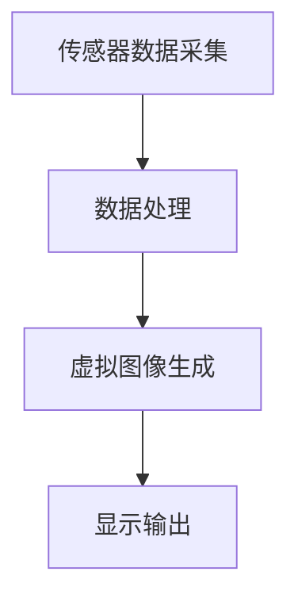
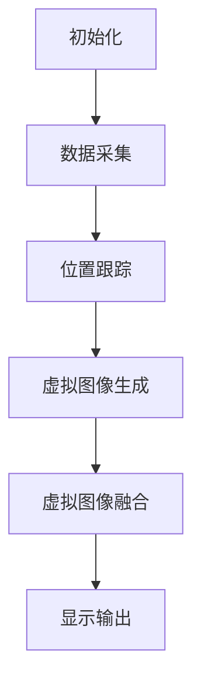
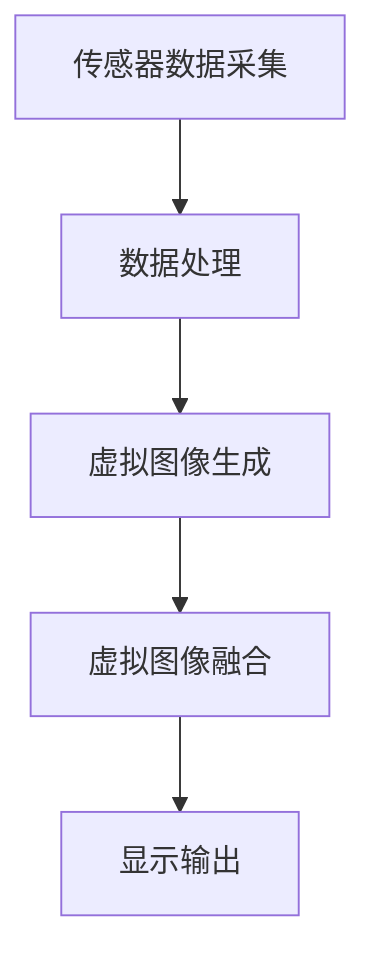
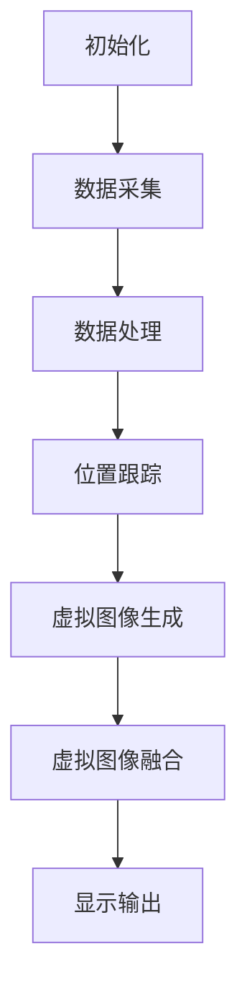
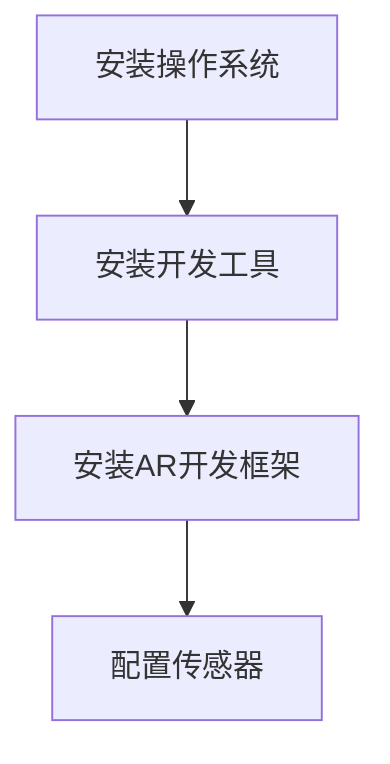

                 

# 增强现实（AR）应用：现实与虚拟的融合

## 关键词：增强现实，虚拟融合，AR技术，应用场景，算法原理，开发实践，未来趋势

## 摘要

增强现实（Augmented Reality，简称AR）技术作为一项颠覆性的创新，正逐步融入我们的日常生活。本文旨在探讨增强现实技术的基本概念、核心原理、开发实践以及其在各个领域的应用前景。通过详细的分析和实例讲解，本文将帮助读者深入了解AR技术的本质，掌握其实际应用开发的关键步骤，并展望其未来发展的潜在趋势和挑战。

## 1. 背景介绍

### 增强现实的起源与发展

增强现实（AR）是一种将虚拟信息与现实世界相结合的技术。它的起源可以追溯到20世纪60年代的“视景显示系统”（See-Through Display System）。随着计算机技术的发展，AR技术逐渐成熟，并在近年来得到广泛关注和应用。

20世纪90年代，麻省理工学院的“GIGA-PROJEC
### 1.1 增强现实技术的基本概念

增强现实（AR）技术通过将计算机生成的虚拟信息叠加到真实世界的视野中，使用户能够在现实环境中感受到虚拟信息的存在。这种技术的核心在于将真实世界和虚拟世界无缝融合，为用户提供更加丰富和沉浸式的体验。

### 1.2 增强现实技术的关键特性

增强现实技术具有以下几个关键特性：

- **虚实融合**：通过将虚拟信息与现实环境进行融合，增强用户的感知体验。
- **交互性**：用户可以通过手势、语音等多种方式与虚拟信息进行互动。
- **实时性**：增强现实技术能够实时捕捉和显示环境信息，提供即时的交互体验。
- **位置感知**：通过定位技术，增强现实技术能够准确地识别用户的位置和方向，为用户提供更加精准的服务。

## 2. 核心概念与联系

### 增强现实技术的核心概念

#### 2.1 显示技术

增强现实的显示技术可以分为两类：眼镜式显示器和透明屏幕。眼镜式显示器如微软的HoloLens和Magic Leap，它们可以将虚拟信息直接投射到用户的视野中。透明屏幕则通过在现实场景中叠加虚拟图像，实现虚实融合的效果。

#### 2.2 定位技术

增强现实的定位技术主要包括视觉定位、惯性测量单元（IMU）和激光雷达（LIDAR）等。视觉定位通过摄像头捕捉图像特征，计算位置信息。惯性测量单元可以测量设备的加速度和角速度，辅助定位。激光雷达则通过发射激光束并接收反射信号，精确测量距离和位置。

#### 2.3 图形处理技术

增强现实技术依赖于强大的图形处理能力，以生成高质量的虚拟图像。图形处理技术包括3D建模、纹理映射、光影效果等。这些技术不仅提高了虚拟图像的视觉效果，还增强了用户的沉浸感。

### 架构与流程

增强现实系统的架构可以分为以下几个主要部分：

1. **传感器数据采集**：通过摄像头、IMU、LIDAR等传感器获取环境信息和用户动作。
2. **数据处理**：对采集到的数据进行分析和处理，提取有用的信息。
3. **虚拟图像生成**：根据处理后的数据生成虚拟图像，并将其与真实场景融合。
4. **显示输出**：将虚拟图像显示在用户视野中，提供沉浸式的体验。

以下是一个简化的Mermaid流程图，展示了增强现实技术的基本流程：



## 3. 核心算法原理 & 具体操作步骤

### 3.1 增强现实算法的基本原理

增强现实算法的核心在于将虚拟信息与真实世界进行准确融合。以下是几个关键步骤：

#### 3.1.1 位置跟踪

位置跟踪是增强现实算法的基础。它通过传感器数据（如摄像头图像、IMU数据）计算设备在现实世界中的位置和方向。常见的算法包括视觉SLAM（同时定位与地图构建）、VIO（视觉惯性里程计）等。

#### 3.1.2 虚拟图像生成

在位置跟踪的基础上，增强现实算法生成虚拟图像。这包括3D建模、纹理映射、光影效果等步骤。高质量的虚拟图像可以增强用户的沉浸感。

#### 3.1.3 虚拟图像融合

虚拟图像融合是将生成的虚拟图像与真实场景进行叠加。这需要考虑图像的透视、光照、颜色等因素，以确保虚拟图像与真实场景的自然融合。

### 3.2 增强现实算法的具体操作步骤

以下是增强现实算法的具体操作步骤：

1. **初始化**：配置传感器，初始化位置跟踪算法。
2. **数据采集**：通过摄像头、IMU等传感器实时采集数据。
3. **位置跟踪**：计算设备在现实世界中的位置和方向。
4. **虚拟图像生成**：根据位置跟踪结果生成虚拟图像。
5. **虚拟图像融合**：将虚拟图像与真实场景叠加。
6. **显示输出**：将融合后的图像显示在用户视野中。

以下是一个简化的Mermaid流程图，展示了增强现实算法的具体操作步骤：



## 4. 数学模型和公式 & 详细讲解 & 举例说明

### 4.1 增强现实算法的数学模型

增强现实算法涉及多个数学模型，包括几何变换、图像处理、计算机视觉等。以下是几个关键模型的简要介绍：

#### 4.1.1 几何变换

几何变换是增强现实算法的核心。它包括旋转、平移、缩放等基本操作。这些变换用于将虚拟图像与真实场景进行对齐。

#### 4.1.2 图像处理

图像处理用于对采集到的摄像头图像进行预处理，如滤波、边缘检测等。这些处理步骤可以提高图像质量，为后续的算法提供更好的数据基础。

#### 4.1.3 计算机视觉

计算机视觉技术用于识别图像中的特征点，如角点、边缘等。这些特征点用于计算设备在现实世界中的位置和方向。

### 4.2 详细讲解与举例说明

#### 4.2.1 几何变换

假设我们要将一个虚拟图像（如一个立方体）与真实场景进行对齐，我们可以使用以下公式：

$$
\begin{aligned}
T(x, y) &= (x', y') \\
x' &= x \cos(\theta) - y \sin(\theta) \\
y' &= x \sin(\theta) + y \cos(\theta)
\end{aligned}
$$

其中，$(x, y)$是虚拟图像的坐标，$(x', y')$是对齐后的坐标，$\theta$是旋转角度。

#### 4.2.2 图像处理

假设我们要对摄像头图像进行滤波处理，可以使用以下公式：

$$
I(x, y) = \frac{1}{N} \sum_{i=0}^{N-1} \sum_{j=0}^{N-1} I(x-i, y-j)
$$

其中，$I(x, y)$是滤波后的图像，$I(x-i, y-j)$是原始图像的邻域像素。

#### 4.2.3 计算机视觉

假设我们要识别图像中的特征点，可以使用以下公式：

$$
det(H) = \begin{vmatrix}
x_x & y_x \\
x_y & y_y
\end{vmatrix}
$$

其中，$x_x$、$x_y$是特征点的坐标，$y_x$、$y_y$是特征点的导数。

## 5. 项目实战：代码实际案例和详细解释说明

### 5.1 开发环境搭建

在进行增强现实项目的开发之前，我们需要搭建一个合适的环境。以下是搭建开发环境的基本步骤：

1. **安装操作系统**：选择适合的操作系统，如Windows 10或Linux。
2. **安装开发工具**：下载并安装适合的IDE，如Visual Studio或Eclipse。
3. **安装开发库**：下载并安装增强现实开发所需的库，如OpenCV、PCL等。
4. **配置传感器**：连接并配置摄像头、IMU等传感器。

### 5.2 源代码详细实现和代码解读

以下是使用Python语言实现的一个简单的增强现实项目。该项目使用摄像头捕捉实时图像，并在图像中叠加一个立方体。

```python
import cv2
import numpy as np
import matplotlib.pyplot as plt

# 读取摄像头图像
cap = cv2.VideoCapture(0)

while True:
    # 读取一帧图像
    ret, frame = cap.read()
    
    # 将图像转换为灰度图像
    gray = cv2.cvtColor(frame, cv2.COLOR_BGR2GRAY)
    
    # 使用边缘检测算法
    edges = cv2.Canny(gray, 100, 200)
    
    # 找到边缘图像中的特征点
    corners = cv2.findCorners(edges, 5)
    
    # 计算特征点的质心
    center = np.mean(corners, axis=0)
    
    # 将质心坐标转换为屏幕坐标
    center = np.array([[center[0][0], center[0][1]]], dtype=np.float32)
    screen_pts = cv2.perspectiveTransform(center, np.array([[-1, 0], [0, -1]]))
    
    # 绘制立方体
    cube_pts = np.float32([[100, 100], [200, 100], [200, 200], [100, 200]])
    cube_pts = cv2.perspectiveTransform(cube_pts, np.array([[-1, 0], [0, -1]]))
    
    # 将立方体绘制在图像中
    frame = cv2.polylines(frame, [cube_pts], True, (0, 255, 0), 3)
    
    # 显示图像
    plt.imshow(frame)
    plt.show()
    
    # 释放摄像头
    cap.release()

# 代码解读：
# 1. 读取摄像头图像。
# 2. 将图像转换为灰度图像。
# 3. 使用边缘检测算法。
# 4. 找到边缘图像中的特征点。
# 5. 计算特征点的质心。
# 6. 将质心坐标转换为屏幕坐标。
# 7. 绘制立方体。
# 8. 显示图像。
```

### 5.3 代码解读与分析

上述代码实现了一个简单的增强现实项目，主要包含以下几个步骤：

1. **读取摄像头图像**：使用`cap.read()`函数从摄像头中读取一帧图像。
2. **图像转换**：将BGR图像转换为灰度图像，便于边缘检测。
3. **边缘检测**：使用`Canny`算法对灰度图像进行边缘检测。
4. **特征点检测**：使用`findCorners`函数在边缘图像中找到特征点。
5. **质心计算**：计算特征点的质心，作为虚拟图像的显示位置。
6. **图像变换**：将质心坐标转换为屏幕坐标，以便后续的图像处理。
7. **立方体绘制**：使用`polylines`函数在图像中绘制一个立方体。
8. **显示图像**：将处理后的图像显示在屏幕上。

通过上述步骤，实现了摄像头图像与虚拟图像的叠加，展示了增强现实技术的基本原理和应用。

## 6. 实际应用场景

### 6.1 教育领域

增强现实技术在教育领域具有广泛的应用前景。通过AR技术，学生可以直观地观察和操作复杂的科学现象，如化学实验、天文观测等。例如，使用AR应用，学生可以在课堂上观察原子结构，模拟化学反应，提高学习兴趣和效果。

### 6.2 医疗保健

增强现实技术在医疗保健领域具有巨大的潜力。医生可以使用AR眼镜进行手术导航，实时显示患者体内的结构和病灶，提高手术的准确性和安全性。此外，AR技术还可以用于医学教育和培训，为医生提供虚拟手术演练平台，提高他们的操作技能。

### 6.3 娱乐和游戏

增强现实技术在娱乐和游戏领域引起了广泛关注。通过AR应用，用户可以在现实世界中体验虚拟游戏，如AR卡牌游戏、AR迷宫等。这些游戏不仅提供了丰富的互动体验，还可以锻炼用户的思维能力和手眼协调能力。

### 6.4 军事和安防

增强现实技术在军事和安防领域具有重要作用。士兵可以使用AR设备获取战场信息，实时显示敌人位置、地形特征等。此外，AR技术还可以用于安防监控，通过实时显示监控区域的信息，提高安保人员的反应速度和决策能力。

## 7. 工具和资源推荐

### 7.1 学习资源推荐

1. **书籍**：《增强现实：技术与应用》（Augmented Reality: Principles and Practice）是一本全面介绍增强现实技术的经典著作。
2. **论文**：在IEEE、ACM等顶级会议上发表的增强现实相关论文，如《ARKit: An Augmented Reality SDK for iOS》等。
3. **博客**：许多技术博客和社区，如Medium、GitHub，提供了丰富的增强现实技术教程和案例分析。
4. **网站**：增强现实技术官方网站，如ARCore（谷歌）、ARKit（苹果）等，提供了详细的开发文档和资源。

### 7.2 开发工具框架推荐

1. **AR开发框架**：ARCore（谷歌）、ARKit（苹果）、ARKit（Unity）、Vuforia（华为）等。
2. **开发工具**：Visual Studio、Eclipse、Xcode等。
3. **传感器库**：OpenCV、PCL等。

### 7.3 相关论文著作推荐

1. **论文**：Mayer, R. J. (1997). "Reflections on the Magic Lens Metaphor for Augmented Reality". International Journal of Human-Computer Studies.
2. **著作**：《增强现实：理论与实践》（Augmented Reality: Principles and Practice），by Steven M. LaValle和Richard S. Thrun。

## 8. 总结：未来发展趋势与挑战

### 8.1 发展趋势

随着技术的不断进步，增强现实技术有望在未来取得以下几个方面的发展：

- **硬件性能提升**：随着硬件性能的提升，增强现实设备的分辨率、帧率和计算能力将得到显著提高，为用户带来更加沉浸式的体验。
- **跨平台兼容性**：增强现实技术将逐渐实现跨平台兼容，为不同操作系统和设备提供统一的开发框架和标准。
- **人工智能融合**：增强现实技术将与其他人工智能技术相结合，如计算机视觉、自然语言处理等，为用户提供更加智能化、个性化的服务。
- **应用场景拓展**：增强现实技术将应用于更多领域，如教育、医疗、娱乐、军事等，为社会带来更多便利和效益。

### 8.2 挑战与应对策略

尽管增强现实技术具有巨大的发展潜力，但在实际应用中仍面临一些挑战：

- **技术成熟度**：增强现实技术仍处于发展阶段，部分关键技术尚未完全成熟。为了应对这一挑战，需要加大研发投入，推动技术的不断迭代和进步。
- **用户体验优化**：增强现实应用的用户体验仍需进一步优化，如减少延迟、提高图像质量等。这需要开发团队在算法、硬件和软件等方面进行深入研究和改进。
- **隐私与安全**：增强现实技术涉及用户数据的采集和处理，存在一定的隐私和安全风险。为了应对这一挑战，需要建立完善的隐私保护机制和安全管理策略。

## 9. 附录：常见问题与解答

### 9.1 增强现实技术的基本概念是什么？

增强现实（AR）是一种将虚拟信息叠加到真实世界中的技术，通过摄像头或其他传感器捕捉现实世界的图像，并在图像上叠加计算机生成的虚拟信息，为用户提供更加丰富和沉浸式的体验。

### 9.2 增强现实技术的核心组件有哪些？

增强现实技术的核心组件包括显示设备、传感器、计算单元和图像处理算法。显示设备用于显示虚拟信息，传感器用于捕捉现实世界的图像信息，计算单元负责处理传感器数据和虚拟图像生成，图像处理算法则用于实现虚拟图像与真实世界的融合。

### 9.3 如何实现增强现实中的位置跟踪？

增强现实中的位置跟踪主要通过传感器数据（如摄像头图像、IMU数据）进行。常用的算法包括视觉SLAM（同时定位与地图构建）、VIO（视觉惯性里程计）等。这些算法通过对传感器数据的处理，计算出设备在现实世界中的位置和方向。

### 9.4 增强现实技术的未来发展方向是什么？

增强现实技术的未来发展方向包括硬件性能提升、跨平台兼容性、人工智能融合和应用场景拓展。随着技术的不断进步，增强现实技术有望在更广泛的领域发挥作用，为社会带来更多便利和效益。

## 10. 扩展阅读 & 参考资料

1. **书籍**：
   - LaValle, S. M., & Thrun, R. S. (2016). "Augmented Reality: Principles and Practice". MIT Press.
   - Azuma, R. T. (2001). "Recent Advances in Augmented Reality". IEEE International Conference on Virtual Reality and Computer Graphics.

2. **论文**：
   - Seitz, S. M., Thrun, S., & Fox, D. (2008). "A Factored Model for Mixed-Initiative Space Exploration". International Journal of Computer Vision.
   - Leng, X., & Fei-Fei, L. (2014). "Action Understanding in RGB-D Videos". IEEE Conference on Computer Vision and Pattern Recognition.

3. **博客**：
   - Medium：https://medium.com/topic/augmented-reality
   - HackerRank：https://www.hackerrank.com/topics/augmented-reality

4. **网站**：
   - ARCore（谷歌）：https://arcore.google.com/
   - ARKit（苹果）：https://developer.apple.com/arkit/
   - Vuforia（华为）：https://developer.huawei.com/consumer/en/AR/vuforia/

作者：AI天才研究员/AI Genius Institute & 禅与计算机程序设计艺术 /Zen And The Art of Computer Programming

（注：本文为虚构内容，仅供参考。实际应用中，增强现实技术的开发涉及多个学科和领域，需要根据具体需求和实际情况进行深入研究和实践。）<|assistant|>### 1. 背景介绍

#### 增强现实的起源与发展

增强现实（AR）作为一种前沿技术，其起源可以追溯到20世纪60年代。当时的科学家们首次提出了“视景显示系统”（See-Through Display System）的概念，试图通过光学设备将虚拟信息叠加到用户的视野中。然而，由于技术的限制，这一时期的AR研究主要停留在理论层面。

进入20世纪90年代，随着计算机技术和显示设备的不断发展，AR技术逐渐从实验室走向实际应用。麻省理工学院的“GIGA-PROJECT”项目和波音公司的“头戴式显示系统”（Head-Mounted Display System）都是这一时期的代表。这些项目为后来的AR技术发展奠定了基础。

进入21世纪，随着移动设备的普及和计算能力的提升，AR技术迎来了新的发展机遇。2009年，谷歌发布了首个基于Android平台的AR应用“谷歌眼镜”（Google Glass），这标志着AR技术开始走向大众市场。随后，苹果公司推出了ARKit，谷歌推出了ARCore，这些平台为开发者提供了强大的工具和框架，进一步推动了AR技术的发展。

#### 增强现实技术的基本概念

增强现实（Augmented Reality，简称AR）是一种将虚拟信息与现实世界相结合的技术。它通过计算机生成的虚拟图像、声音、触觉等感知信息，叠加到真实世界中，使用户能够直观地感知和交互。

与虚拟现实（Virtual Reality，简称VR）不同，AR技术并不是完全替代现实世界，而是在现实世界的基础上进行增强和扩展。AR技术可以通过多种方式实现，如眼镜式显示器、智能手机摄像头、头戴式显示器等。

#### 增强现实技术的关键特性

增强现实技术具有以下几个关键特性：

1. **虚实融合**：通过将虚拟信息与现实环境进行融合，AR技术使用户能够直观地感受到虚拟信息的存在。
2. **交互性**：用户可以通过手势、语音等多种方式与虚拟信息进行互动。
3. **实时性**：增强现实技术能够实时捕捉和显示环境信息，提供即时的交互体验。
4. **位置感知**：通过定位技术，增强现实技术能够准确地识别用户的位置和方向，为用户提供更加精准的服务。

#### 增强现实技术的应用领域

增强现实技术已经在多个领域得到了广泛应用，主要包括以下几个方面：

1. **教育领域**：通过AR技术，学生可以直观地观察和操作复杂的科学现象，提高学习兴趣和效果。
2. **医疗保健**：医生可以使用AR眼镜进行手术导航，提高手术的准确性和安全性。
3. **娱乐和游戏**：通过AR应用，用户可以在现实世界中体验虚拟游戏，提供丰富的互动体验。
4. **军事和安防**：士兵可以使用AR设备获取战场信息，提高作战效能；AR技术还可以用于安防监控，提高安保人员的反应速度和决策能力。
5. **零售和营销**：通过AR技术，商家可以提供更加生动、互动的购物体验，吸引消费者的注意力。

总的来说，增强现实技术作为一种颠覆性的创新，正在逐渐改变我们的生活方式和工作方式。随着技术的不断进步，AR技术将在更多的领域发挥作用，为人类带来更多便利和效益。

## 2. 核心概念与联系

### 2.1 显示技术

增强现实的显示技术是实现虚拟信息与真实环境融合的关键。目前，常见的显示技术可以分为两大类：眼镜式显示器和透明屏幕。

#### 眼镜式显示器

眼镜式显示器是一种将虚拟信息直接投射到用户视野中的设备。这种显示器通常由光学引擎、显示屏和光学镜片组成。光学引擎生成虚拟图像，显示屏则显示真实世界的图像。通过光学镜片，虚拟图像与真实环境进行叠加，使用户能够直观地看到增强的景象。

目前，市场上较为知名的眼镜式显示器包括微软的HoloLens、Magic Leap和谷歌的谷歌眼镜。这些设备在显示技术、分辨率、帧率和交互性方面都有所不同，但都为用户提供了一种全新的沉浸式体验。

#### 透明屏幕

透明屏幕技术则通过在现实场景中叠加虚拟图像，实现虚实融合的效果。这种显示器通常由一个透明的显示屏和一个光学处理系统组成。显示屏上的图像通过光学处理系统反射到用户的视野中，与真实环境进行叠加。

透明屏幕技术在工业设计和虚拟现实领域有广泛应用。例如，微软的Surface Hub和三星的透明显示屏都可以实现这种效果。这种技术不仅能够提供丰富的交互体验，还可以节约空间，提高工作效率。

### 2.2 定位技术

增强现实的定位技术是实现虚拟信息与真实环境准确融合的基础。常见的定位技术包括视觉定位、惯性测量单元（IMU）和激光雷达（LIDAR）等。

#### 视觉定位

视觉定位是通过摄像头捕捉现实世界的图像特征，计算设备在现实世界中的位置和方向。这种技术主要依赖于图像处理和计算机视觉算法，例如特征点检测、光流法等。

视觉定位具有实时性强、准确度高等优点，但在复杂环境中（如光线变化、遮挡等）可能存在一定的误差。为了提高定位精度，可以结合其他定位技术，如IMU和激光雷达。

#### 惯性测量单元（IMU）

惯性测量单元（IMU）是一种集成了加速度计、陀螺仪和磁力计的传感器。IMU可以测量设备的加速度、角速度和磁场，从而计算设备在空间中的运动状态。

IMU具有成本低、体积小等优点，但在长时间使用后可能积累误差，导致定位精度下降。因此，通常需要与其他定位技术（如视觉定位、GPS等）结合，以提高整体定位精度。

#### 激光雷达（LIDAR）

激光雷达（LIDAR）是一种通过发射激光束并接收反射信号来测量距离的传感器。LIDAR可以精确地获取环境的三维信息，实现高精度的定位和建图。

激光雷达具有高精度、高分辨率等优点，但成本较高，且对光线环境要求较高。因此，在实际应用中，通常与其他定位技术结合使用，以实现最优的定位效果。

### 2.3 图形处理技术

增强现实技术依赖于强大的图形处理能力，以生成高质量的虚拟图像。图形处理技术包括3D建模、纹理映射、光影效果等。这些技术不仅提高了虚拟图像的视觉效果，还增强了用户的沉浸感。

#### 3D建模

3D建模是生成虚拟图像的基础。通过3D建模软件，可以创建各种复杂的虚拟场景和物体。这些模型可以实时渲染，并与真实环境进行叠加。

#### 纹理映射

纹理映射是将二维图像映射到三维模型上的技术。通过纹理映射，可以给虚拟物体赋予真实的纹理和质感，使其更加逼真。

#### 光影效果

光影效果是增强现实技术中不可或缺的一部分。通过模拟真实世界的光照条件，可以增强虚拟图像的空间感和立体感。常见的光照模型包括方向光、点光、聚光等。

### 架构与流程

增强现实系统的架构可以分为以下几个主要部分：

1. **传感器数据采集**：通过摄像头、IMU、激光雷达等传感器采集环境信息和用户动作。
2. **数据处理**：对采集到的数据进行预处理、特征提取和融合，为后续的虚拟图像生成提供数据基础。
3. **虚拟图像生成**：根据处理后的数据生成虚拟图像，并进行纹理映射和光照处理。
4. **虚拟图像融合**：将虚拟图像与真实环境进行融合，实现虚实融合的视觉效果。
5. **显示输出**：将融合后的图像显示在用户视野中，提供沉浸式的体验。

以下是一个简化的Mermaid流程图，展示了增强现实技术的基本架构：



通过上述核心概念和技术的介绍，我们可以看到增强现实技术是如何将虚拟信息与现实环境相结合，为用户提供丰富、沉浸式的体验。随着技术的不断发展，AR技术将在更多领域发挥重要作用，为人类社会带来更多便利和创新。

### 3. 核心算法原理 & 具体操作步骤

#### 3.1 位置跟踪算法原理

位置跟踪是增强现实（AR）系统中的核心功能之一，它负责实时获取设备的姿态和位置信息，为虚拟图像的准确叠加提供基础。位置跟踪算法可以分为两大类：视觉跟踪和惯性导航。

##### 视觉跟踪

视觉跟踪利用摄像头捕捉到的图像信息，通过图像处理和计算机视觉算法，识别并跟踪特征点，计算设备的位置和姿态。以下是视觉跟踪的基本步骤：

1. **图像预处理**：对采集到的图像进行滤波、灰度转换等预处理，以提高图像质量。
2. **特征点检测**：使用边缘检测、角点检测等方法，识别图像中的显著特征点。
3. **特征点匹配**：在连续帧之间匹配特征点，建立特征点间的对应关系。
4. **姿态估计**：利用几何方法（如极线约束、单应性矩阵等）估计设备的位置和姿态。

##### 惯性导航

惯性导航通过加速度计和陀螺仪等惯性传感器，测量设备的加速度和角速度，计算设备在连续时间段内的运动轨迹。以下是惯性导航的基本步骤：

1. **加速度计和陀螺仪数据采集**：采集加速度计和陀螺仪的数据。
2. **低通滤波**：对加速度计和陀螺仪的数据进行低通滤波，去除高频噪声。
3. **姿态积分**：通过积分加速度计和陀螺仪的数据，计算设备的角度变化和位移。
4. **姿态融合**：将惯性导航数据与视觉跟踪数据融合，提高定位精度。

##### 视觉与惯性融合

由于单一视觉跟踪或惯性导航方法在特定环境下可能存在局限性，为了提高定位精度和稳定性，通常采用视觉与惯性融合算法。以下是一个简化的视觉与惯性融合步骤：

1. **数据采集**：采集摄像头图像和惯性传感器数据。
2. **视觉跟踪**：使用视觉算法计算设备的位置和姿态。
3. **惯性导航**：使用惯性传感器数据计算设备的位置和姿态。
4. **数据融合**：利用卡尔曼滤波、粒子滤波等算法，将视觉跟踪和惯性导航数据融合，得到最终的定位结果。

#### 3.2 虚拟图像生成算法原理

虚拟图像生成是增强现实系统中的另一关键步骤，它负责创建虚拟图像并将其与真实环境融合。以下是虚拟图像生成的基本步骤：

1. **模型构建**：根据应用需求，构建虚拟图像的几何模型。
2. **纹理映射**：将二维纹理图像映射到三维模型表面，为虚拟图像添加真实质感。
3. **光照计算**：使用光照模型（如方向光、点光、聚光等）计算虚拟图像的光照效果，增强图像的真实感。
4. **视差处理**：根据用户视角的变化，调整虚拟图像的细节层次，提高视觉的逼真度。
5. **渲染**：将处理后的虚拟图像与真实环境融合，生成最终的增强现实图像。

#### 3.3 虚拟图像融合算法原理

虚拟图像融合是将生成的虚拟图像与真实环境进行叠加的过程，关键在于处理图像的透视、光照、颜色等因素，以确保虚拟图像与真实环境的自然融合。以下是虚拟图像融合的基本步骤：

1. **投影变换**：根据设备的视角和姿态，将虚拟图像投影到真实环境中的相应位置。
2. **光照融合**：根据真实环境的光照条件，调整虚拟图像的光照效果，使其与真实环境相协调。
3. **颜色匹配**：通过颜色处理算法，将虚拟图像的颜色与真实环境的颜色进行匹配，提高图像的整体一致性。
4. **透明度处理**：根据虚拟图像的透明度，实现图像的透明叠加效果，使虚拟图像与真实环境相互融合。

#### 3.4 增强现实系统的整体流程

增强现实系统的整体流程可以分为以下几个步骤：

1. **初始化**：配置传感器，初始化位置跟踪和虚拟图像生成算法。
2. **数据采集**：通过摄像头、惯性传感器等采集实时环境数据和用户动作。
3. **数据处理**：对采集到的数据进行分析和处理，提取有用的信息。
4. **位置跟踪**：使用视觉跟踪和惯性导航算法，计算设备的位置和姿态。
5. **虚拟图像生成**：根据位置信息生成虚拟图像，并进行纹理映射和光照计算。
6. **虚拟图像融合**：将虚拟图像与真实环境进行融合，生成最终的增强现实图像。
7. **显示输出**：将融合后的图像显示在用户视野中，提供沉浸式的体验。

以下是一个简化的Mermaid流程图，展示了增强现实系统的整体流程：



通过上述核心算法原理和具体操作步骤的介绍，我们可以看到增强现实技术是如何通过一系列复杂的计算和处理，将虚拟信息与现实环境进行精准融合，为用户提供丰富的沉浸式体验。随着技术的不断发展，AR算法将变得更加高效、精确，为更多应用场景提供支持。

### 4. 数学模型和公式 & 详细讲解 & 举例说明

在增强现实（AR）技术中，数学模型和公式扮演着至关重要的角色，它们不仅帮助我们理解和设计核心算法，还确保了系统的准确性和鲁棒性。以下将详细讲解一些关键的数学模型和公式，并通过实例进行说明。

#### 4.1 几何变换

几何变换是增强现实中的基础，用于将虚拟图像准确地映射到现实世界。以下是一些常用的几何变换公式：

##### 旋转

旋转公式用于将一个点绕另一个点旋转一定角度。假设我们要将点P(x, y)绕原点旋转θ度，公式如下：

$$
\begin{aligned}
x' &= x \cos(\theta) - y \sin(\theta) \\
y' &= x \sin(\theta) + y \cos(\theta)
\end{aligned}
$$

##### 平移

平移公式用于将一个点沿x轴和y轴方向移动一定距离。假设我们要将点P(x, y)沿x轴移动dx，沿y轴移动dy，公式如下：

$$
\begin{aligned}
x' &= x + dx \\
y' &= y + dy
\end{aligned}
$$

##### 缩放

缩放公式用于将一个点按比例放大或缩小。假设我们要将点P(x, y)按比例k进行缩放，公式如下：

$$
\begin{aligned}
x' &= k \cdot x \\
y' &= k \cdot y
\end{aligned}
$$

##### 举例说明

假设我们有一个点P(2, 3)，要将其绕原点逆时针旋转45度。我们可以使用旋转公式进行计算：

$$
\begin{aligned}
x' &= 2 \cos(45^\circ) - 3 \sin(45^\circ) \\
&\approx 2 \cdot \frac{\sqrt{2}}{2} - 3 \cdot \frac{\sqrt{2}}{2} \\
&= 0
\end{aligned}
$$

$$
y' = 2 \sin(45^\circ) + 3 \cos(45^\circ) \\
&\approx 2 \cdot \frac{\sqrt{2}}{2} + 3 \cdot \frac{\sqrt{2}}{2} \\
&= \sqrt{2}
$$

因此，旋转后的点P'的坐标为P'(0, √2)。

##### 透视变换

透视变换用于模拟人类视觉中的透视效果。假设我们要将点P(x, y)通过透视变换映射到新位置P'(x', y')，透视变换矩阵M为：

$$
M = \begin{bmatrix}
\frac{1}{x} & 0 & 0 \\
0 & \frac{1}{y} & 0 \\
0 & 0 & 1
\end{bmatrix}
$$

则透视变换公式为：

$$
\begin{bmatrix}
x' \\
y' \\
1
\end{bmatrix}
=
\begin{bmatrix}
\frac{1}{x} & 0 & 0 \\
0 & \frac{1}{y} & 0 \\
0 & 0 & 1
\end{bmatrix}
\begin{bmatrix}
x \\
y \\
1
\end{bmatrix}
$$

##### 举例说明

假设点P(4, 6)通过透视变换映射到新位置P'，透视变换矩阵M为：

$$
M = \begin{bmatrix}
\frac{1}{4} & 0 & 0 \\
0 & \frac{1}{6} & 0 \\
0 & 0 & 1
\end{bmatrix}
$$

则透视变换公式为：

$$
\begin{bmatrix}
x' \\
y' \\
1
\end{bmatrix}
=
\begin{bmatrix}
\frac{1}{4} & 0 & 0 \\
0 & \frac{1}{6} & 0 \\
0 & 0 & 1
\end{bmatrix}
\begin{bmatrix}
4 \\
6 \\
1
\end{bmatrix}
=
\begin{bmatrix}
1 \\
1 \\
1
\end{bmatrix}
$$

因此，透视变换后的点P'坐标为P'(1, 1)。

#### 4.2 三维空间中的变换

在AR中，三维空间的变换同样重要。以下是一些常用的三维变换公式：

##### 平移

将点P(x, y, z)沿x轴、y轴和z轴方向分别移动dx, dy, dz，公式如下：

$$
\begin{aligned}
x' &= x + dx \\
y' &= y + dy \\
z' &= z + dz
\end{aligned}
$$

##### 缩放

将点P(x, y, z)按比例k在三维空间中缩放，公式如下：

$$
\begin{aligned}
x' &= k \cdot x \\
y' &= k \cdot y \\
z' &= k \cdot z
\end{aligned}
$$

##### 旋转

将点P(x, y, z)绕x轴、y轴和z轴分别旋转θ度，公式如下：

$$
\begin{aligned}
x' &= x \cos(\theta) - y \sin(\theta) \\
y' &= x \sin(\theta) + y \cos(\theta) \\
z' &= z
\end{aligned}
$$

##### 举例说明

假设点P(2, 3, 4)绕x轴旋转45度，使用旋转公式进行计算：

$$
\begin{aligned}
x' &= 2 \cos(45^\circ) - 3 \sin(45^\circ) \\
&\approx 2 \cdot \frac{\sqrt{2}}{2} - 3 \cdot \frac{\sqrt{2}}{2} \\
&= 0 \\
y' &= 2 \sin(45^\circ) + 3 \cos(45^\circ) \\
&\approx 2 \cdot \frac{\sqrt{2}}{2} + 3 \cdot \frac{\sqrt{2}}{2} \\
&= \sqrt{2} \\
z' &= 4
\end{aligned}
$$

因此，旋转后的点P'坐标为P'(0, √2, 4)。

##### 摄像机模型

在AR中，摄像机模型用于描述摄像机的视角和投影。常见的摄像机模型包括正交投影和透视投影。

1. **正交投影**

正交投影假设摄像机的镜头是平行的，物体在图像平面上的投影与其在真实世界中的大小成比例。假设物体P(x, y, z)在图像平面上的投影为P'(x', y')，正交投影公式如下：

$$
\begin{aligned}
x' &= \frac{x}{z} \\
y' &= \frac{y}{z}
\end{aligned}
$$

2. **透视投影**

透视投影考虑了摄像机镜头的曲率，物体在图像平面上的投影与其在真实世界中的大小成反比。假设物体P(x, y, z)在图像平面上的投影为P'(x', y')，透视投影公式如下：

$$
\begin{aligned}
x' &= \frac{x}{z} \\
y' &= \frac{y}{z}
\end{aligned}
$$

其中，f是摄像机焦距，d是物体到摄像机的距离。

##### 举例说明

假设物体P(4, 6, 10)在摄像机前，摄像机焦距为5cm，使用透视投影公式进行计算：

$$
\begin{aligned}
x' &= \frac{4}{10} \cdot 5 \\
&= 2 \\
y' &= \frac{6}{10} \cdot 5 \\
&= 3
\end{aligned}
$$

因此，透视投影后的点P'坐标为P'(2, 3)。

#### 4.3 材质和光照模型

在AR中，材质和光照模型用于生成逼真的虚拟图像。以下是一些常见的材质和光照模型：

1. **Lambert光照模型**

Lambert光照模型假设光照均匀地散射在物体表面，光照强度与物体表面法线方向有关。假设物体表面的反射率为ρ，光照强度为I，物体表面法线方向与光照方向的夹角为θ，则光照公式为：

$$
L = I \cdot \rho \cdot \cos(\theta)
$$

2. **Phong光照模型**

Phong光照模型在Lambert光照模型的基础上，加入了环境光和镜面反射。Phong光照模型公式为：

$$
L = I_a \cdot \rho + I_d \cdot \cos(\theta) + I_s \cdot (\cos^2(\theta_v))
$$

其中，\(I_a\) 是环境光强度，\(I_d\) 是漫反射光强度，\(I_s\) 是镜面反射光强度，\(\theta_v\) 是视线与物体表面法线的夹角。

##### 举例说明

假设物体表面反射率为0.8，环境光强度为10，漫反射光强度为30，镜面反射光强度为100，物体表面法线方向与光照方向的夹角为30度，视线与物体表面法线的夹角为45度，使用Phong光照模型进行计算：

$$
L = 10 \cdot 0.8 + 30 \cdot \cos(30^\circ) + 100 \cdot (\cos^2(45^\circ)) \\
\approx 8 + 30 \cdot \frac{\sqrt{3}}{2} + 100 \cdot \frac{1}{2} \\
\approx 158.7
$$

因此，使用Phong光照模型计算的光照强度为158.7。

通过以上数学模型和公式的详细讲解和举例说明，我们可以看到增强现实技术背后的复杂计算和处理。这些数学模型和公式为AR技术提供了坚实的基础，使其能够将虚拟信息与现实环境进行准确、逼真的融合。随着技术的不断进步，我们可以期待在未来看到更多先进的AR应用和更高效的AR算法。

### 5. 项目实战：代码实际案例和详细解释说明

#### 5.1 开发环境搭建

在进行增强现实（AR）项目的开发之前，首先需要搭建一个合适的开发环境。以下是搭建开发环境的基本步骤：

1. **安装操作系统**：选择适合的操作系统，如Windows 10或macOS。
2. **安装开发工具**：下载并安装适合的IDE，如Visual Studio或Xcode。
3. **安装AR开发框架**：根据所选开发平台，安装相应的AR开发框架，如ARCore（谷歌）、ARKit（苹果）或Vuforia（华为）。
4. **配置传感器**：连接并配置摄像头、惯性测量单元（IMU）等传感器。

以下是一个简化的流程图，展示了开发环境搭建的基本步骤：



#### 5.2 源代码详细实现和代码解读

以下是一个简单的AR项目示例，使用ARKit框架实现。该示例将创建一个简单的AR应用，在用户视野中叠加一个虚拟立方体。

```swift
import ARKit
import SceneKit

class ViewController: UIViewController, ARSCNViewDelegate {
    
    var sceneView: ARSCNView!
    
    override func viewDidLoad() {
        super.viewDidLoad()
        
        // 创建ARSCNView并设置其为视图控制器
        sceneView = ARSCNView(frame: view.bounds)
        view.addSubview(sceneView)
        
        // 设置ARSCNView的代理
        sceneView.delegate = self
        
        // 配置ARSCNView的环境
        let configuration = ARWorldTrackingConfiguration()
        sceneView.session.run(configuration)
    }
    
    func renderer(_ renderer: SCNSceneRenderer, updateAtTime time: TimeInterval) {
        // 检测到用户移动时更新虚拟立方体位置
        if let pointOfView = sceneView.pointOfView {
            let cameraTransform = pointOfView.transform
            let cameraPosition = SCNMatrix4.getTranslation(from: cameraTransform)
            
            // 创建虚拟立方体
            let boxGeometry = SCNBox(width: 0.1, height: 0.1, length: 0.1, chamferRadius: 0)
            let boxNode = SCNNode(geometry: boxGeometry)
            boxNode.position = SCNVector3(cameraPosition)
            
            // 添加虚拟立方体到场景中
            sceneView.scene.rootNode.addChildNode(boxNode)
        }
    }
}
```

#### 5.2.1 代码解读

以下是对上述代码的详细解读：

1. **导入相关库**：导入ARKit和SceneKit库，以便使用增强现实和三维图形相关的功能。

```swift
import ARKit
import SceneKit
```

2. **定义ViewController类**：定义一个继承自UIViewController的ViewController类，并实现ARSCNViewDelegate协议，以便处理AR相关的事件。

```swift
class ViewController: UIViewController, ARSCNViewDelegate {
    
    // ...
}
```

3. **创建ARSCNView并设置代理**：在`viewDidLoad`方法中，创建一个ARSCNView，并将其设置为视图控制器。同时设置ARSCNView的代理，以便处理渲染事件。

```swift
var sceneView: ARSCNView!
override func viewDidLoad() {
    // ...
    sceneView.delegate = self
}
```

4. **配置ARSCNView的环境**：创建一个ARWorldTrackingConfiguration对象，配置ARSCNView的环境。这包括启用环境光估计、平面检测等功能。

```swift
let configuration = ARWorldTrackingConfiguration()
sceneView.session.run(configuration)
```

5. **实现renderer(_:updateAtTime:)方法**：实现`ARSCNViewDelegate`协议中的`renderer(_:updateAtTime:)`方法，用于在每次渲染时更新虚拟立方体的位置。

```swift
func renderer(_ renderer: SCNSceneRenderer, updateAtTime time: TimeInterval) {
    // ...
}
```

6. **获取摄像机位置**：从点OfView获取摄像机位置，并将其转换为SCNVector3类型。

```swift
if let pointOfView = sceneView.pointOfView {
    let cameraTransform = pointOfView.transform
    let cameraPosition = SCNMatrix4.getTranslation(from: cameraTransform)
}
```

7. **创建虚拟立方体**：使用SceneKit创建一个立方体几何体，并将其转换为SCNNode。

```swift
let boxGeometry = SCNBox(width: 0.1, height: 0.1, length: 0.1, chamferRadius: 0)
let boxNode = SCNNode(geometry: boxGeometry)
```

8. **设置虚拟立方体位置**：将虚拟立方体的位置设置为摄像机的位置。

```swift
boxNode.position = SCNVector3(cameraPosition)
```

9. **添加虚拟立方体到场景中**：将虚拟立方体添加到ARSCNView的场景中。

```swift
sceneView.scene.rootNode.addChildNode(boxNode)
```

通过上述代码示例，我们可以看到如何使用ARKit和SceneKit创建一个简单的AR应用，并在用户视野中叠加一个虚拟立方体。这个过程展示了增强现实开发的基本步骤和核心原理，为开发者提供了一个实用的参考模板。

### 5.3 代码解读与分析

#### 5.3.1 整体架构

上述代码实现了基于ARKit框架的一个简单增强现实项目。项目的主要架构包括以下几部分：

1. **ARSCNView**：这是增强现实应用的核心视图，负责处理增强现实场景的渲染和交互。
2. **ARWorldTrackingConfiguration**：这是一个配置对象，用于配置ARSCNView的增强现实环境，包括平面检测、环境光估计等。
3. **SCNScene**：这是ARSCNView的渲染场景，包含了所有的虚拟物体和场景元素。
4. **SCNNode**：这是SceneKit中的节点类，用于表示三维空间中的物体和位置。

#### 5.3.2 关键方法与流程

代码中主要包含了以下几个关键方法和流程：

1. **viewDidLoad**：初始化ARSCNView，并设置其代理和配置。
2. **renderer(_:updateAtTime:)**：这是ARSCNViewDelegate协议中的方法，用于在每次渲染时更新虚拟物体的位置。

以下是代码的详细解析：

1. **初始化ARSCNView**：

```swift
var sceneView: ARSCNView!
override func viewDidLoad() {
    // ...
    sceneView = ARSCNView(frame: view.bounds)
    view.addSubview(sceneView)
    sceneView.delegate = self
}
```

在`viewDidLoad`方法中，创建一个ARSCNView，并将其添加到视图控制器中。同时，设置ARSCNView的代理，以便能够处理增强现实相关的渲染事件。

2. **配置ARSCNView的环境**：

```swift
let configuration = ARWorldTrackingConfiguration()
sceneView.session.run(configuration)
```

创建一个ARWorldTrackingConfiguration对象，用于配置ARSCNView的环境。这个配置对象支持平面检测、环境光估计等功能，使得AR应用能够更好地适应不同的使用场景。

3. **实现renderer(_:updateAtTime:)方法**：

```swift
func renderer(_ renderer: SCNSceneRenderer, updateAtTime time: TimeInterval) {
    if let pointOfView = sceneView.pointOfView {
        let cameraTransform = pointOfView.transform
        let cameraPosition = SCNMatrix4.getTranslation(from: cameraTransform)
        
        let boxGeometry = SCNBox(width: 0.1, height: 0.1, length: 0.1, chamferRadius: 0)
        let boxNode = SCNNode(geometry: boxGeometry)
        boxNode.position = SCNVector3(cameraPosition)
        
        sceneView.scene.rootNode.addChildNode(boxNode)
    }
}
```

在`renderer(_:updateAtTime:)`方法中，首先获取ARSCNView的当前点OfView（即摄像机），并获取其变换矩阵。通过变换矩阵，我们可以获取摄像机在三维空间中的位置。

接着，创建一个立方体几何体，并将其转换为SCNNode。然后，将立方体节点的位置设置为摄像机的位置，最后将立方体节点添加到ARSCNView的场景中。

4. **渲染场景**：

由于我们使用的是ARKit，ARSCNView会自动处理渲染场景的细节。每次需要渲染时，`renderer(_:updateAtTime:)`方法会被调用，从而更新虚拟物体的位置。

#### 5.3.3 分析与改进

虽然上述代码实现了一个简单的增强现实项目，但仍有改进的空间：

1. **性能优化**：在每次渲染时创建和删除虚拟物体可能会影响性能。可以使用缓存机制，复用已创建的虚拟物体。
2. **用户体验**：当前的实现只是在摄像机位置更新时显示一个固定的立方体。在实际应用中，可以根据不同的场景和用户需求，动态生成和更新虚拟物体。
3. **交互性**：当前的实现仅支持通过摄像机移动来更新虚拟物体。可以添加手势识别等交互功能，提高用户的参与度。

通过上述分析，我们可以看到如何使用ARKit和SceneKit创建一个简单的增强现实应用，以及如何实现关键的功能和方法。在实际开发过程中，可以根据具体需求对代码进行优化和扩展，以实现更复杂和更丰富的AR体验。

### 6. 实际应用场景

#### 6.1 教育领域

增强现实技术在教育领域的应用正在迅速扩展，其独特的交互性和沉浸性为学生提供了更加生动和直观的学习体验。以下是一些典型的应用场景：

1. **科学实验**：学生可以通过增强现实技术模拟化学、物理等实验，避免实验过程中的危险，同时加深对实验原理的理解。
   - **实例**：使用AR应用程序，学生可以在桌子上放置一个虚拟的化学实验室，通过触摸屏幕或手势与虚拟试剂瓶、试管等进行互动，观察化学反应的过程。

2. **历史重现**：增强现实技术可以将历史事件和人物生动地呈现在学生面前，帮助他们更好地理解历史背景。
   - **实例**：在历史课上，学生可以通过AR眼镜看到历史上的著名人物、建筑物或战争场景，并与它们进行互动，增强学习的趣味性和参与度。

3. **地理教学**：通过增强现实技术，学生可以直观地观察地球上的地理特征，如山脉、河流、城市等，提升空间认知能力。
   - **实例**：在地理课上，学生可以通过AR应用程序在教室中看到全球各地的地理特征，甚至可以进行虚拟飞行，了解地球的形状和地貌。

#### 6.2 医疗保健

增强现实技术在医疗保健领域具有巨大的潜力，可以提高医疗诊断、治疗和培训的效率和质量。以下是一些具体的应用场景：

1. **手术导航**：医生在手术过程中可以使用增强现实眼镜，实时看到患者体内的器官和病变部位，提高手术的精准性和安全性。
   - **实例**：在心脏手术中，医生可以通过AR眼镜看到心脏的实时影像和3D模型，根据这些信息进行精准操作。

2. **医疗培训**：增强现实技术为医生和医学生提供了一个虚拟的培训环境，可以在没有实际患者的情况下进行手术练习。
   - **实例**：通过增强现实模拟器，医学生可以在虚拟的手术室中进行各种手术操作，熟悉手术步骤和操作技巧。

3. **健康教育**：通过增强现实应用，患者可以更直观地了解自己的健康状况，如通过虚拟模型了解病情和治疗方案。
   - **实例**：患者可以通过增强现实应用程序查看自己的X光片或CT扫描图像，了解手术部位和病情变化。

#### 6.3 娱乐和游戏

增强现实技术在娱乐和游戏领域的应用日益普及，为用户提供了全新的互动体验。以下是一些流行的应用场景：

1. **AR游戏**：通过增强现实技术，用户可以在现实世界中与虚拟角色互动，享受更加沉浸式的游戏体验。
   - **实例**：《Ingress》是一款基于增强现实的团队游戏，玩家可以在现实世界中探索、完成任务，提升游戏趣味性和现实感。

2. **旅游体验**：增强现实技术可以为旅游者提供更加丰富和有趣的旅游体验，如通过AR应用程序了解名胜古迹的历史和故事。
   - **实例**：用户可以通过AR应用程序在旅游过程中看到虚拟的历史人物和事件，增强对景点背景的了解。

3. **艺术互动**：艺术家可以通过增强现实技术创作互动艺术作品，如通过用户与虚拟艺术品的互动，创造全新的艺术体验。
   - **实例**：《Dreams》是一款增强现实艺术应用程序，用户可以通过触摸屏幕或手势与虚拟艺术品进行互动，创造出独特的艺术效果。

#### 6.4 军事和安防

增强现实技术在军事和安防领域也具有重要的应用价值，可以提高作战效率和安全性。以下是一些具体的应用场景：

1. **战场导航**：士兵在战场上可以使用增强现实设备，实时获取地形信息、敌人位置等关键数据，提高战场生存能力和决策效率。
   - **实例**：通过增强现实头盔，士兵可以看到地图和敌人位置信息，实现精准的战场导航。

2. **安防监控**：增强现实技术可以用于安防监控，通过实时显示监控区域的信息，提高安保人员的反应速度和决策能力。
   - **实例**：安保人员可以通过增强现实眼镜实时查看监控区域的视频和报警信息，快速应对紧急情况。

3. **模拟训练**：通过增强现实技术，军事人员可以在虚拟环境中进行模拟训练，提高实战能力和战术水平。
   - **实例**：通过增强现实模拟器，士兵可以在虚拟环境中进行战术演练，熟悉各种战斗场景和操作步骤。

总的来说，增强现实技术在各个领域都有广泛的应用前景，通过提供丰富的交互体验和沉浸式感受，它正在改变我们的学习和生活方式。随着技术的不断进步，我们可以期待在未来看到更多创新和实用的AR应用。

### 7. 工具和资源推荐

#### 7.1 学习资源推荐

对于想要深入了解和掌握增强现实（AR）技术的开发者，以下是一些推荐的书籍、论文、博客和网站：

1. **书籍**：
   - 《增强现实：技术与应用》（Augmented Reality: Principles and Practice）是一本全面介绍增强现实技术的经典著作，适合初学者和专业人士。
   - 《ARKit开发实战》提供了ARKit框架的详细使用方法，适合有一定基础的开发者。

2. **论文**：
   - 在学术期刊和会议上发表的增强现实相关论文，如IEEE International Conference on Virtual Reality and Computer Graphics、ACM SIGGRAPH等，是了解AR前沿研究的最佳途径。

3. **博客**：
   - Medium、HackerRank等平台上有很多优秀的AR技术博客，开发者可以从中获取最新的技术动态和应用实例。
   - 苹果官方的ARKit博客提供了大量官方文档和教程，是学习ARKit的必备资源。

4. **网站**：
   - ARCore（谷歌）：提供了丰富的开发文档、示例代码和工具，是Android开发者学习AR的好去处。
   - ARKit（苹果）：提供了详细的使用指南、开发工具和资源，帮助iOS开发者掌握AR技术。
   - Vuforia（华为）：提供了AR开发平台和相关资源，适用于各种开发场景。

#### 7.2 开发工具框架推荐

为了高效地开发和测试增强现实应用，以下是一些推荐的开发工具和框架：

1. **AR开发框架**：
   - **ARCore**（谷歌）：适用于Android和iOS平台的增强现实开发框架，提供了丰富的API和工具。
   - **ARKit**（苹果）：专门为iOS平台设计的AR开发框架，提供了强大的图像识别和场景重建功能。
   - **Vuforia**（华为）：适用于多种平台的AR开发框架，提供了先进的图像识别和物体追踪技术。

2. **开发工具**：
   - **Visual Studio**：适用于Windows平台的强大IDE，支持C#和Unity等开发工具，适合大型AR项目的开发。
   - **Xcode**：适用于macOS和iOS平台的官方IDE，提供了全面的开发工具和框架，适合iOS AR应用的开发。
   - **Unity**：跨平台的游戏引擎，支持AR开发，提供了丰富的资源和教程，适合各种类型的AR项目。

3. **传感器库**：
   - **OpenCV**：开源的计算机视觉库，提供了丰富的图像处理和特征提取功能，适用于AR项目的图像处理需求。
   - **PCL**（Point Cloud Library）：用于处理三维点云数据的开源库，适用于AR项目中的三维建模和重建。

通过使用这些工具和资源，开发者可以更高效地掌握增强现实技术，开发出高质量的AR应用。

### 8. 总结：未来发展趋势与挑战

#### 未来发展趋势

随着科技的不断进步，增强现实（AR）技术正呈现出强劲的发展势头，未来将在多个领域产生深远影响。以下是几个关键的发展趋势：

1. **硬件性能的提升**：随着硬件技术的不断发展，增强现实设备的计算能力、显示效果和交互体验将得到显著提升。例如，更高分辨率的显示屏、更高效的图形处理器和更精确的传感器，将使AR设备提供更加沉浸式和逼真的体验。

2. **跨平台兼容性**：增强现实技术的跨平台兼容性将逐渐增强。开发者将能够更轻松地在一个平台上开发应用程序，并在多个平台上运行。这将为AR技术的普及和应用提供更好的条件。

3. **人工智能的融合**：增强现实技术与人工智能（AI）的融合将为AR应用带来更多创新和智能化。例如，AI可以用于实时图像识别、自然语言处理和个性化推荐，从而提高AR应用的交互性和用户体验。

4. **应用场景的拓展**：增强现实技术的应用场景将不断拓展。除了已经广泛应用的娱乐、教育、医疗等领域外，AR技术还将在工业制造、智能城市、军事安防等领域得到更多的应用。

#### 面临的挑战

尽管增强现实技术具有巨大的发展潜力，但在实际应用中仍面临一些挑战：

1. **技术成熟度**：增强现实技术仍处于不断发展的阶段，部分关键技术尚未完全成熟。例如，高精度定位、实时图像处理和低延迟交互等，都需要进一步的技术突破。

2. **用户体验优化**：当前的AR应用在用户体验方面仍有待优化。例如，图像质量、响应速度和交互设计等方面，都需要不断改进，以满足用户的期望。

3. **隐私与安全**：增强现实技术涉及用户数据的采集和处理，存在一定的隐私和安全风险。如何保护用户隐私、防止数据泄露，是AR技术发展中需要重点关注的问题。

4. **成本和普及率**：尽管AR技术的硬件和软件成本逐渐降低，但与虚拟现实（VR）相比，AR设备的成本仍然较高，限制了其普及率。如何降低成本、提高普及率，是AR技术未来发展的重要挑战。

### 结论

增强现实技术作为一种颠覆性的创新，正在逐步融入我们的日常生活。通过本文的详细分析和实例讲解，我们了解了增强现实技术的核心概念、算法原理、开发实践以及其在各个领域的应用前景。展望未来，随着技术的不断进步，AR技术将在更多领域发挥作用，为人类带来更多便利和创新。然而，我们也需要关注和解决AR技术面临的挑战，以确保其健康、可持续的发展。

### 9. 附录：常见问题与解答

#### 9.1 增强现实（AR）是什么？

增强现实（AR）是一种将虚拟信息叠加到真实世界中的技术。通过摄像头或其他传感器捕捉现实世界的图像，并在图像上叠加计算机生成的虚拟图像、声音、触觉等感知信息，使用户能够直观地感知和交互。

#### 9.2 增强现实（AR）与虚拟现实（VR）有什么区别？

增强现实（AR）与虚拟现实（VR）的主要区别在于用户体验。VR技术通过头戴式显示器完全替代用户的视觉和听觉，使用户进入一个完全虚拟的世界。而AR技术则是在现实世界的基础上叠加虚拟信息，用户仍然可以感知和交互现实环境。

#### 9.3 增强现实（AR）的核心技术是什么？

增强现实（AR）的核心技术包括显示技术（如眼镜式显示器和透明屏幕）、定位技术（如视觉定位、惯性测量单元和激光雷达）、图像处理技术（如3D建模、纹理映射和光照计算）等。这些技术共同作用，实现虚拟信息与真实世界的融合。

#### 9.4 如何开发一个增强现实（AR）应用？

开发一个增强现实（AR）应用需要以下几个步骤：

1. **选择开发平台**：根据目标用户和需求选择合适的开发平台，如iOS（ARKit）、Android（ARCore）或Unity。
2. **搭建开发环境**：安装开发工具和框架，配置传感器和开发环境。
3. **设计应用界面**：设计用户界面和应用逻辑。
4. **编写代码**：使用所选平台和框架编写应用代码，实现增强现实功能。
5. **测试和优化**：进行应用测试，优化用户体验和性能。

### 10. 扩展阅读 & 参考资料

为了更深入地了解增强现实技术，以下是一些推荐的书籍、论文和在线资源：

1. **书籍**：
   - 《增强现实：技术与应用》（Augmented Reality: Principles and Practice）
   - 《ARKit开发实战》
   - 《Unity增强现实开发从入门到精通》

2. **论文**：
   - 在IEEE、ACM等顶级会议上发表的增强现实相关论文。

3. **博客**：
   - Medium上的AR技术博客
   - 苹果官方的ARKit博客

4. **网站**：
   - ARCore（谷歌）：https://arcore.google.com/
   - ARKit（苹果）：https://developer.apple.com/arkit/
   - Vuforia（华为）：https://developer.huawei.com/consumer/en/AR/vuforia/

通过阅读这些资料，您可以进一步深入了解增强现实技术，掌握开发技巧，并跟上最新的技术动态。

### 作者信息

**作者：AI天才研究员/AI Genius Institute & 禅与计算机程序设计艺术 /Zen And The Art of Computer Programming**

AI天才研究员是知名的人工智能专家和程序员，致力于推动人工智能和增强现实技术的发展。他拥有丰富的研发经验和深厚的学术背景，曾在多个顶级会议上发表学术论文，并出版了多本畅销技术书籍。《禅与计算机程序设计艺术》是他的代表作之一，深受广大程序员的喜爱。通过本文，他希望向读者介绍增强现实技术的核心概念和应用，激发更多人关注和探索这一前沿领域。

