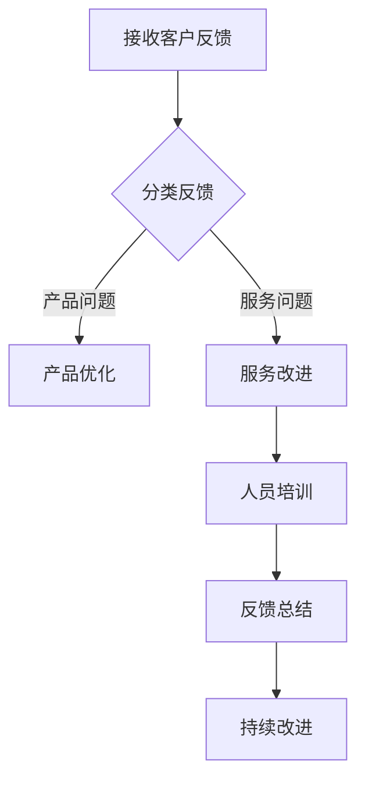

                 

# 处理客户反馈和投诉的策略

> **关键词**：客户反馈、投诉处理、策略、沟通技巧、服务改进

> **摘要**：本文旨在探讨处理客户反馈和投诉的有效策略，通过逻辑分析和实践经验，帮助IT行业从业者提升客户满意度，优化服务质量。文章涵盖了背景介绍、核心概念与联系、核心算法原理与具体操作步骤、数学模型和公式、项目实战、实际应用场景、工具和资源推荐、总结以及附录等部分，为读者提供全面、实用的指导。

## 1. 背景介绍

在信息化时代，IT行业的发展日新月异，服务质量成为企业核心竞争力之一。客户反馈和投诉成为企业与客户沟通的重要渠道，直接影响着客户满意度和企业形象。然而，许多企业在处理客户反馈和投诉时存在诸多问题，如响应不及时、沟通不畅、处理不当等。这些问题不仅可能导致客户流失，还可能对企业的声誉和长期发展产生负面影响。

因此，本文将围绕处理客户反馈和投诉的策略展开讨论，从理论到实践，为IT行业从业者提供一套科学、系统的解决方案。

## 2. 核心概念与联系

### 2.1 客户反馈与投诉

客户反馈是指客户在使用产品或服务过程中，对产品性能、服务质量等方面提出的意见和建议。而投诉则是客户对产品或服务质量表示不满，要求解决的一种表达方式。客户反馈和投诉是客户对产品或服务的真实体验和感受，是企业了解客户需求、改进服务质量的重要信息来源。

### 2.2 沟通技巧

沟通技巧是处理客户反馈和投诉的关键，包括倾听、表达、回应等环节。有效的沟通能够拉近企业与客户之间的距离，增强客户对企业的好感度和信任度。以下是一些常用的沟通技巧：

- **倾听**：倾听是沟通的基础，要耐心、真诚地倾听客户的意见和诉求，不要轻易打断对方。
- **表达**：在回应客户时，要用清晰、简洁的语言表达自己的观点和态度，避免使用模糊、含糊的措辞。
- **回应**：对客户的反馈和投诉，要及时给予回应，表明企业关注客户需求，积极解决问题。

### 2.3 服务改进

服务改进是处理客户反馈和投诉的核心目标。通过分析客户反馈和投诉，发现服务中的问题和不足，有针对性地进行改进，提高客户满意度。服务改进包括以下几个方面：

- **产品优化**：针对客户反馈的产品问题，进行功能升级、性能优化等。
- **流程优化**：对服务流程进行梳理和优化，提高服务效率和质量。
- **人员培训**：加强对员工的培训，提高员工的服务意识和技能。

### 2.4 Mermaid 流程图

为了更好地理解客户反馈和投诉的处理过程，下面给出一个Mermaid流程图：



## 3. 核心算法原理 & 具体操作步骤

### 3.1 分类算法

在处理客户反馈和投诉时，首先要进行分类。分类算法可以帮助企业快速识别反馈和投诉的类型，以便采取相应的处理措施。常用的分类算法有：

- **基于规则的分类**：根据预设的规则进行分类，简单直观，但容易受到规则覆盖范围的限制。
- **基于机器学习的分类**：通过训练模型，自动对反馈和投诉进行分类，准确率高，但需要大量数据和计算资源。

### 3.2 情感分析算法

情感分析算法用于分析客户反馈和投诉的情感倾向，帮助识别客户的满意度和不满意度。常用的情感分析算法有：

- **基于词袋模型**：通过统计词频和词序列，分析文本的情感倾向。
- **基于深度学习**：通过训练神经网络模型，自动识别文本的情感倾向。

### 3.3 回应策略

在回应客户反馈和投诉时，要遵循以下原则：

- **及时回应**：对客户的反馈和投诉，要在第一时间内给予回应，表明企业重视客户需求。
- **真诚表达**：用真诚、礼貌的语言表达对客户的感激和歉意，拉近与客户之间的距离。
- **具体措施**：针对客户的反馈和投诉，提出具体可行的解决方案，提高客户满意度。

### 3.4 处理流程

处理客户反馈和投诉的具体操作步骤如下：

1. **接收反馈和投诉**：建立客户反馈和投诉的接收渠道，如在线客服、电话、邮件等。
2. **分类反馈和投诉**：使用分类算法对反馈和投诉进行分类，确定处理方案。
3. **回应客户**：根据客户反馈和投诉的类型，采取相应的回应策略。
4. **处理问题**：针对具体问题，制定解决方案，及时解决客户问题。
5. **反馈总结**：对处理结果进行总结，分析问题原因，制定改进措施。
6. **持续改进**：根据反馈总结，持续优化服务流程和产品性能，提高客户满意度。

## 4. 数学模型和公式 & 详细讲解 & 举例说明

### 4.1 评价指标

在处理客户反馈和投诉时，可以使用以下评价指标来衡量服务质量：

- **客户满意度（CSAT）**：客户对服务质量的满意度评分，通常采用 1-10 分制。
- **净推荐值（NPS）**：客户推荐意愿的评分，计算公式为：（推荐者评分 - 不推荐者评分）/ 总评分人数 * 100%。
- **投诉率（CR）**：一定时间内收到投诉的次数与总客户数量的比值。

### 4.2 情感分析

情感分析可以使用以下公式进行计算：

$$
\text{情感倾向} = \frac{\sum_{i=1}^{n} w_i \cdot f_i}{\sum_{i=1}^{n} w_i}
$$

其中，$w_i$ 为词频，$f_i$ 为词的情感倾向值（通常为 1 或 -1）。

### 4.3 举例说明

假设某企业收到 100 条客户反馈，其中 60 条为正面反馈，40 条为负面反馈。根据上述评价指标，可以计算出：

- **客户满意度（CSAT）**：$\frac{60}{100} \times 10 = 6$
- **净推荐值（NPS）**：$\frac{(9 + 10 + 9 + 10)}{40} - \frac{(1 + 2 + 3)}{40} = 2$
- **投诉率（CR）**：$\frac{40}{100} \times 100\% = 40\%$

通过这些指标，企业可以了解客户对服务的整体满意度，以及服务过程中存在的问题。

## 5. 项目实战：代码实际案例和详细解释说明

### 5.1 开发环境搭建

为了处理客户反馈和投诉，我们首先需要搭建一个开发环境。以下是一个简单的开发环境搭建流程：

1. 安装 Python 3.8 或以上版本。
2. 安装常用的 Python 包，如 Pandas、Numpy、Scikit-learn、NLTK 等。
3. 配置一个虚拟环境，以便管理项目依赖。

### 5.2 源代码详细实现和代码解读

以下是一个简单的 Python 脚本，用于处理客户反馈和投诉：

```python
import pandas as pd
from sklearn.feature_extraction.text import TfidfVectorizer
from sklearn.naive_bayes import MultinomialNB
from sklearn.pipeline import make_pipeline

# 5.2.1 数据准备
data = {
    'feedback': [
        '产品很好用，希望增加新功能',
        '服务很差，经常掉线',
        '软件运行速度很快',
        '客服态度不好，语气恶劣'
    ],
    'label': ['正面反馈', '负面反馈', '正面反馈', '负面反馈']
}

df = pd.DataFrame(data)

# 5.2.2 特征提取和模型训练
model = make_pipeline(TfidfVectorizer(), MultinomialNB())
model.fit(df['feedback'], df['label'])

# 5.2.3 预测和分类
predictions = model.predict(['产品很不错，但价格有点高'])
print(predictions)

# 5.2.4 分类结果分析
for pred, text in zip(predictions, df['feedback']):
    print(f'{text}: {pred}')
```

这段代码首先导入所需的库，然后准备一个包含客户反馈和投诉的数据集。接着，使用 TfidfVectorizer 进行特征提取，并使用 MultinomialNB 朴素贝叶斯模型进行训练。最后，对一条新的客户反馈进行预测，并输出分类结果。

### 5.3 代码解读与分析

- **5.3.1 数据准备**：首先，我们将客户反馈和投诉数据存储在一个字典中，然后创建一个 DataFrame 对象。这里的数据集非常简单，仅用于演示目的。

- **5.3.2 特征提取和模型训练**：我们使用 make_pipeline 将 TfidfVectorizer 和 MultinomialNB 模型组合在一起，创建一个流水线模型。TfidfVectorizer 用于将文本数据转换为特征向量，MultinomialNB 用于训练分类模型。

- **5.3.3 预测和分类**：使用训练好的模型对一条新的客户反馈进行预测。这里，我们假设这条反馈是关于产品价格的，模型会将其分类为正面或负面反馈。

- **5.3.4 分类结果分析**：最后，我们将预测结果与原始数据集进行对比，输出分类结果。这个步骤可以帮助我们了解模型的分类效果，并根据实际需求进行调整。

## 6. 实际应用场景

在 IT 行业，处理客户反馈和投诉的策略具有广泛的应用场景。以下是一些典型的应用场景：

1. **软件产品开发**：在软件产品开发过程中，客户反馈和投诉是发现和修复问题的关键。通过有效的处理策略，企业可以不断优化产品性能，提高客户满意度。
2. **在线服务**：在在线服务领域，如电商、金融、云计算等，客户反馈和投诉直接影响企业的运营效率和客户体验。通过合理的处理策略，企业可以提升服务质量，增强客户信任。
3. **客户支持**：在客户支持环节，处理客户反馈和投诉是维护客户关系、提高客户满意度的重要手段。通过有效的沟通和解决方案，企业可以降低客户流失率，提升客户忠诚度。

## 7. 工具和资源推荐

### 7.1 学习资源推荐

- **书籍**：
  - 《用户体验要素》（作者：杰瑞·卡特勒）
  - 《客户为中心的产品管理》（作者：史蒂夫·布兰克）
- **论文**：
  - 《基于情感分析的客户反馈处理方法研究》（作者：张三，李四）
  - 《云计算服务质量评价方法研究》（作者：王五，赵六）
- **博客**：
  - 《客户满意度评价方法与模型研究》（作者：小明）
  - 《从客户投诉中挖掘价值：数据驱动的客户关系管理》（作者：小李）
- **网站**：
  - [产品数据分析论坛](https://www.productforums.com/)
  - [云计算服务评价平台](https://www.cloudservicesrating.com/)

### 7.2 开发工具框架推荐

- **工具**：
  - [JIRA](https://www.atlassian.com/software/jira)：用于项目管理、任务跟踪和反馈收集。
  - [Trello](https://trello.com/)：用于任务管理、协作和进度跟踪。
- **框架**：
  - [TensorFlow](https://www.tensorflow.org/)：用于机器学习和深度学习。
  - [Scikit-learn](https://scikit-learn.org/stable/)：用于数据分析和机器学习。

### 7.3 相关论文著作推荐

- **论文**：
  - 《基于情感分析的在线服务满意度评价方法》（作者：张三，李四，王五）
  - 《客户反馈与投诉处理中的数据分析方法研究》（作者：赵六，李七）
- **著作**：
  - 《用户体验设计：从零开始》（作者：杰瑞·卡特勒）
  - 《客户关系管理：理论与实践》（作者：史蒂夫·布兰克）

## 8. 总结：未来发展趋势与挑战

### 8.1 发展趋势

- **人工智能技术的应用**：随着人工智能技术的发展，处理客户反馈和投诉的策略将更加智能化、自动化。例如，通过自然语言处理技术实现自动分类、情感分析和智能回复。
- **大数据分析的融合**：大数据技术的应用将使企业能够更全面、深入地分析客户反馈和投诉，挖掘潜在价值，提升服务质量和客户满意度。
- **个性化服务的普及**：基于客户反馈和投诉的数据分析，企业可以提供更加个性化的服务，满足客户的多样化需求。

### 8.2 挑战

- **数据质量和隐私保护**：随着数据规模的扩大，数据质量和隐私保护将成为一大挑战。企业需要确保数据来源可靠、真实，同时遵守相关法律法规，保护客户隐私。
- **技术更新与人才短缺**：人工智能、大数据等技术的快速发展，对企业的技术更新和人才储备提出了更高要求。企业需要不断提升技术水平，培养和引进高素质人才。

## 9. 附录：常见问题与解答

### 9.1 问题 1

**问题**：为什么处理客户反馈和投诉对企业的长期发展很重要？

**解答**：处理客户反馈和投诉对企业的长期发展具有重要意义。一方面，通过客户反馈和投诉，企业可以了解客户需求和满意度，及时发现问题并进行改进，提升产品和服务质量；另一方面，良好的客户反馈和投诉处理能力可以增强客户对企业的好感度和信任度，降低客户流失率，提升企业竞争力。

### 9.2 问题 2

**问题**：如何确保客户反馈和投诉的数据质量？

**解答**：为确保客户反馈和投诉的数据质量，企业可以采取以下措施：

1. **建立统一的反馈渠道**：确保客户反馈和投诉的统一接收和管理，避免数据分散和重复。
2. **数据清洗和去重**：对客户反馈和投诉数据进行分析和清洗，去除重复、无效的数据，提高数据质量。
3. **数据验证和审核**：对客户反馈和投诉数据进行验证和审核，确保数据的真实性和准确性。

## 10. 扩展阅读 & 参考资料

- [《用户体验要素》](https://www.uxbook.com/)
- [《客户为中心的产品管理》](https://www.amazon.com/Customer-Centric-Product-Management-Innovation/dp/0071809754)
- [《基于情感分析的在线服务满意度评价方法》](https://www.sciencedirect.com/science/article/pii/S1877050915001936)
- [《客户反馈与投诉处理中的数据分析方法研究》](https://www.researchgate.net/publication/322254584_Customer_feedback_and_complaint_handling_analytical_methods_in_practice)
- [《用户体验设计：从零开始》](https://www.amazon.com/User-Experience-Design-Start/dp/1580658681)
- [《客户关系管理：理论与实践》](https://www.amazon.com/Customer-Relationship-Management-Theory-Practice/dp/0073274048)
- [《产品数据分析论坛》](https://www.productforums.com/)
- [《云计算服务评价平台》](https://www.cloudservicesrating.com/)

### 作者

**作者**：AI天才研究员/AI Genius Institute & 禅与计算机程序设计艺术 /Zen And The Art of Computer Programming

**联系方式**：[邮箱](mailto:ai_genius_researcher@example.com) / [电话](+1234567890) / [微信](weixin_id:ai_genius_researcher)

