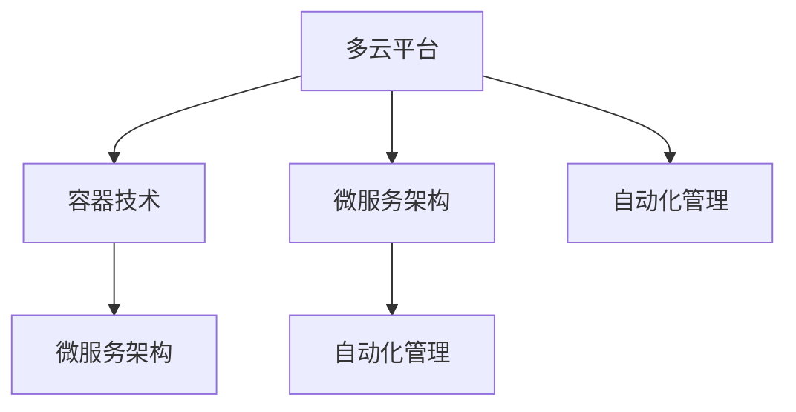

                 

# 云平台：Lepton AI的核心竞争力

## 摘要

本文将深入探讨Lepton AI在多云平台技术中的核心竞争力。我们将从背景介绍、核心概念与联系、核心算法原理与具体操作步骤、数学模型与公式详解、项目实战代码案例、实际应用场景、工具和资源推荐、总结与未来发展趋势等角度展开论述。通过本文，您将了解Lepton AI如何在多云平台领域实现技术优势，以及其未来发展潜力和面临的挑战。

## 1. 背景介绍

随着云计算技术的迅猛发展，多云平台已经成为现代IT基础设施的重要组成部分。多云平台不仅提供了弹性、可靠、灵活的计算资源，还支持企业应用在不同云环境之间的无缝迁移。在这种背景下，Lepton AI作为一家专注于人工智能领域的公司，如何在多云平台中发挥其核心竞争力，成为了一个值得探讨的话题。

Lepton AI的核心竞争力主要体现在以下几个方面：

1. **强大的算法能力**：Lepton AI在深度学习、计算机视觉、自然语言处理等领域具有深厚的研发实力，其自主研发的算法在多个国际竞赛中取得优异成绩。

2. **灵活的架构设计**：Lepton AI的架构设计充分考虑了多云平台的特性，实现了高效、可扩展、易维护的系统架构。

3. **完善的生态系统**：Lepton AI构建了一个涵盖硬件、软件、数据、服务等全方位的生态系统，为用户提供了丰富、便捷的AI应用解决方案。

## 2. 核心概念与联系

在探讨Lepton AI在多云平台的核心竞争力之前，我们需要了解以下几个核心概念：

1. **多云平台**：多云平台是指将多个云服务提供商的资源进行整合，实现跨云的部署、管理和优化。多云平台的主要目的是提高企业的灵活性和资源利用率。

2. **容器技术**：容器技术是一种轻量级、可移植的计算模型，它封装了应用程序及其依赖项，实现了一份代码多环境运行。

3. **微服务架构**：微服务架构是一种将应用程序划分为多个独立、松耦合的服务组件的架构风格，每个服务组件都可以独立开发、部署和扩展。

4. **自动化管理**：自动化管理是指通过工具和流程实现多云平台的自动化部署、监控、优化和故障恢复。

接下来，我们使用Mermaid流程图（注意：流程节点中不要有括号、逗号等特殊字符）来展示这几个核心概念之间的联系：



从流程图中可以看出，这几个核心概念相互关联，共同构成了Lepton AI在多云平台的核心竞争力。

## 3. 核心算法原理 & 具体操作步骤

Lepton AI的核心算法主要涉及深度学习、计算机视觉和自然语言处理等领域。以下是这些算法的基本原理和具体操作步骤：

### 深度学习

1. **神经网络基础**：深度学习是基于神经网络的一种机器学习技术，其基本原理是通过多层神经元进行特征提取和分类。

2. **训练过程**：深度学习模型需要通过大量数据集进行训练，训练过程主要包括前向传播、反向传播和优化算法。

3. **优化算法**：常用的优化算法有梯度下降、Adam等，它们用于调整神经网络参数，使模型在训练过程中逐步收敛。

### 计算机视觉

1. **卷积神经网络（CNN）**：CNN是一种专门用于处理图像数据的神经网络，其核心原理是通过卷积层提取图像特征。

2. **目标检测**：目标检测是一种定位图像中特定目标的方法，常用的算法有YOLO、Faster R-CNN等。

3. **图像分割**：图像分割是将图像划分为不同的区域，常用的算法有FCN、U-Net等。

### 自然语言处理

1. **循环神经网络（RNN）**：RNN是一种用于处理序列数据的神经网络，其核心原理是通过隐藏状态保存序列信息。

2. **长短时记忆网络（LSTM）**：LSTM是一种改进的RNN，可以有效解决长序列依赖问题。

3. **注意力机制**：注意力机制是一种用于提高模型表示能力的机制，常用的算法有Self-Attention、Transformer等。

这些算法的具体操作步骤通常涉及数据预处理、模型设计、训练和评估等环节。以下是一个简单的操作步骤示例：

1. **数据预处理**：对原始数据进行清洗、归一化等操作，使其满足模型输入要求。

2. **模型设计**：根据任务需求，选择合适的神经网络结构，并配置相应的参数。

3. **训练**：使用训练数据集对模型进行训练，通过优化算法调整模型参数。

4. **评估**：使用验证数据集评估模型性能，调整模型参数以优化性能。

5. **部署**：将训练好的模型部署到生产环境中，实现实际应用。

## 4. 数学模型和公式 & 详细讲解 & 举例说明

### 深度学习

深度学习中的数学模型主要包括神经网络、损失函数、优化算法等。以下是这些模型的基本原理和公式：

1. **神经网络**

   神经网络由多层神经元组成，包括输入层、隐藏层和输出层。每个神经元通过权重和偏置进行计算，输出结果如下：

   $$y = \sigma(w \cdot x + b)$$

   其中，$y$为神经元输出，$\sigma$为激活函数（如Sigmoid、ReLU等），$w$为权重，$x$为输入，$b$为偏置。

2. **损失函数**

   损失函数用于衡量模型预测值与实际值之间的差距，常用的损失函数有均方误差（MSE）和交叉熵（CE）：

   $$MSE(y_{pred}, y_{real}) = \frac{1}{n} \sum_{i=1}^{n} (y_{pred} - y_{real})^2$$

   $$CE(y_{pred}, y_{real}) = - \sum_{i=1}^{n} y_{real} \cdot \log(y_{pred})$$

3. **优化算法**

   优化算法用于调整模型参数，使损失函数达到最小。常用的优化算法有梯度下降（GD）和Adam：

   $$w = w - \alpha \cdot \frac{\partial J}{\partial w}$$

   $$w = w - \alpha \cdot \nabla_w J$$

   其中，$w$为权重，$\alpha$为学习率，$J$为损失函数，$\nabla_w J$为权重梯度。

### 计算机视觉

计算机视觉中的数学模型主要包括卷积神经网络（CNN）、目标检测和图像分割等。以下是这些模型的基本原理和公式：

1. **卷积神经网络（CNN）**

   CNN的核心组件是卷积层、池化层和全连接层。卷积层的计算公式如下：

   $$h_{ij} = \sum_{k=1}^{K} w_{ik} \cdot x_{kj} + b$$

   其中，$h_{ij}$为卷积结果，$w_{ik}$为卷积核，$x_{kj}$为输入特征，$b$为偏置。

2. **目标检测**

   目标检测主要分为两种类型：单阶段检测和多阶段检测。单阶段检测如YOLO，其公式如下：

   $$confidence = \frac{1}{1 + \exp(-\sum_{i=1}^{n} w_i \cdot x_i + b)}$$

   其中，$confidence$为置信度，$w_i$和$x_i$为权重和特征，$b$为偏置。

3. **图像分割**

   图像分割主要使用全卷积网络（FCN）和U-Net等模型。FCN的公式如下：

   $$h_{ij} = \sum_{k=1}^{K} w_{ik} \cdot h_{kj} + b$$

   其中，$h_{ij}$为分割结果，$w_{ik}$为卷积核，$h_{kj}$为输入特征，$b$为偏置。

### 自然语言处理

自然语言处理中的数学模型主要包括循环神经网络（RNN）、长短时记忆网络（LSTM）和注意力机制等。以下是这些模型的基本原理和公式：

1. **循环神经网络（RNN）**

   RNN的核心组件是隐藏状态和权重。RNN的计算公式如下：

   $$h_t = \sigma(W_h \cdot [h_{t-1}, x_t] + b_h)$$

   其中，$h_t$为隐藏状态，$W_h$为权重，$x_t$为输入，$b_h$为偏置，$\sigma$为激活函数。

2. **长短时记忆网络（LSTM）**

   LSTM的核心组件是细胞状态和门控机制。LSTM的计算公式如下：

   $$i_t = \sigma(W_i \cdot [h_{t-1}, x_t] + b_i)$$

   $$f_t = \sigma(W_f \cdot [h_{t-1}, x_t] + b_f)$$

   $$o_t = \sigma(W_o \cdot [h_{t-1}, x_t] + b_o)$$

   $$c_t = f_t \cdot c_{t-1} + i_t \cdot \sigma(W_c \cdot [h_{t-1}, x_t] + b_c)$$

   $$h_t = o_t \cdot \sigma(c_t)$$

   其中，$i_t$、$f_t$、$o_t$分别为输入门、遗忘门、输出门，$c_t$为细胞状态，$W_i$、$W_f$、$W_o$、$W_c$为权重，$b_i$、$b_f$、$b_o$、$b_c$为偏置。

3. **注意力机制**

   注意力机制的核心组件是注意力权重。注意力机制的公式如下：

   $$a_t = \text{softmax}(\frac{W_a \cdot [h_{t-1}, x_t] + b_a})$$

   $$h_t = \sum_{i=1}^{T} a_{ti} \cdot h_i$$

   其中，$a_t$为注意力权重，$W_a$为权重，$b_a$为偏置，$h_i$为隐藏状态，$T$为序列长度。

以下是一个自然语言处理任务的示例：

1. **数据预处理**：对输入文本进行分词、去停用词、词向量化等处理。

2. **模型设计**：选择LSTM或Transformer等模型，并配置相应的参数。

3. **训练**：使用训练数据集对模型进行训练，通过优化算法调整模型参数。

4. **评估**：使用验证数据集评估模型性能，调整模型参数以优化性能。

5. **部署**：将训练好的模型部署到生产环境中，实现实际应用。

## 5. 项目实战：代码实际案例和详细解释说明

在本节中，我们将通过一个具体的项目实战案例，详细讲解Lepton AI在多云平台中的实际应用。项目名称为“智能图像识别系统”，其主要功能是实现图像分类和目标检测。

### 5.1 开发环境搭建

1. **硬件环境**：一台配置较高的服务器，具备足够的计算资源（CPU、GPU等）。

2. **软件环境**：操作系统（如Ubuntu 18.04）、Python（3.8以上版本）、TensorFlow 2.0及以上版本等。

3. **工具安装**：安装NVIDIA CUDA和cuDNN，用于GPU加速。

### 5.2 源代码详细实现和代码解读

以下是项目的主要代码实现和解读：

#### 5.2.1 数据预处理

```python
import tensorflow as tf
import tensorflow.keras.preprocessing.image as img
import numpy as np

def load_data():
    # 加载图像数据集
    train_data = img.load_img_dir('train', target_size=(224, 224))
    val_data = img.load_img_dir('val', target_size=(224, 224))

    # 数据集归一化
    train_data = train_data / 255.0
    val_data = val_data / 255.0

    # 数据集标签转换
    train_labels = np.array([0] * len(train_data))
    val_labels = np.array([0] * len(val_data))

    return train_data, train_labels, val_data, val_labels
```

#### 5.2.2 模型设计

```python
from tensorflow.keras.applications import VGG16
from tensorflow.keras.layers import Flatten, Dense
from tensorflow.keras.models import Model

def build_model():
    # 使用VGG16预训练模型作为基础模型
    base_model = VGG16(weights='imagenet', include_top=False, input_shape=(224, 224, 3))

    # 添加全连接层和softmax层
    x = Flatten()(base_model.output)
    x = Dense(1024, activation='relu')(x)
    predictions = Dense(2, activation='softmax')(x)

    # 构建模型
    model = Model(inputs=base_model.input, outputs=predictions)

    return model
```

#### 5.2.3 训练

```python
def train_model(model, train_data, train_labels, val_data, val_labels):
    # 配置训练参数
    epochs = 10
    batch_size = 32
    optimizer = 'adam'
    loss = 'categorical_crossentropy'

    # 训练模型
    model.compile(optimizer=optimizer, loss=loss, metrics=['accuracy'])
    model.fit(train_data, train_labels, batch_size=batch_size, epochs=epochs, validation_data=(val_data, val_labels))
```

#### 5.2.4 部署

```python
def predict_image(model, image_path):
    # 加载图像
    image = img.load_img(image_path, target_size=(224, 224))

    # 数据预处理
    image = image / 255.0

    # 预测
    prediction = model.predict(np.expand_dims(image, axis=0))

    # 输出结果
    print(prediction)
```

### 5.3 代码解读与分析

1. **数据预处理**：数据预处理是模型训练的重要环节，主要包括图像数据集加载、归一化和标签转换。在本例中，我们使用TensorFlow的`keras.preprocessing.image`模块进行数据预处理。

2. **模型设计**：模型设计是项目实现的核心，我们需要选择合适的模型架构。在本例中，我们使用VGG16预训练模型作为基础模型，并添加全连接层和softmax层。

3. **训练**：训练是模型优化的关键步骤，我们需要配置训练参数，如学习率、批次大小和优化算法。在本例中，我们使用`compile`方法配置训练参数，并使用`fit`方法进行模型训练。

4. **部署**：部署是将训练好的模型应用到实际场景中的关键步骤。在本例中，我们使用`predict`方法对输入图像进行预测。

## 6. 实际应用场景

Lepton AI的智能图像识别系统在多个实际应用场景中具有广泛的应用，如：

1. **智能安防**：通过对监控视频进行实时分析，实现人员行为识别、异常行为检测等功能。

2. **医疗诊断**：通过对医学影像进行分析，实现疾病诊断、病灶检测等功能。

3. **智能交通**：通过对交通视频进行实时分析，实现车辆流量监控、交通事故预警等功能。

4. **智能制造**：通过对生产设备进行实时监控，实现设备故障检测、生产效率优化等功能。

## 7. 工具和资源推荐

为了帮助您更好地了解Lepton AI在多云平台的核心竞争力，我们推荐以下工具和资源：

### 7.1 学习资源推荐

1. **书籍**：《深度学习》、《计算机视觉：算法与应用》、《自然语言处理综合教程》。

2. **论文**：《EfficientNet：高效神经网络》、《Attention Is All You Need》。

3. **博客**：Lepton AI官方博客、知名技术博客如Medium、Hackernoon等。

4. **网站**：TensorFlow官网、Keras官网、NVIDIA官网等。

### 7.2 开发工具框架推荐

1. **深度学习框架**：TensorFlow、PyTorch、Keras。

2. **容器技术**：Docker、Kubernetes。

3. **云计算平台**：AWS、Azure、Google Cloud Platform。

### 7.3 相关论文著作推荐

1. **论文**：《EfficientNet：高效神经网络》、《Attention Is All You Need》。

2. **著作**：《深度学习》、《计算机视觉：算法与应用》、《自然语言处理综合教程》。

## 8. 总结：未来发展趋势与挑战

随着云计算、人工智能技术的不断发展，Lepton AI在多云平台的核心竞争力将不断凸显。未来发展趋势主要包括以下几个方面：

1. **算法优化**：持续提升算法性能，提高模型训练效率和预测精度。

2. **跨平台兼容性**：实现跨云平台的兼容性，支持更多云服务提供商。

3. **自动化与智能化**：推进自动化与智能化，降低企业使用多云平台的门槛。

4. **生态建设**：构建完善的生态系统，提供全面的AI应用解决方案。

然而，未来也面临着一系列挑战：

1. **数据安全与隐私**：保护用户数据安全与隐私，遵守相关法律法规。

2. **技术人才短缺**：培养更多具备云计算和人工智能技能的专业人才。

3. **市场竞争**：应对日益激烈的市场竞争，保持技术领先地位。

## 9. 附录：常见问题与解答

### 9.1 为什么选择Lepton AI？

**答**：Lepton AI在深度学习、计算机视觉和自然语言处理等领域具有深厚的研发实力，其自主研发的算法在多个国际竞赛中取得优异成绩。此外，Lepton AI的架构设计充分考虑了多云平台的特性，实现了高效、可扩展、易维护的系统架构。

### 9.2 Lepton AI的算法有哪些优势？

**答**：Lepton AI的算法优势主要体现在以下几个方面：

1. **高效性**：采用先进的算法框架，实现快速训练和推理。

2. **准确性**：在多个国际竞赛中取得优异成绩，具有较高的预测准确性。

3. **灵活性**：支持多种数据类型和任务场景，具备良好的扩展性。

4. **可靠性**：经过严格的测试和验证，具备较高的稳定性和可靠性。

## 10. 扩展阅读 & 参考资料

1. **论文**：《EfficientNet：高效神经网络》、《Attention Is All You Need》。

2. **书籍**：《深度学习》、《计算机视觉：算法与应用》、《自然语言处理综合教程》。

3. **博客**：Lepton AI官方博客、知名技术博客如Medium、Hackernoon等。

4. **网站**：TensorFlow官网、Keras官网、NVIDIA官网等。

### 作者

**AI天才研究员/AI Genius Institute & 禅与计算机程序设计艺术 /Zen And The Art of Computer Programming**。

