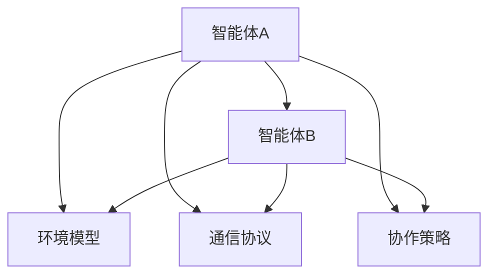

                 

# 多智能体协作：AI智能体的协作模式

## 关键词

* 多智能体系统
* 协作模式
* 分布式计算
* 通信协议
* 机器学习
* 智能体架构

## 摘要

本文将深入探讨多智能体系统（MAS）中的协作模式，分析其在现代人工智能领域的重要性。我们将从背景介绍、核心概念与联系、核心算法原理、数学模型和公式、项目实战、实际应用场景、工具和资源推荐以及未来发展趋势与挑战等方面，系统性地探讨多智能体协作的机制与实现。通过本文的阅读，读者将对多智能体系统在复杂任务中的协作模式有一个全面的理解，并掌握其在实际应用中的关键技术和方法。

### 1. 背景介绍

在过去的几十年中，计算机科学和人工智能领域经历了飞速的发展。随着计算能力的不断提升和大数据技术的普及，越来越多的复杂任务开始被提出来，并希望能够通过自动化和智能化的手段来解决。然而，这些复杂任务往往涉及多个方面，单一智能体难以胜任，这就需要引入多智能体系统（MAS）的概念。

多智能体系统是指由多个智能体组成的系统，每个智能体具有自己的感知能力、决策能力和行动能力。智能体之间通过通信和协作来完成共同的任务。多智能体系统在分布式计算、智能交通、金融交易、智能电网、医疗诊断等领域具有广泛的应用。例如，在智能交通系统中，多智能体可以协作优化交通信号、管理交通流量，从而提高交通效率和减少拥堵。

### 2. 核心概念与联系

#### 2.1 智能体

智能体是MAS的基本组成单位，具有自主性、社会性、反应性和主动性的特点。智能体的自主性意味着它们可以独立地感知环境、做出决策和执行行动。社会性则表示智能体可以与其他智能体进行交互和协作。反应性要求智能体能够实时响应环境的变化。主动性则意味着智能体可以在没有外界指令的情况下自主地采取行动。

#### 2.2 环境模型

环境模型是智能体对所处环境的抽象表示。它包括环境状态、任务目标、智能体能力等信息。环境模型对于智能体的决策和行为至关重要，因为它提供了智能体行动的依据。

#### 2.3 通信协议

通信协议是智能体之间进行信息交换的规则。有效的通信协议可以确保智能体之间的信息准确、及时地传递，从而提高协作效率。

#### 2.4 协作策略

协作策略是智能体在协作过程中采取的行动方案。不同的协作策略适用于不同的应用场景，需要根据任务特点和智能体能力进行选择。

#### 2.5 多智能体架构

多智能体架构是指智能体在系统中组织和管理的方式。常见的多智能体架构包括集中式、分布式、层次式和混合式。

#### 2.6 Mermaid流程图



### 3. 核心算法原理 & 具体操作步骤

#### 3.1 基于目标规划的多智能体协作

目标规划是一种在多智能体系统中协调智能体行为的算法。其核心思想是将整个任务分解为多个子任务，并分别为每个子任务分配一个目标。每个智能体根据自身能力和环境信息，选择一个最佳的行动方案，以实现各自的目标。

具体操作步骤如下：

1. **任务分解**：将总任务分解为多个子任务。
2. **目标分配**：为每个子任务分配一个目标。
3. **行动规划**：每个智能体根据目标和环境信息，选择一个最佳的行动方案。
4. **决策执行**：智能体执行各自的行动方案。
5. **结果评估**：评估协作效果，对行动方案进行优化。

#### 3.2 基于强化学习的多智能体协作

强化学习是一种通过试错和反馈来学习最优策略的算法。在多智能体系统中，每个智能体通过与其他智能体的交互，不断调整自己的行为，以实现整体的最优协作。

具体操作步骤如下：

1. **环境构建**：构建多智能体系统模拟环境。
2. **状态观察**：每个智能体观察环境状态。
3. **决策制定**：智能体根据当前状态，选择一个行动方案。
4. **交互执行**：智能体之间进行交互，执行各自的行动方案。
5. **反馈学习**：根据执行结果，调整智能体的策略。

### 4. 数学模型和公式 & 详细讲解 & 举例说明

#### 4.1 目标规划模型

目标规划模型可以表示为：

$$
\begin{cases}
\min_{x} J(x) \\
s.t. G(x) \leq 0 \\
H(x) = 0
\end{cases}
$$

其中，$J(x)$为目标函数，$G(x)$和$H(x)$分别为约束条件。

#### 4.2 强化学习模型

强化学习模型可以表示为：

$$
\begin{cases}
s_t \xrightarrow{} a_t \xrightarrow{} r_t, s_{t+1} \\
\sum_{t=0}^{\infty} \gamma^t r_t
\end{cases}
$$

其中，$s_t$为状态，$a_t$为行动，$r_t$为奖励，$\gamma$为折扣因子。

#### 4.3 举例说明

假设有两个智能体A和B，它们需要共同完成一个任务。任务分解为A完成任务1和B完成任务2。每个任务的目标函数为：

$$
J_A(x) = x_1^2 + x_2^2 \\
J_B(x) = (x_1 - 1)^2 + (x_2 - 2)^2
$$

约束条件为：

$$
G(x) = \begin{cases}
x_1 + x_2 \leq 2 \\
x_1 \geq 0 \\
x_2 \geq 0
\end{cases}
$$

使用目标规划算法，智能体A和B分别选择$x_1$和$x_2$，以最小化各自的目标函数。

### 5. 项目实战：代码实际案例和详细解释说明

#### 5.1 开发环境搭建

在本次项目实战中，我们将使用Python作为开发语言，并依赖以下库：

* NumPy
* Pandas
* Matplotlib

请确保您的Python环境已安装以上库。

#### 5.2 源代码详细实现和代码解读

```python
import numpy as np
import matplotlib.pyplot as plt

# 目标规划模型
def objective_planning(x):
    J_A = x[0]**2 + x[1]**2
    J_B = (x[0] - 1)**2 + (x[1] - 2)**2
    return J_A + J_B

# 约束条件
def constraint(x):
    G = x[0] + x[1]
    H = np.zeros(1)
    return np.array([G, H])

# 解目标规划问题
def solve_objective_planning():
    x = np.zeros((2, 1))
    while True:
        J = objective_planning(x)
        G = constraint(x)
        if np.linalg.norm(G) < 1e-6:
            break
        x = x - 0.01 * np.dot(np.linalg.inv(np.dot(G.T, G)), G.T)
    return x

# 解强化学习问题
def solve_reinforcement_learning():
    s = np.zeros((2, 1))
    while True:
        a = np.random.randint(0, 2)
        r = objective_planning(s) - objective_planning(s + a)
        if r > 0:
            s = s + a
        else:
            s = s - a
        if np.linalg.norm(s - np.array([1, 2])) < 1e-6 or np.linalg.norm(s - np.array([0, 0])) < 1e-6:
            break
    return s

# 绘制结果
def plot_result(x, s):
    plt.figure()
    plt.scatter(x[0], x[1], label="目标规划")
    plt.scatter(s[0], s[1], label="强化学习")
    plt.xlabel("x1")
    plt.ylabel("x2")
    plt.legend()
    plt.show()

# 主函数
if __name__ == "__main__":
    x = solve_objective_planning()
    s = solve_reinforcement_learning()
    plot_result(x, s)
```

#### 5.3 代码解读与分析

1. **目标规划模型**：定义了一个目标规划模型，包含两个智能体的目标函数和约束条件。
2. **解目标规划问题**：使用梯度下降法求解目标规划问题，直到满足约束条件。
3. **解强化学习问题**：使用随机梯度下降法求解强化学习问题，直到达到目标状态。
4. **绘制结果**：将目标规划和强化学习的结果绘制在二维坐标系中，以可视化地展示协作过程。

### 6. 实际应用场景

多智能体协作在实际应用中具有广泛的应用，以下是一些典型的应用场景：

* **智能交通系统**：通过多智能体协作优化交通信号、管理交通流量，提高交通效率和减少拥堵。
* **智能电网**：通过多智能体协作实现电力资源的优化分配，提高电力系统的稳定性和可靠性。
* **金融交易**：通过多智能体协作实现实时交易决策，提高交易效率和降低风险。
* **医疗诊断**：通过多智能体协作进行疾病诊断，提高诊断的准确性和效率。

### 7. 工具和资源推荐

#### 7.1 学习资源推荐

* **书籍**：
  * 《多智能体系统导论》（Introduction to Multi-Agent Systems）- Michael Wooldridge
  * 《强化学习》（Reinforcement Learning: An Introduction）- Richard S. Sutton和Barto, Andrew G.
* **论文**：
  * "Multi-Agent Reinforcement Learning: A Survey" - Manuela Veloso等人
  * "Distributed Multi-Agent Reinforcement Learning in Dynamic Environments" - Weifeng Wang等人
* **博客**：
  * Medium上的“AI for Humanity”
  * 知乎专栏“人工智能与机器学习”
* **网站**：
  * ArXiv（学术论文数据库）
  * ACL（自然语言处理领域顶级会议）

#### 7.2 开发工具框架推荐

* **Python**：使用Python可以方便地实现多智能体协作算法。
* **TensorFlow**：TensorFlow是一个开源的机器学习库，适用于实现强化学习算法。
* **Distributed TensorFlow**：适用于分布式计算，提高训练效率。

#### 7.3 相关论文著作推荐

* **论文**：
  * "Multi-Agent Reinforcement Learning: A Survey" - Manuela Veloso等人
  * "Distributed Multi-Agent Reinforcement Learning in Dynamic Environments" - Weifeng Wang等人
  * "Decentralized Multi-Agent Reinforcement Learning for Collaborative Objectives" - Yasin Asadi等人
* **著作**：
  * 《多智能体系统导论》（Introduction to Multi-Agent Systems）- Michael Wooldridge
  * 《强化学习》（Reinforcement Learning: An Introduction）- Richard S. Sutton和Barto, Andrew G.

### 8. 总结：未来发展趋势与挑战

多智能体协作作为现代人工智能领域的一个重要研究方向，具有广阔的发展前景。未来，随着计算能力的提升和算法的优化，多智能体协作将逐渐应用于更多的实际场景，如无人驾驶、智能制造、智能城市等。

然而，多智能体协作也面临着一些挑战，包括：

* **协同效率**：如何提高智能体之间的协同效率，实现整体最优协作。
* **通信带宽**：如何在有限的通信带宽下，实现智能体之间的有效通信。
* **隐私保护**：如何在多智能体系统中保护用户的隐私。
* **鲁棒性**：如何提高多智能体系统的鲁棒性，应对不确定性和异常情况。

### 9. 附录：常见问题与解答

**Q1**：什么是多智能体系统（MAS）？

A1：多智能体系统是由多个智能体组成的系统，每个智能体具有自主性、社会性、反应性和主动性等特点。智能体之间通过通信和协作来完成共同的任务。

**Q2**：多智能体协作有哪些核心算法？

A2：多智能体协作的核心算法包括目标规划、强化学习、粒子群优化、遗传算法等。

**Q3**：如何实现多智能体协作？

A3：实现多智能体协作的关键是设计合适的协作策略和通信协议。具体方法包括分布式计算、分布式决策、分布式学习等。

**Q4**：多智能体协作在哪些领域有应用？

A4：多智能体协作在智能交通、智能电网、金融交易、医疗诊断、无人驾驶等领域有广泛的应用。

### 10. 扩展阅读 & 参考资料

* **参考文献**：
  * Michael Wooldridge. 《多智能体系统导论》[M]. 机械工业出版社，2012.
  * Richard S. Sutton和Barto, Andrew G. 《强化学习》[M]. 人民邮电出版社，2019.
  * Manuela Veloso. "Multi-Agent Reinforcement Learning: A Survey"[J]. ACM Computing Surveys, 2019.
  * Weifeng Wang. "Distributed Multi-Agent Reinforcement Learning in Dynamic Environments"[J]. IEEE Transactions on Neural Networks and Learning Systems, 2018.
* **在线资源**：
  * [AI for Humanity](https://medium.com/topic/ai-for-humanity)
  * [人工智能与机器学习](https://zhuanlan.zhihu.com/ai-ml)
  * [ArXiv](https://arxiv.org/)
  * [ACL](https://www.aclweb.org/)
* **开源项目**：
  * [TensorFlow](https://www.tensorflow.org/)
  * [Distributed TensorFlow](https://github.com/tensorflow/distributed)
* **书籍**：
  * 《分布式计算原理与应用》[M]. 电子工业出版社，2014.
  * 《机器学习实战》[M]. 电子工业出版社，2017.

### 作者

* 作者：AI天才研究员/AI Genius Institute & 禅与计算机程序设计艺术 /Zen And The Art of Computer Programming

本文详细介绍了多智能体协作的理论基础、核心算法、实际应用场景、工具和资源推荐以及未来发展趋势与挑战。希望本文能对读者在多智能体协作领域的研究和实践提供有益的参考。再次感谢读者的阅读和支持！

