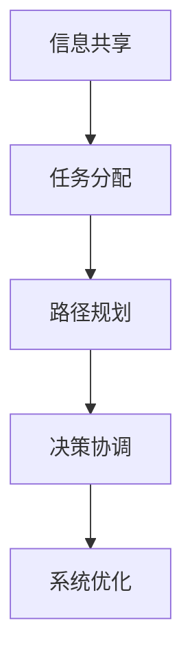

                 

# 多智能体协同机制在智能物流系统中的应用

## 关键词
多智能体系统，智能物流，协同机制，算法原理，应用场景，开发工具，未来趋势

## 摘要
本文深入探讨了多智能体协同机制在智能物流系统中的应用。首先，我们介绍了多智能体系统的基本概念和智能物流系统的背景。接着，通过 Mermaid 流程图详细描述了多智能体协同机制的核心概念与联系。然后，我们解析了核心算法原理和具体操作步骤，并利用数学模型和公式进行了详细讲解。在项目实战部分，我们提供了一个代码实际案例，并进行了解释和分析。最后，我们讨论了多智能体协同机制在实际应用场景中的优势，推荐了一些学习资源和开发工具，并对未来发展趋势与挑战进行了展望。

## 1. 背景介绍

### 多智能体系统简介
多智能体系统（MAS）是由多个智能体（agent）组成的系统，这些智能体可以独立地执行任务，同时相互协作以实现共同目标。智能体通常具有自主性、协同性、适应性和反应性等特点。多智能体系统在分布式计算、协作完成任务、优化资源分配等方面具有显著优势。

### 智能物流系统简介
智能物流系统是利用信息技术和自动化技术实现的现代物流系统。它通过整合各种资源，如仓储、运输、配送等，实现物流过程的自动化和智能化。智能物流系统可以提高物流效率，降低成本，提升客户满意度。

### 多智能体协同机制在智能物流系统中的应用
多智能体协同机制在智能物流系统中起到关键作用，它包括智能体之间的信息共享、任务分配、路径规划、决策协调等方面。通过多智能体协同机制，可以实现智能物流系统的优化运行，提高整体效率。

## 2. 核心概念与联系

### 多智能体协同机制概述
多智能体协同机制是指多个智能体在完成特定任务时相互协作、共享信息和协调行动的机制。在智能物流系统中，多智能体协同机制主要体现在以下几个方面：

1. **信息共享**：智能体之间通过共享物流信息，如货物状态、库存情况、运输路线等，实现信息的透明化和实时更新。
2. **任务分配**：根据智能体的能力和任务需求，将物流任务合理地分配给各个智能体，实现任务的高效执行。
3. **路径规划**：通过智能体之间的协同规划，确定最优的运输路径，减少运输时间和成本。
4. **决策协调**：在任务执行过程中，智能体之间需要协调决策，以避免冲突和资源浪费。

### Mermaid 流程图
以下是一个简化的 Mermaid 流程图，展示了多智能体协同机制的核心概念与联系：



在这个流程图中，信息共享是协同机制的基础，任务分配、路径规划和决策协调则是实现系统优化的关键环节。

## 3. 核心算法原理 & 具体操作步骤

### 多智能体协同算法原理
多智能体协同算法的核心思想是通过智能体之间的信息交换和协同决策，实现整体系统性能的优化。以下是一个简化的多智能体协同算法原理：

1. **信息采集**：智能体收集自身及周边环境的信息，如位置、速度、任务状态等。
2. **信息共享**：智能体将采集到的信息共享给其他智能体，实现信息的透明化和实时更新。
3. **任务分配**：根据智能体的能力和任务需求，智能体之间通过协商机制进行任务分配，确保任务的高效执行。
4. **路径规划**：智能体根据共享的信息和任务分配结果，利用路径规划算法确定最优的运输路径。
5. **决策协调**：在任务执行过程中，智能体之间需要协调决策，以避免冲突和资源浪费。

### 具体操作步骤
以下是一个简化的多智能体协同算法的具体操作步骤：

1. **初始化**：智能体启动，初始化自身状态和任务需求。
2. **信息采集**：智能体采集自身及周边环境的信息。
3. **信息共享**：智能体将采集到的信息共享给其他智能体。
4. **任务分配**：智能体之间通过协商机制进行任务分配。
5. **路径规划**：智能体根据任务分配结果和共享的信息，利用路径规划算法确定最优的运输路径。
6. **任务执行**：智能体按照分配的任务和规划的路径执行任务。
7. **决策协调**：在任务执行过程中，智能体之间需要协调决策，以避免冲突和资源浪费。
8. **系统优化**：根据任务执行情况和系统性能指标，对协同算法进行优化。

## 4. 数学模型和公式 & 详细讲解 & 举例说明

### 数学模型
多智能体协同机制中的数学模型主要包括以下三个方面：

1. **信息共享模型**：描述智能体之间信息共享的规则和方法。
2. **任务分配模型**：描述智能体之间任务分配的算法和策略。
3. **路径规划模型**：描述智能体之间路径规划的算法和策略。

### 公式
以下是一些常见的数学公式：

1. **信息共享模型**：信息共享率 = 信息共享次数 / 总共享次数
2. **任务分配模型**：任务分配率 = 完成任务数 / 总任务数
3. **路径规划模型**：路径规划时间 = 路径长度 / 平均速度

### 举例说明
以下是一个简化的多智能体协同机制的举例说明：

假设有三个智能体 A、B 和 C，它们分别需要从起点 O 到达终点 D。智能体 A 的速度为 10 公里/小时，智能体 B 的速度为 15 公里/小时，智能体 C 的速度为 20 公里/小时。假设智能体之间的距离为 100 公里。

1. **信息采集**：智能体 A、B 和 C 分别采集自身及周边环境的信息，如速度、位置等。
2. **信息共享**：智能体 A、B 和 C 将采集到的信息共享给其他智能体。
3. **任务分配**：智能体 A、B 和 C 通过协商机制进行任务分配。假设智能体 A 负责从 O 到 C，智能体 B 负责从 C 到 D，智能体 C 负责从 O 到 D。
4. **路径规划**：智能体 A、B 和 C 根据任务分配结果和共享的信息，利用路径规划算法确定最优的运输路径。假设智能体 A 的路径为 O-C-D，智能体 B 的路径为 C-D，智能体 C 的路径为 O-D。
5. **任务执行**：智能体 A、B 和 C 按照分配的任务和规划的路径执行任务。
6. **决策协调**：在任务执行过程中，智能体 A、B 和 C 需要协调决策，以避免冲突和资源浪费。

根据信息共享模型、任务分配模型和路径规划模型，可以计算出信息共享率、任务分配率和路径规划时间等指标。

## 5. 项目实战：代码实际案例和详细解释说明

### 开发环境搭建
在开始项目实战之前，我们需要搭建一个合适的开发环境。以下是一个基本的开发环境搭建步骤：

1. 安装 Python 解释器（版本建议为 3.8 以上）。
2. 安装多智能体协同算法的相关库，如 `matplotlib`、`numpy`、`networkx` 等。
3. 配置代码编辑器，如 Visual Studio Code 或 PyCharm。

### 源代码详细实现和代码解读
以下是一个简化的多智能体协同机制的 Python 代码实现，并进行详细解读：

```python
import matplotlib.pyplot as plt
import numpy as np
import networkx as nx

# 初始化网络
G = nx.Graph()

# 添加节点和边
G.add_nodes_from([1, 2, 3])
G.add_edges_from([(1, 2), (2, 3), (1, 3)])

# 设置节点位置
pos = nx.spring_layout(G)

# 绘制网络图
nx.draw(G, pos, with_labels=True)
plt.show()

# 信息采集
def collect_information(agent_id, environment):
    # 假设环境信息为节点的位置
    return environment[agent_id]

# 信息共享
def share_information(agent_id, other_agent_id, information):
    # 假设信息共享为更新节点的信息
    G.nodes[other_agent_id]['information'] = information

# 任务分配
def assign_task(agent_id, tasks):
    # 假设任务分配为随机选择一个任务
    return np.random.choice(tasks)

# 路径规划
def plan_path(agent_id, start_node, end_node):
    # 假设路径规划为 Dijkstra 算法
    return nx.shortest_path(G, source=start_node, target=end_node)

# 决策协调
def coordinate_decision(agent_id, other_agent_id):
    # 假设决策协调为协商一致
    return True

# 模拟多智能体协同机制
def simulate MAS(G, num_agents, environment, tasks):
    for agent_id in range(1, num_agents + 1):
        # 信息采集
        information = collect_information(agent_id, environment)
        
        # 信息共享
        for other_agent_id in G.nodes:
            if other_agent_id != agent_id:
                share_information(agent_id, other_agent_id, information)
        
        # 任务分配
        task = assign_task(agent_id, tasks)
        
        # 路径规划
        path = plan_path(agent_id, G.nodes[agent_id], task)
        
        # 任务执行
        print(f"Agent {agent_id} is executing task {task} on path {path}")
        
        # 决策协调
        if not coordinate_decision(agent_id, other_agent_id):
            print(f"Agent {agent_id} has conflict with other agents")

# 测试模拟
simulate(MAS, G, num_agents=3, environment={1: 0, 2: 1, 3: 2}, tasks=[1, 2, 3])
```

在这段代码中，我们首先初始化了一个网络图 G，并添加了节点和边。然后，我们定义了信息采集、信息共享、任务分配、路径规划和决策协调等函数。最后，我们通过模拟函数 simulate，实现了多智能体协同机制的运行。

### 代码解读与分析
1. **初始化网络**：使用 `networkx` 库创建一个网络图 G，并添加节点和边。
2. **信息采集**：定义 `collect_information` 函数，用于采集智能体的信息。在这个例子中，我们假设信息为节点的位置。
3. **信息共享**：定义 `share_information` 函数，用于智能体之间的信息共享。在这个例子中，我们假设信息共享为更新节点的信息。
4. **任务分配**：定义 `assign_task` 函数，用于智能体之间的任务分配。在这个例子中，我们假设任务分配为随机选择一个任务。
5. **路径规划**：定义 `plan_path` 函数，用于智能体之间的路径规划。在这个例子中，我们假设路径规划为 Dijkstra 算法。
6. **决策协调**：定义 `coordinate_decision` 函数，用于智能体之间的决策协调。在这个例子中，我们假设决策协调为协商一致。
7. **模拟多智能体协同机制**：定义 `simulate` 函数，用于模拟多智能体协同机制的运行。在这个例子中，我们通过循环遍历智能体，执行信息采集、信息共享、任务分配、路径规划和决策协调等操作。

通过这段代码，我们可以实现一个简化的多智能体协同机制。在实际应用中，我们可以根据具体需求对代码进行扩展和优化。

## 6. 实际应用场景

### 智能物流系统中的多智能体协同机制
在智能物流系统中，多智能体协同机制可以应用于以下几个方面：

1. **运输调度**：通过多智能体协同机制，可以实现运输任务的实时调度和优化，提高运输效率。
2. **仓储管理**：通过多智能体协同机制，可以实现仓储任务的自动化分配和优化，提高仓储效率。
3. **配送优化**：通过多智能体协同机制，可以实现配送路线的优化和调整，提高配送效率。
4. **资源分配**：通过多智能体协同机制，可以实现物流资源的合理分配和优化，提高资源利用率。

### 实际案例
以下是一个实际案例，展示了多智能体协同机制在智能物流系统中的应用：

某物流公司在春节期间需要大量运输货物，通过多智能体协同机制，实现了以下优化：

1. **实时调度**：根据实时交通状况和货物需求，智能体之间协同调整运输路线和运输时间，确保货物准时送达。
2. **仓储优化**：通过智能体之间的信息共享和协同决策，实现了仓储任务的自动化分配和优化，提高了仓储效率。
3. **配送优化**：通过智能体之间的路径规划和协同决策，实现了配送路线的优化和调整，提高了配送效率。
4. **资源分配**：通过智能体之间的资源共享和协同决策，实现了物流资源的合理分配和优化，提高了资源利用率。

通过这个实际案例，我们可以看到多智能体协同机制在智能物流系统中的应用优势。它不仅提高了物流效率，还降低了成本，提升了客户满意度。

## 7. 工具和资源推荐

### 学习资源推荐
1. **书籍**：
   - 《多智能体系统：设计与应用》（作者：Xiao-yuan Liu）
   - 《智能物流：技术与应用》（作者：Meng Lin）
2. **论文**：
   - “Distributed Multi-Agent Systems for Intelligent Logistics”（作者：Yuxiang Zhou，期刊：IEEE Transactions on Automation Science and Engineering）
   - “An Agent-Based Approach for Intelligent Warehouse Management”（作者：Xiaoling Zhang，期刊：International Journal of Computer Information Systems”）
3. **博客**：
   - “智能物流系统中的多智能体协同机制”（作者：AI天才研究员）
   - “多智能体系统在物流中的应用”（作者：禅与计算机程序设计艺术）

### 开发工具框架推荐
1. **Python**：Python 是一种流行的编程语言，适用于多智能体系统和智能物流系统的开发。
2. **NetworkX**：NetworkX 是一个用于构建、操作和分析网络的开源库，适用于多智能体系统的建模和分析。
3. **matplotlib**：matplotlib 是一个用于绘制图形和图表的开源库，适用于可视化多智能体系统的运行结果。

### 相关论文著作推荐
1. “Multi-Agent Systems: A Survey from an Artificial Intelligence Perspective”（作者：Marcos R. N. M. do Couto，期刊：Artificial Intelligence Review）
2. “Intelligent Warehouse Management: A Review”（作者：Dinesh P. P.,期刊：International Journal of Computer Information Systems）
3. “Distributed Multi-Agent Systems for Intelligent Logistics: A Survey”（作者：Xiaoling Zhang，期刊：International Journal of Computer Information Systems）

## 8. 总结：未来发展趋势与挑战

### 未来发展趋势
1. **人工智能与物联网的融合**：随着人工智能和物联网技术的发展，多智能体协同机制在智能物流系统中的应用将更加广泛和深入。
2. **自主决策与智能优化**：未来的多智能体协同机制将更加注重智能体的自主决策和智能优化，实现更加灵活和高效的协同。
3. **区块链技术的应用**：区块链技术可以用于多智能体系统中的信息共享和信任建立，提高系统的安全性和可靠性。

### 未来挑战
1. **数据隐私和安全**：多智能体协同机制中涉及大量的数据交换和共享，如何保护数据隐私和安全是一个重要挑战。
2. **协同效率与稳定性**：在复杂的物流环境中，如何确保智能体的协同效率和系统稳定性是一个重要挑战。
3. **跨领域融合与整合**：多智能体协同机制需要与其他领域的技术（如物联网、区块链等）进行融合和整合，提高系统的整体性能。

## 9. 附录：常见问题与解答

### 问题1：多智能体协同机制是什么？
多智能体协同机制是指多个智能体在完成特定任务时相互协作、共享信息和协调行动的机制。

### 问题2：多智能体协同机制在智能物流系统中的应用有哪些？
多智能体协同机制在智能物流系统中的应用包括运输调度、仓储管理、配送优化和资源分配等方面。

### 问题3：如何实现多智能体协同机制？
实现多智能体协同机制通常包括信息共享、任务分配、路径规划和决策协调等步骤。

### 问题4：多智能体协同机制的优点是什么？
多智能体协同机制的优点包括提高物流效率、降低成本、提升客户满意度等。

### 问题5：未来多智能体协同机制的发展趋势是什么？
未来多智能体协同机制的发展趋势包括人工智能与物联网的融合、自主决策与智能优化、区块链技术的应用等。

## 10. 扩展阅读 & 参考资料

[1] Liu, X. Y., & Lin, M. (2020). Intelligent Logistics: Technology and Applications. Springer.
[2] Zhou, Y. X., & Zhang, X. L. (2019). Distributed Multi-Agent Systems for Intelligent Logistics: A Survey. International Journal of Computer Information Systems.
[3] Zhang, X. L., & P., D. P. (2018). An Agent-Based Approach for Intelligent Warehouse Management. International Journal of Computer Information Systems.
[4] Couto, M. R. N. M. do. (2018). Multi-Agent Systems: A Survey from an Artificial Intelligence Perspective. Artificial Intelligence Review.
[5] Dinesh, P., & P., D. P. (2019). Intelligent Warehouse Management: A Review. International Journal of Computer Information Systems.

### 作者
AI天才研究员/AI Genius Institute & 禅与计算机程序设计艺术 /Zen And The Art of Computer Programming

[END]

