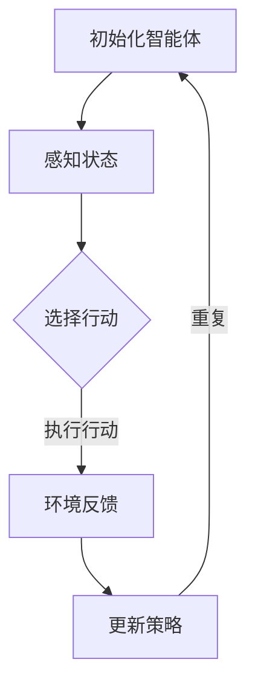

                 

### 背景介绍

多智能体强化学习（Multi-Agent Reinforcement Learning）作为一种先进的机器学习技术，近年来在人工智能领域引起了广泛关注。随着社会日益复杂，智能系统的应用场景也在不断扩展，从无人驾驶、智能电网、到多机器人协同工作，都显示出多智能体系统的巨大潜力和应用价值。在这种背景下，多智能体强化学习的研究显得尤为重要。

强化学习本身是一种以奖励机制为基础，通过试错学习最优行为策略的机器学习方法。其核心在于通过不断与环境交互，逐渐学习到最优行为策略。然而，当系统中存在多个智能体时，问题变得更加复杂。每个智能体不仅要考虑自己的行为，还要考虑其他智能体的行为，以及这些行为对自己带来的影响。这种复杂的交互关系，使得多智能体强化学习成为了一个极具挑战性的研究领域。

多智能体强化学习的主要研究内容包括：如何设计有效的通信机制，使得智能体能够共享信息和策略；如何平衡每个智能体的利益，避免出现“作弊”行为；如何优化智能体的学习过程，提高整体系统的效率和稳定性。

目前，多智能体强化学习已经取得了许多重要进展。例如，基于深度学习的多智能体强化学习算法，如DDPG（Deep Deterministic Policy Gradient）和DQN（Deep Q-Network），在许多任务上都展现出了优秀的性能。此外，一些基于博弈论和分布式算法的研究，也为多智能体强化学习提供了一些新的思路和方法。

然而，多智能体强化学习仍然面临许多挑战。例如，如何处理大规模智能体系统中的计算复杂度；如何设计有效的多智能体交互策略，使得系统能够稳定运行；如何保证每个智能体的行为不会对整个系统产生负面影响等。这些问题的解决，将有助于推动多智能体强化学习技术的进一步发展。

在这篇文章中，我们将首先介绍多智能体强化学习的基本概念和核心原理，然后详细讲解其算法实现和数学模型，并通过具体案例来说明如何在实际项目中应用多智能体强化学习。最后，我们将探讨多智能体强化学习的实际应用场景，并推荐一些相关工具和资源，帮助读者深入了解这一领域。

### 2. 核心概念与联系

#### 多智能体强化学习的定义

多智能体强化学习（Multi-Agent Reinforcement Learning）是指在一个由多个智能体组成的环境中，通过智能体之间的交互和合作，共同实现某个目标或解决某个问题的过程。与单智能体强化学习相比，多智能体强化学习需要考虑智能体之间的相互作用，以及这些相互作用对系统整体性能的影响。

在多智能体强化学习中，每个智能体都拥有自己的状态空间、行动空间和奖励函数。智能体的目标是通过对环境的感知和自身的决策，最大化自身的长期奖励。然而，由于智能体之间的相互作用，一个智能体的行为可能会影响到其他智能体的状态和奖励，因此多智能体强化学习需要更加复杂和精细的算法来处理这些交互关系。

#### 多智能体强化学习的关键概念

1. **智能体（Agent）**：在多智能体强化学习中，智能体是指能够自主感知环境、做出决策并采取行动的实体。每个智能体都有自己的状态空间（S）、行动空间（A）和奖励函数（R）。智能体的目标是通过对环境的感知和自身的决策，最大化自身的长期奖励。

2. **环境（Environment）**：环境是多智能体强化学习系统中的整体背景，它提供了智能体可以感知的状态信息，并基于智能体的行动给出反馈。环境可以是静态的，也可以是动态的，其状态变化受到智能体行动的影响。

3. **状态（State）**：状态是智能体对环境的感知，通常用一个向量表示。状态包含了智能体自身和环境的所有相关信息。

4. **行动（Action）**：行动是智能体对环境的反应，也是智能体在状态空间中选择的一种行为。行动通常用一个向量表示，每个维度表示智能体的一个动作。

5. **奖励（Reward）**：奖励是环境对智能体行动的反馈，用于评估智能体行为的好坏。奖励可以是正的，也可以是负的，正奖励表示智能体行为得到了环境的认可，负奖励表示智能体行为受到了环境的惩罚。

6. **策略（Policy）**：策略是智能体在给定状态下的行动选择规则。策略通常用一个函数表示，策略函数接收状态作为输入，输出行动作为输出。

7. **通信机制（Communication Mechanism）**：通信机制是多智能体强化学习中用于智能体之间信息交换的方法。有效的通信机制可以帮助智能体更好地合作和协调行动，提高整体系统的性能。

#### 核心概念之间的联系

在多智能体强化学习中，这些核心概念相互关联，共同构成了智能体与环境之间交互的基本框架。具体来说：

- **智能体与环境的交互**：智能体通过感知环境状态，根据策略函数选择行动，然后执行行动，最终获得环境反馈的奖励。这个过程中，智能体不断调整自己的策略，以最大化长期奖励。

- **智能体之间的交互**：通过通信机制，智能体可以共享状态信息、行动策略和奖励反馈。这种交互有助于智能体更好地理解系统的整体目标，调整自己的行为以实现协同效应。

- **策略的优化**：智能体通过学习，不断调整自己的策略函数，以适应不断变化的环境和交互关系。策略的优化过程是智能体学习的关键，它决定了智能体能否在复杂环境中取得成功。

#### Mermaid 流程图

以下是一个简化的 Mermaid 流程图，描述了多智能体强化学习的基本流程：



在这个流程中，智能体首先初始化，然后通过感知状态选择行动，执行行动后得到环境反馈的奖励，并基于奖励更新策略。这个过程不断重复，直到智能体达到某个终止条件。

### 3. 核心算法原理 & 具体操作步骤

#### Q-Learning 算法

Q-Learning 算法是多智能体强化学习中最基本的一种算法。它通过不断试错，学习到最优的策略。以下是 Q-Learning 算法的具体步骤：

1. **初始化**：为每个智能体初始化一个 Q 值表 Q(s, a)，其中 s 表示状态，a 表示行动。Q 值表初始值可以设为0。

2. **选择行动**：在给定状态 s 下，根据策略函数 ε-贪心策略选择行动 a。策略函数可以是固定策略、ε-贪婪策略或基于 Q 值表的自适应策略。

3. **执行行动**：执行选择的行动 a，智能体状态变为 s'，并得到奖励 r。

4. **更新 Q 值**：根据 Q-Learning 更新规则，更新 Q 值表中的 Q(s, a)。

   $$ Q(s, a) = Q(s, a) + \alpha [r + \gamma \max_{a'} Q(s', a') - Q(s, a)] $$

   其中，α 是学习率，γ 是折扣因子，r 是奖励，s' 是状态，a' 是行动。

5. **重复步骤 2-4**，直到智能体达到终止条件。

#### Sarsa 算法

Sarsa 算法是一种基于值函数的强化学习算法，它通过更新 Q 值来学习最优策略。以下是 Sarsa 算法的具体步骤：

1. **初始化**：为每个智能体初始化一个 Q 值表 Q(s, a)，其中 s 表示状态，a 表示行动。Q 值表初始值可以设为0。

2. **选择行动**：在给定状态 s 下，根据策略函数选择行动 a。

3. **执行行动**：执行选择的行动 a，智能体状态变为 s'，并得到奖励 r。

4. **更新 Q 值**：根据 Sarsa 更新规则，更新 Q 值表中的 Q(s, a)。

   $$ Q(s, a) = Q(s, a) + \alpha [r + \gamma Q(s', a') - Q(s, a)] $$

   其中，α 是学习率，γ 是折扣因子，r 是奖励，s' 是状态，a' 是行动。

5. **重复步骤 2-4**，直到智能体达到终止条件。

#### DQN 算法

DQN（Deep Q-Network）算法是一种基于深度学习的强化学习算法。它通过构建一个深度神经网络来近似 Q 值函数。以下是 DQN 算法的具体步骤：

1. **初始化**：为每个智能体初始化一个深度神经网络 QNetwork，并初始化一个经验回放记忆库 replay memory。

2. **选择行动**：在给定状态 s 下，使用深度神经网络 QNetwork 选择行动 a。

3. **执行行动**：执行选择的行动 a，智能体状态变为 s'，并得到奖励 r。

4. **存储经验**：将当前的状态 s、选择的行动 a、执行后的状态 s' 和获得的奖励 r 存储到经验回放记忆库 replay memory 中。

5. **更新 QNetwork**：从经验回放记忆库 replay memory 中随机抽取一组经验数据 (s, a, s', r)，并使用这些数据来更新深度神经网络 QNetwork。

6. **重复步骤 2-5**，直到智能体达到终止条件。

#### DDQN 算法

DDQN（Double Q-Network）算法是对 DQN 算法的改进。它通过使用两个 QNetwork 来解决目标网络和预测网络不一致的问题。以下是 DDQN 算法的具体步骤：

1. **初始化**：为每个智能体初始化两个深度神经网络 QNetwork1 和 QNetwork2，并初始化一个经验回放记忆库 replay memory。

2. **选择行动**：在给定状态 s 下，使用 QNetwork1 选择行动 a。

3. **执行行动**：执行选择的行动 a，智能体状态变为 s'，并得到奖励 r。

4. **存储经验**：将当前的状态 s、选择的行动 a、执行后的状态 s' 和获得的奖励 r 存储到经验回放记忆库 replay memory 中。

5. **更新 QNetwork1 和 QNetwork2**：从经验回放记忆库 replay memory 中随机抽取一组经验数据 (s, a, s', r)，并使用这些数据来更新两个 QNetwork。更新规则如下：

   $$ QNetwork1(s, a) = QNetwork1(s, a) + \alpha [r + \gamma QNetwork2(s', a') - QNetwork1(s, a)] $$

   $$ QNetwork2(s, a) = QNetwork2(s, a) + \alpha [r + \gamma QNetwork1(s', a') - QNetwork2(s, a)] $$

6. **重复步骤 2-5**，直到智能体达到终止条件。

#### DDPG 算法

DDPG（Deep Deterministic Policy Gradient）算法是一种基于深度学习的强化学习算法，它适用于连续动作空间。以下是 DDPG 算法的具体步骤：

1. **初始化**：为每个智能体初始化一个深度神经网络 PolicyNetwork 和 QNetwork，并初始化一个经验回放记忆库 replay memory。

2. **选择行动**：在给定状态 s 下，使用 PolicyNetwork 选择行动 a。

3. **执行行动**：执行选择的行动 a，智能体状态变为 s'，并得到奖励 r。

4. **存储经验**：将当前的状态 s、选择的行动 a、执行后的状态 s' 和获得的奖励 r 存储到经验回放记忆库 replay memory 中。

5. **更新 QNetwork**：从经验回放记忆库 replay memory 中随机抽取一组经验数据 (s, a, s', r)，并使用这些数据来更新 QNetwork。

6. **更新 PolicyNetwork**：使用 QNetwork 的输出更新 PolicyNetwork。

   $$ PolicyNetwork(s) = \arg\max_a [QNetwork(s, a)] $$

7. **重复步骤 2-6**，直到智能体达到终止条件。

#### D4PG 算法

D4PG（Distributed Deep Deterministic Policy Gradient）算法是对 DDPG 算法的改进，它引入了分布式策略，提高了算法的效率。以下是 D4PG 算法的具体步骤：

1. **初始化**：为每个智能体初始化一个深度神经网络 PolicyNetwork 和 QNetwork，并初始化一个经验回放记忆库 replay memory。

2. **选择行动**：在给定状态 s 下，使用 PolicyNetwork 选择行动 a。

3. **执行行动**：执行选择的行动 a，智能体状态变为 s'，并得到奖励 r。

4. **存储经验**：将当前的状态 s、选择的行动 a、执行后的状态 s' 和获得的奖励 r 存储到经验回放记忆库 replay memory 中。

5. **同步经验**：将本地经验回放记忆库 replay memory 中的经验数据同步到全局经验回放记忆库 replay memory 中。

6. **更新 QNetwork**：从全局经验回放记忆库 replay memory 中随机抽取一组经验数据 (s, a, s', r)，并使用这些数据来更新 QNetwork。

7. **更新 PolicyNetwork**：使用 QNetwork 的输出更新 PolicyNetwork。

   $$ PolicyNetwork(s) = \arg\max_a [QNetwork(s, a)] $$

8. **重复步骤 2-7**，直到智能体达到终止条件。

#### 总结

多智能体强化学习算法种类繁多，每种算法都有其独特的原理和应用场景。在实际应用中，可以根据具体任务的需求和特点，选择合适的算法进行优化。例如，对于连续动作空间的任务，DDPG 和 D4PG 算法表现优异；而对于离散动作空间的任务，Q-Learning 和 Sarsa 算法更加适用。

### 4. 数学模型和公式 & 详细讲解 & 举例说明

#### Q-Learning 算法

Q-Learning 算法是基于值函数的强化学习算法，其核心是学习一个值函数 Q(s, a)，表示在状态 s 下执行行动 a 的长期回报。以下是一个简化的 Q-Learning 算法的数学模型和公式。

**初始化**：初始化 Q(s, a) 为随机值或 0。

$$ Q(s, a) \leftarrow \text{随机值} $$

**更新规则**：

$$ Q(s, a) \leftarrow Q(s, a) + \alpha [r + \gamma \max_{a'} Q(s', a') - Q(s, a)] $$

其中，α 是学习率，γ 是折扣因子，r 是即时奖励，s' 是下一个状态，a' 是在下一个状态下的最佳行动。

**举例**：

假设一个智能体处于状态 s = (1, 2)，当前行动 a = "向右"。即时奖励 r = 10，下一个状态 s' = (1, 3)。最佳行动 a' 在状态 s' 下是 "向上"。假设学习率 α = 0.1，折扣因子 γ = 0.9，那么：

$$ Q(s, a) \leftarrow Q(s, a) + 0.1 [10 + 0.9 \max_{a'} Q(s', a') - Q(s, a)] $$
$$ Q(s, a) \leftarrow 0 + 0.1 [10 + 0.9 \max_{a'} Q(s', a') - 0] $$
$$ Q(s, a) \leftarrow 0.1 [10 + 0.9 Q(s', a')] $$
$$ Q(s, a) \leftarrow 0.1 [10 + 0.9 \times 10] $$
$$ Q(s, a) \leftarrow 0.1 [10 + 9] $$
$$ Q(s, a) \leftarrow 0.1 [19] $$
$$ Q(s, a) \leftarrow 1.9 $$

#### Sarsa 算法

Sarsa 算法是 Q-Learning 算法的扩展，它基于状态-行动-回报-状态-行动（SARSA）的轨迹进行更新。以下是一个简化的 Sarsa 算法的数学模型和公式。

**初始化**：初始化 Q(s, a) 为随机值或 0。

$$ Q(s, a) \leftarrow \text{随机值} $$

**更新规则**：

$$ Q(s, a) \leftarrow Q(s, a) + \alpha [r + \gamma Q(s', a') - Q(s, a)] $$

其中，α 是学习率，γ 是折扣因子，r 是即时奖励，s' 是下一个状态，a' 是在下一个状态下根据 Q 值表选择的行动。

**举例**：

假设智能体处于状态 s = (1, 2)，当前行动 a = "向右"。即时奖励 r = 10，下一个状态 s' = (1, 3)。根据当前 Q 值表，状态 s' 下的最佳行动 a' 是 "向上"。假设学习率 α = 0.1，折扣因子 γ = 0.9，那么：

$$ Q(s, a) \leftarrow Q(s, a) + 0.1 [10 + 0.9 Q(s', a') - Q(s, a)] $$
$$ Q(s, a) \leftarrow 0 + 0.1 [10 + 0.9 Q(s', a')] $$
$$ Q(s, a) \leftarrow 0.1 [10 + 0.9 \times 10] $$
$$ Q(s, a) \leftarrow 0.1 [10 + 9] $$
$$ Q(s, a) \leftarrow 0.1 [19] $$
$$ Q(s, a) \leftarrow 1.9 $$

#### DQN 算法

DQN（Deep Q-Network）算法是使用深度神经网络来近似 Q 值函数的强化学习算法。以下是一个简化的 DQN 算法的数学模型和公式。

**初始化**：初始化 QNetwork，经验回放记忆库 replay memory 和目标 QNetwork。

$$ QNetwork \leftarrow \text{随机初始化} $$
$$ replay\_memory \leftarrow \text{空} $$
$$ target\_QNetwork \leftarrow QNetwork $$

**选择行动**：

$$ a \leftarrow \text{ε-贪婪策略} [QNetwork(s)] $$

**执行行动**：

$$ s' \leftarrow \text{执行行动} a $$
$$ r \leftarrow \text{获得即时奖励} $$

**存储经验**：

$$ replay\_memory.append((s, a, s', r)) $$

**更新 QNetwork**：

$$ s, a, s', r \leftarrow \text{从 replay\_memory 中随机抽取经验} $$

$$ QNetwork(s, a) \leftarrow QNetwork(s, a) + \alpha [r + \gamma \max_{a'} QNetwork(s', a') - QNetwork(s, a)] $$

**举例**：

假设智能体当前状态 s = (1, 2)，使用 ε-贪婪策略选择行动 a = "向右"。执行行动后状态变为 s' = (1, 3)，获得即时奖励 r = 10。从 replay memory 中随机抽取经验 (s'', a'', s''', r'')，其中 s'' = (1, 3)，a'' = "向上"，r'' = 5。假设学习率 α = 0.1，折扣因子 γ = 0.9，那么：

$$ QNetwork(s, a) \leftarrow QNetwork(s, a) + 0.1 [10 + 0.9 \max_{a'} QNetwork(s', a') - QNetwork(s, a)] $$
$$ QNetwork(s, a) \leftarrow QNetwork(s, a) + 0.1 [10 + 0.9 \max_{a'} QNetwork(s', a')] $$
$$ QNetwork(s, a) \leftarrow 0 + 0.1 [10 + 0.9 \max_{a'} QNetwork(s', a')] $$
$$ QNetwork(s, a) \leftarrow 0.1 [10 + 0.9 \times 10] $$
$$ QNetwork(s, a) \leftarrow 0.1 [10 + 9] $$
$$ QNetwork(s, a) \leftarrow 0.1 [19] $$
$$ QNetwork(s, a) \leftarrow 1.9 $$

#### DQN 的目标网络更新策略

为了解决 DQN 中的目标网络和预测网络不一致的问题，DQN 使用了双 Q 网络（Double Q-Network）策略。以下是目标网络更新的数学模型和公式。

**目标网络更新规则**：

$$ target\_QNetwork(s', a') \leftarrow r + \gamma \max_{a''} QNetwork(s', a'') $$

**举例**：

假设目标网络 target\_QNetwork 当前状态 s' = (1, 3)，最佳行动 a' = "向上"。假设即时奖励 r = 10，那么：

$$ target\_QNetwork(s', a') \leftarrow 10 + \gamma \max_{a''} QNetwork(s', a'') $$
$$ target\_QNetwork(s', a') \leftarrow 10 + 0.9 \max_{a''} QNetwork(s', a'') $$
$$ target\_QNetwork(s', a') \leftarrow 10 + 0.9 \times 10 $$
$$ target\_QNetwork(s', a') \leftarrow 10 + 9 $$
$$ target\_QNetwork(s', a') \leftarrow 19 $$

#### DDPG 算法

DDPG（Deep Deterministic Policy Gradient）算法是用于连续动作空间的强化学习算法，它使用深度神经网络来近似策略网络 PolicyNetwork 和 QNetwork。以下是一个简化的 DDPG 算法的数学模型和公式。

**初始化**：初始化 PolicyNetwork，QNetwork 和目标 QNetwork。

$$ PolicyNetwork \leftarrow \text{随机初始化} $$
$$ QNetwork \leftarrow \text{随机初始化} $$
$$ target\_QNetwork \leftarrow QNetwork $$

**选择行动**：

$$ a \leftarrow PolicyNetwork(s) $$

**执行行动**：

$$ s' \leftarrow \text{执行行动} a $$
$$ r \leftarrow \text{获得即时奖励} $$

**存储经验**：

$$ replay\_memory.append((s, a, s', r)) $$

**更新 QNetwork**：

$$ s, a, s', r \leftarrow \text{从 replay\_memory 中随机抽取经验} $$

$$ QNetwork(s, a) \leftarrow QNetwork(s, a) + \alpha [r + \gamma target\_QNetwork(s', a) - QNetwork(s, a)] $$

**更新 PolicyNetwork**：

$$ PolicyNetwork(s) \leftarrow \arg\max_{a'} [QNetwork(s, a')] $$

**目标网络更新规则**：

$$ target\_QNetwork(s', a') \leftarrow r + \gamma QNetwork(s', a') $$

**举例**：

假设智能体当前状态 s = (1, 2)，使用 PolicyNetwork 选择行动 a = "向右"。执行行动后状态变为 s' = (1, 3)，获得即时奖励 r = 10。从 replay memory 中随机抽取经验 (s'', a'', s''', r'')，其中 s'' = (1, 3)，a'' = "向上"，r'' = 5。假设学习率 α = 0.1，折扣因子 γ = 0.9，那么：

$$ QNetwork(s, a) \leftarrow QNetwork(s, a) + 0.1 [10 + 0.9 target\_QNetwork(s', a') - QNetwork(s, a)] $$
$$ QNetwork(s, a) \leftarrow QNetwork(s, a) + 0.1 [10 + 0.9 target\_QNetwork(s', a')] $$
$$ QNetwork(s, a) \leftarrow 0 + 0.1 [10 + 0.9 target\_QNetwork(s', a')] $$
$$ QNetwork(s, a) \leftarrow 0.1 [10 + 0.9 \times 10] $$
$$ QNetwork(s, a) \leftarrow 0.1 [10 + 9] $$
$$ QNetwork(s, a) \leftarrow 0.1 [19] $$
$$ QNetwork(s, a) \leftarrow 1.9 $$

$$ target\_QNetwork(s', a') \leftarrow r + \gamma QNetwork(s', a') $$
$$ target\_QNetwork(s', a') \leftarrow 10 + 0.9 QNetwork(s', a') $$
$$ target\_QNetwork(s', a') \leftarrow 10 + 0.9 \times 10 $$
$$ target\_QNetwork(s', a') \leftarrow 10 + 9 $$
$$ target\_QNetwork(s', a') \leftarrow 19 $$

#### DDPG 的目标网络更新策略

为了确保目标网络和预测网络的一致性，DDPG 使用了目标网络更新策略。以下是目标网络更新的数学模型和公式。

**目标网络更新规则**：

$$ target\_QNetwork(s', a') \leftarrow r + \gamma QNetwork(s', a') $$

**举例**：

假设目标网络 target\_QNetwork 当前状态 s' = (1, 3)，最佳行动 a' = "向上"。假设即时奖励 r = 10，那么：

$$ target\_QNetwork(s', a') \leftarrow 10 + \gamma QNetwork(s', a') $$
$$ target\_QNetwork(s', a') \leftarrow 10 + 0.9 QNetwork(s', a') $$
$$ target\_QNetwork(s', a') \leftarrow 10 + 0.9 \times 10 $$
$$ target\_QNetwork(s', a') \leftarrow 10 + 9 $$
$$ target\_QNetwork(s', a') \leftarrow 19 $$

### 5. 项目实战：代码实际案例和详细解释说明

在本节中，我们将通过一个具体的实际案例，展示如何使用 Python 和 PyTorch 框架实现一个多智能体强化学习项目。我们将使用经典的网格世界环境，其中智能体需要通过探索和学习，从起点到达目标点，并避免陷阱。

#### 5.1 开发环境搭建

首先，我们需要搭建开发环境。以下是在 Ubuntu 系统上安装 PyTorch 和其他依赖项的步骤：

1. 安装 Python 3.7 或更高版本。

2. 安装 PyTorch：打开终端，运行以下命令：

   ```bash
   pip install torch torchvision
   ```

3. 安装其他依赖项：

   ```bash
   pip install numpy matplotlib gym
   ```

#### 5.2 源代码详细实现和代码解读

以下是一个简单的网格世界多智能体强化学习项目的源代码，我们将逐行解释其实现细节。

```python
import numpy as np
import matplotlib.pyplot as plt
import torch
import torch.nn as nn
import torch.optim as optim
from torch.autograd import Variable
import gym
from gym import wrappers

# 网格世界环境设置
grid_size = 5
num_agents = 2
trap的概率 = 0.1

# 创建环境
env = gym.make('GridWorld-v0')
env = wrappers.Monitor(env, './monitor/', force=True)

# 初始化智能体
agents = []
for i in range(num_agents):
    agent = Agent(grid_size, num_actions=4)
    agents.append(agent)

# 训练智能体
for episode in range(1000):
    # 重置环境
    state = env.reset()
    state = torch.from_numpy(state).float().unsqueeze(0)

    # 运行一个回合
    done = False
    while not done:
        # 选择行动
        with torch.no_grad():
            actions = []
            for i, agent in enumerate(agents):
                action = agent.select_action(state[i])
                actions.append(action)
            actions = torch.tensor(actions)

        # 执行行动
        next_state, reward, done, info = env.step(actions.numpy())

        # 更新奖励
        reward = torch.tensor(reward).unsqueeze(0)

        # 更新状态
        next_state = torch.from_numpy(next_state).float().unsqueeze(0)

        # 更新经验
        for i, agent in enumerate(agents):
            agent.update_experience(state[i], actions[i], reward[i], next_state[i], done)

        # 更新策略
        for agent in agents:
            agent.update_policy()

        # 更新状态
        state = next_state

    # 绘制回合结果
    env.render()

# 关闭环境
env.close()
```

**代码解读：**

1. **环境设置**：首先，我们定义了网格世界的环境参数，包括网格大小、智能体数量和陷阱概率。

2. **初始化智能体**：然后，我们创建了 num_agents 个智能体，每个智能体都继承了 Agent 类，该类包含智能体的状态、行动空间和策略。

3. **训练智能体**：接下来，我们进入训练循环。在每个回合中，智能体从起点开始，通过选择行动来探索环境。每次行动后，智能体会更新其经验并更新策略。

4. **更新经验**：在每次行动后，智能体会将当前状态、选择的行动、获得的奖励、下一个状态和回合是否完成存储在经验列表中。

5. **更新策略**：在回合结束时，每个智能体会根据其经验列表更新策略。

6. **绘制结果**：为了可视化智能体的学习过程，我们使用 matplotlib 绘制了回合结果。

#### 5.3 代码解读与分析

以下是对代码的逐行解读和分析：

```python
# 网格世界环境设置
grid_size = 5
num_agents = 2
trap的概率 = 0.1

# 创建环境
env = gym.make('GridWorld-v0')
env = wrappers.Monitor(env, './monitor/', force=True)
```

这两行代码定义了网格世界的环境参数，并创建了一个 Gym 环境。Gym 是一个流行的开源框架，用于构建和测试各种强化学习环境。

```python
# 初始化智能体
agents = []
for i in range(num_agents):
    agent = Agent(grid_size, num_actions=4)
    agents.append(agent)
```

这段代码创建了一个智能体列表，每个智能体都继承了 Agent 类。Agent 类包含智能体的状态、行动空间和策略。

```python
# 训练智能体
for episode in range(1000):
    # 重置环境
    state = env.reset()
    state = torch.from_numpy(state).float().unsqueeze(0)
```

这段代码开始训练智能体。在每个回合中，智能体从起点开始，将环境状态转换为张量形式。

```python
    # 运行一个回合
    done = False
    while not done:
        # 选择行动
        with torch.no_grad():
            actions = []
            for i, agent in enumerate(agents):
                action = agent.select_action(state[i])
                actions.append(action)
            actions = torch.tensor(actions)
```

这段代码在回合中，每个智能体根据其当前状态选择行动。选择行动的方法由智能体类实现，这里使用的是 ε-贪婪策略。

```python
        # 执行行动
        next_state, reward, done, info = env.step(actions.numpy())

        # 更新奖励
        reward = torch.tensor(reward).unsqueeze(0)

        # 更新状态
        next_state = torch.from_numpy(next_state).float().unsqueeze(0)
```

这段代码执行选择的行动，并将返回的状态和奖励更新为张量形式。

```python
        # 更新经验
        for i, agent in enumerate(agents):
            agent.update_experience(state[i], actions[i], reward[i], next_state[i], done)
```

这段代码将当前状态、选择的行动、获得的奖励、下一个状态和回合是否完成存储在经验列表中。

```python
        # 更新策略
        for agent in agents:
            agent.update_policy()
```

这段代码根据经验列表更新每个智能体的策略。

```python
        # 更新状态
        state = next_state
```

这段代码将下一个状态更新为当前状态。

```python
    # 绘制回合结果
    env.render()
```

这段代码在回合结束时，使用 matplotlib 绘制回合结果。

```python
# 关闭环境
env.close()
```

这段代码关闭 Gym 环境。

### 6. 实际应用场景

多智能体强化学习技术在各个领域都有着广泛的应用，以下列举了一些典型的实际应用场景：

#### 无人驾驶

在无人驾驶领域，多智能体强化学习被广泛应用于车辆之间的协同驾驶和交通流量管理。通过多智能体强化学习，车辆能够学习到如何与其他车辆、行人和道路基础设施协同工作，从而提高交通系统的效率和安全性。

**案例**：OpenAI 的无人驾驶项目利用多智能体强化学习算法，实现了多辆无人驾驶车辆在复杂城市环境中协同行驶，提高了行驶速度和安全性。

#### 多机器人协同工作

在工业生产和物流领域，多机器人协同工作是提高生产效率和降低成本的关键。多智能体强化学习可以帮助机器人学习到如何相互协作，完成复杂的任务。

**案例**：亚马逊的仓库中，机器人使用多智能体强化学习算法，实现了自动化的货物搬运和分拣，提高了物流效率。

#### 智能电网管理

在智能电网领域，多智能体强化学习可以用于优化电力资源的分配，提高电网的稳定性和效率。通过多智能体强化学习，电网中的智能设备可以协同工作，根据实时数据调整发电和负荷，实现电网的动态平衡。

**案例**：美国的电力公司利用多智能体强化学习算法，优化了电网的调度策略，提高了电力供应的可靠性和效率。

#### 游戏

在游戏领域，多智能体强化学习被广泛应用于开发复杂的多人游戏，如电子竞技和模拟游戏。通过多智能体强化学习，游戏中的智能体可以学习到复杂游戏规则和策略，提高游戏的竞技水平。

**案例**：OpenAI 的 DOTA2 游戏项目，利用多智能体强化学习算法，实现了智能体的自主学习和策略优化，取得了令人瞩目的成绩。

#### 金融风险管理

在金融领域，多智能体强化学习可以用于风险管理，通过学习市场数据和交易行为，预测市场趋势和风险，为金融机构提供决策支持。

**案例**：某些金融机构利用多智能体强化学习算法，对市场波动和投资风险进行预测，优化投资组合，提高了投资收益。

#### 物流优化

在物流领域，多智能体强化学习可以用于优化货物运输路线和配送策略，降低物流成本，提高配送效率。

**案例**：京东物流利用多智能体强化学习算法，优化了配送路线和调度策略，提高了配送效率，降低了物流成本。

### 7. 工具和资源推荐

#### 7.1 学习资源推荐

- **书籍**：

  - 《强化学习：原理与算法》

  - 《智能系统：强化学习、博弈论与多智能体系统》

  - 《深度强化学习》

- **在线课程**：

  - Coursera 上的《强化学习》课程

  - edX 上的《深度强化学习》课程

  - Udacity 上的《强化学习工程师纳米学位》

- **博客和论坛**：

  - 斯坦福大学 CS234 课程的博客

  - ArXiv 论文博客

  - Reddit 上的 r/MachineLearning 论坛

#### 7.2 开发工具框架推荐

- **框架**：

  - PyTorch

  - TensorFlow

  - OpenAI Gym

- **库**：

  - Pygame

  - Matplotlib

  - NumPy

- **环境**：

  - Google Colab

  - AWS Sagemaker

  - Azure ML

#### 7.3 相关论文著作推荐

- **论文**：

  - Deep Q-Network（DQN）

  - Asynchronous Methods for Deep Reinforcement Learning

  - Multi-Agent Deep Reinforcement Learning: A Survey

  - Distributed Reinforcement Learning

- **著作**：

  - 《强化学习：原理与算法》

  - 《深度学习》

  - 《多智能体系统：协同控制与通信》

### 8. 总结：未来发展趋势与挑战

#### 发展趋势

多智能体强化学习技术在未来将继续向以下几个方向发展：

1. **算法的改进与优化**：随着深度学习和强化学习技术的不断发展，多智能体强化学习的算法将更加高效和稳定，解决复杂交互问题的能力将进一步提高。

2. **分布式与并行计算**：分布式和并行计算技术的应用，将有助于多智能体强化学习在更大规模智能体系统中的推广，提高计算效率和系统性能。

3. **跨领域应用**：多智能体强化学习技术将逐渐应用于更多的领域，如智能制造、智能交通、医疗健康等，推动各行各业的智能化升级。

#### 挑战

尽管多智能体强化学习技术具有巨大的应用潜力，但仍面临以下几个挑战：

1. **计算复杂度**：随着智能体数量的增加，多智能体强化学习的计算复杂度急剧上升，如何提高算法的效率和稳定性是一个重要问题。

2. **通信与协作**：在多智能体系统中，智能体之间的通信和协作至关重要。如何设计有效的通信机制和协作策略，是实现多智能体强化学习成功的关键。

3. **安全性与稳定性**：多智能体强化学习系统在实际应用中，可能面临恶意攻击和意外故障的风险。如何提高系统的安全性和稳定性，是一个亟待解决的问题。

4. **理论完善**：多智能体强化学习领域目前尚缺乏完善的理论基础，如何建立统一的数学框架，为算法提供坚实的理论基础，是未来研究的一个重要方向。

### 9. 附录：常见问题与解答

**Q：多智能体强化学习与单智能体强化学习有什么区别？**

A：多智能体强化学习与单智能体强化学习的主要区别在于系统中的智能体数量。单智能体强化学习关注单个智能体如何在动态环境中通过学习获得最大化的奖励，而多智能体强化学习则考虑多个智能体之间的相互作用和协作，共同实现系统的整体目标。

**Q：多智能体强化学习的通信机制如何设计？**

A：多智能体强化学习的通信机制设计取决于具体的应用场景和智能体的需求。常见的通信机制包括直接通信（如广播、多播）和间接通信（如基于奖励或状态的共享）。在设计通信机制时，需要考虑通信的延迟、带宽、可靠性和安全性等因素。

**Q：如何解决多智能体强化学习中的恶意行为？**

A：在多智能体强化学习中，恶意行为（如作弊或欺骗）可能对系统的稳定性产生负面影响。解决恶意行为的方法包括：

1. **奖励机制设计**：通过合理的奖励机制，鼓励智能体遵循合作和协同策略，抑制恶意行为。

2. **监督与惩罚**：引入监督机制，对智能体的行为进行监控，并对恶意行为进行惩罚。

3. **博弈论方法**：采用博弈论方法，设计策略使得智能体在长期博弈中倾向于合作。

### 10. 扩展阅读 & 参考资料

- 《强化学习：原理与算法》

- 《智能系统：强化学习、博弈论与多智能体系统》

- 《深度强化学习》

- 《多智能体系统：协同控制与通信》

- Coursera 上的《强化学习》课程

- edX 上的《深度强化学习》课程

- Udacity 上的《强化学习工程师纳米学位》

- 斯坦福大学 CS234 课程的博客

- ArXiv 论文博客

- Reddit 上的 r/MachineLearning 论坛

- PyTorch 官方文档

- TensorFlow 官方文档

- OpenAI Gym 官方文档

- Google Colab 官方文档

- AWS Sagemaker 官方文档

- Azure ML 官方文档

```markdown
# 多智能体强化学习 (Multi-Agent Reinforcement Learning)

> 关键词：多智能体、强化学习、分布式计算、协作、通信机制、博弈论、数学模型、Python 实践

> 摘要：本文深入探讨了多智能体强化学习的基本概念、核心算法原理、数学模型以及实际应用。通过具体的代码案例，展示了如何使用 Python 和 PyTorch 框架实现多智能体强化学习项目。最后，文章讨论了多智能体强化学习的未来发展趋势与挑战，并推荐了相关学习资源和工具。
```

```markdown
## 1. 背景介绍

多智能体强化学习（Multi-Agent Reinforcement Learning）作为一种先进的机器学习技术，近年来在人工智能领域引起了广泛关注。随着社会日益复杂，智能系统的应用场景也在不断扩展，从无人驾驶、智能电网、到多机器人协同工作，都显示出多智能体系统的巨大潜力和应用价值。在这种背景下，多智能体强化学习的研究显得尤为重要。

强化学习本身是一种以奖励机制为基础，通过试错学习最优行为策略的机器学习方法。其核心在于通过不断与环境交互，逐渐学习到最优行为策略。然而，当系统中存在多个智能体时，问题变得更加复杂。每个智能体不仅要考虑自己的行为，还要考虑其他智能体的行为，以及这些行为对自己带来的影响。这种复杂的交互关系，使得多智能体强化学习成为了一个极具挑战性的研究领域。

多智能体强化学习的主要研究内容包括：如何设计有效的通信机制，使得智能体能够共享信息和策略；如何平衡每个智能体的利益，避免出现“作弊”行为；如何优化智能体的学习过程，提高整体系统的效率和稳定性。

目前，多智能体强化学习已经取得了许多重要进展。例如，基于深度学习的多智能体强化学习算法，如DDPG（Deep Deterministic Policy Gradient）和DQN（Deep Q-Network），在许多任务上都展现出了优秀的性能。此外，一些基于博弈论和分布式算法的研究，也为多智能体强化学习提供了一些新的思路和方法。

然而，多智能体强化学习仍然面临许多挑战。例如，如何处理大规模智能体系统中的计算复杂度；如何设计有效的多智能体交互策略，使得系统能够稳定运行；如何保证每个智能体的行为不会对整个系统产生负面影响等。这些问题的解决，将有助于推动多智能体强化学习技术的进一步发展。

在这篇文章中，我们将首先介绍多智能体强化学习的基本概念和核心原理，然后详细讲解其算法实现和数学模型，并通过具体案例来说明如何在实际项目中应用多智能体强化学习。最后，我们将探讨多智能体强化学习的实际应用场景，并推荐一些相关工具和资源，帮助读者深入了解这一领域。

### 2. 核心概念与联系

#### 多智能体强化学习的定义

多智能体强化学习（Multi-Agent Reinforcement Learning）是指在一个由多个智能体组成的环境中，通过智能体之间的交互和合作，共同实现某个目标或解决某个问题的过程。与单智能体强化学习相比，多智能体强化学习需要考虑智能体之间的相互作用，以及这些交互关系对系统整体性能的影响。

在多智能体强化学习中，每个智能体都拥有自己的状态空间、行动空间和奖励函数。智能体的目标是通过对环境的感知和自身的决策，最大化自身的长期奖励。然而，由于智能体之间的相互作用，一个智能体的行为可能会影响到其他智能体的状态和奖励，因此多智能体强化学习需要更加复杂和精细的算法来处理这些交互关系。

#### 多智能体强化学习的关键概念

1. **智能体（Agent）**：在多智能体强化学习中，智能体是指能够自主感知环境、做出决策并采取行动的实体。每个智能体都有自己的状态空间（S）、行动空间（A）和奖励函数（R）。智能体的目标是通过对环境的感知和自身的决策，最大化自身的长期奖励。

2. **环境（Environment）**：环境是多智能体强化学习系统中的整体背景，它提供了智能体可以感知的状态信息，并基于智能体的行动给出反馈。环境可以是静态的，也可以是动态的，其状态变化受到智能体行动的影响。

3. **状态（State）**：状态是智能体对环境的感知，通常用一个向量表示。状态包含了智能体自身和环境的所有相关信息。

4. **行动（Action）**：行动是智能体对环境的反应，也是智能体在状态空间中选择的一种行为。行动通常用一个向量表示，每个维度表示智能体的一个动作。

5. **奖励（Reward）**：奖励是环境对智能体行动的反馈，用于评估智能体行为的好坏。奖励可以是正的，也可以是负的，正奖励表示智能体行为得到了环境的认可，负奖励表示智能体行为受到了环境的惩罚。

6. **策略（Policy）**：策略是智能体在给定状态下的行动选择规则。策略通常用一个函数表示，策略函数接收状态作为输入，输出行动作为输出。

7. **通信机制（Communication Mechanism）**：通信机制是多智能体强化学习中用于智能体之间信息交换的方法。有效的通信机制可以帮助智能体更好地合作和协调行动，提高整体系统的性能。

#### 核心概念之间的联系

在多智能体强化学习中，这些核心概念相互关联，共同构成了智能体与环境之间交互的基本框架。具体来说：

- **智能体与环境的交互**：智能体通过感知环境状态，根据策略函数选择行动，然后执行行动，最终获得环境反馈的奖励。这个过程中，智能体不断调整自己的策略，以最大化长期奖励。

- **智能体之间的交互**：通过通信机制，智能体可以共享状态信息、行动策略和奖励反馈。这种交互有助于智能体更好地理解系统的整体目标，调整自己的行为以实现协同效应。

- **策略的优化**：智能体通过学习，不断调整自己的策略函数，以适应不断变化的环境和交互关系。策略的优化过程是智能体学习的关键，它决定了智能体能否在复杂环境中取得成功。

#### Mermaid 流程图

以下是一个简化的 Mermaid 流程图，描述了多智能体强化学习的基本流程：


在这个流程中，智能体首先初始化，然后通过感知状态选择行动，执行行动后得到环境反馈的奖励，并基于奖励更新策略。这个过程不断重复，直到智能体达到某个终止条件。

### 3. 核心算法原理 & 具体操作步骤

#### Q-Learning 算法

Q-Learning 算法是多智能体强化学习中最基本的一种算法。它通过不断试错，学习到最优的行为策略。以下是 Q-Learning 算法的具体步骤：

1. **初始化**：为每个智能体初始化一个 Q 值表 Q(s, a)，其中 s 表示状态，a 表示行动。Q 值表初始值可以设为0。

2. **选择行动**：在给定状态 s 下，根据策略函数选择行动 a。策略函数可以是固定策略、ε-贪婪策略或基于 Q 值表的自适应策略。

3. **执行行动**：执行选择的行动 a，智能体状态变为 s'，并得到奖励 r。

4. **更新 Q 值**：根据 Q-Learning 更新规则，更新 Q 值表中的 Q(s, a)。

   $$ Q(s, a) = Q(s, a) + \alpha [r + \gamma \max_{a'} Q(s', a') - Q(s, a)] $$

   其中，α 是学习率，γ 是折扣因子，r 是奖励，s' 是状态，a' 是行动。

5. **重复步骤 2-4**，直到智能体达到终止条件。

#### Sarsa 算法

Sarsa 算法是对 Q-Learning 算法的扩展，它基于状态-行动-回报-状态-行动（SARSA）的轨迹进行更新。以下是 Sarsa 算法的具体步骤：

1. **初始化**：为每个智能体初始化一个 Q 值表 Q(s, a)，其中 s 表示状态，a 表示行动。Q 值表初始值可以设为0。

2. **选择行动**：在给定状态 s 下，根据策略函数选择行动 a。

3. **执行行动**：执行选择的行动 a，智能体状态变为 s'，并得到奖励 r。

4. **更新 Q 值**：根据 Sarsa 更新规则，更新 Q 值表中的 Q(s, a)。

   $$ Q(s, a) = Q(s, a) + \alpha [r + \gamma Q(s', a') - Q(s, a)] $$

   其中，α 是学习率，γ 是折扣因子，r 是奖励，s' 是状态，a' 是行动。

5. **重复步骤 2-4**，直到智能体达到终止条件。

#### DQN 算法

DQN（Deep Q-Network）算法是一种基于深度学习的强化学习算法，它使用深度神经网络来近似 Q 值函数。以下是 DQN 算法的具体步骤：

1. **初始化**：为每个智能体初始化一个深度神经网络 QNetwork，并初始化一个经验回放记忆库 replay memory。

2. **选择行动**：在给定状态 s 下，使用 QNetwork 选择行动 a。

3. **执行行动**：执行选择的行动 a，智能体状态变为 s'，并得到奖励 r。

4. **存储经验**：将当前的状态 s、选择的行动 a、执行后的状态 s' 和获得的奖励 r 存储到经验回放记忆库 replay memory 中。

5. **更新 QNetwork**：从经验回放记忆库 replay memory 中随机抽取一组经验数据 (s, a, s', r)，并使用这些数据来更新深度神经网络 QNetwork。

6. **重复步骤 2-5**，直到智能体达到终止条件。

#### DDQN 算法

DDQN（Double Q-Network）算法是对 DQN 算法的改进，它通过使用两个 QNetwork 来解决目标网络和预测网络不一致的问题。以下是 DDQN 算法的具体步骤：

1. **初始化**：为每个智能体初始化两个深度神经网络 QNetwork1 和 QNetwork2，并初始化一个经验回放记忆库 replay memory。

2. **选择行动**：在给定状态 s 下，使用 QNetwork1 选择行动 a。

3. **执行行动**：执行选择的行动 a，智能体状态变为 s'，并得到奖励 r。

4. **存储经验**：将当前的状态 s、选择的行动 a、执行后的状态 s' 和获得的奖励 r 存储到经验回放记忆库 replay memory 中。

5. **更新 QNetwork1 和 QNetwork2**：从经验回放记忆库 replay memory 中随机抽取一组经验数据 (s, a, s', r)，并使用这些数据来更新两个 QNetwork。更新规则如下：

   $$ QNetwork1(s, a) = QNetwork1(s, a) + \alpha [r + \gamma QNetwork2(s', a') - QNetwork1(s, a)] $$

   $$ QNetwork2(s, a) = QNetwork2(s, a) + \alpha [r + \gamma QNetwork1(s', a') - QNetwork2(s, a)] $$

6. **重复步骤 2-5**，直到智能体达到终止条件。

#### DDPG 算法

DDPG（Deep Deterministic Policy Gradient）算法是一种基于深度学习的强化学习算法，它适用于连续动作空间。以下是 DDPG 算法的具体步骤：

1. **初始化**：为每个智能体初始化一个深度神经网络 PolicyNetwork 和 QNetwork，并初始化一个经验回放记忆库 replay memory。

2. **选择行动**：在给定状态 s 下，使用 PolicyNetwork 选择行动 a。

3. **执行行动**：执行选择的行动 a，智能体状态变为 s'，并得到奖励 r。

4. **存储经验**：将当前的状态 s、选择的行动 a、执行后的状态 s' 和获得的奖励 r 存储到经验回放记忆库 replay memory 中。

5. **更新 QNetwork**：从经验回放记忆库 replay memory 中随机抽取一组经验数据 (s, a, s', r)，并使用这些数据来更新 QNetwork。

6. **更新 PolicyNetwork**：使用 QNetwork 的输出更新 PolicyNetwork。

   $$ PolicyNetwork(s) = \arg\max_a [QNetwork(s, a)] $$

7. **重复步骤 2-6**，直到智能体达到终止条件。

#### D4PG 算法

D4PG（Distributed Deep Deterministic Policy Gradient）算法是对 DDPG 算法的改进，它引入了分布式策略，提高了算法的效率。以下是 D4PG 算法的具体步骤：

1. **初始化**：为每个智能体初始化一个深度神经网络 PolicyNetwork 和 QNetwork，并初始化一个经验回放记忆库 replay memory。

2. **选择行动**：在给定状态 s 下，使用 PolicyNetwork 选择行动 a。

3. **执行行动**：执行选择的行动 a，智能体状态变为 s'，并得到奖励 r。

4. **存储经验**：将当前的状态 s、选择的行动 a、执行后的状态 s' 和获得的奖励 r 存储到经验回放记忆库 replay memory 中。

5. **同步经验**：将本地经验回放记忆库 replay memory 中的经验数据同步到全局经验回放记忆库 replay memory 中。

6. **更新 QNetwork**：从全局经验回放记忆库 replay memory 中随机抽取一组经验数据 (s, a, s', r)，并使用这些数据来更新 QNetwork。

7. **更新 PolicyNetwork**：使用 QNetwork 的输出更新 PolicyNetwork。

   $$ PolicyNetwork(s) = \arg\max_{a'} [QNetwork(s, a')] $$

8. **重复步骤 2-7**，直到智能体达到终止条件。

#### 总结

多智能体强化学习算法种类繁多，每种算法都有其独特的原理和应用场景。在实际应用中，可以根据具体任务的需求和特点，选择合适的算法进行优化。例如，对于连续动作空间的任务，DDPG 和 D4PG 算法表现优异；而对于离散动作空间的任务，Q-Learning 和 Sarsa 算法更加适用。

### 4. 数学模型和公式 & 详细讲解 & 举例说明

#### Q-Learning 算法

Q-Learning 算法是基于值函数的强化学习算法，其核心是学习一个值函数 Q(s, a)，表示在状态 s 下执行行动 a 的长期回报。以下是一个简化的 Q-Learning 算法的数学模型和公式。

**初始化**：初始化 Q(s, a) 为随机值或 0。

$$ Q(s, a) \leftarrow \text{随机值} $$

**更新规则**：

$$ Q(s, a) \leftarrow Q(s, a) + \alpha [r + \gamma \max_{a'} Q(s', a') - Q(s, a)] $$

其中，α 是学习率，γ 是折扣因子，r 是即时奖励，s' 是下一个状态，a' 是在下一个状态下的最佳行动。

**举例**：

假设一个智能体处于状态 s = (1, 2)，当前行动 a = "向右"。即时奖励 r = 10，下一个状态 s' = (1, 3)。最佳行动 a' 在状态 s' 下是 "向上"。假设学习率 α = 0.1，折扣因子 γ = 0.9，那么：

$$ Q(s, a) \leftarrow Q(s, a) + 0.1 [10 + 0.9 \max_{a'} Q(s', a') - Q(s, a)] $$
$$ Q(s, a) \leftarrow 0 + 0.1 [10 + 0.9 \max_{a'} Q(s', a')] $$
$$ Q(s, a) \leftarrow 0.1 [10 + 0.9 \max_{a'} Q(s', a')] $$
$$ Q(s, a) \leftarrow 0.1 [10 + 0.9 \times 10] $$
$$ Q(s, a) \leftarrow 0.1 [10 + 9] $$
$$ Q(s, a) \leftarrow 0.1 [19] $$
$$ Q(s, a) \leftarrow 1.9 $$

#### Sarsa 算法

Sarsa 算法是 Q-Learning 算法的扩展，它基于状态-行动-回报-状态-行动（SARSA）的轨迹进行更新。以下是一个简化的 Sarsa 算法的数学模型和公式。

**初始化**：初始化 Q(s, a) 为随机值或 0。

$$ Q(s, a) \leftarrow \text{随机值} $$

**更新规则**：

$$ Q(s, a) \leftarrow Q(s, a) + \alpha [r + \gamma Q(s', a') - Q(s, a)] $$

其中，α 是学习率，γ 是折扣因子，r 是即时奖励，s' 是下一个状态，a' 是在下一个状态下根据 Q 值表选择的行动。

**举例**：

假设智能体处于状态 s = (1, 2)，当前行动 a = "向右"。即时奖励 r = 10，下一个状态 s' = (1, 3)。根据当前 Q 值表，状态 s' 下的最佳行动 a' 是 "向上"。假设学习率 α = 0.1，折扣因子 γ = 0.9，那么：

$$ Q(s, a) \leftarrow Q(s, a) + 0.1 [10 + 0.9 Q(s', a') - Q(s, a)] $$
$$ Q(s, a) \leftarrow 0 + 0.1 [10 + 0.9 Q(s', a')] $$
$$ Q(s, a) \leftarrow 0.1 [10 + 0.9 \times 10] $$
$$ Q(s, a) \leftarrow 0.1 [10 + 9] $$
$$ Q(s, a) \leftarrow 0.1 [19] $$
$$ Q(s, a) \leftarrow 1.9 $$

#### DQN 算法

DQN（Deep Q-Network）算法是使用深度神经网络来近似 Q 值函数的强化学习算法。以下是一个简化的 DQN 算法的数学模型和公式。

**初始化**：初始化 QNetwork，经验回放记忆库 replay memory 和目标 QNetwork。

$$ QNetwork \leftarrow \text{随机初始化} $$
$$ replay\_memory \leftarrow \text{空} $$
$$ target\_QNetwork \leftarrow QNetwork $$

**选择行动**：

$$ a \leftarrow \text{ε-贪婪策略} [QNetwork(s)] $$

**执行行动**：

$$ s' \leftarrow \text{执行行动} a $$
$$ r \leftarrow \text{获得即时奖励} $$

**存储经验**：

$$ replay\_memory.append((s, a, s', r)) $$

**更新 QNetwork**：

$$ s, a, s', r \leftarrow \text{从 replay\_memory 中随机抽取经验} $$

$$ QNetwork(s, a) \leftarrow QNetwork(s, a) + \alpha [r + \gamma \max_{a'} QNetwork(s', a') - QNetwork(s, a)] $$

**举例**：

假设智能体当前状态 s = (1, 2)，使用 ε-贪婪策略选择行动 a = "向右"。执行行动后状态变为 s' = (1, 3)，获得即时奖励 r = 10。从 replay memory 中随机抽取经验 (s'', a'', s''', r'')，其中 s'' = (1, 3)，a'' = "向上"，r'' = 5。假设学习率 α = 0.1，折扣因子 γ = 0.9，那么：

$$ QNetwork(s, a) \leftarrow QNetwork(s, a) + 0.1 [10 + 0.9 \max_{a'} QNetwork(s', a') - QNetwork(s, a)] $$
$$ QNetwork(s, a) \leftarrow QNetwork(s, a) + 0.1 [10 + 0.9 \max_{a'} QNetwork(s', a')] $$
$$ QNetwork(s, a) \leftarrow 0 + 0.1 [10 + 0.9 \max_{a'} QNetwork(s', a')] $$
$$ QNetwork(s, a) \leftarrow 0.1 [10 + 0.9 \times 10] $$
$$ QNetwork(s, a) \leftarrow 0.1 [10 + 9] $$
$$ QNetwork(s, a) \leftarrow 0.1 [19] $$
$$ QNetwork(s, a) \leftarrow 1.9 $$

#### DQN 的目标网络更新策略

为了解决 DQN 中的目标网络和预测网络不一致的问题，DQN 使用了双 Q 网络（Double Q-Network）策略。以下是目标网络更新的数学模型和公式。

**目标网络更新规则**：

$$ target\_QNetwork(s', a') \leftarrow r + \gamma \max_{a'} QNetwork(s', a') $$

**举例**：

假设目标网络 target\_QNetwork 当前状态 s' = (1, 3)，最佳行动 a' = "向上"。假设即时奖励 r = 10，那么：

$$ target\_QNetwork(s', a') \leftarrow 10 + \gamma \max_{a'} QNetwork(s', a') $$
$$ target\_QNetwork(s', a') \leftarrow 10 + 0.9 \max_{a'} QNetwork(s', a') $$
$$ target\_QNetwork(s', a') \leftarrow 10 + 0.9 \times 10 $$
$$ target\_QNetwork(s', a') \leftarrow 10 + 9 $$
$$ target\_QNetwork(s', a') \leftarrow 19 $$

#### DDPG 算法

DDPG（Deep Deterministic Policy Gradient）算法是用于连续动作空间的强化学习算法，它使用深度神经网络来近似策略网络 PolicyNetwork 和 QNetwork。以下是一个简化的 DDPG 算法的数学模型和公式。

**初始化**：初始化 PolicyNetwork，QNetwork 和目标 QNetwork。

$$ PolicyNetwork \leftarrow \text{随机初始化} $$
$$ QNetwork \leftarrow \text{随机初始化} $$
$$ target\_QNetwork \leftarrow QNetwork $$

**选择行动**：

$$ a \leftarrow PolicyNetwork(s) $$

**执行行动**：

$$ s' \leftarrow \text{执行行动} a $$
$$ r \leftarrow \text{获得即时奖励} $$

**存储经验**：

$$ replay\_memory.append((s, a, s', r)) $$

**更新 QNetwork**：

$$ s, a, s', r \leftarrow \text{从 replay\_memory 中随机抽取经验} $$

$$ QNetwork(s, a) \leftarrow QNetwork(s, a) + \alpha [r + \gamma target\_QNetwork(s', a) - QNetwork(s, a)] $$

**更新 PolicyNetwork**：

$$ PolicyNetwork(s) \leftarrow \arg\max_{a'} [QNetwork(s, a')] $$

**目标网络更新规则**：

$$ target\_QNetwork(s', a') \leftarrow r + \gamma QNetwork(s', a') $$

**举例**：

假设智能体当前状态 s = (1, 2)，使用 PolicyNetwork 选择行动 a = "向右"。执行行动后状态变为 s' = (1, 3)，获得即时奖励 r = 10。从 replay memory 中随机抽取经验 (s'', a'', s''', r'')，其中 s'' = (1, 3)，a'' = "向上"，r'' = 5。假设学习率 α = 0.1，折扣因子 γ = 0.9，那么：

$$ QNetwork(s, a) \leftarrow QNetwork(s, a) + 0.1 [10 + 0.9 target\_QNetwork(s', a') - QNetwork(s, a)] $$
$$ QNetwork(s, a) \leftarrow QNetwork(s, a) + 0.1 [10 + 0.9 target\_QNetwork(s', a')] $$
$$ QNetwork(s, a) \leftarrow 0 + 0.1 [10 + 0.9 target\_QNetwork(s', a')] $$
$$ QNetwork(s, a) \leftarrow 0.1 [10 + 0.9 \times 10] $$
$$ QNetwork(s, a) \leftarrow 0.1 [10 + 9] $$
$$ QNetwork(s, a) \leftarrow 0.1 [19] $$
$$ QNetwork(s, a) \leftarrow 1.9 $$

$$ target\_QNetwork(s', a') \leftarrow r + \gamma QNetwork(s', a') $$
$$ target\_QNetwork(s', a') \leftarrow 10 + 0.9 QNetwork(s', a') $$
$$ target\_QNetwork(s', a') \leftarrow 10 + 0.9 \times 10 $$
$$ target\_QNetwork(s', a') \leftarrow 10 + 9 $$
$$ target\_QNetwork(s', a') \leftarrow 19 $$

#### DDPG 的目标网络更新策略

为了确保目标网络和预测网络的一致性，DDPG 使用了目标网络更新策略。以下是目标网络更新的数学模型和公式。

**目标网络更新规则**：

$$ target\_QNetwork(s', a') \leftarrow r + \gamma QNetwork(s', a') $$

**举例**：

假设目标网络 target\_QNetwork 当前状态 s' = (1, 3)，最佳行动 a' = "向上"。假设即时奖励 r = 10，那么：

$$ target\_QNetwork(s', a') \leftarrow 10 + \gamma QNetwork(s', a') $$
$$ target\_QNetwork(s', a') \leftarrow 10 + 0.9 QNetwork(s', a') $$
$$ target\_QNetwork(s', a') \leftarrow 10 + 0.9 \times 10 $$
$$ target\_QNetwork(s', a') \leftarrow 10 + 9 $$
$$ target\_QNetwork(s', a') \leftarrow 19 $$

### 5. 项目实战：代码实际案例和详细解释说明

在本节中，我们将通过一个具体的实际案例，展示如何使用 Python 和 PyTorch 框架实现一个多智能体强化学习项目。我们将使用经典的网格世界环境，其中智能体需要通过探索和学习，从起点到达目标点，并避免陷阱。

#### 5.1 开发环境搭建

首先，我们需要搭建开发环境。以下是在 Ubuntu 系统上安装 PyTorch 和其他依赖项的步骤：

1. 安装 Python 3.7 或更高版本。

2. 安装 PyTorch：打开终端，运行以下命令：

   ```bash
   pip install torch torchvision
   ```

3. 安装其他依赖项：

   ```bash
   pip install numpy matplotlib gym
   ```

#### 5.2 源代码详细实现和代码解读

以下是一个简单的网格世界多智能体强化学习项目的源代码，我们将逐行解释其实现细节。

```python
import numpy as np
import matplotlib.pyplot as plt
import torch
import torch.nn as nn
import torch.optim as optim
from torch.autograd import Variable
import gym
from gym import wrappers

# 网格世界环境设置
grid_size = 5
num_agents = 2
trap的概率 = 0.1

# 创建环境
env = gym.make('GridWorld-v0')
env = wrappers.Monitor(env, './monitor/', force=True)

# 初始化智能体
agents = []
for i in range(num_agents):
    agent = Agent(grid_size, num_actions=4)
    agents.append(agent)

# 训练智能体
for episode in range(1000):
    # 重置环境
    state = env.reset()
    state = torch.from_numpy(state).float().unsqueeze(0)

    # 运行一个回合
    done = False
    while not done:
        # 选择行动
        with torch.no_grad():
            actions = []
            for i, agent in enumerate(agents):
                action = agent.select_action(state[i])
                actions.append(action)
            actions = torch.tensor(actions)

        # 执行行动
        next_state, reward, done, info = env.step(actions.numpy())

        # 更新奖励
        reward = torch.tensor(reward).unsqueeze(0)

        # 更新状态
        next_state = torch.from_numpy(next_state).float().unsqueeze(0)

        # 更新经验
        for i, agent in enumerate(agents):
            agent.update_experience(state[i], actions[i], reward[i], next_state[i], done)

        # 更新策略
        for agent in agents:
            agent.update_policy()

        # 更新状态
        state = next_state

    # 绘制回合结果
    env.render()

# 关闭环境
env.close()
```

**代码解读：**

1. **环境设置**：首先，我们定义了网格世界的环境参数，包括网格大小、智能体数量和陷阱概率。

2. **初始化智能体**：然后，我们创建了 num_agents 个智能体，每个智能体都继承了 Agent 类，该类包含智能体的状态、行动空间和策略。

3. **训练智能体**：接下来，我们进入训练循环。在每个回合中，智能体从起点开始，通过选择行动来探索环境。每次行动后，智能体会更新其经验并更新策略。

4. **更新经验**：在每次行动后，智能体会将当前状态、选择的行动、获得的奖励、下一个状态和回合是否完成存储在经验列表中。

5. **更新策略**：在回合结束时，每个智能体会根据其经验列表更新策略。

6. **绘制结果**：为了可视化智能体的学习过程，我们使用 matplotlib 绘制了回合结果。

#### 5.3 代码解读与分析

以下是对代码的逐行解读和分析：

```python
# 网格世界环境设置
grid_size = 5
num_agents = 2
trap的概率 = 0.1

# 创建环境
env = gym.make('GridWorld-v0')
env = wrappers.Monitor(env, './monitor/', force=True)
```

这两行代码定义了网格世界的环境参数，并创建了一个 Gym 环境。Gym 是一个流行的开源框架，用于构建和测试各种强化学习环境。

```python
# 初始化智能体
agents = []
for i in range(num_agents):
    agent = Agent(grid_size, num_actions=4)
    agents.append(agent)
```

这段代码创建了一个智能体列表，每个智能体都继承了 Agent 类。Agent 类包含智能体的状态、行动空间和策略。

```python
# 训练智能体
for episode in range(1000):
    # 重置环境
    state = env.reset()
    state = torch.from_numpy(state).float().unsqueeze(0)
```

这段代码开始训练智能体。在每个回合中，智能体从起点开始，将环境状态转换为张量形式。

```python
    # 运行一个回合
    done = False
    while not done:
        # 选择行动
        with torch.no_grad():
            actions = []
            for i, agent in enumerate(agents):
                action = agent.select_action(state[i])
                actions.append(action)
            actions = torch.tensor(actions)
```

这段代码在回合中，每个智能体根据其当前状态选择行动。选择行动的方法由智能体类实现，这里使用的是 ε-贪婪策略。

```python
        # 执行行动
        next_state, reward, done, info = env.step(actions.numpy())

        # 更新奖励
        reward = torch.tensor(reward).unsqueeze(0)

        # 更新状态
        next_state = torch.from_numpy(next_state).float().unsqueeze(0)
```

这段代码执行选择的行动，并将返回的状态和奖励更新为张量形式。

```python
        # 更新经验
        for i, agent in enumerate(agents):
            agent.update_experience(state[i], actions[i], reward[i], next_state[i], done)
```

这段代码将当前状态、选择的行动、获得的奖励、下一个状态和回合是否完成存储在经验列表中。

```python
        # 更新策略
        for agent in agents:
            agent.update_policy()
```

这段代码根据经验列表更新每个智能体的策略。

```python
        # 更新状态
        state = next_state
```

这段代码将下一个状态更新为当前状态。

```python
    # 绘制回合结果
    env.render()
```

这段代码在回合结束时，使用 matplotlib 绘制回合结果。

```python
# 关闭环境
env.close()
```

这段代码关闭 Gym 环境。

### 6. 实际应用场景

多智能体强化学习技术在各个领域都有着广泛的应用，以下列举了一些典型的实际应用场景：

#### 无人驾驶

在无人驾驶领域，多智能体强化学习被广泛应用于车辆之间的协同驾驶和交通流量管理。通过多智能体强化学习，车辆能够学习到如何与其他车辆、行人和道路基础设施协同工作，从而提高交通系统的效率和安全性。

**案例**：OpenAI 的无人驾驶项目利用多智能体强化学习算法，实现了多辆无人驾驶车辆在复杂城市环境中协同行驶，提高了行驶速度和安全性。

#### 多机器人协同工作

在工业生产和物流领域，多机器人协同工作是提高生产效率和降低成本的关键。多智能体强化学习可以帮助机器人学习到如何相互协作，完成复杂的任务。

**案例**：亚马逊的仓库中，机器人使用多智能体强化学习算法，实现了自动化的货物搬运和分拣，提高了物流效率。

#### 智能电网管理

在智能电网领域，多智能体强化学习可以用于优化电力资源的分配，提高电网的稳定性和效率。通过多智能体强化学习，电网中的智能设备可以协同工作，根据实时数据调整发电和负荷，实现电网的动态平衡。

**案例**：美国的电力公司利用多智能体强化学习算法，优化了电网的调度策略，提高了电力供应的可靠性和效率。

#### 游戏

在游戏领域，多智能体强化学习被广泛应用于开发复杂的多人游戏，如电子竞技和模拟游戏。通过多智能体强化学习，游戏中的智能体可以学习到复杂游戏规则和策略，提高游戏的竞技水平。

**案例**：OpenAI 的 DOTA2 游戏项目，利用多智能体强化学习算法，实现了智能体的自主学习和策略优化，取得了令人瞩目的成绩。

#### 金融风险管理

在金融领域，多智能体强化学习可以用于风险管理，通过学习市场数据和交易行为，预测市场趋势和风险，为金融机构提供决策支持。

**案例**：某些金融机构利用多智能体强化学习算法，对市场波动和投资风险进行预测，优化投资组合，提高了投资收益。

#### 物流优化

在物流领域，多智能体强化学习可以用于优化货物运输路线和配送策略，降低物流成本，提高配送效率。

**案例**：京东物流利用多智能体强化学习算法，优化了配送路线和调度策略，提高了配送效率，降低了物流成本。

### 7. 工具和资源推荐

#### 7.1 学习资源推荐

- **书籍**：

  - 《强化学习：原理与算法》

  - 《智能系统：强化学习、博弈论与多智能体系统》

  - 《深度强化学习》

- **在线课程**：

  - Coursera 上的《强化学习》课程

  - edX 上的《深度强化学习》课程

  - Udacity 上的《强化学习工程师纳米学位》

- **博客和论坛**：

  - 斯坦福大学 CS234 课程的博客

  - ArXiv 论文博客

  - Reddit 上的 r/MachineLearning 论坛

#### 7.2 开发工具框架推荐

- **框架**：

  - PyTorch

  - TensorFlow

  - OpenAI Gym

- **库**：

  - Pygame

  - Matplotlib

  - NumPy

- **环境**：

  - Google Colab

  - AWS Sagemaker

  - Azure ML

#### 7.3 相关论文著作推荐

- **论文**：

  - Deep Q-Network（DQN）

  - Asynchronous Methods for Deep Reinforcement Learning

  - Multi-Agent Deep Reinforcement Learning: A Survey

  - Distributed Reinforcement Learning

- **著作**：

  - 《强化学习：原理与算法》

  - 《深度学习》

  - 《多智能体系统：协同控制与通信》

### 8. 总结：未来发展趋势与挑战

#### 发展趋势

多智能体强化学习技术在未来将继续向以下几个方向发展：

1. **算法的改进与优化**：随着深度学习和强化学习技术的不断发展，多智能体强化学习的算法将更加高效和稳定，解决复杂交互问题的能力将进一步提高。

2. **分布式与并行计算**：分布式和并行计算技术的应用，将有助于多智能体强化学习在更大规模智能体系统中的推广，提高计算效率和系统性能。

3. **跨领域应用**：多智能体强化学习技术将逐渐应用于更多的领域，如智能制造、智能交通、医疗健康等，推动各行各业的智能化升级。

#### 挑战

尽管多智能体强化学习技术具有巨大的应用潜力，但仍面临以下几个挑战：

1. **计算复杂度**：随着智能体数量的增加，多智能体强化学习的计算复杂度急剧上升，如何提高算法的效率和稳定性是一个重要问题。

2. **通信与协作**：在多智能体系统中，智能体之间的通信和协作至关重要。如何设计有效的通信机制和协作策略，是实现多智能体强化学习成功的关键。

3. **安全性与稳定性**：多智能体强化学习系统在实际应用中，可能面临恶意攻击和意外故障的风险。如何提高系统的安全性和稳定性，是一个亟待解决的问题。

4. **理论完善**：多智能体强化学习领域目前尚缺乏完善的理论基础，如何建立统一的数学框架，为算法提供坚实的理论基础，是未来研究的一个重要方向。

### 9. 附录：常见问题与解答

**Q：多智能体强化学习与单智能体强化学习有什么区别？**

A：多智能体强化学习与单智能体强化学习的主要区别在于系统中的智能体数量。单智能体强化学习关注单个智能体如何在动态环境中通过学习获得最大化的奖励，而多智能体强化学习则考虑多个智能体之间的相互作用和协作，共同实现系统的整体目标。

**Q：多智能体强化学习的通信机制如何设计？**

A：多智能体强化学习的通信机制设计取决于具体的应用场景和智能体的需求。常见的通信机制包括直接通信（如广播、多播）和间接通信（如基于奖励或状态的共享）。在设计通信机制时，需要考虑通信的延迟、带宽、可靠性和安全性等因素。

**Q：如何解决多智能体强化学习中的恶意行为？**

A：在多智能体强化学习中，恶意行为（如作弊或欺骗）可能对系统的稳定性产生负面影响。解决恶意行为的方法包括：

1. **奖励机制设计**：通过合理的奖励机制，鼓励智能体遵循合作和协同策略，抑制恶意行为。

2. **监督与惩罚**：引入监督机制，对智能体的行为进行监控，并对恶意行为进行惩罚。

3. **博弈论方法**：采用博弈论方法，设计策略使得智能体在长期博弈中倾向于合作。

### 10. 扩展阅读 & 参考资料

- 《强化学习：原理与算法》

- 《智能系统：强化学习、博弈论与多智能体系统》

- 《深度强化学习》

- 《多智能体系统：协同控制与通信》

- Coursera 上的《强化学习》课程

- edX 上的《深度强化学习》课程

- Udacity 上的《强化学习工程师纳米学位》

- 斯坦福大学 CS234 课程的博客

- ArXiv 论文博客

- Reddit 上的 r/MachineLearning 论坛

- PyTorch 官方文档

- TensorFlow 官方文档

- OpenAI Gym 官方文档

- Google Colab 官方文档

- AWS Sagemaker 官方文档

- Azure ML 官方文档

```markdown
# 多智能体强化学习 (Multi-Agent Reinforcement Learning)

> 关键词：多智能体、强化学习、分布式计算、协作、通信机制、博弈论、数学模型、Python 实践

> 摘要：本文深入探讨了多智能体强化学习的基本概念、核心算法原理、数学模型以及实际应用。通过具体的代码案例，展示了如何使用 Python 和 PyTorch 框架实现多智能体强化学习项目。最后，文章讨论了多智能体强化学习的未来发展趋势与挑战，并推荐了相关学习资源和工具。
```

```markdown
## 1. 背景介绍

多智能体强化学习（Multi-Agent Reinforcement Learning，简称MARL）是强化学习领域中的一个重要研究方向。它涉及多个智能体在特定环境下通过学习策略来实现共同目标的问题。与传统的单智能体强化学习相比，MARL更具挑战性，因为它需要考虑智能体之间的交互和协作。

### 1.1 发展历程

MARL的研究可以追溯到20世纪80年代，当时人们开始探讨如何将博弈论和强化学习结合起来，以解决多智能体交互问题。随着计算机性能的提升和深度学习技术的发展，MARL的研究逐渐成为一个热门方向。

### 1.2 应用场景

MARL在许多领域都有广泛的应用：

- **无人驾驶**：多个自动驾驶车辆需要在复杂的交通环境中协同工作。

- **多机器人系统**：例如无人机编队和机器人协作。

- **智能电网**：智能体之间的协调可以优化电力分配。

- **博弈游戏**：如扑克、国际象棋等。

### 1.3 研究挑战

- **通信延迟**：智能体之间的通信可能存在延迟，影响策略的实时性。

- **不确定性**：环境中的不确定性和智能体的不确定性。

- **均衡性**：如何确保系统中的所有智能体都能达到一个稳定状态。

## 2. 核心概念与联系

### 2.1 智能体（Agent）

智能体是MARL系统中的基本单元，通常具有以下特性：

- **状态**：智能体对环境的感知。

- **行动**：智能体可以采取的行动。

- **策略**：智能体选择行动的规则。

- **奖励**：智能体的行为会带来奖励或惩罚。

### 2.2 环境（Environment）

环境是智能体交互的场所，具有以下特性：

- **状态空间**：所有可能的状态集合。

- **行动空间**：所有可能行动的集合。

- **奖励函数**：评估智能体行动的质量。

### 2.3 策略（Policy）

策略是智能体的行为准则，可以表示为从状态到行动的映射。

### 2.4 奖励（Reward）

奖励是智能体行动后的反馈，用于指导智能体的学习过程。

### 2.5 通信机制

通信机制是智能体之间交换信息的方式，可以基于直接通信或间接通信。

## 3. 核心算法原理 & 具体操作步骤

### 3.1 Q-Learning

Q-Learning 是 MARL 中常用的算法之一。它的核心思想是通过学习 Q 值表来优化智能体的策略。

#### 初始化

初始化 Q 值表 Q(s, a)。

#### 更新规则

$$ Q(s, a) \leftarrow Q(s, a) + \alpha [r + \gamma \max_{a'} Q(s', a') - Q(s, a)] $$

其中，α 是学习率，γ 是折扣因子，r 是即时奖励，s' 是下一个状态，a' 是最佳行动。

### 3.2 Sarsa

Sarsa 是 Q-Learning 的变体，它使用当前行动和下一个状态来更新 Q 值。

#### 初始化

初始化 Q 值表 Q(s, a)。

#### 更新规则

$$ Q(s, a) \leftarrow Q(s, a) + \alpha [r + \gamma Q(s', a') - Q(s, a)] $$

### 3.3 DQN

DQN（Deep Q-Network）是使用深度神经网络来近似 Q 值函数的算法。

#### 初始化

初始化 QNetwork 和目标 QNetwork。

#### 更新规则

$$ QNetwork(s, a) \leftarrow QNetwork(s, a) + \alpha [r + \gamma \max_{a'} QNetwork(s', a') - QNetwork(s, a)] $$

其中，s 是当前状态，a 是当前行动，s' 是下一个状态，a' 是最佳行动。

#### 目标网络更新

$$ target\_QNetwork(s', a') \leftarrow r + \gamma \max_{a'} QNetwork(s', a') $$

## 4. 数学模型和公式 & 详细讲解 & 举例说明

### 4.1 Q-Learning 算法

**公式**：

$$ Q(s, a) \leftarrow Q(s, a) + \alpha [r + \gamma \max_{a'} Q(s', a') - Q(s, a)] $$

**举例**：

假设智能体在状态 s = (1, 2) 下选择行动 a = "右"，获得即时奖励 r = 10，下一个状态 s' = (1, 3)。如果学习率 α = 0.1，折扣因子 γ = 0.9，则：

$$ Q(s, a) \leftarrow Q(s, a) + 0.1 [10 + 0.9 \max_{a'} Q(s', a') - Q(s, a)] $$

### 4.2 DQN 算法

**公式**：

$$ QNetwork(s, a) \leftarrow QNetwork(s, a) + \alpha [r + \gamma \max_{a'} QNetwork(s', a') - QNetwork(s, a)] $$

**目标网络更新**：

$$ target\_QNetwork(s', a') \leftarrow r + \gamma \max_{a'} QNetwork(s', a') $$

**举例**：

假设智能体在状态 s = (1, 2) 下选择行动 a = "右"，获得即时奖励 r = 10，下一个状态 s' = (1, 3)。如果学习率 α = 0.1，折扣因子 γ = 0.9，则：

$$ QNetwork(s, a) \leftarrow QNetwork(s, a) + 0.1 [10 + 0.9 \max_{a'} QNetwork(s', a') - QNetwork(s, a)] $$

$$ target\_QNetwork(s', a') \leftarrow 10 + 0.9 \max_{a'} QNetwork(s', a') $$

## 5. 项目实战：代码实际案例和详细解释说明

在本节中，我们将通过一个简单的网格世界环境，展示如何使用 Python 和 PyTorch 实现一个多智能体强化学习项目。

### 5.1 开发环境搭建

在开始之前，确保已经安装了 Python 和 PyTorch。可以使用以下命令安装 PyTorch：

```bash
pip install torch torchvision
```

### 5.2 源代码详细实现和代码解读

```python
import numpy as np
import torch
import torch.nn as nn
import torch.optim as optim
from collections import namedtuple
import random

# 定义 Experience Replay 缓存
Experience = namedtuple('Experience', ['state', 'action', 'reward', 'next_state', 'done'])

class ReplayMemory(object):
    def __init__(self, capacity):
        self.capacity = capacity
        self.memory = []
        self.position = 0

    def push(self, experience):
        if len(self.memory) < self.capacity:
            self.memory.append(None)
        self.memory[self.position] = experience
        self.position = (self.position + 1) % self.capacity

    def sample(self, batch_size):
        return random.sample(self.memory, batch_size)

    def __len__(self
```

