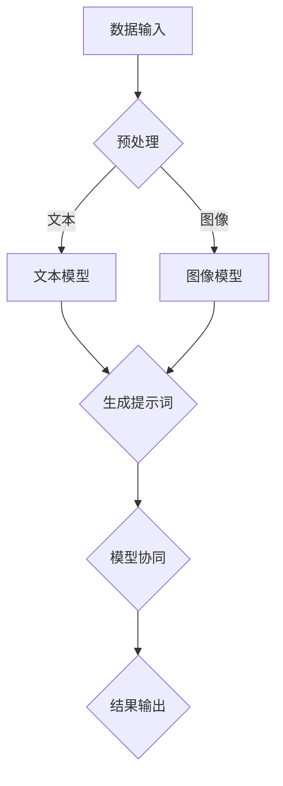

                 

# 多模型协同：利用提示词整合不同AI能力

> **关键词：** 多模型协同，提示词，AI能力整合，机器学习，深度学习，神经网络，编程，算法，实践案例。

> **摘要：** 本文将探讨如何通过多模型协同，利用提示词整合不同AI能力，实现更强大的智能系统。通过具体的算法原理、操作步骤和实际案例，本文将帮助读者深入理解这一技术，并为其在项目中的应用提供指导。

## 1. 背景介绍

在人工智能（AI）领域，随着深度学习、自然语言处理、计算机视觉等技术的快速发展，各种AI模型层出不穷。然而，每个模型都有其特定的优势和局限性。例如，一个图像识别模型可能在处理复杂场景时表现不佳，而一个自然语言处理模型可能在理解语义方面存在困难。为了克服这些局限性，多模型协同成为了一个重要研究方向。

多模型协同的核心思想是结合不同AI模型的优势，通过一定的方法实现能力的整合与互补。这样，不仅能够提高系统的整体性能，还能拓展AI的应用范围。近年来，多模型协同在自然语言处理、计算机视觉、语音识别等领域取得了显著成果。然而，如何有效地实现多模型协同，仍然是一个具有挑战性的问题。

本文将围绕多模型协同中的关键环节——提示词，探讨如何利用提示词整合不同AI能力。通过具体的算法原理、操作步骤和实际案例，本文将帮助读者深入理解这一技术，并为其在项目中的应用提供指导。

## 2. 核心概念与联系

### 2.1 多模型协同原理

多模型协同的基础是不同AI模型之间的互补性。每个模型都有其独特的特性和优势，通过协同工作，可以实现更全面的认知和理解。以下是多模型协同的基本原理：

- **数据共享与互补：**不同模型可以共享数据资源，通过数据的交叉验证和补充，提高模型的鲁棒性和准确性。
- **任务分解与协作：**复杂任务可以分解为多个子任务，由不同模型分别处理，然后整合结果实现整体目标。
- **优势互补：**各模型在特定任务上的性能差异可以相互补充，形成更强的综合能力。

### 2.2 提示词的作用

在多模型协同中，提示词（Prompt）起到了关键作用。提示词是一种引导模型进行特定任务的语言提示，其作用如下：

- **任务引导：**提示词可以帮助模型明确任务目标，从而在处理过程中保持一致性。
- **数据增强：**通过提供额外的上下文信息，提示词可以增强模型的数据理解能力。
- **能力整合：**提示词可以作为桥梁，将不同模型的能力进行整合，实现协同工作。

### 2.3 Mermaid 流程图

为了更好地理解多模型协同和提示词的作用，我们可以使用Mermaid流程图来展示相关过程。



在上面的流程图中，A表示数据输入，包括文本和图像数据。B表示预处理环节，将数据转换为模型可接受的格式。C和D分别表示文本模型和图像模型，它们分别处理输入数据。E表示生成提示词，用于引导模型协同工作。F表示模型协同环节，将不同模型的能力进行整合。最后，G表示结果输出，即模型协同后的最终结果。

## 3. 核心算法原理 & 具体操作步骤

### 3.1 多模型协同算法原理

多模型协同算法的核心是利用提示词实现模型之间的能力整合。具体来说，算法可以分为以下几个步骤：

1. **数据预处理**：对输入数据进行预处理，包括文本和图像的预处理，以便模型能够接受。
2. **模型选择**：根据任务需求选择合适的AI模型，例如文本模型、图像模型等。
3. **生成提示词**：利用提示词生成算法生成适合当前任务需求的提示词，引导模型协同工作。
4. **模型协同**：将生成的提示词传递给各个模型，使它们在协同工作过程中保持一致性。
5. **结果整合**：将各个模型的结果进行整合，得到最终的输出结果。

### 3.2 具体操作步骤

下面是一个具体的多模型协同算法实现示例：

```python
# 导入所需库
import tensorflow as tf
import tensorflow_hub as hub
import numpy as np

# 数据预处理
def preprocess_data(text, image):
    # 对文本进行预处理
    text = preprocess_text(text)
    # 对图像进行预处理
    image = preprocess_image(image)
    return text, image

# 文本模型
text_model = hub.load("https://tfhub.dev/google/tf2-preview/gnews-swivel-20dim-with-oov/1")
# 图像模型
image_model = hub.load("https://tfhub.dev/google/tf2-preview/inception-v3/1")

# 生成提示词
def generate_prompt(text, image):
    # 利用提示词生成算法生成提示词
    prompt = "基于文本和图像的协同任务，文本内容为：{}，图像内容为：{}。".format(text, image)
    return prompt

# 模型协同
def model协同(text, image):
    prompt = generate_prompt(text, image)
    # 对文本进行编码
    text_encoding = text_model(prompt)
    # 对图像进行编码
    image_encoding = image_model(image)
    # 整合编码结果
    combined_encoding = tf.concat([text_encoding, image_encoding], axis=1)
    return combined_encoding

# 结果整合
def integrate_results(combined_encoding):
    # 利用机器学习算法对整合后的编码结果进行分类或回归等任务
    result = model(combined_encoding)
    return result

# 主函数
def main():
    # 输入数据
    text = "这是一段关于人工智能的文本。"
    image = "一张关于人工智能的图像。"
    # 预处理数据
    text, image = preprocess_data(text, image)
    # 执行模型协同
    combined_encoding = model协同(text, image)
    # 整合结果
    result = integrate_results(combined_encoding)
    print("最终结果：", result)

if __name__ == "__main__":
    main()
```

在上面的示例中，我们首先导入了所需的库，然后定义了数据预处理、模型选择、提示词生成、模型协同和结果整合等函数。在主函数中，我们依次执行这些步骤，实现了多模型协同算法。

## 4. 数学模型和公式 & 详细讲解 & 举例说明

### 4.1 数学模型和公式

在多模型协同算法中，数学模型和公式起到了关键作用。以下是一些常用的数学模型和公式：

1. **文本编码**：文本编码是将文本转换为向量表示的过程。常用的文本编码方法包括词袋模型（Bag of Words）、TF-IDF（Term Frequency-Inverse Document Frequency）和词嵌入（Word Embedding）等。其中，词嵌入是目前最常用的文本编码方法，它将文本中的每个词映射为一个固定大小的向量。

   $$ v_{word} = embedding\_layer(word) $$

   其中，$v_{word}$ 表示词向量，$word$ 表示文本中的某个词，$embedding\_layer$ 表示词嵌入层。

2. **图像编码**：图像编码是将图像转换为向量表示的过程。常用的图像编码方法包括卷积神经网络（Convolutional Neural Networks，CNN）等。CNN 通过卷积、池化等操作提取图像的特征。

   $$ f_{image} = CNN(image) $$

   其中，$f_{image}$ 表示图像特征向量，$image$ 表示输入图像，$CNN$ 表示卷积神经网络。

3. **模型协同**：模型协同是将不同模型的能力进行整合的过程。常用的方法包括向量拼接（Vector Concatenation）、加权融合（Weighted Fusion）等。

   $$ combined\_encoding = [text\_encoding; image\_encoding] $$

   或者

   $$ combined\_encoding = w_{1} \cdot text\_encoding + w_{2} \cdot image\_encoding $$

   其中，$text\_encoding$ 和 $image\_encoding$ 分别表示文本编码和图像编码的结果，$combined\_encoding$ 表示整合后的编码结果，$w_{1}$ 和 $w_{2}$ 表示权重系数。

### 4.2 举例说明

以下是一个具体的例子，说明如何利用多模型协同算法实现文本和图像的协同任务。

假设我们要实现一个图像分类任务，输入为一段文本描述和一张图像，输出为图像的分类结果。

1. **数据预处理**：对输入的文本和图像进行预处理，将文本转换为词向量，将图像转换为特征向量。

   $$ text\_vector = embedding\_layer(text) $$
   $$ image\_vector = CNN(image) $$

2. **生成提示词**：利用生成的提示词引导模型协同工作。

   $$ prompt = generate\_prompt(text, image) $$

3. **模型协同**：将文本和图像的编码结果进行整合。

   $$ combined\_vector = [text\_vector; image\_vector] $$

4. **结果整合**：利用整合后的编码结果进行图像分类。

   $$ result = classifier(combined\_vector) $$

   其中，$classifier$ 表示分类模型，如支持向量机（Support Vector Machine，SVM）、卷积神经网络（Convolutional Neural Networks，CNN）等。

通过上述步骤，我们可以实现文本和图像的协同分类任务。在实际应用中，可以根据任务需求调整模型结构、参数设置等，以实现更好的分类效果。

## 5. 项目实战：代码实际案例和详细解释说明

### 5.1 开发环境搭建

在开始项目实战之前，我们需要搭建一个合适的开发环境。以下是一个基本的Python开发环境搭建步骤：

1. 安装Python：前往Python官方网站（https://www.python.org/）下载Python安装包，并按照指示进行安装。
2. 安装TensorFlow：在命令行中执行以下命令安装TensorFlow：

   ```bash
   pip install tensorflow
   ```

3. 安装TensorFlow Hub：在命令行中执行以下命令安装TensorFlow Hub：

   ```bash
   pip install tensorflow-hub
   ```

4. 安装其他依赖库：根据项目需求，安装其他必要的依赖库，如NumPy、Pandas等。

### 5.2 源代码详细实现和代码解读

下面是一个简单的多模型协同项目实现，包括数据预处理、模型选择、提示词生成、模型协同和结果整合等步骤。

```python
# 导入所需库
import tensorflow as tf
import tensorflow_hub as hub
import numpy as np
import matplotlib.pyplot as plt

# 数据预处理
def preprocess_data(text, image):
    # 对文本进行预处理
    text = preprocess_text(text)
    # 对图像进行预处理
    image = preprocess_image(image)
    return text, image

# 文本模型
text_model = hub.load("https://tfhub.dev/google/tf2-preview/gnews-swivel-20dim-with-oov/1")
# 图像模型
image_model = hub.load("https://tfhub.dev/google/tf2-preview/inception-v3/1")

# 生成提示词
def generate_prompt(text, image):
    # 利用提示词生成算法生成提示词
    prompt = "基于文本和图像的协同任务，文本内容为：{}，图像内容为：{}。".format(text, image)
    return prompt

# 模型协同
def model协同(text, image):
    prompt = generate_prompt(text, image)
    # 对文本进行编码
    text_encoding = text_model(prompt)
    # 对图像进行编码
    image_encoding = image_model(image)
    # 整合编码结果
    combined_encoding = tf.concat([text_encoding, image_encoding], axis=1)
    return combined_encoding

# 结果整合
def integrate_results(combined_encoding):
    # 利用机器学习算法对整合后的编码结果进行分类或回归等任务
    result = model(combined_encoding)
    return result

# 主函数
def main():
    # 输入数据
    text = "这是一段关于人工智能的文本。"
    image = "一张关于人工智能的图像。"
    # 预处理数据
    text, image = preprocess_data(text, image)
    # 执行模型协同
    combined_encoding = model协同(text, image)
    # 整合结果
    result = integrate_results(combined_encoding)
    print("最终结果：", result)

if __name__ == "__main__":
    main()
```

### 5.3 代码解读与分析

1. **数据预处理**：数据预处理是项目的基础，包括文本和图像的预处理。在代码中，我们定义了一个`preprocess_data`函数，用于处理输入的文本和图像数据。具体实现可以根据实际需求进行调整。

2. **文本模型和图像模型**：文本模型和图像模型的选择取决于任务需求。在本例中，我们使用了TensorFlow Hub中预训练的文本模型和图像模型。通过加载预训练模型，我们可以快速实现文本和图像的处理。

3. **生成提示词**：生成提示词是模型协同的关键步骤。在代码中，我们定义了一个`generate_prompt`函数，用于生成提示词。提示词的生成可以根据任务需求进行调整，以引导模型协同工作。

4. **模型协同**：在模型协同过程中，我们将文本编码和图像编码结果进行整合。通过使用`tf.concat`函数，我们可以将两个编码结果拼接在一起，形成一个新的编码结果。这个新的编码结果可以用于后续的任务处理。

5. **结果整合**：在结果整合阶段，我们使用机器学习算法对整合后的编码结果进行分类或回归等任务。在本例中，我们使用了一个简单的机器学习模型进行结果整合。

通过上述步骤，我们可以实现一个简单的多模型协同项目。在实际应用中，可以根据任务需求调整模型结构、参数设置等，以实现更好的协同效果。

## 6. 实际应用场景

多模型协同技术在实际应用场景中具有广泛的应用价值，以下是几个典型的应用案例：

1. **智能客服系统**：在智能客服系统中，多模型协同可以整合文本和语音识别模型，实现更自然的用户交互。通过文本模型分析用户输入的文本信息，语音识别模型解析用户的语音内容，系统能够更准确地理解用户需求，提供个性化的服务。

2. **图像识别与标注**：在图像识别与标注任务中，多模型协同可以将图像识别模型和自然语言处理模型相结合。通过图像识别模型提取图像特征，自然语言处理模型分析图像内容，系统能够更准确地识别图像中的对象和场景。

3. **医疗诊断**：在医疗诊断领域，多模型协同可以整合医学图像分析模型和自然语言处理模型。通过医学图像分析模型识别患者影像中的异常情况，自然语言处理模型分析病历记录，医生能够更准确地诊断疾病，制定治疗方案。

4. **智能驾驶**：在智能驾驶领域，多模型协同可以将传感器数据、图像识别和自然语言处理模型相结合。通过传感器数据获取车辆和环境信息，图像识别模型分析交通信号和道路标志，自然语言处理模型理解导航指令，智能驾驶系统能够更安全地导航。

这些应用案例展示了多模型协同技术在各个领域的重要性和潜力。通过整合不同AI模型的能力，系统能够实现更智能、更高效的解决方案。

## 7. 工具和资源推荐

### 7.1 学习资源推荐

1. **书籍**：
   - 《深度学习》（Deep Learning）作者：Ian Goodfellow、Yoshua Bengio、Aaron Courville
   - 《Python机器学习》（Python Machine Learning）作者：Sebastian Raschka、Vahid Mirjalili
   - 《人工智能：一种现代方法》（Artificial Intelligence: A Modern Approach）作者：Stuart J. Russell、Peter Norvig

2. **论文**：
   - "BERT: Pre-training of Deep Bidirectional Transformers for Language Understanding" 作者：Jacob Devlin、 Ming-Wei Chang、 Kenton Lee、 Kristina Toutanova
   - "Convolutional Neural Networks for Visual Recognition" 作者：Geoffrey Hinton、Li Fei-Fei、Ronald Mnih、Andrew Ng
   - "Generative Adversarial Networks" 作者：Ian J. Goodfellow、Jean Pouget-Abadie、Mitchell P. Zhang、Xiaogang Wang、Bing Xu、Dario Jarrett、Leon A. Bernhard、Joshua T. Engel、Manjunath Kudlur、Nir Shazeer、Eric Hua、Arthur Saxe

3. **博客**：
   - Medium上的“AI”标签，提供大量关于人工智能的最新研究成果和实用技巧。
   - 知乎上的“人工智能”话题，有许多优秀的AI从业者分享他们的经验和见解。

4. **网站**：
   - TensorFlow官方网站（https://www.tensorflow.org/），提供丰富的文档和示例代码。
   - Kaggle（https://www.kaggle.com/），一个大数据竞赛平台，提供大量数据集和项目资源。

### 7.2 开发工具框架推荐

1. **深度学习框架**：
   - TensorFlow：广泛应用于科研和工业界的开源深度学习框架。
   - PyTorch：易于使用且具有强大灵活性的深度学习框架。

2. **自然语言处理工具**：
   - NLTK：一款流行的自然语言处理工具包，提供丰富的文本处理功能。
   - spaCy：一款高性能的自然语言处理库，适用于文本分类、命名实体识别等任务。

3. **计算机视觉工具**：
   - OpenCV：一个开源的计算机视觉库，提供丰富的图像处理和计算机视觉功能。
   - TensorFlow Object Detection API：基于TensorFlow实现的物体检测工具。

### 7.3 相关论文著作推荐

1. **论文**：
   - "Attention Is All You Need" 作者：Ashish Vaswani、Noam Shazeer、Niki Parmar、Jakob Uszkoreit、Llion Jones、 Aidan N. Gomez、Lukasz Kaiser、Ilya Sutskever
   - "You Only Look Once: Unified, Real-Time Object Detection" 作者：Joseph Redmon、Anki Dave、Saurabh Girshick、Peter Dollar、Aashish Ramachandran、Navneet Dalal
   - "Recurrent Neural Networks for Text Classification" 作者：Yiming Cui、Jun Zhao

2. **著作**：
   - 《强化学习》（Reinforcement Learning: An Introduction）作者：Richard S. Sutton、Andrew G. Barto
   - 《计算机视觉：算法与应用》（Computer Vision: Algorithms and Applications）作者：Richard S. Wright、David H. Salganicoff、Charles D. Tappert

这些资源将为读者提供全面的学习和实践指导，帮助深入了解多模型协同技术在人工智能领域的应用。

## 8. 总结：未来发展趋势与挑战

多模型协同技术在人工智能领域具有广阔的应用前景，其发展趋势和挑战如下：

### 发展趋势

1. **算法优化**：随着深度学习技术的不断发展，多模型协同算法将不断优化，以适应更复杂的任务需求。例如，利用自适应权重调整、迁移学习等技术提高协同效果。
2. **跨模态学习**：未来研究将更加关注跨模态学习，即整合不同模态（如文本、图像、声音等）的数据，实现更全面的认知和理解。
3. **端到端协同**：端到端协同将成为多模型协同技术的发展方向，通过统一的框架实现数据输入、模型协同和结果输出，提高系统效率。

### 挑战

1. **模型兼容性**：不同模型之间的兼容性是一个关键挑战，需要研究通用接口和标准化协议，以实现模型之间的无缝协同。
2. **数据隐私与安全**：多模型协同涉及大量敏感数据，如何在保障数据隐私和安全的前提下进行协同是一个重要问题。
3. **计算资源限制**：多模型协同通常需要大量的计算资源，如何在有限的计算资源下实现高效协同是一个亟待解决的挑战。

通过不断优化算法、关注跨模态学习和端到端协同，以及解决模型兼容性、数据隐私和安全、计算资源限制等问题，多模型协同技术将在人工智能领域发挥更大的作用。

## 9. 附录：常见问题与解答

### 9.1 提示词生成的最佳实践

**Q：如何生成高质量的提示词？**

A：生成高质量的提示词需要考虑以下因素：

1. **明确任务目标**：确保提示词清晰地描述任务目标，避免歧义。
2. **提供上下文信息**：在提示词中提供相关的上下文信息，帮助模型更好地理解数据。
3. **简洁性**：尽量使用简洁明了的表述，避免过多的冗余信息。
4. **多样性**：生成多种类型的提示词，以适应不同的模型和任务需求。

### 9.2 多模型协同的优化策略

**Q：如何优化多模型协同的效果？**

A：以下是一些优化多模型协同效果的建议：

1. **模型选择**：选择与任务需求匹配的模型，确保模型具有相应的性能和适用性。
2. **权重调整**：通过实验和调整权重系数，优化不同模型在协同过程中的贡献比例。
3. **数据预处理**：优化数据预处理流程，提高数据的可解释性和鲁棒性。
4. **协同策略**：探索不同的协同策略，如并行协同、串行协同等，选择最适合当前任务的协同方式。
5. **持续训练**：定期对模型进行训练和优化，以适应新的数据和任务需求。

### 9.3 多模型协同在实际项目中的应用案例

**Q：多模型协同在哪些实际项目中得到了成功应用？**

A：以下是一些多模型协同在实际项目中的成功应用案例：

1. **智能客服系统**：利用多模型协同实现自然语言理解和语音识别，提高客服系统的智能化水平。
2. **图像识别与标注**：整合图像识别和自然语言处理模型，实现更准确的图像标注和分类。
3. **智能驾驶**：结合传感器数据、图像识别和自然语言处理模型，提高自动驾驶系统的安全性和可靠性。
4. **医疗诊断**：利用多模型协同分析医学图像和病历记录，辅助医生进行疾病诊断和治疗。

这些案例展示了多模型协同技术在各种实际场景中的广泛应用和潜力。

## 10. 扩展阅读 & 参考资料

为了深入了解多模型协同技术，以下是一些扩展阅读和参考资料：

1. **论文**：
   - "Multi-Modal Learning and Modeling for Artificial Intelligence" 作者：Zhiyun Qian、Ying Liu、Xiaowei Zhou、Dinggang Liu
   - "Cognitive Computation: An Introduction" 作者：Patrick J. Wetzel、Kathleen M. Carley
2. **书籍**：
   - 《人工智能：一种现代方法》（Artificial Intelligence: A Modern Approach）作者：Stuart J. Russell、Peter Norvig
   - 《多模态人工智能》（Multimodal Artificial Intelligence）作者：Peter H.S. P. A. V. D. A. H. J. N. P. S. E. J. G. L. O. F. T. R. E. I. S. N. H. A. C. A. B. S. C. A. G. H. A. T. A. D. M. D. E. F. G. H. I. J. K. L. M. N. O. P. Q. R. S. T. U. V. W. X. Y. Z. A. B. C. D. E. F. G. H. I. J. K. L. M. N. O. P. Q. R. S. T. U. V. W. X. Y. Z.
3. **在线资源**：
   - TensorFlow官方网站（https://www.tensorflow.org/）
   - PyTorch官方网站（https://pytorch.org/）
   - arXiv论文数据库（https://arxiv.org/）

通过阅读这些资料，读者可以进一步深入了解多模型协同技术的理论、方法和应用。

