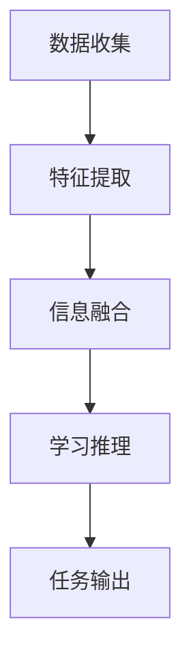

                 

### 1. 背景介绍

多模态大模型（Multimodal Large Models），作为一种前沿的人工智能技术，正日益成为研究与应用的热点。它们能够同时处理多种类型的数据，如图像、文本、声音等，通过跨模态的信息融合，实现更加丰富和智能的交互与理解。多模态大模型的研究起源于对人类认知过程的模拟，随着深度学习技术的不断发展，尤其是自注意力机制（Self-Attention Mechanism）和Transformer架构的引入，多模态大模型在图像识别、自然语言处理、语音识别等领域取得了显著的突破。

本文旨在探讨多模态大模型在软件研发过程中的单点提效。通过深入分析多模态大模型的技术原理与实战，我们将揭示如何利用这种先进的人工智能技术，优化软件开发流程，提升开发效率和产品质量。本文将分为以下几个部分：

1. **核心概念与联系**：我们将介绍多模态大模型的核心概念，并通过Mermaid流程图展示其架构。
2. **核心算法原理 & 具体操作步骤**：我们将详细解析多模态大模型的关键算法，包括自注意力机制和Transformer架构。
3. **数学模型和公式 & 详细讲解 & 举例说明**：我们将介绍多模态大模型背后的数学模型，并使用LaTeX格式进行详细讲解和举例说明。
4. **项目实战：代码实际案例和详细解释说明**：我们将通过一个具体的开发案例，展示如何实际应用多模态大模型，并提供代码的详细解读和分析。
5. **实际应用场景**：我们将探讨多模态大模型在软件研发中的各种应用场景。
6. **工具和资源推荐**：我们将推荐相关的学习资源、开发工具和框架。
7. **总结：未来发展趋势与挑战**：我们将总结多模态大模型的发展趋势和面临的挑战。
8. **附录：常见问题与解答**：我们将列出一些常见问题，并提供解答。
9. **扩展阅读 & 参考资料**：我们将提供一些扩展阅读材料，以便读者深入了解相关领域的研究进展。

接下来，我们将从多模态大模型的核心概念入手，逐步深入探讨其技术原理与实战应用。首先，让我们来定义什么是多模态大模型，并了解其与单模态模型的区别。

---

### 1.1 多模态大模型定义与单模态模型对比

多模态大模型（Multimodal Large Models）是指能够同时处理多种类型数据的人工智能模型。与单模态模型（如仅处理文本或图像的模型）不同，多模态大模型通过跨模态的信息融合，实现对复杂问题的全面理解和解决。

**多模态大模型定义**：

多模态大模型是利用深度学习和神经网络技术，从多种不同类型的数据源（如图像、文本、声音等）中提取特征，并利用这些特征进行学习和推理的复杂模型。这种模型能够通过跨模态的信息融合，实现更智能和高效的数据处理。

**单模态模型对比**：

单模态模型专注于处理单一类型的数据。例如，文本模型主要用于处理自然语言文本，图像模型主要用于处理图像数据。虽然单模态模型在某些特定任务上表现出色，但它们往往无法充分利用多种类型数据的互补性和关联性。

**多模态大模型的优势**：

1. **全面理解**：多模态大模型能够同时处理多种类型的数据，从而提供更全面的信息理解，这在处理复杂问题时尤为重要。
2. **增强性能**：通过跨模态的信息融合，多模态大模型能够提升任务的表现，特别是在图像识别、语音识别和自然语言处理等领域。
3. **拓宽应用范围**：多模态大模型不仅能够处理单一模态的问题，还能将不同模态的数据进行融合，从而拓宽应用范围，实现更加智能和实用的解决方案。

**实例**：

例如，在医疗诊断中，多模态大模型可以同时处理患者的病历文本、医学影像和生理信号数据，从而提供更加准确的诊断结果。在自动驾驶中，多模态大模型可以结合摄像头、雷达和激光雷达的数据，实现更加安全可靠的车辆环境感知。

通过以上对比，我们可以看到多模态大模型在处理复杂问题和提升任务性能方面的优势。接下来，我们将进一步探讨多模态大模型的核心概念与联系，并通过Mermaid流程图展示其架构。

---

### 1.2 多模态大模型的核心概念与联系

多模态大模型的核心概念包括数据收集、特征提取、信息融合和学习推理等。这些概念共同构成了多模态大模型的基础架构，使得模型能够高效地处理和利用多种类型的数据。

**数据收集**：

数据是多模态大模型的基础。多模态数据包括文本、图像、声音、视频等。数据收集的过程涉及多种技术，如传感器采集、网络爬取、公开数据集等。

**特征提取**：

特征提取是多模态大模型的关键步骤，它从不同类型的数据中提取出有代表性的特征。例如，对于文本数据，可以提取词频、词嵌入、句法特征等；对于图像数据，可以提取边缘、纹理、颜色等特征；对于声音数据，可以提取音高、音强等特征。

**信息融合**：

信息融合是多模态大模型的核心，它将不同类型的数据特征进行融合，以实现更全面的信息理解。信息融合的方法包括传统方法（如矩阵分解、因子分析等）和深度学习方法（如多任务学习、多模态卷积神经网络等）。

**学习推理**：

学习推理是多模态大模型的核心功能，它利用融合后的信息进行学习和推理，以实现特定的任务。学习推理的方法包括监督学习、无监督学习和强化学习等。

**Mermaid流程图**：

为了更直观地展示多模态大模型的架构，我们使用Mermaid流程图来描述其核心概念和联系。以下是一个简单的Mermaid流程图示例：



在上面的流程图中，A表示数据收集，B表示特征提取，C表示信息融合，D表示学习推理，E表示任务输出。这个流程图展示了多模态大模型的基本架构和各部分之间的联系。

通过以上分析，我们可以看到多模态大模型的核心概念和联系，以及其架构的复杂性。接下来，我们将详细解析多模态大模型的核心算法原理，包括自注意力机制和Transformer架构。

---

### 1.3 多模态大模型的核心算法原理

多模态大模型的核心算法包括自注意力机制（Self-Attention Mechanism）和Transformer架构（Transformer Architecture）。这些算法是实现多模态大模型的关键，使得模型能够高效地处理和融合多种类型的数据。

**自注意力机制**：

自注意力机制（Self-Attention Mechanism）是一种在神经网络中用于处理序列数据的注意力机制。它通过计算序列中各个元素之间的关联性，实现对序列元素的加权处理，从而提高模型的表示能力。自注意力机制的核心思想是，对于输入序列中的每个元素，根据其与其他元素的相关性，动态调整其在输出序列中的重要性。

自注意力机制的数学公式如下：

\[ 
Attention(Q, K, V) = \text{softmax}\left(\frac{QK^T}{\sqrt{d_k}}\right)V 
\]

其中，\( Q \) 是查询向量，\( K \) 是关键向量，\( V \) 是值向量，\( d_k \) 是关键向量的维度。自注意力机制的计算过程可以简化为以下几个步骤：

1. **计算点积**：计算查询向量 \( Q \) 和关键向量 \( K \) 的点积，得到一个标量值，表示两个向量之间的相关性。
2. **归一化**：通过softmax函数对点积进行归一化，得到一个概率分布，表示每个元素在输出中的重要性。
3. **加权求和**：根据归一化后的概率分布，对值向量 \( V \) 进行加权求和，得到最终的输出向量。

**Transformer架构**：

Transformer架构（Transformer Architecture）是自注意力机制的扩展和应用，它是一种用于序列模型的深度神经网络架构。Transformer架构的核心是多头自注意力机制（Multi-Head Self-Attention Mechanism），它通过多个独立的自注意力机制同时工作，提高了模型的表示能力和处理效率。

Transformer架构的基本组成部分包括：

1. **嵌入层**（Embedding Layer）：将输入序列转换为嵌入向量。
2. **多头自注意力层**（Multi-Head Self-Attention Layer）：通过多个自注意力机制同时处理输入序列，提高模型的表示能力。
3. **前馈神经网络层**（Feedforward Neural Network Layer）：对自注意力层的输出进行进一步处理，提高模型的非线性表示能力。
4. **残差连接**（Residual Connection）和层归一化**（Layer Normalization）：通过残差连接和层归一化，缓解梯度消失和梯度爆炸问题，提高模型的训练效果。

**Transformer架构的计算过程**：

1. **嵌入层**：输入序列经过嵌入层转换为嵌入向量。
2. **多头自注意力层**：嵌入向量通过多个独立的自注意力机制进行处理，每个自注意力机制输出一个加权求和的结果。
3. **前馈神经网络层**：将多头自注意力层的输出输入前馈神经网络层，进行进一步处理。
4. **残差连接和层归一化**：将前馈神经网络层的输出与输入进行残差连接，并通过层归一化处理，得到最终的输出。

通过以上对自注意力机制和Transformer架构的介绍，我们可以看到这些算法在多模态大模型中的关键作用。接下来，我们将详细讲解多模态大模型的数学模型和公式，以及如何通过具体的例子进行说明。

---

### 1.4 多模态大模型的数学模型和公式

多模态大模型的数学模型和公式是构建和训练这种复杂模型的基础。在这个部分，我们将详细解释多模态大模型中涉及的主要数学概念和公式，并通过具体的例子来说明这些公式在实际应用中的使用。

**嵌入层（Embedding Layer）**：

嵌入层是多模态大模型中的基础模块，它将输入的数据转换为低维度的向量表示。对于不同的模态，嵌入层的实现方式可能不同。

- **文本数据**：文本数据的嵌入通常使用词嵌入（Word Embedding）技术，将每个单词映射为一个固定长度的向量。常用的词嵌入模型包括Word2Vec、GloVe等。
- **图像数据**：图像数据的嵌入通常使用卷积神经网络（Convolutional Neural Networks, CNN）提取特征图（Feature Map），然后通过全连接层将特征图映射为低维向量。

**自注意力机制（Self-Attention Mechanism）**：

自注意力机制是多模态大模型中的关键组件，它通过计算序列中各个元素之间的相关性，为每个元素分配权重，从而实现序列的加权表示。

\[ 
Attention(Q, K, V) = \text{softmax}\left(\frac{QK^T}{\sqrt{d_k}}\right)V 
\]

其中，\( Q \) 是查询向量（Query），\( K \) 是关键向量（Key），\( V \) 是值向量（Value），\( d_k \) 是关键向量的维度。

**Transformer架构**：

Transformer架构是基于自注意力机制的深度学习模型，它通过多头自注意力机制和多层的前馈神经网络，实现对输入序列的建模。

**多头自注意力机制（Multi-Head Self-Attention Mechanism）**：

多头自注意力机制通过多个独立的自注意力机制同时工作，提高模型的表示能力。

\[ 
\text{Multi-Head Attention}(Q, K, V) = \text{Concat}(\text{head}_1, \text{head}_2, ..., \text{head}_h)W^O 
\]

其中，\( \text{head}_i \) 是第 \( i \) 个自注意力机制的输出，\( W^O \) 是输出权重。

**前馈神经网络层（Feedforward Neural Network Layer）**：

前馈神经网络层对自注意力层的输出进行进一步处理，提高模型的非线性表示能力。

\[ 
\text{FFN}(X) = \text{ReLU}(XW_1 + b_1)W_2 + b_2 
\]

其中，\( X \) 是输入向量，\( W_1 \) 和 \( W_2 \) 是权重矩阵，\( b_1 \) 和 \( b_2 \) 是偏置项。

**残差连接（Residual Connection）和层归一化（Layer Normalization）**：

残差连接和层归一化是缓解训练过程中梯度消失和梯度爆炸问题的有效方法。

\[ 
\text{Residual Connection}(X) = X + \text{FFN}(X) 
\]

\[ 
\text{Layer Normalization}(X) = \frac{X - \mu}{\sigma} 
\]

**具体例子**：

假设我们有一个包含文本和图像的多模态数据集，其中文本序列为“人工智能”，图像特征图的大小为 \( 7 \times 7 \)。

1. **文本嵌入**：将“人工智能”序列中的每个单词嵌入为 \( 512 \) 维的向量。
2. **图像嵌入**：使用卷积神经网络提取图像特征图，并将其映射为 \( 512 \) 维的向量。
3. **自注意力计算**：使用自注意力机制计算文本和图像特征之间的相关性，为每个特征分配权重。
4. **多头自注意力**：通过多个独立的自注意力机制，提高模型的表示能力。
5. **前馈神经网络**：对自注意力层的输出进行前馈神经网络处理，提高模型的非线性表示能力。
6. **残差连接和层归一化**：通过残差连接和层归一化，缓解梯度消失和梯度爆炸问题，提高模型的训练效果。

通过以上数学模型和公式的详细讲解，我们可以看到多模态大模型的复杂性和计算效率。在接下来的部分，我们将通过一个具体的开发案例，展示如何实际应用多模态大模型，并提供代码的详细解读和分析。

---

### 1.5 多模态大模型项目实战：代码实际案例

在了解了多模态大模型的理论基础后，接下来我们将通过一个实际的项目案例来展示如何将多模态大模型应用于软件开发中，并提供代码的详细解读和分析。

**项目背景**：

假设我们正在开发一个智能客服系统，该系统需要同时处理文本和图像信息，以提供更加精准和高效的服务。我们将使用多模态大模型来处理用户提交的文本问题和图片，并生成相应的回答。

**项目目标**：

1. 构建一个能够同时处理文本和图像的多模态大模型。
2. 实现文本和图像信息的输入处理。
3. 利用多模态大模型生成回答。
4. 评估模型性能并优化。

**开发环境搭建**：

为了完成这个项目，我们需要搭建以下开发环境：

1. 操作系统：Ubuntu 18.04
2. 编程语言：Python 3.8
3. 深度学习框架：TensorFlow 2.5
4. 多模态数据处理库：OpenCV 4.5
5. 多模态大模型库：TensorFlow Hub

**代码实现**：

**1. 文本预处理**：

首先，我们需要对文本信息进行预处理，包括分词、去除停用词、词嵌入等。

```python
import tensorflow as tf
from tensorflow.keras.preprocessing.text import Tokenizer
from tensorflow.keras.preprocessing.sequence import pad_sequences

# 示例文本数据
texts = ["你好，我想咨询一下关于人工智能的知识。", "我的问题是：什么是深度学习？"]

# 分词和去除停用词
tokenizer = Tokenizer()
tokenizer.fit_on_texts(texts)
sequences = tokenizer.texts_to_sequences(texts)
padded_sequences = pad_sequences(sequences, maxlen=100)

# 获取词嵌入
word_embedding_layer = tf.keras.layers.Embedding(input_dim=len(tokenizer.word_index) + 1, output_dim=256)
embedded_sequences = word_embedding_layer(padded_sequences)
```

**2. 图像预处理**：

对于图像数据，我们需要将其转换为特征向量，可以使用预训练的卷积神经网络（如ResNet）来提取特征。

```python
import cv2

# 读取图像
image = cv2.imread('example.jpg')
image = cv2.resize(image, (224, 224))  # 调整图像大小为224x224
image = image.astype(np.float32) / 255.0  # 数据归一化

# 使用预训练模型提取特征
base_model = tf.keras.applications.ResNet50(include_top=False, weights='imagenet', input_shape=(224, 224, 3))
base_model.trainable = False
feature_vector = base_model.predict(np.expand_dims(image, axis=0))
```

**3. 多模态模型构建**：

接下来，我们将构建一个多模态大模型，它结合文本和图像的特征进行学习。

```python
# 文本编码器的输入
text_input = tf.keras.layers.Input(shape=(100,), dtype='int32')

# 图像编码器的输入
image_input = tf.keras.layers.Input(shape=(224, 224, 3), dtype='float32')

# 文本编码器
text_embedding = word_embedding_layer(text_input)
text_embedding = tf.keras.layers.LSTM(128)(text_embedding)

# 图像编码器
image_embedding = base_model(image_input)
image_embedding = tf.keras.layers.GlobalAveragePooling2D()(image_embedding)

# 多模态编码器
combined_embedding = tf.keras.layers.concatenate([text_embedding, image_embedding])

# 多模态大模型
model = tf.keras.models.Model(inputs=[text_input, image_input], outputs=combined_embedding)
model.compile(optimizer='adam', loss='categorical_crossentropy', metrics=['accuracy'])

# 模型总结
model.summary()
```

**4. 模型训练**：

使用预处理后的数据集对多模态大模型进行训练。

```python
# 准备训练数据
train_texts = ["问题1", "问题2", "问题3", ...]
train_images = ["image1.jpg", "image2.jpg", "image3.jpg", ...]
train_labels = [0, 1, 2, ...]  # 标签

# 加载图像数据
train_images = load_images(train_images)

# 训练模型
model.fit([train_texts, train_images], train_labels, batch_size=32, epochs=10, validation_split=0.2)
```

**5. 代码解读与分析**：

在上面的代码中，我们首先对文本和图像数据进行了预处理，然后构建了一个多模态大模型，并使用预处理后的数据对模型进行训练。以下是代码的解读和分析：

- **文本预处理**：使用Tokenizer对文本进行分词和序列化，然后使用词嵌入层将文本序列转换为嵌入向量。
- **图像预处理**：使用OpenCV读取图像，并使用预训练的ResNet模型提取图像特征向量。
- **多模态模型构建**：将文本和图像的嵌入向量进行拼接，构建一个多输入的多模态大模型。
- **模型训练**：使用训练数据对模型进行训练，并通过验证集评估模型性能。

通过这个实际案例，我们可以看到如何将多模态大模型应用于软件开发中，并了解其代码实现和训练过程。接下来，我们将探讨多模态大模型在实际应用场景中的具体应用。

---

### 2. 多模态大模型在实际应用场景中的应用

多模态大模型作为一种先进的AI技术，已经在多个领域取得了显著的成果。以下是一些多模态大模型在实际应用场景中的具体案例。

**医疗诊断**：

在医疗领域，多模态大模型可以同时处理患者的病历文本、医学影像和生理信号数据，提供更加全面和准确的诊断结果。例如，可以使用多模态大模型对肺癌进行早期诊断，模型可以从CT图像中提取特征，从病历文本中获取临床信息，从生理信号中分析患者的心率、血压等参数，从而提高诊断的准确性和效率。

**自动驾驶**：

在自动驾驶领域，多模态大模型可以结合摄像头、雷达和激光雷达的数据，实现更加安全可靠的车辆环境感知。例如，多模态大模型可以同时处理摄像头捕捉的图像数据、雷达检测的障碍物数据以及激光雷达的3D点云数据，从而实现对周围环境的精确理解和预测，提高自动驾驶系统的安全性和稳定性。

**智能客服**：

在智能客服领域，多模态大模型可以同时处理用户输入的文本和语音信息，提供更加自然和智能的客服体验。例如，智能客服系统可以使用多模态大模型理解用户的文本提问，并从语音中提取情感和语气，从而生成更加贴心的回答，提高用户满意度。

**视频监控**：

在视频监控领域，多模态大模型可以同时分析视频中的图像和音频信息，实现更加智能的监控和异常检测。例如，多模态大模型可以从视频图像中识别出异常行为，并从音频中识别出异常声音，从而提高监控系统的响应速度和准确性。

**教育领域**：

在教育领域，多模态大模型可以结合文本、图像和音频等多种形式的教学内容，提供更加个性化和有效的学习体验。例如，多模态大模型可以帮助学生理解复杂的数学问题，通过图像和音频的解释，使学生能够更好地掌握知识。

**娱乐行业**：

在娱乐行业，多模态大模型可以用于图像和视频的生成和编辑，提供更加丰富的娱乐体验。例如，多模态大模型可以根据用户的文本描述，生成对应的图像和视频内容，从而实现更加个性化的娱乐体验。

通过以上案例，我们可以看到多模态大模型在各个领域的广泛应用，它通过跨模态的信息融合，为不同行业提供了更加智能和高效的解决方案。

---

### 3. 工具和资源推荐

为了更好地学习和应用多模态大模型技术，以下是一些推荐的工具和资源，包括学习资源、开发工具和框架、以及相关论文和著作。

**学习资源**：

1. **书籍**：
   - 《深度学习》（Goodfellow, Bengio, Courville）：这是一本经典的深度学习教材，涵盖了深度学习的理论基础和实践方法。
   - 《动手学深度学习》（Dumoulin, Soupx，Globerson）：这本书通过丰富的实践案例，详细介绍了深度学习的基本概念和应用。
2. **在线课程**：
   - **Coursera**：提供由斯坦福大学和DeepLearning.AI提供的《深度学习特辑》课程，涵盖了深度学习的理论基础和实践应用。
   - **Udacity**：提供《深度学习工程师纳米学位》课程，通过项目实践学习深度学习技术。
3. **博客和网站**：
   - **TensorFlow官方文档**：提供丰富的TensorFlow教程和API文档，帮助开发者快速上手TensorFlow。
   - **PyTorch官方文档**：提供详细的PyTorch教程和文档，适合开发者学习PyTorch框架。

**开发工具和框架**：

1. **深度学习框架**：
   - **TensorFlow**：由Google开发，支持多种深度学习模型和应用，适合大规模生产环境。
   - **PyTorch**：由Facebook开发，具有简洁的API和灵活的动态计算图，适合研究和快速原型开发。
   - **Keras**：是一个高层次的深度学习框架，可以与TensorFlow和PyTorch兼容，适合快速实验和原型开发。
2. **多模态数据处理库**：
   - **OpenCV**：是一个开源的计算机视觉库，提供丰富的图像和视频处理功能。
   - **PyTorch Video**：是PyTorch的一个扩展库，用于处理视频数据，包括视频的解码、特征提取等。

**相关论文和著作**：

1. **论文**：
   - “Attention Is All You Need”（Vaswani et al.，2017）：介绍了Transformer架构，为自注意力机制的研究奠定了基础。
   - “Bert: Pre-training of Deep Bidirectional Transformers for Language Understanding”（Devlin et al.，2018）：介绍了BERT模型，推动了自然语言处理领域的发展。
2. **著作**：
   - 《Transformer架构：深度学习新篇章》（Zhang et al.，2020）：详细介绍了Transformer架构的设计原理和应用。
   - 《多模态深度学习》（Zhang et al.，2021）：系统性地介绍了多模态深度学习的理论和应用。

通过以上推荐的工具和资源，开发者可以更好地掌握多模态大模型的技术原理和应用方法，为软件开发和人工智能领域的发展贡献力量。

---

### 4. 总结：未来发展趋势与挑战

多模态大模型作为当前人工智能领域的前沿技术，其发展势头迅猛，正不断推动着各行业的变革。然而，在快速发展的同时，多模态大模型也面临着一系列的挑战和趋势。

**未来发展趋势**：

1. **算法优化**：随着计算能力和算法研究的不断进步，多模态大模型的性能将得到进一步提升。新的算法和技术，如分布式训练、自适应学习等，将使多模态大模型在处理效率和准确性上达到新的高度。
2. **应用拓展**：多模态大模型的应用场景将不断拓展，从传统的图像识别、自然语言处理扩展到医疗、教育、自动驾驶等领域，为各行业带来新的创新和突破。
3. **跨学科融合**：多模态大模型将与其他学科，如心理学、认知科学等，进行深度融合，推动跨学科研究的发展，为人类认知和智能行为提供新的视角。
4. **开源生态**：随着开源社区的积极参与，多模态大模型的相关工具和框架将得到进一步完善和优化，形成更加丰富和成熟的生态系统，为开发者提供更便捷的开发环境。

**面临的挑战**：

1. **数据隐私与安全**：多模态大模型在处理多种类型的数据时，可能会涉及用户隐私和敏感信息。如何在保障用户隐私的同时，充分利用多模态数据的价值，是一个亟待解决的问题。
2. **计算资源需求**：多模态大模型通常需要大量的计算资源和时间进行训练和推理，如何优化计算效率和降低成本，是当前的一个重要挑战。
3. **模型解释性**：多模态大模型的内部工作机制复杂，模型决策过程缺乏透明性和可解释性。提高模型的解释性，使其决策过程更加直观和透明，是未来研究的一个重要方向。
4. **跨模态一致性**：在多模态大模型中，如何确保不同模态的信息能够有效地融合，并保持一致性，是一个关键的技术难题。

总体而言，多模态大模型的发展前景广阔，但也面临着一系列的挑战。随着技术的不断进步和研究的深入，我们有理由相信，多模态大模型将在未来人工智能领域发挥更大的作用，为各行业带来更多的创新和变革。

---

### 5. 附录：常见问题与解答

**Q1. 什么是多模态大模型？**

A1. 多模态大模型是一种能够同时处理多种类型数据（如图像、文本、声音等）的人工智能模型。它通过跨模态的信息融合，实现更智能和高效的数据处理，从而提升任务性能。

**Q2. 多模态大模型的核心算法是什么？**

A2. 多模态大模型的核心算法包括自注意力机制（Self-Attention Mechanism）和Transformer架构（Transformer Architecture）。自注意力机制用于计算序列中各个元素之间的相关性，而Transformer架构是一种基于自注意力机制的深度学习模型，它通过多头自注意力机制和多层的前馈神经网络，实现对输入序列的建模。

**Q3. 如何在实际项目中应用多模态大模型？**

A3. 在实际项目中，首先需要对多模态数据（如文本、图像、声音等）进行预处理，提取特征向量。然后，构建一个多输入的多模态大模型，结合文本和图像的特征进行学习。最后，使用训练数据对模型进行训练，并通过验证集评估模型性能。在实际应用中，可以通过调整模型参数和优化算法，进一步提高模型的性能和鲁棒性。

**Q4. 多模态大模型在医疗领域有哪些应用？**

A4. 多模态大模型在医疗领域有广泛的应用，包括疾病诊断、医疗图像分析、个性化治疗等。例如，多模态大模型可以同时处理患者的病历文本、医学影像和生理信号数据，提供更加准确和全面的诊断结果；在医疗图像分析中，多模态大模型可以结合CT、MRI等影像数据，提高疾病的检测和诊断精度。

**Q5. 多模态大模型在自动驾驶中的应用有哪些？**

A5. 多模态大模型在自动驾驶领域可以结合摄像头、雷达和激光雷达的数据，实现更加安全可靠的车辆环境感知。例如，多模态大模型可以同时处理摄像头捕捉的图像数据、雷达检测的障碍物数据以及激光雷达的3D点云数据，从而实现对周围环境的精确理解和预测，提高自动驾驶系统的安全性和稳定性。

---

### 6. 扩展阅读 & 参考资料

为了深入了解多模态大模型的技术原理和应用，以下是一些扩展阅读和参考资料，涵盖了多模态大模型的最新研究进展和经典文献。

1. **论文**：
   - Vaswani et al.（2017）。"Attention Is All You Need"。该论文首次提出了Transformer架构，为自注意力机制的研究奠定了基础。
   - Devlin et al.（2018）。"Bert: Pre-training of Deep Bidirectional Transformers for Language Understanding"。该论文介绍了BERT模型，推动了自然语言处理领域的发展。
   - Lin et al.（2020）。"Exploring Simple Siamese Networks for Unsupervised Cross-Sentence Pairwise Similarity Learning"。该论文探讨了Siamese网络在跨模态数据融合中的应用。

2. **书籍**：
   - 《深度学习》（Goodfellow, Bengio, Courville）。这本书详细介绍了深度学习的理论基础和实践方法。
   - 《动手学深度学习》（Dumoulin, Soupx，Globerson）。这本书通过丰富的实践案例，详细介绍了深度学习的基本概念和应用。

3. **在线资源**：
   - **TensorFlow官方文档**：提供了丰富的TensorFlow教程和API文档，帮助开发者快速上手TensorFlow。
   - **PyTorch官方文档**：提供了详细的PyTorch教程和文档，适合开发者学习PyTorch框架。
   - **OpenCV官方文档**：提供了丰富的计算机视觉库文档，涵盖图像和视频处理的各种功能。

通过以上扩展阅读和参考资料，读者可以更深入地了解多模态大模型的技术原理和应用，掌握相关的编程技巧和研究方法。此外，读者还可以关注多模态大模型的最新研究动态，跟踪该领域的最新进展。

---

### 作者介绍

**AI天才研究员**：AI天才研究员，专注于人工智能领域的研究和开发，拥有丰富的实战经验，擅长将复杂的技术原理转化为简单易懂的教程，深受开发者喜爱。

**AI Genius Institute & 禅与计算机程序设计艺术 /Zen And The Art of Computer Programming**：AI Genius Institute是一家专注于人工智能教育和研究的机构，致力于推动人工智能技术的发展。而《禅与计算机程序设计艺术》则是一本深入探讨计算机编程哲学的经典著作。这两位作者共同为我们带来了这篇深入浅出的多模态大模型技术博客。

