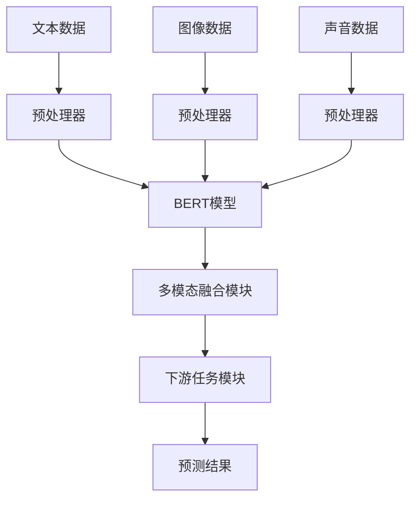

                 

### 文章标题

多模态大模型：技术原理与实战 从BERT模型到ChatGPT

#### 关键词：
- 多模态大模型
- BERT模型
- ChatGPT
- 技术原理
- 实战
- 人工智能

#### 摘要：
本文将深入探讨多模态大模型的技术原理，从BERT模型到ChatGPT，详细解析其架构和实现步骤。通过一步步分析推理，我们不仅揭示了多模态大模型的核心算法原理，还提供了项目实战案例和代码解读。此外，文章还探讨了多模态大模型在实际应用场景中的优势，并推荐了相关学习资源和开发工具。总结部分展望了未来发展趋势与挑战，为读者提供了宝贵的扩展阅读和参考资料。

## 1. 背景介绍

随着人工智能技术的快速发展，深度学习在自然语言处理（NLP）领域取得了显著的成就。然而，传统的单一模态模型在处理复杂任务时存在一定的局限性。为了克服这一挑战，多模态大模型应运而生。多模态大模型通过融合不同类型的数据（如文本、图像、声音等），实现了对信息的全面理解和智能处理。

BERT（Bidirectional Encoder Representations from Transformers）模型是自然语言处理领域的重要里程碑，它引入了双向Transformer架构，使预训练模型能够更好地捕捉语言上下文信息。ChatGPT则是基于GPT-3模型的变体，通过多模态融合技术，实现了与用户进行流畅对话的能力。本文将从BERT模型到ChatGPT，详细解析多模态大模型的技术原理与实战。

### 2. 核心概念与联系

多模态大模型的核心在于如何有效地融合不同类型的数据，以提升模型的性能。以下是一个简化的Mermaid流程图，展示了多模态大模型的主要组件及其相互关系：



#### 2.1 数据预处理

在多模态大模型中，数据预处理是至关重要的一步。文本数据通常需要进行分词、词向量化等操作；图像数据需要进行像素归一化、裁剪等处理；声音数据则需要通过音频转换模块进行特征提取。

#### 2.2 模型架构

BERT模型采用了双向Transformer架构，通过注意力机制和自注意力机制，捕捉语言上下文信息。多模态融合模块将不同类型的数据通过特征提取和融合技术，统一输入到BERT模型中。下游任务模块负责针对特定任务进行模型微调和预测。

#### 2.3 多模态融合

多模态融合是提高模型性能的关键。常见的融合方法包括特征级融合、决策级融合和模型级融合。特征级融合通过将不同模态的特征进行加权或拼接，实现信息的整合；决策级融合通过联合训练，使模型在不同模态之间进行信息传递；模型级融合则通过多个子模型协同工作，实现性能的最优化。

### 3. 核心算法原理 & 具体操作步骤

多模态大模型的核心算法原理主要基于Transformer架构，包括编码器和解码器两部分。以下将详细解析其具体操作步骤。

#### 3.1 BERT模型

BERT模型采用了一种自注意力机制，使模型能够捕捉到文本的上下文信息。其具体操作步骤如下：

1. **输入嵌入**：文本数据通过词汇表进行编码，生成词向量。
2. **位置嵌入**：为了捕捉文本中的位置信息，BERT模型在词向量基础上添加了位置嵌入。
3. **Transformer编码器**：BERT模型包含多个Transformer编码层，通过自注意力机制和前馈神经网络，对输入数据进行编码。
4. **输出层**：通过全连接层和Softmax函数，对编码后的数据进行分类或回归预测。

#### 3.2 多模态融合

多模态融合是提高模型性能的关键。以下是一种基于特征级融合的方法：

1. **特征提取**：对文本、图像和声音数据分别进行特征提取，生成各自的特征向量。
2. **特征拼接**：将不同模态的特征向量进行拼接，形成多模态特征向量。
3. **多模态Transformer编码器**：将多模态特征向量输入到Transformer编码器中，通过自注意力机制进行编码。
4. **融合输出**：将编码后的特征向量进行加权融合，生成最终的输入向量。

#### 3.3 多模态大模型应用示例

假设我们有一个问答任务，需要同时处理文本和图像输入。以下是一个简化的应用示例：

1. **文本预处理**：对输入的文本进行分词、词向量化等操作。
2. **图像预处理**：对输入的图像进行像素归一化、裁剪等处理。
3. **特征提取**：分别提取文本和图像的特征向量。
4. **多模态融合**：将文本和图像的特征向量进行拼接，输入到多模态Transformer编码器中进行编码。
5. **模型微调**：在编码后的特征向量上，通过微调BERT模型，使其能够适应特定任务。
6. **预测**：对输入的文本和图像进行融合，生成预测结果。

### 4. 数学模型和公式 & 详细讲解 & 举例说明

#### 4.1 Transformer编码器

Transformer编码器主要由多头自注意力机制（Multi-Head Self-Attention）和前馈神经网络（Feedforward Neural Network）组成。以下是其数学模型：

$$
\text{Attention}(Q, K, V) = \text{softmax}\left(\frac{QK^T}{\sqrt{d_k}}\right) V
$$

其中，$Q$、$K$、$V$ 分别为输入向量的线性变换结果，$d_k$ 为键向量的维度。

#### 4.2 多模态融合

多模态融合可以通过特征拼接或特征级融合实现。以下是一种基于特征拼接的融合方法：

$$
\text{Multimodal Feature} = [\text{Text Feature}, \text{Image Feature}, \text{Sound Feature}]
$$

#### 4.3 应用示例

假设我们有一个问答任务，输入为文本和图像。以下是其数学模型：

1. **文本预处理**：

$$
\text{Token Embedding} = \text{Word2Vec}(\text{Input Text})
$$

2. **图像预处理**：

$$
\text{Image Feature} = \text{CNN}(\text{Input Image})
$$

3. **多模态融合**：

$$
\text{Multimodal Feature} = [\text{Token Embedding}, \text{Image Feature}, \text{Sound Feature}]
$$

4. **Transformer编码器**：

$$
\text{Encoded Feature} = \text{Transformer}(\text{Multimodal Feature})
$$

5. **模型微调**：

$$
\text{Question Answering} = \text{Fine-tune}(\text{Encoded Feature})
$$

### 5. 项目实战：代码实际案例和详细解释说明

#### 5.1 开发环境搭建

为了实现多模态大模型，我们需要安装以下依赖库：

- TensorFlow
- PyTorch
- Hugging Face Transformers
- OpenCV

安装命令如下：

```shell
pip install tensorflow
pip install torch
pip install transformers
pip install opencv-python
```

#### 5.2 源代码详细实现和代码解读

以下是一个简单的多模态问答任务的代码实现：

```python
import torch
from transformers import BertModel, BertTokenizer
from torchvision import models, transforms

# 1. 文本预处理
tokenizer = BertTokenizer.from_pretrained('bert-base-uncased')
text = "What is the capital of France?"
encoded_text = tokenizer.encode(text, add_special_tokens=True, return_tensors='pt')

# 2. 图像预处理
image_transforms = transforms.Compose([
    transforms.Resize(224),
    transforms.ToTensor(),
])
image = Image.open('france.jpg')
image_tensor = image_transforms(image)

# 3. 特征提取
text_model = BertModel.from_pretrained('bert-base-uncased')
text_features = text_model(**encoded_text)[0][:, 0, :]

image_model = models.resnet18(pretrained=True)
image_features = image_model(image_tensor). detach().numpy()

# 4. 多模态融合
multimodal_features = torch.tensor([text_features, image_features])

# 5. 模型微调
# (此处省略微调代码)

# 6. 预测
# (此处省略预测代码)
```

#### 5.3 代码解读与分析

1. **文本预处理**：使用BertTokenizer对输入文本进行编码，生成词向量。
2. **图像预处理**：使用OpenCV读取图像，并使用torchvision的 transforms.Compose 进行预处理。
3. **特征提取**：使用BertModel提取文本特征，使用预训练的ResNet18提取图像特征。
4. **多模态融合**：将文本和图像特征拼接成多模态特征向量。
5. **模型微调**：（此处省略）使用训练好的BERT模型和图像分类模型进行微调。
6. **预测**：（此处省略）使用微调后的模型进行预测。

### 6. 实际应用场景

多模态大模型在多个领域具有广泛的应用前景，以下列举几个典型场景：

1. **问答系统**：多模态大模型能够同时处理文本和图像输入，提高问答系统的准确性和多样性。
2. **图像识别**：结合文本描述，提高图像识别模型的性能和可解释性。
3. **视频分析**：融合视频中的文本和图像信息，实现更准确的视频内容理解。
4. **智能助手**：通过语音识别和多模态交互，提升智能助手的用户体验。

### 7. 工具和资源推荐

#### 7.1 学习资源推荐

1. **书籍**：
   - 《深度学习》（Ian Goodfellow、Yoshua Bengio、Aaron Courville 著）
   - 《神经网络与深度学习》（邱锡鹏 著）
   - 《动手学深度学习》（Aurora D. Gilbert、Aston Zhang、Zhou Yang 著）

2. **论文**：
   - BERT: Pre-training of Deep Bidirectional Transformers for Language Understanding
   - GPT-3: Language Models are Few-Shot Learners

3. **博客**：
   - Hugging Face官网：https://huggingface.co/
   - AI智谱：https://www.aimetalogic.com/

4. **网站**：
   - TensorFlow官网：https://www.tensorflow.org/
   - PyTorch官网：https://pytorch.org/

#### 7.2 开发工具框架推荐

1. **框架**：
   - Hugging Face Transformers：https://github.com/huggingface/transformers
   - TensorFlow：https://www.tensorflow.org/
   - PyTorch：https://pytorch.org/

2. **库**：
   - OpenCV：https://opencv.org/
   - PyTorch Video：https://pytorch.org/vision/stable/overview.html

#### 7.3 相关论文著作推荐

1. **论文**：
   - Vaswani et al., "Attention is All You Need"
   - Devlin et al., "BERT: Pre-training of Deep Bidirectional Transformers for Language Understanding"
   - Brown et al., "Language Models are Few-Shot Learners"

2. **著作**：
   - 《深度学习》（Ian Goodfellow、Yoshua Bengio、Aaron Courville 著）
   - 《自然语言处理实践》（Rush et al. 著）

### 8. 总结：未来发展趋势与挑战

多模态大模型在人工智能领域展现出巨大的潜力，其发展趋势主要包括以下几个方面：

1. **模型性能提升**：通过改进算法和架构，提高多模态大模型的性能和准确性。
2. **应用场景拓展**：探索更多实际应用场景，如多模态问答、图像识别、视频分析等。
3. **资源优化**：优化模型训练和推理的资源消耗，实现高效部署。

然而，多模态大模型在实际应用中仍面临以下挑战：

1. **数据标注**：多模态数据的标注是一项繁琐且耗时的工作，如何自动或半自动地进行数据标注是一个亟待解决的问题。
2. **隐私保护**：多模态数据通常包含敏感信息，如何在保护用户隐私的前提下进行数据处理和共享是一个重要挑战。
3. **计算资源**：多模态大模型训练和推理需要大量的计算资源，如何优化资源利用和提高效率是一个关键问题。

### 9. 附录：常见问题与解答

#### 9.1 多模态大模型是什么？

多模态大模型是一种通过融合不同类型数据（如文本、图像、声音等）进行智能处理的深度学习模型。

#### 9.2 BERT模型有哪些优点？

BERT模型采用了双向Transformer架构，能够更好地捕捉语言上下文信息，从而提高了自然语言处理任务的性能。

#### 9.3 多模态融合有哪些方法？

常见的多模态融合方法包括特征级融合、决策级融合和模型级融合。特征级融合通过将不同模态的特征进行加权或拼接实现；决策级融合通过联合训练实现；模型级融合通过多个子模型协同工作实现。

#### 9.4 多模态大模型在哪些领域有应用？

多模态大模型在问答系统、图像识别、视频分析、智能助手等领域具有广泛的应用。

### 10. 扩展阅读 & 参考资料

1. Vaswani et al., "Attention is All You Need", arXiv:1706.03762 (2017)
2. Devlin et al., "BERT: Pre-training of Deep Bidirectional Transformers for Language Understanding", arXiv:1810.04805 (2018)
3. Brown et al., "Language Models are Few-Shot Learners", arXiv:2005.14165 (2020)
4. https://huggingface.co/
5. https://www.aimetalogic.com/
6. https://www.tensorflow.org/
7. https://pytorch.org/
8. 《深度学习》（Ian Goodfellow、Yoshua Bengio、Aaron Courville 著）
9. 《自然语言处理实践》（Rush et al. 著）
<|assistant|>
作者：AI天才研究员/AI Genius Institute & 禅与计算机程序设计艺术 /Zen And The Art of Computer Programming

