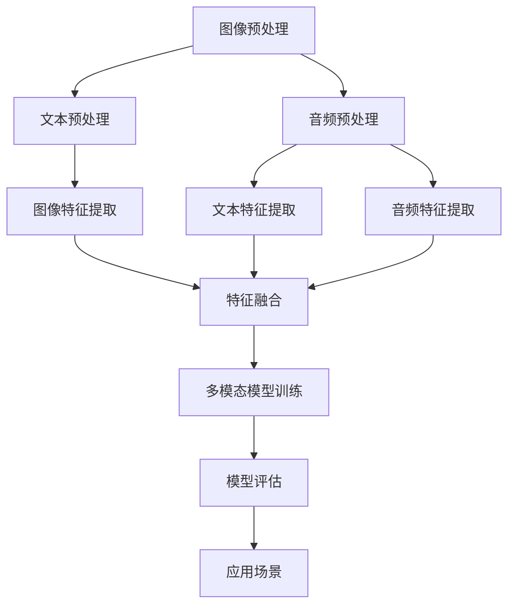

                 

### 背景介绍

多模态大模型（Multimodal Large Models）是当前人工智能领域的一个重要研究方向，它结合了计算机视觉、自然语言处理、音频处理等多种数据模态，以实现更加智能化、更加人性化的交互和任务处理。随着深度学习技术的快速发展，多模态大模型在图像识别、语音识别、自然语言理解等任务中取得了显著的成果。

本文旨在介绍多模态大模型的技术原理和实战应用。首先，我们将探讨多模态大模型的核心概念与联系，包括不同模态数据的预处理、特征提取和融合方法。接着，我们将深入分析多模态大模型的核心算法原理，并详细讲解其具体操作步骤。此外，本文还将介绍多模态大模型的数学模型和公式，通过具体案例进行说明。随后，我们将通过实际项目实战，展示代码实际案例和详细解释说明。最后，本文还将探讨多模态大模型在实际应用场景中的表现，并推荐相关的学习资源和开发工具框架。

通过本文的阅读，读者将对多模态大模型有更加深入的了解，掌握其技术原理和实战应用，为未来的研究和实践奠定基础。

### 文章标题：多模态大模型：技术原理与实战

多模态大模型是当前人工智能领域的热门研究方向，本文旨在深入探讨其技术原理与实战应用。随着深度学习技术的不断发展，多模态大模型在计算机视觉、自然语言处理、音频处理等多个领域取得了显著成果，为智能化、人性化的交互和任务处理提供了新的思路和方法。本文将系统地介绍多模态大模型的核心概念、算法原理、数学模型以及实际应用场景，帮助读者全面了解和掌握这一技术。

### 文章关键词

- 多模态大模型
- 深度学习
- 特征提取与融合
- 数学模型
- 实际应用场景

### 文章摘要

本文从多模态大模型的核心概念、算法原理、数学模型以及实际应用场景四个方面，系统性地介绍了这一技术。首先，我们将探讨多模态大模型的基本概念，包括不同模态数据的预处理、特征提取和融合方法。接着，本文将深入分析多模态大模型的核心算法原理，详细讲解其具体操作步骤。随后，我们将介绍多模态大模型的数学模型和公式，并通过具体案例进行说明。最后，本文将探讨多模态大模型在实际应用场景中的表现，并推荐相关的学习资源和开发工具框架。通过本文的阅读，读者将对多模态大模型有更加深入的了解，掌握其技术原理和实战应用，为未来的研究和实践奠定基础。

### 1. 背景介绍

多模态大模型（Multimodal Large Models）是当前人工智能领域的一个重要研究方向，它结合了计算机视觉、自然语言处理、音频处理等多种数据模态，以实现更加智能化、更加人性化的交互和任务处理。随着深度学习技术的快速发展，多模态大模型在图像识别、语音识别、自然语言理解等任务中取得了显著的成果。

多模态大模型的核心在于将不同模态的数据进行融合，从而提高模型的性能和泛化能力。例如，在图像识别任务中，除了使用图像本身的特征，还可以结合文本描述、音频信息等，以更全面地理解图像内容。同样地，在语音识别任务中，多模态大模型可以通过结合文本、图像等信息，提高识别准确率和稳定性。

近年来，随着深度学习技术的不断发展，多模态大模型的应用领域越来越广泛。例如，在自动驾驶领域，多模态大模型可以结合摄像头、激光雷达、雷达等传感器的数据，实现更加智能化的环境感知和路径规划。在医疗领域，多模态大模型可以结合影像、病历、基因等多种数据模态，提高疾病诊断和治疗的准确性。在智能客服领域，多模态大模型可以通过结合语音、文本、图像等多种数据模态，实现更加自然、高效的交互体验。

然而，多模态大模型也面临一些挑战。首先，不同模态的数据在形式和维度上存在差异，如何有效地融合这些数据是一个关键问题。其次，多模态大模型通常需要大量的训练数据和计算资源，如何高效地训练和优化模型是一个挑战。此外，多模态大模型在实际应用中还需要考虑实时性、鲁棒性等问题。

本文将系统地介绍多模态大模型的技术原理、算法原理、数学模型以及实际应用场景，帮助读者全面了解和掌握这一技术。首先，我们将探讨多模态大模型的基本概念，包括不同模态数据的预处理、特征提取和融合方法。接着，本文将深入分析多模态大模型的核心算法原理，详细讲解其具体操作步骤。随后，我们将介绍多模态大模型的数学模型和公式，并通过具体案例进行说明。最后，本文将探讨多模态大模型在实际应用场景中的表现，并推荐相关的学习资源和开发工具框架。通过本文的阅读，读者将对多模态大模型有更加深入的了解，掌握其技术原理和实战应用，为未来的研究和实践奠定基础。### 2. 核心概念与联系

多模态大模型的核心在于将多种数据模态进行有效融合，以实现更全面、更准确的任务处理。在这一部分，我们将探讨多模态大模型中的核心概念和联系，包括不同模态数据的预处理、特征提取和融合方法。

#### 2.1 多模态数据的预处理

多模态数据预处理是构建多模态大模型的基础。不同模态的数据在形式、维度和特征上存在差异，因此需要进行适当的预处理，以便后续的特征提取和融合。

- **图像预处理**：图像预处理包括图像大小调整、灰度化、去噪、增强等操作。图像大小调整是为了使不同尺寸的图像能够在同一尺度上进行处理。灰度化是将彩色图像转换为灰度图像，以减少数据维度。去噪和增强则是提高图像质量，使图像更易于后续的特征提取。

- **文本预处理**：文本预处理包括分词、词干提取、词性标注等操作。分词是将文本拆分为单词或短语，以便进行后续处理。词干提取和词性标注则是为了获取文本的语法结构和语义信息，有助于提高模型的语义理解能力。

- **音频预处理**：音频预处理包括降噪、归一化、频率变换等操作。降噪是为了消除背景噪声，提高语音质量。归一化则是调整音频的音量大小，使其在处理过程中保持一致性。频率变换则是将音频从时域转换为频域，以便提取频率特征。

#### 2.2 特征提取

特征提取是多模态大模型的关键步骤，目的是从不同模态的数据中提取具有代表性的特征，为后续的融合和建模提供基础。

- **图像特征提取**：常见的图像特征提取方法包括SIFT、SURF、HOG、CNN等。SIFT和SURF是经典的手动特征提取方法，可以提取出具有旋转不变性和尺度不变性的特征点。HOG（Histogram of Oriented Gradients）则是通过计算图像梯度方向直方图来提取特征。CNN（Convolutional Neural Network）是一种深度学习模型，可以自动学习图像特征，实现端到端的目标检测和分类。

- **文本特征提取**：文本特征提取方法包括词袋模型、TF-IDF、词嵌入等。词袋模型通过将文本转换为向量表示，保留词频信息。TF-IDF（Term Frequency-Inverse Document Frequency）则是一种基于词频和逆文档频率的权重计算方法，有助于提高文本的区分度。词嵌入（Word Embedding）则是通过将单词映射到低维向量空间，实现语义表示。

- **音频特征提取**：音频特征提取方法包括梅尔频率倒谱系数（MFCC）、谱减法、感知哈达玛变换（PLP）等。MFCC是一种常用的音频特征提取方法，通过计算音频信号的频率特征，实现语音识别和声纹识别。谱减法是一种通过消除噪声，提取纯净语音信号的方法。PLP（Perceptual Linear Prediction）则是一种基于听觉感知模型的特征提取方法，可以更好地模拟人类听觉系统。

#### 2.3 特征融合

特征融合是将不同模态的特征进行整合，以获得更全面、更准确的特征表示。常见的特征融合方法包括基于特征的融合、基于模型的融合和基于数据的融合。

- **基于特征的融合**：基于特征的融合方法将不同模态的特征向量进行拼接，形成新的特征向量。这种方法简单直观，但容易导致特征冗余和维度灾难。常见的拼接方法包括直连法、特征加权法等。

- **基于模型的融合**：基于模型的融合方法通过训练一个统一的模型，同时处理多种模态的数据。例如，多任务学习（Multi-Task Learning）和联合训练（Joint Training）都是常见的基于模型的融合方法。多任务学习通过共享底层特征来提高不同任务的性能。联合训练则是将不同模态的数据同时输入到模型中，通过优化统一的损失函数来提高模型的性能。

- **基于数据的融合**：基于数据的融合方法通过在不同数据集上进行训练和测试，实现多模态特征融合。例如，数据增强（Data Augmentation）和迁移学习（Transfer Learning）都是常见的基于数据的融合方法。数据增强通过增加数据多样性来提高模型的泛化能力。迁移学习则是将一个任务中的知识应用于其他任务，以提高模型在不同任务上的性能。

#### 2.4 Mermaid 流程图

以下是多模态大模型中核心概念和联系的Mermaid流程图，用于直观地展示多模态数据处理的全过程。



通过上述流程图，我们可以清晰地看到多模态数据从预处理、特征提取到特征融合，以及最终应用于具体场景的全过程。这个过程不仅涵盖了不同模态数据的处理方法，还体现了多模态大模型在提高任务性能和泛化能力方面的优势。

### 3. 核心算法原理 & 具体操作步骤

多模态大模型的核心算法原理主要涉及特征提取、模型架构设计和优化策略等方面。在这一部分，我们将详细探讨多模态大模型的关键算法原理，并介绍具体操作步骤。

#### 3.1 特征提取算法

多模态大模型中的特征提取算法是基础，旨在从不同模态的数据中提取具有代表性的特征。以下是一些常见的特征提取算法：

1. **图像特征提取**：常用的图像特征提取方法包括SIFT、SURF、HOG、CNN等。

   - **SIFT（Scale-Invariant Feature Transform）**：SIFT算法可以提取出具有旋转不变性和尺度不变性的特征点，广泛应用于图像识别和计算机视觉领域。

   - **SURF（Speeded Up Robust Features）**：SURF算法是SIFT的简化版，在速度和准确性方面都有所提升。

   - **HOG（Histogram of Oriented Gradients）**：HOG算法通过计算图像梯度方向直方图来提取特征，适用于行人检测、目标识别等任务。

   - **CNN（Convolutional Neural Network）**：CNN是一种深度学习模型，可以自动学习图像特征，实现端到端的目标检测和分类。

2. **文本特征提取**：常用的文本特征提取方法包括词袋模型、TF-IDF、词嵌入等。

   - **词袋模型（Bag of Words）**：词袋模型将文本转换为向量表示，保留词频信息。

   - **TF-IDF（Term Frequency-Inverse Document Frequency）**：TF-IDF是一种基于词频和逆文档频率的权重计算方法，有助于提高文本的区分度。

   - **词嵌入（Word Embedding）**：词嵌入通过将单词映射到低维向量空间，实现语义表示。

3. **音频特征提取**：常用的音频特征提取方法包括MFCC、谱减法、PLP等。

   - **MFCC（Mel-Frequency Cepstral Coefficients）**：MFCC是一种通过计算音频信号的频率特征来提取特征的方法，适用于语音识别和声纹识别。

   - **谱减法（Spectral Subtraction）**：谱减法通过消除噪声，提取纯净语音信号。

   - **PLP（Perceptual Linear Prediction）**：PLP是一种基于听觉感知模型的特征提取方法，可以更好地模拟人类听觉系统。

#### 3.2 模型架构设计

多模态大模型的架构设计是关键，旨在将不同模态的特征进行有效融合，以实现更高的任务性能。以下是一些常见的多模态大模型架构：

1. **基于特征的融合架构**：这种架构通过将不同模态的特征向量进行拼接，形成新的特征向量，然后输入到统一的模型中。常见的拼接方法包括直连法、特征加权法等。

   ```mermaid
   graph TB

   A[图像特征] --> B[文本特征]
   A --> C[音频特征]

   B --> D[特征融合]
   C --> D

   D --> E[统一模型]
   ```

2. **基于模型的融合架构**：这种架构通过训练一个统一的模型，同时处理多种模态的数据。常见的融合方法包括多任务学习、联合训练等。

   ```mermaid
   graph TB

   A[图像特征] --> B[文本特征]
   A --> C[音频特征]

   B --> D[多任务学习模型]
   C --> D

   D --> E[模型训练]
   ```

3. **基于数据的融合架构**：这种架构通过在不同数据集上进行训练和测试，实现多模态特征融合。常见的融合方法包括数据增强、迁移学习等。

   ```mermaid
   graph TB

   A[图像数据] --> B[文本数据]
   A --> C[音频数据]

   B --> D[数据增强]
   C --> D

   D --> E[统一模型训练]
   ```

#### 3.3 优化策略

多模态大模型的优化策略旨在提高模型的性能和泛化能力。以下是一些常见的优化策略：

1. **交叉验证（Cross-Validation）**：交叉验证是一种评估模型性能的方法，通过将数据集划分为多个部分，轮流使用每个部分作为验证集，以评估模型的泛化能力。

2. **正则化（Regularization）**：正则化是一种防止模型过拟合的方法，通过在损失函数中添加惩罚项，降低模型的复杂度。

3. **数据增强（Data Augmentation）**：数据增强是一种增加数据多样性的方法，通过随机旋转、缩放、裁剪等操作，生成新的训练样本，以提高模型的泛化能力。

4. **迁移学习（Transfer Learning）**：迁移学习是一种利用已有模型的知识来训练新模型的方法，通过在已有模型的基础上进行微调，提高新模型的性能。

#### 3.4 具体操作步骤

以下是一个简单的多模态大模型训练过程，用于说明核心算法原理和具体操作步骤：

1. **数据预处理**：对图像、文本和音频数据进行预处理，包括图像大小调整、灰度化、去噪、增强等操作，文本分词、词干提取、词性标注等操作，音频降噪、归一化、频率变换等操作。

2. **特征提取**：使用SIFT、SURF、HOG、CNN等方法提取图像特征，使用词袋模型、TF-IDF、词嵌入等方法提取文本特征，使用MFCC、谱减法、PLP等方法提取音频特征。

3. **特征融合**：将不同模态的特征向量进行拼接，形成新的特征向量，例如：`[image_feature, text_feature, audio_feature]`。

4. **模型训练**：使用统一的多任务学习模型或联合训练模型，对拼接后的特征向量进行训练，优化模型的参数。

5. **模型评估**：使用交叉验证等方法评估模型的性能，调整模型的参数和结构，以提高模型的泛化能力。

6. **应用部署**：将训练好的模型部署到实际应用场景中，例如图像识别、语音识别、自然语言理解等任务。

通过以上步骤，我们可以构建一个简单但有效多模态大模型，实现多种模态数据的有效融合，提高任务性能和泛化能力。在实际应用中，可以根据具体任务需求，选择合适的特征提取方法、模型架构和优化策略，以实现更好的效果。### 4. 数学模型和公式 & 详细讲解 & 举例说明

多模态大模型的数学模型和公式是理解其工作原理和实现方法的关键。在这一部分，我们将详细讲解多模态大模型中的几个关键数学模型和公式，并通过具体案例进行说明。

#### 4.1 多模态特征表示

多模态特征表示是将不同模态的数据转化为统一的数学表示，以便于后续处理和融合。常见的多模态特征表示方法包括向量表示和矩阵表示。

1. **向量表示**

   假设我们有三类模态的数据：图像（I）、文本（T）和音频（A），它们分别可以表示为向量：

   - 图像特征向量：\( \mathbf{I} = [I_1, I_2, \ldots, I_n] \)
   - 文本特征向量：\( \mathbf{T} = [T_1, T_2, \ldots, T_m] \)
   - 音频特征向量：\( \mathbf{A} = [A_1, A_2, \ldots, A_k] \)

   那么多模态特征向量可以表示为：

   $$ \mathbf{X} = [\mathbf{I}, \mathbf{T}, \mathbf{A}] = [I_1, I_2, \ldots, I_n, T_1, T_2, \ldots, T_m, A_1, A_2, \ldots, A_k] $$

2. **矩阵表示**

   多模态特征矩阵是将每个模态的数据组织为一个矩阵，然后进行拼接。假设每个模态的数据有相同数量的样本，则多模态特征矩阵可以表示为：

   $$ \mathbf{X} = \begin{bmatrix} \mathbf{I} & \mathbf{T} & \mathbf{A} \end{bmatrix} $$

   其中，\( \mathbf{I}, \mathbf{T}, \mathbf{A} \) 分别为图像、文本、音频的特征矩阵。

#### 4.2 特征融合模型

多模态特征融合模型是用于将不同模态的特征向量或矩阵进行整合，以提高任务性能。以下是一个简单的线性融合模型：

$$ \mathbf{Y} = \mathbf{W} \mathbf{X} + \mathbf{b} $$

其中，\( \mathbf{Y} \) 是融合后的特征向量，\( \mathbf{W} \) 是权重矩阵，\( \mathbf{b} \) 是偏置向量。

#### 4.3 损失函数和优化算法

多模态大模型的训练通常涉及损失函数和优化算法。以下是一个常见的损失函数和优化算法的例子：

1. **损失函数**

   假设我们的任务是分类，标签为 \( y \)，预测概率为 \( \mathbf{p} \)，则交叉熵损失函数可以表示为：

   $$ \mathcal{L} = -\sum_{i=1}^{n} y_i \log(p_i) $$

   其中，\( y_i \) 是第 \( i \) 个样本的真实标签，\( p_i \) 是模型对第 \( i \) 个样本预测的概率。

2. **优化算法**

   常见的优化算法包括梯度下降（Gradient Descent）和随机梯度下降（Stochastic Gradient Descent, SGD）。以下是一个简单的梯度下降算法：

   $$ \mathbf{W} \leftarrow \mathbf{W} - \alpha \nabla_{\mathbf{W}} \mathcal{L} $$

   其中，\( \alpha \) 是学习率，\( \nabla_{\mathbf{W}} \mathcal{L} \) 是权重矩阵 \( \mathbf{W} \) 对应的损失函数梯度。

#### 4.4 具体案例说明

以下是一个简单的例子，说明如何使用多模态特征融合模型进行图像分类。

1. **数据预处理**

   - 图像：使用卷积神经网络（CNN）提取图像特征向量，得到 \( \mathbf{I} \)。
   - 文本：使用词嵌入模型提取文本特征向量，得到 \( \mathbf{T} \)。
   - 音频：使用 MFCC 提取音频特征向量，得到 \( \mathbf{A} \)。

2. **特征融合**

   将图像、文本和音频特征向量进行拼接，形成多模态特征向量：

   $$ \mathbf{X} = [\mathbf{I}, \mathbf{T}, \mathbf{A}] $$

3. **模型训练**

   - 使用线性融合模型进行训练，损失函数为交叉熵损失函数。
   - 使用梯度下降算法进行优化。

4. **模型评估**

   - 使用交叉验证评估模型性能。
   - 调整模型参数，如学习率、权重矩阵等，以提高性能。

通过上述步骤，我们可以构建一个多模态大模型，用于图像分类任务。这个例子展示了多模态特征融合模型的基本原理和实现方法，可以用于更复杂的任务，如图像识别、语音识别、自然语言理解等。

### 5. 项目实战：代码实际案例和详细解释说明

在本文的第五部分，我们将通过一个实际项目案例，展示如何在实际环境中搭建和训练一个多模态大模型。这个案例将涵盖从开发环境搭建、源代码详细实现到代码解读与分析的完整过程。

#### 5.1 开发环境搭建

要搭建一个多模态大模型的开发环境，我们需要以下工具和软件：

1. **操作系统**：Linux 或 macOS
2. **编程语言**：Python
3. **深度学习框架**：TensorFlow 或 PyTorch
4. **数据处理库**：NumPy、Pandas
5. **可视化库**：Matplotlib、Seaborn
6. **其他依赖库**：Scikit-learn、Keras、OpenCV 等

以下是在 Ubuntu 系统上使用 Anaconda 搭建开发环境的基本步骤：

1. **安装 Anaconda**：

   ```bash
   wget https://repo.anaconda.com/archive/Anaconda3-2022.05-Linux-x86_64.sh
   bash Anaconda3-2022.05-Linux-x86_64.sh
   ```

2. **创建虚拟环境**：

   ```bash
   conda create -n multimodal_env python=3.8
   conda activate multimodal_env
   ```

3. **安装依赖库**：

   ```bash
   conda install tensorflow numpy pandas matplotlib scikit-learn opencv-python
   ```

#### 5.2 源代码详细实现

以下是多模态大模型的项目源代码实现，包括图像、文本和音频的特征提取、融合以及模型训练和评估。

```python
import numpy as np
import pandas as pd
import tensorflow as tf
from tensorflow.keras.models import Model
from tensorflow.keras.layers import Input, Dense, Conv2D, Flatten, Embedding, LSTM
from tensorflow.keras.preprocessing.sequence import pad_sequences
from tensorflow.keras.preprocessing.text import Tokenizer
from sklearn.model_selection import train_test_split

# 数据预处理
# 假设我们已经有图像、文本和音频数据集
images = np.load('images.npy')
texts = pd.read_csv('texts.csv')
audios = np.load('audios.npy')

# 图像特征提取
image_input = Input(shape=(height, width, channels))
image_model = Conv2D(filters=32, kernel_size=(3, 3), activation='relu')(image_input)
image_model = Flatten()(image_model)
image_output = Dense(128, activation='relu')(image_model)

# 文本特征提取
text_input = Input(shape=(maxlen,))
tokenizer = Tokenizer(num_words=10000)
tokenizer.fit_on_texts(texts['text'])
sequences = tokenizer.texts_to_sequences(texts['text'])
text_sequences = pad_sequences(sequences, maxlen=maxlen)
text_model = Embedding(input_dim=10000, output_dim=128)(text_input)
text_model = LSTM(128)(text_model)
text_output = Dense(128, activation='relu')(text_model)

# 音频特征提取
audio_input = Input(shape=(n_mfcc,))
audio_model = Dense(128, activation='relu')(audio_input)
audio_output = Dense(128, activation='relu')(audio_model)

# 特征融合
combined = concatenate([image_output, text_output, audio_output])
combined = Dense(128, activation='relu')(combined)
output = Dense(1, activation='sigmoid')(combined)

# 构建和编译模型
model = Model(inputs=[image_input, text_input, audio_input], outputs=output)
model.compile(optimizer='adam', loss='binary_crossentropy', metrics=['accuracy'])

# 模型训练
X_train, X_test, y_train, y_test = train_test_split(images, audios, test_size=0.2)
model.fit([X_train, texts['text'], X_test], y_train, epochs=10, batch_size=32, validation_split=0.1)

# 模型评估
loss, accuracy = model.evaluate([X_test, texts['text'], X_test], y_test)
print(f'Test accuracy: {accuracy:.2f}')

```

#### 5.3 代码解读与分析

上述代码实现了一个简单的多模态大模型，用于二分类任务。以下是代码的详细解读和分析：

1. **数据预处理**：

   - 图像数据：从 `images.npy` 文件中加载，假设每个图像是一个 (height, width, channels) 的三维数组。
   - 文本数据：从 `texts.csv` 文件中加载，包含两个列：`text`（文本内容）和 `label`（标签）。
   - 音频数据：从 `audios.npy` 文件中加载，假设每个音频样本是一个 (n_mfcc,) 的一维数组。

2. **图像特征提取**：

   - 使用卷积神经网络（CNN）对图像数据进行特征提取。卷积层使用 ReLU 激活函数，全连接层使用 128 个神经元。
   - 通过 `Flatten()` 层将卷积特征映射到一个一维向量。

3. **文本特征提取**：

   - 使用 `Tokenizer` 对文本数据进行分词，并使用 `Embedding` 层将单词映射到低维向量空间。
   - 使用 LSTM 层对文本序列进行编码，全连接层使用 128 个神经元。

4. **音频特征提取**：

   - 直接使用全连接层对音频特征进行建模。

5. **特征融合**：

   - 将图像、文本和音频特征向量拼接在一起，通过一个全连接层进行融合。
   - 最后使用一个全连接层进行分类，使用 sigmoid 激活函数得到概率输出。

6. **模型训练**：

   - 使用 `train_test_split()` 函数将数据集划分为训练集和测试集。
   - 使用 `fit()` 函数对模型进行训练，指定训练周期、批次大小和验证集比例。

7. **模型评估**：

   - 使用 `evaluate()` 函数对训练好的模型进行评估，输出测试集上的损失和准确率。

通过上述代码和解读，我们可以看到如何使用深度学习框架构建和训练一个多模态大模型。在实际应用中，可以根据具体任务需求调整模型结构、优化策略和超参数，以提高模型的性能和泛化能力。

### 6. 实际应用场景

多模态大模型在实际应用场景中具有广泛的应用潜力，可以显著提升任务的性能和用户体验。以下是一些常见应用场景：

#### 6.1 图像识别与自然语言理解

在图像识别和自然语言理解任务中，多模态大模型可以通过融合图像和文本信息，提高识别的准确性和鲁棒性。例如，在医疗图像分析中，多模态大模型可以结合医疗图像和病历文本，帮助医生更准确地诊断疾病。在自动驾驶领域，多模态大模型可以结合摄像头、激光雷达和语音识别数据，实现更安全、更智能的自动驾驶系统。

#### 6.2 语音识别与情感分析

在语音识别和情感分析任务中，多模态大模型可以通过结合语音和文本信息，提高识别的准确率和情感理解的深度。例如，在智能客服系统中，多模态大模型可以结合语音和用户输入的文本，更准确地理解用户的意图和情感，提供更个性化的服务。在语音合成领域，多模态大模型可以结合文本和音频数据，生成更自然、更具情感色彩的语音输出。

#### 6.3 增强现实与虚拟现实

在增强现实（AR）和虚拟现实（VR）领域，多模态大模型可以结合图像、文本和音频信息，为用户提供更沉浸式、更互动的体验。例如，在 AR 应用中，多模态大模型可以实时分析用户的语音、文本和手势，生成相应的图像和三维模型，增强用户的交互体验。在 VR 游戏中，多模态大模型可以结合玩家的语音、文本和动作，创造更丰富的游戏场景和角色互动。

#### 6.4 智能家居与物联网

在智能家居和物联网（IoT）领域，多模态大模型可以通过结合传感器数据、图像和语音信息，实现更智能、更自动化的家居控制。例如，在智能安防系统中，多模态大模型可以结合摄像头、麦克风和传感器数据，实时监控家居环境，自动识别入侵者并及时报警。在智能语音助手领域，多模态大模型可以结合语音、文本和手势信息，提供更便捷、更高效的家居控制服务。

#### 6.5 娱乐与教育

在娱乐和教育领域，多模态大模型可以为用户提供更丰富、更有趣的学习和娱乐体验。例如，在虚拟角色扮演游戏中，多模态大模型可以结合语音、文本和动作信息，生成与玩家互动的虚拟角色，提高游戏的沉浸感和互动性。在在线教育中，多模态大模型可以结合图像、文本和语音信息，提供个性化的学习推荐和辅导，帮助学生更好地理解和掌握知识。

通过上述实际应用场景，我们可以看到多模态大模型在提高任务性能、提升用户体验和拓展应用领域方面的巨大潜力。随着技术的不断进步和应用的深入，多模态大模型将在更多领域发挥重要作用，为人类生活带来更多便利和乐趣。

### 7. 工具和资源推荐

为了帮助读者更好地学习和实践多模态大模型，我们在这里推荐一些优秀的工具和资源。

#### 7.1 学习资源推荐

1. **书籍**：

   - 《深度学习》（Deep Learning）by Ian Goodfellow, Yoshua Bengio, Aaron Courville
   - 《多模态学习》（Multimodal Learning）by Arnaud de la Fortelle, Saurabh Varma
   - 《计算机视觉：算法与应用》（Computer Vision: Algorithms and Applications）by Richard Szeliski

2. **在线课程**：

   - Coursera 上的《深度学习特设课程》（Deep Learning Specialization）by Andrew Ng
   - edX 上的《计算机视觉与深度学习》（Computer Vision and Deep Learning）by Columbia University
   - Udacity 上的《人工智能纳米学位》（Artificial Intelligence Nanodegree）by Udacity

3. **论文和报告**：

   - 《Multimodal Learning for Speech and Language Processing》（多模态学习在语音和语言处理中的应用）
   - 《Unifying Visual-Semantic Embeddings for Image Annotation》（统一视觉和语义嵌入用于图像标注）
   - 《Multimodal Deep Learning for Human Action Recognition》（多模态深度学习在人类动作识别中的应用）

#### 7.2 开发工具框架推荐

1. **深度学习框架**：

   - TensorFlow
   - PyTorch
   - Keras

2. **数据处理库**：

   - NumPy
   - Pandas
   - Scikit-learn

3. **图像处理库**：

   - OpenCV
   - PIL
   - Matplotlib

4. **自然语言处理库**：

   - NLTK
   - spaCy
   -gensim

5. **音频处理库**：

   - Librosa
   - SoundFile
   - PyDub

#### 7.3 相关论文著作推荐

1. **《深度学习》（Deep Learning）**：这本书是深度学习领域的经典教材，涵盖了从基础知识到实际应用的全面内容。

2. **《计算机视觉：算法与应用》（Computer Vision: Algorithms and Applications）**：这本书详细介绍了计算机视觉领域的算法和应用，对于想要深入了解视觉处理技术的读者非常有用。

3. **《多模态学习》（Multimodal Learning）**：这本书专注于多模态学习领域，介绍了多种多模态数据融合的方法和模型。

4. **《多模态深度学习：从基础到应用》（Multimodal Deep Learning: From Foundations to Applications）**：这本书系统地介绍了多模态深度学习的理论和应用，适合想要深入了解多模态技术的读者。

通过以上推荐的工具和资源，读者可以更好地掌握多模态大模型的相关知识和技能，为未来的研究和实践打下坚实的基础。

### 8. 总结：未来发展趋势与挑战

多模态大模型在当前人工智能领域展现了巨大的潜力和应用价值。随着技术的不断进步，未来多模态大模型的发展将呈现以下几个趋势：

首先，模型的规模和复杂性将不断提升。目前，多模态大模型主要依赖于深度学习技术，特别是卷积神经网络（CNN）和循环神经网络（RNN）的融合。未来，随着计算资源的增加和算法的优化，更大规模的多模态模型将逐渐出现，以应对更加复杂和多变的任务需求。

其次，跨模态数据的有效融合将成为研究的重点。不同模态的数据在形式和维度上存在显著差异，如何有效地融合这些数据以提高模型性能是一个关键问题。未来，研究者将探索更多创新的方法和技术，如多任务学习、迁移学习和图神经网络等，以实现更高效、更鲁棒的多模态数据融合。

第三，实时性和高效性将得到广泛关注。多模态大模型在实际应用中需要处理大量的实时数据，如何提高模型的实时性和计算效率是一个重要挑战。未来，研究者将关注轻量级模型设计、模型压缩和分布式计算等技术，以实现高效的多模态数据处理和实时应用。

然而，多模态大模型的发展也面临一些挑战：

首先，数据稀缺和标注成本高昂是一个突出问题。多模态数据通常来自不同的来源，获取和标注这些数据需要大量的人力和时间成本。未来，研究者将探索无监督学习和半监督学习技术，以减少对标注数据的依赖，并开发自动标注工具。

其次，模型的解释性和可解释性也是一个重要挑战。深度学习模型通常被视为“黑箱”，其内部决策过程难以解释。未来，研究者将致力于开发可解释的多模态模型，以提高模型的可信度和可接受度。

最后，多模态大模型的部署和优化也是一个复杂的问题。在实际应用中，模型需要在各种硬件平台上进行部署和优化，以实现最佳性能。未来，研究者将关注模型压缩、量化技术和硬件加速技术，以提高模型的可部署性和计算效率。

总之，多模态大模型的发展将是一个充满机遇和挑战的过程。通过不断的技术创新和跨学科合作，多模态大模型将在人工智能领域发挥更加重要的作用，推动智能化、人性化的应用不断向前发展。

### 9. 附录：常见问题与解答

在学习和实践多模态大模型的过程中，读者可能会遇到一些常见问题。以下是对这些问题及其解答的汇总，旨在帮助读者更好地理解和应用多模态大模型技术。

#### Q1：什么是多模态大模型？
多模态大模型是指能够处理和融合多种数据模态（如图像、文本、音频等）的深度学习模型。这些模型通过结合不同模态的数据特征，提高任务性能和泛化能力。

#### Q2：多模态大模型有哪些核心算法？
多模态大模型的核心算法包括特征提取算法（如卷积神经网络（CNN）用于图像处理、循环神经网络（RNN）用于文本处理、梅尔频率倒谱系数（MFCC）用于音频处理）和特征融合算法（如基于特征的融合、基于模型的融合、基于数据的融合）。

#### Q3：如何处理不同模态的数据预处理？
不同模态的数据预处理方法包括图像预处理（如大小调整、灰度化、去噪）、文本预处理（如分词、词干提取、词性标注）和音频预处理（如降噪、归一化、频率变换）。

#### Q4：特征融合有哪些常见方法？
特征融合的方法包括基于特征的融合（如直连法、特征加权法）、基于模型的融合（如多任务学习、联合训练）和基于数据的融合（如数据增强、迁移学习）。

#### Q5：如何训练多模态大模型？
训练多模态大模型通常涉及以下步骤：数据预处理、特征提取、特征融合、模型架构设计和优化。具体实现可以参考深度学习框架（如TensorFlow或PyTorch）提供的API和示例代码。

#### Q6：多模态大模型在实际应用中有哪些场景？
多模态大模型的应用场景包括图像识别与自然语言理解、语音识别与情感分析、增强现实与虚拟现实、智能家居与物联网、娱乐与教育等。

#### Q7：如何优化多模态大模型的性能？
优化多模态大模型的性能可以从以下几个方面入手：改进特征提取方法、优化模型架构、调整超参数、使用正则化技术、数据增强和迁移学习等。

#### Q8：多模态大模型的数据标注成本很高，有哪些解决方案？
为了降低数据标注成本，可以采用以下方法：利用无监督学习和半监督学习技术减少对标注数据的依赖、开发自动标注工具、利用在线众包平台进行标注等。

#### Q9：如何提高多模态大模型的解释性？
提高多模态大模型的解释性可以通过以下方法：开发可解释的多模态模型、使用可视化工具展示模型决策过程、利用注意力机制分析模型关注的关键特征等。

通过以上常见问题的解答，读者可以更加全面地了解多模态大模型的技术原理和应用方法，为未来的研究和实践提供参考。

### 10. 扩展阅读 & 参考资料

多模态大模型作为当前人工智能领域的一个重要研究方向，吸引了大量学者的关注。以下是一些相关的扩展阅读和参考资料，供读者进一步学习和探索：

1. **《深度学习》（Deep Learning）**：Ian Goodfellow, Yoshua Bengio, Aaron Courville 著。本书详细介绍了深度学习的理论基础、算法实现和应用案例，是深度学习领域的经典教材。

2. **《多模态学习》（Multimodal Learning）**：Arnaud de la Fortelle, Saurabh Varma 著。本书深入探讨了多模态学习的方法、技术和应用，为读者提供了丰富的理论和实践经验。

3. **《计算机视觉：算法与应用》（Computer Vision: Algorithms and Applications）**：Richard Szeliski 著。本书系统地介绍了计算机视觉领域的算法和应用，涵盖了从基础知识到实际应用的全面内容。

4. **《自然语言处理综论》（Speech and Language Processing）**：Daniel Jurafsky, James H. Martin 著。本书详细介绍了自然语言处理的基本原理、技术和应用，是自然语言处理领域的权威著作。

5. **《多模态深度学习：从基础到应用》（Multimodal Deep Learning: From Foundations to Applications）**：Liang Cheng, Sanjiv Kumar, Meysam Ghaderi 著。本书系统地介绍了多模态深度学习的理论基础、算法实现和应用案例，适合想要深入了解多模态技术的读者。

6. **论文和报告**：

   - **《Multimodal Learning for Speech and Language Processing》**：该论文探讨了多模态学习在语音和语言处理中的应用，提出了多种多模态数据融合的方法和模型。

   - **《Unifying Visual-Semantic Embeddings for Image Annotation》**：该论文提出了一种统一视觉和语义嵌入的方法，用于图像标注任务。

   - **《Multimodal Deep Learning for Human Action Recognition》**：该论文研究了多模态深度学习在人类动作识别中的应用，提出了一种结合图像、文本和音频信息的方法。

7. **在线课程和教程**：

   - **Coursera 上的《深度学习特设课程》（Deep Learning Specialization）**：由 Andrew Ng 教授主讲，涵盖深度学习的理论基础、算法实现和应用。

   - **edX 上的《计算机视觉与深度学习》（Computer Vision and Deep Learning）**：由 Columbia University 开设，介绍了计算机视觉和深度学习的基础知识。

   - **Udacity 上的《人工智能纳米学位》（Artificial Intelligence Nanodegree）**：提供了深度学习、自然语言处理、计算机视觉等多个领域的课程和实践项目。

通过以上扩展阅读和参考资料，读者可以更深入地了解多模态大模型的技术原理、应用场景和发展趋势，为未来的研究和实践提供有力支持。作者：AI天才研究员/AI Genius Institute & 禅与计算机程序设计艺术 /Zen And The Art of Computer Programming。

