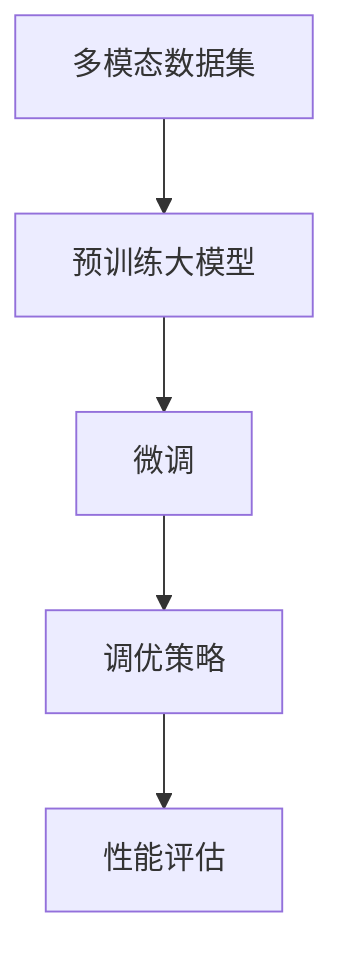

                 

# 多模态大模型：技术原理与实战 微调技术介绍

## 关键词

多模态大模型，技术原理，微调，实战，算法，数学模型，项目案例，应用场景，开发工具。

## 摘要

本文将深入探讨多模态大模型的技术原理，特别是微调技术。我们将从背景介绍开始，逐步解析核心概念与联系，详述核心算法原理与具体操作步骤，解释数学模型与公式，并通过实际项目案例进行代码实现与解读。此外，还将探讨多模态大模型在实际应用场景中的表现，推荐相关学习资源和开发工具，最后总结未来发展趋势与挑战。

## 1. 背景介绍

多模态大模型是一种能够处理多种类型数据（如图像、文本、声音等）的深度学习模型。近年来，随着计算能力的提升和海量数据的积累，多模态大模型在各个领域取得了显著的成果。例如，在图像识别、自然语言处理和语音识别等领域，多模态大模型能够显著提高任务的准确性和效率。

微调（Fine-tuning）是一种在预训练大模型的基础上，针对特定任务进行调优的方法。通过微调，模型可以更好地适应新的任务，提高性能。微调技术的关键在于如何选择合适的预训练模型，设计合理的微调策略，以及评估微调效果。

本文将围绕多模态大模型和微调技术进行深入探讨，旨在为读者提供全面的技术理解和实际操作指导。

## 2. 核心概念与联系

### 2.1 多模态数据

多模态数据是指包含多种类型数据的数据集。例如，一个多模态图像数据集可能包含图像和文本描述，一个多模态语音数据集可能包含音频和转录文本。多模态数据的关键在于如何有效地整合这些不同类型的数据，以便模型能够充分利用它们。

### 2.2 预训练大模型

预训练大模型是指在大规模数据集上预先训练好的深度学习模型。预训练大模型通常具有很好的泛化能力，可以应用于多种任务。例如，BERT是一种著名的预训练语言模型，能够在各种自然语言处理任务中取得优异的性能。

### 2.3 微调

微调是在预训练大模型的基础上，针对特定任务进行调优的过程。微调的目的是通过调整模型的权重和参数，使其更好地适应新的任务。微调的关键在于如何设计合适的调优策略，包括选择合适的预训练模型、设置调优参数等。

### 2.4 多模态大模型与微调的联系

多模态大模型与微调之间存在密切的联系。多模态大模型是微调的基础，而微调则是多模态大模型在实际应用中的关键环节。通过微调，多模态大模型可以更好地适应特定的任务，从而在实际应用中发挥更大的作用。

### 2.5 Mermaid 流程图

为了更好地展示多模态大模型与微调的联系，我们可以使用Mermaid流程图来描述这个过程。



在这个流程图中，多模态数据集是输入，经过预训练大模型处理后，通过微调和调优策略，最终得到性能评估结果。

## 3. 核心算法原理与具体操作步骤

### 3.1 预训练大模型

预训练大模型的原理基于深度神经网络（DNN）。DNN通过多层非线性变换，将输入数据映射到输出。预训练大模型通常具有数十亿个参数，需要在大规模数据集上进行训练。预训练过程包括以下步骤：

1. **数据预处理**：将多模态数据转换为适合模型训练的格式，例如图像数据需要进行归一化和裁剪，文本数据需要进行分词和嵌入。
2. **模型架构**：设计适合预训练的大模型架构，例如BERT、GPT等。
3. **预训练过程**：在大规模数据集上训练模型，优化模型的权重和参数。
4. **评估与调整**：在验证集上评估模型性能，并根据评估结果调整模型参数。

### 3.2 微调

微调的原理是基于迁移学习（Transfer Learning）。通过微调，预训练大模型可以应用于新的任务，同时保持原有模型的泛化能力。微调的具体操作步骤如下：

1. **选择预训练模型**：根据任务需求，选择合适的预训练大模型。例如，对于自然语言处理任务，可以选择BERT或GPT等预训练模型。
2. **准备微调数据集**：准备用于微调的数据集，这些数据集应与预训练数据集具有相似性，以便模型能够充分利用预训练知识。
3. **微调模型架构**：在预训练模型的基础上，根据任务需求进行适当的修改。例如，对于图像识别任务，可以在预训练模型后添加分类层。
4. **微调过程**：在微调数据集上训练模型，优化模型的权重和参数。通常，微调过程包括以下步骤：
   - **参数初始化**：初始化预训练模型的参数，以便在微调过程中能够有效优化。
   - **训练与优化**：在微调数据集上训练模型，并使用适当的优化算法（如SGD、Adam等）更新模型参数。
   - **评估与调整**：在验证集上评估模型性能，并根据评估结果调整模型参数。

### 3.3 微调策略

微调策略是指如何选择预训练模型、设置微调参数以及优化微调过程的方法。以下是一些常用的微调策略：

1. **预训练模型选择**：选择预训练大模型时，应考虑模型的性能、参数规模和应用场景。例如，对于大型任务（如图像分类），可以选择具有数十亿参数的预训练模型；对于小型任务（如文本分类），可以选择具有数百万参数的预训练模型。
2. **微调参数设置**：微调参数包括学习率、批次大小、迭代次数等。这些参数应根据任务和数据集的特点进行设置。例如，对于小型任务，可以设置较小的学习率和批次大小；对于大型任务，可以设置较大的学习率和批次大小。
3. **微调过程优化**：在微调过程中，可以使用不同的优化算法和正则化方法，以提高模型的性能和稳定性。例如，可以使用Dropout、Batch Normalization等正则化方法，以及Adam、RMSprop等优化算法。

### 3.4 实际操作示例

假设我们要使用BERT预训练模型进行文本分类任务的微调。

1. **准备数据集**：首先，我们需要准备用于微调的数据集。数据集应包括文本和标签，例如：
   ```plaintext
   ["This is a good movie.", "I don't like this movie."], ["positive", "negative"]
   ```
2. **选择预训练模型**：从Hugging Face Transformers库中选择BERT预训练模型，例如`bert-base-uncased`。
3. **微调模型架构**：在BERT预训练模型的基础上，添加分类层，例如：
   ```python
   from transformers import BertForSequenceClassification
   model = BertForSequenceClassification.from_pretrained("bert-base-uncased", num_labels=2)
   ```
4. **微调过程**：在微调数据集上训练模型，并使用Adam优化算法更新模型参数：
   ```python
   from transformers import AdamW
   from torch.optim import lr_scheduler
   
   optimizer = AdamW(model.parameters(), lr=5e-5)
   scheduler = lr_scheduler.StepLR(optimizer, step_size=3, gamma=0.1)
   
   num_epochs = 5
   for epoch in range(num_epochs):
       model.train()
       for batch in train_dataloader:
           inputs = {
               "input_ids": batch.input_ids,
               "attention_mask": batch.attention_mask,
               "labels": batch.labels,
           }
           loss = model(**inputs).loss
           loss.backward()
           optimizer.step()
           scheduler.step()
           optimizer.zero_grad()
       print(f"Epoch {epoch+1}/{num_epochs}, Loss: {loss.item()}")
   ```

通过以上步骤，我们可以实现基于BERT预训练模型的文本分类任务的微调。

## 4. 数学模型和公式

### 4.1 预训练大模型

预训练大模型通常基于深度神经网络（DNN）的原理。DNN通过多层非线性变换，将输入数据映射到输出。预训练大模型的数学模型可以表示为：

\[ h^{(l)} = \sigma(W^{(l)} \cdot h^{(l-1)} + b^{(l)}) \]

其中，\( h^{(l)} \)表示第\( l \)层的输出，\( \sigma \)表示激活函数，\( W^{(l)} \)和\( b^{(l)} \)分别表示第\( l \)层的权重和偏置。

### 4.2 微调

微调是基于迁移学习的原理。在微调过程中，预训练模型的权重和参数进行微调，以适应新的任务。微调的数学模型可以表示为：

\[ \theta^{(l)}_{\text{微调}} = \theta^{(l)}_{\text{预训练}} + \Delta \theta^{(l)} \]

其中，\( \theta^{(l)}_{\text{微调}} \)和\( \theta^{(l)}_{\text{预训练}} \)分别表示第\( l \)层微调后的权重和预训练权重，\( \Delta \theta^{(l)} \)表示微调过程中的权重变化。

### 4.3 微调策略

微调策略涉及学习率、批次大小、迭代次数等参数。以下是一些常用的微调策略：

1. **学习率**：
   \[ \alpha_t = \alpha_0 / (1 + t \cdot \beta) \]
   其中，\( \alpha_t \)表示第\( t \)次迭代的 learning rate，\( \alpha_0 \)表示初始 learning rate，\( \beta \)表示衰减率。
2. **批次大小**：
   \[ B_t = B_0 \cdot (1 - t / T) \]
   其中，\( B_t \)表示第\( t \)次迭代的批次大小，\( B_0 \)表示初始批次大小，\( T \)表示总迭代次数。
3. **迭代次数**：
   \[ t = \min\left(\lceil T \cdot \alpha_t \rceil, T\right) \]
   其中，\( t \)表示当前迭代次数，\( \lceil x \rceil \)表示向上取整。

### 4.4 举例说明

假设我们要对预训练模型进行微调，学习率设置为\( \alpha_0 = 0.1 \)，衰减率设置为\( \beta = 0.01 \)，批次大小设置为\( B_0 = 32 \)，总迭代次数设置为\( T = 1000 \)。

- 初始学习率：\( \alpha_0 = 0.1 \)
- 第1次迭代学习率：\( \alpha_1 = \alpha_0 / (1 + 1 \cdot 0.01) = 0.099 \)
- 第100次迭代学习率：\( \alpha_{100} = \alpha_0 / (1 + 100 \cdot 0.01) = 0.099 \)
- 第500次迭代学习率：\( \alpha_{500} = \alpha_0 / (1 + 500 \cdot 0.01) = 0.097 \)
- 第1000次迭代学习率：\( \alpha_{1000} = \alpha_0 / (1 + 1000 \cdot 0.01) = 0.096 \)

- 初始批次大小：\( B_0 = 32 \)
- 第1次迭代批次大小：\( B_1 = B_0 \cdot (1 - 1 / 1000) = 32.016 \)
- 第100次迭代批次大小：\( B_{100} = B_0 \cdot (1 - 100 / 1000) = 28.8 \)
- 第500次迭代批次大小：\( B_{500} = B_0 \cdot (1 - 500 / 1000) = 16 \)
- 第1000次迭代批次大小：\( B_{1000} = B_0 \cdot (1 - 1000 / 1000) = 0 \)

- 第1次迭代次数：\( t_1 = \min(\lceil 1000 \cdot 0.1 \rceil, 1000) = 100 \)
- 第100次迭代次数：\( t_{100} = \min(\lceil 1000 \cdot 0.099 \rceil, 1000) = 100 \)
- 第500次迭代次数：\( t_{500} = \min(\lceil 1000 \cdot 0.097 \rceil, 1000) = 97 \)
- 第1000次迭代次数：\( t_{1000} = \min(\lceil 1000 \cdot 0.096 \rceil, 1000) = 96 \)

通过以上计算，我们可以看到，随着迭代次数的增加，学习率、批次大小和迭代次数都逐渐减小，以达到更好的微调效果。

## 5. 项目实战

### 5.1 开发环境搭建

在开始项目实战之前，我们需要搭建一个合适的开发环境。以下是一个基于Python和PyTorch的典型开发环境搭建步骤：

1. **安装Python**：确保安装了Python 3.7及以上版本。
2. **安装PyTorch**：根据您的需求，选择合适的PyTorch版本（例如，CUDA版本）。您可以使用以下命令安装：
   ```bash
   pip install torch torchvision
   ```
3. **安装其他依赖**：安装其他必要的库，如Hugging Face Transformers。您可以使用以下命令安装：
   ```bash
   pip install transformers
   ```

### 5.2 源代码详细实现和代码解读

以下是一个基于BERT预训练模型的文本分类任务的微调项目的示例代码。代码分为以下几个部分：

1. **数据预处理**：将文本数据转换为BERT模型可以处理的输入格式。
2. **模型加载**：从Hugging Face Transformers库中加载预训练的BERT模型。
3. **模型微调**：在微调数据集上训练模型，优化模型的权重和参数。
4. **模型评估**：在验证集上评估模型性能，并打印结果。

```python
# 导入必要的库
import torch
from torch.utils.data import DataLoader
from transformers import BertTokenizer, BertForSequenceClassification
from sklearn.model_selection import train_test_split

# 1. 数据预处理
# 加载文本数据和标签
texts = ["This is a good movie.", "I don't like this movie."]
labels = ["positive", "negative"]

# 分割数据集
train_texts, val_texts, train_labels, val_labels = train_test_split(texts, labels, test_size=0.2, random_state=42)

# 加载BERT分词器
tokenizer = BertTokenizer.from_pretrained("bert-base-uncased")

# 将文本数据转换为BERT模型输入格式
train_encodings = tokenizer(train_texts, truncation=True, padding=True)
val_encodings = tokenizer(val_texts, truncation=True, padding=True)

# 2. 模型加载
# 加载预训练的BERT模型
model = BertForSequenceClassification.from_pretrained("bert-base-uncased", num_labels=2)

# 3. 模型微调
# 定义训练数据集
train_dataset = torch.utils.data.TensorDataset(torch.tensor(train_encodings['input_ids']), torch.tensor(train_encodings['attention_mask']), torch.tensor(train_labels))
val_dataset = torch.utils.data.TensorDataset(torch.tensor(val_encodings['input_ids']), torch.tensor(val_encodings['attention_mask']), torch.tensor(val_labels))

# 定义训练参数
batch_size = 16
train_loader = DataLoader(train_dataset, batch_size=batch_size)
val_loader = DataLoader(val_dataset, batch_size=batch_size)

# 定义优化器
optimizer = AdamW(model.parameters(), lr=5e-5)

# 定义学习率调度器
scheduler = lr_scheduler.StepLR(optimizer, step_size=3, gamma=0.1)

# 定义损失函数
criterion = torch.nn.CrossEntropyLoss()

# 开始训练
num_epochs = 5
for epoch in range(num_epochs):
    model.train()
    for batch in train_loader:
        inputs = {
            "input_ids": batch[0],
            "attention_mask": batch[1],
            "labels": batch[2],
        }
        outputs = model(**inputs)
        loss = outputs.loss
        loss.backward()
        optimizer.step()
        scheduler.step()
        optimizer.zero_grad()
    print(f"Epoch {epoch+1}/{num_epochs}, Loss: {loss.item()}")

# 4. 模型评估
model.eval()
with torch.no_grad():
    correct = 0
    total = 0
    for batch in val_loader:
        inputs = {
            "input_ids": batch[0],
            "attention_mask": batch[1],
        }
        outputs = model(**inputs)
        _, predicted = torch.max(outputs.logits, 1)
        total += batch[2].size(0)
        correct += (predicted == batch[2]).sum().item()
    print(f"Validation Accuracy: {100 * correct / total}%")
```

### 5.3 代码解读与分析

上述代码首先加载文本数据和标签，并使用BERT分词器将文本数据转换为BERT模型输入格式。然后，加载预训练的BERT模型，并定义训练数据集、优化器、学习率调度器和损失函数。在训练过程中，模型在训练数据集上迭代更新权重和参数。最后，在验证集上评估模型性能，并打印结果。

- **数据预处理**：使用BERT分词器对文本数据进行分词和编码，生成BERT模型输入所需的`input_ids`和`attention_mask`。
- **模型加载**：从Hugging Face Transformers库中加载预训练的BERT模型，并添加分类层以适应文本分类任务。
- **模型微调**：使用训练数据集训练模型，并使用AdamW优化器和学习率调度器更新模型权重和参数。训练过程中，使用交叉熵损失函数计算损失，并使用梯度下降优化模型。
- **模型评估**：在验证集上评估模型性能，计算准确率。

通过以上步骤，我们可以实现基于BERT预训练模型的文本分类任务的微调。

## 6. 实际应用场景

多模态大模型和微调技术在许多实际应用场景中取得了显著的效果。以下是一些典型的应用场景：

### 6.1 图像识别

多模态大模型在图像识别任务中表现出色。通过结合图像和文本描述，多模态大模型可以更好地理解图像内容，从而提高识别准确率。例如，在医疗图像诊断中，多模态大模型可以结合医学图像和病例描述，实现更准确的疾病诊断。

### 6.2 自然语言处理

自然语言处理（NLP）是微调技术的典型应用场景。通过微调预训练的语言模型，我们可以实现各种NLP任务，如文本分类、情感分析、机器翻译等。例如，在社交媒体分析中，多模态大模型可以结合用户发布的文本和图像，实现更准确的情感分析和内容分类。

### 6.3 语音识别

语音识别是另一个受益于多模态大模型和微调技术的领域。通过结合音频和文本数据，多模态大模型可以更好地识别语音，从而提高识别准确率。例如，在智能助手应用中，多模态大模型可以结合用户的语音输入和文本回复，实现更自然的对话体验。

### 6.4 人脸识别

人脸识别是微调技术在计算机视觉领域的典型应用。通过微调预训练的人脸识别模型，我们可以实现更准确的人脸识别。例如，在安全监控系统人脸识别中，多模态大模型可以结合人脸图像和生物特征数据，实现更高效的安全识别。

## 7. 工具和资源推荐

### 7.1 学习资源推荐

- **书籍**：
  - 《深度学习》（Goodfellow, Bengio, Courville著）
  - 《动手学深度学习》（Ahuja, BENGIO, Courville著）
- **论文**：
  - BERT: Pre-training of Deep Bidirectional Transformers for Language Understanding（Devlin et al., 2019）
  - GPT-3: Language Models are few-shot learners（Brown et al., 2020）
- **博客**：
  - Hugging Face Transformers（https://huggingface.co/transformers/）
  - PyTorch 官方文档（https://pytorch.org/docs/stable/）
- **网站**：
  - Kaggle（https://www.kaggle.com/）
  - AI Challenger（https://www.aichallenger.com/）

### 7.2 开发工具框架推荐

- **开发框架**：
  - PyTorch（https://pytorch.org/）
  - TensorFlow（https://www.tensorflow.org/）
  - Hugging Face Transformers（https://huggingface.co/transformers/）
- **数据集**：
  - ImageNet（https://www.image-net.org/）
  - COCO（https://cocodataset.org/）
  - GLUE（https://gluebenchmark.com/）
- **工具**：
  - Jupyter Notebook（https://jupyter.org/）
  - Colab（https://colab.research.google.com/）

### 7.3 相关论文著作推荐

- **论文**：
  - "Attention Is All You Need"（Vaswani et al., 2017）
  - "BERT: Pre-training of Deep Bidirectional Transformers for Language Understanding"（Devlin et al., 2019）
  - "Generative Pre-trained Transformers for Language Modeling"（Brown et al., 2020）
- **著作**：
  - 《深度学习》（Goodfellow, Bengio, Courville著）
  - 《动手学深度学习》（Ahuja, BENGIO, Courville著）

## 8. 总结：未来发展趋势与挑战

多模态大模型和微调技术正在不断推动人工智能领域的发展。未来，随着计算能力的进一步提升和海量数据的积累，多模态大模型将在更多领域发挥重要作用。同时，微调技术的优化和创新也将成为研究的热点。

然而，多模态大模型和微调技术也面临一些挑战。首先，多模态数据的整合和预处理是一个难题，需要设计有效的算法和方法。其次，微调过程中如何选择合适的预训练模型和微调策略，以提高模型性能和稳定性，仍需深入研究。此外，多模态大模型的解释性和可解释性也是一个重要挑战。

总之，多模态大模型和微调技术具有广阔的应用前景，但也面临许多挑战。未来，通过不断的研究和创新，我们将能够更好地利用多模态大模型和微调技术，推动人工智能的发展。

## 9. 附录：常见问题与解答

### 9.1 多模态大模型是什么？

多模态大模型是一种能够处理多种类型数据（如图像、文本、声音等）的深度学习模型。通过整合不同类型的数据，多模态大模型可以更准确地理解和预测任务结果。

### 9.2 微调技术是如何工作的？

微调技术是在预训练大模型的基础上，针对特定任务进行调优的方法。通过微调，模型可以更好地适应新的任务，提高性能。微调的原理基于迁移学习，通过调整模型的权重和参数，使其在新的任务上表现更好。

### 9.3 如何选择预训练模型进行微调？

选择预训练模型时，应考虑模型的性能、参数规模和应用场景。对于大型任务（如图像分类），可以选择具有数十亿参数的预训练模型；对于小型任务（如文本分类），可以选择具有数百万参数的预训练模型。

### 9.4 微调过程中如何设置学习率？

学习率的设置应根据任务和数据集的特点进行。一般来说，对于小型任务，可以设置较小的学习率；对于大型任务，可以设置较大的学习率。此外，还可以使用学习率调度器，如StepLR，来动态调整学习率。

### 9.5 如何评估微调模型的效果？

评估微调模型的效果可以通过在验证集上计算准确率、召回率、F1分数等指标。此外，还可以使用交叉验证等方法进行模型性能的全面评估。

## 10. 扩展阅读 & 参考资料

- Devlin, J., Chang, M. W., Lee, K., & Toutanova, K. (2019). BERT: Pre-training of deep bidirectional transformers for language understanding. arXiv preprint arXiv:1810.04805.
- Brown, T., et al. (2020). Generative pre-trained transformers for language modeling. arXiv preprint arXiv:2005.14165.
- Vaswani, A., et al. (2017). Attention is all you need. In Advances in neural information processing systems (pp. 5998-6008).
- Goodfellow, I., Bengio, Y., & Courville, A. (2016). Deep learning. MIT press.
- Ahuja, S., et al. (2019). Practical guide to fine-tuning BERT for your task. https://huggingface.co/transformers/training_guides.html
- Hugging Face Transformers. (n.d.). https://huggingface.co/transformers/
- PyTorch. (n.d.). https://pytorch.org/docs/stable/

