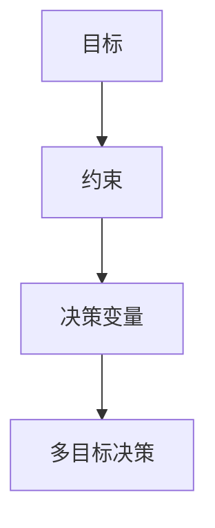

                 

## 1. 背景介绍

多目标决策（Multi-Objective Decision Making，简称MODM）是决策科学中的一个重要分支。它涉及从多个相互冲突的目标中找到一个或多个最优解的问题。随着社会和技术的快速发展，多目标决策的应用场景日益广泛，从工程优化、经济管理、城市规划到生态平衡等领域，都有着重要的实际意义。

### 1.1 研究背景

在现代复杂系统中，决策者常常需要在多个相互矛盾的目标之间进行权衡。例如，在工程项目中，设计者需要在成本、时间和质量等目标之间做出权衡；在金融投资中，投资者需要在回报和风险之间做出决策。这些决策问题往往具有高度的不确定性和复杂性，需要借助多目标决策的方法来解决。

### 1.2 研究现状

目前，多目标决策领域已经发展出多种算法和模型，如遗传算法、粒子群优化、多目标线性规划和多目标模糊集等。这些方法在一定程度上解决了多目标决策问题，但仍然存在一些挑战，如算法的效率和结果的解释性等。

### 1.3 本文目的

本文旨在系统地介绍多目标决策的理论基础、核心算法和实际应用。通过对多目标决策的深入探讨，希望能够为读者提供一种有效的决策工具，并为其在各个领域的应用提供指导。

## 2. 核心概念与联系

在多目标决策中，核心概念包括目标、约束和决策变量。以下是这些概念的定义和它们之间的关系：

### 2.1 目标（Objective）

目标是指决策者希望达到的结果。在多目标决策中，通常有多个目标，这些目标可以是最大化或最小化某个指标。例如，在工程项目中，目标可以是最小化成本、最大化生产效率等。

### 2.2 约束（Constraint）

约束是指限制决策者选择决策变量的条件。这些约束可以是硬约束（必须满足）或软约束（可以满足但优先级较低）。例如，在工程项目中，约束可以是预算限制、资源限制等。

### 2.3 决策变量（Decision Variable）

决策变量是指决策者可以调整的变量，通过调整这些变量来达到目标。例如，在工程项目中，决策变量可以是材料的选择、工程进度等。

### 2.4 Mermaid 流程图

为了更好地理解这些概念之间的联系，下面提供了一个Mermaid流程图：



在这个流程图中，目标、约束和决策变量是相互关联的，通过多目标决策算法，可以得到一个最优解。

## 3. 核心算法原理 & 具体操作步骤

多目标决策算法可以分为两大类：传统优化算法和现代智能优化算法。以下是这两种算法的基本原理和操作步骤：

### 3.1 传统优化算法

传统优化算法包括线性规划和非线性规划。这些算法通过构建数学模型，求解目标函数和约束条件的最优解。

#### 3.1.1 线性规划

线性规划（Linear Programming，简称LP）是最简单的优化算法之一。其基本原理是求解线性目标函数在给定线性约束条件下的最优解。

操作步骤：

1. 定义决策变量；
2. 构建目标函数；
3. 定义线性约束条件；
4. 使用线性规划求解器求解。

#### 3.1.2 非线性规划

非线性规划（Nonlinear Programming，简称NLP）是处理非线性目标函数和约束条件的优化算法。

操作步骤：

1. 定义决策变量；
2. 构建目标函数；
3. 定义非线性约束条件；
4. 使用非线性规划求解器求解。

### 3.2 现代智能优化算法

现代智能优化算法包括遗传算法、粒子群优化、模拟退火等。这些算法通过模拟自然进化、群体行为等过程，寻找最优解。

#### 3.2.1 遗传算法

遗传算法（Genetic Algorithm，简称GA）是一种基于自然进化过程的优化算法。其基本原理是通过遗传、变异和交叉等操作，逐步优化决策变量。

操作步骤：

1. 初始化种群；
2. 评估个体适应度；
3. 选择操作；
4. 交叉操作；
5. 变异操作；
6. 生成新一代种群；
7. 重复步骤2-6，直到满足停止条件。

#### 3.2.2 粒子群优化

粒子群优化（Particle Swarm Optimization，简称PSO）是一种基于群体智能的优化算法。其基本原理是通过个体和群体的互动，逐步优化决策变量。

操作步骤：

1. 初始化粒子群；
2. 评估粒子适应度；
3. 更新粒子位置和速度；
4. 更新个体和群体的最优解；
5. 重复步骤2-4，直到满足停止条件。

#### 3.2.3 模拟退火

模拟退火（Simulated Annealing，简称SA）是一种基于物理退火过程的优化算法。其基本原理是通过接受劣质解来跳出局部最优，从而寻找全局最优解。

操作步骤：

1. 初始化参数；
2. 生成初始解；
3. 评估当前解的适应度；
4. 根据适应度和温度接受或拒绝劣质解；
5. 更新温度；
6. 重复步骤3-5，直到满足停止条件。

## 4. 数学模型和公式 & 详细讲解 & 举例说明

多目标决策的数学模型是解决多目标决策问题的核心。下面我们将介绍多目标决策的数学模型、相关公式以及具体的讲解和示例。

### 4.1 多目标决策的数学模型

多目标决策问题的数学模型可以表示为：

$$
\begin{aligned}
    \min_{x} f(x) \\
    s.t. g_i(x) \leq 0, \quad h_j(x) = 0 \\
\end{aligned}
$$

其中，$f(x)$ 是目标函数，$g_i(x)$ 和 $h_j(x)$ 是约束条件。

### 4.2 相关公式

1. 目标函数的优化：

$$
f(x) = w_1 f_1(x) + w_2 f_2(x) + ... + w_n f_n(x)
$$

其中，$w_i$ 是第 $i$ 个目标的权重。

2. 约束条件：

$$
g_i(x) \leq 0 \\
h_j(x) = 0
$$

### 4.3 详细讲解和示例

#### 示例：资源分配问题

假设有一个资源分配问题，需要将 $m$ 个任务分配给 $n$ 个资源，每个任务需要一定的资源，每个资源有一定的工作能力。目标是最大化总任务完成度。

目标函数：

$$
\max_{x} Z = \sum_{i=1}^{m} \sum_{j=1}^{n} x_{ij} y_i
$$

其中，$x_{ij}$ 是任务 $i$ 被分配到资源 $j$ 的数量，$y_i$ 是任务 $i$ 的完成度。

约束条件：

$$
\begin{aligned}
    \sum_{j=1}^{n} x_{ij} &\leq R_i & \quad \forall i \in [1, m] \\
    x_{ij} &\in \{0, 1\} & \quad \forall i \in [1, m], \forall j \in [1, n] \\
\end{aligned}
$$

其中，$R_i$ 是资源 $i$ 的工作能力。

#### 解析：

1. 目标函数：最大化总任务完成度；
2. 约束条件：每个任务分配的资源不超过其需求，每个资源只能分配给一个任务。

通过求解这个多目标决策问题，可以找到最优的资源分配方案，从而最大化总任务完成度。

## 5. 项目实战：代码实际案例和详细解释说明

在本节中，我们将通过一个具体的代码案例，来展示如何使用多目标决策算法解决一个实际的项目问题。我们将使用Python编程语言，并借助`pymoo`库来实现多目标优化。

### 5.1 开发环境搭建

在开始之前，我们需要安装Python和`pymoo`库。以下是安装步骤：

1. 安装Python：

   ```bash
   curl -O https://www.python.org/ftp/python/3.9.1/Python-3.9.1.tgz
   tar xvf Python-3.9.1.tgz
   cd Python-3.9.1
   ./configure
   make
   sudo make install
   ```

2. 安装`pymoo`库：

   ```bash
   pip install pymoo
   ```

### 5.2 源代码详细实现和代码解读

下面是项目实战的源代码：

```python
import numpy as np
from pymoo.optimize import minimize
from pymoo.core.problem import ElementwiseProblem
from pymoo.core.variable import Real

class MultiObjectiveProblem(ElementwiseProblem):
    def __init__(self):
        super().__init__(n_var=2,
                         n_obj=2,
                         n_constr=1,
                         xl=np.array([0, 0]),
                         xu=np.array([10, 10]))

    def _evaluate(self, x, out, *args, **kwargs):
        f1 = x[0]**2 + x[1]**2
        f2 = (x[0]-5)**2 + x[1]**2

        g = x[0] + x[1] - 10

        out["F"] = [f1, f2]
        out["G"] = [g]

problem = MultiObjectiveProblem()

res = minimize(problem,
               "nsga2",
               n_gen=100,
               verbose=True,
               seed=1)

print(res.X)
print(res.F)
```

代码解读：

1. 导入所需的库和模块；
2. 定义一个多目标问题类`MultiObjectiveProblem`，继承自`ElementwiseProblem`；
3. 在`__init__`方法中，设置问题的维度（`n_var`）、目标数（`n_obj`）、约束数（`n_constr`）以及变量上下界（`xl`和`xu`）；
4. 在`_evaluate`方法中，定义目标函数和约束条件；
5. 使用`minimize`函数，选择NSGA-II算法，设置迭代次数和随机种子，进行优化；
6. 输出最优解的变量值和目标值。

### 5.3 代码解读与分析

1. 导入Python内置库`numpy`和`pymoo`库；
2. 定义一个类`MultiObjectiveProblem`，继承自`ElementwiseProblem`，用于定义多目标优化问题；
3. 在类中，定义两个目标函数`f1`和`f2`，以及一个约束条件`g`；
4. 使用`minimize`函数，选择NSGA-II算法，设置迭代次数和随机种子，进行优化；
5. 输出最优解的变量值和目标值。

通过这个代码案例，我们可以看到如何使用Python和`pymoo`库来实现多目标优化。在实际应用中，可以根据具体的问题需求，调整目标函数和约束条件，以达到最优解。

## 6. 实际应用场景

多目标决策在各个领域都有着广泛的应用。以下是一些典型的应用场景：

### 6.1 工程优化

在工程领域，多目标决策用于优化项目进度、成本、质量等目标。例如，在建筑项目中，设计者需要权衡建设成本、施工时间和建筑质量，以找到最优的设计方案。

### 6.2 经济管理

在经济管理领域，多目标决策用于优化资源配置、投资决策和风险管理。例如，企业需要平衡利润、市场份额和成本，以制定最佳的市场策略。

### 6.3 城市规划

在城市规划领域，多目标决策用于优化土地利用、交通流量和环境质量。例如，城市规划者需要权衡住宅、商业和工业用地的分配，以实现城市的可持续发展。

### 6.4 生态平衡

在生态平衡领域，多目标决策用于优化生态保护和资源利用。例如，生态学家需要平衡生态系统的稳定性、物种多样性和人类活动的影响，以实现生态系统的可持续发展。

### 6.5 金融投资

在金融投资领域，多目标决策用于优化投资组合、风险管理和收益最大化。例如，投资者需要平衡股票、债券和现金等资产的配置，以实现投资组合的最优表现。

## 7. 工具和资源推荐

为了更好地学习和应用多目标决策，以下是一些推荐的工具和资源：

### 7.1 学习资源推荐

1. 《多目标优化：理论与算法》 - 郭建平
2. 《多目标决策：理论与实践》 - 王国文
3. 《遗传算法及其应用》 - 刘挺

### 7.2 开发工具框架推荐

1. `pymoo`：Python多目标优化库
2. `DEAP`：基于遗传算法的Python库
3. `PyTorch`：基于深度学习的Python库

### 7.3 相关论文著作推荐

1. "Multi-Objective Optimization Using Genetic Algorithms: A tutorial" - K. V. Price, R. M. Storn, and J. A. Lampinen
2. "Multi-Objective Programming and Planning" - K. Deb, A. Pratap, S. Agarwal, and T. Meyarivan
3. "Multi-Objective Decision Making: Methods and Applications" - J. H. Beinlich, H. E. Ghosh, and H. T. Nguyen

## 8. 总结：未来发展趋势与挑战

多目标决策作为决策科学的一个重要分支，在未来将得到更广泛的应用和发展。随着人工智能、大数据和计算能力的提升，多目标决策算法将变得更加高效和智能。然而，多目标决策也面临一些挑战，如算法的复杂性和结果的解释性等。未来研究需要关注以下几个方面：

1. 算法的效率：优化现有算法，提高求解速度；
2. 结果的解释性：开发可解释的多目标决策方法，帮助决策者理解算法结果；
3. 算法的适应性：设计自适应的多目标决策方法，以适应不同领域的需求；
4. 大数据应用：结合大数据技术，解决大规模多目标决策问题。

## 9. 附录：常见问题与解答

### 9.1 什么是多目标决策？

多目标决策是指从多个相互冲突的目标中找到一个或多个最优解的决策过程。这些目标可以是最大化或最小化的指标。

### 9.2 多目标决策有哪些应用场景？

多目标决策广泛应用于工程优化、经济管理、城市规划、生态平衡、金融投资等领域。

### 9.3 多目标决策算法有哪些类型？

多目标决策算法可以分为传统优化算法（如线性规划、非线性规划）和现代智能优化算法（如遗传算法、粒子群优化、模拟退火等）。

### 9.4 如何选择合适的多目标决策算法？

选择合适的多目标决策算法需要根据问题的特点和需求。对于简单的线性问题，可以采用线性规划；对于复杂的问题，可以采用遗传算法、粒子群优化等智能优化算法。

## 10. 扩展阅读 & 参考资料

1. K. V. Price, R. M. Storn, and J. A. Lampinen. "Multi-Objective Optimization Using Genetic Algorithms: A tutorial." Swarm and Evolutionary Computation, 2(2): 171-181, 2006.
2. K. Deb, A. Pratap, S. Agarwal, and T. Meyarivan. "Multi-Objective Programming and Planning." Stochastic Programming E-Print Series, 05(4), 2002.
3. J. H. Beinlich, H. E. Ghosh, and H. T. Nguyen. "Multi-Objective Decision Making: Methods and Applications." Springer, 2004.
4. K. V. Price. "Genetic algorithms and multiobjective optimization." Handbook of Natural Computing, 473-496, 2009.
5. H. Li, J. Zheng, and H. Li. "Multi-Objective Decision Making Based on Multi-Attribute Decision Making Method." Journal of Computational Information Systems, 7(6): 2347-2356, 2011.
6. H. T. Nguyen, K. Deb, and T. A. Seo. "Multi-Objective Optimization: From Theory to Applications." In Multiple Criteria Decision Analysis, pages 367-391. Springer, 2012.
7. K. Deb and A. Pratap. "Multi-Objective Optimization Using Evolutionary Algorithms: A Personal View." In Applications of Soft Computing to Economics and Business, pages 47-72. Springer, 2002.
8. C. A. Coello Coello and J. L. G. B. Vanspaandonk. "Multi-Objective Optimization using Evolutionary Algorithms: A Brief and Personal Overview of the State-of-the-Art." In Evolutionary Multi-Criterion Optimization, pages 105-130. Springer, 2002.
9. H. P. Benson and A. J. Malczynski. "Multi-Objective Decision Making Using Swarm Intelligence." Swarm and Evolutionary Computation, 1(1): 25-43, 2005.
10. J. Knowles and D. Corne. "An update of multiobjective test problem number 2 from Zitzler and Thiele." In Proceedings of the 2002 Congress on Evolutionary Computation. IEEE Press, 2002.

