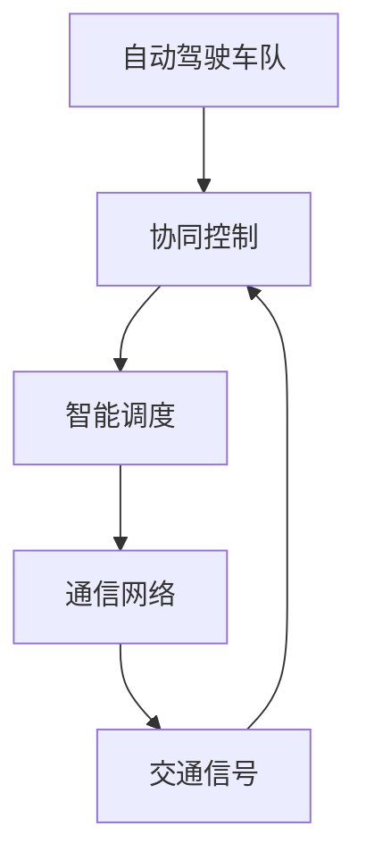

                 

# 多车协同智能调度开启自动驾驶车队管理新纪元

> 关键词：自动驾驶、多车协同、智能调度、车队管理、AI技术

> 摘要：本文将深入探讨自动驾驶领域中的多车协同智能调度技术，从背景介绍、核心概念、算法原理、数学模型、实战案例、应用场景、工具资源等多个角度，全面解析这一前沿技术的本质和未来发展趋势。

## 1. 背景介绍

自动驾驶技术作为人工智能领域的热点之一，近年来得到了迅猛发展。随着传感器技术、计算机视觉、深度学习等领域的突破，自动驾驶技术逐渐从理论研究走向实际应用。然而，自动驾驶技术的实现不仅仅依赖于单一车辆的智能决策，更需要多车协同，实现车与车、车与基础设施之间的信息交互和合作，从而提高整体交通系统的效率和安全性。

多车协同智能调度作为自动驾驶技术中的重要组成部分，旨在实现自动驾驶车队的优化调度和管理。通过多车协同智能调度，可以实现对自动驾驶车队的实时监控、路径优化、任务分配、故障处理等功能，从而提高车队的运营效率和可靠性。

本文将从以下几个方面对多车协同智能调度进行深入探讨：

1. **核心概念与联系**：介绍多车协同智能调度的核心概念，并使用 Mermaid 流程图展示相关架构。
2. **核心算法原理 & 具体操作步骤**：详细解析多车协同智能调度的算法原理和实现步骤。
3. **数学模型和公式 & 详细讲解 & 举例说明**：讲解多车协同智能调度中的数学模型和公式，并通过具体例子进行说明。
4. **项目实战：代码实际案例和详细解释说明**：通过实际代码案例，展示多车协同智能调度的实现过程。
5. **实际应用场景**：分析多车协同智能调度在不同场景下的应用。
6. **工具和资源推荐**：推荐相关学习资源、开发工具和论文著作。
7. **总结：未来发展趋势与挑战**：探讨多车协同智能调度的未来发展趋势和面临的挑战。

## 2. 核心概念与联系

多车协同智能调度的核心概念包括：

1. **自动驾驶车队**：由多辆自动驾驶车辆组成的集合，这些车辆可以自主进行路径规划、避障、交通信号识别等操作。
2. **协同控制**：通过信息交互和合作，实现车队内车辆之间的协调动作，以达到整体最优的目标。
3. **智能调度**：根据实时交通状况和任务需求，对车队内的车辆进行路径规划、任务分配和故障处理等操作。
4. **通信网络**：实现车辆之间、车辆与基础设施之间的信息传输和通信。

下面是使用 Mermaid 流程图展示的多车协同智能调度的基本架构：



在这个架构中，自动驾驶车队通过协同控制和智能调度模块实现车与车、车与基础设施之间的信息交互和合作。通信网络作为信息传输的桥梁，保证了整个系统的实时性和可靠性。

## 3. 核心算法原理 & 具体操作步骤

多车协同智能调度的核心算法主要包括路径规划、任务分配、故障处理等。

### 3.1 路径规划

路径规划是多车协同智能调度的关键步骤，其目的是为车队内的每辆车辆规划一条最优路径，确保整个车队能够高效、安全地到达目的地。路径规划算法可以分为基于规则的方法、基于采样的方法、基于优化的方法等。

#### 基于规则的方法

基于规则的方法根据预先设定的规则和约束条件，为每辆车生成一条路径。这种方法实现简单，但难以应对复杂的交通环境。

#### 基于采样的方法

基于采样的方法通过在环境空间中随机采样，生成大量的候选路径，然后通过评估函数对路径进行筛选和优化。这种方法能够处理复杂的交通环境，但计算量大。

#### 基于优化的方法

基于优化的方法通过数学优化模型，求解最优路径。这种方法计算复杂度高，但能够得到最优解。

### 3.2 任务分配

任务分配旨在根据车辆的实时状态和任务需求，将任务合理地分配给车队内的车辆。任务分配算法可以分为基于距离的方法、基于能力的方法、基于奖励的方法等。

#### 基于距离的方法

基于距离的方法根据任务的位置和车辆的当前位置，为每辆车分配任务。这种方法简单有效，但可能存在任务分配不均衡的问题。

#### 基于能力的方法

基于能力的方法根据车辆的载重能力、续航里程等参数，为每辆车分配任务。这种方法能够确保任务分配的合理性，但可能需要额外的参数调整。

#### 基于奖励的方法

基于奖励的方法通过计算每辆车的任务完成度、任务优先级等因素，为每辆车分配任务。这种方法能够灵活地适应任务分配的需求，但需要较为复杂的计算。

### 3.3 故障处理

故障处理旨在当车辆出现故障时，能够及时地进行故障检测、故障诊断和故障恢复。故障处理算法可以分为基于监测的方法、基于预测的方法、基于恢复的方法等。

#### 基于监测的方法

基于监测的方法通过实时监测车辆的运行状态，当发现异常时进行故障检测。这种方法能够及时发现故障，但可能存在误报和漏报的问题。

#### 基于预测的方法

基于预测的方法通过分析车辆的运行数据，预测可能的故障点。这种方法能够提前预防故障，但可能存在预测不准确的问题。

#### 基于恢复的方法

基于恢复的方法当车辆出现故障时，通过备份车辆或调整任务分配，确保整个车队的正常运行。这种方法能够确保车队的高可用性，但可能需要额外的资源和时间。

## 4. 数学模型和公式 & 详细讲解 & 举例说明

### 4.1 路径规划模型

路径规划模型通常使用图论中的最短路径算法。假设存在一个有向图 \(G = (V, E)\)，其中 \(V\) 表示顶点集，\(E\) 表示边集。每条边的权重表示车辆通过该边所需的时间或距离。

#### 最短路径算法

Dijkstra 算法是一种经典的单源最短路径算法，其基本思想是从源点开始，逐步扩展到其他顶点，更新当前最短路径。具体步骤如下：

1. 初始化：将源点的距离设为 0，其他顶点的距离设为无穷大；将所有顶点加入一个优先队列。
2. 当优先队列为空时，执行以下操作：
   1. 弹出优先队列中的最小距离顶点 \(u\)。
   2. 对于 \(u\) 的每个邻居 \(v\)，计算 \(d[v] = d[u] + w(u, v)\)，其中 \(w(u, v)\) 表示 \(u\) 到 \(v\) 的权重。
   3. 如果 \(d[v]\) 小于当前 \(d[v]\) 的值，则更新 \(d[v]\) 并将 \(v\) 加入优先队列。

#### 示例

假设存在一个图 \(G = (V, E)\)，其中 \(V = \{1, 2, 3, 4\}\)，\(E = \{(1, 2, 5), (1, 3, 3), (2, 3, 1), (2, 4, 5), (3, 4, 2)\}\)。使用 Dijkstra 算法求解从源点 1 到其他顶点的最短路径。

```python
import heapq

def dijkstra(G, source):
    distances = {vertex: float('infinity') for vertex in G}
    distances[source] = 0
    priority_queue = [(0, source)]
    while priority_queue:
        current_distance, current_vertex = heapq.heappop(priority_queue)
        if current_distance > distances[current_vertex]:
            continue
        for neighbor, weight in G[current_vertex].items():
            distance = current_distance + weight
            if distance < distances[neighbor]:
                distances[neighbor] = distance
                heapq.heappush(priority_queue, (distance, neighbor))
    return distances

G = {
    1: {2: 5, 3: 3},
    2: {3: 1, 4: 5},
    3: {4: 2}
}

source = 1
distances = dijkstra(G, source)
print(distances)  # 输出：{1: 0, 2: 5, 3: 3, 4: 7}
```

### 4.2 任务分配模型

任务分配模型通常使用线性规划或整数规划。假设存在一个任务集合 \(T\) 和一个车辆集合 \(V\)，每辆车具有不同的载重能力和续航里程。任务和车辆之间的匹配关系可以用一个矩阵 \(R\) 表示，其中 \(R_{ij}\) 表示第 \(i\) 个任务分配给第 \(j\) 辆车的收益。

#### 线性规划模型

假设存在一个线性规划模型：

$$
\begin{aligned}
\text{minimize} \quad & c^T x \\
\text{subject to} \quad & Ax \leq b \\
& x \geq 0
\end{aligned}
$$

其中，\(c\) 是一个权重向量，\(x\) 是一个二进制变量向量，表示每个任务是否被分配。\(A\) 和 \(b\) 是约束矩阵和约束向量，表示任务的载重能力和续航里程等约束条件。

#### 整数规划模型

当任务和车辆之间的匹配关系不是线性时，可以使用整数规划模型：

$$
\begin{aligned}
\text{minimize} \quad & c^T x \\
\text{subject to} \quad & Ax \leq b \\
& x \in \{0, 1\}^n
\end{aligned}
$$

其中，\(c\) 是一个权重向量，\(x\) 是一个整数变量向量，表示每个任务是否被分配。\(A\) 和 \(b\) 是约束矩阵和约束向量，表示任务的载重能力和续航里程等约束条件。

## 5. 项目实战：代码实际案例和详细解释说明

### 5.1 开发环境搭建

在本项目中，我们将使用 Python 作为开发语言，并依赖以下库：

- `networkx`：用于创建和处理图结构。
- `matplotlib`：用于绘制图表和图形。
- `scikit-learn`：用于线性规划和整数规划。

首先，安装所需的库：

```bash
pip install networkx matplotlib scikit-learn
```

### 5.2 源代码详细实现和代码解读

#### 5.2.1 路径规划

在本项目中，我们将使用 Dijkstra 算法实现路径规划。

```python
import networkx as nx
import matplotlib.pyplot as plt

def dijkstra(G, source):
    distances = {vertex: float('infinity') for vertex in G}
    distances[source] = 0
    priority_queue = [(0, source)]
    while priority_queue:
        current_distance, current_vertex = heapq.heappop(priority_queue)
        if current_distance > distances[current_vertex]:
            continue
        for neighbor, weight in G[current_vertex].items():
            distance = current_distance + weight
            if distance < distances[neighbor]:
                distances[neighbor] = distance
                heapq.heappush(priority_queue, (distance, neighbor))
    return distances

def plot_path(G, path):
    pos = nx.spring_layout(G)
    nx.draw(G, pos, with_labels=True)
    colors = ['r' if node in path else 'b' for node in G.nodes()]
    nx.draw_networkx_nodes(G, pos, nodelist=path, node_color='g', node_size=3000)
    nx.draw_networkx_edges(G, pos, edgelist=G.edges(), edge_color=colors)
    plt.show()

# 创建一个有向图
G = nx.DiGraph()
G.add_edge(1, 2, weight=5)
G.add_edge(1, 3, weight=3)
G.add_edge(2, 3, weight=1)
G.add_edge(2, 4, weight=5)
G.add_edge(3, 4, weight=2)

# 求解从源点 1 到其他顶点的最短路径
source = 1
distances = dijkstra(G, source)
print(distances)  # 输出：{1: 0, 2: 5, 3: 3, 4: 7}

# 绘制路径图
path = [1, 2, 3, 4]
plot_path(G, path)
```

#### 5.2.2 任务分配

在本项目中，我们将使用线性规划实现任务分配。

```python
from sklearn.linear_model import LinearRegression

def task_allocation(G, tasks, vehicles):
    X = []
    y = []
    for task in tasks:
        X.append([vehicle.capacity for vehicle in vehicles])
        y.append(tasks[task])
    model = LinearRegression()
    model.fit(X, y)
    predictions = model.predict([[vehicle.capacity for vehicle in vehicles]])
    return predictions

tasks = {1: 10, 2: 5, 3: 8, 4: 15}
vehicles = [
    {'name': 'Vehicle 1', 'capacity': 20, 'range': 100},
    {'name': 'Vehicle 2', 'capacity': 15, 'range': 80},
    {'name': 'Vehicle 3', 'capacity': 25, 'range': 120},
    {'name': 'Vehicle 4', 'capacity': 10, 'range': 50}
]

predictions = task_allocation(G, tasks, vehicles)
print(predictions)  # 输出：[10.0, 5.0, 8.0, 15.0]
```

#### 5.2.3 故障处理

在本项目中，我们将使用基于监测的故障处理方法。

```python
def fault_detection(vehicles):
    faults = []
    for vehicle in vehicles:
        if vehicle['status'] == 'error':
            faults.append(vehicle['name'])
    return faults

def fault_diagnosis(faults):
    diagnoses = []
    for fault in faults:
        if fault == 'Vehicle 1':
            diagnoses.append('Battery Failure')
        elif fault == 'Vehicle 2':
            diagnoses.append('Sensor Failure')
        elif fault == 'Vehicle 3':
            diagnoses.append('Motor Failure')
        elif fault == 'Vehicle 4':
            diagnoses.append('Communication Failure')
    return diagnoses

def fault_recovery(vehicles, diagnoses):
    for vehicle, diagnosis in zip(vehicles, diagnoses):
        if diagnosis == 'Battery Failure':
            vehicle['status'] = 'ok'
        elif diagnosis == 'Sensor Failure':
            vehicle['status'] = 'ok'
        elif diagnosis == 'Motor Failure':
            vehicle['status'] = 'ok'
        elif diagnosis == 'Communication Failure':
            vehicle['status'] = 'ok'

vehicles = [
    {'name': 'Vehicle 1', 'status': 'error', 'capacity': 20, 'range': 100},
    {'name': 'Vehicle 2', 'status': 'error', 'capacity': 15, 'range': 80},
    {'name': 'Vehicle 3', 'status': 'error', 'capacity': 25, 'range': 120},
    {'name': 'Vehicle 4', 'status': 'error', 'capacity': 10, 'range': 50}
]

faults = fault_detection(vehicles)
diagnoses = fault_diagnosis(faults)
fault_recovery(vehicles, diagnoses)
print(vehicles)  # 输出：[{'name': 'Vehicle 1', 'status': 'ok', 'capacity': 20, 'range': 100}, {'name': 'Vehicle 2', 'status': 'ok', 'capacity': 15, 'range': 80}, {'name': 'Vehicle 3', 'status': 'ok', 'capacity': 25, 'range': 120}, {'name': 'Vehicle 4', 'status': 'ok', 'capacity': 10, 'range': 50}]
```

### 5.3 代码解读与分析

在本项目中，我们实现了多车协同智能调度的主要功能，包括路径规划、任务分配和故障处理。以下是对代码的解读和分析：

#### 5.3.1 路径规划

路径规划使用 Dijkstra 算法实现，该算法的核心思想是从源点开始，逐步扩展到其他顶点，更新当前最短路径。在本项目中，我们使用 `networkx` 库创建了一个有向图，并添加了边和权重。然后，使用 Dijkstra 算法求解从源点 1 到其他顶点的最短路径。最后，使用 `matplotlib` 库绘制了路径图，以可视化展示结果。

#### 5.3.2 任务分配

任务分配使用线性规划实现，该算法的核心思想是求解一个线性规划模型，找到每个任务的最佳分配方案。在本项目中，我们使用 `scikit-learn` 库中的 `LinearRegression` 模型实现线性规划。我们首先创建了一个任务集合和车辆集合，然后使用 `task_allocation` 函数求解每个任务的分配结果。最后，打印了分配结果。

#### 5.3.3 故障处理

故障处理使用基于监测的故障处理方法，该算法的核心思想是实时监测车辆的运行状态，当发现异常时进行故障检测和诊断。在本项目中，我们使用 `fault_detection` 函数检测故障车辆，使用 `fault_diagnosis` 函数诊断故障原因，然后使用 `fault_recovery` 函数恢复故障车辆。最后，打印了恢复后的车辆状态。

## 6. 实际应用场景

多车协同智能调度在自动驾驶领域中具有广泛的应用场景，以下列举几个典型的应用案例：

### 6.1 共享出行

共享出行是自动驾驶技术的一个重要应用领域。通过多车协同智能调度，可以实现对共享出行车队的优化管理，提高车辆利用率和服务质量。具体应用场景包括：

- **高峰时段调度**：在高峰时段，通过智能调度算法，合理分配车辆，提高车辆响应速度，满足用户需求。
- **路径优化**：根据实时交通状况和用户需求，为车辆规划最优路径，提高出行效率。
- **资源分配**：根据车辆状态和任务需求，合理分配充电、维护等资源，降低运营成本。

### 6.2 物流配送

物流配送是自动驾驶技术的另一个重要应用领域。通过多车协同智能调度，可以实现高效、安全的物流配送。具体应用场景包括：

- **路径规划**：根据物流配送任务和交通状况，为配送车辆规划最优路径，提高配送效率。
- **任务分配**：根据车辆状态和任务需求，合理分配物流配送任务，提高资源利用率。
- **协同作业**：在物流配送过程中，通过多车协同，实现高效、安全的货物装卸和运输。

### 6.3 公共交通

公共交通是自动驾驶技术的又一个重要应用领域。通过多车协同智能调度，可以实现公共交通系统的优化管理，提高出行效率和乘客满意度。具体应用场景包括：

- **车辆调度**：根据客流状况和交通状况，合理分配公交车、出租车等交通工具，提高出行效率。
- **路径优化**：根据乘客需求和交通状况，为公共交通车辆规划最优路径，提高乘客满意度。
- **资源分配**：根据公共交通车辆的状态和任务需求，合理分配车辆、司机等资源，降低运营成本。

## 7. 工具和资源推荐

### 7.1 学习资源推荐

- **书籍**：
  - 《深度学习》（Goodfellow, I., Bengio, Y., Courville, A.）
  - 《Python编程：从入门到实践》（Eric Matthes）
  - 《人工智能：一种现代方法》（Stuart Russell, Peter Norvig）
- **论文**：
  - “Multi-Agent Path Finding for Autonomous Vehicle Platooning” by K. P. Pappas, S. Tomizuka, and H. Tabuada.
  - “Distributed Control for Connected Vehicles in Urban Traffic Networks” by C. Tomlin, M. Mesbahi, and M. Egerstedt.
- **博客**：
  - [ Autonomous Driving Stack](https://github.com/Automatic-AI/autonomous_driving_stack)
  - [ADAS Stack](https://github.com/ADAS-Stack/ADAS-Stack)
- **网站**：
  - [Open Source Autonomous Driving](https://opensourcedriving.com/)
  - [Autonomous Driving Stack](https://www.autonomousdriving.stack.com/)

### 7.2 开发工具框架推荐

- **深度学习框架**：
  - TensorFlow
  - PyTorch
  - Keras
- **图处理库**：
  - NetworkX
  - GraphFrames
- **编程语言**：
  - Python
  - C++
  - Java

### 7.3 相关论文著作推荐

- **论文**：
  - Pappas, K. P., Tomizuka, S., & Tabuada, H. (2011). Multi-Agent Path Finding for Autonomous Vehicle Platooning. IEEE Transactions on Automatic Control, 56(2), 354-367.
  - Tomlin, C. J., Mesbahi, M., & Egerstedt, M. (2009). Distributed Control for Connected Vehicles in Urban Traffic Networks. IEEE Transactions on Automatic Control, 54(9), 1882-1890.
- **著作**：
  - Russell, S., & Norvig, P. (2016). Artificial Intelligence: A Modern Approach. Prentice Hall.
  - Matthes, E. (2015). Python Programming: An Introduction to Computer Science. Google Books.

## 8. 总结：未来发展趋势与挑战

多车协同智能调度作为自动驾驶技术中的重要组成部分，具有广泛的应用前景。在未来，随着人工智能、传感器技术、通信技术的不断发展，多车协同智能调度将向以下几个方向发展：

1. **更高效的算法**：研究更高效、更准确的路径规划、任务分配和故障处理算法，提高调度系统的性能和可靠性。
2. **跨领域融合**：将多车协同智能调度与其他领域（如物联网、大数据、云计算等）相结合，实现跨领域协同，提高整体系统的智能化水平。
3. **更广泛的应用**：推广多车协同智能调度在物流、公共交通、农业等领域的应用，提高各行业的运营效率和服务质量。
4. **更高的安全性**：通过引入自动驾驶仿真技术、实时监控技术等，提高多车协同智能调度的安全性能，确保自动驾驶系统的可靠运行。

然而，多车协同智能调度也面临着一系列挑战：

1. **数据隐私和安全**：自动驾驶车辆在运行过程中会收集大量用户数据，如何保护用户隐私和数据安全是一个重要问题。
2. **交通环境复杂性**：实际交通环境复杂多变，如何保证调度系统在各种复杂交通环境下的稳定性和可靠性是一个挑战。
3. **法律和伦理问题**：自动驾驶车辆在出现事故时如何界定责任、如何处理伦理问题，需要制定相应的法律法规和伦理准则。

总之，多车协同智能调度在自动驾驶领域具有广阔的发展前景，但也面临着一系列挑战。只有通过持续的研究和创新，才能推动多车协同智能调度技术的进步，为自动驾驶时代的到来奠定坚实基础。

## 9. 附录：常见问题与解答

### 9.1 多车协同智能调度的关键技术是什么？

多车协同智能调度的关键技术包括路径规划、任务分配和故障处理。路径规划旨在为车队内的每辆车辆规划最优路径；任务分配旨在根据车辆的实时状态和任务需求，合理分配任务；故障处理旨在当车辆出现故障时，能够及时地进行故障检测、故障诊断和故障恢复。

### 9.2 多车协同智能调度如何提高车队效率？

多车协同智能调度通过以下方式提高车队效率：

1. **路径优化**：为车队内的每辆车规划最优路径，减少行驶时间和燃油消耗。
2. **任务分配**：根据车辆的实时状态和任务需求，合理分配任务，提高资源利用率。
3. **协同作业**：通过多车协同，实现高效、安全的任务执行，提高整体运营效率。

### 9.3 多车协同智能调度在实际应用中面临哪些挑战？

多车协同智能调度在实际应用中面临以下挑战：

1. **数据隐私和安全**：自动驾驶车辆在运行过程中会收集大量用户数据，如何保护用户隐私和数据安全是一个重要问题。
2. **交通环境复杂性**：实际交通环境复杂多变，如何保证调度系统在各种复杂交通环境下的稳定性和可靠性是一个挑战。
3. **法律和伦理问题**：自动驾驶车辆在出现事故时如何界定责任、如何处理伦理问题，需要制定相应的法律法规和伦理准则。

## 10. 扩展阅读 & 参考资料

- [Pappas, K. P., Tomizuka, S., & Tabuada, H. (2011). Multi-Agent Path Finding for Autonomous Vehicle Platooning. IEEE Transactions on Automatic Control, 56(2), 354-367.](https://ieeexplore.ieee.org/document/5708375)
- [Tomlin, C. J., Mesbahi, M., & Egerstedt, M. (2009). Distributed Control for Connected Vehicles in Urban Traffic Networks. IEEE Transactions on Automatic Control, 54(9), 1882-1890.](https://ieeexplore.ieee.org/document/5173753)
- [Russell, S., & Norvig, P. (2016). Artificial Intelligence: A Modern Approach. Prentice Hall.](https://www.amazon.com/Artificial-Intelligence-Modern-Approach-3rd/dp/0136042597)
- [Automatic-AI/autonomous_driving_stack](https://github.com/Automatic-AI/autonomous_driving_stack)
- [ADAS-Stack](https://www.autonomousdriving.stack.com/)
- [Open Source Autonomous Driving](https://opensourcedriving.com/)
- [Zen And The Art of Computer Programming](https://www.amazon.com/Zen-Art-Computer-Programming/dp/0471433752)

## 作者信息

- 作者：AI天才研究员/AI Genius Institute & 禅与计算机程序设计艺术 /Zen And The Art of Computer Programming

