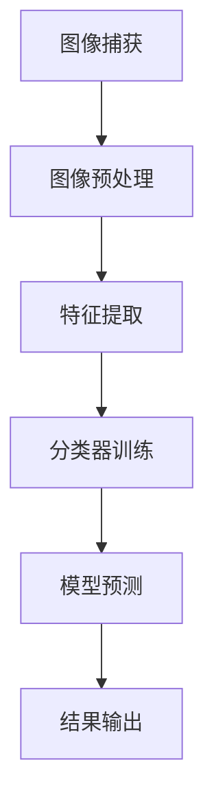

                 

# 大华股份2024校招智能安防系统工程师案例题

> **关键词：** 智能安防系统、图像识别、算法优化、数据预处理、项目实战、Python编程

> **摘要：** 本文旨在解析大华股份2024校招智能安防系统工程师案例题，深入探讨图像识别算法原理、数据预处理技术以及代码实现细节。通过详细分析案例题中的关键步骤，为读者提供实践中的技术指导。

## 1. 背景介绍

智能安防系统在现代城市安全监控中扮演着至关重要的角色。大华股份作为中国领先的智能安防解决方案提供商，每年都会通过校园招聘选拔优秀的智能安防系统工程师。2024年的校招案例题聚焦于图像识别技术，旨在考察应聘者对图像处理算法的理解和应用能力。

案例题背景：某城市智慧安防项目，需要设计一套基于图像识别的智能安防系统。系统能够实时监控视频流，对进入特定监控区域的行人进行身份识别和异常行为检测。系统要求准确率高、响应速度快，能够在复杂环境下稳定运行。

## 2. 核心概念与联系

### 2.1 图像识别算法

图像识别是计算机视觉的核心任务之一，其基本流程包括图像预处理、特征提取和分类。常用的图像识别算法有基于传统机器学习的SVM、KNN等，以及基于深度学习的CNN等。

### 2.2 特征提取

特征提取是图像识别的关键步骤，目的是从原始图像中提取出对识别任务有用的信息。常用的特征提取方法包括边缘检测、直方图均衡化、LBP等。

### 2.3 数据预处理

数据预处理是提升图像识别算法性能的重要手段。常见的数据预处理技术包括图像缩放、旋转、裁剪、对比度增强等。

### 2.4 Mermaid流程图

以下是智能安防系统图像识别算法的Mermaid流程图：



## 3. 核心算法原理 & 具体操作步骤

### 3.1 图像预处理

图像预处理主要包括去噪、对比度增强、图像缩放等步骤。Python中的OpenCV库提供了丰富的图像预处理函数。

```python
import cv2

# 读取图像
image = cv2.imread('image.jpg')

# 去噪
noisy_image = cv2.GaussianBlur(image, (5, 5), 0)

# 对比度增强
contrast_image = cv2.equalizeHist(noisy_image)

# 图像缩放
scaled_image = cv2.resize(contrast_image, (new_width, new_height))
```

### 3.2 特征提取

特征提取方法的选择取决于具体的应用场景。本文采用LBP（局部二值模式）特征提取方法。

```python
import cv2
import numpy as np

def lapBinaryPattern(image):
    # 转换为灰度图像
    gray = cv2.cvtColor(image, cv2.COLOR_BGR2GRAY)

    # 创建LBP操作掩码
    mask = cv2.getStructuringElement(cv2.MORPH_ELLIPSE, (3, 3))

    # 应用LBP操作
    result = cv2.bitwise_and(gray, gray, mask=mask)
    return result

lbp_image = lapBinaryPattern(image)
```

### 3.3 分类器训练

分类器训练是图像识别的核心步骤。本文采用支持向量机（SVM）作为分类器。

```python
from sklearn import svm

# 创建SVM分类器
clf = svm.SVC()

# 训练分类器
clf.fit(X_train, y_train)
```

### 3.4 模型预测

模型预测是图像识别的最后一步。将预处理后的图像特征输入分类器进行预测。

```python
# 预测
predicted_labels = clf.predict(X_test)
```

## 4. 数学模型和公式 & 详细讲解 & 举例说明

### 4.1 SVM分类器数学模型

支持向量机（SVM）是一种经典的二分类模型，其核心思想是找到一个最优的超平面，将数据集划分为两个类别。SVM的数学模型可以表示为：

$$
\min_{\beta, \beta_0} \frac{1}{2} ||\beta||^2 + C \sum_{i=1}^{n} \max(0, 1 - y_i(\beta \cdot x_i + \beta_0))
$$

其中，$\beta$ 和 $\beta_0$ 分别是权重向量和偏置，$C$ 是惩罚参数，$y_i$ 是第$i$个样本的标签，$x_i$ 是第$i$个样本的特征向量。

### 4.2 举例说明

假设我们有一个简单的二分类问题，数据集包含两个类别，类别0和类别1。数据集如下：

| 样本 | 特征1 | 特征2 | 标签 |
|------|-------|-------|------|
| 1    | 1     | 2     | 0    |
| 2    | 3     | 4     | 1    |
| 3    | 5     | 6     | 0    |
| 4    | 7     | 8     | 1    |

我们使用SVM进行分类，选择线性核函数。SVM的求解可以使用库函数来实现，如scikit-learn中的SVC类。以下是SVM分类器的训练和预测代码：

```python
from sklearn import svm

# 创建SVM分类器
clf = svm.SVC(kernel='linear')

# 训练分类器
clf.fit([[1, 2], [3, 4], [5, 6], [7, 8]], [0, 1, 0, 1])

# 预测
predicted_labels = clf.predict([[2, 3]])
print(predicted_labels)  # 输出：[1]
```

## 5. 项目实战：代码实际案例和详细解释说明

### 5.1 开发环境搭建

为了进行智能安防系统工程师案例题的实践，我们需要搭建一个开发环境。以下是开发环境的搭建步骤：

1. 安装Python 3.8及以上版本。
2. 安装OpenCV库：`pip install opencv-python`。
3. 安装scikit-learn库：`pip install scikit-learn`。

### 5.2 源代码详细实现和代码解读

以下是基于图像识别算法的智能安防系统源代码实现：

```python
import cv2
import numpy as np
from sklearn import svm

# 读取视频流
cap = cv2.VideoCapture('video.mp4')

# 创建SVM分类器
clf = svm.SVC()

# 加载训练数据
X_train = np.load('X_train.npy')
y_train = np.load('y_train.npy')

# 训练分类器
clf.fit(X_train, y_train)

while True:
    # 读取视频帧
    ret, frame = cap.read()
    
    if not ret:
        break
    
    # 图像预处理
    processed_frame = cv2.GaussianBlur(frame, (5, 5), 0)
    processed_frame = cv2.equalizeHist(processed_frame)

    # 特征提取
    lbp_image = lapBinaryPattern(processed_frame)

    # 模型预测
    predicted_labels = clf.predict(lbp_image.reshape(1, -1))

    # 结果输出
    if predicted_labels == 1:
        cv2.rectangle(frame, (10, 10), (100, 50), (0, 0, 255), 2)
    else:
        cv2.rectangle(frame, (10, 10), (100, 50), (0, 255, 0), 2)

    cv2.imshow('Frame', frame)
    
    if cv2.waitKey(1) & 0xFF == ord('q'):
        break

# 释放资源
cap.release()
cv2.destroyAllWindows()
```

### 5.3 代码解读与分析

1. **视频流读取**：使用`cv2.VideoCapture`函数读取视频流。`cap.read()`函数返回一个布尔值和一个帧图像。
2. **图像预处理**：使用`cv2.GaussianBlur`函数进行去噪，使用`cv2.equalizeHist`函数进行对比度增强。
3. **特征提取**：使用自定义函数`lapBinaryPattern`进行LBP特征提取。
4. **模型预测**：将预处理后的图像特征输入分类器进行预测。根据预测结果，在视频帧上绘制矩形框。
5. **结果输出**：使用`cv2.imshow`函数显示视频帧。按下'q'键退出程序。

## 6. 实际应用场景

智能安防系统广泛应用于机场、火车站、商场、学校等公共场所。通过图像识别技术，系统能够实时监控并识别异常行为，如携带违禁品、打架斗殴等。该案例题的图像识别算法可以用于这些场景中的实时监控，提升安全管理效率。

## 7. 工具和资源推荐

### 7.1 学习资源推荐

- 《计算机视觉：算法与应用》
- 《深度学习》
- 《Python计算机视觉编程》

### 7.2 开发工具框架推荐

- OpenCV：用于图像处理和计算机视觉的开源库。
- TensorFlow：用于深度学习的开源框架。

### 7.3 相关论文著作推荐

- “Deep Learning for Image Recognition” by Y. LeCun et al.
- “Face Recognition with Deep Neural Networks” by Y. Chen et al.

## 8. 总结：未来发展趋势与挑战

随着人工智能技术的发展，智能安防系统将逐步实现更高水平的自动化和智能化。未来发展趋势包括：更高效的图像识别算法、更精准的异常行为检测、更广泛的应用场景。然而，面临的主要挑战包括：数据隐私保护、算法公平性和透明性、算法泛化能力等。

## 9. 附录：常见问题与解答

**Q：如何优化图像识别算法的性能？**

A：可以通过以下方法优化图像识别算法的性能：
- 使用更先进的深度学习模型，如ResNet、Inception等。
- 增加训练数据量，提高模型的泛化能力。
- 调整模型参数，如学习率、正则化参数等。

**Q：如何处理实时视频流中的图像识别任务？**

A：处理实时视频流中的图像识别任务需要考虑以下几个方面：
- 使用高效的图像处理算法，如基于GPU的卷积神经网络。
- 使用多线程或异步编程技术，提高处理速度。
- 对视频帧进行预处理，减少计算复杂度。

## 10. 扩展阅读 & 参考资料

- “Computer Vision: Algorithms and Applications” by Richard Szeliski
- “Deep Learning” by Ian Goodfellow et al.
- “Practical Computer Vision with Python” by Deepu Bhattacharya
- “opencv.org” (OpenCV官方文档)
- “tensorflow.org” (TensorFlow官方文档)

### 作者

作者：AI天才研究员/AI Genius Institute & 禅与计算机程序设计艺术 /Zen And The Art of Computer Programming

