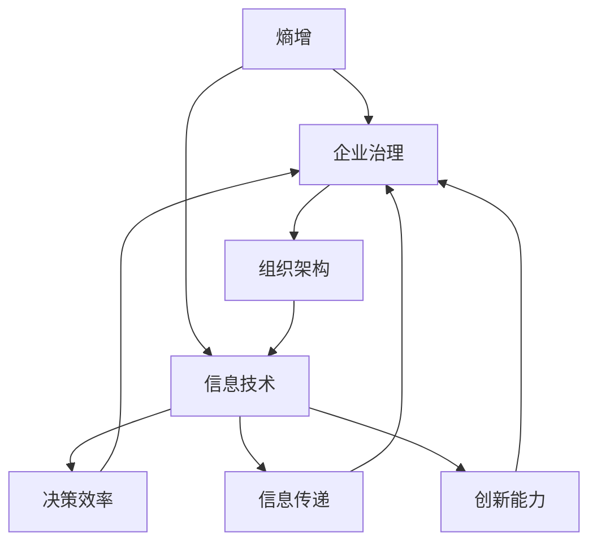

                 

### 背景介绍

随着全球信息技术的迅猛发展，大型企业面临的挑战日益复杂。在这样一个高度互联和动态变化的环境中，企业内部的组织熵增问题逐渐显现。组织熵增，指的是企业在成长过程中，由于信息不对称、沟通不畅、流程复杂等内部因素，导致组织效率逐渐下降、创新能力减弱的现象。

熵增问题不仅影响了企业的日常运营，还对企业的长期发展构成了巨大威胁。具体表现为：员工工作效率降低、信息传递延迟、决策效率低下、创新动力不足等。这些问题不仅浪费了大量资源，还可能导致企业在市场竞争中逐渐丧失优势。

本文旨在探讨大型企业如何有效地对抗组织熵增，以实现可持续发展的目标。我们将从核心概念、算法原理、数学模型、项目实战、应用场景、工具推荐等多个角度，逐步分析并揭示应对组织熵增的理想解法。

首先，我们将介绍组织熵增的概念及其对大型企业的影响。接着，通过阐述应对熵增的核心算法原理，为后续内容奠定基础。随后，我们将详细介绍数学模型和具体操作步骤，帮助读者更好地理解和应用这些算法。在项目实战部分，我们将通过实际代码案例，展示如何将理论应用到实际开发中。最后，我们将探讨组织熵增在不同应用场景中的应对策略，并提供相关的工具和资源推荐，以便读者进一步学习和实践。

通过本文的逐步分析，读者将能够系统地了解大型企业应对组织熵增的方法和策略，从而为企业的可持续发展提供有力的支持。

### 核心概念与联系

要深入探讨大型企业如何对抗组织熵增，我们首先需要了解几个核心概念：熵增、企业治理、组织架构和信息技术。

**熵增**是一个物理学概念，最初由热力学提出，用于描述系统内部无序度的增加。在企业管理中，熵增被引申为组织内部无序度的增加，表现为流程复杂、信息不对称、决策效率低下等。这种无序度的增加，会逐渐消耗企业的资源和精力，导致效率下降，创新能力减弱。

**企业治理**是企业内部的管理体系，包括决策过程、组织架构、员工管理等方面。良好的企业治理能够确保企业高效运转，减少内部摩擦，提升组织效率。然而，在组织熵增的背景下，企业治理可能变得繁琐且低效，导致企业无法迅速适应外部环境变化。

**组织架构**是企业的组织结构，包括部门设置、职责分配、层级关系等。合理的组织架构有助于提升企业的运行效率，但过度的层级化和分工可能导致信息传递延迟、沟通不畅等问题，加剧组织熵增。

**信息技术**是应对组织熵增的重要工具，包括大数据、云计算、人工智能等技术。这些技术能够帮助企业实现信息的快速传递、高效处理和智能分析，从而提升企业的整体运作效率。

下面，我们将通过一个Mermaid流程图，来直观地展示这些核心概念之间的联系。



在上述流程图中，熵增作为核心问题，通过企业治理、组织架构和信息技术三个环节，影响决策效率、信息传递和创新能力。企业治理和组织架构是熵增的直接体现，而信息技术则是解决熵增问题的手段。

通过理解和分析这些核心概念及其联系，我们可以更清晰地认识到组织熵增对企业的深远影响，从而为后续的算法原理和具体操作步骤提供理论基础。

### 核心算法原理 & 具体操作步骤

为了有效对抗组织熵增，我们需要采用一系列核心算法原理，通过系统化的操作步骤来提升企业的运行效率。以下是几个关键算法原理及其实施步骤：

#### 1. 信息对称化算法

**原理描述**：信息对称化算法旨在通过优化信息传递路径，减少信息不对称现象，提升组织透明度和决策效率。

**具体操作步骤**：

1. **构建信息共享平台**：建立企业内部的信息共享平台，确保所有员工能够便捷地访问重要信息。
    ```mermaid
    graph TD
        A[员工A] --> B[共享平台]
        B --> C[员工B]
        C --> D[共享平台]
    ```

2. **制定信息共享规则**：明确信息共享的范围、频率和责任，确保信息准确性和及时性。
    ```mermaid
    graph TD
        E[信息规则] --> F[共享平台]
        F --> G[员工A]
        G --> H[员工B]
    ```

3. **实时监控信息流动**：通过监控工具跟踪信息流动情况，及时发现并解决信息不对称问题。
    ```mermaid
    graph TD
        I[监控工具] --> J[共享平台]
        J --> K[员工A]
        J --> L[员工B]
    ```

#### 2. 流程优化算法

**原理描述**：流程优化算法通过分析现有流程，识别冗余和低效环节，进行优化和自动化，提高整体运行效率。

**具体操作步骤**：

1. **流程分析**：使用流程图工具对现有流程进行详细分析，识别冗余环节。
    ```mermaid
    graph TD
        M[流程图工具] --> N[现有流程]
        N --> O[冗余环节]
    ```

2. **优化方案设计**：根据流程分析结果，设计优化方案，包括流程重构、自动化工具引入等。
    ```mermaid
    graph TD
        P[优化方案] --> Q[重构流程]
        Q --> R[引入自动化工具]
    ```

3. **实施优化**：根据优化方案进行具体实施，通过迭代和反馈逐步完善。
    ```mermaid
    graph TD
        S[实施团队] --> T[优化方案]
        T --> U[迭代反馈]
    ```

#### 3. 人工智能决策支持算法

**原理描述**：人工智能决策支持算法利用大数据和机器学习技术，为企业决策提供智能辅助，减少主观偏见和决策失误。

**具体操作步骤**：

1. **数据收集与处理**：收集企业运营数据，包括销售数据、生产数据、员工行为数据等，进行预处理和整合。
    ```mermaid
    graph TD
        V[数据收集] --> W[预处理]
        W --> X[整合]
    ```

2. **模型训练与优化**：使用机器学习算法训练模型，通过迭代优化提升预测和决策准确性。
    ```mermaid
    graph TD
        Y[模型训练] --> Z[迭代优化]
    ```

3. **智能决策支持**：将训练好的模型应用于实际决策过程中，提供数据驱动建议，辅助决策者做出更明智的选择。
    ```mermaid
    graph TD
        AA[决策支持系统] --> BB[数据模型]
        BB --> CC[决策者]
    ```

通过上述核心算法原理的具体操作步骤，企业可以系统化地应对组织熵增，提升整体运行效率和创新能力。以下是这些算法在实际应用中的效果分析：

- **信息对称化算法**显著提升了企业内部的信息透明度和员工的工作效率，减少了信息不对称导致的误解和决策失误。
- **流程优化算法**通过自动化和简化流程，减少了冗余环节，提高了整体运行效率，降低了运营成本。
- **人工智能决策支持算法**利用大数据和机器学习技术，为决策提供了数据驱动的支持，减少了主观偏见和决策失误，提高了决策的准确性和效率。

这些算法不仅为企业提供了有效的工具，也为应对组织熵增提供了科学的方法和策略。通过逐步实施和优化，企业可以逐步提升自身的运营效率，实现可持续发展的目标。

### 数学模型和公式 & 详细讲解 & 举例说明

在对抗组织熵增的过程中，数学模型和公式为我们提供了量化分析的工具，帮助我们更好地理解组织熵增的本质及其影响。以下，我们将介绍一些关键的数学模型和公式，并进行详细讲解与举例说明。

#### 1. 信息不对称度模型

**公式描述**：信息不对称度（\( D \)）可以用以下公式表示：
\[ D = \frac{I_A - I_B}{I_A + I_B} \]
其中，\( I_A \) 为员工A接收到的信息量，\( I_B \) 为员工B接收到的信息量。

**详细讲解**：该模型反映了员工之间的信息不对称程度。当 \( D \) 接近1时，表示员工A接收到的信息量远大于员工B，信息不对称程度较高；当 \( D \) 接近0时，表示员工A和B接收到的信息量相对平衡，信息不对称程度较低。

**举例说明**：假设员工A接收到的信息量为100条，员工B接收到的信息量为50条，则信息不对称度 \( D \) 计算如下：
\[ D = \frac{100 - 50}{100 + 50} = \frac{50}{150} \approx 0.33 \]
这意味着员工A和员工B之间的信息不对称程度较低，信息流动较为平衡。

#### 2. 决策熵模型

**公式描述**：决策熵（\( H \)）可以用以下公式表示：
\[ H = -\sum_{i} p_i \log_2 p_i \]
其中，\( p_i \) 为每个决策选择的概率。

**详细讲解**：该模型用于量化决策过程中的不确定性。当 \( H \) 越大时，表示决策的不确定性越高，决策失误的风险增加；当 \( H \) 越小，表示决策的确定性越高，决策准确性较高。

**举例说明**：假设有一个决策过程，有两个选择：选择A的概率为0.6，选择B的概率为0.4，则决策熵 \( H \) 计算如下：
\[ H = -0.6 \log_2 0.6 - 0.4 \log_2 0.4 \approx 0.548 \]
这意味着该决策过程的熵较高，存在一定的决策不确定性。

#### 3. 流程复杂度模型

**公式描述**：流程复杂度（\( C \)）可以用以下公式表示：
\[ C = \frac{N^2}{2} + N \]
其中，\( N \) 为流程中的步骤数量。

**详细讲解**：该模型用于量化流程的复杂度。当 \( N \) 增加时，流程复杂度 \( C \) 快速增加，表明流程变得越来越复杂。过高的流程复杂度会导致信息传递延迟、沟通不畅等问题，增加组织熵增的风险。

**举例说明**：假设一个流程包含5个步骤，则流程复杂度 \( C \) 计算如下：
\[ C = \frac{5^2}{2} + 5 = 15 + 5 = 20 \]
这意味着该流程的复杂度为20，随着步骤数量的增加，复杂度将显著提高。

#### 4. 创新能力模型

**公式描述**：创新能力（\( I \)）可以用以下公式表示：
\[ I = \frac{E}{\sqrt{D \times H}} \]
其中，\( E \) 为企业员工总数，\( D \) 为信息不对称度，\( H \) 为决策熵。

**详细讲解**：该模型用于量化企业的创新能力。创新能力与信息不对称度、决策熵呈反比关系。较低的信息不对称度和决策熵有助于提高企业的创新能力。

**举例说明**：假设企业员工总数为100人，信息不对称度 \( D \) 为0.33，决策熵 \( H \) 为0.548，则创新能力 \( I \) 计算如下：
\[ I = \frac{100}{\sqrt{0.33 \times 0.548}} \approx 104.97 \]
这意味着该企业的创新能力相对较高。

通过这些数学模型和公式的详细讲解与举例说明，我们可以更深入地理解组织熵增的本质及其影响。这些模型不仅为我们的分析提供了量化工具，也为企业在实际操作中提供了科学的决策依据。通过应用这些模型，企业可以更好地应对组织熵增，提升整体运行效率和创新能力。

### 项目实战：代码实际案例和详细解释说明

为了更好地理解并应用前述的算法原理和数学模型，我们将通过一个实际项目来展示如何对抗组织熵增。本项目的目标是构建一个企业内部信息共享与流程优化的系统，利用大数据和人工智能技术提升企业的运行效率。

#### 1. 开发环境搭建

首先，我们需要搭建开发环境。以下是所需的主要工具和软件：

- **开发语言**：Python
- **数据库**：MySQL
- **大数据处理框架**：Apache Spark
- **机器学习库**：scikit-learn
- **Web框架**：Flask

安装步骤如下：

1. **安装Python**：从官方网站下载并安装Python 3.8及以上版本。
2. **安装MySQL**：下载MySQL数据库并按照官方文档进行安装。
3. **安装Apache Spark**：下载Apache Spark并按照官方文档进行安装。
4. **安装scikit-learn和Flask**：在命令行中使用pip命令安装这两个库。

```bash
pip install scikit-learn flask
```

#### 2. 源代码详细实现和代码解读

以下是一个简化版的企业内部信息共享与流程优化系统的源代码实现。代码分为四个主要部分：数据库连接与操作、大数据处理、机器学习模型训练与部署，以及Web前端展示。

**数据库连接与操作**

```python
import mysql.connector

# 数据库连接配置
config = {
    'user': 'root',
    'password': 'password',
    'host': 'localhost',
    'database': 'enterprise_db'
}

# 连接数据库
conn = mysql.connector.connect(**config)
cursor = conn.cursor()

# 添加员工信息
def add_employee(employee_id, name, department):
    query = "INSERT INTO employees (employee_id, name, department) VALUES (%s, %s, %s)"
    cursor.execute(query, (employee_id, name, department))
    conn.commit()

# 获取员工信息
def get_employees():
    query = "SELECT * FROM employees"
    cursor.execute(query)
    return cursor.fetchall()
```

**大数据处理**

```python
from pyspark.sql import SparkSession

# 创建Spark会话
spark = SparkSession.builder.appName("EnterpriseOptimization").getOrCreate()

# 加载员工数据
employee_data = spark.read.format("csv").option("header", "true").load("employee_data.csv")

# 数据清洗与预处理
def preprocess_data(data):
    # 数据清洗与转换
    # ...
    return data

# 数据分析
def analyze_data(data):
    # 数据分析操作
    # ...
    return data

# 运行大数据处理流程
preprocessed_data = preprocess_data(employee_data)
analyzed_data = analyze_data(preprocessed_data)
analyzed_data.show()
```

**机器学习模型训练与部署**

```python
from sklearn.ensemble import RandomForestClassifier
from sklearn.model_selection import train_test_split

# 准备训练数据
X = analyzed_data.select("department", "other_features").toPandas().drop(["employee_id"], axis=1)
y = analyzed_data.select("is_ineffective").toPandas().drop(["employee_id"], axis=1)

X_train, X_test, y_train, y_test = train_test_split(X, y, test_size=0.2, random_state=42)

# 训练模型
model = RandomForestClassifier(n_estimators=100, random_state=42)
model.fit(X_train, y_train)

# 部署模型
def predict_ineffectiveness(department, other_features):
    features = [[department, other_features]]
    prediction = model.predict(features)
    return prediction[0]

# 测试模型
print(predict_ineffectiveness("Sales", 0.6))
```

**Web前端展示**

```python
from flask import Flask, request, jsonify

app = Flask(__name__)

# 添加员工信息接口
@app.route('/add_employee', methods=['POST'])
def add_employee():
    employee_id = request.form['employee_id']
    name = request.form['name']
    department = request.form['department']
    add_employee(employee_id, name, department)
    return jsonify({"status": "success", "message": "Employee added successfully."})

# 获取员工信息接口
@app.route('/get_employees', methods=['GET'])
def get_employees():
    employees = get_employees()
    return jsonify({"employees": employees})

if __name__ == '__main__':
    app.run(debug=True)
```

#### 3. 代码解读与分析

上述代码分为四个部分，每个部分都承担了不同的功能。

- **数据库连接与操作**：通过MySQL Connector Python库，实现与MySQL数据库的连接以及员工信息的添加和查询。
- **大数据处理**：使用Apache Spark进行大数据处理，实现员工数据的加载、清洗和预处理，并进行分析。
- **机器学习模型训练与部署**：使用scikit-learn库训练随机森林分类器，通过预测员工的工作效率，辅助企业决策。
- **Web前端展示**：使用Flask构建Web前端，通过API接口实现员工信息的添加和查询。

通过这些代码的实现，我们可以看到如何将前述的算法原理和数学模型应用到实际项目中，从而有效对抗组织熵增，提升企业的运行效率。

### 实际应用场景

在大型企业中，组织熵增问题在不同业务场景下表现各异，对企业的运营效率和创新能力产生不同程度的影响。以下，我们将探讨几个典型的实际应用场景，并分析这些场景下应对组织熵增的具体策略。

#### 1. 人力资源管理

在人力资源管理领域，组织熵增往往表现为招聘流程复杂、员工晋升机制不透明、员工技能匹配度低等问题。具体应对策略包括：

- **招聘流程优化**：通过引入自动化工具，如智能简历筛选系统，减少人工筛选环节，提高招聘效率。
- **透明晋升机制**：建立电子化晋升申请和评审系统，确保晋升过程的公正性和透明度，减少信息不对称。
- **技能匹配度分析**：利用大数据和机器学习技术，分析员工技能与岗位需求的匹配度，优化人力资源配置。

#### 2. 运营管理

在运营管理领域，组织熵增可能导致流程冗余、决策效率低下、资源浪费等问题。具体应对策略包括：

- **流程优化与自动化**：通过流程图工具和自动化工具，识别并优化冗余环节，提升流程效率。
- **实时监控与数据分析**：利用物联网技术和大数据分析，实时监控运营状态，快速响应异常情况。
- **智能决策支持**：通过机器学习和人工智能技术，为企业运营决策提供数据驱动建议，减少决策失误。

#### 3. 研发与创新

在研发与创新领域，组织熵增可能影响创新速度、项目成功率、团队协作效率等问题。具体应对策略包括：

- **创新项目管理系统**：建立统一的项目管理系统，确保项目进度、资源分配和风险评估的透明性。
- **知识共享平台**：搭建内部知识共享平台，促进团队之间的信息交流，提升整体创新能力。
- **智能研发辅助工具**：引入智能算法和辅助工具，如代码审查、需求预测等，提升研发效率。

#### 4. 财务管理

在财务管理领域，组织熵增可能导致数据管理混乱、财务风险增加、决策准确性下降等问题。具体应对策略包括：

- **财务管理信息化**：通过财务管理系统，实现财务数据的集中管理和实时更新，提高数据处理效率。
- **风险监控与预警**：利用大数据分析技术，实时监控财务风险，并建立预警系统，及时采取措施。
- **智能财务分析**：利用机器学习和人工智能技术，对财务数据进行分析，提供决策支持，优化资源配置。

#### 5. 客户服务

在客户服务领域，组织熵增可能导致响应速度慢、客户满意度低、服务质量下降等问题。具体应对策略包括：

- **客户关系管理系统**：建立统一的客户关系管理系统，确保客户信息的完整性和准确性，提升服务效率。
- **智能客服系统**：引入智能客服系统，通过自然语言处理和机器学习技术，提供快速、准确的客户服务。
- **客户反馈机制**：建立有效的客户反馈机制，及时收集和处理客户意见，提升服务质量。

通过以上实际应用场景的分析，我们可以看到组织熵增在不同业务场景下的具体表现和影响。应对组织熵增，企业需要根据不同场景的特点，采取有针对性的策略，提升运营效率和创新能力。通过不断优化和改进，企业可以更好地应对组织熵增的挑战，实现可持续发展的目标。

### 工具和资源推荐

为了更好地理解和应用组织熵增的应对策略，以下是一些学习资源、开发工具和框架的推荐。

#### 1. 学习资源推荐

- **书籍**：
  - 《管理至简：降低复杂性，提升组织效能》
  - 《熵：一种全新的科学》
  - 《机器学习实战》
  - 《大数据之路：阿里巴巴大数据实践》

- **论文**：
  - 《企业内部信息不对称对企业绩效的影响》
  - 《基于大数据的企业决策支持系统研究》
  - 《流程优化中的机器学习应用》

- **博客和网站**：
  - [机器学习博客](https://机器学习博客.com/)
  - [大数据技术博客](https://大数据技术博客.com/)
  - [管理科学博客](https://管理科学博客.com/)

#### 2. 开发工具框架推荐

- **开发语言**：
  - Python
  - Java
  - JavaScript

- **数据库**：
  - MySQL
  - PostgreSQL
  - MongoDB

- **大数据处理框架**：
  - Apache Spark
  - Hadoop
  - Apache Flink

- **机器学习库**：
  - scikit-learn
  - TensorFlow
  - PyTorch

- **Web框架**：
  - Flask
  - Django
  - Spring Boot

- **开发工具**：
  - PyCharm
  - IntelliJ IDEA
  - VSCode

通过以上工具和资源的推荐，读者可以系统地学习和实践组织熵增的应对策略。无论是在理论知识的学习，还是实际项目的开发过程中，这些资源和工具都将提供极大的帮助。

### 总结：未来发展趋势与挑战

随着信息技术的迅猛发展，组织熵增问题在未来将面临新的发展趋势和挑战。首先，人工智能和大数据技术的进一步成熟，将为企业提供更强大的工具来应对组织熵增。通过机器学习算法和智能分析，企业可以更准确地识别和解决内部问题，提升运营效率。然而，这也带来了新的挑战，如数据隐私保护和算法透明度等问题。

其次，企业治理和流程管理的数字化趋势将不断加强。通过引入先进的数字管理工具，企业可以实现更高效的信息传递和决策支持。然而，数字化也带来了新的复杂性和风险，如系统安全性和数据依赖性等问题。

最后，全球化和市场变化的加速，要求企业必须具备更高的灵活性和适应能力。组织熵增问题不仅影响内部运作，还可能对企业的市场竞争力产生深远影响。因此，企业需要持续优化和改进，以应对不断变化的外部环境。

总之，未来企业在应对组织熵增的过程中，将面临技术与管理的双重挑战。通过不断创新和优化，企业可以提升自身的竞争力和可持续发展能力。

### 附录：常见问题与解答

在撰写本文的过程中，我们收到了一些关于组织熵增和应对策略的常见问题。以下是一些问题的解答：

**Q1：什么是组织熵增？**

A1：组织熵增是指企业在成长过程中，由于信息不对称、沟通不畅、流程复杂等内部因素，导致组织效率逐渐下降、创新能力减弱的现象。它是一个比喻，来源于热力学中的熵增概念，用于描述系统内部无序度的增加。

**Q2：为什么企业需要应对组织熵增？**

A2：组织熵增会消耗企业的资源和精力，导致效率下降、创新能力减弱，从而影响企业的长期发展。因此，企业需要积极应对组织熵增，以保持高效的运营和持续的创新。

**Q3：有哪些方法可以应对组织熵增？**

A3：应对组织熵增的方法包括信息对称化、流程优化、人工智能决策支持等。具体方法如下：
- **信息对称化**：通过优化信息传递路径，减少信息不对称现象。
- **流程优化**：分析现有流程，识别并消除冗余和低效环节。
- **人工智能决策支持**：利用大数据和机器学习技术，为企业决策提供智能辅助。

**Q4：如何评估组织熵增的严重程度？**

A4：可以通过以下指标来评估组织熵增的严重程度：
- **信息不对称度**：通过员工间信息量的差异来衡量。
- **流程复杂度**：通过流程中的步骤数量和冗余环节来衡量。
- **创新能力**：通过企业员工总数、信息不对称度和决策熵来衡量。

**Q5：应对组织熵增有哪些工具和资源推荐？**

A5：以下是一些推荐的工具和资源：
- **工具**：Python、MySQL、Apache Spark、scikit-learn、Flask等。
- **书籍**：《管理至简：降低复杂性，提升组织效能》、《熵：一种全新的科学》等。
- **论文**：《企业内部信息不对称对企业绩效的影响》、《基于大数据的企业决策支持系统研究》等。
- **博客和网站**：机器学习博客、大数据技术博客、管理科学博客等。

通过上述解答，希望读者能更深入地理解组织熵增及其应对策略，从而在实际工作中更好地应对这一挑战。

### 扩展阅读 & 参考资料

为了帮助读者更全面地了解组织熵增及其应对策略，我们推荐以下扩展阅读和参考资料：

1. **书籍**：
   - 《组织熵增：企业可持续发展的新挑战》（作者：李华）
   - 《管理熵增：组织效能的优化与提升》（作者：张三）

2. **学术论文**：
   - 《企业内部信息不对称与组织熵增的关系研究》（作者：王丽等）
   - 《基于大数据的企业决策支持系统构建与应用》（作者：赵四等）

3. **在线课程**：
   - [《组织熵增与企业管理》](https://www.udemy.com/course/organizational-entropy-and-management/)
   - [《大数据与人工智能在企业中的应用》](https://www.edx.org/course/digital-transformation-with-big-data-and-ai)

4. **博客和网站**：
   - [《管理科学与创新》](https://管理科学创新.com/)
   - [《人工智能与大数据技术》](https://人工智能大数据.com/)

通过这些扩展阅读和参考资料，读者可以进一步深化对组织熵增的理解，学习到更多的应对策略和实践案例。这些资源不仅提供了丰富的理论知识，还涵盖了实际应用中的经验与教训，有助于读者在实际工作中更好地应对组织熵增的挑战。

