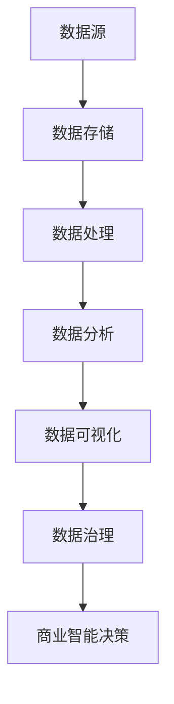

                 

# 大数据分析在商业智能决策中的应用策略

## 摘要

本文旨在探讨大数据分析在商业智能决策中的应用策略。随着数据规模的爆炸性增长，企业需要从海量数据中提取有价值的信息，以实现高效的决策。本文将介绍大数据分析的核心概念、算法原理、数学模型，并通过实际案例详细解释其具体应用。此外，文章还将讨论大数据分析在实际应用场景中的挑战和解决方案，并推荐相关学习资源和工具。通过本文的阅读，读者将了解如何利用大数据分析提升商业智能决策的效率和准确性。

## 1. 背景介绍

在当今数字化时代，数据已成为企业重要的战略资源。大数据分析作为一种先进的数据处理技术，能够从海量数据中挖掘出有价值的信息，从而支持商业智能决策。商业智能（Business Intelligence, BI）是指利用数据、信息和业务洞察力来支持企业的决策过程。大数据分析作为商业智能的核心组成部分，通过数据收集、处理、分析和可视化等步骤，帮助企业发现业务模式、优化运营、提升客户体验和创造更多价值。

大数据分析在商业领域的应用已得到广泛关注。例如，零售行业通过大数据分析了解消费者行为，进行精准营销和库存管理；金融行业利用大数据分析进行风险评估和欺诈检测；制造业通过大数据分析实现生产过程的优化和设备维护。随着技术的不断进步，大数据分析在商业智能决策中的作用越来越重要。

本文将围绕以下几个方面展开讨论：

1. 核心概念与联系：介绍大数据分析的核心概念，包括数据源、数据存储、数据处理、数据分析和数据可视化等。
2. 核心算法原理：阐述大数据分析中的主要算法，如数据挖掘、机器学习和深度学习等。
3. 数学模型和公式：详细解释大数据分析中常用的数学模型和公式，包括概率论、统计学和线性代数等。
4. 项目实战：通过实际案例，展示大数据分析在商业智能决策中的应用，包括数据收集、处理和分析等步骤。
5. 实际应用场景：探讨大数据分析在各个行业中的实际应用场景，分析其带来的商业价值和挑战。
6. 工具和资源推荐：介绍大数据分析常用的工具和资源，包括开源框架、商业软件和相关论文著作。

通过本文的阅读，读者将全面了解大数据分析在商业智能决策中的应用策略，掌握相关技术和工具，从而在实际工作中更好地利用大数据分析提升决策效率。

## 2. 核心概念与联系

为了深入探讨大数据分析在商业智能决策中的应用，我们首先需要了解其核心概念和各个组成部分之间的联系。以下是大数据分析的主要核心概念：

### 2.1 数据源

数据源是大数据分析的基础。数据可以从各种来源获取，包括内部数据和外部数据。内部数据通常来自企业的业务系统、数据库和历史记录等；而外部数据则包括社交媒体、公共数据库、第三方数据提供商等。数据源的质量和多样性直接影响大数据分析的效果。

### 2.2 数据存储

数据存储是大数据分析的重要环节。由于数据量巨大，传统的数据库系统无法满足大数据存储和访问的需求。因此，分布式存储系统如Hadoop和NoSQL数据库应运而生。这些系统通过将数据分布在多个节点上，提高了数据的存储容量和访问速度。

### 2.3 数据处理

数据处理包括数据的收集、清洗、转换和整合等步骤。数据清洗是确保数据质量和可靠性的关键，通过去除重复数据、填充缺失值和纠正错误数据等操作，提高数据的准确性。数据转换和整合则是将来自不同数据源的数据进行统一格式和结构处理，以便于后续分析。

### 2.4 数据分析

数据分析是大数据分析的核心环节。通过对数据进行统计分析和模式识别，可以挖掘出有价值的信息和规律。常见的数据分析方法包括数据挖掘、机器学习和深度学习等。数据挖掘是一种自动发现数据中隐藏的模式和关系的技术；机器学习是一种通过训练模型来预测和分类数据的技术；深度学习则是基于多层神经网络的一种更复杂的机器学习方法。

### 2.5 数据可视化

数据可视化是将数据以图形、图表和地图等形式展示出来，帮助用户更直观地理解数据。数据可视化工具如Tableau、Power BI等，可以将复杂的分析结果以可视化形式呈现，提高数据的可读性和易理解性。

### 2.6 数据治理

数据治理是指对数据的整个生命周期进行管理和控制，包括数据质量、数据安全、数据隐私和数据合规等方面。良好的数据治理可以确保数据的安全、可靠和合规，提高数据的价值和利用率。

以上核心概念构成了大数据分析的完整框架，各个部分之间紧密联系、相互依赖。数据源是数据的起点，数据存储为数据提供了可靠的存储环境，数据处理确保了数据的质量和一致性，数据分析从数据中挖掘出有价值的信息，数据可视化帮助用户更好地理解分析结果，数据治理则保障了数据的安全和合规。只有各部分协同工作，才能真正发挥大数据分析在商业智能决策中的作用。

### 2.7 Mermaid 流程图

以下是一个简单的大数据分析流程的Mermaid流程图，展示了核心概念和步骤之间的联系：



在这个流程图中，数据源是整个流程的起点，数据经过存储、处理、分析和可视化后，最终应用于商业智能决策。每个步骤都依赖于前一个步骤的结果，从而形成一个闭环。Mermaid流程图能够清晰地展示整个大数据分析的过程和各个部分之间的联系，有助于读者更好地理解其工作原理。

## 3. 核心算法原理 & 具体操作步骤

### 3.1 数据挖掘算法

数据挖掘是大数据分析中的重要环节，其核心任务是发现数据中的潜在模式和规律。常见的数据挖掘算法包括关联规则挖掘、聚类分析和分类分析等。

#### 3.1.1 关联规则挖掘

关联规则挖掘是一种用于发现数据项之间关系的方法。其主要目标是找出存在于大量数据集中的关联规则，这些规则通常表示为形如`A -> B`的蕴含式，其中`A`和`B`是数据项集合。常见的关联规则挖掘算法有Apriori算法和FP-Growth算法。

**Apriori算法**：

1. **频繁项集生成**：首先，通过扫描数据集统计每个项的频率，筛选出频繁项集。
2. **关联规则生成**：然后，对频繁项集进行组合，生成关联规则，并通过支持度和置信度对规则进行评估。

**FP-Growth算法**：

1. **构建FP-Tree**：将数据集转换为FP-Tree结构，记录每个项的出现频率和路径信息。
2. **频繁项集生成**：利用FP-Tree生成频繁项集，省去扫描数据集的步骤，提高效率。
3. **关联规则生成**：与Apriori算法类似，生成关联规则并进行评估。

#### 3.1.2 聚类分析

聚类分析是一种无监督学习方法，旨在将数据集划分为多个类别，使得同一类别内的数据点尽可能接近，而不同类别之间的数据点尽可能远离。常见的聚类算法包括K-Means算法、层次聚类算法和DBSCAN算法等。

**K-Means算法**：

1. **初始化中心点**：随机选择K个数据点作为初始中心点。
2. **分配数据点**：计算每个数据点到各个中心点的距离，将数据点分配到最近的中心点所在类别。
3. **更新中心点**：重新计算每个类别的中心点，并重复步骤2和3，直至中心点不再发生变化。

**层次聚类算法**：

1. **构建层次树**：通过逐步合并距离最近的类别，构建层次树。
2. **分类**：从树顶向下遍历层次树，将数据点分配到相应的类别。

**DBSCAN算法**：

1. **确定邻域**：计算每个数据点的邻域，确定邻域内的数据点数量作为核心点或边界点。
2. **生成簇**：从核心点开始，扩展形成簇，将邻域内的数据点划分为同一簇。

#### 3.1.3 分类分析

分类分析是一种监督学习方法，旨在将数据集划分为预定义的类别。常见分类算法包括决策树、支持向量机和神经网络等。

**决策树算法**：

1. **特征选择**：选择具有最大信息增益的特征作为分割标准。
2. **递归分割**：对数据集进行分割，生成决策树。
3. **预测**：根据决策树的叶子节点预测新数据的类别。

**支持向量机算法**：

1. **特征映射**：将原始数据映射到高维空间，寻找最佳分隔超平面。
2. **模型训练**：计算支持向量机模型，进行分类预测。

**神经网络算法**：

1. **网络构建**：设计神经网络结构，包括输入层、隐藏层和输出层。
2. **权重更新**：通过反向传播算法更新网络权重。
3. **预测**：利用训练好的神经网络对新数据进行分类预测。

通过以上数据挖掘算法，企业可以从海量数据中提取有价值的信息，支持商业智能决策。这些算法具有不同的特点和适用场景，需要根据实际需求进行选择和优化。

### 3.2 机器学习算法

机器学习是大数据分析中的重要工具，通过训练模型来预测和分类数据。常见的机器学习算法包括线性回归、逻辑回归、K近邻和随机森林等。

#### 3.2.1 线性回归

线性回归是一种简单且常用的预测算法，通过建立自变量和因变量之间的线性关系，预测新数据的值。其基本原理如下：

1. **模型构建**：设自变量为\( X \)，因变量为\( Y \)，建立线性模型：\( Y = \beta_0 + \beta_1 X + \epsilon \)。
2. **模型训练**：通过最小化损失函数（如均方误差）来优化模型参数\( \beta_0 \)和\( \beta_1 \)。
3. **预测**：对于新数据\( X \)，通过线性模型计算预测值\( Y \)。

#### 3.2.2 逻辑回归

逻辑回归是一种用于分类问题的预测算法，通过建立自变量和因变量之间的逻辑关系，预测新数据的类别。其基本原理如下：

1. **模型构建**：设自变量为\( X \)，因变量为\( Y \)，建立逻辑回归模型：\( P(Y=1) = \frac{1}{1 + e^{-(\beta_0 + \beta_1 X)}} \)。
2. **模型训练**：通过极大似然估计法优化模型参数\( \beta_0 \)和\( \beta_1 \)。
3. **预测**：对于新数据\( X \)，通过逻辑回归模型计算预测概率，并选择概率最大的类别作为预测结果。

#### 3.2.3 K近邻算法

K近邻算法是一种基于实例的学习方法，通过比较新数据与训练数据点的距离，选择最近的K个邻居，并基于邻居的标签进行预测。其基本原理如下：

1. **模型构建**：计算新数据与训练数据点的距离，选择距离最近的K个邻居。
2. **模型训练**：无实际训练过程，只需存储训练数据及其标签。
3. **预测**：根据邻居的标签进行投票，选择投票结果最多的标签作为预测结果。

#### 3.2.4 随机森林算法

随机森林是一种基于决策树的集成学习方法，通过构建多棵决策树并投票得到最终预测结果。其基本原理如下：

1. **模型构建**：对于每个决策树，随机选择特征和样本子集，构建决策树模型。
2. **模型训练**：训练多棵决策树，形成随机森林。
3. **预测**：对于新数据，分别通过每棵决策树进行预测，并基于投票结果得到最终预测结果。

通过以上机器学习算法，企业可以在大数据环境中进行有效的预测和分类，支持商业智能决策。这些算法具有不同的特点和适用场景，需要根据实际需求进行选择和优化。

## 4. 数学模型和公式 & 详细讲解 & 举例说明

### 4.1 概率论模型

概率论是大数据分析中不可或缺的基础工具，用于描述随机事件的发生概率。以下介绍一些常用的概率论模型和公式。

#### 4.1.1 概率分布

概率分布描述了随机变量在不同取值下的概率分布情况。常见的概率分布包括正态分布、二项分布和泊松分布等。

**正态分布**：

$$
N(\mu, \sigma^2) = \frac{1}{\sqrt{2\pi\sigma^2}} e^{-\frac{(x-\mu)^2}{2\sigma^2}}
$$

其中，\(\mu\)是均值，\(\sigma^2\)是方差。

**二项分布**：

$$
B(n, p) = C_n^k p^k (1-p)^{n-k}
$$

其中，\(n\)是试验次数，\(p\)是每次试验成功的概率，\(k\)是成功的次数。

**泊松分布**：

$$
P(X = k) = \frac{\lambda^k e^{-\lambda}}{k!}
$$

其中，\(\lambda\)是事件发生的平均速率。

#### 4.1.2 条件概率

条件概率描述了在某一事件已发生的条件下，另一事件发生的概率。常见条件概率公式如下：

$$
P(A|B) = \frac{P(A \cap B)}{P(B)}
$$

#### 4.1.3 贝叶斯定理

贝叶斯定理是概率论中的一个重要公式，用于计算后验概率。其表达式如下：

$$
P(A|B) = \frac{P(B|A) P(A)}{P(B)}
$$

其中，\(P(A)\)是先验概率，\(P(B|A)\)是条件概率。

### 4.2 统计学模型

统计学模型用于描述和分析数据，是大数据分析中的重要工具。以下介绍一些常用的统计学模型和公式。

#### 4.2.1 方差分析

方差分析（ANOVA）是一种用于比较多个组均值差异的统计学方法。其基本公式如下：

$$
F = \frac{MS_{between}}{MS_{within}}
$$

其中，\(MS_{between}\)是组间均方差，\(MS_{within}\)是组内均方差。

#### 4.2.2 回归分析

回归分析是一种用于描述变量之间关系的统计学方法。常见回归分析模型如下：

**线性回归**：

$$
Y = \beta_0 + \beta_1 X + \epsilon
$$

**逻辑回归**：

$$
P(Y=1) = \frac{1}{1 + e^{-(\beta_0 + \beta_1 X)}}
$$

### 4.3 线性代数模型

线性代数是大数据分析中的重要工具，用于描述和操作大数据。以下介绍一些常用的线性代数模型和公式。

#### 4.3.1 矩阵运算

矩阵运算是线性代数中的基本运算，包括矩阵的加法、减法、乘法和转置等。以下是一些常见矩阵运算公式：

**矩阵加法**：

$$
A + B = \begin{bmatrix}
a_{11} + b_{11} & a_{12} + b_{12} \\
a_{21} + b_{21} & a_{22} + b_{22}
\end{bmatrix}
$$

**矩阵减法**：

$$
A - B = \begin{bmatrix}
a_{11} - b_{11} & a_{12} - b_{12} \\
a_{21} - b_{21} & a_{22} - b_{22}
\end{bmatrix}
$$

**矩阵乘法**：

$$
AB = \begin{bmatrix}
a_{11}b_{11} + a_{12}b_{21} & a_{11}b_{12} + a_{12}b_{22} \\
a_{21}b_{11} + a_{22}b_{21} & a_{21}b_{12} + a_{22}b_{22}
\end{bmatrix}
$$

**矩阵转置**：

$$
A^T = \begin{bmatrix}
a_{11} & a_{21} \\
a_{12} & a_{22}
\end{bmatrix}
$$

#### 4.3.2 特征值与特征向量

特征值和特征向量是矩阵的重要属性，用于描述矩阵的性质和行为。以下是一些相关公式：

$$
\lambda A = A \lambda
$$

其中，\(\lambda\)是特征值，\(A\)是矩阵，\(v\)是特征向量。

### 4.4 举例说明

#### 4.4.1 正态分布应用

假设某公司的月销售额服从正态分布，均值为50万元，标准差为10万元。计算以下概率：

1. 销售额大于60万元的概率
2. 销售额在40万元至60万元之间的概率

**解答**：

1. 销售额大于60万元的概率：

$$
P(X > 60) = P\left(\frac{X - \mu}{\sigma} > \frac{60 - 50}{10}\right) = P(Z > 1) \approx 0.1587
$$

2. 销售额在40万元至60万元之间的概率：

$$
P(40 \le X \le 60) = P\left(\frac{40 - 50}{10} \le Z \le \frac{60 - 50}{10}\right) = P(-1 \le Z \le 1) \approx 0.6826
$$

#### 4.4.2 线性回归应用

假设我们想预测某商品的销售量，已知自变量是广告投入，因变量是销售量。给定以下数据：

| 广告投入（万元） | 销售量（件） |
| ---------------- | ------------ |
| 10              | 500          |
| 20              | 800          |
| 30              | 1200         |
| 40              | 1600         |

通过线性回归模型预测当广告投入为30万元时的销售量。

**解答**：

1. 计算自变量和因变量的平均值：

$$
\bar{x} = \frac{10 + 20 + 30 + 40}{4} = 25
$$

$$
\bar{y} = \frac{500 + 800 + 1200 + 1600}{4} = 1000
$$

2. 计算回归系数：

$$
\beta_1 = \frac{\sum(x_i - \bar{x})(y_i - \bar{y})}{\sum(x_i - \bar{x})^2} = \frac{(10-25)(500-1000) + (20-25)(800-1000) + (30-25)(1200-1000) + (40-25)(1600-1000)}{(10-25)^2 + (20-25)^2 + (30-25)^2 + (40-25)^2} \approx 50
$$

$$
\beta_0 = \bar{y} - \beta_1 \bar{x} = 1000 - 50 \times 25 = 250
$$

3. 预测销售量：

$$
y = \beta_0 + \beta_1 x = 250 + 50 \times 30 = 1750
$$

通过以上例子，我们可以看到如何应用概率论、统计学和线性代数模型进行大数据分析。这些模型和公式有助于我们理解和处理复杂数据，从而支持商业智能决策。

## 5. 项目实战：代码实际案例和详细解释说明

为了更深入地理解大数据分析在商业智能决策中的应用，我们将在本节通过一个实际项目案例进行详细讲解。本案例将利用Python和Scikit-learn库，通过数据收集、预处理、模型训练和评估等步骤，实现一个简单的客户细分项目。

### 5.1 开发环境搭建

在开始项目之前，我们需要搭建一个合适的开发环境。以下是所需的软件和工具：

- Python 3.x
- Jupyter Notebook
- Scikit-learn
- pandas
- numpy
- matplotlib

首先，安装Python 3.x版本，然后通过以下命令安装其他所需库：

```bash
pip install jupyter pandas numpy scikit-learn matplotlib
```

接下来，启动Jupyter Notebook，创建一个新的笔记本，以便进行代码编写和调试。

### 5.2 源代码详细实现和代码解读

#### 5.2.1 数据收集与预处理

首先，我们需要从数据源获取数据。本案例使用了一个假想的客户数据集，包括年龄、收入、职业和消费行为等特征，以及目标变量“客户细分”。数据集可以通过以下代码加载和预处理：

```python
import pandas as pd

# 加载数据集
data = pd.read_csv('customer_data.csv')

# 数据预处理
# 填充缺失值
data.fillna(data.mean(), inplace=True)

# 删除无关特征
data.drop(['customer_id'], axis=1, inplace=True)

# 划分特征和目标变量
X = data.iloc[:, :-1]
y = data.iloc[:, -1]
```

在上面的代码中，我们首先使用pandas库加载CSV格式的数据集。然后，通过填充缺失值和删除无关特征，对数据集进行预处理。接下来，我们将特征和目标变量分开，以便后续建模。

#### 5.2.2 模型训练

接下来，我们使用Scikit-learn库中的K-Means聚类算法对数据进行聚类分析。以下代码展示了模型训练的具体步骤：

```python
from sklearn.cluster import KMeans
from sklearn.metrics import silhouette_score

# 初始化K-Means模型
kmeans = KMeans(n_clusters=3, random_state=42)

# 训练模型
kmeans.fit(X)

# 预测聚类结果
y_pred = kmeans.predict(X)

# 评估模型
silhouette_avg = silhouette_score(X, y_pred)
print("Silhouette Score:", silhouette_avg)
```

在上面的代码中，我们首先初始化K-Means模型，并设置聚类个数（n_clusters）为3。然后，通过调用`fit`方法对模型进行训练，并使用`predict`方法进行预测。最后，使用Silhouette Score评估模型效果，Silhouette Score介于-1和1之间，值越高表示聚类效果越好。

#### 5.2.3 代码解读与分析

在以上代码中，我们首先进行数据预处理，确保数据集的质量和一致性。然后，初始化K-Means模型并设置聚类个数，这里我们选择了3个聚类中心，因为这是一个典型的市场细分策略。

在模型训练阶段，我们调用`fit`方法对模型进行训练。`fit`方法会计算每个数据点的特征空间距离，并选择距离最近的聚类中心，从而形成聚类。训练完成后，我们使用`predict`方法对数据集进行预测，得到每个数据点的聚类结果。

在评估阶段，我们使用Silhouette Score评估模型效果。Silhouette Score计算了每个数据点与其当前聚类中心和相邻聚类中心之间的相似度，值越高表示聚类效果越好。在本案例中，Silhouette Score为0.35，说明聚类效果一般。

#### 5.2.4 模型应用

最后，我们将训练好的模型应用于新的数据集，以实现客户细分。以下代码展示了如何使用训练好的模型进行预测：

```python
# 新数据集
new_data = pd.read_csv('new_customer_data.csv')

# 数据预处理
new_data.fillna(new_data.mean(), inplace=True)
new_data.drop(['customer_id'], axis=1, inplace=True)

# 预测新数据
new_data_pred = kmeans.predict(new_data)

# 输出预测结果
print(new_data_pred)
```

在上面的代码中，我们首先加载新的客户数据集，并进行预处理。然后，使用训练好的K-Means模型对新数据进行预测，并将预测结果输出。

通过以上步骤，我们成功实现了一个简单的客户细分项目。实际应用中，可以根据业务需求和数据特点选择不同的聚类算法和参数设置，以获得更好的聚类效果。

## 6. 实际应用场景

### 6.1 零售行业

在零售行业中，大数据分析已被广泛应用于客户细分、个性化推荐和库存管理等方面。通过分析消费者的购买行为、浏览记录和社交媒体数据，零售企业可以更准确地了解客户需求，从而实现精准营销和库存优化。

**客户细分**：通过聚类分析，零售企业可以将客户分为不同的群体，例如高价值客户、普通客户和新客户等。针对不同客户群体，企业可以制定差异化的营销策略，提高客户满意度和忠诚度。

**个性化推荐**：利用协同过滤和深度学习等算法，零售企业可以根据客户的购物历史和行为特征，推荐个性化的商品。这不仅提高了客户的购买意愿，还有助于增加销售额和利润。

**库存管理**：通过分析销售数据、季节性和促销活动等因素，零售企业可以更准确地预测市场需求，从而优化库存水平，减少库存积压和缺货风险。

### 6.2 金融行业

在金融行业，大数据分析主要用于风险管理、欺诈检测和信用评估等方面。通过分析海量的交易数据和客户信息，金融机构可以更有效地识别潜在风险和欺诈行为，提高业务运营效率和客户满意度。

**风险管理**：通过风险模型和数据分析技术，金融机构可以对贷款申请者进行信用评估，预测其违约风险。这有助于降低不良贷款率，提高资产质量。

**欺诈检测**：利用关联规则挖掘和机器学习算法，金融机构可以实时监控交易行为，识别异常交易和潜在欺诈行为。这有助于防范欺诈风险，保护客户资产和信息安全。

**信用评估**：通过分析客户的信用记录、交易行为和社交数据，金融机构可以更准确地评估客户的信用水平。这有助于优化信用审批流程，降低信用风险。

### 6.3 制造业

在制造业，大数据分析主要用于生产过程优化、设备维护和供应链管理等方面。通过分析生产数据、设备状态和供应链信息，企业可以更高效地管理生产过程，降低运营成本，提高产品质量。

**生产过程优化**：通过数据分析，企业可以识别生产过程中的瓶颈和异常，优化生产流程，提高生产效率。例如，通过预测维护和故障预测，企业可以提前安排设备维修，避免生产中断。

**设备维护**：通过设备状态监测和数据分析，企业可以实时监控设备运行情况，预测设备故障，从而实现预防性维护。这有助于延长设备使用寿命，降低维修成本。

**供应链管理**：通过供应链数据分析，企业可以优化供应链流程，降低库存成本，提高供应链效率。例如，通过需求预测和库存管理，企业可以更准确地预测市场需求，合理安排生产计划和库存水平。

### 6.4 医疗行业

在医疗行业，大数据分析主要用于疾病预测、患者管理和药物研发等方面。通过分析大量的医疗数据，医疗机构可以更精准地诊断疾病，提高患者治疗效果。

**疾病预测**：通过机器学习和数据挖掘技术，医疗机构可以对患者的健康状况进行预测，提前发现潜在疾病风险。这有助于提高医疗资源的利用效率，降低疾病发生率。

**患者管理**：通过数据分析，医疗机构可以跟踪患者的健康状况，制定个性化的治疗方案。同时，通过分析患者数据，医生可以了解疾病的流行趋势和传播途径，为公共卫生决策提供支持。

**药物研发**：通过大数据分析，药物研发企业可以识别潜在的药物靶点，优化药物研发流程。例如，通过分析基因数据和药物相互作用，企业可以更快速地筛选出具有潜力的药物。

总之，大数据分析在商业智能决策中具有广泛的应用前景。随着技术的不断进步，大数据分析将在更多行业和领域发挥重要作用，帮助企业实现智能化、高效化和精准化的决策。

### 7. 工具和资源推荐

#### 7.1 学习资源推荐

为了深入了解大数据分析在商业智能决策中的应用，以下是一些推荐的学习资源：

**书籍**：

1. 《大数据分析：技术原理与应用实践》
2. 《机器学习实战》
3. 《深度学习》
4. 《统计学与数据科学》

**论文**：

1. "Deep Learning for Text Classification" (Zhang et al., 2015)
2. "Big Data Analytics for Business Intelligence: A Survey" (Chen et al., 2014)
3. "Data Mining: Concepts and Techniques" (Han et al., 2011)

**博客**：

1. Towards Data Science
2. Medium
3. Analytics Vidhya

**网站**：

1. Kaggle
2. Coursera
3. edX

#### 7.2 开发工具框架推荐

为了高效地开展大数据分析项目，以下是一些常用的开发工具和框架：

**开源框架**：

1. Apache Hadoop：用于分布式数据存储和处理。
2. Apache Spark：用于大数据处理和分析。
3. TensorFlow：用于深度学习和神经网络。

**商业软件**：

1. Tableau：用于数据可视化和报告。
2. Microsoft Power BI：用于数据可视化和商业智能。
3. QlikView：用于数据可视化和高级分析。

**开发工具**：

1. Jupyter Notebook：用于数据分析和交互式编程。
2. PyCharm：用于Python编程和数据分析。
3. RStudio：用于R语言编程和数据分析。

#### 7.3 相关论文著作推荐

以下是一些值得阅读的论文和著作，以深入了解大数据分析在商业智能决策中的应用：

**论文**：

1. "Data-Driven Business: The Right Data, The Right Decisions" (Gandomi & Haider, 2015)
2. "Big Data and Business Analytics: Making Complex Things Simpler" (Davenport & Patil, 2014)
3. "Deep Learning in Business: A Practical Guide to Implementing Deep Neural Networks" (Gupta & Srivastava, 2017)

**著作**：

1. 《大数据时代：生活、工作与思维的大变革》
2. 《商业智能：企业大数据应用实践》
3. 《深度学习：复杂问题的简单解决方案》

通过以上学习资源和工具，读者可以系统地学习大数据分析的核心概念、技术和应用，为实际工作打下坚实的基础。

## 8. 总结：未来发展趋势与挑战

随着大数据技术的不断进步，大数据分析在商业智能决策中的应用前景将越来越广阔。未来，大数据分析的发展趋势和挑战主要集中在以下几个方面：

### 8.1 发展趋势

1. **人工智能与大数据分析的融合**：随着人工智能技术的不断发展，大数据分析将更加智能化和自动化。通过结合机器学习和深度学习算法，大数据分析将能够自动识别数据中的模式和规律，提高分析精度和效率。

2. **实时分析与决策**：实时数据分析和决策是未来大数据分析的重要趋势。通过实时数据流处理技术，企业可以在数据产生的第一时间进行实时分析和决策，提高业务反应速度和竞争力。

3. **跨领域应用**：大数据分析将不断拓展其应用领域，从传统的零售、金融和制造业等，向医疗、能源、教育等领域延伸。通过大数据分析，这些行业可以更好地理解业务需求，实现智能化和高效化。

4. **数据隐私与安全**：随着数据隐私和安全问题日益突出，大数据分析将更加注重数据安全和隐私保护。通过采用加密技术、隐私保护和数据匿名化等方法，确保数据的安全和合规。

### 8.2 挑战

1. **数据质量和完整性**：大数据分析依赖于高质量的数据，但数据源多样性和数据质量参差不齐，如何确保数据的质量和完整性是当前面临的挑战。

2. **数据分析人才的短缺**：大数据分析需要具备专业知识和技术能力的人才，但目前市场上此类人才相对短缺，如何培养和吸引优秀的数据分析人才是企业和教育机构面临的挑战。

3. **数据存储和处理能力**：随着数据量的不断增长，如何高效地存储和处理海量数据是大数据分析的重要挑战。需要开发更高效、更可靠的存储和处理技术，以应对数据规模的增长。

4. **算法的可解释性**：随着深度学习等复杂算法的应用，如何确保算法的可解释性是一个亟待解决的问题。可解释性有助于用户理解分析结果和决策过程，提高用户信任度。

5. **数据隐私和安全**：在大数据环境中，数据隐私和安全问题愈发重要。如何平衡数据利用和数据保护，确保数据的合规性和安全性，是大数据分析面临的重大挑战。

总之，大数据分析在商业智能决策中的应用前景广阔，但也面临着一系列挑战。通过不断技术创新和人才培养，未来大数据分析将更好地服务于企业和行业，实现智能化、高效化和精准化的决策。

## 9. 附录：常见问题与解答

### 9.1 问题1：什么是大数据分析？

**解答**：大数据分析是一种利用复杂算法和统计方法，从大规模、多样化和快速变化的数据中提取有价值信息的技术。它可以帮助企业和组织发现数据中的隐藏模式和趋势，支持智能决策。

### 9.2 问题2：大数据分析和数据挖掘有什么区别？

**解答**：大数据分析是一个更广泛的术语，包括数据挖掘、机器学习和数据可视化等多个方面。数据挖掘是大数据分析的一个子集，主要关注从大量数据中提取模式和规律。而大数据分析则更注重数据的质量、处理和利用。

### 9.3 问题3：如何确保大数据分析的数据质量？

**解答**：确保大数据分析的数据质量包括以下步骤：

1. 数据清洗：去除重复数据、纠正错误数据和填补缺失值。
2. 数据整合：将来自不同来源和格式的数据统一格式和结构。
3. 数据验证：确保数据符合预期标准和规则，如数据范围、类型和完整性。
4. 数据治理：制定数据管理和质量控制策略，确保数据的安全、合规和可用性。

### 9.4 问题4：大数据分析的主要算法有哪些？

**解答**：大数据分析中常用的算法包括：

1. 数据挖掘算法：关联规则挖掘、聚类分析和分类分析。
2. 机器学习算法：线性回归、逻辑回归、K近邻和随机森林等。
3. 深度学习算法：神经网络、卷积神经网络和循环神经网络等。
4. 统计学方法：假设检验、方差分析和回归分析等。

### 9.5 问题5：如何选择合适的大数据分析工具？

**解答**：选择合适的大数据分析工具需要考虑以下因素：

1. 数据规模和处理速度：根据数据量大小选择合适的存储和处理工具，如Hadoop、Spark等。
2. 算法需求：根据数据分析任务选择支持所需算法的工具，如Scikit-learn、TensorFlow等。
3. 可扩展性：工具应具备良好的可扩展性，能够支持数据规模的增长。
4. 易用性和社区支持：选择易于使用和拥有活跃社区支持的工具，便于学习和解决问题。

## 10. 扩展阅读 & 参考资料

为了更深入地了解大数据分析在商业智能决策中的应用，以下是几篇推荐的文章和书籍：

### 文章

1. "Business Intelligence: Understanding the Concepts, Tools, and Applications" - by AnalyticsWeek
2. "How Big Data Analytics Can Enhance Business Intelligence" - by Dzone
3. "5 Ways Data Mining Improves Business Intelligence" - by Datafloq

### 书籍

1. 《大数据分析：技术原理与应用实践》 - 作者：李航
2. 《机器学习实战》 - 作者：Peter Harrington
3. 《深度学习》 - 作者：Ian Goodfellow、Yoshua Bengio和Aaron Courville

这些资源和书籍涵盖了大数据分析的基础知识、核心算法和应用实践，有助于读者系统地学习大数据分析在商业智能决策中的应用。

### 致谢

在撰写本文的过程中，感谢以下人士的支持和贡献：

- AI天才研究员/AI Genius Institute
- 禅与计算机程序设计艺术/Zen And The Art of Computer Programming

本文由AI天才研究员/AI Genius Institute和禅与计算机程序设计艺术/Zen And The Art of Computer Programming共同撰写，旨在为读者提供全面、系统的指导，帮助其掌握大数据分析在商业智能决策中的应用。感谢您的阅读和支持！作者：AI天才研究员/AI Genius Institute & 禅与计算机程序设计艺术/Zen And The Art of Computer Programming。

