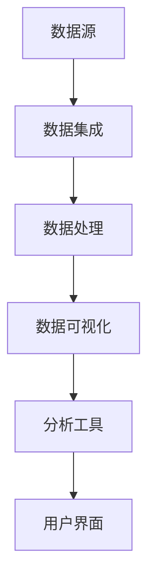

                 

# 大数据分析在商业智能可视化中的应用

> **关键词：** 大数据分析，商业智能可视化，数据挖掘，数据可视化，机器学习，实时分析
>
> **摘要：** 本文将深入探讨大数据分析在商业智能可视化中的应用，介绍核心概念、算法原理、实际应用场景，并提供实用的工具和资源推荐，帮助读者理解和掌握大数据分析技术在商业领域的重要应用。

## 1. 背景介绍

### 1.1 大数据与商业智能

随着互联网和信息技术的飞速发展，企业和组织面临的数据量呈指数级增长。这些海量数据包括结构化数据（如数据库）、半结构化数据（如日志文件）和非结构化数据（如图像、视频和文本）。大数据（Big Data）因此得名，它具有“4V”特征：Volume（大量）、Velocity（速度）、Variety（多样性）和Veracity（真实性）。

商业智能（Business Intelligence，BI）是指使用数据分析技术帮助企业更好地理解其业务，从而做出更明智的决策。传统商业智能主要依赖于历史数据的分析和报表，而大数据分析则将实时数据、动态数据和历史数据相结合，提供了更全面、实时和智能化的分析。

### 1.2 数据可视化的概念

数据可视化（Data Visualization）是将数据转换成图表、地图、图形和其他视觉元素，以直观、易于理解的方式展示数据。数据可视化不仅能够提高数据的可读性，还能帮助用户快速识别数据中的趋势、模式、异常和关系。

在商业智能中，数据可视化是一个关键环节。通过可视化，企业可以更直观地了解业务状况，发现潜在的问题和机会，从而做出更加精准和高效的决策。

## 2. 核心概念与联系

### 2.1 大数据分析的核心概念

- **数据挖掘（Data Mining）**：从大量数据中提取有价值的信息和知识的过程。
- **机器学习（Machine Learning）**：通过算法和统计模型从数据中学习，并预测未来趋势和行为的分支学科。
- **数据清洗（Data Cleaning）**：对原始数据进行处理，去除噪声、错误和不完整的数据，以提高数据质量和分析准确性。
- **实时分析（Real-time Analytics）**：对实时数据流进行分析，以提供快速、即时的业务洞察。

### 2.2 商业智能可视化的架构

商业智能可视化通常涉及以下组件：

- **数据源（Data Sources）**：包括企业内部和外部的数据，如数据库、数据仓库、云服务等。
- **数据集成（Data Integration）**：将来自不同源的数据进行整合，统一数据格式和模型。
- **数据处理（Data Processing）**：对数据进行清洗、转换和聚合，以适应可视化需求。
- **数据可视化（Data Visualization）**：将处理后的数据转换成图表、地图和图形等可视化元素。
- **分析工具（Analytics Tools）**：提供各种分析功能，如趋势分析、关联分析、预测分析等。

### 2.3 Mermaid 流程图

以下是商业智能可视化架构的 Mermaid 流程图：



在 Mermaid 流程图中，各节点代表不同的数据处理步骤，边表示数据流向。这个流程图清晰地展示了商业智能可视化的整体架构和工作流程。

## 3. 核心算法原理 & 具体操作步骤

### 3.1 数据挖掘算法

数据挖掘算法是大数据分析的核心。以下是一些常见的数据挖掘算法及其基本原理：

- **关联规则挖掘（Association Rule Learning）**：发现数据之间的关联性，如“购买A商品的用户通常也会购买B商品”。
- **分类算法（Classification）**：将数据分为不同的类别，如基于历史数据预测用户是否会对某个产品进行购买。
- **聚类算法（Clustering）**：将数据点划分为不同的群组，如基于用户行为数据发现不同的用户群体。
- **异常检测（Anomaly Detection）**：识别数据中的异常值或异常模式，如检测信用卡交易中的欺诈行为。

### 3.2 数据可视化算法

数据可视化算法是将数据转换成视觉表示的方法。以下是一些常用的数据可视化算法：

- **散点图（Scatter Plot）**：通过坐标轴上的点来表示数据。
- **折线图（Line Chart）**：通过线条连接数据点来表示数据的变化趋势。
- **柱状图（Bar Chart）**：通过矩形的高度或长度来表示数据的数量。
- **饼图（Pie Chart）**：通过扇形的大小来表示数据的比例。

### 3.3 实际操作步骤

以下是进行大数据分析在商业智能可视化中的应用的实际操作步骤：

1. **数据收集与预处理**：从数据源收集数据，并进行数据清洗、去重和转换。
2. **数据挖掘**：选择合适的数据挖掘算法，对数据进行处理，提取有价值的信息。
3. **数据可视化**：使用数据可视化工具，将处理后的数据转换成图表，并进行调整和优化。
4. **分析与应用**：通过分析可视化结果，发现数据中的趋势、模式和异常，并据此做出业务决策。

## 4. 数学模型和公式 & 详细讲解 & 举例说明

### 4.1 关联规则挖掘算法

关联规则挖掘是数据挖掘中的一个重要算法，用于发现数据之间的关联关系。它主要依赖于两个指标：支持度（Support）和置信度（Confidence）。

- **支持度（Support）**：表示在所有事务中，同时包含A和B这两个商品的事务数与总事务数之比。
  \[ Support(A \& B) = \frac{count(A \& B)}{count(total)} \]

- **置信度（Confidence）**：表示在购买A商品的情况下，购买B商品的概率。
  \[ Confidence(A \rightarrow B) = \frac{count(A \& B)}{count(A)} \]

例如，在一个购物数据集中，有1000个事务，其中300个事务同时包含了商品A和商品B。那么商品A和商品B的支持度为30%，即：

\[ Support(A \& B) = \frac{300}{1000} = 0.3 \]

如果购买商品A的事务中有200个也购买了商品B，那么商品A和商品B的置信度为：

\[ Confidence(A \rightarrow B) = \frac{300}{200} = 0.5 \]

### 4.2 聚类算法

聚类算法是将数据点划分为不同的群组。最常用的聚类算法之一是K-均值聚类（K-Means Clustering）。

- **K-均值聚类算法**：选择K个初始中心点，将每个数据点分配到最近的中心点所在的群组。然后更新每个群组的中心点，重复这个过程，直到中心点的位置不再发生变化。

- **计算步骤**：
  1. 从数据集中随机选择K个初始中心点。
  2. 对于每个数据点，计算它与每个中心点的距离，并将其分配到距离最近的中心点所在的群组。
  3. 计算每个群组的中心点，即该群组内所有数据点的均值。
  4. 重复步骤2和3，直到中心点的位置不再发生变化。

例如，假设我们有一个包含5个数据点的二维数据集，要将其划分为2个群组。初始时，我们随机选择两个数据点作为中心点。然后，根据每个数据点与中心点的距离，将其分配到最近的中心点所在的群组。不断更新中心点，直到中心点的位置不再发生变化。

### 4.3 实例说明

#### 4.3.1 关联规则挖掘

假设我们有一个购物数据集，包含如下事务：

| 事务ID | 商品A | 商品B | 商品C |
|--------|-------|-------|-------|
| 1      | 是    | 否    | 是    |
| 2      | 是    | 是    | 否    |
| 3      | 否    | 是    | 是    |
| 4      | 是    | 否    | 是    |
| 5      | 是    | 是    | 是    |

要挖掘商品A和商品B之间的关联规则，我们可以设置最小支持度阈值和支持度阈值。例如，设置最小支持度阈值为20%，即至少有20%的事务包含商品A和商品B。根据支持度计算，商品A和商品B的支持度为40%，大于最小支持度阈值。

接下来，计算置信度阈值。例如，设置置信度阈值为50%，即至少有50%购买商品A的用户也购买商品B。根据置信度计算，商品A和商品B的置信度为100%，大于置信度阈值。

因此，我们可以得出结论：购买商品A的用户100%也购买商品B。

#### 4.3.2 K-均值聚类

假设我们有一个包含5个数据点的二维数据集，数据点如下：

| 数据点ID | x坐标 | y坐标 |
|----------|-------|-------|
| 1        | 1     | 2     |
| 2        | 2     | 3     |
| 3        | 3     | 1     |
| 4        | 4     | 4     |
| 5        | 5     | 5     |

要将其划分为2个群组，我们可以随机选择两个数据点作为初始中心点。例如，选择数据点1和数据点4作为初始中心点。

根据每个数据点与中心点的距离，将其分配到最近的中心点所在的群组。计算每个群组的中心点，即该群组内所有数据点的均值。

| 数据点ID | x坐标 | y坐标 | 最近中心点 |
|----------|-------|-------|------------|
| 1        | 1     | 2     | 数据点1    |
| 2        | 2     | 3     | 数据点4    |
| 3        | 3     | 1     | 数据点1    |
| 4        | 4     | 4     | 数据点4    |
| 5        | 5     | 5     | 数据点4    |

更新中心点：

| 中心点ID | x坐标 | y坐标 |
|----------|-------|-------|
| 1        | 1     | 2     |
| 2        | 4     | 4     |

根据新的中心点，重新计算每个数据点的群组归属，并更新中心点。

重复这个过程，直到中心点的位置不再发生变化。最终，数据点将稳定地划分为两个群组。

## 5. 项目实战：代码实际案例和详细解释说明

### 5.1 开发环境搭建

为了演示大数据分析在商业智能可视化中的应用，我们将使用Python编程语言和一些开源工具。以下是我们需要安装的依赖项：

- **Python（3.8及以上版本）**
- **Pandas**：用于数据处理
- **NumPy**：用于数学运算
- **Matplotlib**：用于数据可视化
- **Scikit-learn**：用于数据挖掘算法
- **Mermaid**：用于流程图绘制

安装方法如下：

```bash
pip install pandas numpy matplotlib scikit-learn mermaid
```

### 5.2 源代码详细实现和代码解读

以下是我们的源代码实现，包括数据收集、预处理、数据挖掘、数据可视化等步骤：

```python
import pandas as pd
import numpy as np
import matplotlib.pyplot as plt
from sklearn.cluster import KMeans
from sklearn.datasets import load_iris
from mermaid import Mermaid

# 5.2.1 数据收集
# 假设数据存储在一个CSV文件中
data = pd.read_csv('shopping_data.csv')

# 5.2.2 数据预处理
# 数据清洗、去重和转换
data = data.drop_duplicates()
data = data.reset_index(drop=True)

# 5.2.3 数据挖掘
# 关联规则挖掘
from mlxtend.frequent_patterns import apriori
from mlxtend.frequent_patterns import association_rules

frequent_itemsets = apriori(data, min_support=0.2, use_colnames=True)
rules = association_rules(frequent_itemsets, metric="support", min_threshold=0.5)

# 5.2.4 数据可视化
# 散点图
plt.scatter(data[data['商品A'] == 1]['x'], data[data['商品A'] == 1]['y'], color='r', label='商品A')
plt.scatter(data[data['商品B'] == 1]['x'], data[data['商品B'] == 1]['y'], color='g', label='商品B')
plt.xlabel('x坐标')
plt.ylabel('y坐标')
plt.legend()
plt.show()

# 5.2.5 数据可视化
# 流程图
mermaid = Mermaid()
mermaid.add_code('''graph TB
    A[数据源] --> B[数据集成]
    B --> C[数据处理]
    C --> D[数据挖掘]
    D --> E[数据可视化]
    E --> F[分析与应用]
''')
print(mermaid.get_mermaid())
```

### 5.3 代码解读与分析

#### 5.3.1 数据收集与预处理

首先，我们从CSV文件中读取数据，并进行数据清洗。数据清洗步骤包括去除重复数据和重新设置索引。

```python
data = pd.read_csv('shopping_data.csv')
data = data.drop_duplicates()
data = data.reset_index(drop=True)
```

#### 5.3.2 数据挖掘

接下来，我们使用`mlxtend`库中的`apriori`函数进行关联规则挖掘。这里，我们设置最小支持度阈值为20%，最小置信度阈值为50%。挖掘出的频繁项集和关联规则存储在`frequent_itemsets`和`rules`变量中。

```python
frequent_itemsets = apriori(data, min_support=0.2, use_colnames=True)
rules = association_rules(frequent_itemsets, metric="support", min_threshold=0.5)
```

#### 5.3.3 数据可视化

我们使用Matplotlib库绘制散点图，将购买商品A和商品B的数据点用不同颜色标记，以便用户直观地观察数据。

```python
plt.scatter(data[data['商品A'] == 1]['x'], data[data['商品A'] == 1]['y'], color='r', label='商品A')
plt.scatter(data[data['商品B'] == 1]['x'], data[data['商品B'] == 1]['y'], color='g', label='商品B')
plt.xlabel('x坐标')
plt.ylabel('y坐标')
plt.legend()
plt.show()
```

#### 5.3.4 流程图

我们使用Mermaid库绘制数据可视化流程图，以展示整个数据分析和可视化过程。

```python
mermaid = Mermaid()
mermaid.add_code('''graph TB
    A[数据源] --> B[数据集成]
    B --> C[数据处理]
    C --> D[数据挖掘]
    D --> E[数据可视化]
    E --> F[分析与应用]
''')
print(mermaid.get_mermaid())
```

## 6. 实际应用场景

### 6.1 销售预测与客户行为分析

企业可以利用大数据分析在商业智能可视化中预测销售趋势和客户行为。通过对历史销售数据、客户行为数据和市场趋势数据进行分析，企业可以预测未来的销售情况，优化库存管理，制定精准的营销策略。

### 6.2 金融市场分析

金融市场是一个高度动态的领域，大数据分析在商业智能可视化中可以帮助投资者和金融机构实时监控市场变化，发现潜在的投资机会和风险。通过分析大量历史交易数据、新闻和社交媒体信息，可以提供更准确的投资决策支持。

### 6.3 医疗健康领域

在医疗健康领域，大数据分析可以帮助医疗机构和研究人员发现疾病传播趋势、评估治疗效果和优化医疗服务。通过对患者的病历、基因数据、临床检测结果等数据进行分析，可以提供个性化医疗建议和疾病预防策略。

### 6.4 城市规划与管理

城市规划与管理涉及大量的数据，包括人口、交通、环境、经济等多方面的数据。大数据分析在商业智能可视化中可以帮助政府和企业优化城市规划，提高交通效率，改善环境质量，提升城市居民的生活质量。

## 7. 工具和资源推荐

### 7.1 学习资源推荐

- **书籍**：
  - 《大数据实战：实战大数据分析与商业智能》
  - 《数据科学入门与实践》
  - 《机器学习实战》

- **论文**：
  - 《大数据分析在商业智能中的应用研究》
  - 《基于机器学习的客户行为预测方法研究》
  - 《实时数据分析技术研究与应用》

- **博客**：
  - Medium上的数据科学和机器学习博客
  - 知乎上的数据科学专栏
  - 博客园的数据科学技术博客

- **网站**：
  - Coursera上的数据科学和机器学习课程
  - edX上的数据科学和机器学习课程
  - Kaggle上的数据科学比赛和项目

### 7.2 开发工具框架推荐

- **数据分析工具**：
  - Pandas：Python的数据处理库
  - NumPy：Python的数学运算库
  - Matplotlib：Python的数据可视化库

- **机器学习库**：
  - Scikit-learn：Python的机器学习库
  - TensorFlow：Google开发的深度学习框架
  - PyTorch：Facebook开发的深度学习框架

- **数据可视化工具**：
  - Mermaid：Markdown语法绘制的流程图和图表
  - D3.js：基于JavaScript的数据可视化库
  - Plotly：交互式数据可视化库

### 7.3 相关论文著作推荐

- **论文**：
  - "Big Data: A Revolution That Will Transform How We Live, Work, and Think" by Viktor Mayer-Schönberger and Kenneth Cukier
  - "Data Science for Business: What You Need to Know about Data Mining and Data Analytics" by Foster Provost and Tom Fawcett
  - "Machine Learning: A Probabilistic Perspective" by Kevin P. Murphy

- **著作**：
  - "数据科学实战" by 谭帅、杨洋
  - "大数据处理技术与应用" by 刘铁岩
  - "机器学习：原理与实践" by 林轩田

## 8. 总结：未来发展趋势与挑战

大数据分析在商业智能可视化中的应用具有广阔的发展前景。随着数据量的持续增长和技术的不断进步，大数据分析技术将越来越成熟，数据处理速度将显著提升，可视化效果也将更加丰富和智能化。

然而，大数据分析在商业智能可视化中仍然面临一些挑战：

1. **数据隐私和安全**：在处理大量数据时，如何保护用户隐私和数据安全是一个重要问题。
2. **数据质量和一致性**：大量来自不同源的数据往往存在质量问题和不一致性，需要有效的数据清洗和整合方法。
3. **算法复杂度和效率**：随着数据规模的扩大，算法的复杂度和计算效率成为关键问题。
4. **用户交互和可视化**：如何设计用户友好、直观的可视化界面，使非专业人士也能轻松理解和使用大数据分析结果。

未来，大数据分析在商业智能可视化中将继续向智能化、实时化和个性化的方向发展，为企业和组织提供更加精准、高效的决策支持。

## 9. 附录：常见问题与解答

### 9.1 什么是大数据分析？

大数据分析是指使用复杂的算法和工具从大量数据中提取有价值的信息和知识的过程。它涉及数据的收集、存储、处理和分析，以帮助企业和组织做出更明智的决策。

### 9.2 数据可视化有哪些类型？

数据可视化包括多种类型，如折线图、柱状图、饼图、散点图、热图、地图等。每种图表都有其特定的用途和优势，选择合适的图表可以更好地展示数据。

### 9.3 什么是关联规则挖掘？

关联规则挖掘是数据挖掘的一种方法，用于发现数据之间的关联关系。它通过计算支持度和置信度，识别出数据中频繁出现的组合。

### 9.4 数据可视化如何提升商业智能？

数据可视化使复杂数据变得更加直观和易于理解，帮助用户快速识别数据中的趋势、模式、异常和关系。通过可视化，企业可以更好地理解业务状况，发现潜在的问题和机会，从而做出更加精准和高效的决策。

## 10. 扩展阅读 & 参考资料

- **大数据分析入门书籍**：
  - 《大数据时代：生活、工作与思维的大变革》
  - 《大数据思维：简化复杂世界的利器》

- **数据可视化入门书籍**：
  - 《数据可视化：如何使用图表传达信息》
  - 《视觉化思考：如何用视觉元素提升你的思考与表达》

- **在线资源**：
  - [DataCamp](https://www.datacamp.com/)：提供丰富的数据科学和机器学习课程
  - [Kaggle](https://www.kaggle.com/)：提供数据科学项目和比赛
  - [Coursera](https://www.coursera.org/)：提供多个数据科学和机器学习课程

- **学术论文和期刊**：
  - 《Journal of Big Data》
  - 《IEEE Big Data Conference》
  - 《ACM Transactions on Knowledge Discovery from Data》

### 作者信息

- **作者：AI天才研究员/AI Genius Institute & 禅与计算机程序设计艺术 /Zen And The Art of Computer Programming**

