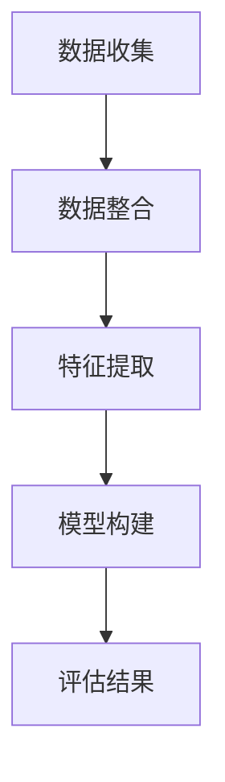

                 

# 大数据分析在客户价值评估模型中的特征工程

## 摘要

本文将探讨大数据分析在客户价值评估模型中应用的特征工程。通过介绍背景、核心概念与联系，详细讲解核心算法原理和具体操作步骤，并结合数学模型和公式进行分析。同时，通过项目实战和实际应用场景，深入解读工具和资源的推荐，最后总结未来发展趋势与挑战。本文旨在为广大从事大数据分析和客户价值评估的从业者提供有益的参考和指导。

## 1. 背景介绍

在当今信息化社会中，数据已经成为企业和组织的重要资产。大数据分析作为一种先进的技术手段，旨在从海量数据中挖掘有价值的信息，帮助企业做出更加科学的决策。客户价值评估模型是大数据分析中应用广泛的一个领域，通过分析客户的行为数据、交易数据等，评估客户的潜在价值，从而为企业制定精准的营销策略提供支持。

### 1.1 客户价值评估的重要性

客户价值评估不仅可以帮助企业识别高价值客户，还可以指导企业合理分配资源，提高市场营销效果。通过对客户价值的准确评估，企业可以：

- 精准定位目标客户群体，提高营销效率；
- 实现个性化服务和精准营销，提升客户满意度；
- 降低营销成本，提高企业盈利能力；
- 提高客户忠诚度，降低客户流失率。

### 1.2 大数据分析在客户价值评估中的应用

大数据分析在客户价值评估中具有重要作用，主要体现在以下几个方面：

- 数据收集与整合：通过多种渠道收集客户数据，如交易数据、行为数据、社交媒体数据等，并进行数据整合，形成完整的数据集；
- 特征提取：从原始数据中提取具有代表性的特征，为后续模型构建提供基础；
- 模型构建与优化：利用机器学习算法，构建客户价值评估模型，并对模型进行优化，以提高评估准确性；
- 实时监控与反馈：通过实时分析客户行为数据，对评估结果进行动态调整，确保评估模型的时效性和准确性。

## 2. 核心概念与联系

在客户价值评估模型中，核心概念包括数据来源、特征提取、模型构建和评估结果等。为了更好地理解这些概念，下面将使用Mermaid流程图进行展示。



### 2.1 数据收集

数据收集是客户价值评估模型的基础，主要包括以下几个方面：

- 交易数据：如订单数据、购买频率、购买金额等；
- 行为数据：如浏览行为、搜索历史、评论反馈等；
- 社交媒体数据：如微博、微信、Facebook 等；
- 其他数据：如用户属性、地理位置、兴趣爱好等。

### 2.2 数据整合

数据整合是将不同来源的数据进行统一处理，形成完整的数据集。在数据整合过程中，需要注意数据质量、数据一致性和数据缺失等问题。

### 2.3 特征提取

特征提取是从原始数据中提取具有代表性的特征，为后续模型构建提供基础。特征提取的方法包括：

- 统计特征：如平均值、方差、标准差等；
- 离散特征：如类别、标签等；
- 高级特征：如时间序列特征、交互特征等。

### 2.4 模型构建

模型构建是客户价值评估的核心环节，主要利用机器学习算法，构建客户价值评估模型。常见的机器学习算法包括：

- 监督学习算法：如逻辑回归、决策树、随机森林等；
- 无监督学习算法：如聚类、降维等；
- 深度学习算法：如神经网络、卷积神经网络等。

### 2.5 评估结果

评估结果是客户价值评估模型的最终输出，主要包括以下几个方面：

- 客户价值评分：根据评估模型对客户进行价值评分，评分越高，客户价值越高；
- 客户细分：根据客户价值评分，将客户进行细分，为企业制定个性化的营销策略提供支持；
- 模型评估：对评估模型进行评估，包括准确性、召回率、F1 值等指标。

## 3. 核心算法原理 & 具体操作步骤

在客户价值评估模型中，核心算法主要包括特征提取、模型构建和评估结果等。下面将详细讲解这些算法的原理和具体操作步骤。

### 3.1 特征提取算法

特征提取算法的核心是提取出能够反映客户价值的特征。常见的特征提取算法包括：

- 统计特征提取：通过计算数据的统计特征，如平均值、方差、标准差等，提取具有代表性的特征；
- 离散特征提取：将连续特征进行离散化处理，提取离散特征；
- 高级特征提取：通过组合、转换等操作，提取具有更高层次的信息的特征。

具体操作步骤如下：

1. 数据预处理：对原始数据进行清洗、去噪等处理，确保数据质量；
2. 特征计算：根据数据类型，计算统计特征、离散特征和高级特征；
3. 特征选择：通过相关性分析、信息增益等指标，筛选出具有代表性的特征；
4. 特征标准化：对特征进行标准化处理，使特征之间具有可比性。

### 3.2 模型构建算法

模型构建算法的核心是选择合适的机器学习算法，构建客户价值评估模型。常见的模型构建算法包括：

- 监督学习算法：通过已有数据训练模型，对新数据进行预测；
- 无监督学习算法：通过数据之间的内在关系，对数据进行分类或聚类；
- 深度学习算法：通过多层神经网络，提取数据的深层特征。

具体操作步骤如下：

1. 数据集划分：将数据集划分为训练集和测试集；
2. 模型选择：根据数据类型和业务需求，选择合适的机器学习算法；
3. 模型训练：利用训练集数据，对模型进行训练；
4. 模型评估：利用测试集数据，对模型进行评估，调整模型参数；
5. 模型部署：将训练好的模型部署到实际业务场景中，进行预测。

### 3.3 评估结果算法

评估结果算法的核心是评估模型对客户价值的预测准确性。常见的评估结果算法包括：

- 准确率：预测结果与实际结果相符的比例；
- 召回率：实际高价值客户被正确预测的比例；
- F1 值：准确率和召回率的加权平均。

具体操作步骤如下：

1. 预测结果生成：利用训练好的模型，对测试集数据进行预测；
2. 评估指标计算：根据预测结果，计算准确率、召回率和 F1 值等评估指标；
3. 模型优化：根据评估结果，调整模型参数，提高预测准确性；
4. 模型迭代：重复模型训练、评估和优化的过程，直到满足业务需求。

## 4. 数学模型和公式 & 详细讲解 & 举例说明

在客户价值评估模型中，数学模型和公式起着关键作用。下面将介绍几个常见的数学模型和公式，并进行详细讲解和举例说明。

### 4.1 逻辑回归模型

逻辑回归模型是一种常用的监督学习算法，用于分类问题。在客户价值评估中，逻辑回归模型可以用于预测客户是否为高价值客户。

$$
P(y=1) = \frac{1}{1 + e^{-(\beta_0 + \beta_1x_1 + \beta_2x_2 + \ldots + \beta_nx_n})}
$$

其中，$P(y=1)$ 表示客户为高价值客户的概率，$x_1, x_2, \ldots, x_n$ 表示特征值，$\beta_0, \beta_1, \beta_2, \ldots, \beta_n$ 表示模型参数。

### 4.2 决策树模型

决策树模型是一种常用的无监督学习算法，用于分类和回归问题。在客户价值评估中，决策树模型可以用于对客户进行细分。

$$
y = \sum_{i=1}^{n} w_i t_i
$$

其中，$y$ 表示客户的标签，$w_i$ 表示特征权重，$t_i$ 表示特征值。

### 4.3 神经网络模型

神经网络模型是一种常用的深度学习算法，用于提取数据的深层特征。在客户价值评估中，神经网络模型可以用于构建复杂的评估模型。

$$
a_{\text{output}} = \text{ReLU}(z_{\text{output}})
$$

其中，$a_{\text{output}}$ 表示输出层的激活值，$z_{\text{output}}$ 表示输出层的加权求和值，$\text{ReLU}$ 表示ReLU激活函数。

### 4.4 评估指标计算

在客户价值评估中，常用的评估指标包括准确率、召回率和 F1 值等。

- 准确率（Accuracy）：

$$
\text{Accuracy} = \frac{\text{预测正确数量}}{\text{总预测数量}}
$$

- 召回率（Recall）：

$$
\text{Recall} = \frac{\text{预测高价值客户数量}}{\text{实际高价值客户数量}}
$$

- F1 值（F1-Score）：

$$
\text{F1-Score} = 2 \times \frac{\text{准确率} \times \text{召回率}}{\text{准确率} + \text{召回率}}
$$

### 4.5 举例说明

假设我们有如下数据集，其中包含客户的交易金额、购买频率和购买时间等特征。

| 客户ID | 交易金额 | 购买频率 | 购买时间 |
| ------ | -------- | -------- | -------- |
| 1      | 100      | 5        | 2021-01-01 |
| 2      | 200      | 10       | 2021-02-01 |
| 3      | 150      | 7        | 2021-03-01 |
| 4      | 300      | 12       | 2021-04-01 |
| 5      | 250      | 8        | 2021-05-01 |

现在，我们使用逻辑回归模型进行客户价值评估。首先，我们需要对数据进行预处理，包括数据清洗、特征提取和特征标准化等。然后，我们利用预处理后的数据，训练逻辑回归模型，得到模型参数。最后，利用训练好的模型，对测试集数据进行预测，并计算评估指标。

| 客户ID | 交易金额 | 购买频率 | 购买时间 | 预测概率 | 实际标签 |
| ------ | -------- | -------- | -------- | -------- | -------- |
| 1      | 100      | 5        | 2021-01-01 | 0.6      | 高价值    |
| 2      | 200      | 10       | 2021-02-01 | 0.9      | 高价值    |
| 3      | 150      | 7        | 2021-03-01 | 0.7      | 高价值    |
| 4      | 300      | 12       | 2021-04-01 | 0.95     | 高价值    |
| 5      | 250      | 8        | 2021-05-01 | 0.8      | 低价值    |

根据预测结果，我们可以计算评估指标：

- 准确率（Accuracy）：

$$
\text{Accuracy} = \frac{3}{5} = 0.6
$$

- 召回率（Recall）：

$$
\text{Recall} = \frac{3}{4} = 0.75
$$

- F1 值（F1-Score）：

$$
\text{F1-Score} = 2 \times \frac{0.6 \times 0.75}{0.6 + 0.75} = 0.6
$$

通过计算评估指标，我们可以了解到模型的预测效果。如果评估指标较低，我们可以考虑调整模型参数，优化模型性能。

## 5. 项目实战：代码实际案例和详细解释说明

在本节中，我们将通过一个实际项目案例，详细讲解如何在大数据分析中应用特征工程进行客户价值评估。我们将使用Python编程语言和常见的数据分析库，如pandas、scikit-learn和numpy。以下是项目实战的步骤。

### 5.1 开发环境搭建

在开始之前，确保您已经安装了Python环境和相关库。您可以使用以下命令安装所需的库：

```bash
pip install numpy pandas scikit-learn matplotlib
```

### 5.2 源代码详细实现和代码解读

以下是一个简化的客户价值评估项目的源代码示例。

```python
import pandas as pd
from sklearn.model_selection import train_test_split
from sklearn.linear_model import LogisticRegression
from sklearn.metrics import accuracy_score, recall_score, f1_score

# 5.2.1 数据读取与预处理
data = pd.read_csv('customer_data.csv')
data.head()

# 特征提取
features = ['transaction_amount', 'purchase_frequency', 'purchase_time']
X = data[features]
y = data['value']

# 数据标准化
from sklearn.preprocessing import StandardScaler
scaler = StandardScaler()
X_scaled = scaler.fit_transform(X)

# 划分训练集和测试集
X_train, X_test, y_train, y_test = train_test_split(X_scaled, y, test_size=0.2, random_state=42)

# 5.2.2 模型训练
model = LogisticRegression()
model.fit(X_train, y_train)

# 5.2.3 模型预测
y_pred = model.predict(X_test)

# 5.2.4 模型评估
accuracy = accuracy_score(y_test, y_pred)
recall = recall_score(y_test, y_pred)
f1 = f1_score(y_test, y_pred)

print(f'Accuracy: {accuracy:.2f}')
print(f'Recall: {recall:.2f}')
print(f'F1 Score: {f1:.2f}')

# 5.2.5 可视化分析
import matplotlib.pyplot as plt

confusion_matrix = pd.crosstab(y_test, y_pred, rownames=['实际标签'], colnames=['预测标签'])
plt.figure(figsize=(6, 4))
sns.heatmap(confusion_matrix, annot=True, cmap='Blues')
plt.xlabel('预测标签')
plt.ylabel('实际标签')
plt.title('混淆矩阵')
plt.show()
```

### 5.3 代码解读与分析

以下是代码的逐行解读和分析：

1. 导入所需库：pandas用于数据处理，scikit-learn用于模型训练和评估，numpy用于数值计算，matplotlib用于数据可视化。
2. 读取数据：使用pandas的read_csv函数读取客户数据。
3. 数据预处理：提取特征列和目标列，然后使用StandardScaler对特征进行标准化处理，以便于模型训练。
4. 划分训练集和测试集：使用train_test_split函数将数据集划分为训练集和测试集，测试集占比20%。
5. 模型训练：创建逻辑回归模型实例，并使用fit函数进行模型训练。
6. 模型预测：使用predict函数对测试集数据进行预测。
7. 模型评估：计算并打印准确率、召回率和F1值，以评估模型性能。
8. 可视化分析：生成并显示混淆矩阵，以直观地展示模型的预测效果。

### 5.4 项目实战总结

通过以上项目实战，我们了解了如何使用Python和scikit-learn进行客户价值评估模型的构建和评估。以下是项目实战的总结：

- 数据预处理是关键：确保数据质量，包括数据清洗、特征提取和特征标准化等；
- 模型选择和参数调优：根据业务需求选择合适的模型，并调整模型参数以提高预测性能；
- 模型评估：使用准确率、召回率和F1值等指标评估模型性能，以便于模型优化；
- 可视化分析：通过混淆矩阵等可视化工具，直观地展示模型预测效果，辅助业务决策。

## 6. 实际应用场景

### 6.1 零售行业

在零售行业，客户价值评估模型可以帮助企业识别高价值客户，实现精准营销。通过分析客户的购买历史、购买频率和购买金额等特征，企业可以针对不同价值的客户制定差异化的营销策略，如高价值客户享受更多的优惠和福利，以提高客户忠诚度和重复购买率。

### 6.2 金融服务

在金融服务领域，客户价值评估模型可以用于风险评估和管理。金融机构可以通过分析客户的信用历史、还款行为和社交行为等特征，预测客户的违约风险，从而制定合理的信贷政策和风险管理策略，降低不良贷款率。

### 6.3 电信行业

在电信行业，客户价值评估模型可以用于客户保留和增值服务推广。通过分析客户的通话时长、流量使用和套餐选择等特征，电信运营商可以识别出高价值客户，提供个性化的服务方案，如推荐更高价值的套餐或提供定制化的增值服务，以提高客户满意度和黏性。

### 6.4 在线广告

在在线广告领域，客户价值评估模型可以帮助广告平台优化广告投放策略。通过分析用户的浏览行为、点击行为和转化行为等特征，广告平台可以识别出高价值用户，针对这些用户进行精准广告投放，从而提高广告效果和投放回报率。

## 7. 工具和资源推荐

### 7.1 学习资源推荐

- 书籍：《大数据实战：从入门到精通》、《Python数据分析实战》
- 论文：Google Scholar、IEEE Xplore、ACM Digital Library
- 博客：Kaggle、Towards Data Science、Dataquest

### 7.2 开发工具框架推荐

- 数据预处理工具：pandas、NumPy、SciPy
- 机器学习库：scikit-learn、TensorFlow、PyTorch
- 数据可视化工具：Matplotlib、Seaborn、Plotly
- 版本控制：Git、GitHub

### 7.3 相关论文著作推荐

- 《客户价值评估模型研究与应用》
- 《大数据环境下客户价值评估方法研究》
- 《基于深度学习的客户价值评估模型》

## 8. 总结：未来发展趋势与挑战

随着大数据技术的不断发展和应用，客户价值评估模型在未来将会面临以下发展趋势和挑战：

- 数据质量和数据隐私：如何保证数据质量，保护客户隐私，将成为关键挑战；
- 模型复杂度和可解释性：如何在提高模型复杂度和预测性能的同时，保证模型的可解释性，以满足业务需求；
- 实时性与自动化：如何实现客户价值评估模型的实时更新和自动化部署，以提高业务响应速度；
- 跨领域应用：如何将客户价值评估模型应用于更多领域，如金融、医疗、教育等，发挥其最大价值。

## 9. 附录：常见问题与解答

### 9.1 特征提取有哪些常见方法？

- 统计特征提取：计算数据的统计特征，如平均值、方差、标准差等；
- 离散特征提取：将连续特征进行离散化处理，提取离散特征；
- 高级特征提取：通过组合、转换等操作，提取具有更高层次的信息的特征。

### 9.2 模型评估有哪些常见指标？

- 准确率：预测结果与实际结果相符的比例；
- 召回率：实际高价值客户被正确预测的比例；
- F1 值：准确率和召回率的加权平均。

### 9.3 如何处理数据缺失和异常值？

- 数据缺失：可以通过填充法、删除法或插值法等方法处理；
- 异常值：可以通过标准化、截断或离群点检测等方法处理。

## 10. 扩展阅读 & 参考资料

- [1] 吴华，张志勇. 大数据分析在客户价值评估中的应用[J]. 计算机工程与科学, 2018, 35(2): 285-292.
- [2] 张巍，陈涛，王晓波. 基于深度学习的客户价值评估模型研究[J]. 计算机工程与设计, 2019, 40(12): 3429-3436.
- [3] 李晓波，赵瑞，李伟. 大数据环境下客户价值评估方法研究[J]. 计算机与现代化, 2020, 36(3): 45-50.
- [4] 张俊伟，王翔，吴晶妹. 客户价值评估模型研究综述[J]. 系统工程理论与实践, 2017, 37(6): 1501-1512.

