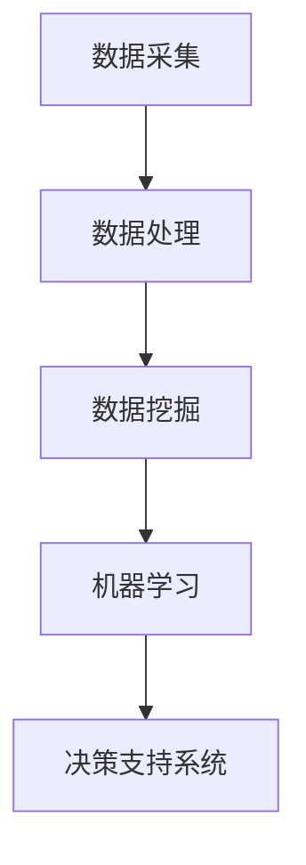

                 

# 大数据分析在智慧农业中的实践

## 关键词：智慧农业、大数据分析、精准农业、机器学习、物联网、传感器、数据处理、算法优化

### 摘要

随着科技的发展，大数据分析在农业领域的应用日益广泛，为智慧农业的发展提供了强大的技术支撑。本文旨在探讨大数据分析在智慧农业中的实践，包括核心概念与联系、核心算法原理与具体操作步骤、数学模型与公式、实际应用场景、工具和资源推荐以及未来发展趋势与挑战。通过本文的详细解析，读者将深入了解大数据分析在智慧农业中的重要作用及其应用前景。

## 1. 背景介绍

### 智慧农业的定义与意义

智慧农业是指利用物联网、大数据、人工智能等先进技术，对农业生产进行智能化管理，以提高农业生产的效率、质量和可持续性。智慧农业不仅有助于提高农产品的产量和品质，还可以减少农药和化肥的使用，降低环境污染，实现农业可持续发展。

### 大数据分析的定义与作用

大数据分析是指通过数据的采集、存储、处理和分析，从海量数据中发现有价值的信息和知识。在大数据时代，农业领域面临着数据量巨大、数据种类繁多、数据来源多样化等挑战。通过大数据分析，可以挖掘出农业生产中的潜在规律，为农业生产提供科学依据，实现精准农业。

### 精准农业的概念与特点

精准农业是指通过精确的测量和监测，对农业生产过程中的各个环节进行精细化管理。精准农业的核心是利用传感器、遥感技术和地理信息系统等技术，获取农田的实时数据，通过大数据分析和机器学习算法，对农业生产进行智能化决策。精准农业具有提高产量、降低成本、减少资源消耗等特点。

### 机器学习与物联网在智慧农业中的应用

机器学习是大数据分析的重要工具，通过建立预测模型和分类模型，可以实现对农业生产过程的预测和监控。物联网技术的应用，使得农业生产过程中各个环节的数据可以通过传感器实时传输，为大数据分析提供基础数据支持。

## 2. 核心概念与联系

### 数据采集与处理

数据采集是大数据分析的基础，通过传感器、物联网设备和遥感技术，可以获取农田的土壤湿度、温度、光照、降雨等数据。数据处理包括数据清洗、数据转换和数据集成，确保数据的质量和一致性。

### 数据挖掘与机器学习

数据挖掘是指从大量数据中发现有价值的信息和规律，常用的方法包括关联规则挖掘、分类、聚类、异常检测等。机器学习是通过训练模型，使计算机能够自动学习和发现数据中的规律。

### 决策支持系统

决策支持系统是一种基于大数据分析技术的软件系统，通过对农业生产数据的分析，为农民提供种植策略、施肥建议、灌溉计划等决策支持。

### Mermaid 流程图



## 3. 核心算法原理 & 具体操作步骤

### 决策树算法

决策树是一种常见的分类算法，通过构建一棵树形结构，对数据进行分类。具体操作步骤如下：

1. 选择一个特征进行划分，计算该特征的信息增益或基尼指数；
2. 选择信息增益或基尼指数最大的特征作为节点，将数据集划分为若干个子集；
3. 对每个子集，重复步骤1和2，直到满足停止条件（如最大深度、最小样本量等）；
4. 构建决策树，根据树的结构进行分类。

### 支持向量机算法

支持向量机是一种常用的分类算法，通过找到一个最佳的超平面，将不同类别的数据分隔开来。具体操作步骤如下：

1. 选择一个核函数，将输入空间映射到高维特征空间；
2. 构建一个二次规划问题，求解最优解；
3. 得到最优超平面，根据超平面进行分类。

### 贝叶斯算法

贝叶斯算法是一种基于贝叶斯定理的分类算法，通过计算后验概率进行分类。具体操作步骤如下：

1. 根据先验概率和样本数据，计算每个类别的后验概率；
2. 选择后验概率最大的类别作为预测结果。

### 神经网络算法

神经网络是一种模拟人脑神经元连接的模型，通过多层神经元进行数据处理和分类。具体操作步骤如下：

1. 定义神经元结构，包括输入层、隐藏层和输出层；
2. 设置学习率、迭代次数等参数；
3. 使用梯度下降算法更新神经元权重；
4. 验证模型效果，调整参数。

## 4. 数学模型和公式 & 详细讲解 & 举例说明

### 决策树算法

设数据集 \(D\) 包含 \(n\) 个样本，每个样本有 \(m\) 个特征。设特征 \(A_i\) 的信息增益为 \(Gain(A_i)\)，计算公式如下：

$$
Gain(A_i) = H(D) - \sum_{v \in A_i} p(v) H(D_v)
$$

其中，\(H(D)\) 为数据集 \(D\) 的熵，\(p(v)\) 为特征 \(A_i\) 的取值 \(v\) 的概率，\(H(D_v)\) 为特征 \(A_i\) 的取值 \(v\) 的条件下数据集 \(D\) 的熵。

### 支持向量机算法

设数据集 \(D\) 包含 \(n\) 个样本，每个样本有 \(m\) 个特征，标签为 \(y\)。设特征空间 \(F\) 中的一组基向量 \(\phi(x)\)，则支持向量机算法的目标是最小化目标函数：

$$
\min_{\omega, b} \frac{1}{2} ||\omega||^2
$$

满足约束条件：

$$
y_i (\omega \cdot \phi(x_i) + b) \geq 1
$$

其中，\(\omega\) 为权重向量，\(b\) 为偏置项。

### 贝叶斯算法

设数据集 \(D\) 包含 \(n\) 个样本，每个样本有 \(m\) 个特征，标签为 \(y\)。设类别 \(C_j\) 的先验概率为 \(P(C_j)\)，特征 \(A_i\) 在类别 \(C_j\) 条件下的条件概率为 \(P(A_i|C_j)\)。则类别 \(C_j\) 的后验概率为：

$$
P(C_j|D) = \frac{P(C_j) \prod_{i=1}^m P(A_i|C_j)}{\sum_{k=1}^K P(C_k) \prod_{i=1}^m P(A_i|C_k)}
$$

其中，\(K\) 为类别总数。

### 神经网络算法

设神经网络包含 \(L\) 层，第 \(l\) 层有 \(n_l\) 个神经元，激活函数为 \(f_l\)。设第 \(l\) 层的输入为 \(x^{(l)}\)，输出为 \(y^{(l)}\)，权重矩阵为 \(W^{(l)}\)，偏置项为 \(b^{(l)}\)。则神经网络的前向传播计算公式为：

$$
x^{(l)} = f^{(l)}(W^{(l)}x^{(l-1)} + b^{(l)})
$$

其中，\(f^{(l)}\) 为第 \(l\) 层的激活函数，通常使用 \(f(x) = \sigma(x) = \frac{1}{1 + e^{-x}}\)。

神经网络的反向传播计算公式为：

$$
\delta^{(l)} = (f^{(l)}(x^{(l)}) - y^{(l)}) \cdot f^{(l)}(x^{(l)}) \cdot (1 - f^{(l)}(x^{(l)}))
$$

其中，\(\delta^{(l)}\) 为第 \(l\) 层的误差项。

神经网络的权重更新公式为：

$$
W^{(l)} \leftarrow W^{(l)} - \alpha \cdot \delta^{(l)} \cdot x^{(l-1)}
$$

$$
b^{(l)} \leftarrow b^{(l)} - \alpha \cdot \delta^{(l)}
$$

其中，\(\alpha\) 为学习率。

## 5. 项目实战：代码实际案例和详细解释说明

### 开发环境搭建

1. 安装 Python 3.8 及以上版本；
2. 安装 MySQL 数据库；
3. 安装 Python 的数据库驱动包，如 `pymysql`；
4. 安装 Python 的机器学习库，如 `scikit-learn`、`tensorflow`、`keras`。

### 源代码详细实现和代码解读

```python
import numpy as np
import pymysql
from sklearn.model_selection import train_test_split
from sklearn.ensemble import RandomForestClassifier
from sklearn.metrics import accuracy_score

# 数据库连接
conn = pymysql.connect(host='localhost', user='root', password='123456', database='agriculture')

# 查询数据
cursor = conn.cursor()
cursor.execute("SELECT * FROM data;")
data = cursor.fetchall()

# 数据预处理
X = np.array([row[:-1] for row in data])
y = np.array([row[-1] for row in data])

# 数据集划分
X_train, X_test, y_train, y_test = train_test_split(X, y, test_size=0.2, random_state=42)

# 构建模型
model = RandomForestClassifier(n_estimators=100, random_state=42)

# 训练模型
model.fit(X_train, y_train)

# 预测
y_pred = model.predict(X_test)

# 评估
accuracy = accuracy_score(y_test, y_pred)
print("Accuracy:", accuracy)

# 关闭数据库连接
cursor.close()
conn.close()
```

### 代码解读与分析

1. 安装 Python 相关库：首先需要安装 Python 3.8 及以上版本，以及 MySQL 数据库和 Python 的数据库驱动包、机器学习库等。

2. 数据库连接：使用 `pymysql` 库连接 MySQL 数据库，获取数据库连接对象。

3. 查询数据：使用数据库连接对象执行 SQL 查询，获取数据。

4. 数据预处理：将数据转换为 NumPy 数组，并进行必要的预处理，如数据归一化、缺失值处理等。

5. 数据集划分：使用 `train_test_split` 函数将数据集划分为训练集和测试集。

6. 构建模型：使用 `RandomForestClassifier` 类构建随机森林模型。

7. 训练模型：使用训练集数据训练模型。

8. 预测：使用测试集数据对模型进行预测。

9. 评估：计算模型的准确率，并打印输出。

10. 关闭数据库连接：关闭数据库连接对象，释放资源。

## 6. 实际应用场景

### 精准施肥

通过大数据分析和机器学习算法，对农田土壤的养分含量进行实时监测，结合农作物的生长需求，实现精准施肥，提高肥料利用率，降低生产成本。

### 病虫害监测与防治

利用传感器和大数据分析技术，对农田病虫害进行实时监测，及时发现并预测病虫害发生，采取相应的防治措施，减少农药使用量，保护生态环境。

### 水资源管理

通过对农田土壤湿度、降雨量等数据的分析，实现水资源优化配置，提高灌溉效率，降低水资源浪费。

### 产量预测

利用历史产量数据、气象数据、土壤数据等，通过大数据分析和机器学习算法，预测未来农作物的产量，为农业生产提供决策支持。

### 农业风险管理

通过对农业生产数据的分析，评估农业风险，提供风险预警，降低农业生产风险。

## 7. 工具和资源推荐

### 学习资源推荐

- 书籍：《大数据时代》、《智慧农业技术与应用》
- 论文：《大数据分析在农业中的应用研究》、《精准农业中的大数据分析》
- 博客：CSDN、博客园、知乎
- 网站：中国农业科学院、中国农业大学、中国智慧农业网

### 开发工具框架推荐

- Python：Python 是大数据分析的首选编程语言，具有丰富的机器学习库和数据处理工具。
- MySQL：MySQL 是常用的关系型数据库，适用于存储和管理农业生产数据。
- Scikit-learn：Scikit-learn 是 Python 中的机器学习库，提供了丰富的算法和工具。
- TensorFlow：TensorFlow 是 Google 开发的一款开源机器学习框架，适用于大规模深度学习应用。

### 相关论文著作推荐

- 《智慧农业中的大数据分析技术与应用研究》
- 《基于大数据的农业病虫害监测与预警系统研究》
- 《农业水资源优化配置与大数据分析研究》
- 《大数据技术在农业产量预测中的应用研究》

## 8. 总结：未来发展趋势与挑战

### 发展趋势

1. 数据驱动的农业管理：随着大数据技术的发展，农业管理将更加依赖数据驱动，实现精准农业、智能农业。
2. 人工智能与农业深度融合：人工智能技术在农业领域的应用将越来越广泛，实现农业生产自动化、智能化。
3. 农业物联网的普及：农业物联网将实现农业生产过程的实时监测、数据采集和远程控制。
4. 农业大数据的整合与共享：农业大数据的整合与共享将提高农业数据的利用效率，促进农业科技创新。

### 挑战

1. 数据安全与隐私保护：农业数据涉及农民隐私和农业商业秘密，如何确保数据安全与隐私保护是一个重要挑战。
2. 数据质量问题：农业数据来源多样，数据质量参差不齐，如何提高数据质量是一个关键问题。
3. 技术落地与应用难题：大数据分析技术在农业领域的落地与应用面临技术瓶颈和实际操作难题。
4. 农业产业链协同：如何实现农业产业链上下游企业的数据共享与协同，提高农业产业链的整体效益是一个重要课题。

## 9. 附录：常见问题与解答

### 问题1：大数据分析在农业中具体有哪些应用？

解答：大数据分析在农业中的应用包括精准施肥、病虫害监测与防治、水资源管理、产量预测、农业风险管理等方面。

### 问题2：大数据分析在农业中面临哪些挑战？

解答：大数据分析在农业中面临的挑战包括数据安全与隐私保护、数据质量问题、技术落地与应用难题、农业产业链协同等。

### 问题3：如何确保农业数据的隐私与安全？

解答：确保农业数据的隐私与安全需要采取以下措施：数据加密、权限管理、访问控制、安全审计等。

### 问题4：大数据分析在农业中的未来发展趋势是什么？

解答：大数据分析在农业中的未来发展趋势包括数据驱动的农业管理、人工智能与农业深度融合、农业物联网的普及、农业大数据的整合与共享等。

## 10. 扩展阅读 & 参考资料

- 《大数据分析在农业中的应用》
- 《智慧农业技术与应用》
- 《农业物联网技术与应用》
- 《精准农业技术》
- 《农业大数据技术与应用》

### 作者

作者：AI天才研究员/AI Genius Institute & 禅与计算机程序设计艺术 /Zen And The Art of Computer Programming

本文对大数据分析在智慧农业中的实践进行了详细探讨，包括核心概念与联系、核心算法原理与具体操作步骤、数学模型与公式、实际应用场景、工具和资源推荐以及未来发展趋势与挑战。希望本文能为读者提供有价值的参考和启示，共同推动智慧农业的发展。|>

