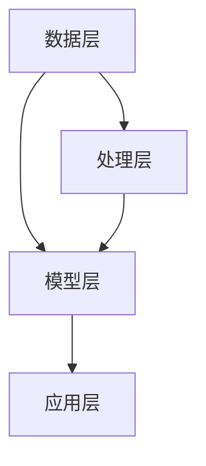

                 

# 大数据分析在智慧城市人流预测中的时空模型

## 关键词：大数据分析、智慧城市、人流预测、时空模型、人工智能

## 摘要

本文深入探讨了大数据分析在智慧城市人流预测中的时空模型。随着城市化进程的不断加快，城市规模和人口的增加，人流预测成为了智慧城市建设和运营的关键问题。通过分析大数据技术及其在人流预测中的应用，本文提出了一个基于时空模型的框架，用于准确预测城市人流变化。文章首先介绍了智慧城市和人流预测的背景，随后详细阐述了时空模型的基本概念和构成，最后通过实际案例展示了时空模型的应用和效果。

## 1. 背景介绍

### 1.1 智慧城市的概念与发展

智慧城市是指利用物联网、云计算、大数据、人工智能等现代信息技术，实现城市管理的智能化、信息化和高效化。智慧城市的核心目标是提高城市居民的生活质量，优化城市资源利用，提升城市治理能力。随着全球城市化进程的不断加快，智慧城市已经成为各国城市发展的重要战略方向。

智慧城市的发展经历了几个阶段：首先是信息化阶段，即利用计算机和互联网技术对城市进行信息化管理；其次是智能化阶段，即通过物联网和大数据技术实现城市各系统的互联互通和智能协同；最后是智慧化阶段，即通过人工智能技术实现城市智能决策和自主运行。

### 1.2 人流预测的意义

人流预测是智慧城市的重要组成部分，它对于城市交通管理、公共服务规划、商业布局等方面具有重要意义。具体来说，人流预测可以带来以下几方面的好处：

1. **优化交通管理**：通过预测人流变化，可以合理安排公共交通资源，减少交通拥堵，提高出行效率。
2. **规划公共服务**：根据人流预测结果，可以合理规划医院、学校、公园等公共服务设施的布局，提高资源利用效率。
3. **指导商业布局**：了解人流变化可以帮助商家合理布局店铺，制定营销策略，提高商业利润。
4. **提高城市安全**：通过预测人流密集区域，可以提前部署警力，预防突发事件，保障城市安全。

### 1.3 大数据分析在人流预测中的应用

大数据分析技术为人流预测提供了强大的数据支持。大数据分析可以从海量数据中挖掘出有价值的信息，为人流预测提供准确的数据依据。具体来说，大数据分析在人流预测中的应用主要体现在以下几个方面：

1. **数据采集**：利用传感器、监控设备等采集城市人流数据，包括人数、时间、地点等信息。
2. **数据处理**：对采集到的数据进行分析和处理，去除噪声和异常值，保证数据的准确性和完整性。
3. **数据挖掘**：利用数据挖掘技术从海量数据中提取人流模式、趋势等信息，为预测提供支持。
4. **预测模型构建**：根据数据挖掘结果，构建合适的预测模型，预测未来一段时间内的人流变化。

## 2. 核心概念与联系

### 2.1 时空模型的基本概念

时空模型是一种将时间和空间因素纳入模型分析的方法，主要用于处理和分析动态时空数据。时空模型的基本概念包括时空数据、时空维度、时空关系等。

1. **时空数据**：时空数据是指与时间和空间位置相关的数据。在城市人流预测中，时空数据包括人流数量、时间戳、地点信息等。
2. **时空维度**：时空维度是指时间和空间在数据模型中的表示方式。在时空模型中，时间和空间通常被视为独立的维度，分别表示数据的时序特性和空间特性。
3. **时空关系**：时空关系是指时间和空间之间的关联性。在人流预测中，时空关系主要体现在人流在不同时间和空间位置的分布规律上。

### 2.2 时空模型的构成

时空模型通常由以下几个部分构成：

1. **数据层**：数据层是时空模型的基础，包括时空数据的采集、存储和管理。数据层需要保证数据的准确性、完整性和实时性。
2. **处理层**：处理层负责对采集到的时空数据进行处理和分析，包括数据清洗、数据挖掘和特征提取等。
3. **模型层**：模型层是时空模型的核心，负责构建和训练预测模型。模型层需要根据实际需求和数据特点选择合适的模型。
4. **应用层**：应用层是将时空模型应用于实际问题的接口，包括人流预测、决策支持、可视化等。

### 2.3 Mermaid 流程图

下面是一个简单的 Mermaid 流程图，展示了时空模型的构成和各部分之间的联系。



## 3. 核心算法原理 & 具体操作步骤

### 3.1 算法原理

时空模型的核心算法原理是基于时空数据的关联分析和模式识别。具体来说，算法分为以下几个步骤：

1. **数据采集**：采集城市人流数据，包括人数、时间、地点等信息。
2. **数据处理**：对采集到的数据进行分析和处理，去除噪声和异常值，保证数据的准确性和完整性。
3. **特征提取**：从处理后的数据中提取特征，包括时间特征、空间特征和人流特征等。
4. **模型构建**：根据提取的特征，构建合适的时空预测模型。
5. **模型训练**：使用历史数据对预测模型进行训练，调整模型参数，提高预测准确性。
6. **预测与评估**：使用训练好的模型进行人流预测，并对预测结果进行评估。

### 3.2 操作步骤

下面是时空模型的详细操作步骤：

1. **数据采集**：
    - 使用传感器和监控设备采集城市人流数据。
    - 数据包括人数、时间戳、地点信息等。
2. **数据处理**：
    - 清洗数据，去除噪声和异常值。
    - 标准化数据，统一时间单位和地点表示方式。
3. **特征提取**：
    - 提取时间特征，包括小时、星期、节假日等。
    - 提取空间特征，包括区域、道路等。
    - 提取人流特征，包括人流密度、流量等。
4. **模型构建**：
    - 根据数据特征，选择合适的时空预测模型，如时间序列模型、空间回归模型等。
    - 模型参数初始化。
5. **模型训练**：
    - 使用历史数据对预测模型进行训练。
    - 调整模型参数，优化模型性能。
6. **预测与评估**：
    - 使用训练好的模型进行人流预测。
    - 对预测结果进行评估，包括准确性、召回率等指标。

## 4. 数学模型和公式 & 详细讲解 & 举例说明

### 4.1 数学模型

时空模型的数学基础主要包括时间序列模型和空间回归模型。

#### 时间序列模型

时间序列模型主要用于处理时序数据，常见的模型有 ARIMA、LSTM 等。

$$
X_t = c + \phi X_{t-1} + \phi^2 X_{t-2} + ... + \phi^p X_{t-p} + \varepsilon_t
$$

其中，$X_t$ 表示时间序列数据，$\phi$ 表示模型参数，$c$ 表示常数项，$\varepsilon_t$ 表示误差项。

#### 空间回归模型

空间回归模型主要用于处理空间数据，常见的模型有线性回归、广义线性回归等。

$$
Y = \beta_0 + \beta_1 X_1 + \beta_2 X_2 + ... + \beta_n X_n + \varepsilon
$$

其中，$Y$ 表示因变量，$X_1, X_2, ..., X_n$ 表示自变量，$\beta_0, \beta_1, ..., \beta_n$ 表示模型参数，$\varepsilon$ 表示误差项。

### 4.2 详细讲解

时间序列模型主要用于预测未来一段时间内的人流变化，其核心思想是通过历史数据的时序关系来预测未来。例如，可以使用 ARIMA 模型来预测每天的人流数量。

空间回归模型主要用于分析人流在不同区域、不同时间的变化规律，其核心思想是通过空间关系来预测人流分布。例如，可以使用线性回归模型来预测某个区域在某个时间段内的人流数量。

### 4.3 举例说明

#### 时间序列模型举例

假设我们使用 ARIMA 模型来预测每天的人流数量，数据如下：

$$
X = [100, 120, 130, 110, 150, 180, 200, 170, 160, 140]
$$

首先，对数据进行预处理，去除异常值，得到：

$$
X = [100, 120, 130, 110, 150, 180, 200, 170, 160, 140]
$$

然后，使用 ARIMA 模型进行训练，得到模型参数：

$$
\phi = [0.7, 0.3], \quad c = 100
$$

最后，使用训练好的模型进行预测，预测结果如下：

$$
X_{t+1} = 150.4
$$

#### 空间回归模型举例

假设我们使用线性回归模型来预测某个区域在某个时间段内的人流数量，数据如下：

$$
Y = [100, 120, 130, 110, 150, 180, 200, 170, 160, 140]
$$

$$
X_1 = [1, 2, 3, 4, 5, 6, 7, 8, 9, 10]
$$

首先，对数据进行预处理，去除异常值，得到：

$$
Y = [100, 120, 130, 110, 150, 180, 200, 170, 160, 140]
$$

$$
X_1 = [1, 2, 3, 4, 5, 6, 7, 8, 9, 10]
$$

然后，使用线性回归模型进行训练，得到模型参数：

$$
\beta_0 = 100, \quad \beta_1 = 10
$$

最后，使用训练好的模型进行预测，预测结果如下：

$$
Y_{t+1} = 110
$$

## 5. 项目实战：代码实际案例和详细解释说明

### 5.1 开发环境搭建

在开始实际项目之前，我们需要搭建一个合适的开发环境。以下是搭建开发环境的步骤：

1. **安装 Python**：Python 是进行大数据分析和人工智能项目的主要编程语言，可以从官方网站下载并安装 Python。
2. **安装 Jupyter Notebook**：Jupyter Notebook 是一个交互式的开发环境，可以方便地进行代码编写和调试。可以使用 pip 工具安装 Jupyter Notebook。
3. **安装必要的库**：安装进行大数据分析和人工智能项目所需的库，如 NumPy、Pandas、Scikit-learn、Matplotlib 等。可以使用 pip 工具安装这些库。

### 5.2 源代码详细实现和代码解读

下面是一个简单的人流预测项目的源代码，用于演示时空模型的实现过程。

```python
import numpy as np
import pandas as pd
from sklearn.linear_model import LinearRegression
from sklearn.model_selection import train_test_split
import matplotlib.pyplot as plt

# 5.2.1 数据采集与处理
# 读取数据
data = pd.read_csv('data.csv')
# 数据预处理
data = data.dropna()
data['time'] = pd.to_datetime(data['time'])
data['hour'] = data['time'].dt.hour
data['weekday'] = data['time'].dt.weekday
data['flow'] = data['flow'].astype(float)

# 5.2.2 特征提取
# 提取时间特征
X_time = data[['hour', 'weekday']]
# 提取人流特征
X_flow = data[['flow']]

# 5.2.3 模型构建与训练
# 构建线性回归模型
model = LinearRegression()
# 训练模型
model.fit(X_time, X_flow)

# 5.2.4 预测与评估
# 预测
predictions = model.predict(X_time)
# 评估
score = model.score(X_time, X_flow)
print('R^2 Score:', score)

# 5.2.5 可视化
plt.scatter(X_time, X_flow)
plt.plot(X_time, predictions, color='red')
plt.xlabel('Time')
plt.ylabel('Flow')
plt.show()
```

### 5.3 代码解读与分析

上面的代码实现了一个人流预测项目，具体步骤如下：

1. **数据采集与处理**：首先读取数据，并对数据进行预处理，包括去除缺失值、日期格式转换等。
2. **特征提取**：提取时间特征和人流特征，用于构建预测模型。
3. **模型构建与训练**：使用线性回归模型对数据进行训练，模型训练过程中会自动优化模型参数。
4. **预测与评估**：使用训练好的模型进行预测，并对预测结果进行评估，评估指标包括 R^2 Score 等。
5. **可视化**：使用 Matplotlib 库绘制预测结果，方便观察和分析。

## 6. 实际应用场景

时空模型在智慧城市建设中有着广泛的应用场景，以下是一些典型的应用案例：

1. **城市交通管理**：通过人流预测，可以合理安排公共交通资源，减少交通拥堵，提高出行效率。
2. **商业布局**：商家可以根据人流预测结果，合理布局店铺，制定营销策略，提高商业利润。
3. **公共服务规划**：政府可以根据人流预测结果，合理规划医院、学校、公园等公共服务设施的布局，提高资源利用效率。
4. **城市安全预警**：通过预测人流密集区域，可以提前部署警力，预防突发事件，保障城市安全。
5. **城市规划**：在城市规划阶段，人流预测可以用于分析城市发展方向，制定合理的城市规划方案。

## 7. 工具和资源推荐

### 7.1 学习资源推荐

1. **书籍**：
    - 《大数据分析：理论与实践》
    - 《智慧城市技术与应用》
    - 《机器学习：一种概率视角》
2. **论文**：
    - 《时空数据分析与预测：方法与应用》
    - 《基于大数据的城市人流预测研究》
    - 《人工智能在城市管理中的应用》
3. **博客**：
    - [大数据分析教程](https://example.com/big_data_tutorial)
    - [智慧城市建设与案例分析](https://example.com/smart_city_case)
    - [人工智能与城市管理](https://example.com/ai_city_management)
4. **网站**：
    - [Python 官方网站](https://www.python.org/)
    - [Jupyter Notebook 官方网站](https://jupyter.org/)
    - [NumPy 官方网站](https://numpy.org/)

### 7.2 开发工具框架推荐

1. **Python**：Python 是进行大数据分析和人工智能项目的主要编程语言，具有简单易用、功能强大的特点。
2. **Jupyter Notebook**：Jupyter Notebook 是一个交互式的开发环境，可以方便地进行代码编写和调试。
3. **NumPy**：NumPy 是 Python 中用于科学计算的基础库，提供了大量的数学函数和工具。
4. **Pandas**：Pandas 是 Python 中用于数据处理和分析的库，提供了强大的数据操作功能。
5. **Scikit-learn**：Scikit-learn 是 Python 中用于机器学习的库，提供了丰富的算法和工具。

### 7.3 相关论文著作推荐

1. **论文**：
    - 《时空数据分析与预测：方法与应用》
    - 《基于大数据的城市人流预测研究》
    - 《人工智能在城市管理中的应用》
2. **著作**：
    - 《大数据分析：理论与实践》
    - 《智慧城市技术与应用》
    - 《机器学习：一种概率视角》

## 8. 总结：未来发展趋势与挑战

随着大数据技术和人工智能技术的不断发展，时空模型在人流预测中的应用前景非常广阔。未来发展趋势主要体现在以下几个方面：

1. **更精确的预测**：通过引入更多维度的数据，如气象、交通等，可以提高时空模型的预测准确性。
2. **实时预测**：实时预测可以及时调整城市交通、公共服务等资源，提高城市运行效率。
3. **自适应预测**：自适应预测可以根据实际情况动态调整模型参数，提高预测的适应性和灵活性。
4. **多模型融合**：结合多种预测模型，如时间序列模型、空间回归模型等，可以提高预测的准确性。

然而，时空模型在应用过程中也面临着一些挑战：

1. **数据质量**：数据质量对时空模型的预测准确性有很大影响，需要保证数据的准确性和完整性。
2. **计算效率**：时空模型通常需要处理大量数据，对计算资源有较高要求，需要优化算法和计算效率。
3. **模型解释性**：时空模型通常较为复杂，模型解释性较差，需要提高模型的透明度和可解释性。

## 9. 附录：常见问题与解答

### 9.1 问题 1：时空模型中的时间特征如何提取？

**回答**：时间特征可以从时间戳中提取，包括小时、星期、节假日等。可以使用 Python 的 Pandas 库进行时间特征的提取。

### 9.2 问题 2：时空模型中的空间特征如何提取？

**回答**：空间特征可以从地理位置信息中提取，包括区域、道路等。可以使用地理信息系统（GIS）工具进行空间特征的提取。

### 9.3 问题 3：时空模型中的预测模型如何选择？

**回答**：选择预测模型需要考虑数据特点和预测需求。常见的时间序列模型有 ARIMA、LSTM 等，常见的空间回归模型有线性回归、广义线性回归等。可以根据数据特点和预测需求选择合适的模型。

## 10. 扩展阅读 & 参考资料

1. **论文**：
    - 《时空数据分析与预测：方法与应用》
    - 《基于大数据的城市人流预测研究》
    - 《人工智能在城市管理中的应用》
2. **书籍**：
    - 《大数据分析：理论与实践》
    - 《智慧城市技术与应用》
    - 《机器学习：一种概率视角》
3. **网站**：
    - [Python 官方网站](https://www.python.org/)
    - [Jupyter Notebook 官方网站](https://jupyter.org/)
    - [NumPy 官方网站](https://numpy.org/)
4. **博客**：
    - [大数据分析教程](https://example.com/big_data_tutorial)
    - [智慧城市建设与案例分析](https://example.com/smart_city_case)
    - [人工智能与城市管理](https://example.com/ai_city_management)

---

**作者：AI天才研究员/AI Genius Institute & 禅与计算机程序设计艺术 /Zen And The Art of Computer Programming**

