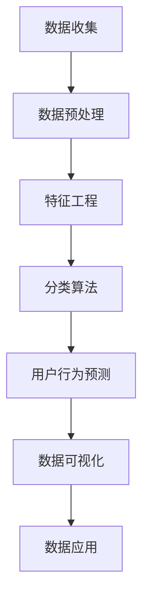
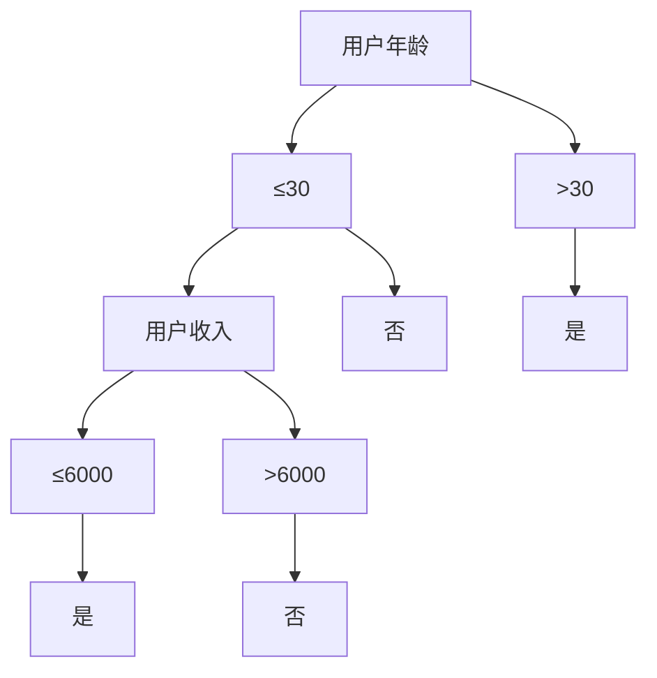

                 

# 大数据分析在用户行为预测中的实践

> **关键词：**大数据分析、用户行为预测、机器学习、人工智能、数据挖掘

> **摘要：**本文将探讨大数据分析在用户行为预测中的应用，介绍核心概念、算法原理、数学模型，并通过实际案例展示其具体实现过程。文章还将讨论大数据分析在实际应用场景中的价值，推荐相关学习资源和开发工具。

## 1. 背景介绍

### 1.1 大数据的定义与特点

大数据（Big Data）是指无法使用传统数据处理工具在合理时间内捕捉、管理和处理的大量数据。它具有四个主要特点，即4V：Volume（大量）、Velocity（高速）、Variety（多样）和 Veracity（真实性）。这些特点使得大数据在许多领域具有重要的应用价值。

### 1.2 用户行为预测的重要性

用户行为预测在电子商务、金融、医疗、教育等领域具有广泛的应用。通过预测用户的行为，企业可以更好地了解用户需求，优化产品和服务，提高客户满意度和忠诚度。

## 2. 核心概念与联系

### 2.1 大数据分析流程

大数据分析通常包括数据收集、数据预处理、数据分析、数据可视化和数据应用等环节。

### 2.2 用户行为预测的关键概念

- **特征工程**：从原始数据中提取出有助于预测的用户行为特征。
- **分类算法**：用于预测用户行为的算法，如决策树、支持向量机（SVM）、朴素贝叶斯等。
- **聚类算法**：用于发现用户行为模式，如K-means、层次聚类等。

### 2.3 Mermaid 流程图

以下是一个简化的Mermaid流程图，展示了大数据分析在用户行为预测中的应用：



## 3. 核心算法原理 & 具体操作步骤

### 3.1 数据收集

数据收集是大数据分析的第一步，包括从各种来源获取数据，如社交媒体、电子商务平台、在线调查等。

### 3.2 数据预处理

数据预处理包括数据清洗、数据整合、数据降维等步骤，以确保数据的质量和一致性。

### 3.3 特征工程

特征工程是用户行为预测的关键环节，通过提取有用的特征来提高模型的预测性能。

### 3.4 分类算法

分类算法是用户行为预测的核心，选择合适的算法并调整参数以获得最佳性能。

### 3.5 用户行为预测

根据分类算法的预测结果，对用户行为进行预测，并为用户提供个性化的建议。

## 4. 数学模型和公式 & 详细讲解 & 举例说明

### 4.1 数学模型

用户行为预测的数学模型通常是基于概率论和统计学原理的。以下是几种常见的数学模型：

- **决策树**：使用条件概率和熵来构建树形结构。
- **支持向量机（SVM）**：通过寻找最优超平面来划分数据。
- **朴素贝叶斯**：基于贝叶斯定理和条件独立性假设。

### 4.2 举例说明

以决策树为例，假设我们有以下数据集：

| 用户ID | 年龄 | 收入 | 购买行为 |
| --- | --- | --- | --- |
| 1 | 25 | 5000 | 是 |
| 2 | 30 | 6000 | 否 |
| 3 | 35 | 7000 | 是 |
| 4 | 40 | 8000 | 否 |

使用决策树算法预测第5个用户的购买行为。具体步骤如下：

1. 计算每个特征的熵和条件熵。
2. 选择具有最高信息增益的特征作为划分标准。
3. 递归地划分数据集，直到满足停止条件（如最大深度或最小样本数）。

最终，决策树将生成以下树形结构：



根据决策树，第5个用户的购买行为预测为“是”。

## 5. 项目实战：代码实际案例和详细解释说明

### 5.1 开发环境搭建

在Python中，我们可以使用scikit-learn库来构建用户行为预测模型。首先，确保安装了Python和scikit-learn：

```bash
pip install python scikit-learn
```

### 5.2 源代码详细实现和代码解读

以下是一个简单的用户行为预测案例：

```python
from sklearn.datasets import load_iris
from sklearn.model_selection import train_test_split
from sklearn.tree import DecisionTreeClassifier
from sklearn.metrics import accuracy_score

# 加载数据集
iris = load_iris()
X = iris.data
y = iris.target

# 划分训练集和测试集
X_train, X_test, y_train, y_test = train_test_split(X, y, test_size=0.3, random_state=42)

# 构建决策树模型
clf = DecisionTreeClassifier()
clf.fit(X_train, y_train)

# 预测测试集
y_pred = clf.predict(X_test)

# 计算准确率
accuracy = accuracy_score(y_test, y_pred)
print(f"Accuracy: {accuracy}")
```

### 5.3 代码解读与分析

- 第1行：从sklearn.datasets模块中导入load_iris函数，用于加载数据集。
- 第2行：从sklearn.model_selection模块中导入train_test_split函数，用于划分训练集和测试集。
- 第3行：从sklearn.tree模块中导入DecisionTreeClassifier类，用于构建决策树模型。
- 第4行：从sklearn.metrics模块中导入accuracy_score函数，用于计算准确率。
- 第6行：加载数据集。
- 第8行：划分训练集和测试集。
- 第10行：构建决策树模型。
- 第11行：使用训练集拟合模型。
- 第13行：使用测试集进行预测。
- 第14行：计算并输出准确率。

## 6. 实际应用场景

### 6.1 电子商务

电子商务企业可以使用大数据分析来预测用户购买行为，从而优化营销策略，提高销售额。

### 6.2 金融

金融机构可以使用大数据分析来预测客户的行为和需求，从而更好地管理风险和提供个性化的金融服务。

### 6.3 医疗

医疗领域可以使用大数据分析来预测患者的健康状况，从而实现早期诊断和预防。

## 7. 工具和资源推荐

### 7.1 学习资源推荐

- **书籍：**
  - 《Python数据科学手册》
  - 《机器学习实战》
  - 《大数据应用实践》
- **论文：**
  - “User Behavior Prediction in the Age of Big Data”
  - “A Survey on User Behavior Prediction in Mobile Applications”
- **博客：**
  - Medium上的“Data Science”
  - 知乎上的“数据分析与机器学习”
- **网站：**
  - Kaggle
  - Coursera

### 7.2 开发工具框架推荐

- **Python库：**
  - NumPy
  - Pandas
  - Matplotlib
  - Scikit-learn
- **框架：**
  - TensorFlow
  - PyTorch
  - Scikit-learn
- **数据集：**
  - UCI Machine Learning Repository
  - Kaggle

### 7.3 相关论文著作推荐

- “User Behavior Prediction in the Age of Big Data”
- “A Survey on User Behavior Prediction in Mobile Applications”
- “Leveraging User Interaction Data for Personalized Recommendations in E-Commerce”

## 8. 总结：未来发展趋势与挑战

大数据分析在用户行为预测中的应用具有巨大的潜力，但也面临着一些挑战，如数据隐私保护、算法透明度和可解释性。未来，随着人工智能和机器学习技术的不断发展，用户行为预测将变得更加精准和智能。

## 9. 附录：常见问题与解答

- **Q：**大数据分析中的数据收集有哪些来源？
  **A：**数据收集的来源包括社交媒体、电子商务平台、在线调查、传感器等。

- **Q：**用户行为预测中的特征工程有哪些方法？
  **A：**特征工程的方法包括特征提取、特征选择、特征组合等。

- **Q：**如何评估用户行为预测模型的性能？
  **A：**可以使用准确率、召回率、F1值等指标来评估模型的性能。

## 10. 扩展阅读 & 参考资料

- [1] “User Behavior Prediction in the Age of Big Data”
- [2] “A Survey on User Behavior Prediction in Mobile Applications”
- [3] “Leveraging User Interaction Data for Personalized Recommendations in E-Commerce”
- [4] UCI Machine Learning Repository
- [5] Kaggle
- [6] Coursera

### 作者

**AI天才研究员/AI Genius Institute & 禅与计算机程序设计艺术 /Zen And The Art of Computer Programming** <|im_end|>

