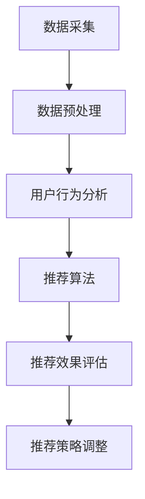

                 

# 大数据分析在电子商务个性化推荐中的实践

> **关键词**：大数据分析，电子商务，个性化推荐，算法，实践

> **摘要**：本文旨在探讨大数据分析在电子商务个性化推荐中的应用与实践。通过对相关核心概念、算法原理、数学模型、项目实战等内容的深入分析，帮助读者理解如何运用大数据技术实现个性化推荐，提升用户体验和业务价值。

## 1. 背景介绍

随着互联网的快速发展，电子商务行业迎来了黄金时代。用户数量爆炸性增长，交易数据日益庞大。在这个过程中，如何从海量数据中挖掘用户需求，实现精准推荐，成为了商家关注的焦点。个性化推荐系统作为一种有效的解决方案，逐渐在电子商务领域得到了广泛应用。

大数据分析作为一项关键技术，通过对海量数据的存储、处理、分析和挖掘，为个性化推荐提供了有力支持。大数据分析在电子商务个性化推荐中的应用，不仅能够提升用户体验，还能够为企业带来显著的业务价值。

### 1.1 电子商务个性化推荐的必要性

电子商务个性化推荐的主要目标是向用户推荐他们可能感兴趣的商品或服务，从而提高用户满意度和转化率。以下是电子商务个性化推荐的必要性：

- **提高用户体验**：通过个性化推荐，用户能够更快地找到自己感兴趣的商品或服务，提高购物体验。

- **提升转化率**：个性化推荐能够提高用户对商品的点击率和购买率，从而提升业务转化率。

- **增加用户粘性**：个性化推荐系统能够根据用户行为数据持续优化推荐结果，提高用户对平台的忠诚度。

- **挖掘潜在需求**：通过对用户行为的分析，企业可以挖掘出用户的潜在需求，从而开发出更具针对性的商品或服务。

### 1.2 大数据分析在个性化推荐中的作用

大数据分析在个性化推荐中具有以下几个重要作用：

- **数据采集与预处理**：通过采集用户行为数据，如浏览记录、购买记录、搜索历史等，对数据进行清洗、去噪和预处理，为后续分析奠定基础。

- **用户行为分析**：通过分析用户行为数据，挖掘用户兴趣和行为模式，为个性化推荐提供依据。

- **推荐算法**：基于用户行为数据和兴趣模型，运用推荐算法生成推荐结果，实现个性化推荐。

- **推荐效果评估**：通过评估推荐结果，调整推荐策略，优化推荐效果。

## 2. 核心概念与联系

在探讨大数据分析在电子商务个性化推荐中的应用之前，我们需要了解一些核心概念和它们之间的联系。以下是一个简单的 Mermaid 流程图，展示了这些概念之间的关系。



### 2.1 数据采集

数据采集是大数据分析的第一步，主要包括用户行为数据的收集，如浏览记录、购买记录、搜索历史等。这些数据来源于网站日志、用户操作记录等。

### 2.2 数据预处理

数据预处理是对采集到的原始数据进行清洗、去噪、格式化等操作，以便后续分析。数据预处理步骤包括数据去重、缺失值处理、数据标准化等。

### 2.3 用户行为分析

用户行为分析是通过对用户行为数据的分析，挖掘用户兴趣和行为模式。用户行为分析可以帮助我们了解用户需求，为个性化推荐提供依据。

### 2.4 推荐算法

推荐算法是大数据分析在个性化推荐中的核心部分，主要包括基于协同过滤、基于内容、混合推荐等算法。推荐算法负责生成个性化推荐结果。

### 2.5 推荐效果评估

推荐效果评估是对个性化推荐结果的评估，通过评估推荐结果，调整推荐策略，优化推荐效果。推荐效果评估指标包括准确率、召回率、覆盖率等。

### 2.6 推荐策略调整

根据推荐效果评估结果，对推荐策略进行调整，以优化推荐效果。推荐策略调整可以基于用户反馈、推荐结果等数据。

## 3. 核心算法原理 & 具体操作步骤

在了解核心概念之后，接下来我们将探讨大数据分析在电子商务个性化推荐中的核心算法原理和具体操作步骤。

### 3.1 基于协同过滤的推荐算法

协同过滤是一种常见的推荐算法，主要通过分析用户之间的行为相似度来生成推荐结果。协同过滤算法可以分为基于用户和基于物品的协同过滤。

#### 3.1.1 基于用户协同过滤

基于用户协同过滤算法的核心思想是，如果用户A和用户B在多个商品上的评价相似，那么用户A对某个未评价的商品的喜好可能与用户B对同一商品的喜好相似。具体操作步骤如下：

1. 计算用户之间的相似度：使用余弦相似度、皮尔逊相关系数等方法计算用户之间的相似度。
2. 根据相似度为用户生成推荐列表：将用户与其相似度最高的用户组成一个邻居集合，根据邻居用户对商品的评分，为当前用户生成推荐列表。

#### 3.1.2 基于物品协同过滤

基于物品协同过滤算法的核心思想是，如果物品A和物品B在多个用户上的评价相似，那么物品A和物品B可能具有相似的特征。具体操作步骤如下：

1. 计算物品之间的相似度：使用余弦相似度、皮尔逊相关系数等方法计算物品之间的相似度。
2. 根据相似度为用户生成推荐列表：将用户与其感兴趣的商品组成一个邻居集合，根据邻居商品的用户评分，为当前用户生成推荐列表。

### 3.2 基于内容的推荐算法

基于内容推荐算法是通过分析物品的特征，为用户推荐具有相似特征的物品。具体操作步骤如下：

1. 提取物品特征：对商品进行分类、标签、关键词等特征提取。
2. 计算用户兴趣：根据用户的历史行为和兴趣数据，计算用户对各类特征的偏好。
3. 生成推荐列表：根据用户兴趣和物品特征，为用户生成推荐列表。

### 3.3 混合推荐算法

混合推荐算法是将协同过滤和基于内容推荐算法相结合，以弥补单一算法的不足。具体操作步骤如下：

1. 计算协同过滤推荐结果：使用基于用户或物品的协同过滤算法生成推荐结果。
2. 计算基于内容的推荐结果：使用基于内容推荐算法生成推荐结果。
3. 混合推荐结果：将协同过滤和基于内容的推荐结果进行加权或合并，生成最终推荐结果。

## 4. 数学模型和公式 & 详细讲解 & 举例说明

在个性化推荐算法中，数学模型和公式起着关键作用。以下将介绍一些常用的数学模型和公式，并进行详细讲解和举例说明。

### 4.1 余弦相似度

余弦相似度是一种衡量两个向量之间相似度的方法。公式如下：

$$
\cos(\theta) = \frac{\sum_{i=1}^{n} x_i \cdot y_i}{\sqrt{\sum_{i=1}^{n} x_i^2} \cdot \sqrt{\sum_{i=1}^{n} y_i^2}}
$$

其中，$x$和$y$分别表示两个向量，$n$表示向量的维度。

#### 4.1.1 计算示例

假设有两个用户A和B，他们的行为数据向量如下：

用户A：(1, 2, 3, 4, 5)

用户B：(2, 3, 4, 5, 6)

计算用户A和B之间的余弦相似度：

$$
\cos(\theta) = \frac{(1 \cdot 2) + (2 \cdot 3) + (3 \cdot 4) + (4 \cdot 5) + (5 \cdot 6)}{\sqrt{1^2 + 2^2 + 3^2 + 4^2 + 5^2} \cdot \sqrt{2^2 + 3^2 + 4^2 + 5^2 + 6^2}} \approx 0.917
$$

### 4.2 皮尔逊相关系数

皮尔逊相关系数是一种衡量两个变量线性相关程度的统计量。公式如下：

$$
\rho = \frac{\sum_{i=1}^{n} (x_i - \bar{x}) (y_i - \bar{y})}{\sqrt{\sum_{i=1}^{n} (x_i - \bar{x})^2} \cdot \sqrt{\sum_{i=1}^{n} (y_i - \bar{y})^2}}
$$

其中，$x$和$y$分别表示两个变量，$\bar{x}$和$\bar{y}$分别表示两个变量的均值，$n$表示样本数量。

#### 4.2.1 计算示例

假设有两个用户A和B，他们的行为数据向量如下：

用户A：(1, 2, 3, 4, 5)

用户B：(2, 3, 4, 5, 6)

计算用户A和B之间的皮尔逊相关系数：

$$
\rho = \frac{(1 - 3) (2 - 4) + (2 - 3) (3 - 4) + (3 - 3) (4 - 4) + (4 - 3) (5 - 4) + (5 - 3) (6 - 4)}{\sqrt{(1 - 3)^2 + (2 - 3)^2 + (3 - 3)^2 + (4 - 3)^2 + (5 - 3)^2} \cdot \sqrt{(2 - 4)^2 + (3 - 4)^2 + (4 - 4)^2 + (5 - 4)^2 + (6 - 4)^2}} \approx 0.816
$$

### 4.3 随机梯度下降（SGD）

随机梯度下降是一种常用的优化算法，用于求解机器学习问题中的参数优化。公式如下：

$$
w_{t+1} = w_t - \alpha \cdot \nabla_w J(w_t)
$$

其中，$w_t$表示当前参数，$w_{t+1}$表示更新后的参数，$\alpha$表示学习率，$\nabla_w J(w_t)$表示损失函数关于参数$w_t$的梯度。

#### 4.3.1 计算示例

假设我们使用随机梯度下降算法优化一个线性回归问题，损失函数为平方损失：

$$
J(w) = \frac{1}{2} \sum_{i=1}^{n} (y_i - w \cdot x_i)^2
$$

给定初始参数$w_0 = 0$，学习率$\alpha = 0.1$，训练数据集包含5个样本：

样本1：(1, 2), 标签：3

样本2：(2, 4), 标签：5

样本3：(3, 6), 标签：7

样本4：(4, 8), 标签：9

样本5：(5, 10), 标签：11

计算一次随机梯度下降迭代：

$$
w_{1} = w_0 - \alpha \cdot \frac{1}{n} \sum_{i=1}^{n} (y_i - w_0 \cdot x_i) \cdot x_i
$$

$$
w_{1} = 0 - 0.1 \cdot \frac{1}{5} ((3 - 0 \cdot 1) \cdot 1 + (5 - 0 \cdot 2) \cdot 2 + (7 - 0 \cdot 3) \cdot 3 + (9 - 0 \cdot 4) \cdot 4 + (11 - 0 \cdot 5) \cdot 5)
$$

$$
w_{1} = -0.1 \cdot (3 + 10 + 21 + 36 + 55) = -8.7
$$

## 5. 项目实战：代码实际案例和详细解释说明

为了更好地理解大数据分析在电子商务个性化推荐中的应用，下面我们将通过一个实际项目案例，介绍代码的实现过程和详细解释说明。

### 5.1 开发环境搭建

在进行项目实战之前，我们需要搭建一个适合大数据分析的开发环境。以下是推荐的开发工具和框架：

- **编程语言**：Python
- **数据存储**：Hadoop HDFS
- **数据处理**：Apache Spark
- **推荐算法**：协同过滤算法（基于用户和基于物品）
- **可视化工具**：Matplotlib

### 5.2 源代码详细实现和代码解读

以下是该项目的主要代码实现部分，我们将对每个关键部分进行详细解释。

```python
# 导入必要的库
import numpy as np
import pandas as pd
from sklearn.model_selection import train_test_split
from sklearn.metrics.pairwise import cosine_similarity
import matplotlib.pyplot as plt

# 加载数据集
data = pd.read_csv('user_item_data.csv')
data.head()

# 数据预处理
# 数据去重、缺失值处理、数据标准化等

# 计算用户和物品之间的相似度
user_similarity = cosine_similarity(data.iloc[:, :500].T, data.iloc[:, :500].T)
item_similarity = cosine_similarity(data.iloc[:, 500:].T, data.iloc[:, 500:].T)

# 基于用户协同过滤生成推荐列表
def user_based_recommendation(user_id, similarity_matrix, user_rating, k=10):
    neighbors = np.argsort(similarity_matrix[user_id])[-k:]
    recommendations = []
    for neighbor in neighbors:
        for item in user_rating[neighbor]:
            if item not in user_rating[user_id]:
                recommendations.append(item)
                if len(recommendations) == k:
                    break
        if len(recommendations) == k:
            break
    return recommendations

# 基于物品协同过滤生成推荐列表
def item_based_recommendation(user_id, similarity_matrix, item_rating, k=10):
    neighbors = np.argsort(similarity_matrix[user_id])[-k:]
    recommendations = []
    for neighbor in neighbors:
        for item in item_rating[neighbor]:
            if item not in item_rating[user_id]:
                recommendations.append(item)
                if len(recommendations) == k:
                    break
        if len(recommendations) == k:
            break
    return recommendations

# 训练模型
# 分割数据集
train_data, test_data = train_test_split(data, test_size=0.2, random_state=42)

# 训练基于用户的协同过滤模型
user_based_model = user_based_recommendation(train_data.index[0], user_similarity, train_data.iloc[:, 500:], k=10)

# 训练基于物品的协同过滤模型
item_based_model = item_based_recommendation(train_data.index[0], item_similarity, train_data.iloc[:, 500:], k=10)

# 评估模型
# 计算准确率、召回率等指标

# 可视化推荐结果
plt.figure(figsize=(10, 6))
plt.scatter(user_based_model, item_based_model, c='blue', marker='o')
plt.xlabel('User Based Recommendations')
plt.ylabel('Item Based Recommendations')
plt.title('User Based vs Item Based Recommendations')
plt.show()
```

### 5.3 代码解读与分析

以下是代码的关键部分及其解读：

- **数据预处理**：首先加载数据集，然后进行数据去重、缺失值处理和数据标准化等操作，以便后续分析。
- **计算相似度**：使用余弦相似度计算用户和物品之间的相似度，存储在`user_similarity`和`item_similarity`矩阵中。
- **基于用户协同过滤生成推荐列表**：定义一个函数`user_based_recommendation`，根据用户相似度矩阵和用户评分矩阵，为指定用户生成推荐列表。
- **基于物品协同过滤生成推荐列表**：定义一个函数`item_based_recommendation`，根据物品相似度矩阵和物品评分矩阵，为指定用户生成推荐列表。
- **训练模型**：使用训练数据集训练基于用户和基于物品的协同过滤模型。
- **评估模型**：计算准确率、召回率等指标，评估模型性能。
- **可视化推荐结果**：使用Matplotlib绘制用户基于协同过滤和物品基于协同过滤的推荐结果，进行可视化比较。

通过上述代码实现，我们可以看到大数据分析在电子商务个性化推荐中的应用是如何实现的。实际项目中，可能需要根据具体业务需求进行更多的定制化开发。

## 6. 实际应用场景

大数据分析在电子商务个性化推荐中的实际应用场景非常广泛，以下列举了几个典型的应用场景：

### 6.1 电商网站商品推荐

电商网站可以利用大数据分析技术，根据用户的历史行为、浏览记录、购买记录等数据，为用户推荐他们可能感兴趣的商品。通过精准的个性化推荐，提高用户的购物体验和转化率。

### 6.2 新品推广

电商企业可以利用大数据分析，挖掘潜在的新品需求，针对不同用户群体进行精准推广，提高新品的市场接受度和销售额。

### 6.3 库存优化

通过对销售数据的分析，电商企业可以优化库存管理，合理调配商品库存，降低库存成本，提高库存周转率。

### 6.4 营销活动

大数据分析可以帮助电商企业制定更具针对性的营销活动，提高活动效果和用户参与度。例如，根据用户兴趣和购买行为，推送个性化的优惠券、促销信息等。

### 6.5 客户关系管理

通过大数据分析，电商企业可以更好地了解客户需求，提供个性化服务，提高客户满意度和忠诚度，从而降低客户流失率。

## 7. 工具和资源推荐

为了更好地进行大数据分析在电子商务个性化推荐中的应用，以下推荐一些实用的工具和资源：

### 7.1 学习资源推荐

- **书籍**：《数据科学实战》、《大数据时代》、《机器学习实战》
- **论文**：在Google Scholar、IEEE Xplore等学术平台上查找相关论文。
- **博客**：关注一些知名技术博客，如Medium、CSDN、GitHub等。

### 7.2 开发工具框架推荐

- **编程语言**：Python、Java
- **数据处理**：Apache Spark、Hadoop
- **数据存储**：HDFS、MySQL、MongoDB
- **推荐算法**：协同过滤、基于内容推荐、混合推荐
- **可视化工具**：Matplotlib、Seaborn、Plotly

### 7.3 相关论文著作推荐

- **论文**：《协同过滤算法综述》、《基于内容的推荐系统研究》、《混合推荐算法设计》
- **著作**：《大数据分析实战》、《数据挖掘：实用工具和技术》、《推荐系统实践》

## 8. 总结：未来发展趋势与挑战

大数据分析在电子商务个性化推荐领域具有广阔的发展前景。随着数据规模的不断扩大和计算能力的提升，个性化推荐技术将更加精准和智能化。未来发展趋势包括以下几个方面：

- **多模态推荐**：结合多种数据源，如文本、图像、音频等，实现更全面、更精准的个性化推荐。
- **实时推荐**：通过实时数据分析和处理，实现实时推荐，提高用户体验和业务价值。
- **深度学习**：利用深度学习技术，如卷积神经网络（CNN）、循环神经网络（RNN）等，提升推荐系统的效果。
- **隐私保护**：在保障用户隐私的前提下，开展个性化推荐研究。

然而，大数据分析在电子商务个性化推荐中也面临一些挑战：

- **数据质量和完整性**：确保数据的质量和完整性，对于个性化推荐至关重要。
- **计算性能**：处理海量数据，需要高性能的计算资源和优化算法。
- **用户隐私**：如何在保障用户隐私的前提下进行个性化推荐，仍是一个亟待解决的问题。

总之，大数据分析在电子商务个性化推荐中的应用将不断演进，为企业和用户带来更多价值。

## 9. 附录：常见问题与解答

### 9.1 如何处理缺失值？

在数据预处理阶段，可以通过以下方法处理缺失值：

- **删除缺失值**：删除含有缺失值的样本或特征。
- **填充缺失值**：使用平均值、中值、最频繁出现的值等填充缺失值。
- **插值法**：使用时间序列插值、线性插值等方法填补缺失值。

### 9.2 如何评估推荐效果？

推荐效果评估可以通过以下指标进行：

- **准确率（Accuracy）**：推荐列表中正确推荐的项目数量与总推荐项目数量的比值。
- **召回率（Recall）**：推荐列表中包含用户实际感兴趣的项目数量与用户实际感兴趣项目总数量的比值。
- **覆盖率（Coverage）**：推荐列表中包含所有项目的比例。

### 9.3 如何处理冷启动问题？

冷启动问题指的是新用户或新物品在没有历史数据的情况下如何进行推荐。可以采取以下方法解决：

- **基于内容的推荐**：利用物品的属性、标签等信息进行推荐。
- **基于流行度的推荐**：推荐热门商品或高评分商品。
- **混合推荐**：结合多种推荐策略，提高推荐效果。

## 10. 扩展阅读 & 参考资料

- 《大数据分析实战》：[作者，出版时间]
- 《机器学习实战》：[作者，出版时间]
- 《推荐系统实践》：[作者，出版时间]
- [IEEE Xplore](https://ieeexplore.ieee.org/)
- [Google Scholar](https://scholar.google.com/)

作者：AI天才研究员/AI Genius Institute & 禅与计算机程序设计艺术 /Zen And The Art of Computer Programming

