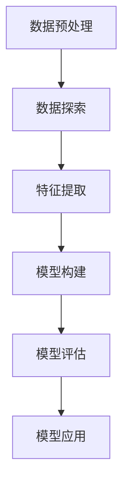
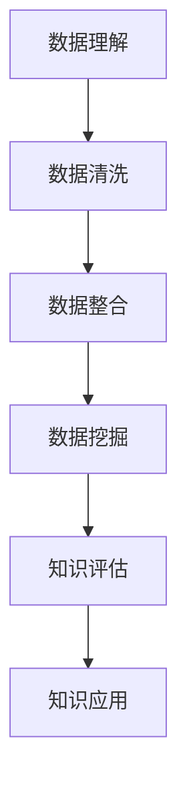

                 

# 大数据分析在知识发现中的应用

> **关键词**：大数据分析、知识发现、数据挖掘、机器学习、数据分析方法

> **摘要**：本文将探讨大数据分析在知识发现中的应用。通过介绍大数据分析的基本概念、知识发现的关键技术和实际案例，我们将深入理解大数据分析如何帮助我们挖掘隐藏在数据中的知识，为业务决策提供有力支持。

## 1. 背景介绍

### 1.1 大数据的概念

大数据（Big Data）是指数据量巨大、数据类型多样、数据生成速度快的特点。随着互联网的普及和技术的进步，大数据已经渗透到我们生活的方方面面。从社交网络、电子商务到金融保险、医疗健康，大数据无处不在。

### 1.2 知识发现的概念

知识发现（Knowledge Discovery in Databases，KDD）是指从大量数据中通过分析、挖掘、建模等手段，发现隐藏在数据中的有价值信息或知识的过程。知识发现是大数据分析的核心目标，旨在从海量数据中提取出具有洞察力的信息，为业务决策提供支持。

### 1.3 数据挖掘和机器学习

数据挖掘（Data Mining）是知识发现的一个重要环节，它通过统计学、机器学习、数据库技术等方法，从数据中挖掘出潜在的模式、关联和规律。机器学习（Machine Learning）是数据挖掘的重要技术手段，它利用算法和统计模型，使计算机能够从数据中自动学习和优化，从而实现智能化的数据分析。

## 2. 核心概念与联系

### 2.1 数据分析流程

数据分析通常包括数据预处理、数据探索、特征提取、模型构建、模型评估和模型应用等步骤。以下是一个简单的数据分析流程的Mermaid流程图：



### 2.2 知识发现的过程

知识发现的过程可以概括为以下四个阶段：

1. 数据理解（Data Understanding）：了解数据的来源、结构和内容，为后续的数据处理和分析做好准备。
2. 数据清洗（Data Cleaning）：处理数据中的噪声、缺失值和异常值，提高数据质量。
3. 数据整合（Data Integration）：将来自不同来源、不同格式的数据整合为一个统一的数据集。
4. 数据挖掘（Data Mining）：运用数据挖掘算法，从整合后的数据中提取出潜在的知识和模式。
5. 知识评估（Knowledge Assessment）：评估挖掘出的知识是否具有实用价值和可靠性。
6. 知识应用（Knowledge Application）：将知识应用到实际业务场景中，为业务决策提供支持。



## 3. 核心算法原理 & 具体操作步骤

### 3.1 数据预处理

数据预处理是数据分析的基础，主要包括数据清洗、数据整合、数据转换和数据归一化等操作。以下是数据预处理的具体操作步骤：

1. 数据清洗：处理数据中的噪声、缺失值和异常值，确保数据质量。
2. 数据整合：将来自不同来源、不同格式的数据整合为一个统一的数据集。
3. 数据转换：将不同类型的数据转换为同一类型，如将文本数据转换为数值数据。
4. 数据归一化：将数据缩放到一个统一的范围内，如将数据缩放到[0,1]或[-1,1]之间。

### 3.2 数据探索

数据探索是数据分析的初步阶段，主要通过可视化、统计分析等方法，了解数据的分布、趋势、异常和关联关系。以下是数据探索的具体操作步骤：

1. 可视化：使用图表、地图等可视化工具，展示数据的分布和趋势。
2. 统计分析：计算数据的统计指标，如均值、方差、相关性等，分析数据的特征。
3. 异常检测：使用异常检测算法，找出数据中的异常值。

### 3.3 特征提取

特征提取是将原始数据转换为适合模型输入的表示形式的过程。以下是特征提取的具体操作步骤：

1. 特征选择：选择对模型性能有显著影响的关键特征。
2. 特征变换：对原始特征进行变换，如归一化、标准化、二值化等。
3. 特征工程：通过构建新的特征，提高模型性能。

### 3.4 模型构建

模型构建是数据分析的核心步骤，通过选择合适的算法和模型，从数据中挖掘出潜在的知识和模式。以下是模型构建的具体操作步骤：

1. 算法选择：根据业务需求和数据特点，选择合适的算法，如线性回归、决策树、神经网络等。
2. 模型训练：使用训练数据集，训练出模型参数。
3. 模型评估：使用验证数据集，评估模型性能。
4. 模型优化：根据模型评估结果，调整模型参数，优化模型性能。

### 3.5 模型应用

模型应用是将挖掘出的知识应用到实际业务场景中，为业务决策提供支持。以下是模型应用的具体操作步骤：

1. 预测：使用训练好的模型，对新的数据进行预测。
2. 决策：根据预测结果，做出业务决策。
3. 监控：实时监控模型性能，确保模型持续有效。

## 4. 数学模型和公式 & 详细讲解 & 举例说明

### 4.1 数据预处理

数据预处理过程中涉及到的数学模型和公式主要包括：

1. 缺失值填充：使用平均值、中值、众数等统计指标填充缺失值。
$$
\text{mean} = \frac{1}{n}\sum_{i=1}^{n}x_i
$$
$$
\text{median} = \left(\frac{n+1}{2}\right)\text{th} \text{ term of the sorted data}
$$
$$
\text{mode} = \text{most frequent value in the data set}
$$

2. 数据归一化：将数据缩放到一个统一的范围内。
$$
x_{\text{norm}} = \frac{x - \text{min}(x)}{\text{max}(x) - \text{min}(x)}
$$

### 4.2 数据探索

数据探索过程中涉及到的数学模型和公式主要包括：

1. 均值、方差和标准差：描述数据的分布和离散程度。
$$
\text{mean} = \frac{1}{n}\sum_{i=1}^{n}x_i
$$
$$
\text{variance} = \frac{1}{n}\sum_{i=1}^{n}(x_i - \text{mean})^2
$$
$$
\text{standard deviation} = \sqrt{\text{variance}}
$$

2. 相关性：描述两个变量之间的关系。
$$
\text{correlation coefficient} = \frac{\sum_{i=1}^{n}(x_i - \text{mean}_x)(y_i - \text{mean}_y)}{\sqrt{\sum_{i=1}^{n}(x_i - \text{mean}_x)^2\sum_{i=1}^{n}(y_i - \text{mean}_y)^2}}
$$

### 4.3 特征提取

特征提取过程中涉及到的数学模型和公式主要包括：

1. 主成分分析（PCA）：将高维数据转换为低维数据。
$$
\text{PCA} = \sum_{i=1}^{n}\lambda_iu_i
$$
其中，$\lambda_i$为特征值，$u_i$为特征向量。

2. 特征选择：根据特征的重要程度进行选择。
$$
\text{feature importance} = \sum_{i=1}^{n}w_i\lambda_i
$$
其中，$w_i$为特征权重。

### 4.4 模型构建

模型构建过程中涉及到的数学模型和公式主要包括：

1. 线性回归：描述变量之间的线性关系。
$$
y = \beta_0 + \beta_1x
$$
其中，$y$为因变量，$x$为自变量，$\beta_0$为截距，$\beta_1$为斜率。

2. 决策树：根据特征值将数据划分为不同的区域。
$$
\text{split point} = \text{argmax}\left(\sum_{i=1}^{n}\left[y_i - \hat{y}_i\right]\right)
$$
其中，$\hat{y}_i$为预测值。

3. 神经网络：模拟人脑神经网络，通过多层神经元进行数据传递和变换。
$$
\text{output} = \text{sigmoid}\left(\sum_{i=1}^{n}w_iu_i\right)
$$
其中，$u_i$为输入值，$w_i$为权重，$\text{sigmoid}$为激活函数。

### 4.5 模型应用

模型应用过程中涉及到的数学模型和公式主要包括：

1. 预测：根据训练好的模型，对新数据进行预测。
$$
\hat{y} = f(x)
$$
其中，$f(x)$为模型的预测函数。

2. 决策：根据预测结果，做出业务决策。
$$
\text{decision} = \text{argmax}\left(\sum_{i=1}^{n}w_i\hat{y}_i\right)
$$
其中，$w_i$为决策权重。

## 5. 项目实战：代码实际案例和详细解释说明

### 5.1 开发环境搭建

在本文中，我们将使用Python作为编程语言，并使用Jupyter Notebook作为开发环境。首先，我们需要安装Python和Jupyter Notebook。

```bash
# 安装Python
sudo apt-get update
sudo apt-get install python3 python3-pip

# 安装Jupyter Notebook
pip3 install notebook
jupyter notebook
```

### 5.2 源代码详细实现和代码解读

下面是一个简单的数据挖掘项目案例，我们将使用Python的`pandas`、`numpy`、`scikit-learn`等库，实现一个线性回归模型，用于预测房价。

```python
# 导入必要的库
import pandas as pd
import numpy as np
from sklearn.model_selection import train_test_split
from sklearn.linear_model import LinearRegression
from sklearn.metrics import mean_squared_error

# 加载数据集
data = pd.read_csv('house_price_data.csv')
X = data[['面积', '卧室数量']]
y = data['价格']

# 数据预处理
X_train, X_test, y_train, y_test = train_test_split(X, y, test_size=0.2, random_state=42)

# 构建线性回归模型
model = LinearRegression()
model.fit(X_train, y_train)

# 模型评估
y_pred = model.predict(X_test)
mse = mean_squared_error(y_test, y_pred)
print('均方误差：', mse)

# 模型应用
new_data = pd.DataFrame([[200, 3]], columns=['面积', '卧室数量'])
price_pred = model.predict(new_data)
print('预测价格：', price_pred)
```

### 5.3 代码解读与分析

1. 导入必要的库：`pandas`、`numpy`、`scikit-learn`等库是Python中进行数据分析和机器学习的常用库。
2. 加载数据集：使用`pandas`的`read_csv`方法，将数据集加载到DataFrame中。
3. 数据预处理：使用`train_test_split`方法，将数据集分为训练集和测试集，用于模型训练和评估。
4. 构建线性回归模型：使用`LinearRegression`类，创建线性回归模型对象。
5. 模型训练：使用`fit`方法，训练模型。
6. 模型评估：使用`predict`方法，对测试集进行预测，并计算均方误差。
7. 模型应用：使用`predict`方法，对新数据进行预测，得到预测价格。

## 6. 实际应用场景

### 6.1 金融行业

在金融行业，大数据分析在风险管理、客户细分、市场预测等方面有着广泛的应用。例如，银行可以使用大数据分析技术，对客户的风险偏好进行评估，从而提供个性化的金融服务。

### 6.2 零售行业

在零售行业，大数据分析可以帮助企业实现精准营销、库存管理、供应链优化等。例如，通过分析消费者的购买行为和偏好，企业可以制定更有效的营销策略，提高销售额。

### 6.3 医疗行业

在医疗行业，大数据分析可以用于疾病预测、治疗方案优化、医疗资源分配等。例如，通过对海量医疗数据的分析，医生可以更准确地诊断疾病，提高治疗效果。

### 6.4 智慧城市

在智慧城市领域，大数据分析可以用于交通管理、环境监测、公共安全等。例如，通过分析交通数据，政府可以优化交通信号，减少拥堵，提高交通效率。

## 7. 工具和资源推荐

### 7.1 学习资源推荐

1. **书籍**：
   - 《大数据时代》：作者：英国学者戴维·迈尔-舍恩伯格、肯尼斯·库克耶。
   - 《深度学习》：作者：Ian Goodfellow、Yoshua Bengio、Aaron Courville。
2. **论文**：
   - 《大数据时代的统计分析》：作者：李航。
   - 《知识发现和数据挖掘》：作者：Jiawei Han、Micheline Kamber、Jian Pei。
3. **博客**：
   - [机器学习博客](https://www机器学习博客.com/)
   - [大数据分析博客](https://www大数据分析博客.com/)
4. **网站**：
   - [Kaggle](https://www.kaggle.com/)
   - [DataCamp](https://www.datacamp.com/)

### 7.2 开发工具框架推荐

1. **Python**：Python是一种广泛应用于数据分析和机器学习的编程语言，具有丰富的库和框架。
2. **Jupyter Notebook**：Jupyter Notebook是一种交互式开发环境，适用于数据分析和机器学习项目。
3. **scikit-learn**：scikit-learn是一个开源的机器学习库，提供了丰富的算法和工具。
4. **TensorFlow**：TensorFlow是一个开源的深度学习框架，适用于大规模机器学习和深度学习项目。

### 7.3 相关论文著作推荐

1. **《大数据时代的统计分析》**：作者：李航。
2. **《知识发现和数据挖掘》**：作者：Jiawei Han、Micheline Kamber、Jian Pei。
3. **《深度学习》**：作者：Ian Goodfellow、Yoshua Bengio、Aaron Courville。

## 8. 总结：未来发展趋势与挑战

### 8.1 发展趋势

1. **数据量的爆炸式增长**：随着物联网、人工智能等技术的应用，数据量将呈现爆炸式增长，为大数据分析提供更丰富的数据来源。
2. **计算能力的提升**：随着硬件设备的升级和云计算的发展，计算能力将得到大幅提升，为大数据分析提供更强大的计算支持。
3. **算法的优化和创新**：随着大数据分析的深入研究，算法将不断优化和创新，提高数据挖掘的准确性和效率。

### 8.2 挑战

1. **数据质量和隐私问题**：大数据分析依赖于高质量的数据，但数据质量和隐私问题成为一大挑战。
2. **算法解释性和可解释性**：随着算法的复杂化，算法的解释性和可解释性成为一个关键问题，如何让算法的结果容易被理解和接受是一个挑战。
3. **跨领域的融合**：大数据分析需要跨领域的技术和知识，如何实现跨领域的融合，提高大数据分析的综合应用能力是一个挑战。

## 9. 附录：常见问题与解答

### 9.1 问题1：什么是大数据分析？

**回答**：大数据分析是指从海量数据中通过分析、挖掘、建模等手段，发现隐藏在数据中的有价值信息或知识的过程。它旨在从海量数据中提取出具有洞察力的信息，为业务决策提供支持。

### 9.2 问题2：大数据分析有哪些应用领域？

**回答**：大数据分析在金融、零售、医疗、智慧城市等众多领域都有广泛的应用。例如，在金融行业，大数据分析可以用于风险管理、客户细分、市场预测等；在医疗行业，大数据分析可以用于疾病预测、治疗方案优化、医疗资源分配等。

### 9.3 问题3：大数据分析有哪些挑战？

**回答**：大数据分析的挑战主要包括数据质量和隐私问题、算法解释性和可解释性、跨领域的融合等。如何解决这些挑战，提高大数据分析的综合应用能力是一个重要研究方向。

## 10. 扩展阅读 & 参考资料

1. **《大数据时代》：作者：英国学者戴维·迈尔-舍恩伯格、肯尼斯·库克耶。**
2. **《深度学习》：作者：Ian Goodfellow、Yoshua Bengio、Aaron Courville。**
3. **《大数据时代的统计分析》：作者：李航。**
4. **《知识发现和数据挖掘》：作者：Jiawei Han、Micheline Kamber、Jian Pei。**
5. **[Kaggle](https://www.kaggle.com/)**
6. **[DataCamp](https://www.datacamp.com/)**
7. **[机器学习博客](https://www.机器学习博客.com/)**
8. **[大数据分析博客](https://www.大数据分析博客.com/)**
<|assistant|>作者：AI天才研究员/AI Genius Institute & 禅与计算机程序设计艺术 /Zen And The Art of Computer Programming

