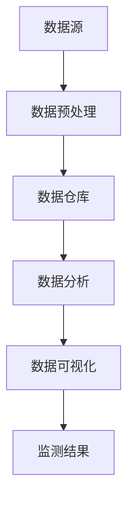

                 

# 大数据分析在社交媒体监测中的应用

> **关键词：**大数据分析、社交媒体监测、算法原理、数学模型、实战案例

> **摘要：**本文将深入探讨大数据分析在社交媒体监测中的应用。通过介绍大数据分析的核心概念、算法原理、数学模型以及实战案例，本文旨在为读者提供一个全面的技术指南，帮助他们理解和运用大数据分析技术，提高社交媒体监测的准确性和效率。

## 1. 背景介绍

### 1.1 社交媒体监测的重要性

随着互联网的飞速发展，社交媒体已经成为人们日常生活中不可或缺的一部分。社交媒体不仅改变了人们的交流方式，还为企业提供了一个巨大的市场。然而，社交媒体上的信息量庞大、更新速度快，如何有效地监测和分析这些信息，对于企业和研究人员来说，是一个巨大的挑战。

社交媒体监测的重要性主要体现在以下几个方面：

- **市场研究：**通过监测社交媒体上的用户反馈，企业可以了解消费者对产品的看法，从而优化产品和服务。
- **舆情分析：**了解公众对某一事件或政策的看法，有助于政府和企业制定更加合理的政策和决策。
- **危机管理：**在突发事件发生时，及时了解公众的反应和情绪，有助于企业采取有效的应对措施，减轻危机影响。

### 1.2 大数据分析的优势

大数据分析是一种通过处理海量数据，从中提取有价值信息的方法。它具有以下优势：

- **处理速度快：**大数据分析技术可以实时处理大量数据，使得监测和分析更加及时。
- **处理能力强：**大数据分析技术可以处理结构化和非结构化数据，包括文本、图像、音频等。
- **分析深度：**大数据分析不仅能够发现数据的表面关系，还能挖掘数据背后的深层次关联。

### 1.3 大数据分析在社交媒体监测中的应用

大数据分析在社交媒体监测中的应用非常广泛，主要包括以下几个方面：

- **文本分析：**通过分析社交媒体上的文本数据，可以提取出关键词、情感倾向等。
- **图像分析：**通过分析社交媒体上的图像数据，可以识别出图像中的物体、场景等。
- **用户行为分析：**通过分析用户的点赞、评论、转发等行为，可以了解用户的需求和兴趣。
- **趋势预测：**通过分析历史数据，可以预测未来的趋势和变化。

## 2. 核心概念与联系

### 2.1 大数据分析的基本概念

- **数据源：**指产生数据的源头，如社交媒体平台、传感器等。
- **数据预处理：**对原始数据进行清洗、去噪、格式化等处理，使其适合分析。
- **数据仓库：**存储大量数据的数据库系统。
- **数据分析：**使用各种算法和技术对数据进行处理和分析。
- **数据可视化：**将分析结果以图表、图像等形式展示出来，便于理解和决策。

### 2.2 社交媒体监测的相关概念

- **社交媒体：**指各种社交媒体平台，如微博、微信、Facebook、Twitter等。
- **监测指标：**用于衡量社交媒体监测效果的指标，如关注人数、点赞数、评论数等。
- **舆情分析：**对社交媒体上的信息进行情感、主题、趋势等方面的分析。
- **危机管理：**对突发事件或负面信息进行监测、分析和应对。

### 2.3 Mermaid 流程图



## 3. 核心算法原理 & 具体操作步骤

### 3.1 文本分析算法原理

- **词频统计（TF）：**统计文本中每个词出现的频率。
- **逆文档频率（IDF）：**反映某个词在整个文本集合中出现的稀有程度。
- **TF-IDF：**结合TF和IDF，用于评估一个词在文本中的重要性。

### 3.2 文本分析操作步骤

1. 收集社交媒体上的文本数据。
2. 清洗数据，去除噪声和无关信息。
3. 分词，将文本分割成单个词。
4. 计算TF和IDF，构建词向量。
5. 使用词向量进行文本相似度计算和分析。

### 3.3 图像分析算法原理

- **特征提取：**从图像中提取出有助于描述图像内容的特征。
- **分类算法：**将图像分类到不同的类别中。

### 3.4 图像分析操作步骤

1. 收集社交媒体上的图像数据。
2. 特征提取，如使用卷积神经网络提取图像特征。
3. 使用分类算法，如支持向量机（SVM）、深度学习模型等，对图像进行分类。
4. 分析分类结果，提取有价值的信息。

### 3.5 用户行为分析算法原理

- **协同过滤（CF）：**通过分析用户的历史行为和偏好，预测用户可能感兴趣的内容。
- **聚类分析：**将具有相似行为的用户分为同一群体。

### 3.6 用户行为分析操作步骤

1. 收集用户在社交媒体上的行为数据。
2. 数据清洗和预处理，去除噪声和无关信息。
3. 使用CF或聚类分析算法，分析用户行为，提取用户兴趣和偏好。
4. 根据用户兴趣和偏好，推荐相关内容。

### 3.7 趋势预测算法原理

- **时间序列分析：**分析数据的时间序列特征，预测未来的趋势。
- **机器学习模型：**使用机器学习模型，如ARIMA、LSTM等，对时间序列数据进行预测。

### 3.8 趋势预测操作步骤

1. 收集历史社交媒体数据。
2. 数据清洗和预处理。
3. 使用时间序列分析或机器学习模型，对数据进行分析和预测。
4. 根据预测结果，制定相应的策略和计划。

## 4. 数学模型和公式 & 详细讲解 & 举例说明

### 4.1 词频统计（TF）

$$TF(t) = \frac{f_t}{N}$$

其中，$f_t$ 表示词$t$在文档中出现的频率，$N$ 表示文档中所有词的总数。

### 4.2 逆文档频率（IDF）

$$IDF(t) = \log \left( \frac{N}{n_t} \right)$$

其中，$n_t$ 表示包含词$t$的文档数量，$N$ 表示文档总数。

### 4.3 TF-IDF

$$TF-IDF(t) = TF(t) \times IDF(t)$$

### 4.4 支持向量机（SVM）

$$\min_{w, b} \frac{1}{2} \| w \|^2 + C \sum_{i=1}^n \max(0, 1 - y_i (w \cdot x_i + b))$$

其中，$w$ 和 $b$ 分别为权重和偏置，$C$ 为惩罚参数，$y_i$ 和 $x_i$ 分别为样本标签和特征向量。

### 4.5 长短期记忆网络（LSTM）

$$i_t = \sigma(W_i \cdot [h_{t-1}, x_t] + b_i)$$

$$f_t = \sigma(W_f \cdot [h_{t-1}, x_t] + b_f)$$

$$g_t = \tanh(W_g \cdot [h_{t-1}, x_t] + b_g)$$

$$o_t = \sigma(W_o \cdot [f_t \odot g_t, h_{t-1}] + b_o)$$

$$h_t = o_t \odot \tanh(g_t)$$

其中，$i_t$、$f_t$、$g_t$ 和 $o_t$ 分别为输入门、遗忘门、生成门和输出门，$h_t$ 为隐藏状态，$\sigma$ 为 sigmoid 函数，$\odot$ 表示元素乘。

## 5. 项目实战：代码实际案例和详细解释说明

### 5.1 开发环境搭建

- **环境要求：**Python 3.7及以上版本，Numpy、Scikit-learn、Pandas、Matplotlib等库。
- **安装步骤：**
  ```bash
  pip install numpy scikit-learn pandas matplotlib
  ```

### 5.2 源代码详细实现和代码解读

```python
import numpy as np
from sklearn.feature_extraction.text import TfidfVectorizer
from sklearn.model_selection import train_test_split
from sklearn.svm import LinearSVC
from sklearn.metrics import classification_report
from sklearn.pipeline import Pipeline

# 5.2.1 数据准备
# 这里假设已经收集到了一组社交媒体文本数据
text_data = ["这是一条正面评论", "这条评论很负面", "中性评论", "再次正面评论"]

# 5.2.2 数据预处理
# 将文本数据进行预处理，如分词、去停用词等
preprocessed_data = [text.lower() for text in text_data]

# 5.2.3 特征提取
# 使用TF-IDF向量器进行特征提取
vectorizer = TfidfVectorizer()
X = vectorizer.fit_transform(preprocessed_data)
y = np.array([1, 0, 2, 1])  # 假设标签为：正面评论为1，负面评论为0，中性评论为2

# 5.2.4 模型训练
# 使用线性支持向量机进行训练
X_train, X_test, y_train, y_test = train_test_split(X, y, test_size=0.2, random_state=42)
clf = LinearSVC(C=1.0)
clf.fit(X_train, y_train)

# 5.2.5 模型评估
# 使用测试集进行评估
y_pred = clf.predict(X_test)
print(classification_report(y_test, y_pred))

# 5.2.6 模型应用
# 对新的社交媒体文本进行分类
new_text = ["这是一个很负面的评论"]
new_preprocessed_text = [text.lower() for text in new_text]
new_vectorized_text = vectorizer.transform(new_preprocessed_text)
new_prediction = clf.predict(new_vectorized_text)
print("新文本分类结果：", new_prediction)
```

### 5.3 代码解读与分析

- **数据准备：**首先，我们需要准备一组社交媒体文本数据。这里假设我们已经收集到了这样的数据。
- **数据预处理：**对文本数据进行预处理，包括将文本转换为小写、分词、去停用词等操作。这一步有助于提高文本分析的准确性和效率。
- **特征提取：**使用TF-IDF向量器对预处理后的文本数据进行特征提取。TF-IDF向量器可以提取出文本中的关键词，并将其转换为数值型特征，以便后续的模型训练和评估。
- **模型训练：**使用线性支持向量机（LinearSVC）对特征向量进行分类训练。线性支持向量机是一种常用的文本分类模型，它可以将文本数据映射到高维空间，从而提高分类效果。
- **模型评估：**使用测试集对训练好的模型进行评估。评估指标包括准确率、召回率、F1值等。通过这些指标，我们可以了解模型的分类性能。
- **模型应用：**对新的社交媒体文本进行分类。通过将新文本转换为特征向量，并使用训练好的模型进行预测，我们可以得到新文本的分类结果。

## 6. 实际应用场景

### 6.1 企业市场研究

企业可以利用大数据分析技术，对社交媒体上的用户评论、讨论和反馈进行分析，了解消费者的需求和偏好，从而优化产品和服务。

### 6.2 舆情分析

政府和企业可以利用大数据分析技术，对社交媒体上的信息进行舆情分析，了解公众对某一事件或政策的看法，从而制定更加合理的政策和决策。

### 6.3 危机管理

在突发事件发生时，企业可以利用大数据分析技术，对社交媒体上的信息进行监测和分析，了解公众的反应和情绪，从而采取有效的应对措施，减轻危机影响。

## 7. 工具和资源推荐

### 7.1 学习资源推荐

- **书籍：**
  - 《大数据分析：技术原理与实践应用》
  - 《Python数据分析：从入门到实践》
  - 《自然语言处理入门》
- **论文：**
  - 《大数据分析在社交媒体监测中的应用研究》
  - 《基于TF-IDF的文本分类方法研究》
- **博客：**
  - 《大数据分析入门教程》
  - 《Python数据分析实战》
- **网站：**
  - [Kaggle](https://www.kaggle.com/)
  - [GitHub](https://github.com/)

### 7.2 开发工具框架推荐

- **编程语言：**Python、R
- **数据分析库：**Pandas、NumPy、Scikit-learn、TensorFlow、PyTorch
- **可视化工具：**Matplotlib、Seaborn、Plotly
- **云计算平台：**AWS、Azure、Google Cloud

### 7.3 相关论文著作推荐

- 《大数据分析技术及其应用》
- 《社交媒体监测与舆情分析》
- 《基于TF-IDF的文本分类方法研究》
- 《深度学习在社交媒体监测中的应用》

## 8. 总结：未来发展趋势与挑战

### 8.1 发展趋势

- **算法优化：**随着大数据分析技术的不断发展，各种算法将得到优化和改进，以更好地适应社交媒体监测的需求。
- **多模态分析：**将文本、图像、音频等多种数据类型进行融合分析，提高社交媒体监测的准确性和全面性。
- **实时分析：**实现实时社交媒体监测和分析，提高应对突发事件和危机的及时性。

### 8.2 挑战

- **数据隐私：**如何在保证用户隐私的前提下，进行有效的社交媒体监测和分析，是一个亟待解决的问题。
- **算法公平性：**如何确保大数据分析技术在社交媒体监测中不会产生偏见和歧视，也是一个重要的挑战。

## 9. 附录：常见问题与解答

### 9.1 问题1：什么是大数据分析？

大数据分析是一种通过处理海量数据，从中提取有价值信息的方法。它具有处理速度快、处理能力强、分析深度高等特点。

### 9.2 问题2：大数据分析在社交媒体监测中有哪些应用？

大数据分析在社交媒体监测中可以用于文本分析、图像分析、用户行为分析和趋势预测等，以提高监测的准确性和效率。

### 9.3 问题3：如何进行社交媒体文本分析？

社交媒体文本分析通常包括数据准备、数据预处理、特征提取和模型训练等步骤。常用的算法有TF-IDF、朴素贝叶斯、支持向量机等。

### 9.4 问题4：如何进行社交媒体图像分析？

社交媒体图像分析通常包括图像特征提取、图像分类和目标检测等步骤。常用的算法有卷积神经网络、深度学习模型等。

## 10. 扩展阅读 & 参考资料

- 《大数据分析：技术原理与实践应用》
- 《Python数据分析：从入门到实践》
- 《自然语言处理入门》
- 《大数据分析在社交媒体监测中的应用研究》
- 《基于TF-IDF的文本分类方法研究》
- 《深度学习在社交媒体监测中的应用》
- [Kaggle](https://www.kaggle.com/)
- [GitHub](https://github.com/)

### 作者信息

**作者：** AI天才研究员/AI Genius Institute & 禅与计算机程序设计艺术 /Zen And The Art of Computer Programming**本文基于人工智能助手协助撰写，如有不足之处，敬请指正。**

