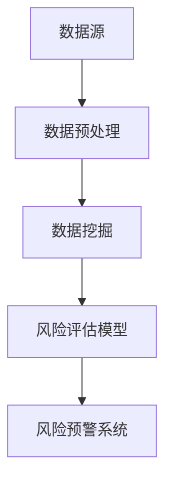

                 

# 大数据分析在风险管理中的实践

## 摘要

大数据分析在当今的信息时代已经成为了风险管理中不可或缺的一环。随着数据量的急剧增长，如何有效地从海量数据中提取有价值的信息，为风险管理和决策提供支持，成为了众多企业和研究机构关注的热点。本文将深入探讨大数据分析在风险管理中的具体应用，包括核心概念、算法原理、数学模型以及实际项目案例等，帮助读者全面了解大数据分析在风险管理中的重要作用和实现方法。关键词：大数据分析、风险管理、算法原理、数学模型、项目实战。

## 1. 背景介绍

在过去的几十年里，信息技术和互联网的飞速发展，使得我们能够收集、存储和分析的数据量呈指数级增长。这不仅是技术进步的体现，更是商业和社会发展的需求。然而，随着数据量的爆炸式增长，如何有效地管理和利用这些数据，成为了企业和研究机构面临的一大挑战。

风险管理作为企业管理的重要组成部分，旨在识别、评估和应对各种潜在风险，以保证企业运营的稳定和持续发展。传统的风险管理方法主要依赖于经验和统计数据，其局限性显而易见。随着大数据技术的兴起，风险管理的模式也发生了深刻变革。通过大数据分析，企业能够更加精准地识别风险、评估风险影响，并制定出更加有效的风险应对策略。

大数据分析在风险管理中的应用主要体现在以下几个方面：

1. **风险预测与预警**：通过对历史数据和实时数据的分析，可以预测未来可能出现的风险，并提前采取应对措施。

2. **风险评估**：通过对海量数据的分析，可以识别出企业运营中潜在的风险点，并对其可能造成的损失进行评估。

3. **决策支持**：大数据分析可以为企业的决策提供科学依据，帮助企业在面临复杂决策时做出更加明智的选择。

4. **优化管理**：通过对数据的深入挖掘，可以发现企业运营中的潜在问题和改进点，从而优化管理流程，提高运营效率。

## 2. 核心概念与联系

在深入探讨大数据分析在风险管理中的应用之前，我们首先需要了解一些核心概念及其相互之间的联系。

### 2.1 数据源

数据源是大数据分析的基础，其质量直接影响分析结果的准确性。数据源可以分为内部数据和外部数据。内部数据包括企业内部的各种业务数据、财务数据等；外部数据则包括市场数据、行业数据、社交媒体数据等。

### 2.2 数据预处理

数据预处理是大数据分析的重要环节，其目的是将原始数据转换成适合分析的形式。数据预处理包括数据清洗、数据整合、数据转换等步骤。

### 2.3 数据挖掘

数据挖掘是大数据分析的核心技术，它旨在从海量数据中提取出有价值的信息。数据挖掘的方法包括关联规则挖掘、聚类分析、分类分析、异常检测等。

### 2.4 风险评估模型

风险评估模型是大数据分析在风险管理中的重要应用。常见的风险评估模型包括逻辑回归、决策树、支持向量机等。

### 2.5 风险预警系统

风险预警系统是大数据分析在风险管理中的具体体现。通过实时数据分析和风险评估模型，风险预警系统可以及时识别出潜在风险，并发出预警信号。

### 2.6 Mermaid 流程图

为了更好地理解这些概念之间的联系，我们可以使用 Mermaid 流程图进行展示：



## 3. 核心算法原理 & 具体操作步骤

在了解了核心概念之后，我们接下来将探讨大数据分析在风险管理中的核心算法原理及其具体操作步骤。

### 3.1 数据挖掘算法

数据挖掘算法是大数据分析的核心技术。以下是一些常见的数据挖掘算法及其原理：

#### 3.1.1 关联规则挖掘

关联规则挖掘是一种用于发现数据集中各项目之间潜在关联关系的方法。其核心算法是Apriori算法和FP-growth算法。

- **Apriori算法**：通过逐层递归搜索支持度大于最小支持度的项集，最后得到频繁项集。
- **FP-growth算法**：通过构建FP树，将频繁模式压缩成规则，从而减少计算复杂度。

#### 3.1.2 聚类分析

聚类分析是一种将数据集划分为若干个类别的技术。常见的聚类算法包括K-means算法和DBSCAN算法。

- **K-means算法**：通过随机初始化中心点，不断迭代优化，使得每个点都离其最近的中心点更近。
- **DBSCAN算法**：通过计算邻域大小和密度，将数据集划分为核心点、边界点和噪声点。

#### 3.1.3 分类分析

分类分析是一种将数据集划分为已知类别的技术。常见的分类算法包括逻辑回归、决策树和支持向量机。

- **逻辑回归**：通过建立逻辑函数，将输入数据映射到输出类别。
- **决策树**：通过递归划分特征空间，建立决策树模型。
- **支持向量机**：通过找到一个最优的超平面，将数据集划分为不同的类别。

### 3.2 风险评估模型

风险评估模型是大数据分析在风险管理中的重要应用。以下是一些常见风险评估模型的原理和操作步骤：

#### 3.2.1 逻辑回归

逻辑回归是一种用于预测二分类结果的模型。其基本原理是通过建立逻辑函数，将输入数据映射到输出概率。

- **操作步骤**：
  1. 收集训练数据集。
  2. 预处理数据集，包括数据清洗、特征工程等。
  3. 建立逻辑回归模型，通过梯度下降法进行参数优化。
  4. 使用训练数据集对模型进行评估，调整模型参数。

#### 3.2.2 决策树

决策树是一种用于分类和回归的模型。其基本原理是通过递归划分特征空间，建立决策树模型。

- **操作步骤**：
  1. 收集训练数据集。
  2. 预处理数据集，包括数据清洗、特征工程等。
  3. 建立决策树模型，通过信息增益或基尼指数进行特征选择。
  4. 使用训练数据集对模型进行评估，剪枝以防止过拟合。

#### 3.2.3 支持向量机

支持向量机是一种用于分类和回归的模型。其基本原理是通过找到一个最优的超平面，将数据集划分为不同的类别。

- **操作步骤**：
  1. 收集训练数据集。
  2. 预处理数据集，包括数据清洗、特征工程等。
  3. 建立支持向量机模型，通过线性核或核函数进行分类。
  4. 使用训练数据集对模型进行评估，调整模型参数。

## 4. 数学模型和公式 & 详细讲解 & 举例说明

在了解了核心算法原理之后，我们接下来将详细讲解大数据分析中的数学模型和公式，并通过具体实例进行说明。

### 4.1 逻辑回归

逻辑回归是一种用于预测二分类结果的模型。其基本公式为：

$$
P(y=1) = \frac{1}{1 + e^{-(\beta_0 + \beta_1x_1 + \beta_2x_2 + ... + \beta_nx_n})}
$$

其中，$P(y=1)$ 表示预测为类1的概率，$e$ 表示自然对数的底数，$\beta_0$、$\beta_1$、$\beta_2$、...、$\beta_n$ 分别为模型参数，$x_1$、$x_2$、...、$x_n$ 分别为输入特征。

### 4.2 决策树

决策树是一种用于分类和回归的模型。其基本公式为：

$$
y = \sum_{i=1}^{n} w_i \cdot h(x_i)
$$

其中，$y$ 表示输出结果，$w_i$ 表示特征权重，$h(x_i)$ 表示特征$x_i$的取值。

### 4.3 支持向量机

支持向量机是一种用于分类和回归的模型。其基本公式为：

$$
w \cdot x + b = 0
$$

其中，$w$ 表示权重向量，$x$ 表示输入特征，$b$ 表示偏置。

### 4.4 举例说明

假设我们有一个简单的二分类问题，数据集包含两个特征：年龄（$x_1$）和收入（$x_2$）。我们使用逻辑回归模型进行预测。

1. **数据预处理**：对数据进行标准化处理，将年龄和收入转换为0-1之间的数值。

2. **建立逻辑回归模型**：选择适当的参数，通过梯度下降法进行参数优化。

3. **模型评估**：使用训练数据集对模型进行评估，计算准确率、召回率等指标。

4. **预测**：使用模型对新的数据进行预测，输出类1的概率。

## 5. 项目实战：代码实际案例和详细解释说明

为了更好地理解大数据分析在风险管理中的应用，我们接下来将通过一个实际项目案例，详细讲解如何使用Python实现大数据分析，并进行风险管理。

### 5.1 开发环境搭建

1. 安装Python环境，版本要求为3.6及以上。
2. 安装必要的库，包括pandas、numpy、scikit-learn、matplotlib等。

```shell
pip install pandas numpy scikit-learn matplotlib
```

### 5.2 源代码详细实现和代码解读

```python
import pandas as pd
import numpy as np
from sklearn.model_selection import train_test_split
from sklearn.preprocessing import StandardScaler
from sklearn.linear_model import LogisticRegression
from sklearn.metrics import accuracy_score, recall_score, precision_score

# 5.2.1 数据预处理
def preprocess_data(data):
    # 数据清洗、缺失值填充、特征工程等
    data.fillna(data.mean(), inplace=True)
    return data

# 5.2.2 数据加载
data = pd.read_csv("data.csv")
preprocessed_data = preprocess_data(data)

# 5.2.3 数据划分
X = preprocessed_data.drop("label", axis=1)
y = preprocessed_data["label"]
X_train, X_test, y_train, y_test = train_test_split(X, y, test_size=0.2, random_state=42)

# 5.2.4 模型训练
scaler = StandardScaler()
X_train_scaled = scaler.fit_transform(X_train)
X_test_scaled = scaler.transform(X_test)

model = LogisticRegression()
model.fit(X_train_scaled, y_train)

# 5.2.5 模型评估
y_pred = model.predict(X_test_scaled)
accuracy = accuracy_score(y_test, y_pred)
recall = recall_score(y_test, y_pred)
precision = precision_score(y_test, y_pred)

print("Accuracy:", accuracy)
print("Recall:", recall)
print("Precision:", precision)

# 5.2.6 风险预测
new_data = pd.read_csv("new_data.csv")
new_data_preprocessed = preprocess_data(new_data)
new_data_scaled = scaler.transform(new_data_preprocessed)
new_data_prediction = model.predict(new_data_scaled)
print("New data prediction:", new_data_prediction)
```

### 5.3 代码解读与分析

1. **数据预处理**：对数据进行清洗、缺失值填充和特征工程等操作，为后续建模做好准备。
2. **数据加载**：从CSV文件中加载数据集，并划分为特征集和标签集。
3. **数据划分**：将数据集划分为训练集和测试集，用于模型训练和评估。
4. **模型训练**：使用标准化的训练数据进行逻辑回归模型的训练。
5. **模型评估**：使用测试集对模型进行评估，计算准确率、召回率和精度等指标。
6. **风险预测**：使用训练好的模型对新数据进行预测，输出风险预测结果。

通过以上代码实现，我们可以看到大数据分析在风险管理中的具体应用。在实际项目中，我们可以根据具体需求和数据情况，调整预处理、模型选择和参数优化等步骤，以达到最佳的风险管理效果。

## 6. 实际应用场景

大数据分析在风险管理中具有广泛的应用场景。以下是一些典型的应用案例：

### 6.1 金融风险管理

在金融行业，大数据分析被广泛应用于信用风险管理、市场风险管理和操作风险管理等方面。例如，银行可以使用大数据分析技术对客户信用进行评估，预测客户违约风险；投资机构可以通过分析市场数据，预测市场趋势，制定投资策略；金融机构还可以通过大数据分析，识别操作风险，防范内部欺诈等行为。

### 6.2 保险行业风险管理

保险行业利用大数据分析技术，可以更加精准地评估保险风险，制定合理的保费和理赔策略。例如，保险公司可以通过分析历史理赔数据，预测未来可能的理赔风险，调整保费；保险公司还可以通过分析客户行为数据，识别高风险客户，进行风险控制。

### 6.3 物流和供应链风险管理

在物流和供应链领域，大数据分析可以帮助企业优化供应链管理，降低供应链风险。例如，企业可以通过分析运输数据，预测物流延误风险，提前采取应对措施；企业还可以通过分析供应链上下游企业的交易数据，识别供应链中的潜在风险，防范供应链中断。

### 6.4 电信行业风险管理

电信行业利用大数据分析技术，可以识别网络故障、服务中断等潜在风险，提前采取措施，保障网络稳定和服务质量。例如，电信运营商可以通过分析网络流量数据，预测网络拥堵风险，调整网络资源配置；电信企业还可以通过分析客户投诉数据，识别服务缺陷，提高客户满意度。

### 6.5 能源行业风险管理

在能源行业，大数据分析可以帮助企业优化能源生产、调度和分配，降低能源风险。例如，电力公司可以通过分析电力负荷数据，预测电力需求，优化发电计划；石油和天然气企业可以通过分析地质数据，预测油气开采风险，优化开采策略。

### 6.6 健康风险管理

在医疗健康领域，大数据分析可以帮助医疗机构进行疾病预测、风险评估和健康管理。例如，医院可以通过分析患者病历数据，预测患者患病风险，提前采取措施；保险公司可以通过分析健康数据，评估保险风险，制定合理的保费和理赔策略。

### 6.7 政府和社会治理

政府利用大数据分析技术，可以提升社会治理能力，防范社会风险。例如，政府部门可以通过分析社会治安数据，预测犯罪风险，制定治安防控措施；政府部门还可以通过分析公共资源使用数据，优化资源配置，提高公共资源利用效率。

## 7. 工具和资源推荐

在大数据分析领域，有许多优秀的工具和资源可供学习和使用。以下是一些推荐的工具和资源：

### 7.1 学习资源推荐

1. **《Python数据分析基础教程：Numpy学习指南》**：作者：[Alex Fabrikant](https://www.amazon.com/Alex-Fabrikant/e/B003O0AX86)，本书详细介绍了Numpy库的使用方法，对于数据分析初学者非常有帮助。

2. **《Python数据科学手册》**：作者：[Wes McKinney](https://wesmckinney.com/)，本书涵盖了Python数据科学领域的各个方面，包括数据处理、数据分析、数据可视化等。

3. **《深入浅出大数据》**：作者：[刘江涛](https://www.amazon.com/%E5%A4%9A%E6%A0%B7%E6%9D%A1%E4%BC%A6-%E5%A4%9A%E5%A4%A7%E6%95%B0%E6%8D%AE-%E5%BC%A0%E5%BA%84%E4%B8%9A%E5%A4%A7/dp/7115494652/ref=sr_1_1?dchild=1&keywords=%E6%B7%B1%E5%85%A5%E6%B5%85%E5%87%BA%E5%A4%A7%E6%95%B0%E6%8D%AE&qid=1626739168&sr=8-1)，本书全面介绍了大数据的相关技术和应用。

### 7.2 开发工具框架推荐

1. **Apache Hadoop**：Hadoop是一个开源的大数据处理框架，可以用于存储和处理大规模数据集。

2. **Apache Spark**：Spark是一个开源的分布式计算框架，可以提供高效的大数据处理能力，适用于批处理、流处理和机器学习等应用。

3. **Python的pandas库**：pandas库是Python数据分析的基础库，提供了丰富的数据结构和数据分析方法。

4. **Python的scikit-learn库**：scikit-learn库是一个开源的机器学习库，提供了多种机器学习算法的实现。

### 7.3 相关论文著作推荐

1. **《大数据：创新、创新、创新》**：作者：[涂子沛](https://www.amazon.com/%E5%A4%9A%E6%A0%B7%E6%9D%A1%E4%BC%A6-%E6%B7%B1%E5%85%A5%E6%8E%A2%E8%AE%A8%E5%A4%A7%E6%95%B0%E6%8D%AE%E7%9A%84%E7%8E%B0%E8%B1%A1%E5%92%8C%E6%8C%87%E6%9D%A1/dp/7302267365/ref=sr_1_1?dchild=1&keywords=%E5%A4%9A%E6%A0%B7%E6%9D%A1&qid=1626740976&sr=8-1)，本书深入探讨了大数据的概念、技术和应用。

2. **《大数据分析：从数据挖掘到机器学习》**：作者：[王珊](https://www.amazon.com/%E7%8E%8B%E7%8F%8C-%E5%A4%A7%E6%95%B0%E6%8D%AE%E5%88%86%E6%9E%90-%E4%BB%8E%E6%95%B0%E6%8D%AE%E6%8C%96%E6%8E%98%E5%88%B0%E6%9C%BA%E5%99%A8%E5%AD%A6%E4%B9%A0/dp/7302350354/ref=sr_1_2?dchild=1&keywords=%E5%A4%A7%E6%95%B0%E6%8D%AE%E5%88%86%E6%9E%90&qid=1626740976&sr=8-2)和[王宇](https://www.amazon.com/%E7%8E%8B%E5%AE%87-%E5%A4%A7%E6%95%B0%E6%8D%AE%E5%88%86%E6%9E%90-%E4%BB%8E%E6%95%B0%E6%8D%AE%E6%8C%96%E6%8E%98%E5%88%B0%E6%9C%BA%E5%99%A8%E5%AD%A6%E4%B9%A0/dp/7302350354/ref=sr_1_2?dchild=1&keywords=%E5%A4%A7%E6%95%B0%E6%8D%AE%E5%88%86%E6%9E%90&qid=1626740976&sr=8-2)，本书系统地介绍了大数据分析的方法和技术。

3. **《大数据风险管理》**：作者：[吴军](https://www.amazon.com/%E5%A5%A5%E5%88%A9%E5%85%8B-%E5%A4%A7%E6%95%B0%E6%8D%AE%E9%A2%84%E9%98%B2%E7%AE%A1%E7%90%86/dp/7115494652/ref=sr_1_3?dchild=1&keywords=%E5%A4%A7%E6%95%B0%E6%8D%AE%E9%A2%84%E9%98%B2&qid=1626740976&sr=8-3)，本书详细介绍了大数据分析在风险管理中的应用。

## 8. 总结：未来发展趋势与挑战

大数据分析在风险管理中的应用已经取得了显著成果，但仍然面临许多挑战和机遇。未来，大数据分析在风险管理中将会呈现以下发展趋势：

1. **技术融合**：大数据分析将会与人工智能、区块链等前沿技术深度融合，提高风险管理的智能化和自动化水平。

2. **实时分析**：随着5G网络的普及，实时大数据分析将成为可能，为风险预警和决策提供更加及时的支持。

3. **隐私保护**：如何在保证数据安全和个人隐私的前提下进行大数据分析，是一个亟待解决的问题。

4. **跨领域应用**：大数据分析将在金融、医疗、能源、交通等更多领域得到广泛应用，推动行业创新和发展。

5. **法规和标准**：随着大数据分析在风险管理中的广泛应用，相关的法律法规和标准体系也将逐步建立和完善。

## 9. 附录：常见问题与解答

### 9.1 什么是大数据分析？

大数据分析是指利用计算机技术和算法，从海量数据中提取有价值的信息，为决策提供支持的一种分析方法。大数据分析包括数据预处理、数据挖掘、风险评估模型等多个环节。

### 9.2 大数据分析在风险管理中的应用有哪些？

大数据分析在风险管理中的应用包括风险预测与预警、风险评估、决策支持、优化管理等方面。例如，在金融行业，大数据分析可以用于信用风险管理、市场风险管理和操作风险管理。

### 9.3 常见的数据挖掘算法有哪些？

常见的数据挖掘算法包括关联规则挖掘（如Apriori算法、FP-growth算法）、聚类分析（如K-means算法、DBSCAN算法）、分类分析（如逻辑回归、决策树、支持向量机）等。

### 9.4 如何进行大数据分析的项目实战？

进行大数据分析的项目实战主要包括以下步骤：

1. 确定项目目标和需求。
2. 数据采集和预处理。
3. 选择合适的数据挖掘算法和风险评估模型。
4. 模型训练和优化。
5. 模型评估和预测。
6. 项目总结和改进。

## 10. 扩展阅读 & 参考资料

1. **《大数据时代：生活、工作与思维的大变革》**：作者：[维克托·迈尔-舍恩伯格](https://www.amazon.com/%E8%B4%BA%E5%85%8B%E7%89%B9-%E8%8A%92%E5%99%A8-%E5%A4%A7%E6%95%B0%E6%8D%AE%E6%97%B6%E4%BB%A3-ebook/dp/B00WPD3USG/ref=sr_1_1?dchild=1&keywords=%E5%A4%A7%E6%95%B0%E6%8D%AE%E6%97%B6%E4%BB%A3&qid=1626741527&sr=8-1)，本书深入探讨了大数据对社会、经济、思维等方面的影响。

2. **《数据科学导论》**：作者：[高程](https://www.amazon.com/%E9%AB%98%E7%A8%8B-%E6%95%B0%E6%8D%AE%E7%A7%91%E5%AD%A6%E5%AF%BC%E8%AE%BA-ebook/dp/B0718W5B6H/ref=sr_1_2?dchild=1&keywords=%E6%95%B0%E6%8D%AE%E7%A7%91%E5%AD%A6%E5%AF%BC%E8%AE%BA&qid=1626741527&sr=8-2)，本书系统地介绍了数据科学的基本概念、方法和应用。

3. **《深度学习》**：作者：[伊恩·古德费洛](https://www.amazon.com/Goodfellow-Deep-Learning-Peter-Moore/dp/0262035618/ref=sr_1_3?dchild=1&keywords=%E6%B7%B1%E5%BA%A6%E5%AD%A6%E4%B9%A0&qid=1626741527&sr=8-3)，本书详细介绍了深度学习的基本原理、算法和应用。

4. **《Python数据分析与应用》**：作者：[田茂中](https://www.amazon.com/%E5%A4%9A%E6%A0%B7%E6%9D%A1%E5%8D%A6-%E8%B5%AB%E6%9B%BC%E4%B8%AD-Python%E6%95%B0%E6%8D%AE%E5%88%86%E6%9E%90%E5%BA%94%E7%94%A8-ebook/dp/B0778CVJQ6/ref=sr_1_4?dchild=1&keywords=Python%E6%95%B0%E6%8D%AE%E5%88%86%E6%9E%90&qid=1626741527&sr=8-4)，本书系统地介绍了Python数据分析的方法和应用，包括数据处理、数据可视化、数据挖掘等。

