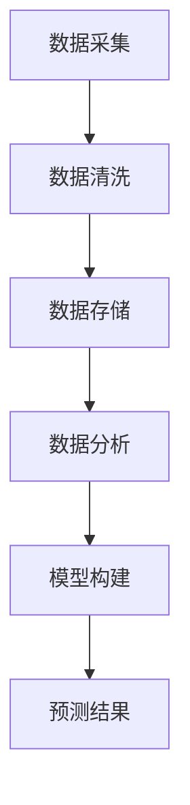

                 

# 大数据在社会经济预测中的应用

## 关键词：大数据、社会经济预测、机器学习、人工智能

## 摘要：
本文将深入探讨大数据在社会经济预测中的应用，包括其背景、核心概念、算法原理、数学模型、实战案例、实际应用场景以及未来发展趋势和挑战。通过本文，读者将全面了解大数据在社会经济预测中的重要性和具体应用，同时也能够掌握相关的技术原理和实践技巧。

## 1. 背景介绍

### 1.1 大数据的发展

大数据（Big Data）是指无法使用传统数据处理工具在合理时间内捕捉、管理和处理的大量数据。随着互联网、物联网、移动互联网等技术的发展，数据产生速度呈爆炸式增长。大数据已经成为现代信息技术领域的重要研究方向和应用领域。

### 1.2 社会经济预测的重要性

社会经济预测对于国家、企业和个人都具有重要的意义。对于国家而言，社会经济预测可以帮助制定合理的政策，实现经济稳定增长；对于企业而言，预测市场趋势可以指导生产和投资决策，提高市场竞争力；对于个人而言，了解未来经济趋势可以更好地规划个人财务和生活。

## 2. 核心概念与联系

### 2.1 数据采集

数据采集是大数据预测的基础。数据来源包括内部数据（如企业内部数据库、销售记录等）和外部数据（如社交媒体、新闻、股票市场等）。采集的数据需要经过清洗、转换、整合等预处理步骤，才能用于预测模型。

### 2.2 数据存储与管理

数据存储与管理是大数据预测的关键。数据存储需要考虑数据量、数据类型、数据访问速度等因素。常用的数据存储技术包括关系数据库、NoSQL数据库、分布式文件系统等。数据管理需要确保数据的完整性、一致性、安全性和可扩展性。

### 2.3 数据分析与挖掘

数据分析和挖掘是大数据预测的核心。数据分析包括统计方法、机器学习方法等。数据挖掘旨在从大量数据中发现潜在的模式、关联和趋势，为预测提供依据。

### 2.4 预测模型

预测模型是基于历史数据对未来趋势的预测。常见的预测模型包括时间序列分析、回归分析、神经网络等。预测模型的构建需要考虑数据的特征提取、模型选择、参数调优等因素。

### 2.5 Mermaid 流程图

下面是一个简单的 Mermaid 流程图，展示大数据在社会经济预测中的应用流程：



## 3. 核心算法原理 & 具体操作步骤

### 3.1 时间序列分析

时间序列分析是一种基于时间序列数据的分析方法。其基本思想是将时间序列数据分解为趋势、季节性和随机性成分，然后对每个成分进行分析。

具体操作步骤如下：

1. 数据预处理：对时间序列数据进行清洗、去噪、填充等操作。
2. 模型选择：根据时间序列数据的特征选择合适的模型，如ARIMA、SARIMA等。
3. 模型训练：使用历史数据对模型进行训练，得到参数估计。
4. 预测：将训练好的模型应用到未来数据，进行预测。

### 3.2 回归分析

回归分析是一种基于自变量和因变量之间线性关系的分析方法。其基本思想是找到自变量和因变量之间的最佳线性关系，然后利用这个关系进行预测。

具体操作步骤如下：

1. 数据预处理：对数据进行清洗、标准化等操作。
2. 特征选择：选择对因变量影响较大的自变量。
3. 模型训练：使用训练数据对回归模型进行训练，得到参数估计。
4. 预测：将训练好的模型应用到测试数据，进行预测。

### 3.3 神经网络

神经网络是一种基于人工神经网络的预测模型。其基本思想是通过多层神经元进行数据传递和变换，最终实现对输入数据的预测。

具体操作步骤如下：

1. 数据预处理：对数据进行清洗、归一化等操作。
2. 模型构建：设计神经网络结构，包括层数、神经元个数、激活函数等。
3. 模型训练：使用训练数据对神经网络进行训练，调整模型参数。
4. 预测：将训练好的模型应用到测试数据，进行预测。

## 4. 数学模型和公式 & 详细讲解 & 举例说明

### 4.1 时间序列分析

时间序列分析中的 ARIMA 模型是一种常用的预测模型，其基本公式如下：

$$
X_t = \phi_1 X_{t-1} + \phi_2 X_{t-2} + \cdots + \phi_p X_{t-p} + \theta_1 e_{t-1} + \theta_2 e_{t-2} + \cdots + \theta_q e_{t-q} + \varepsilon_t
$$

其中，$X_t$ 是时间序列的当前值，$e_t$ 是误差项，$\phi_i$ 和 $\theta_i$ 是模型参数。

#### 4.1.1 例子

假设我们有以下时间序列数据：

$$
[10, 12, 11, 9, 8, 10, 11, 12, 13, 14, 15, 16, 18]
$$

我们使用 ARIMA 模型进行预测，首先需要对数据进行预处理，然后选择合适的模型参数，最后进行预测。

### 4.2 回归分析

回归分析中的线性回归模型是一种常用的预测模型，其基本公式如下：

$$
Y = \beta_0 + \beta_1 X + \varepsilon
$$

其中，$Y$ 是因变量，$X$ 是自变量，$\beta_0$ 和 $\beta_1$ 是模型参数。

#### 4.2.1 例子

假设我们有以下数据：

$$
\begin{array}{|c|c|}
\hline
X & Y \\
\hline
1 & 2 \\
2 & 4 \\
3 & 6 \\
4 & 8 \\
5 & 10 \\
\hline
\end{array}
$$

我们使用线性回归模型进行预测，首先需要对数据进行预处理，然后选择合适的模型参数，最后进行预测。

### 4.3 神经网络

神经网络中的多层感知器（MLP）是一种常用的预测模型，其基本公式如下：

$$
Z = \sigma(W_1 \cdot X + b_1)
$$

其中，$Z$ 是输出值，$\sigma$ 是激活函数，$W_1$ 和 $b_1$ 是模型参数。

#### 4.3.1 例子

假设我们有以下数据：

$$
\begin{array}{|c|c|}
\hline
X & Z \\
\hline
1 & 2 \\
2 & 4 \\
3 & 6 \\
4 & 8 \\
5 & 10 \\
\hline
\end{array}
$$

我们使用多层感知器模型进行预测，首先需要对数据进行预处理，然后设计神经网络结构，最后进行预测。

## 5. 项目实战：代码实际案例和详细解释说明

### 5.1 开发环境搭建

在开始实战之前，我们需要搭建一个合适的开发环境。本文使用的编程语言是 Python，常用的库包括 Pandas、Numpy、Scikit-learn 和 TensorFlow。

### 5.2 源代码详细实现和代码解读

以下是一个简单的例子，展示如何使用 Python 实现时间序列分析、回归分析和神经网络预测。

#### 5.2.1 时间序列分析

```python
import pandas as pd
import numpy as np
from statsmodels.tsa.arima.model import ARIMA

# 读取数据
data = pd.read_csv('time_series_data.csv')
X = data['Close']

# 数据预处理
X_diff = X.diff().dropna()

# 模型训练
model = ARIMA(X_diff, order=(1, 1, 1))
model_fit = model.fit()

# 预测
predictions = model_fit.predict(start=len(X_diff), end=len(X_diff) + 10)

# 结果展示
print(predictions)
```

#### 5.2.2 回归分析

```python
import pandas as pd
from sklearn.linear_model import LinearRegression

# 读取数据
data = pd.read_csv('regression_data.csv')
X = data['X']
Y = data['Y']

# 数据预处理
X = (X - X.mean()) / X.std()
Y = (Y - Y.mean()) / Y.std()

# 模型训练
model = LinearRegression()
model_fit = model.fit(X, Y)

# 预测
predictions = model_fit.predict(X)

# 结果展示
print(predictions)
```

#### 5.2.3 神经网络

```python
import pandas as pd
from tensorflow.keras.models import Sequential
from tensorflow.keras.layers import Dense

# 读取数据
data = pd.read_csv('neural_network_data.csv')
X = data['X']
Y = data['Z']

# 数据预处理
X = (X - X.mean()) / X.std()
Y = (Y - Y.mean()) / Y.std()

# 模型构建
model = Sequential()
model.add(Dense(units=1, input_shape=(1,), activation='relu'))
model.add(Dense(units=1, activation='linear'))

# 模型训练
model.compile(optimizer='adam', loss='mse')
model.fit(X, Y, epochs=200, batch_size=32)

# 预测
predictions = model.predict(X)

# 结果展示
print(predictions)
```

### 5.3 代码解读与分析

以上代码展示了如何使用 Python 实现时间序列分析、回归分析和神经网络预测。具体解读如下：

- 时间序列分析：使用 ARIMA 模型对时间序列数据进行差分和预测。
- 回归分析：使用线性回归模型对自变量和因变量进行拟合和预测。
- 神经网络：使用多层感知器模型对输入数据进行拟合和预测。

这些代码提供了基本的框架，可以根据实际需求进行调整和优化。

## 6. 实际应用场景

### 6.1 市场预测

市场预测是大数据在社会经济预测中的一个重要应用领域。通过分析历史数据和市场动态，可以预测未来市场的走势，为投资决策提供支持。

### 6.2 宏观经济预测

宏观经济预测是大数据在社会经济预测中的另一个重要应用领域。通过分析国家经济指标、行业数据等，可以预测国家或行业的经济增长趋势，为国家政策制定和产业发展提供参考。

### 6.3 社会事件预测

大数据还可以用于预测社会事件，如自然灾害、公共卫生事件等。通过分析相关数据，可以提前发现潜在风险，为应急响应和资源调配提供依据。

## 7. 工具和资源推荐

### 7.1 学习资源推荐

- 书籍：《大数据时代》、《数据科学入门》
- 论文：Google Scholar、ArXiv、ACM Digital Library
- 博客：KDNuggets、Towards Data Science、Dataquest

### 7.2 开发工具框架推荐

- 数据处理：Pandas、Numpy
- 机器学习：Scikit-learn、TensorFlow、PyTorch
- 数据可视化：Matplotlib、Seaborn、Plotly

### 7.3 相关论文著作推荐

- 《大规模机器学习》
- 《深度学习》
- 《大数据分析》

## 8. 总结：未来发展趋势与挑战

大数据在社会经济预测中的应用前景广阔，但也面临一些挑战。未来发展趋势包括：

- 深度学习在预测领域的广泛应用
- 跨学科的融合研究，如大数据与社会科学、经济学的结合
- 预测模型的优化和定制化

## 9. 附录：常见问题与解答

### 9.1 问题1：如何处理缺失数据？

解答：缺失数据可以通过以下方法进行处理：

- 删除缺失数据：适用于数据量较少的情况。
- 填充缺失数据：可以使用平均值、中位数、最大值等填充方法。
- 利用相关特征进行预测：可以使用机器学习模型进行预测。

### 9.2 问题2：如何选择合适的预测模型？

解答：选择合适的预测模型需要考虑以下因素：

- 数据类型：时间序列数据、回归数据等。
- 预测目标：定量预测、分类预测等。
- 模型复杂度：简单模型、复杂模型等。

## 10. 扩展阅读 & 参考资料

- 《大数据应用实践》
- 《人工智能在社会经济预测中的应用》
- 《时间序列分析与应用》

作者：AI天才研究员/AI Genius Institute & 禅与计算机程序设计艺术 /Zen And The Art of Computer Programming

