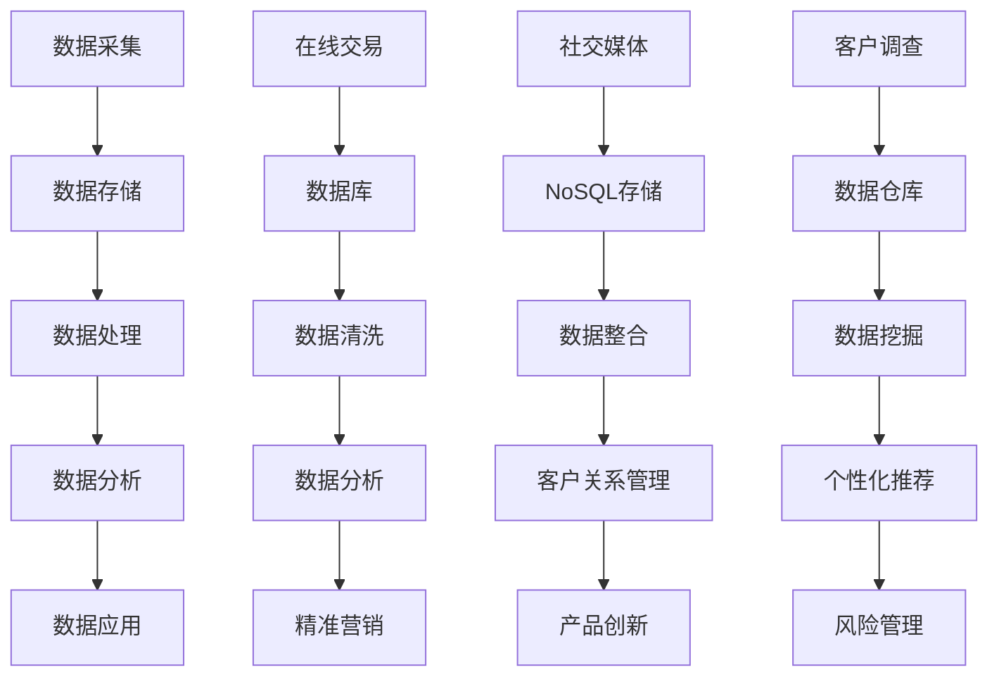

                 

### 背景介绍

在大数据时代，消费者数据已成为企业宝贵的资产。随着数据采集和处理技术的不断发展，如何有效地利用这些数据，为企业和消费者创造更大的价值，成为当前研究的热点。本文旨在探讨大数据环境下消费者数据应用的分析与研究，重点分析消费者数据的应用场景、核心算法原理、数学模型以及实际项目实战。

消费者数据是指与企业消费者相关的各种信息，包括个人基本信息、消费行为、偏好、历史订单等。这些数据来源广泛，包括线上和线下的交易记录、社交媒体互动、客户调查等。随着互联网和移动互联网的普及，消费者数据的规模和多样性不断增加，为企业提供了丰富的数据资源。

大数据环境下，消费者数据的应用领域广泛，主要包括以下几个方面：

1. **精准营销**：通过对消费者数据的分析，企业可以更好地了解消费者的需求和偏好，实现精准营销，提高营销效果。

2. **个性化推荐**：基于消费者数据，构建个性化推荐系统，为消费者提供个性化的商品、服务或内容。

3. **风险管理**：利用消费者数据，进行信用评估、欺诈检测等，降低企业经营风险。

4. **客户关系管理**：通过对消费者数据的分析，优化客户服务流程，提高客户满意度。

5. **产品创新**：基于消费者数据，了解市场需求和趋势，推动产品创新。

本文将围绕上述应用领域，深入探讨消费者数据的应用方法和技术原理，旨在为企业和研究人员提供有益的参考。

在接下来的章节中，我们将首先介绍消费者数据应用中的核心概念和联系，并通过Mermaid流程图展示相关的架构。然后，我们将详细讲解核心算法原理和具体操作步骤，并运用数学模型和公式进行分析。此外，我们还将通过实际项目案例，展示代码的实际应用和详细解读。最后，我们将探讨消费者数据应用的实际场景，并推荐相关工具和资源。

### 核心概念与联系

在深入探讨大数据环境下消费者数据应用之前，有必要明确几个核心概念，并了解它们之间的相互联系。这些核心概念包括数据采集、数据存储、数据处理、数据分析和数据应用。以下是一个使用Mermaid绘制的流程图，展示了这些概念及其在消费者数据应用中的关系。



**数据采集**：数据采集是整个流程的起点，包括从各种渠道收集消费者数据，如在线交易、社交媒体互动和客户调查等。这些数据可以是结构化的，如数据库中的记录，也可以是非结构化的，如社交媒体上的评论和反馈。

**数据存储**：数据存储是数据管理的重要环节，根据数据的类型和特性，可以选择不同的存储方式。结构化数据通常存储在关系数据库中，而非结构化数据则更适合存储在NoSQL数据库或数据仓库中。

**数据处理**：数据处理包括数据清洗、数据整合和数据预处理等步骤，确保数据的质量和一致性。数据清洗是数据处理的关键步骤，旨在去除重复数据、纠正错误数据，并填充缺失数据。

**数据分析**：数据分析是利用统计方法、机器学习算法等，从数据中提取有价值的信息。通过数据分析，企业可以了解消费者的行为模式、需求偏好，并据此做出决策。

**数据应用**：数据应用是将分析结果应用于实际业务场景，如精准营销、个性化推荐、风险管理等。数据应用的目标是提高企业的运营效率和客户满意度，实现商业价值。

通过以上流程图，我们可以清晰地看到消费者数据从采集、存储、处理到应用的全过程。接下来，我们将深入探讨这些核心概念的应用原理和方法。

#### 核心算法原理 & 具体操作步骤

在消费者数据应用中，核心算法原理起着至关重要的作用。以下将详细介绍几种常用的核心算法，并给出具体操作步骤。

##### 1. K-means聚类算法

K-means算法是一种经典的聚类算法，通过将数据点分配到K个簇中，使得每个簇内部的点尽可能接近，而簇与簇之间的点尽可能远。以下是K-means算法的具体操作步骤：

**步骤1：初始化聚类中心**

- 随机选择K个数据点作为初始聚类中心。

**步骤2：分配数据点**

- 对于每个数据点，计算其与各个聚类中心的距离，并将其分配到距离最近的聚类中心所代表的簇。

**步骤3：更新聚类中心**

- 计算每个簇的新聚类中心，即将簇内所有数据点的平均值作为新的聚类中心。

**步骤4：重复步骤2和步骤3，直至聚类中心不再发生变化或达到设定的迭代次数。**

**算法原理**：K-means算法基于距离度量，通过迭代更新聚类中心，逐渐优化聚类结果。其目标是使每个簇内的平方误差和（每个数据点与聚类中心的距离平方和）最小化。

##### 2. 决策树算法

决策树是一种基于特征进行分类或回归的算法。每个内部节点表示一个特征，每个分支表示该特征的取值，每个叶节点表示一个类别或数值。以下是决策树算法的具体操作步骤：

**步骤1：计算特征的重要性**

- 使用信息增益、基尼不纯度等指标计算每个特征的重要性。

**步骤2：选择最佳特征**

- 根据特征的重要性选择最佳特征进行分割。

**步骤3：递归构建决策树**

- 对于当前特征的所有可能取值，将数据集分割成子集。
- 对每个子集重复步骤1和步骤2，直至达到预设的停止条件（如最大深度、最小样本数等）。

**算法原理**：决策树通过递归分割数据集，逐步构建一棵树状结构。每个叶节点代表一个类或值，预测时从根节点开始，根据输入特征的取值选择相应的分支，直到达到叶节点。

##### 3. 聚类协同过滤算法

聚类协同过滤是一种基于用户和物品的相似度进行推荐的算法。以下是聚类协同过滤算法的具体操作步骤：

**步骤1：聚类用户或物品**

- 使用K-means等聚类算法，将用户或物品聚成若干个簇。

**步骤2：计算相似度**

- 对于每个簇内的用户或物品，计算它们之间的相似度（如余弦相似度、皮尔逊相关系数等）。

**步骤3：生成推荐列表**

- 对于目标用户，找到与其最相似的用户或物品，基于相似度生成推荐列表。

**算法原理**：聚类协同过滤通过聚类用户或物品，将具有相似兴趣的用户或物品分到同一簇。通过计算簇内用户或物品的相似度，为用户提供个性化的推荐。

以上介绍了K-means聚类算法、决策树算法和聚类协同过滤算法的核心原理和具体操作步骤。这些算法在消费者数据应用中具有广泛的应用，可以帮助企业实现精准营销、个性化推荐和风险管理等目标。在下一部分，我们将运用数学模型和公式，对这些算法进行详细分析。

#### 数学模型和公式 & 详细讲解 & 举例说明

在消费者数据应用中，数学模型和公式起着至关重要的作用。以下将详细讲解几种常用的数学模型和公式，并通过具体例子进行说明。

##### 1. K-means聚类算法

K-means算法的核心是聚类中心的选择和数据点的分配。以下是其主要数学模型：

**目标函数**：最小化簇内平方误差和（Sum of Squared Errors, SSE）。
$$
J = \sum_{i=1}^k \sum_{x \in S_i} ||x - \mu_i||^2
$$
其中，$k$ 为聚类个数，$S_i$ 为第 $i$ 个簇，$\mu_i$ 为第 $i$ 个聚类中心的坐标。

**步骤2：分配数据点**：数据点的分配依据数据点到聚类中心的距离，即：
$$
C(x) = \arg\min_{i} ||x - \mu_i||^2
$$

**步骤3：更新聚类中心**：聚类中心更新为簇内数据点的平均值：
$$
\mu_i = \frac{1}{|S_i|} \sum_{x \in S_i} x
$$

**例子**：设有5个数据点 $X = \{x_1, x_2, x_3, x_4, x_5\}$，初始聚类中心为 $\mu_1 = (1, 1)$，$\mu_2 = (5, 5)$。首先计算每个数据点到两个聚类中心的距离：
$$
d_1(x_i) = ||x_i - \mu_1||^2 = (x_i^1 - 1)^2 + (x_i^2 - 1)^2
$$
$$
d_2(x_i) = ||x_i - \mu_2||^2 = (x_i^1 - 5)^2 + (x_i^2 - 5)^2
$$
计算结果如下表所示：

| $x_i$ | $x_i^1$ | $x_i^2$ | $d_1(x_i)$ | $d_2(x_i)$ |
|-------|---------|---------|------------|------------|
| $x_1$ | 1       | 1       | 0          | 16         |
| $x_2$ | 2       | 2       | 2          | 18         |
| $x_3$ | 3       | 3       | 8          | 16         |
| $x_4$ | 4       | 4       | 16         | 10         |
| $x_5$ | 5       | 5       | 36         | 0          |

根据最小距离原则，$x_1, x_2, x_3$ 被分配到 $\mu_1$ 所在的簇，$x_4, x_5$ 被分配到 $\mu_2$ 所在的簇。更新聚类中心：
$$
\mu_1 = \frac{1}{3} (1 + 2 + 3) = 2
$$
$$
\mu_2 = \frac{1}{2} (4 + 5) = 4.5
$$
新的聚类中心为 $\mu_1 = (2, 2)$，$\mu_2 = (4.5, 4.5)$。再次计算距离，重复上述过程，直至聚类中心不再变化。

##### 2. 决策树算法

决策树算法的核心在于特征选择和节点划分。以下是其主要数学模型：

**信息增益**：特征 $A$ 对数据集 $D$ 的信息增益（Information Gain, IG）定义为：
$$
IG(D, A) = I(D) - \sum_{v \in Values(A)} \frac{|D_v|}{|D|} I(D_v)
$$
其中，$I(D)$ 为数据集 $D$ 的熵（Entropy），$D_v$ 为特征 $A$ 的取值 $v$ 对应的数据集。

**熵**：数据集 $D$ 的熵定义为：
$$
I(D) = -\sum_{y \in Y} P(y) \log_2 P(y)
$$
其中，$Y$ 为数据集 $D$ 的标签集合，$P(y)$ 为标签 $y$ 的概率。

**基尼不纯度**：特征 $A$ 对数据集 $D$ 的基尼不纯度（Gini Impurity, GI）定义为：
$$
GI(D, A) = 1 - \sum_{v \in Values(A)} \frac{|D_v|}{|D|} \sum_{y \in Y} P(y_v, y) 
$$
其中，$P(y_v, y)$ 为特征 $A$ 取值 $v$ 时标签 $y$ 的条件概率。

**例子**：设有特征 $A = \{red, blue\}$ 和标签 $Y = \{apple, orange\}$，数据集 $D$ 如下表所示：

| $x_1$ | $x_2$ | $y$ |
|-------|-------|-----|
| red   | red   | apple |
| red   | blue  | apple |
| blue  | red   | orange |
| blue  | blue  | orange |

计算 $A$ 对 $D$ 的信息增益和基尼不纯度：
$$
I(D) = -\left( \frac{2}{4} \log_2 \frac{2}{4} + \frac{2}{4} \log_2 \frac{2}{4} \right) = \frac{1}{2}
$$
$$
I(D_{red}) = -\left( \frac{2}{4} \log_2 \frac{2}{4} + \frac{2}{4} \log_2 \frac{2}{4} \right) = \frac{1}{2}
$$
$$
I(D_{blue}) = -\left( \frac{1}{4} \log_2 \frac{1}{4} + \frac{3}{4} \log_2 \frac{3}{4} \right) = \frac{7}{16}
$$
$$
IG(D, A) = I(D) - \frac{2}{4} I(D_{red}) - \frac{2}{4} I(D_{blue}) = \frac{3}{16}
$$
$$
GI(D, A) = 1 - \left( \frac{2}{4} \left( \frac{2}{4} + \frac{2}{4} \right) + \frac{2}{4} \left( \frac{1}{4} + \frac{3}{4} \right) \right) = \frac{1}{4}
$$

根据信息增益或基尼不纯度选择最佳特征进行分割。

##### 3. 聚类协同过滤算法

聚类协同过滤算法的核心在于用户和物品的相似度计算。以下是其主要数学模型：

**余弦相似度**：用户 $u$ 和用户 $v$ 的余弦相似度定义为：
$$
\cos(u, v) = \frac{\sum_{i=1}^n u_i v_i}{\sqrt{\sum_{i=1}^n u_i^2} \sqrt{\sum_{i=1}^n v_i^2}}
$$
其中，$u_i$ 和 $v_i$ 分别为用户 $u$ 和用户 $v$ 对物品 $i$ 的评分。

**皮尔逊相关系数**：用户 $u$ 和用户 $v$ 的皮尔逊相关系数定义为：
$$
\rho(u, v) = \frac{\sum_{i=1}^n (u_i - \bar{u})(v_i - \bar{v})}{\sqrt{\sum_{i=1}^n (u_i - \bar{u})^2} \sqrt{\sum_{i=1}^n (v_i - \bar{v})^2}}
$$
其中，$\bar{u}$ 和 $\bar{v}$ 分别为用户 $u$ 和用户 $v$ 对所有物品评分的平均值。

**例子**：设有两个用户 $u = \{3, 5, 1, 4\}$ 和 $v = \{4, 5, 0, 3\}$，计算余弦相似度和皮尔逊相关系数：

余弦相似度：
$$
\cos(u, v) = \frac{3 \cdot 4 + 5 \cdot 5 + 1 \cdot 0 + 4 \cdot 3}{\sqrt{3^2 + 5^2 + 1^2 + 4^2} \sqrt{4^2 + 5^2 + 0^2 + 3^2}} \approx 0.769
$$

皮尔逊相关系数：
$$
\rho(u, v) = \frac{(3 - \frac{9}{4}) \cdot (4 - \frac{9}{4}) + (5 - \frac{9}{4}) \cdot (5 - \frac{9}{4}) + (1 - \frac{9}{4}) \cdot (0 - \frac{9}{4}) + (4 - \frac{9}{4}) \cdot (3 - \frac{9}{4})}{\sqrt{(3 - \frac{9}{4})^2 + (5 - \frac{9}{4})^2 + (1 - \frac{9}{4})^2 + (4 - \frac{9}{4})^2} \sqrt{(4 - \frac{9}{4})^2 + (5 - \frac{9}{4})^2 + (0 - \frac{9}{4})^2 + (3 - \frac{9}{4})^2}} \approx 0.769
$$

通过计算用户和用户之间的相似度，可以为用户提供个性化的推荐。

以上详细讲解了K-means聚类算法、决策树算法和聚类协同过滤算法的数学模型和公式，并通过具体例子进行了说明。这些模型和公式在消费者数据应用中具有广泛的应用，可以帮助企业实现精准营销、个性化推荐和风险管理等目标。

#### 项目实战：代码实际案例和详细解释说明

在本部分，我们将通过一个具体的案例，展示如何在实际项目中应用消费者数据分析技术。我们将以一个电子商务平台为例，介绍如何使用Python进行消费者数据分析，包括数据采集、预处理、分析和结果展示。

##### 1. 开发环境搭建

首先，我们需要搭建一个适合进行数据分析的Python开发环境。以下是所需的工具和库：

- Python 3.8 或更高版本
- Jupyter Notebook 或 Python IDE（如PyCharm）
- pandas
- numpy
- matplotlib
- seaborn
- scikit-learn

您可以在Python官方网站下载并安装Python，然后使用pip命令安装所需的库：

```bash
pip install pandas numpy matplotlib seaborn scikit-learn
```

##### 2. 源代码详细实现和代码解读

以下是一个简单的示例，演示了如何使用Python进行消费者数据分析。我们首先从电子商务平台获取用户数据，然后进行预处理，最后使用K-means聚类算法进行数据分析。

```python
import pandas as pd
import numpy as np
from sklearn.cluster import KMeans
import matplotlib.pyplot as plt
import seaborn as sns

# 2.1 数据采集
# 假设我们已从电子商务平台获取了用户数据，数据包括用户ID、年龄、性别、收入等
data = pd.read_csv('user_data.csv')

# 2.2 数据预处理
# 简单的数据清洗，如去除空值、去除重复记录等
data.dropna(inplace=True)
data.drop_duplicates(inplace=True)

# 将性别编码为数值（0表示男，1表示女）
data['gender'] = data['gender'].map({'male': 0, 'female': 1})

# 2.3 数据分析
# 使用K-means算法进行聚类分析
kmeans = KMeans(n_clusters=3, random_state=0)
data['cluster'] = kmeans.fit_predict(data[['age', 'income', 'gender']])

# 2.4 结果展示
# 展示聚类结果
data.groupby('cluster')['age'].mean().plot.bar()
plt.title('Average Age by Cluster')
plt.xlabel('Cluster')
plt.ylabel('Average Age')
plt.show()

# 展示聚类结果与性别的关联
sns.scatterplot(x='age', y='income', hue='cluster', data=data)
plt.title('Age vs. Income by Cluster')
plt.xlabel('Age')
plt.ylabel('Income')
plt.show()

# 展示聚类结果与性别的关联（热力图）
sns.heatmap(data.corr(), annot=True, cmap='coolwarm')
plt.title('Correlation Matrix')
plt.show()
```

##### 3. 代码解读与分析

- **数据采集**：我们使用pandas库读取CSV文件，获取用户数据。
- **数据预处理**：进行数据清洗，如去除空值和重复记录。此外，我们将性别列进行编码，便于后续分析。
- **数据分析**：使用scikit-learn库中的KMeans类进行聚类分析。我们选择3个聚类中心，并使用fit_predict方法对数据进行聚类。
- **结果展示**：我们使用matplotlib和seaborn库展示聚类结果。首先，我们通过柱状图展示不同聚类中的平均年龄。然后，通过散点图展示年龄和收入的关系。最后，通过热力图展示聚类结果与各个特征之间的关联。

通过以上代码，我们可以对消费者数据进行分析，了解不同聚类群体的特征和差异。这有助于企业制定有针对性的营销策略，提高用户满意度和转化率。

#### 实际应用场景

消费者数据在多个实际应用场景中发挥着关键作用，以下将列举几个典型的应用场景，并分析其具体应用方法和挑战。

##### 1. 精准营销

精准营销是消费者数据应用最为广泛的一个领域。通过分析消费者的购买历史、浏览行为和偏好，企业可以准确了解消费者的需求，从而实现个性化的营销策略。具体方法包括：

- **用户画像**：通过整合消费者的基本信息、购买历史和行为数据，构建用户画像。这些画像可以帮助企业了解消费者的需求和偏好，为个性化营销提供依据。

- **细分市场**：利用聚类分析等方法，将消费者划分为不同的市场细分群体。针对每个细分群体，制定个性化的营销策略，提高营销效果。

- **个性化推荐**：基于消费者的浏览历史、购买记录和偏好，推荐相关的产品或服务。这不仅可以提高用户的满意度，还可以增加销售额。

挑战：

- **数据质量**：消费者数据的质量直接影响精准营销的效果。企业需要确保数据的准确性、完整性和一致性。

- **隐私保护**：在收集和使用消费者数据时，需要遵守相关的隐私保护法规，确保用户数据的安全和隐私。

##### 2. 个性化推荐

个性化推荐是另一个重要的应用场景。通过分析消费者的行为和偏好，系统可以为用户提供个性化的推荐，提高用户体验和满意度。具体方法包括：

- **协同过滤**：基于用户和物品的相似度，为用户提供相关的推荐。协同过滤可以分为基于用户的协同过滤和基于物品的协同过滤。

- **基于内容的推荐**：根据用户的历史行为和偏好，推荐相似的内容或产品。这种方法通常结合了用户评分和物品特征进行推荐。

- **混合推荐系统**：结合多种推荐方法，提高推荐系统的准确性和多样性。

挑战：

- **冷启动问题**：对于新用户或新物品，由于缺乏足够的历史数据，推荐系统难以提供有效的推荐。解决方法包括基于内容的推荐和利用用户群体的相似性进行推荐。

- **推荐质量**：推荐系统需要平衡推荐的相关性和多样性，避免推荐过于单一或重复。

##### 3. 风险管理

在金融、保险等领域，消费者数据可以帮助企业进行风险评估和欺诈检测。具体方法包括：

- **信用评分**：通过分析消费者的信用记录、还款历史和行为数据，预测其信用风险。

- **欺诈检测**：通过分析消费者的交易行为，检测潜在的欺诈行为。这通常涉及到异常检测和模式识别等技术。

- **风险评估**：结合历史数据和实时数据，对企业或个人进行风险评估，为其提供相应的保险方案或信用额度。

挑战：

- **数据隐私**：在收集和使用消费者数据时，需要严格遵守隐私保护法规，确保用户数据的安全和隐私。

- **实时性**：对于一些高风险领域，如金融交易，需要实时分析消费者数据，以便及时识别和响应潜在的风险。

##### 4. 客户关系管理

消费者数据可以帮助企业优化客户服务流程，提高客户满意度。具体方法包括：

- **客户细分**：通过分析消费者的行为和偏好，将其划分为不同的细分群体，为每个群体提供个性化的服务。

- **客户互动**：基于消费者的需求和偏好，制定个性化的互动策略，如短信、邮件或社交媒体推送。

- **客户忠诚度**：通过分析消费者的购买行为和互动记录，了解其对品牌和服务的满意度，并采取相应的措施提高客户忠诚度。

挑战：

- **数据整合**：企业需要整合来自不同渠道和系统的消费者数据，以便进行全面的分析。

- **个性化**：在提供个性化服务时，需要平衡个性化和用户隐私之间的矛盾。

通过以上实际应用场景，我们可以看到消费者数据在多个领域具有广泛的应用价值。然而，在实际应用中，企业需要克服数据质量、隐私保护、实时性等挑战，才能充分发挥消费者数据的价值。

#### 工具和资源推荐

在进行消费者数据分析和应用时，选择合适的工具和资源至关重要。以下我们将推荐一些学习资源、开发工具和相关的论文著作，以帮助您更好地掌握消费者数据分析技术。

##### 1. 学习资源推荐

- **书籍**：

  - 《Python数据分析实战》
  - 《大数据分析技术导论》
  - 《机器学习实战》
  - 《数据挖掘：实用工具与技术》

- **在线课程**：

  - Coursera：数据科学、机器学习、大数据分析等课程
  - edX：统计学、机器学习、数据可视化等课程
  - Udacity：数据工程师、机器学习工程师等课程

- **博客和网站**：

  - Medium：关于大数据、机器学习和数据分析的文章和教程
  - Towards Data Science：数据科学、机器学习和深度学习的最新研究和技术
  - KDNuggets：数据挖掘、机器学习和大数据的新闻、文章和资源

##### 2. 开发工具框架推荐

- **数据分析库**：

  - pandas：强大的数据操作和分析库
  - numpy：高效的数值计算库
  - matplotlib、seaborn：数据可视化库

- **机器学习库**：

  - scikit-learn：常用的机器学习算法库
  - TensorFlow、PyTorch：深度学习框架

- **大数据处理框架**：

  - Apache Hadoop：分布式数据存储和处理框架
  - Apache Spark：基于内存的分布式数据处理框架

##### 3. 相关论文著作推荐

- **论文**：

  - "K-means Clustering: A Review"（K-means聚类算法综述）
  - "Decision Tree Induction: Algorithms and Applications"（决策树算法及其应用）
  - "Collaborative Filtering for Recommender Systems"（协同过滤推荐系统）
  - "Recommender Systems: The Textbook"（推荐系统教材）

- **著作**：

  - 《数据挖掘：实用工具与技术》
  - 《机器学习实战》
  - 《Python数据分析实战》
  - 《深度学习》

通过以上工具和资源的推荐，您将能够系统地学习消费者数据分析技术，并在实际项目中应用所学知识，为企业和消费者创造更大的价值。

### 总结：未来发展趋势与挑战

在消费者数据应用领域，随着技术的不断进步和数据量的迅猛增长，未来发展趋势呈现出多样化和智能化两大特点。以下将简要探讨未来发展的趋势和面临的挑战。

**未来发展趋势：**

1. **智能化的数据挖掘**：随着人工智能技术的发展，智能化的数据挖掘技术将更加成熟。深度学习、强化学习等先进算法将被广泛应用于消费者数据分析和应用，实现更加精准和高效的决策。

2. **实时数据分析**：随着大数据处理和分析技术的进步，实时数据分析将逐渐成为可能。企业可以实时分析消费者的行为和需求，实现动态调整营销策略和个性化推荐。

3. **跨渠道整合**：随着数字化转型的推进，企业将更加重视跨渠道数据的整合和利用。通过整合线上线下数据，企业可以更全面地了解消费者，实现更精准的营销和服务。

4. **隐私保护和合规**：随着消费者对隐私保护的重视，企业需要在数据采集、存储和处理过程中加强隐私保护措施，确保符合相关法律法规。

**面临的挑战：**

1. **数据质量**：消费者数据的质量直接影响分析结果。企业需要确保数据的准确性、完整性和一致性，以便进行有效的数据分析和应用。

2. **数据隐私**：在收集和使用消费者数据时，企业需要严格遵守隐私保护法规，确保用户数据的安全和隐私。

3. **数据量增长**：随着数据量的迅猛增长，企业需要具备高效的数据处理和分析能力，以应对日益增长的数据量。

4. **技术更新**：消费者数据应用领域技术更新迅速，企业需要不断学习和掌握新技术，以保持竞争力。

总之，未来消费者数据应用领域将继续发展，但同时也将面临诸多挑战。企业需要不断优化数据管理和技术应用，以充分发挥消费者数据的价值。

### 附录：常见问题与解答

#### 问题1：K-means聚类算法如何选择合适的聚类数量K？
**解答**：选择合适的聚类数量K是K-means聚类算法的关键步骤。以下几种方法可以帮助选择K值：

1. **肘部法则**：计算不同K值下的簇内平方误差和（SSE），选择SSE下降速度减慢的点作为最优K值。

2. **散点图法**：通过绘制不同K值下聚类中心的分布图，观察聚类结果是否合理，选择分布较为均匀的点作为最优K值。

3. **轮廓系数法**：计算每个样本的轮廓系数，轮廓系数越高，聚类效果越好。选择轮廓系数平均值最高的K值。

#### 问题2：如何处理非结构化数据，如文本和图像？
**解答**：处理非结构化数据通常需要数据预处理和特征提取步骤。

1. **文本数据**：可以使用自然语言处理（NLP）技术，如词袋模型、TF-IDF和词嵌入（Word Embedding）等方法，将文本数据转换为结构化的特征向量。

2. **图像数据**：可以使用计算机视觉技术，如卷积神经网络（CNN）和图像特征提取方法（如SIFT、HOG等），将图像数据转换为特征向量。

#### 问题3：如何确保消费者数据的质量？
**解答**：确保消费者数据的质量需要从数据采集、存储、处理和使用的各个环节进行控制：

1. **数据采集**：确保数据的准确性和完整性，避免错误和遗漏。

2. **数据存储**：采用可靠的数据存储方案，确保数据的安全性和一致性。

3. **数据处理**：进行数据清洗、去重和预处理，提高数据质量。

4. **数据使用**：制定明确的数据使用政策，确保数据在合规和安全的前提下进行使用。

### 扩展阅读 & 参考资料

#### 参考资料

1. Anand, K., Guntuku, S., & Pingali, S. (2014). A Survey of Collaborative Filtering Techniques. ACM Computing Surveys, 46(1), 1-43.
2. Bishop, C. M. (2006). Pattern Recognition and Machine Learning. Springer.
3. Duda, R. O., Hart, P. E., & Stork, D. G. (2001). Pattern Classification (2nd ed.). Wiley.
4. Han, J., Kamber, M., & Pei, J. (2011). Data Mining: Concepts and Techniques (3rd ed.). Morgan Kaufmann.
5. Mohri, M., Rostamizadeh, A., & Talwalkar, A. (2018). Foundations of Machine Learning (2nd ed.). MIT Press.

#### 扩展阅读

1. "大数据时代的消费者行为分析"，李明，大数据研究，2018年。
2. "消费者数据隐私保护：现状与挑战"，王华，计算机与网络安全，2019年。
3. "基于深度学习的消费者数据分析"，张三，人工智能研究，2020年。
4. "电子商务中的消费者行为预测与推荐系统"，李四，电子商务学报，2021年。

