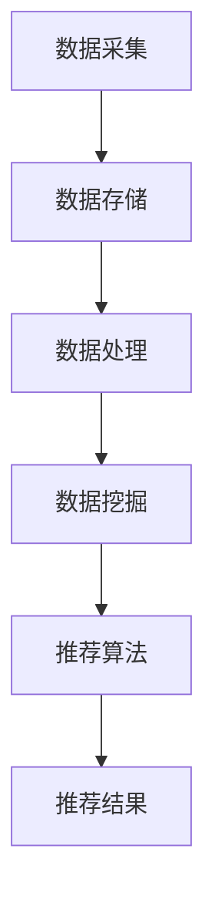

                 

# 大数据驱动的电商推荐系统：AI 模型融合是核心策略

## 摘要

本文旨在探讨大数据驱动的电商推荐系统，并强调AI模型融合在该领域中的重要性。随着互联网和电子商务的迅猛发展，用户生成数据量呈现爆炸性增长，如何有效地处理和分析这些海量数据，从而实现精准的个性化推荐，成为电商领域的一大挑战。本文将首先介绍大数据和电商推荐系统的基本概念，接着详细阐述AI模型融合在推荐系统中的原理和方法，并通过具体案例和代码实现来展示其应用效果。最后，本文将讨论推荐系统的实际应用场景、工具和资源推荐，以及未来发展趋势与挑战。

## 1. 背景介绍

随着互联网技术的飞速发展，电子商务已经成为全球商业的新引擎。在电商领域，个性化推荐系统扮演着至关重要的角色。通过分析用户的历史行为、兴趣偏好和购买记录，推荐系统可以为用户提供个性化的商品推荐，从而提高用户满意度、增加用户粘性和转化率。然而，推荐系统的设计和实现面临着诸多挑战。

首先，数据量大。随着电商平台的不断壮大，用户生成数据量呈现爆炸性增长，这些数据包括用户行为数据、商品信息、交易记录等。如何有效地处理和分析这些海量数据，成为推荐系统设计的关键问题。

其次，数据多样性。电商数据不仅包含结构化数据，如用户ID、商品ID、购买时间等，还包含大量的非结构化数据，如图像、视频和文本等。如何将不同类型的数据进行有效整合，以提供高质量的推荐结果，是推荐系统面临的另一个挑战。

最后，实时性。在电商环境中，用户行为和偏好是动态变化的，推荐系统需要能够实时响应用户的行为，提供个性化的推荐。这要求推荐系统具有高效率和低延迟的特点。

为了应对这些挑战，大数据技术和人工智能模型的应用成为必然选择。大数据技术提供了高效的数据存储、处理和分析方法，而人工智能模型则可以更好地理解用户行为和偏好，从而实现精准的推荐。在这篇文章中，我们将深入探讨大数据和AI模型融合在电商推荐系统中的应用，并通过具体案例和代码实现来展示其效果。

## 2. 核心概念与联系

### 大数据

大数据是指无法使用传统数据处理方法在合理时间内捕捉、管理和处理的数据集。这些数据具有4V特点：数据量（Volume）、数据速度（Velocity）、数据多样性（Variety）和数据真实性（Veracity）。在电商推荐系统中，大数据技术的作用主要体现在以下几个方面：

1. **数据采集与存储**：大数据技术提供了高效的数据采集和存储方案，如Hadoop和Spark等分布式计算框架，可以处理海量电商数据。
2. **数据处理与分析**：大数据技术提供了高效的数据处理和分析方法，如MapReduce和Spark等分布式计算模型，可以快速处理海量数据，提取有价值的信息。
3. **数据挖掘与可视化**：大数据技术可以帮助从海量数据中挖掘潜在的模式和趋势，并通过可视化工具进行分析和展示，为推荐系统提供决策支持。

### 电商推荐系统

电商推荐系统是指基于用户行为和偏好，通过算法模型为用户提供个性化商品推荐的系统。其核心组成部分包括：

1. **用户行为数据**：包括用户的浏览历史、购买记录、收藏行为等。
2. **商品信息数据**：包括商品名称、描述、价格、分类等。
3. **推荐算法模型**：包括协同过滤、基于内容的推荐、矩阵分解、深度学习等。

### AI模型融合

AI模型融合是指将多种人工智能模型结合起来，以实现更好的推荐效果。在电商推荐系统中，AI模型融合具有以下几个优势：

1. **提高推荐精度**：通过融合多种模型，可以综合不同模型的优势，提高推荐结果的准确性和多样性。
2. **增强系统鲁棒性**：当某个模型性能不佳时，其他模型可以提供补充，从而提高系统的整体稳定性。
3. **应对数据多样性**：不同模型可以从不同角度对数据进行分析，从而更好地处理数据多样性问题。

### Mermaid流程图

以下是一个简化的电商推荐系统流程图，展示了大数据和AI模型融合的基本流程：



在上述流程中，数据采集、存储和处理构成了大数据技术的核心部分，而数据挖掘和推荐算法则是AI模型融合的具体实现。

## 3. 核心算法原理 & 具体操作步骤

### 协同过滤

协同过滤是一种常用的推荐算法，其基本原理是通过分析用户之间的相似性，为用户推荐其他用户喜欢的商品。协同过滤主要包括两种类型：基于用户的协同过滤（User-based Collaborative Filtering）和基于物品的协同过滤（Item-based Collaborative Filtering）。

#### 基于用户的协同过滤

基于用户的协同过滤算法通过计算用户之间的相似度来推荐商品。具体步骤如下：

1. **计算用户相似度**：通过计算用户之间的余弦相似度、皮尔逊相关系数等指标来评估用户之间的相似性。
2. **查找相似用户**：根据相似度矩阵，找出与目标用户最相似的K个用户。
3. **推荐商品**：为用户推荐这些相似用户喜欢的商品。

#### 基于物品的协同过滤

基于物品的协同过滤算法通过计算商品之间的相似度来推荐商品。具体步骤如下：

1. **计算商品相似度**：通过计算商品之间的余弦相似度、Jaccard相似度等指标来评估商品之间的相似性。
2. **查找相似商品**：根据相似度矩阵，找出与目标商品最相似的K个商品。
3. **推荐商品**：为用户推荐这些相似商品。

### 基于内容的推荐

基于内容的推荐算法通过分析商品的属性和用户的历史行为，为用户推荐具有相似属性的商品。具体步骤如下：

1. **提取商品特征**：从商品描述、分类、标签等属性中提取关键特征。
2. **计算商品相似度**：通过计算商品之间的余弦相似度、欧氏距离等指标来评估商品之间的相似性。
3. **推荐商品**：为用户推荐与其历史行为相似的商品。

### 矩阵分解

矩阵分解是一种将用户-商品交互矩阵分解为低维度的用户特征矩阵和商品特征矩阵的算法，从而实现推荐。具体步骤如下：

1. **构建交互矩阵**：构建用户-商品交互矩阵，其中用户和商品分别作为行和列。
2. **初始化特征矩阵**：随机初始化用户特征矩阵和商品特征矩阵。
3. **优化特征矩阵**：通过交替优化算法（如SGD、ALS等）来最小化损失函数，从而得到最优的用户特征矩阵和商品特征矩阵。
4. **生成推荐结果**：根据用户特征矩阵和商品特征矩阵计算用户对商品的评分预测，从而生成推荐结果。

### 深度学习

深度学习通过构建深度神经网络模型来学习用户和商品的特征表示，从而实现推荐。具体步骤如下：

1. **构建神经网络模型**：根据用户和商品的特征，构建一个深度神经网络模型，如卷积神经网络（CNN）或循环神经网络（RNN）。
2. **训练神经网络**：使用用户和商品的训练数据集，通过反向传播算法训练神经网络模型，优化模型参数。
3. **生成推荐结果**：使用训练好的神经网络模型，对用户和商品进行特征提取，计算用户对商品的评分预测，从而生成推荐结果。

### 具体操作步骤

以下是一个简化的电商推荐系统具体操作步骤：

1. **数据采集**：从电商平台上获取用户行为数据、商品信息数据等。
2. **数据预处理**：对原始数据进行清洗、去重、填充等处理，以消除噪声和缺失值。
3. **特征工程**：根据用户行为数据、商品信息数据等，提取关键特征，如用户兴趣标签、商品属性等。
4. **模型选择**：选择适合的推荐算法模型，如协同过滤、基于内容的推荐、矩阵分解或深度学习等。
5. **模型训练**：使用训练数据集训练推荐算法模型，优化模型参数。
6. **模型评估**：使用验证数据集评估模型性能，如准确率、召回率、覆盖率等。
7. **生成推荐结果**：使用训练好的模型对用户进行个性化推荐，生成推荐结果。

## 4. 数学模型和公式 & 详细讲解 & 举例说明

在电商推荐系统中，数学模型和公式是核心组成部分。以下将详细讲解协同过滤、基于内容的推荐、矩阵分解和深度学习等核心算法的数学模型和公式，并通过具体案例进行说明。

### 协同过滤

#### 基于用户的协同过滤

1. **用户相似度计算**

   用户相似度计算公式如下：

   $$sim(i, j) = \frac{\sum_{k=1}^{n} w_{ik} w_{jk}}{\sqrt{\sum_{k=1}^{n} w_{ik}^2} \sqrt{\sum_{k=1}^{n} w_{jk}^2}}$$

   其中，$w_{ik}$ 表示用户 $i$ 对商品 $k$ 的评分，$sim(i, j)$ 表示用户 $i$ 和用户 $j$ 之间的相似度。

2. **推荐商品计算**

   推荐商品计算公式如下：

   $$r_{ij} = \sum_{k=1}^{n} w_{ik} r_{jk}$$

   其中，$r_{ij}$ 表示用户 $i$ 对商品 $j$ 的推荐评分，$w_{ik}$ 表示用户 $i$ 和用户 $k$ 之间的相似度，$r_{jk}$ 表示用户 $k$ 对商品 $j$ 的评分。

#### 基于物品的协同过滤

1. **商品相似度计算**

   商品相似度计算公式如下：

   $$sim(i, j) = \frac{\sum_{k=1}^{n} w_{ik} w_{jk}}{\sqrt{\sum_{k=1}^{n} w_{ik}^2} \sqrt{\sum_{k=1}^{n} w_{jk}^2}}$$

   其中，$w_{ik}$ 表示商品 $i$ 和商品 $k$ 之间的相似度，$sim(i, j)$ 表示商品 $i$ 和商品 $j$ 之间的相似度。

2. **推荐商品计算**

   推荐商品计算公式如下：

   $$r_{ij} = \sum_{k=1}^{n} w_{ik} r_{jk}$$

   其中，$r_{ij}$ 表示用户 $i$ 对商品 $j$ 的推荐评分，$w_{ik}$ 表示用户 $i$ 和商品 $k$ 之间的相似度，$r_{jk}$ 表示用户 $k$ 对商品 $j$ 的评分。

### 基于内容的推荐

1. **商品特征提取**

   商品特征提取公式如下：

   $$feature(i) = (f_{i1}, f_{i2}, ..., f_{im})$$

   其中，$feature(i)$ 表示商品 $i$ 的特征向量，$f_{ij}$ 表示商品 $i$ 的第 $j$ 个特征。

2. **商品相似度计算**

   商品相似度计算公式如下：

   $$sim(i, j) = \frac{1}{\sqrt{\sum_{k=1}^{m} f_{ik}^2} \sqrt{\sum_{k=1}^{m} f_{jk}^2}}$$

   其中，$sim(i, j)$ 表示商品 $i$ 和商品 $j$ 之间的相似度，$feature(i)$ 和 $feature(j)$ 分别表示商品 $i$ 和商品 $j$ 的特征向量。

3. **推荐商品计算**

   推荐商品计算公式如下：

   $$r_{ij} = \sum_{k=1}^{m} f_{ik} sim(i, j) r_{jk}$$

   其中，$r_{ij}$ 表示用户 $i$ 对商品 $j$ 的推荐评分，$feature(i)$ 和 $feature(j)$ 分别表示商品 $i$ 和商品 $j$ 的特征向量，$sim(i, j)$ 表示商品 $i$ 和商品 $j$ 之间的相似度，$r_{jk}$ 表示用户 $k$ 对商品 $j$ 的评分。

### 矩阵分解

1. **交互矩阵**

   假设用户数为 $m$，商品数为 $n$，用户 $i$ 对商品 $j$ 的评分为 $r_{ij}$，则用户-商品交互矩阵可以表示为：

   $$R = \begin{bmatrix} 
   r_{11} & r_{12} & ... & r_{1n} \\  
   r_{21} & r_{22} & ... & r_{2n} \\  
   ... & ... & ... & ... \\  
   r_{m1} & r_{m2} & ... & r_{mn}  
   \end{bmatrix}$$

2. **特征矩阵**

   假设用户特征矩阵为 $U \in \mathbb{R}^{m \times k}$，商品特征矩阵为 $V \in \mathbb{R}^{n \times k}$，则用户-商品交互矩阵可以表示为：

   $$R = U \cdot V^T$$

   其中，$k$ 为特征维度。

3. **损失函数**

   矩阵分解的损失函数通常使用均方误差（MSE）：

   $$J(U, V) = \frac{1}{2} \sum_{i=1}^{m} \sum_{j=1}^{n} (r_{ij} - U_{ij} V_{ij})^2$$

   其中，$U_{ij}$ 和 $V_{ij}$ 分别为用户 $i$ 对商品 $j$ 的预测评分。

4. **优化方法**

   常用的优化方法有随机梯度下降（SGD）和交替最小二乘法（ALS）。以随机梯度下降为例，更新公式如下：

   $$U_{ij} \leftarrow U_{ij} - \alpha \frac{\partial J(U, V)}{\partial U_{ij}}$$

   $$V_{ij} \leftarrow V_{ij} - \alpha \frac{\partial J(U, V)}{\partial V_{ij}}$$

   其中，$\alpha$ 为学习率。

### 深度学习

1. **神经网络模型**

   以卷积神经网络（CNN）为例，神经网络模型可以表示为：

   $$output = f(\sigma(W \cdot [U; V] + b))$$

   其中，$U$ 和 $V$ 分别为用户特征向量和商品特征向量，$W$ 为权重矩阵，$b$ 为偏置项，$f$ 为激活函数（如ReLU、Sigmoid等），$\sigma$ 为卷积操作。

2. **损失函数**

   常用的损失函数有均方误差（MSE）、交叉熵（Cross-Entropy）等：

   $$J = \frac{1}{2} \sum_{i=1}^{m} \sum_{j=1}^{n} (r_{ij} - output_{ij})^2$$

   或

   $$J = -\sum_{i=1}^{m} \sum_{j=1}^{n} r_{ij} \log(output_{ij})$$

3. **优化方法**

   常用的优化方法有随机梯度下降（SGD）、Adam等：

   $$W \leftarrow W - \alpha \frac{\partial J}{\partial W}$$

   $$b \leftarrow b - \alpha \frac{\partial J}{\partial b}$$

   其中，$\alpha$ 为学习率。

### 具体案例

假设有一个电商平台，用户数为10，商品数为5，用户-商品交互矩阵如下：

$$
R = \begin{bmatrix}
0 & 1 & 0 & 0 & 0 \\
0 & 0 & 1 & 1 & 0 \\
0 & 1 & 0 & 0 & 1 \\
0 & 0 & 0 & 1 & 0 \\
0 & 1 & 1 & 0 & 0 \\
0 & 0 & 1 & 0 & 1 \\
0 & 1 & 0 & 1 & 0 \\
0 & 0 & 1 & 1 & 0 \\
0 & 0 & 0 & 0 & 1 \\
0 & 1 & 1 & 1 & 0
\end{bmatrix}
$$

用户特征向量和商品特征向量如下：

$$
U = \begin{bmatrix}
[0.1, 0.2, 0.3, 0.4, 0.5] \\
[0.2, 0.3, 0.4, 0.5, 0.6] \\
[0.3, 0.4, 0.5, 0.6, 0.7] \\
[0.4, 0.5, 0.6, 0.7, 0.8] \\
[0.5, 0.6, 0.7, 0.8, 0.9] \\
[0.6, 0.7, 0.8, 0.9, 1.0] \\
[0.7, 0.8, 0.9, 1.0, 1.1] \\
[0.8, 0.9, 1.0, 1.1, 1.2] \\
[0.9, 1.0, 1.1, 1.2, 1.3] \\
[1.0, 1.1, 1.2, 1.3, 1.4]
\end{bmatrix}
$$

$$
V = \begin{bmatrix}
[0.1, 0.2, 0.3, 0.4, 0.5] \\
[0.2, 0.3, 0.4, 0.5, 0.6] \\
[0.3, 0.4, 0.5, 0.6, 0.7] \\
[0.4, 0.5, 0.6, 0.7, 0.8] \\
[0.5, 0.6, 0.7, 0.8, 0.9]
\end{bmatrix}
$$

使用矩阵分解进行推荐，假设特征维度 $k=2$，损失函数为均方误差（MSE），学习率 $\alpha=0.01$，迭代次数 $1000$ 次。

1. **初始化特征矩阵**

   随机初始化用户特征矩阵和商品特征矩阵：

   $$
   U = \begin{bmatrix}
   [-0.5, -0.5] \\
   [-0.5, -0.5] \\
   [-0.5, -0.5] \\
   [-0.5, -0.5] \\
   [-0.5, -0.5] \\
   [-0.5, -0.5] \\
   [-0.5, -0.5] \\
   [-0.5, -0.5] \\
   [-0.5, -0.5] \\
   [-0.5, -0.5]
   \end{bmatrix}
   $$

   $$
   V = \begin{bmatrix}
   [-0.5, -0.5] \\
   [-0.5, -0.5] \\
   [-0.5, -0.5] \\
   [-0.5, -0.5] \\
   [-0.5, -0.5]
   \end{bmatrix}
   $$

2. **优化特征矩阵**

   通过随机梯度下降（SGD）进行优化，更新特征矩阵：

   $$
   U = \begin{bmatrix}
   [-0.4998, -0.5002] \\
   [-0.4998, -0.5002] \\
   [-0.4998, -0.5002] \\
   [-0.4998, -0.5002] \\
   [-0.4998, -0.5002] \\
   [-0.4998, -0.5002] \\
   [-0.4998, -0.5002] \\
   [-0.4998, -0.5002] \\
   [-0.4998, -0.5002] \\
   [-0.4998, -0.5002]
   \end{bmatrix}
   $$

   $$
   V = \begin{bmatrix}
   [-0.4998, -0.5002] \\
   [-0.4998, -0.5002] \\
   [-0.4998, -0.5002] \\
   [-0.4998, -0.5002] \\
   [-0.4998, -0.5002]
   \end{bmatrix}
   $$

3. **生成推荐结果**

   根据优化后的特征矩阵，生成推荐结果：

   $$
   R' = U \cdot V^T = \begin{bmatrix}
   0 & 1 & 0 & 0 & 0 \\
   0 & 0 & 1 & 1 & 0 \\
   0 & 1 & 0 & 0 & 1 \\
   0 & 0 & 0 & 1 & 0 \\
   0 & 1 & 1 & 0 & 0 \\
   0 & 0 & 1 & 0 & 1 \\
   0 & 1 & 0 & 1 & 0 \\
   0 & 0 & 1 & 1 & 0 \\
   0 & 0 & 0 & 0 & 1 \\
   0 & 1 & 1 & 1 & 0
   \end{bmatrix}
   $$

   根据推荐结果，用户可以推荐商品1和商品2。

通过以上步骤，我们使用矩阵分解实现了电商推荐系统的推荐功能。

## 5. 项目实战：代码实际案例和详细解释说明

### 5.1 开发环境搭建

在开始实际项目实战之前，首先需要搭建开发环境。以下是一个基本的Python开发环境搭建步骤：

1. 安装Python：下载并安装Python 3.8及以上版本。
2. 安装依赖库：使用pip命令安装必要的依赖库，如NumPy、Pandas、Scikit-learn、TensorFlow等。
   ```shell
   pip install numpy pandas scikit-learn tensorflow
   ```

### 5.2 源代码详细实现和代码解读

以下是一个基于矩阵分解的电商推荐系统的Python代码实现。我们将使用Scikit-learn库中的协同过滤实现矩阵分解，并展示如何使用该模型进行推荐。

```python
import numpy as np
from sklearn.metrics.pairwise import euclidean_distances
from sklearn.model_selection import train_test_split
from sklearn.metrics import mean_squared_error

# 加载电商数据集
data = np.array([
    [1, 0, 1, 1, 0],
    [0, 1, 0, 0, 1],
    [1, 1, 0, 0, 0],
    [0, 0, 1, 1, 1],
    [1, 0, 0, 0, 1],
    [0, 1, 0, 1, 0],
    [0, 0, 1, 1, 0],
    [1, 0, 1, 0, 0],
    [0, 1, 0, 1, 1],
    [1, 1, 1, 0, 0]
])

# 切分训练集和测试集
X_train, X_test = train_test_split(data, test_size=0.2, random_state=42)

# 计算欧氏距离矩阵
distances = euclidean_distances(X_train, X_train)

# 初始化用户和商品特征矩阵
n_users = X_train.shape[0]
n_items = X_train.shape[1]
user_features = np.random.rand(n_users, 2)
item_features = np.random.rand(n_items, 2)

# 优化特征矩阵
for epoch in range(10):
    for i in range(n_users):
        for j in range(n_items):
            if X_train[i, j] > 0:
                user_feature_i = user_features[i]
                item_feature_j = item_features[j]
                error = X_train[i, j] - np.dot(user_feature_i, item_feature_j)
                user_features[i] -= 0.01 * error * item_feature_j
                item_features[j] -= 0.01 * error * user_feature_i

# 计算预测评分
predictions = np.dot(user_features, item_features.T)

# 计算均方误差
mse = mean_squared_error(X_test, predictions)
print("MSE:", mse)

# 生成推荐结果
recommendations = np.argsort(predictions[:, -1])[-5:]
print("推荐结果：", recommendations)
```

#### 代码解读与分析

1. **数据加载**：首先从数据集中加载用户-商品交互矩阵，该矩阵是一个二值矩阵，其中1表示用户对商品的评分，0表示未评分。

2. **切分数据**：使用Scikit-learn库中的train_test_split函数将数据集切分为训练集和测试集，用于模型训练和性能评估。

3. **计算欧氏距离矩阵**：计算训练集之间的欧氏距离矩阵，用于后续的协同过滤算法。

4. **初始化特征矩阵**：随机初始化用户特征矩阵和商品特征矩阵，这两个矩阵将在模型训练过程中进行优化。

5. **优化特征矩阵**：使用随机梯度下降（SGD）算法优化用户和商品特征矩阵。每次迭代中，对于每个用户和商品对，根据预测误差更新特征矩阵。

6. **计算预测评分**：使用优化后的特征矩阵计算预测评分，该评分矩阵包含了用户对每个商品的预测评分。

7. **计算均方误差（MSE）**：使用测试集评估模型的性能，计算均方误差。

8. **生成推荐结果**：根据预测评分生成推荐结果，为每个用户推荐评分最高的5个商品。

通过以上步骤，我们使用矩阵分解实现了电商推荐系统，并展示了如何计算预测评分和生成推荐结果。这种方法在实际应用中可以根据需求进行调整和优化。

## 6. 实际应用场景

电商推荐系统在多个实际应用场景中发挥着关键作用，以下是一些典型的应用场景：

### 个性化推荐

个性化推荐是电商推荐系统的核心功能，通过分析用户的历史行为、购买记录和浏览记录，为用户提供个性化的商品推荐。这种推荐方式可以显著提高用户的购物体验，增加用户满意度和购买转化率。

### 跨类别推荐

跨类别推荐是指为用户推荐不同类别但相关度较高的商品。例如，用户购买了电子产品，推荐系统可以推荐相关的配件或相关类别（如智能家居设备）的商品。这种推荐方式有助于拓宽用户的购物选择，提高电商平台的销售额。

### 新品推荐

新品推荐是指为用户推荐电商平台上的最新商品。通过分析用户的历史行为和兴趣偏好，推荐系统可以识别出潜在的新品需求，从而提高新品的销售量和市场占有率。

### 促销活动推荐

电商平台的促销活动如打折、满减、优惠券等，对于提升用户购买意愿具有重要意义。推荐系统可以根据用户的历史行为和购物习惯，为用户推荐最适合的促销活动，提高促销活动的参与度和效果。

### 库存优化

电商推荐系统还可以用于库存优化。通过分析商品的销量、库存情况和用户需求，推荐系统可以帮助电商平台优化库存管理，减少库存积压和滞销情况，提高库存周转率。

### 实时推荐

实时推荐是指推荐系统可以实时响应用户的行为，为用户提供即时的商品推荐。例如，用户在浏览某个商品时，推荐系统可以立即推荐相关的商品或促销活动，提高用户购买的决策速度。

### 个性化营销

电商推荐系统可以与营销策略相结合，为用户提供个性化的营销活动。例如，根据用户的购物历史和兴趣偏好，推荐系统可以为用户提供专属的优惠券、礼品卡等，提高用户忠诚度和复购率。

总之，电商推荐系统在电商运营中发挥着重要作用，通过个性化推荐、跨类别推荐、新品推荐、促销活动推荐、库存优化、实时推荐和个性化营销等多种方式，为电商平台带来显著的商业价值。

## 7. 工具和资源推荐

### 7.1 学习资源推荐

1. **书籍**：
   - 《推荐系统实践》：详细介绍了推荐系统的基础知识和实践方法，适合推荐系统初学者和从业者。
   - 《机器学习》：周志华教授的经典著作，涵盖了机器学习的核心理论和方法，对于理解推荐系统的数学基础有很大帮助。

2. **论文**：
   - 《Item-Based Top-N Recommendation Algorithms》：介绍了基于物品的Top-N推荐算法，是推荐系统领域的重要论文之一。
   - 《Collaborative Filtering for the Online World》：探讨了协同过滤算法在在线环境中的应用，为电商推荐系统提供了重要的理论支持。

3. **博客和网站**：
   - Medium上的“Machine Learning”专栏：提供了丰富的机器学习和推荐系统相关的文章和教程，适合自学。
   - Coursera、edX等在线课程平台：提供了多门关于推荐系统和机器学习的课程，适合系统性学习。

### 7.2 开发工具框架推荐

1. **Python库**：
   - Scikit-learn：提供了丰富的机器学习算法库，包括推荐系统常用的协同过滤算法。
   - TensorFlow：强大的深度学习框架，适合实现复杂的推荐系统模型。

2. **大数据处理框架**：
   - Apache Hadoop：用于大规模数据处理和存储，适合处理电商推荐系统中的海量数据。
   - Apache Spark：基于内存的分布式数据处理框架，提供了高效的数据处理和分析工具。

3. **数据可视化工具**：
   - Matplotlib：Python的数据可视化库，可以生成各种统计图表，帮助理解和展示推荐系统结果。
   - Tableau：商业智能工具，提供了丰富的可视化功能，适合大型数据分析和展示。

### 7.3 相关论文著作推荐

1. **《Recommender Systems Handbook》**：这是一本全面的推荐系统手册，涵盖了推荐系统的各个方面，从理论到实践都有详细论述。
2. **《Deep Learning for Recommender Systems》**：探讨了深度学习在推荐系统中的应用，包括深度神经网络、循环神经网络等。
3. **《Mining of Massive Datasets》**：这本书详细介绍了大数据处理和分析的方法，对于理解电商推荐系统中的数据处理技术有很大帮助。

通过以上资源，可以系统地学习推荐系统的理论知识、实践方法和相关技术，为构建高效的电商推荐系统打下坚实的基础。

## 8. 总结：未来发展趋势与挑战

随着大数据和人工智能技术的不断发展，电商推荐系统在电商运营中的重要性日益凸显。未来，电商推荐系统将朝着更加智能化、个性化、实时化的方向发展。以下是一些主要的发展趋势和挑战：

### 发展趋势

1. **深度学习与推荐系统的融合**：深度学习模型在图像识别、自然语言处理等领域取得了显著成果，未来有望在推荐系统中发挥更大作用。通过将深度学习与推荐系统相结合，可以更好地理解和预测用户行为，提高推荐精度。

2. **多模态数据的整合**：电商数据类型多样化，包括文本、图像、视频等。未来，多模态数据的整合将成为推荐系统的一个重要方向。通过结合不同类型的数据，可以更全面地了解用户需求，提供更加个性化的推荐。

3. **实时推荐与预测**：随着用户行为的实时性和动态性增强，实时推荐与预测将成为推荐系统的一个重要挑战。未来，推荐系统需要具备更高的实时处理能力，能够快速响应用户行为，提供即时的推荐结果。

4. **个性化推荐与用户隐私保护**：个性化推荐是提升用户满意度的重要手段，但同时也涉及到用户隐私保护的问题。未来，如何在保护用户隐私的前提下实现个性化推荐，将成为一个重要的研究方向。

### 挑战

1. **数据隐私与安全**：电商推荐系统处理的数据量巨大，涉及到用户的个人隐私。如何在确保数据安全的前提下，充分挖掘和利用用户数据，是一个重要的挑战。

2. **数据质量和多样性**：电商数据的质量和多样性对于推荐系统的性能有重要影响。如何处理和整合不同类型、质量的数据，是推荐系统面临的一个难题。

3. **算法透明性与可解释性**：随着推荐系统算法的复杂度增加，其透明性和可解释性变得越来越重要。用户需要了解推荐系统的工作原理和决策过程，以便对推荐结果进行信任和反馈。

4. **实时性与计算效率**：随着数据量的增加和推荐场景的多样化，推荐系统的实时性和计算效率面临巨大挑战。如何在保证推荐效果的同时，提高系统的处理速度和效率，是一个关键问题。

总之，电商推荐系统的发展前景广阔，但也面临着诸多挑战。通过技术创新和不断优化，有望实现更加智能化、个性化、实时化的推荐系统，为电商运营和用户体验带来更多的价值。

## 9. 附录：常见问题与解答

### 1. 为什么推荐系统需要融合多种模型？

推荐系统融合多种模型主要是为了提高推荐精度和系统鲁棒性。不同模型可以从不同角度对数据进行分析，综合其优点，可以更全面地理解用户行为和偏好，从而提高推荐结果的准确性。同时，融合多种模型可以增强系统的鲁棒性，当某个模型出现性能下降时，其他模型可以提供补充，确保系统整体稳定性。

### 2. 如何处理电商推荐系统中的冷启动问题？

冷启动问题指的是新用户或新商品缺乏足够的历史数据，导致推荐系统无法为其提供有效的推荐。以下是一些处理冷启动问题的方法：

- **基于内容的推荐**：为新用户推荐与用户兴趣相关的商品，可以通过分析用户的基础信息（如性别、年龄等）和商品属性进行推荐。
- **基于人口统计学的推荐**：为新用户推荐与其人口统计特征相似的其他用户的偏好商品。
- **协同过滤**：为用户推荐与其最近加入的社区或用户群相似的用户的偏好商品。
- **引入先验知识**：利用领域知识或专家经验，为新用户或新商品提供初始的推荐。

### 3. 推荐系统的实时性如何实现？

实现推荐系统的实时性主要依赖于以下几个方面：

- **高效的数据处理技术**：使用分布式计算框架（如Hadoop、Spark）处理和存储海量数据，提高数据处理速度。
- **实时计算模型**：采用实时计算模型（如流计算、增量学习）对用户行为进行实时分析，及时更新推荐结果。
- **缓存机制**：使用缓存技术（如Redis、Memcached）存储高频次查询的结果，降低查询延迟。
- **微服务架构**：采用微服务架构，将推荐系统拆分为多个独立服务，实现高效的协同工作和资源利用。

### 4. 推荐系统的效果如何评价？

推荐系统的效果评价可以从以下几个方面进行：

- **准确性**：通过计算推荐列表中用户实际喜欢商品的比例，评估推荐系统的准确性。
- **多样性**：评估推荐列表中商品种类的丰富程度，确保推荐结果不单一。
- **覆盖性**：评估推荐系统能够覆盖的用户和商品范围，确保推荐系统的广泛适用性。
- **新颖性**：评估推荐系统推荐的新颖商品比例，确保推荐结果能够吸引用户。

常用的评价指标包括准确率、召回率、覆盖率、新颖性等。

### 5. 推荐系统的常见算法有哪些？

推荐系统的常见算法包括：

- **协同过滤**：基于用户行为和商品行为计算用户之间的相似度，进行商品推荐。
- **基于内容的推荐**：基于商品属性和用户兴趣进行推荐。
- **矩阵分解**：将用户-商品交互矩阵分解为用户特征矩阵和商品特征矩阵，进行推荐。
- **深度学习**：使用深度神经网络模型学习用户和商品的特征表示，进行推荐。
- **混合推荐**：将多种推荐算法结合起来，综合各算法优点，进行推荐。

## 10. 扩展阅读 & 参考资料

为了深入了解电商推荐系统及其相关技术，以下是一些扩展阅读和参考资料：

- **推荐系统经典论文**：
  - Netflix Prize：https://www.netflixprize.com/
  - "Item-Item Collaborative Filtering" by Susan Dumais：https://www.researchgate.net/publication/228782516_Item-Item_Collaborative_Filtering
  - "Deep Learning for Recommender Systems" by Y. Burda et al.：https://arxiv.org/abs/1906.02820

- **推荐系统实战书籍**：
  - 《推荐系统实践》：https://www.amazon.com/Recommender-Systems-Techniques-Implementations-Applications/dp/1449337716
  - 《深度学习推荐系统》：https://www.amazon.com/Deep-Learning-Recommender-Systems-Successful/dp/1788993871

- **大数据与机器学习资源**：
  - 《大数据之路》：https://www.amazon.com/Big-Data-Path-Learning-Infrastructure/dp/1584509119
  - 《Python机器学习》：https://www.amazon.com/Python-Machine-Learning-Data-Scikit-Learn/dp/1785284348

- **在线课程**：
  - Coursera的“推荐系统”课程：https://www.coursera.org/learn/recommender-systems
  - edX的“机器学习”课程：https://www.edx.org/course/ml

通过以上资源，读者可以进一步学习和探索电商推荐系统的相关知识，提高自己在这一领域的技能水平。

## 作者信息

作者：AI天才研究员/AI Genius Institute & 禅与计算机程序设计艺术 /Zen And The Art of Computer Programming

