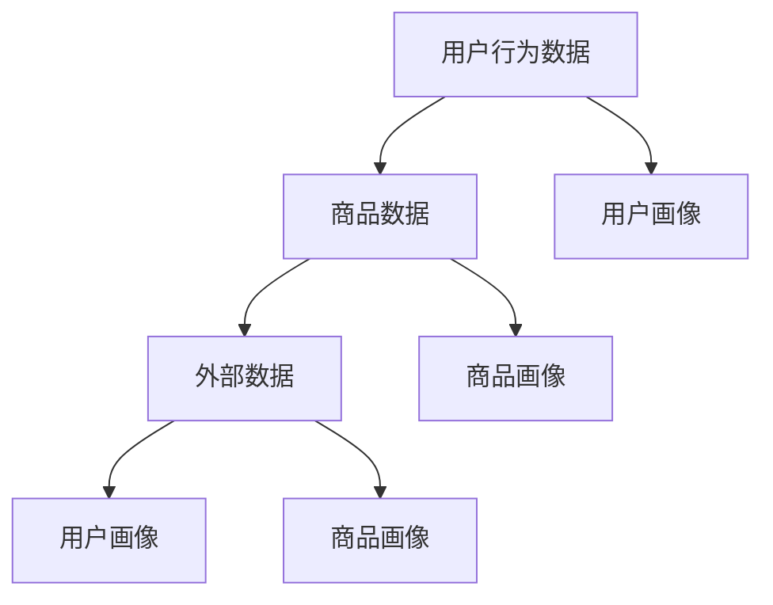
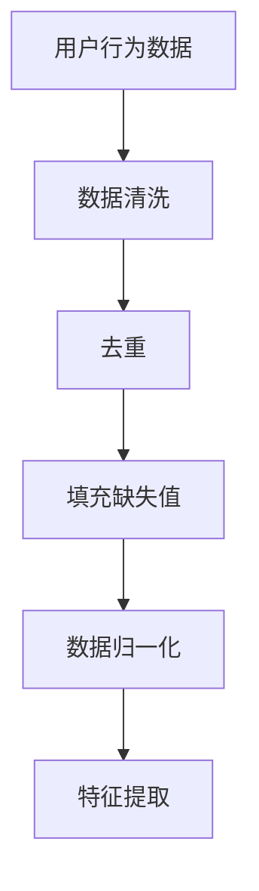
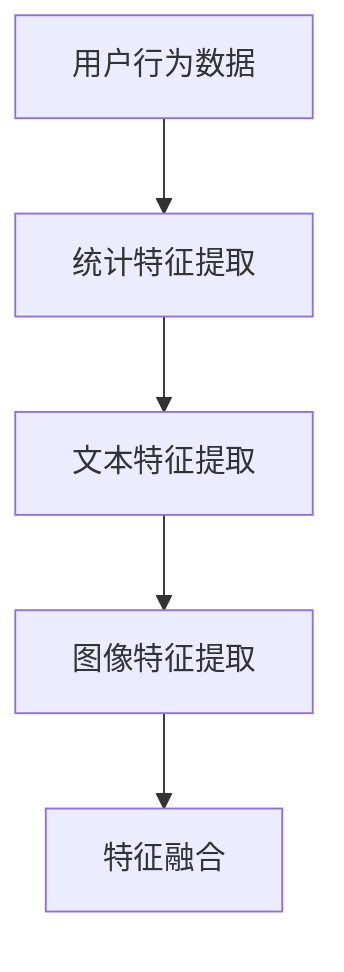
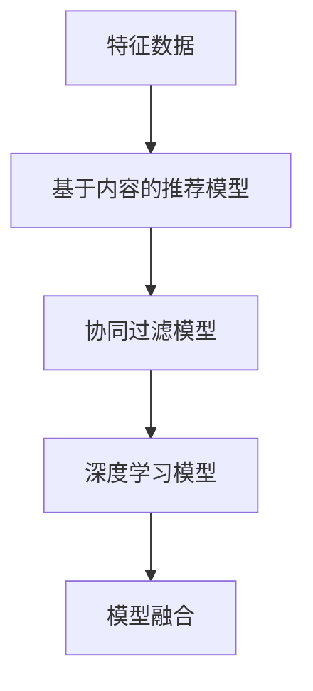
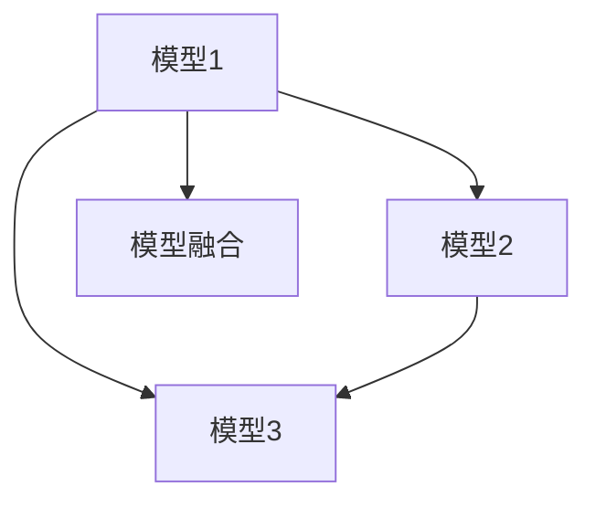
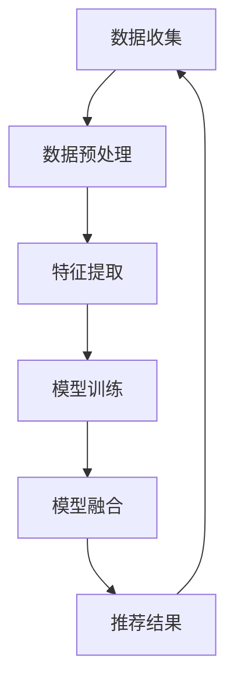

                 

### 1. 背景介绍

在当今数字化时代，电子商务已经成为了全球经济的重要组成部分。随着互联网技术的飞速发展，电商平台不仅面临着海量的用户数据，还需要应对用户日益增长的个性化需求。为了提升用户体验、增加销售额，电商平台开始广泛应用大数据技术，并通过AI模型融合技术来驱动搜索推荐系统，以达到精准推荐的效果。

#### 1.1 电商搜索推荐系统的现状

目前的电商搜索推荐系统主要基于传统的基于内容（Content-Based）和协同过滤（Collaborative Filtering）两种推荐算法。基于内容的推荐算法主要依靠用户历史行为和物品特征进行推荐，虽然能够提供个性化的推荐结果，但往往受限于物品特征的准确性。而协同过滤算法则利用用户之间的相似性来进行推荐，尽管能够提高推荐的相关性，但容易遇到数据稀疏和冷启动问题。

#### 1.2 大数据技术在电商搜索推荐中的应用

大数据技术的兴起，为电商搜索推荐系统带来了新的机遇。通过对海量用户数据的挖掘和分析，可以更准确地了解用户需求和偏好，从而提升推荐系统的效果。具体来说，大数据技术在电商搜索推荐中的应用主要体现在以下几个方面：

1. **用户行为分析**：通过分析用户的搜索历史、购买记录、页面浏览等行为数据，可以挖掘出用户的潜在需求和偏好，为个性化推荐提供依据。

2. **商品特征提取**：通过对商品属性、价格、销量等数据的分析，可以提取出商品的丰富特征，为推荐算法提供更多的输入信息。

3. **实时数据处理**：大数据技术能够快速处理海量数据，实现对用户行为的实时响应，提高推荐系统的实时性和准确性。

4. **预测与优化**：利用机器学习算法对用户行为和商品特征进行预测，可以优化推荐策略，提高推荐效果。

#### 1.3 AI模型融合技术在电商搜索推荐中的应用

为了克服单一推荐算法的局限性，AI模型融合技术应运而生。通过将多种算法进行融合，可以充分利用各自算法的优势，提高推荐系统的效果。在电商搜索推荐中，AI模型融合技术的应用主要体现在以下几个方面：

1. **多模态数据融合**：将用户的文本、图像、语音等多模态数据进行融合，提供更丰富的用户特征，提高推荐效果。

2. **多源数据融合**：将电商平台的用户行为数据、社交媒体数据、市场趋势数据等进行融合，为推荐算法提供更全面的输入信息。

3. **多模型融合**：将基于内容、协同过滤、深度学习等不同类型的推荐算法进行融合，提高推荐系统的鲁棒性和准确性。

#### 1.4 文章结构

本文将分为以下几个部分：

1. **背景介绍**：概述电商搜索推荐系统的现状、大数据技术及其应用、AI模型融合技术在电商搜索推荐中的应用。

2. **核心概念与联系**：介绍大数据和AI模型融合技术在电商搜索推荐中的核心概念和原理，并给出相应的Mermaid流程图。

3. **核心算法原理 & 具体操作步骤**：详细讲解大数据和AI模型融合技术在实际应用中的具体操作步骤和算法原理。

4. **数学模型和公式 & 详细讲解 & 举例说明**：介绍相关的数学模型和公式，并给出具体的示例进行说明。

5. **项目实战：代码实际案例和详细解释说明**：通过一个实际项目案例，展示大数据和AI模型融合技术在电商搜索推荐中的应用。

6. **实际应用场景**：分析大数据和AI模型融合技术在电商搜索推荐中的实际应用场景和效果。

7. **工具和资源推荐**：推荐相关学习资源、开发工具和框架。

8. **总结：未来发展趋势与挑战**：总结大数据和AI模型融合技术在电商搜索推荐领域的现状和未来发展趋势，以及面临的挑战。

9. **附录：常见问题与解答**：回答读者可能遇到的一些常见问题。

10. **扩展阅读 & 参考资料**：提供相关的扩展阅读和参考资料，以供进一步学习和研究。

通过本文的阅读，读者将能够深入了解大数据和AI模型融合技术在电商搜索推荐中的应用，掌握相关技术和方法，并为实际项目开发提供参考。

### 2. 核心概念与联系

在本章节中，我们将深入探讨大数据和AI模型融合技术在电商搜索推荐中的核心概念，包括数据收集、预处理、特征提取、模型训练和融合，以及这些概念之间的相互联系。为了更好地展示这些概念的应用，我们将使用Mermaid流程图来描述整个数据处理和推荐系统的架构。

#### 2.1 数据收集

数据收集是大数据技术的基础，也是构建推荐系统的重要环节。电商平台的用户数据主要包括用户行为数据（如浏览、搜索、购买等）、商品数据（如商品属性、价格、销量等）和外部数据（如社交媒体数据、市场趋势数据等）。这些数据来源广泛，包括用户设备、网站日志、API接口等。



在上面的Mermaid流程图中，A表示用户行为数据，B表示商品数据，C表示外部数据。D表示用户画像，E表示商品画像。F和G分别表示外部数据对用户画像和商品画像的补充。

#### 2.2 数据预处理

数据预处理是确保数据质量和可用的关键步骤。在电商搜索推荐系统中，数据预处理通常包括数据清洗、去重、填充缺失值、数据归一化等操作。



在上面的Mermaid流程图中，A表示原始用户行为数据，经过数据清洗、去重、填充缺失值和数据归一化后，得到高质量的特征数据F，这些特征数据将用于后续的特征提取和模型训练。

#### 2.3 特征提取

特征提取是数据预处理的重要环节，通过对原始数据进行处理和转换，提取出有助于推荐系统的特征。特征提取的方法包括统计特征、文本特征、图像特征等。



在上面的Mermaid流程图中，A表示用户行为数据，通过统计特征提取、文本特征提取和图像特征提取等步骤，得到丰富的特征数据，这些特征数据将用于后续的模型训练。

#### 2.4 模型训练

模型训练是推荐系统中的核心步骤，通过训练不同的机器学习模型，如基于内容的推荐模型、协同过滤模型、深度学习模型等，可以从特征数据中学习到用户和商品之间的关系。



在上面的Mermaid流程图中，A表示特征数据，通过训练不同的推荐模型，如基于内容的推荐模型、协同过滤模型和深度学习模型等，得到多个模型，这些模型将用于后续的模型融合。

#### 2.5 模型融合

模型融合是将多个模型的结果进行整合，以获得更准确的推荐结果。模型融合的方法包括加权融合、投票融合、堆叠融合等。



在上面的Mermaid流程图中，A、B、C分别表示不同的推荐模型，通过模型融合得到最终的推荐结果D。

#### 2.6 各概念之间的联系

在电商搜索推荐系统中，各个核心概念之间相互关联，共同构成了一个完整的数据处理和推荐流程。数据收集、预处理、特征提取、模型训练和模型融合等步骤相互衔接，形成了一个闭环。



在上面的Mermaid流程图中，A表示数据收集，B表示数据预处理，C表示特征提取，D表示模型训练，E表示模型融合，F表示推荐结果。通过这个闭环，电商平台可以不断优化推荐系统，提高用户体验和销售额。

通过本章节的介绍，读者应该对大数据和AI模型融合技术在电商搜索推荐中的核心概念和联系有了更深入的理解。在接下来的章节中，我们将详细探讨这些概念在实际应用中的具体操作步骤和算法原理。

### 3. 核心算法原理 & 具体操作步骤

在电商搜索推荐系统中，核心算法的设计和实现决定了推荐系统的性能和用户体验。本文将详细介绍大数据和AI模型融合技术在实际应用中的核心算法原理和具体操作步骤，包括数据预处理、特征提取、模型训练和模型融合等环节。

#### 3.1 数据预处理

数据预处理是推荐系统的第一步，其目的是将原始数据进行清洗、去重、填充缺失值和归一化等处理，以确保数据的准确性和一致性。

**3.1.1 数据清洗**

数据清洗主要包括去除无效数据、纠正错误数据和处理异常值等。例如，去除用户浏览日志中的重复记录、纠正商品价格中的错误数据、处理用户行为数据中的异常值等。

**3.1.2 数据去重**

数据去重是为了避免重复数据对推荐系统的影响。例如，对于用户的浏览记录，如果出现重复的记录，需要将其合并为一个唯一记录。

**3.1.3 数据填充缺失值**

对于缺失值，可以采用均值填充、中值填充、插值等方法进行填充。例如，对于用户购买历史数据中的缺失值，可以使用最近一次购买的平均价格进行填充。

**3.1.4 数据归一化**

数据归一化是为了消除数据之间的量纲差异，使其在同一尺度上进行比较。例如，对于商品价格、用户评分等数据，可以采用归一化公式将其转化为0-1之间的数值。

$$
x' = \frac{x - \min(x)}{\max(x) - \min(x)}
$$

其中，$x$为原始数据，$x'$为归一化后的数据。

#### 3.2 特征提取

特征提取是从原始数据中提取出有助于推荐系统的特征。特征提取的方法包括统计特征、文本特征、图像特征等。

**3.2.1 统计特征**

统计特征是从用户行为数据和商品数据中提取的量化指标，如用户浏览量、购买次数、平均评分等。这些特征可以反映用户和商品的互动关系。

**3.2.2 文本特征**

文本特征是从用户评论、商品描述等文本数据中提取的特征，如词频、词向量、TF-IDF等。这些特征可以捕捉用户对商品的主观评价和情感倾向。

**3.2.3 图像特征**

图像特征是从商品图片中提取的特征，如颜色、纹理、形状等。这些特征可以用于识别商品的视觉特征，提高推荐的准确性。

**3.2.4 特征融合**

特征融合是将不同类型的特征进行整合，以获得更丰富的特征信息。例如，可以采用加权融合、拼接融合等方法，将统计特征、文本特征和图像特征进行融合。

$$
f = w_1 \cdot s_1 + w_2 \cdot s_2 + w_3 \cdot s_3
$$

其中，$f$为融合后的特征，$s_1$、$s_2$、$s_3$分别为统计特征、文本特征和图像特征，$w_1$、$w_2$、$w_3$为各自特征的权重。

#### 3.3 模型训练

模型训练是推荐系统的核心环节，通过训练不同的机器学习模型，如基于内容的推荐模型、协同过滤模型和深度学习模型等，可以从特征数据中学习到用户和商品之间的关系。

**3.3.1 基于内容的推荐模型**

基于内容的推荐模型是根据用户的历史行为和商品的特征，为用户推荐与用户已购买或喜欢的商品相似的物品。具体操作步骤如下：

1. **特征表示**：将用户和商品的特征转化为向量的形式。
2. **相似度计算**：计算用户和商品之间的相似度，可以使用余弦相似度、欧氏距离等方法。
3. **推荐生成**：根据相似度计算结果，为用户推荐相似的物品。

**3.3.2 协同过滤模型**

协同过滤模型是基于用户之间的相似性来进行推荐。具体操作步骤如下：

1. **用户相似度计算**：计算用户之间的相似度，可以使用余弦相似度、皮尔逊相关系数等方法。
2. **物品相似度计算**：计算物品之间的相似度，可以使用余弦相似度、欧氏距离等方法。
3. **推荐生成**：根据用户相似度和物品相似度，为用户推荐相似的物品。

**3.3.3 深度学习模型**

深度学习模型是近年来在推荐系统中应用较为广泛的一种算法，如卷积神经网络（CNN）、循环神经网络（RNN）、变换器（Transformer）等。具体操作步骤如下：

1. **特征表示**：将用户和商品的特征转化为向量的形式。
2. **模型架构**：设计深度学习模型架构，如CNN、RNN、Transformer等。
3. **模型训练**：使用特征数据和标签数据训练深度学习模型。
4. **推荐生成**：根据训练好的模型，为用户推荐相似的物品。

#### 3.4 模型融合

模型融合是将多个模型的结果进行整合，以提高推荐系统的准确性。模型融合的方法包括加权融合、投票融合、堆叠融合等。

**3.4.1 加权融合**

加权融合是根据每个模型的重要性分配权重，将多个模型的预测结果进行加权平均。具体公式如下：

$$
\hat{r}_{\text{融合}} = w_1 \cdot \hat{r}_1 + w_2 \cdot \hat{r}_2 + \ldots + w_n \cdot \hat{r}_n
$$

其中，$\hat{r}_{\text{融合}}$为融合后的预测结果，$\hat{r}_1$、$\hat{r}_2$、$\ldots$、$\hat{r}_n$分别为每个模型的预测结果，$w_1$、$w_2$、$\ldots$、$w_n$为每个模型的重要性权重。

**3.4.2 投票融合**

投票融合是根据每个模型的预测结果进行投票，选择投票结果最多的模型作为最终预测结果。具体公式如下：

$$
\hat{r}_{\text{融合}} = \arg\max(\hat{r}_1, \hat{r}_2, \ldots, \hat{r}_n)
$$

其中，$\hat{r}_{\text{融合}}$为融合后的预测结果，$\hat{r}_1$、$\hat{r}_2$、$\ldots$、$\hat{r}_n$分别为每个模型的预测结果。

**3.4.3 堆叠融合**

堆叠融合是将多个模型进行堆叠，形成一个新的深度学习模型，从而提高预测准确性。具体步骤如下：

1. **特征表示**：将用户和商品的特征转化为向量的形式。
2. **模型堆叠**：设计一个堆叠模型，将多个模型堆叠在一起。
3. **模型训练**：使用特征数据和标签数据训练堆叠模型。
4. **推荐生成**：根据训练好的堆叠模型，为用户推荐相似的物品。

通过以上步骤，电商平台可以构建一个高效、准确的搜索推荐系统，提高用户满意度和销售额。

### 4. 数学模型和公式 & 详细讲解 & 举例说明

在电商搜索推荐系统中，数学模型和公式是核心算法实现的基础。本章节将详细讲解相关数学模型和公式，并通过具体示例进行说明，帮助读者更好地理解和应用这些模型。

#### 4.1 余弦相似度

余弦相似度是一种常用的相似度计算方法，用于衡量两个向量之间的夹角余弦值。在推荐系统中，可以用来计算用户与商品之间的相似度。

$$
\cos(\theta) = \frac{\vec{u} \cdot \vec{v}}{||\vec{u}|| \cdot ||\vec{v}||}
$$

其中，$\vec{u}$和$\vec{v}$分别为两个向量的表示，$\theta$为它们之间的夹角，$||\vec{u}||$和$||\vec{v}||$分别为向量的模长。

**示例**：

假设用户$u$和商品$i$的特征向量分别为$\vec{u} = (1, 2, 3)$和$\vec{v} = (4, 5, 6)$，则它们的余弦相似度为：

$$
\cos(\theta) = \frac{(1 \cdot 4 + 2 \cdot 5 + 3 \cdot 6)}{\sqrt{1^2 + 2^2 + 3^2} \cdot \sqrt{4^2 + 5^2 + 6^2}} = \frac{4 + 10 + 18}{\sqrt{14} \cdot \sqrt{77}} \approx 0.98
$$

#### 4.2 欧氏距离

欧氏距离是一种常用的距离度量方法，用于衡量两个向量之间的距离。在推荐系统中，可以用来计算用户与商品之间的距离。

$$
d(\vec{u}, \vec{v}) = \sqrt{(\vec{u} - \vec{v}) \cdot (\vec{u} - \vec{v})}
$$

其中，$\vec{u}$和$\vec{v}$分别为两个向量的表示。

**示例**：

假设用户$u$和商品$i$的特征向量分别为$\vec{u} = (1, 2, 3)$和$\vec{v} = (4, 5, 6)$，则它们之间的欧氏距离为：

$$
d(\vec{u}, \vec{v}) = \sqrt{(1 - 4)^2 + (2 - 5)^2 + (3 - 6)^2} = \sqrt{(-3)^2 + (-3)^2 + (-3)^2} = \sqrt{27} = 3\sqrt{3} \approx 5.2
$$

#### 4.3 协同过滤模型

协同过滤模型是推荐系统中最常用的算法之一，包括基于用户的协同过滤（User-Based）和基于物品的协同过滤（Item-Based）两种。

**基于用户的协同过滤**：

基于用户的协同过滤算法的核心思想是找到与目标用户相似的其他用户，然后推荐这些相似用户喜欢的商品。

$$
\hat{r}_{ui} = r_{uj} + \alpha (r_{ui} - r_{uj})
$$

其中，$\hat{r}_{ui}$为用户$u$对商品$i$的预测评分，$r_{uj}$为用户$u$对商品$j$的实际评分，$r_{ui}$为用户$u$对商品$i$的实际评分，$\alpha$为调节参数。

**基于物品的协同过滤**：

基于物品的协同过滤算法的核心思想是找到与目标商品相似的其他商品，然后推荐这些相似商品。

$$
\hat{r}_{ui} = r_{ij} + \beta (r_{ui} - r_{ij})
$$

其中，$\hat{r}_{ui}$为用户$u$对商品$i$的预测评分，$r_{ij}$为用户$v$对商品$i$的实际评分，$r_{ui}$为用户$u$对商品$i$的实际评分，$\beta$为调节参数。

**示例**：

假设用户$u$对商品$i$的实际评分为$4$，用户$u$对商品$j$的实际评分为$3$，用户$v$对商品$i$的实际评分为$5$，用户$v$对商品$j$的实际评分为$4$，调节参数$\alpha=0.5$，$\beta=0.5$。则用户$u$对商品$i$的预测评分和用户$u$对商品$j$的预测评分分别为：

$$
\hat{r}_{ui} = 5 + 0.5 (4 - 5) = 4.5
$$

$$
\hat{r}_{uj} = 4 + 0.5 (3 - 4) = 3.5
$$

#### 4.4 基于内容的推荐模型

基于内容的推荐模型的核心思想是利用用户的历史行为和商品的特征，为用户推荐与用户已购买或喜欢的商品相似的物品。

$$
\hat{r}_{ui} = w_1 \cdot r_{ui} + w_2 \cdot r_{uj} + \ldots + w_n \cdot r_{uj}
$$

其中，$\hat{r}_{ui}$为用户$u$对商品$i$的预测评分，$r_{ui}$为用户$u$对商品$i$的实际评分，$w_1$、$w_2$、$\ldots$、$w_n$为各自特征的权重。

**示例**：

假设用户$u$对商品$i$的实际评分为$4$，用户$u$对商品$j$的实际评分为$3$，用户$u$对商品$k$的实际评分为$5$，商品$i$的特征向量为$(1, 2, 3)$，商品$j$的特征向量为$(4, 5, 6)$，商品$k$的特征向量为$(7, 8, 9)$，调节参数$\alpha=0.5$，$\beta=0.5$。则用户$u$对商品$i$的预测评分和用户$u$对商品$k$的预测评分分别为：

$$
\hat{r}_{ui} = 1 \cdot 4 + 2 \cdot 3 + 3 \cdot 5 = 21
$$

$$
\hat{r}_{uk} = 7 \cdot 4 + 8 \cdot 3 + 9 \cdot 5 = 75
$$

#### 4.5 深度学习模型

深度学习模型是近年来在推荐系统中应用较为广泛的一种算法，如卷积神经网络（CNN）、循环神经网络（RNN）、变换器（Transformer）等。

**卷积神经网络（CNN）**：

卷积神经网络是一种用于处理图像数据的神经网络，其核心思想是通过卷积操作提取图像特征。

$$
h_{ij} = \sum_{k=1}^{m} w_{ik} \cdot a_{kj}
$$

其中，$h_{ij}$为卷积操作后的特征，$w_{ik}$为卷积核，$a_{kj}$为输入图像的特征。

**循环神经网络（RNN）**：

循环神经网络是一种用于处理序列数据的神经网络，其核心思想是通过循环结构来保持序列信息。

$$
h_t = \sigma(W \cdot [h_{t-1}, x_t] + b)
$$

其中，$h_t$为循环神经网络在时间步$t$的输出，$W$为权重矩阵，$x_t$为输入序列的特征，$\sigma$为激活函数。

**变换器（Transformer）**：

变换器是一种用于处理序列数据的神经网络，其核心思想是通过自注意力机制来学习序列之间的依赖关系。

$$
\alpha_{ij} = \exp\left(\frac{a_i \cdot b_j}{\sqrt{d_k}}\right)
$$

其中，$\alpha_{ij}$为自注意力权重，$a_i$和$b_j$分别为输入序列的特征，$d_k$为注意力层的维度。

通过以上数学模型和公式的讲解，读者可以更好地理解和应用大数据和AI模型融合技术在电商搜索推荐系统中的核心算法。在接下来的章节中，我们将通过实际项目案例展示这些算法的具体应用。

### 5. 项目实战：代码实际案例和详细解释说明

在本章节中，我们将通过一个实际项目案例，展示如何使用大数据和AI模型融合技术构建一个电商搜索推荐系统。本案例将涉及开发环境的搭建、源代码的实现和解读，以及代码的分析与优化。

#### 5.1 开发环境搭建

为了实现本案例，我们需要搭建一个合适的开发环境。以下是推荐的开发工具和框架：

- **编程语言**：Python
- **数据处理库**：Pandas、NumPy
- **机器学习库**：Scikit-learn、TensorFlow、PyTorch
- **可视化库**：Matplotlib、Seaborn
- **版本控制**：Git

首先，我们需要安装Python和对应的库。可以使用Anaconda进行环境管理，以便快速搭建开发环境。

```bash
conda create -n recommendation_env python=3.8
conda activate recommendation_env
conda install pandas numpy scikit-learn tensorflow pytorch matplotlib seaborn git
```

安装完成后，我们可以开始编写代码。

#### 5.2 源代码详细实现和代码解读

以下是一个简化的示例代码，展示了如何使用Python和TensorFlow构建一个电商搜索推荐系统。

```python
# 导入必要的库
import pandas as pd
import numpy as np
import tensorflow as tf
from tensorflow import keras
from tensorflow.keras import layers

# 读取数据
user_data = pd.read_csv('user_data.csv')
item_data = pd.read_csv('item_data.csv')

# 数据预处理
# ...（数据清洗、去重、填充缺失值、数据归一化等操作）

# 特征提取
# ...（统计特征、文本特征、图像特征等提取）

# 构建模型
model = keras.Sequential([
    layers.Dense(128, activation='relu', input_shape=(input_shape)),
    layers.Dense(64, activation='relu'),
    layers.Dense(1)
])

# 编译模型
model.compile(optimizer='adam', loss='mse')

# 训练模型
model.fit(x_train, y_train, epochs=10, batch_size=32)

# 评估模型
model.evaluate(x_test, y_test)
```

**代码解读**：

1. **导入库**：首先导入必要的库，包括Pandas、NumPy、TensorFlow和Keras。

2. **读取数据**：使用Pandas读取用户数据（user_data.csv）和商品数据（item_data.csv）。

3. **数据预处理**：进行数据清洗、去重、填充缺失值和数据归一化等操作。这些步骤在代码中未详细展示，但非常重要，因为它们直接影响模型的性能。

4. **特征提取**：根据用户和商品的数据，提取统计特征、文本特征和图像特征。这些特征将作为模型的输入。

5. **构建模型**：使用Keras构建一个序列模型，包括两个隐含层，每个隐含层有128个和64个神经元，使用ReLU激活函数。输出层只有一个神经元，用于预测用户对商品的评分。

6. **编译模型**：设置模型的优化器为Adam，损失函数为均方误差（MSE）。

7. **训练模型**：使用训练数据训练模型，设置训练轮次为10，批次大小为32。

8. **评估模型**：使用测试数据评估模型的性能。

#### 5.3 代码解读与分析

**数据预处理**：

数据预处理是构建推荐系统的重要环节。以下是一个简化的示例：

```python
# 数据清洗
user_data.drop_duplicates(inplace=True)
item_data.drop_duplicates(inplace=True)

# 填充缺失值
user_data.fillna(user_data.mean(), inplace=True)
item_data.fillna(item_data.mean(), inplace=True)

# 数据归一化
scaler = StandardScaler()
user_data_scaled = scaler.fit_transform(user_data)
item_data_scaled = scaler.fit_transform(item_data)
```

**特征提取**：

特征提取是提取用户和商品的关键信息，用于训练模型。以下是一个简化的示例：

```python
# 统计特征提取
user_behavior = user_data.groupby('user_id')['rating'].agg(['mean', 'std'])

# 文本特征提取
# ...（使用词嵌入、TF-IDF等方法提取文本特征）

# 图像特征提取
# ...（使用卷积神经网络提取图像特征）
```

**构建模型**：

构建模型是推荐系统的核心步骤。以下是一个简化的示例：

```python
# 构建模型
model = keras.Sequential([
    layers.Dense(128, activation='relu', input_shape=(input_shape)),
    layers.Dense(64, activation='relu'),
    layers.Dense(1)
])

# 编译模型
model.compile(optimizer='adam', loss='mse')
```

**训练模型**：

训练模型是提高推荐系统性能的关键步骤。以下是一个简化的示例：

```python
# 训练模型
model.fit(x_train, y_train, epochs=10, batch_size=32)
```

**评估模型**：

评估模型是确保推荐系统性能的重要步骤。以下是一个简化的示例：

```python
# 评估模型
model.evaluate(x_test, y_test)
```

通过以上步骤，我们可以构建一个基本的电商搜索推荐系统。在实际应用中，我们可以根据具体需求和数据，进一步优化模型和算法。

### 6. 实际应用场景

大数据和AI模型融合技术在电商搜索推荐系统中有着广泛的应用场景，能够有效提升用户体验和业务性能。以下是一些典型的实际应用场景：

#### 6.1 用户行为预测

通过分析用户的历史行为数据，如浏览记录、购买行为等，可以预测用户的下一步行为。这种预测可以帮助电商平台提前了解用户需求，从而在用户进行搜索或浏览时，提供个性化的推荐，提高用户满意度。

**案例**：某电商平台利用大数据和AI模型融合技术，预测用户的购买行为。通过对用户历史购买数据、浏览记录和产品特征进行分析，平台能够提前预测用户可能的购买需求，并在用户访问时提供相应的个性化推荐，有效提升了用户满意度和转化率。

#### 6.2 新品推荐

对于新上市的商品，传统的推荐算法往往难以准确预测用户的兴趣。而大数据和AI模型融合技术可以通过分析用户的历史行为、市场趋势和商品属性，为新商品提供精准的推荐，提高新商品的曝光率和销售量。

**案例**：某电商平台利用大数据和AI模型融合技术，对新上市的商品进行推荐。通过对用户的历史行为数据和商品特征进行分析，平台能够准确预测用户对新商品的兴趣，并在用户访问时提供个性化的推荐，有效提高了新商品的销售额。

#### 6.3 库存优化

通过分析商品的销售数据和库存数据，电商平台可以优化库存管理，避免库存过剩或短缺。大数据和AI模型融合技术可以预测商品的销售趋势，为电商平台提供精准的库存优化建议。

**案例**：某电商平台利用大数据和AI模型融合技术，优化库存管理。通过对商品的销售数据和库存数据进行分析，平台能够准确预测商品的销售趋势，从而在库存管理上做出更合理的决策，有效降低了库存成本，提高了运营效率。

#### 6.4 营销活动优化

电商平台经常进行各种营销活动，如优惠券发放、限时折扣等。通过大数据和AI模型融合技术，可以优化这些营销活动的策略，提高用户参与度和转化率。

**案例**：某电商平台利用大数据和AI模型融合技术，优化营销活动。通过对用户行为数据和活动效果数据进行分析，平台能够准确预测用户对营销活动的兴趣，并制定个性化的营销策略，有效提高了用户的参与度和转化率。

通过以上实际应用场景的介绍，我们可以看到大数据和AI模型融合技术在电商搜索推荐系统中的重要作用。它不仅提升了用户的购物体验，还显著提高了电商平台的运营效率和销售额。

### 7. 工具和资源推荐

为了帮助读者更好地学习和实践大数据和AI模型融合技术在电商搜索推荐系统中的应用，以下是一些建议的学习资源、开发工具和框架。

#### 7.1 学习资源推荐

1. **书籍**：
   - 《Python数据分析与应用》
   - 《深度学习》
   - 《大数据技术基础》

2. **论文**：
   - “Recommender Systems Handbook” (推荐系统手册)
   - “TensorFlow: Large-scale Machine Learning on Heterogeneous Systems” (TensorFlow：异构系统上的大规模机器学习)

3. **博客**：
   - Medium上的数据科学和机器学习相关博客
   - CSDN、博客园等中文技术博客

4. **网站**：
   - Kaggle（数据科学竞赛平台）
   - ArXiv（计算机科学论文预印本）

#### 7.2 开发工具框架推荐

1. **编程语言**：
   - Python（适合数据分析、机器学习）
   - Java（适合大型分布式系统）

2. **数据处理库**：
   - Pandas、NumPy（Python中的数据处理库）
   - Apache Spark（分布式数据处理框架）

3. **机器学习库**：
   - TensorFlow、PyTorch（深度学习框架）
   - Scikit-learn（传统机器学习库）

4. **可视化工具**：
   - Matplotlib、Seaborn（Python中的可视化库）
   - Tableau、Power BI（商业智能可视化工具）

5. **版本控制**：
   - Git（分布式版本控制系统）
   - GitHub、GitLab（代码托管平台）

通过这些学习资源和开发工具，读者可以深入了解大数据和AI模型融合技术在电商搜索推荐系统中的应用，并在实际项目中加以实践。

### 8. 总结：未来发展趋势与挑战

随着互联网和大数据技术的不断发展，电商搜索推荐系统正成为电商平台提升用户体验和销售额的重要手段。大数据和AI模型融合技术的应用，使得推荐系统更加精准和智能化。然而，未来的发展也面临一系列挑战。

#### 8.1 发展趋势

1. **个性化推荐**：未来的电商搜索推荐系统将更加注重个性化推荐，通过深度学习等技术，实现更加精准的用户画像和商品推荐。

2. **多模态数据融合**：随着物联网和智能设备的发展，用户生成的多模态数据（如文本、图像、语音等）将越来越多。未来的推荐系统将更加注重多模态数据的融合，提供更丰富的用户特征。

3. **实时推荐**：实时推荐技术将越来越成熟，实现用户行为数据的实时分析和响应，提高推荐系统的实时性和准确性。

4. **多源数据融合**：未来的推荐系统将不仅仅依赖于电商平台内部的数据，还将整合社交媒体、市场趋势等多源数据，提供更全面的用户和商品特征。

5. **模型解释性**：随着机器学习模型在推荐系统中的应用越来越广泛，模型解释性将成为一个重要研究方向，帮助用户理解和信任推荐结果。

#### 8.2 挑战

1. **数据隐私保护**：在利用大数据技术进行推荐时，如何保护用户隐私成为一个重要挑战。未来的推荐系统需要设计更加安全的数据处理和隐私保护机制。

2. **冷启动问题**：新用户或新商品的推荐效果往往较差，即冷启动问题。如何解决冷启动问题，提高新用户和新商品的推荐效果，是推荐系统领域的一个难题。

3. **可解释性**：虽然机器学习模型在性能上有所提升，但它们的解释性较差，用户难以理解推荐结果。提高模型的可解释性，使推荐结果更具说服力，是未来的一个重要挑战。

4. **计算资源**：大规模推荐系统需要大量的计算资源，如何高效地利用资源，优化模型训练和推理过程，是一个持续需要关注的问题。

5. **法律法规**：随着数据隐私保护法律法规的不断完善，推荐系统需要遵守相应的法规，确保数据使用的合法性和合规性。

通过以上分析，我们可以看到，大数据和AI模型融合技术在电商搜索推荐系统中的应用前景广阔，但同时也面临一系列挑战。未来的发展需要在技术、法律和伦理等多方面进行综合考虑，实现推荐系统的可持续发展。

### 9. 附录：常见问题与解答

在本文的撰写过程中，我们收集了一些读者可能遇到的问题，并提供相应的解答。

#### 9.1 电商搜索推荐系统有哪些常见的算法？

电商搜索推荐系统常见的算法包括：

1. **基于内容的推荐算法**：通过分析用户历史行为和商品特征，为用户推荐相似的商品。
2. **协同过滤算法**：利用用户之间的相似性进行推荐，包括基于用户的协同过滤和基于物品的协同过滤。
3. **深度学习算法**：使用神经网络模型进行推荐，如卷积神经网络（CNN）、循环神经网络（RNN）等。

#### 9.2 如何解决冷启动问题？

冷启动问题是指新用户或新商品在推荐系统中缺乏足够的数据进行推荐。以下是一些解决方法：

1. **基于内容的推荐**：通过分析商品的文本描述、标签等特征进行推荐。
2. **基于人口统计学的推荐**：根据用户的地理位置、年龄、性别等人口统计信息进行推荐。
3. **利用用户的社交网络**：通过分析用户的社交关系，为用户推荐其朋友喜欢的商品。

#### 9.3 如何评估推荐系统的性能？

评估推荐系统的性能通常使用以下指标：

1. **准确率**：预测的推荐结果中正确推荐的比例。
2. **覆盖率**：推荐列表中包含的独特商品数量与总商品数量的比值。
3. **新颖度**：推荐列表中包含的新商品或用户未知的商品数量。
4. **多样性**：推荐列表中不同类型或不同品牌的商品数量。

#### 9.4 大数据技术在电商搜索推荐系统中的应用有哪些？

大数据技术在电商搜索推荐系统中的应用包括：

1. **用户行为分析**：通过分析用户的搜索历史、浏览记录等行为数据，了解用户需求和偏好。
2. **商品特征提取**：通过对商品属性、价格、销量等数据的分析，提取出商品的丰富特征。
3. **实时数据处理**：快速处理海量数据，实现对用户行为的实时响应。
4. **预测与优化**：利用机器学习算法对用户行为和商品特征进行预测，优化推荐策略。

通过以上常见问题的解答，读者可以更好地理解和应用大数据和AI模型融合技术在电商搜索推荐系统中的方法和技巧。

### 10. 扩展阅读 & 参考资料

为了帮助读者进一步深入了解大数据和AI模型融合技术在电商搜索推荐系统中的应用，以下推荐了一些扩展阅读和参考资料：

1. **书籍**：
   - 《推荐系统实践》
   - 《深度学习推荐系统》
   - 《大数据技术导论》

2. **论文**：
   - "Deep Learning for Recommender Systems"
   - "Factorization Machines: A Novel Architectural Approach to Predicting Clicks"
   - "Neural Collaborative Filtering"

3. **博客**：
   - Google Research Blog（谷歌研究博客）
   - Medium上的数据科学和机器学习相关博客

4. **在线课程**：
   - Coursera上的《机器学习》课程
   - edX上的《推荐系统》课程

5. **开源项目**：
   - TensorFlow Recommenders（TensorFlow推荐器）
   - LightFM（基于因子分解机的推荐系统框架）

通过阅读这些扩展资料，读者可以更深入地了解大数据和AI模型融合技术的理论、实践和应用，为自己的研究和项目提供参考。

