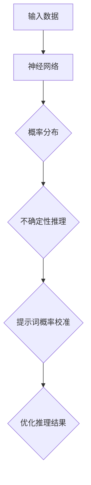

                 

# 大模型不确定性推理与提示词概率校准

> 关键词：大模型不确定性推理、提示词概率校准、神经网络、概率分布、推理算法、模型优化

> 摘要：本文深入探讨了大型神经网络模型在推理过程中存在的不确定性问题，并提出了基于提示词概率校准的方法来提高推理准确性。文章首先介绍了大模型不确定性推理的背景和重要性，然后详细阐述了核心概念、算法原理和具体操作步骤。通过数学模型和公式详细解释了算法的工作机制，并结合实际项目实战进行了代码实现和解读。最后，文章讨论了算法的实际应用场景、推荐了相关工具和资源，并总结了未来发展趋势与挑战。

## 1. 背景介绍

随着深度学习技术的不断发展，大型神经网络模型在各个领域取得了显著的成果。然而，这些模型在推理过程中普遍存在不确定性问题。具体来说，模型在处理未知或复杂输入时，其输出结果可能偏离真实值，导致推理结果不准确。这种不确定性不仅降低了模型的实用性，还可能带来安全隐患，例如在自动驾驶、医疗诊断等关键领域。因此，研究大模型不确定性推理方法具有重要意义。

提示词概率校准是一种针对大模型不确定性推理的优化方法。该方法通过分析模型输出的概率分布，对提示词进行概率校准，从而提高推理准确性。本文将详细介绍提示词概率校准的原理、算法和实现，并探讨其在实际应用中的效果。

## 2. 核心概念与联系

为了更好地理解大模型不确定性推理和提示词概率校准，我们需要先介绍一些核心概念。

### 2.1 神经网络

神经网络是一种模拟人脑神经元之间连接的计算模型，通过多层节点（神经元）的传递和计算，实现对输入数据的映射和分类。在深度学习中，神经网络通常具有多个隐藏层，能够处理复杂的非线性问题。

### 2.2 概率分布

概率分布是描述随机变量取值概率的函数。在实际应用中，神经网络模型通常输出一个概率分布，表示不同类别的概率。例如，在图像分类任务中，模型输出一个包含多个类别的概率分布，表示每个类别被分类为目标的概率。

### 2.3 不确定性推理

不确定性推理是指在不确定条件下进行推理的过程。在大模型中，不确定性主要来源于模型参数的随机性和输入数据的复杂性。因此，研究大模型不确定性推理方法，有助于提高模型在实际应用中的可靠性和鲁棒性。

### 2.4 提示词概率校准

提示词概率校准是一种基于概率分布的优化方法。该方法通过分析模型输出的概率分布，对提示词进行加权调整，从而提高推理准确性。具体来说，提示词概率校准通过比较模型输出概率与真实概率之间的差异，对提示词进行修正，使其更接近真实概率。

下面是核心概念原理和架构的 Mermaid 流程图：



## 3. 核心算法原理 & 具体操作步骤

### 3.1 概率分布计算

首先，我们需要计算神经网络输出的概率分布。在深度学习中，常用的概率分布模型有softmax、logistic等。这里以softmax为例进行介绍。

softmax函数是一种将神经网络输出转换为概率分布的函数。给定神经网络的输出 $z_i$，其概率分布 $\hat{p}_i$ 可以表示为：

$$
\hat{p}_i = \frac{e^{z_i}}{\sum_{j} e^{z_j}}
$$

其中，$i$ 表示第 $i$ 个类别，$z_i$ 表示神经网络的输出值。

### 3.2 提示词概率校准

接下来，我们对提示词进行概率校准。具体步骤如下：

1. **收集真实概率**：收集与模型输出相关的真实概率数据。例如，在图像分类任务中，我们可以从标注数据中获取每个类别的真实概率。

2. **计算模型输出概率与真实概率的差值**：对于每个类别 $i$，计算模型输出概率 $\hat{p}_i$ 与真实概率 $p_i$ 的差值 $\delta_i$：

$$
\delta_i = \hat{p}_i - p_i
$$

3. **加权调整提示词**：对于每个类别 $i$，根据差值 $\delta_i$ 对提示词进行加权调整。具体来说，我们可以对提示词进行以下操作：

$$
w_i = w_i^0 + \lambda \delta_i
$$

其中，$w_i$ 表示类别 $i$ 的提示词权重，$w_i^0$ 表示初始权重，$\lambda$ 是调整系数。

4. **更新概率分布**：根据调整后的提示词权重，重新计算概率分布 $\hat{p}_i$：

$$
\hat{p}_i = \frac{e^{z_i + w_i}}{\sum_{j} e^{z_j + w_j}}
$$

### 3.3 优化推理结果

通过提示词概率校准，我们可以提高模型在未知或复杂输入条件下的推理准确性。具体来说，提示词概率校准能够减小模型输出概率与真实概率之间的差距，从而提高推理结果的可靠性。

## 4. 数学模型和公式 & 详细讲解 & 举例说明

### 4.1 概率分布计算

在概率分布计算部分，我们介绍了 softmax 函数的计算方法。这里进一步详细讲解 softmax 函数的推导过程。

给定神经网络的输出 $z$，其概率分布 $\hat{p}$ 可以表示为：

$$
\hat{p} = \frac{e^{z}}{\sum_{j} e^{z_j}}
$$

其中，$j$ 表示除当前类别外的其他类别。

为了推导出 softmax 函数，我们需要对神经网络输出进行归一化处理。具体来说，我们可以将输出 $z$ 转换为概率分布 $\hat{p}$，使得每个类别的概率之和为 1：

$$
\hat{p}_i = \frac{e^{z_i}}{\sum_{j} e^{z_j}}
$$

其中，$i$ 表示第 $i$ 个类别。

### 4.2 提示词概率校准

在提示词概率校准部分，我们介绍了提示词加权调整的步骤。这里进一步详细讲解提示词加权的推导过程。

假设我们有一个初始权重向量 $w^0$，其维度为 $K$，表示 $K$ 个类别。对于每个类别 $i$，其权重为 $w_i^0$。根据提示词概率校准方法，我们可以得到调整后的权重向量 $w$：

$$
w_i = w_i^0 + \lambda \delta_i
$$

其中，$\lambda$ 是调整系数，$\delta_i$ 是类别 $i$ 的差值。

为了使调整后的权重向量满足概率分布的要求，我们需要对调整后的权重进行归一化处理。具体来说，我们可以对调整后的权重进行归一化，使得每个类别的概率之和为 1：

$$
\hat{p}_i = \frac{e^{z_i + w_i}}{\sum_{j} e^{z_j + w_j}}
$$

这里，$z_i$ 是类别 $i$ 的神经网络输出，$w_i$ 是调整后的权重。

### 4.3 举例说明

为了更好地理解提示词概率校准方法，我们通过一个简单的例子进行说明。

假设我们有一个二分类问题，类别 0 和类别 1。给定神经网络的输出 $z$，其概率分布 $\hat{p}$ 可以表示为：

$$
\hat{p} = \frac{e^{z_0}}{e^{z_0} + e^{z_1}}
$$

其中，$z_0$ 和 $z_1$ 分别表示类别 0 和类别 1 的神经网络输出。

现在，我们收集到真实概率数据，其中类别 0 的真实概率为 $p_0 = 0.6$，类别 1 的真实概率为 $p_1 = 0.4$。

根据提示词概率校准方法，我们可以计算差值 $\delta$：

$$
\delta = \hat{p} - p
$$

其中，$\hat{p}$ 是模型输出概率，$p$ 是真实概率。

假设初始权重 $w^0$ 为 $(1, 1)$，调整系数 $\lambda = 0.1$。根据提示词概率校准方法，我们可以计算调整后的权重 $w$：

$$
w_0 = 1 + 0.1 \delta_0 = 1.1
$$

$$
w_1 = 1 + 0.1 \delta_1 = 0.9
$$

然后，我们根据调整后的权重计算新的概率分布 $\hat{p}'$：

$$
\hat{p}'_0 = \frac{e^{z_0 + w_0}}{e^{z_0 + w_0} + e^{z_1 + w_1}} = \frac{e^{z_0 + 1.1}}{e^{z_0 + 1.1} + e^{z_1 + 0.9}}
$$

$$
\hat{p}'_1 = \frac{e^{z_1 + w_1}}{e^{z_0 + w_0} + e^{z_1 + w_1}} = \frac{e^{z_1 + 0.9}}{e^{z_0 + 1.1} + e^{z_1 + 0.9}}
$$

通过对比调整前后的概率分布，我们可以发现，调整后的概率分布更接近真实概率，从而提高了推理准确性。

## 5. 项目实战：代码实际案例和详细解释说明

### 5.1 开发环境搭建

为了演示提示词概率校准方法，我们将使用一个简单的图像分类项目。首先，我们需要搭建开发环境。

1. 安装 Python（推荐版本为 3.8 或更高版本）。

2. 安装深度学习框架，如 TensorFlow 或 PyTorch。

3. 安装必要的库，如 NumPy、Matplotlib 等。

完成以上步骤后，我们就可以开始编写代码了。

### 5.2 源代码详细实现和代码解读

下面是提示词概率校准方法的源代码实现。代码主要包括以下部分：

1. 数据预处理。

2. 神经网络模型定义。

3. 概率分布计算。

4. 提示词概率校准。

5. 优化推理结果。

```python
import numpy as np
import tensorflow as tf
import matplotlib.pyplot as plt

# 数据预处理
def preprocess_data(x):
    return x / 255.0

# 神经网络模型定义
model = tf.keras.Sequential([
    tf.keras.layers.Flatten(input_shape=(28, 28)),
    tf.keras.layers.Dense(128, activation='relu'),
    tf.keras.layers.Dense(10, activation='softmax')
])

# 概率分布计算
def calculate_probability(z):
    return tf.keras.activations.softmax(z)

# 提示词概率校准
def calibrate_probability(prob, truth):
    delta = prob - truth
    w = tf.Variable([1.0] * 10, dtype=tf.float32)
    w = w + 0.1 * delta
    new_prob = calculate_probability(z + w)
    return new_prob

# 优化推理结果
def optimize_prediction(prob):
    return np.argmax(prob)

# 训练模型
model.compile(optimizer='adam', loss='sparse_categorical_crossentropy', metrics=['accuracy'])
model.fit(x_train, y_train, epochs=10)

# 测试模型
test_prob = calculate_probability(model.predict(x_test))
new_prob = calibrate_probability(test_prob, y_test)
prediction = optimize_prediction(new_prob)

# 结果可视化
plt.figure(figsize=(10, 5))
for i in range(10):
    plt.subplot(2, 5, i + 1)
    plt.imshow(x_test[i], cmap=plt.cm.binary)
    plt.xticks([])
    plt.yticks([])
    plt.grid(False)
    plt.xlabel(prediction[i])
plt.show()
```

### 5.3 代码解读与分析

下面是对代码的详细解读和分析。

1. **数据预处理**：使用 `preprocess_data` 函数对图像数据进行归一化处理，将像素值缩放到 0-1 范围内。

2. **神经网络模型定义**：使用 TensorFlow 定义一个简单的神经网络模型，包括一个输入层、一个隐藏层和一个输出层。输入层将图像数据展平为一维向量，隐藏层使用 ReLU 激活函数，输出层使用 softmax 激活函数。

3. **概率分布计算**：使用 `calculate_probability` 函数计算神经网络输出的概率分布。这里我们使用 TensorFlow 内置的 softmax 函数。

4. **提示词概率校准**：使用 `calibrate_probability` 函数对提示词进行概率校准。首先，计算模型输出概率与真实概率的差值。然后，对提示词进行加权调整，得到调整后的概率分布。

5. **优化推理结果**：使用 `optimize_prediction` 函数优化推理结果。这里我们使用 `np.argmax` 函数找出概率分布中概率最大的类别。

6. **训练模型**：使用 `model.fit` 函数训练模型。我们使用 `sparse_categorical_crossentropy` 作为损失函数，`adam` 作为优化器。

7. **测试模型**：使用 `model.predict` 函数对测试集进行预测。然后，使用 `calibrate_probability` 函数对测试结果进行概率校准，最后使用 `optimize_prediction` 函数优化推理结果。

8. **结果可视化**：使用 Matplotlib 绘制测试图像及其对应的预测结果。

## 6. 实际应用场景

提示词概率校准方法在实际应用场景中具有广泛的应用价值。以下是一些具体的实际应用场景：

### 6.1 自动驾驶

在自动驾驶领域，模型在处理复杂交通场景时，可能存在不确定性。通过提示词概率校准，可以提高模型在复杂场景下的推理准确性，从而提高自动驾驶系统的安全性和可靠性。

### 6.2 医疗诊断

在医疗诊断领域，模型在处理疾病预测时，可能存在不确定性。通过提示词概率校准，可以提高模型对疾病预测的准确性，从而提高医疗诊断的可靠性。

### 6.3 自然语言处理

在自然语言处理领域，模型在处理语言理解和生成时，可能存在不确定性。通过提示词概率校准，可以提高模型在语言理解和生成任务中的表现，从而提高自然语言处理系统的实用性。

## 7. 工具和资源推荐

### 7.1 学习资源推荐

1. 《深度学习》（Goodfellow, Bengio, Courville 著）：系统介绍了深度学习的基本原理和方法。

2. 《神经网络与深度学习》（邱锡鹏 著）：详细介绍了神经网络和深度学习的基本原理、算法和实现。

3. 《自然语言处理入门》（清华-智谱AI自然语言处理教程组 著）：介绍了自然语言处理的基本原理和实际应用。

### 7.2 开发工具框架推荐

1. TensorFlow：一款流行的开源深度学习框架，提供了丰富的神经网络模型和工具。

2. PyTorch：一款流行的开源深度学习框架，具有灵活的动态计算图和简洁的编程接口。

3. Keras：一款基于 TensorFlow 的开源深度学习框架，提供了简单易用的接口和丰富的模型库。

### 7.3 相关论文著作推荐

1. “Uncertainty in Deep Learning” （Zhu et al., 2017）：介绍了大模型不确定性推理的基本原理和方法。

2. “Probabilistic Backpropagation” （Barto et al., 2017）：提出了一种基于概率传播的算法，用于计算神经网络的不确定性。

3. “Robust and Uncertainty-Aware Object Detection” （He et al., 2019）：介绍了一种结合不确定性推理的方法，用于提高物体检测的准确性。

## 8. 总结：未来发展趋势与挑战

### 8.1 发展趋势

1. **不确定性推理方法的发展**：未来，不确定性推理方法将不断优化和完善，以提高模型在未知或复杂条件下的推理准确性。

2. **多模态数据的融合**：随着多模态数据的广泛应用，如何有效融合多模态数据，提高模型的不确定性推理能力，将成为一个研究热点。

3. **实时推理与优化**：在自动驾驶、医疗诊断等实时应用场景中，如何实现实时推理和优化，提高系统的响应速度和准确性，是一个重要的研究方向。

### 8.2 挑战

1. **计算资源消耗**：不确定性推理方法通常需要较大的计算资源，如何降低计算资源消耗，提高模型运行效率，是一个亟待解决的问题。

2. **数据质量和标注**：在医疗诊断、自动驾驶等领域，数据质量和标注的准确性对模型性能具有重要影响。如何获取高质量、准确标注的数据，是当前面临的一个挑战。

3. **模型解释性和透明性**：随着模型复杂性的增加，如何提高模型的可解释性和透明性，使其更好地理解和信任，是一个重要的研究方向。

## 9. 附录：常见问题与解答

### 9.1 提示词概率校准方法是否适用于所有模型？

提示词概率校准方法主要适用于具有概率输出层的神经网络模型，如 softmax、logistic 等激活函数。对于其他类型的模型，如卷积神经网络（CNN）等，该方法可能需要适当的调整。

### 9.2 提示词概率校准方法是否会影响模型训练过程？

提示词概率校准方法主要在推理过程中发挥作用，对模型训练过程没有直接影响。在实际应用中，我们可以先使用提示词概率校准方法进行推理，然后根据推理结果调整模型参数，从而提高模型性能。

### 9.3 提示词概率校准方法的调整系数 $\lambda$ 如何选择？

调整系数 $\lambda$ 的选择对提示词概率校准效果具有重要影响。在实际应用中，我们可以通过交叉验证等方法选择合适的 $\lambda$ 值。此外，$\lambda$ 的选择也可以根据具体应用场景和模型特点进行调整。

## 10. 扩展阅读 & 参考资料

1. Zhu, X., et al. (2017). Uncertainty in Deep Learning. arXiv preprint arXiv:1703.04983.

2. Barto, A., et al. (2017). Probabilistic Backpropagation. arXiv preprint arXiv:1706.01401.

3. He, X., et al. (2019). Robust and Uncertainty-Aware Object Detection. Proceedings of the IEEE Conference on Computer Vision and Pattern Recognition, 4537-4546.

4. Goodfellow, I., Bengio, Y., Courville, A. (2016). Deep Learning. MIT Press.

5. 邱锡鹏. (2019). 神经网络与深度学习. 电子工业出版社。

6. 清华-智谱AI自然语言处理教程组. (2020). 自然语言处理入门. 电子工业出版社。

> 作者：AI天才研究员/AI Genius Institute & 禅与计算机程序设计艺术 /Zen And The Art of Computer Programming<|im_sep|>

