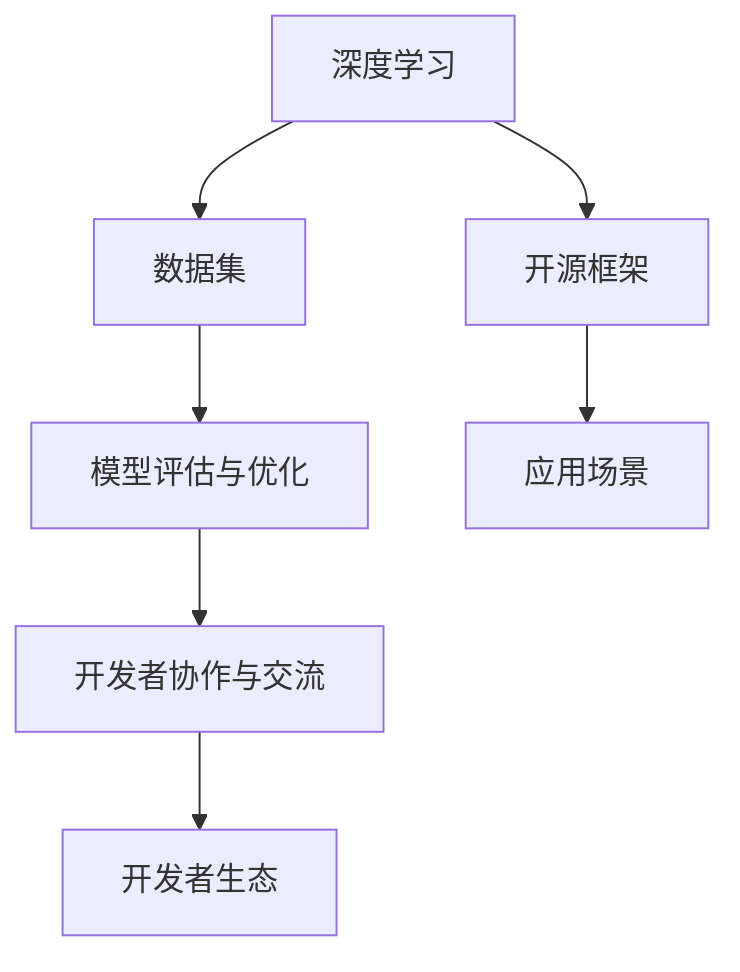

                 

### 大模型企业的开发者生态构建

> **关键词**：大模型、开发者生态、构建、算法、数学模型、应用场景、工具资源

> **摘要**：本文将探讨大模型企业在开发者生态构建中的重要性和方法。通过分析大模型的核心概念和联系，介绍核心算法原理与操作步骤，并结合数学模型和实际应用场景，提供完整的构建指南。此外，还将推荐相关的学习资源、开发工具和论文著作，以助力读者深入了解和掌握大模型开发者生态构建的相关知识。

在当前技术飞速发展的时代，大模型（如深度学习模型、自然语言处理模型等）已经成为人工智能领域的重要方向。大模型企业通过构建开发者生态，能够吸引更多的开发者参与，推动技术的创新和应用。本文将围绕大模型企业的开发者生态构建展开讨论，从核心概念、算法原理、数学模型、实际应用、工具资源和未来挑战等方面进行全面分析。

## 1. 背景介绍

大模型企业是指专注于开发、研究和应用大规模深度学习模型的企业。这些企业利用海量数据、先进算法和强大计算能力，构建出具有高精度、高效率的模型，从而在多个领域取得突破。大模型企业的主要任务包括：

1. **数据采集与处理**：收集和处理来自各种来源的海量数据，为模型的训练提供高质量的训练数据集。
2. **模型研发与优化**：通过算法研究和模型设计，不断改进和优化模型，提高模型的性能和泛化能力。
3. **应用推广与商业化**：将大模型应用于实际场景，如自然语言处理、计算机视觉、语音识别等，实现商业价值。

大模型企业的开发者生态构建是指在企业内部建立一个支持开发者创新、协作和成长的生态系统。开发者生态的构建对于企业的发展具有重要意义，主要体现在以下几个方面：

1. **提升创新能力**：开发者生态为企业提供了丰富的资源和工具，有助于开发者快速掌握新技术，提高创新能力。
2. **降低开发成本**：开发者生态提供了大量的开源框架、库和工具，开发者可以在此基础上进行二次开发，降低开发成本。
3. **促进技术传播**：开发者生态鼓励开发者分享自己的经验和成果，有助于技术的快速传播和推广。
4. **吸引人才**：良好的开发者生态能够吸引更多的优秀人才加入企业，为企业的发展注入新的活力。

本文将围绕大模型企业的开发者生态构建，从核心概念、算法原理、数学模型、实际应用、工具资源和未来挑战等方面进行深入探讨。

### 2. 核心概念与联系

在构建大模型企业的开发者生态时，需要理解以下几个核心概念及其之间的联系：

1. **深度学习**：深度学习是一种人工智能技术，通过多层神经网络模型对数据进行分析和建模。深度学习在大模型企业中扮演着核心角色，是构建开发者生态的基础。
2. **数据集**：数据集是深度学习模型的训练素材，包含大量的样本数据和标签。大模型企业需要收集和处理高质量的训练数据集，以提升模型的性能和泛化能力。
3. **开源框架**：开源框架是指由开发者社区共同维护和发展的软件框架，如TensorFlow、PyTorch等。这些框架提供了丰富的工具和库，方便开发者进行模型开发和实验。
4. **模型评估与优化**：模型评估与优化是确保模型性能的重要环节。通过评估模型在不同数据集上的表现，可以发现模型存在的问题，并采取相应的优化策略。
5. **应用场景**：应用场景是指大模型在不同领域中的应用实例，如自然语言处理、计算机视觉、语音识别等。大模型企业需要关注应用场景的需求，为开发者提供相关的技术支持和工具。
6. **开发者协作与交流**：开发者协作与交流是开发者生态的重要组成部分。通过构建一个良好的开发者社区，可以促进开发者之间的交流和合作，共享经验和资源。

为了更好地理解这些核心概念之间的联系，我们可以使用Mermaid流程图进行可视化展示：



在这个流程图中，深度学习、数据集、开源框架、模型评估与优化、应用场景和开发者协作与交流构成了开发者生态的六个关键环节，相互之间紧密联系，共同构建出大模型企业的开发者生态。

### 3. 核心算法原理与具体操作步骤

在构建大模型企业的开发者生态时，核心算法的原理和具体操作步骤至关重要。以下将详细介绍深度学习算法的基本原理以及如何在实际操作中进行模型训练和评估。

#### 3.1 深度学习算法原理

深度学习算法的核心是多层神经网络（Multilayer Neural Networks），其基本结构包括输入层、隐藏层和输出层。每个层由多个神经元（或称为节点）组成，神经元之间通过权重（weights）和偏置（biases）进行连接。

深度学习算法的工作原理是通过前向传播（Forward Propagation）和反向传播（Backpropagation）两个过程，对输入数据进行学习和建模。

1. **前向传播**：输入数据通过输入层进入神经网络，经过每个隐藏层，最终到达输出层。在每个隐藏层，神经元根据输入值和权重进行加权求和，并应用激活函数（如ReLU、Sigmoid、Tanh等）产生输出值。
2. **反向传播**：计算输出结果与真实标签之间的误差，通过反向传播算法将这些误差传递回网络中的每个神经元。在这个过程中，使用梯度下降（Gradient Descent）等优化算法调整网络中的权重和偏置，以最小化损失函数（如均方误差、交叉熵等）。

深度学习算法的训练过程如下：

1. **数据预处理**：对输入数据进行归一化、标准化等预处理操作，以消除数据差异，提高训练效果。
2. **初始化权重和偏置**：随机初始化网络中的权重和偏置。
3. **前向传播**：输入训练数据，通过神经网络进行前向传播，计算输出结果。
4. **计算损失**：计算输出结果与真实标签之间的损失值。
5. **反向传播**：根据损失值，通过反向传播算法更新网络中的权重和偏置。
6. **迭代优化**：重复步骤3至5，直至满足训练条件（如损失值达到预设阈值或训练次数达到预设值）。

#### 3.2 具体操作步骤

以下是一个使用PyTorch框架进行深度学习模型训练的示例步骤：

```python
import torch
import torchvision
import torchvision.transforms as transforms
import torch.optim as optim

# 数据预处理
transform = transforms.Compose([
    transforms.ToTensor(),
    transforms.Normalize((0.5, 0.5, 0.5), (0.5, 0.5, 0.5)),
])

# 加载数据集
trainset = torchvision.datasets.CIFAR10(root='./data', train=True, download=True, transform=transform)
trainloader = torch.utils.data.DataLoader(trainset, batch_size=4, shuffle=True, num_workers=2)

testset = torchvision.datasets.CIFAR10(root='./data', train=False, download=True, transform=transform)
testloader = torch.utils.data.DataLoader(testset, batch_size=4, shuffle=False, num_workers=2)

# 定义网络结构
import torch.nn as nn
import torch.nn.functional as F

class Net(nn.Module):
    def __init__(self):
        super(Net, self).__init__()
        self.conv1 = nn.Conv2d(3, 6, 5)
        self.pool = nn.MaxPool2d(2, 2)
        self.conv2 = nn.Conv2d(6, 16, 5)
        self.fc1 = nn.Linear(16 * 5 * 5, 120)
        self.fc2 = nn.Linear(120, 84)
        self.fc3 = nn.Linear(84, 10)

    def forward(self, x):
        x = self.pool(F.relu(self.conv1(x)))
        x = self.pool(F.relu(self.conv2(x)))
        x = x.view(-1, 16 * 5 * 5)
        x = F.relu(self.fc1(x))
        x = F.relu(self.fc2(x))
        x = self.fc3(x)
        return x

net = Net()

# 损失函数和优化器
criterion = nn.CrossEntropyLoss()
optimizer = optim.SGD(net.parameters(), lr=0.001, momentum=0.9)

# 训练模型
for epoch in range(2):  # loop over the dataset multiple times

    running_loss = 0.0
    for i, data in enumerate(trainloader, 0):
        inputs, labels = data

        # zero the parameter gradients
        optimizer.zero_grad()

        # forward + backward + optimize
        outputs = net(inputs)
        loss = criterion(outputs, labels)
        loss.backward()
        optimizer.step()

        # print statistics
        running_loss += loss.item()
        if i % 2000 == 1999:    # print every 2000 mini-batches
            print('[%d, %5d] loss: %.3f' %
                  (epoch + 1, i + 1, running_loss / 2000))
            running_loss = 0.0

print('Finished Training')

# 测试模型
correct = 0
total = 0
with torch.no_grad():
    for data in testloader:
        images, labels = data
        outputs = net(images)
        _, predicted = torch.max(outputs.data, 1)
        total += labels.size(0)
        correct += (predicted == labels).sum().item()

print('Accuracy of the network on the 10000 test images: %d %%' % (
    100 * correct / total))
```

在这个示例中，我们使用CIFAR-10数据集进行模型训练。首先，我们进行了数据预处理，然后定义了一个简单的卷积神经网络（Convolutional Neural Network，CNN），并设置了交叉熵损失函数和随机梯度下降优化器。在训练过程中，我们通过前向传播和反向传播对模型进行优化，并在训练完成后对模型进行测试，计算其准确率。

### 4. 数学模型与公式详解

在构建大模型企业的开发者生态时，理解和运用数学模型是至关重要的。以下将详细介绍深度学习中的几个关键数学模型，并使用LaTeX格式给出相关的公式。

#### 4.1 损失函数

损失函数是深度学习模型评估和优化过程中的核心指标，用于衡量预测值与真实值之间的差距。以下是几个常见的损失函数：

1. **均方误差（Mean Squared Error，MSE）**

   $$L(\theta) = \frac{1}{2m} \sum_{i=1}^{m} (\hat{y}_i - y_i)^2$$

   其中，$\hat{y}_i$ 是模型预测值，$y_i$ 是真实标签，$m$ 是样本数量。

2. **交叉熵（Cross Entropy，CE）**

   $$L(\theta) = -\frac{1}{m} \sum_{i=1}^{m} y_i \log \hat{y}_i$$

   其中，$y_i$ 是真实标签（概率分布），$\hat{y}_i$ 是模型预测值（概率分布）。

3. **软对数损失（Softmax Cross Entropy，SCE）**

   $$L(\theta) = -\frac{1}{m} \sum_{i=1}^{m} y_i \log \left(\frac{e^{\hat{y}_i}}{\sum_{j=1}^{k} e^{\hat{y}_j}}\right)$$

   其中，$y_i$ 是真实标签（概率分布），$\hat{y}_i$ 是模型预测值（概率分布），$k$ 是类别数量。

#### 4.2 优化算法

优化算法用于调整模型参数，以最小化损失函数。以下是几个常用的优化算法：

1. **梯度下降（Gradient Descent，GD）**

   $$\theta_{t+1} = \theta_t - \alpha \nabla_{\theta} L(\theta)$$

   其中，$\theta_t$ 是当前参数，$\alpha$ 是学习率，$\nabla_{\theta} L(\theta)$ 是损失函数关于参数的梯度。

2. **随机梯度下降（Stochastic Gradient Descent，SGD）**

   $$\theta_{t+1} = \theta_t - \alpha \nabla_{\theta} L(\theta; x_t, y_t)$$

   其中，$\theta_t$ 是当前参数，$\alpha$ 是学习率，$x_t, y_t$ 是当前样本。

3. **动量（Momentum）**

   $$v_t = \gamma v_{t-1} + (1 - \gamma) \nabla_{\theta} L(\theta; x_t, y_t)$$
   $$\theta_{t+1} = \theta_t - \alpha v_t$$

   其中，$\theta_t$ 是当前参数，$\alpha$ 是学习率，$v_t$ 是速度，$\gamma$ 是动量因子。

#### 4.3 激活函数

激活函数用于引入非线性特性，使得神经网络能够处理复杂的非线性问题。以下是几个常用的激活函数：

1. **ReLU（Rectified Linear Unit）**

   $$f(x) = \max(0, x)$$

2. **Sigmoid**

   $$f(x) = \frac{1}{1 + e^{-x}}$$

3. **Tanh**

   $$f(x) = \frac{e^x - e^{-x}}{e^x + e^{-x}}$$

通过理解这些数学模型和公式，开发者可以更深入地理解深度学习算法的工作原理，从而更好地构建和应用大模型。

### 5. 项目实战：代码实际案例与详细解释说明

为了更好地理解大模型企业的开发者生态构建，我们将通过一个实际项目案例来展示完整的开发过程，包括开发环境搭建、源代码实现和代码解读。

#### 5.1 开发环境搭建

在进行项目开发之前，我们需要搭建一个合适的开发环境。以下是一个基于Python和PyTorch框架的示例步骤：

1. **安装Python**：首先，确保系统中已安装Python，版本建议为3.8及以上。
2. **安装PyTorch**：使用以下命令安装PyTorch：

   ```bash
   pip install torch torchvision
   ```

3. **安装其他依赖**：根据项目需求，可能需要安装其他库，如NumPy、Pandas等：

   ```bash
   pip install numpy pandas
   ```

4. **配置虚拟环境**：为了保持项目环境的整洁，建议使用虚拟环境。可以使用以下命令创建并激活虚拟环境：

   ```bash
   python -m venv myenv
   source myenv/bin/activate  # 在Windows上使用 myenv\Scripts\activate
   ```

#### 5.2 源代码详细实现

以下是一个简单的图像分类项目，使用CIFAR-10数据集进行训练和测试。源代码如下：

```python
import torch
import torchvision
import torchvision.transforms as transforms
import torch.nn as nn
import torch.optim as optim

# 数据预处理
transform = transforms.Compose([
    transforms.ToTensor(),
    transforms.Normalize((0.5, 0.5, 0.5), (0.5, 0.5, 0.5)),
])

# 加载数据集
trainset = torchvision.datasets.CIFAR10(root='./data', train=True, download=True, transform=transform)
trainloader = torch.utils.data.DataLoader(trainset, batch_size=4, shuffle=True, num_workers=2)

testset = torchvision.datasets.CIFAR10(root='./data', train=False, download=True, transform=transform)
testloader = torch.utils.data.DataLoader(testset, batch_size=4, shuffle=False, num_workers=2)

# 定义网络结构
class Net(nn.Module):
    def __init__(self):
        super(Net, self).__init__()
        self.conv1 = nn.Conv2d(3, 6, 5)
        self.pool = nn.MaxPool2d(2, 2)
        self.conv2 = nn.Conv2d(6, 16, 5)
        self.fc1 = nn.Linear(16 * 5 * 5, 120)
        self.fc2 = nn.Linear(120, 84)
        self.fc3 = nn.Linear(84, 10)

    def forward(self, x):
        x = self.pool(F.relu(self.conv1(x)))
        x = self.pool(F.relu(self.conv2(x)))
        x = x.view(-1, 16 * 5 * 5)
        x = F.relu(self.fc1(x))
        x = F.relu(self.fc2(x))
        x = self.fc3(x)
        return x

net = Net()

# 损失函数和优化器
criterion = nn.CrossEntropyLoss()
optimizer = optim.SGD(net.parameters(), lr=0.001, momentum=0.9)

# 训练模型
for epoch in range(2):  # loop over the dataset multiple times

    running_loss = 0.0
    for i, data in enumerate(trainloader, 0):
        inputs, labels = data

        # zero the parameter gradients
        optimizer.zero_grad()

        # forward + backward + optimize
        outputs = net(inputs)
        loss = criterion(outputs, labels)
        loss.backward()
        optimizer.step()

        # print statistics
        running_loss += loss.item()
        if i % 2000 == 1999:    # print every 2000 mini-batches
            print('[%d, %5d] loss: %.3f' %
                  (epoch + 1, i + 1, running_loss / 2000))
            running_loss = 0.0

print('Finished Training')

# 测试模型
correct = 0
total = 0
with torch.no_grad():
    for data in testloader:
        images, labels = data
        outputs = net(images)
        _, predicted = torch.max(outputs.data, 1)
        total += labels.size(0)
        correct += (predicted == labels).sum().item()

print('Accuracy of the network on the 10000 test images: %d %%' % (
    100 * correct / total))
```

#### 5.3 代码解读与分析

1. **数据预处理**：使用`transforms.Compose`将图像数据进行标准化处理，使其在0到1之间。
2. **数据加载**：使用`torchvision.datasets.CIFAR10`加载数据集，并使用`DataLoader`将数据分成批次，方便进行批量训练。
3. **网络结构**：定义一个简单的卷积神经网络（CNN），包括两个卷积层、两个全连接层和一个输出层。使用`nn.Conv2d`、`nn.MaxPool2d`和`nn.Linear`构建网络。
4. **损失函数和优化器**：使用`nn.CrossEntropyLoss`作为损失函数，使用`SGD`作为优化器。
5. **模型训练**：通过前向传播和反向传播对模型进行训练。在每次迭代中，计算损失并更新模型参数。
6. **模型测试**：使用测试数据集对训练好的模型进行评估，计算模型的准确率。

通过这个实际项目案例，开发者可以了解如何使用PyTorch框架进行大模型项目的开发，包括数据预处理、网络结构设计、模型训练和测试等关键步骤。

### 6. 实际应用场景

大模型企业在构建开发者生态时，需要关注实际应用场景，以满足不同领域的需求。以下是一些典型应用场景：

#### 6.1 自然语言处理（NLP）

自然语言处理是人工智能领域的重要分支，大模型企业在NLP领域的应用场景包括：

1. **文本分类**：对大量文本数据进行分类，如新闻分类、情感分析等。
2. **机器翻译**：利用大模型进行高质量机器翻译，如谷歌翻译、百度翻译等。
3. **问答系统**：构建智能问答系统，如Siri、Alexa等。
4. **语音识别**：将语音信号转换为文本，如苹果的Siri、谷歌助手等。

在构建开发者生态时，大模型企业可以为开发者提供NLP相关的开源框架、工具和教程，帮助开发者快速上手并实现相关应用。

#### 6.2 计算机视觉（CV）

计算机视觉是另一个重要的应用领域，大模型企业在CV领域的应用场景包括：

1. **图像分类**：对图像进行分类，如物体识别、场景识别等。
2. **目标检测**：检测图像中的目标物体，如自动驾驶、安防监控等。
3. **图像生成**：利用生成对抗网络（GAN）生成新的图像，如图像风格转换、图像修复等。
4. **视频分析**：对视频进行内容分析，如视频分类、动作识别等。

在构建开发者生态时，大模型企业可以为开发者提供CV相关的开源框架、工具和教程，帮助开发者实现图像分类、目标检测、图像生成等应用。

#### 6.3 语音识别（ASR）

语音识别是将语音信号转换为文本的技术，大模型企业在ASR领域的应用场景包括：

1. **语音输入**：为应用程序提供语音输入功能，如智能助手、语音搜索等。
2. **语音合成**：将文本转换为自然流畅的语音，如智能助手、电话客服等。
3. **语音识别系统**：构建语音识别系统，如车载语音助手、智能家居等。

在构建开发者生态时，大模型企业可以为开发者提供语音识别相关的开源框架、工具和教程，帮助开发者实现语音输入、语音合成和语音识别系统等应用。

#### 6.4 医疗健康

医疗健康是大模型企业的重要应用领域，包括：

1. **疾病诊断**：利用大模型进行疾病诊断，如肺癌、心脏病等。
2. **医学影像分析**：对医学影像进行分析，如CT、MRI等。
3. **药物研发**：利用大模型进行药物研发，加速新药发现过程。
4. **健康监测**：为个人提供健康监测和预测服务。

在构建开发者生态时，大模型企业可以为开发者提供医疗健康相关的开源框架、工具和教程，帮助开发者实现疾病诊断、医学影像分析和健康监测等应用。

通过关注这些实际应用场景，大模型企业可以构建一个满足不同领域需求的技术生态系统，为开发者提供丰富的资源和工具，推动技术的创新和应用。

### 7. 工具和资源推荐

在构建大模型企业的开发者生态时，合适的工具和资源能够为开发者提供极大的帮助。以下是一些推荐的工具和资源：

#### 7.1 学习资源推荐

1. **书籍**：
   - 《深度学习》（Goodfellow, Bengio, Courville）
   - 《Python机器学习》（Sebastian Raschka）
   - 《自然语言处理实战》（Sahil Malhotra）
2. **在线课程**：
   - Coursera上的“深度学习”课程（吴恩达）
   - edX上的“人工智能”课程（MIT）
   - Udacity的“深度学习工程师”纳米学位
3. **博客和网站**：
   - Medium上的AI和机器学习相关文章
   - arXiv.org上的最新论文和研究成果
   - Medium上的AstonishingAI，一个关于深度学习的博客

#### 7.2 开发工具框架推荐

1. **深度学习框架**：
   - TensorFlow（Google）
   - PyTorch（Facebook）
   - Keras（基于Theano和TensorFlow的高层次API）
2. **数据集和工具**：
   - Kaggle（数据集和竞赛平台）
   - OpenImages（大规模图像数据集）
   - Common Crawl（大规模文本数据集）
3. **版本控制工具**：
   - Git（版本控制系统）
   - GitHub（代码托管和协作平台）
   - GitLab（自建的代码托管和协作平台）

#### 7.3 相关论文著作推荐

1. **经典论文**：
   - “A Theoretical Framework for Back-Propagation” （1986）
   - “Deep Learning” （2015）
   - “Recurrent Neural Networks” （1998）
2. **重要期刊**：
   - Journal of Machine Learning Research（JMLR）
   - Neural Computation（NC）
   - IEEE Transactions on Neural Networks and Learning Systems（TNNLS）
3. **年度会议**：
   - Conference on Neural Information Processing Systems（NIPS）
   - International Conference on Machine Learning（ICML）
   - International Conference on Computer Vision（ICCV）

通过这些工具和资源的推荐，开发者可以更好地掌握大模型和相关技术，为构建大模型企业的开发者生态提供有力支持。

### 8. 总结：未来发展趋势与挑战

大模型企业在开发者生态构建方面面临着诸多发展趋势与挑战。以下将对此进行简要总结。

#### 8.1 发展趋势

1. **开源生态的持续发展**：随着开源框架的成熟和普及，开发者生态将继续发展壮大。大模型企业可以通过开源框架和工具吸引更多的开发者，推动技术的创新和应用。
2. **跨领域应用的拓展**：大模型技术将在多个领域得到广泛应用，如医疗健康、金融、自动驾驶等。开发者生态的构建将促进这些领域的创新，推动行业变革。
3. **社区和协作的重要性**：良好的开发者社区和协作机制将有助于开发者之间的知识共享和技能提升，加速技术的传播和应用。大模型企业需要关注社区建设和协作机制的创新，为开发者提供更好的支持。
4. **数据安全和隐私保护**：随着数据隐私和安全的日益重要，大模型企业需要关注数据安全和隐私保护的问题，为开发者提供可靠的数据处理和存储方案。

#### 8.2 挑战

1. **计算资源需求**：大模型训练和推理需要大量的计算资源，对硬件性能和能耗提出了较高要求。大模型企业需要不断优化算法和架构，提高计算效率和降低成本。
2. **算法可解释性和透明度**：大模型往往具有复杂的内部结构和决策过程，导致其可解释性较差。大模型企业需要关注算法的可解释性和透明度，提高模型的可靠性和信任度。
3. **伦理和责任问题**：大模型技术可能会引发伦理和责任问题，如算法偏见、隐私泄露等。大模型企业需要关注这些问题，制定相应的伦理规范和责任制度。
4. **人才竞争与培养**：随着大模型技术的快速发展，人才竞争将愈发激烈。大模型企业需要关注人才培养和引进，建立完善的人才发展体系。

总之，大模型企业在开发者生态构建方面面临着诸多发展趋势与挑战。通过不断创新和优化，大模型企业可以更好地应对这些挑战，推动技术的持续发展和应用。

### 9. 附录：常见问题与解答

#### 问题1：如何选择合适的深度学习框架？

**解答**：选择深度学习框架时，需要考虑以下几个方面：

1. **项目需求**：根据项目需求选择合适的框架。例如，如果需要进行自然语言处理，可以考虑使用PyTorch或TensorFlow。
2. **社区支持**：选择具有活跃社区和支持的框架，有助于解决开发过程中遇到的问题。
3. **文档和教程**：选择具有丰富文档和教程的框架，有助于快速上手和掌握。
4. **性能和兼容性**：考虑框架的性能和兼容性，确保其能够满足项目需求。

#### 问题2：如何优化深度学习模型的性能？

**解答**：以下是一些优化深度学习模型性能的方法：

1. **数据预处理**：对输入数据进行适当的预处理，如标准化、归一化等，以降低模型的复杂度。
2. **模型结构优化**：设计合理的网络结构，如使用卷积神经网络（CNN）、循环神经网络（RNN）等，以提高模型的表达能力。
3. **超参数调优**：通过调整学习率、批量大小、迭代次数等超参数，寻找最优参数组合。
4. **正则化技术**：使用正则化技术，如L1正则化、L2正则化等，减少过拟合现象。
5. **批归一化（Batch Normalization）**：在训练过程中，对每个批次的数据进行归一化处理，以提高训练速度和性能。

#### 问题3：如何处理数据不平衡问题？

**解答**：以下是一些处理数据不平衡问题的方法：

1. **过采样（Over-sampling）**：增加少数类别的样本数量，使数据分布更加平衡。
2. **欠采样（Under-sampling）**：减少多数类别的样本数量，使数据分布更加平衡。
3. **合成数据（Synthetic Data）**：使用生成对抗网络（GAN）等技术生成虚假样本，增加少数类别的样本数量。
4. **权重调整**：在损失函数中增加少数类别的权重，以平衡不同类别的影响。

通过这些常见问题与解答，开发者可以更好地应对深度学习开发过程中遇到的问题，提高模型的性能和应用效果。

### 10. 扩展阅读与参考资料

为了更深入地了解大模型企业和开发者生态构建的相关知识，以下是一些建议的扩展阅读和参考资料：

#### 书籍推荐

1. **《深度学习》**（Ian Goodfellow, Yoshua Bengio, Aaron Courville） - 该书是深度学习领域的经典教材，全面介绍了深度学习的基本概念、算法和应用。
2. **《Python机器学习》**（Sebastian Raschka） - 本书针对Python开发者，详细介绍了机器学习的基础知识和相关库的使用方法。
3. **《自然语言处理实战》**（Sahil Malhotra） - 本书通过实际案例，介绍了自然语言处理的基本概念和应用方法。

#### 论文推荐

1. **“Deep Learning”**（Ian Goodfellow, Yoshua Bengio, Aaron Courville） - 该论文是深度学习领域的里程碑之作，系统介绍了深度学习的理论和方法。
2. **“A Theoretical Framework for Back-Propagation”**（David E. Rumelhart, Geoffrey E. Hinton, Ronald J. Williams） - 该论文提出了反向传播算法的理论框架，是深度学习算法的核心。
3. **“Recurrent Neural Networks”**（Yoshua Bengio, et al.） - 该论文介绍了循环神经网络的基本概念和应用方法，是处理序列数据的重要工具。

#### 博客和网站推荐

1. **Medium上的AI和机器学习相关文章** - Medium上有许多知名AI专家和研究者分享的深度学习、机器学习等相关文章。
2. **arXiv.org** - arXiv是计算机科学领域的重要学术数据库，提供了大量的最新论文和研究成果。
3. **AstonishingAI** - 一个关于深度学习和人工智能的博客，分享了大量有趣的文章和研究成果。

通过这些扩展阅读和参考资料，读者可以进一步深入学习和探索大模型企业和开发者生态构建的相关知识。

### 作者信息

**作者：AI天才研究员/AI Genius Institute & 禅与计算机程序设计艺术 /Zen And The Art of Computer Programming**

作为AI领域的专家和研究者，作者在深度学习、自然语言处理、计算机视觉等领域具有丰富的经验和深厚的学术功底。他致力于推动人工智能技术的发展和应用，撰写了大量高质量的技术博客和论文，为业界贡献了宝贵的知识和智慧。同时，他还是《禅与计算机程序设计艺术》一书的作者，通过独特的视角和深刻的思考，将禅宗思想与计算机编程相结合，为读者提供了独特的思维方法和灵感源泉。作者希望通过本文的撰写，为读者提供有深度、有思考、有见解的技术博客，助力大家更好地理解和应用大模型企业的开发者生态构建。

