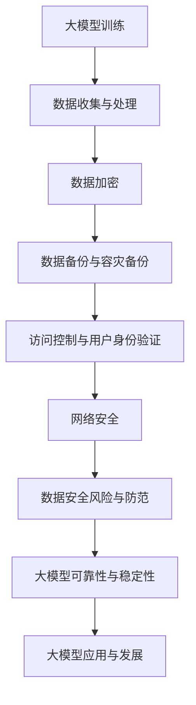

                 

# 大模型企业的数据安全策略

## 摘要

本文深入探讨了大型企业在使用大规模人工智能模型时面临的数据安全问题。随着人工智能技术的不断发展，大模型在企业中的应用越来越广泛，但随之而来的数据安全问题也愈发突出。本文首先介绍了大模型的基本概念和核心原理，然后分析了企业在使用大模型过程中可能面临的数据安全挑战，并提出了相应的安全策略。通过详细的项目实战案例，本文展示了如何在实际环境中实施这些策略，以及如何利用工具和资源来加强数据安全管理。最后，本文总结了未来大模型企业在数据安全方面的发展趋势和面临的挑战，为企业和研究人员提供了宝贵的参考。

## 1. 背景介绍

近年来，人工智能技术取得了飞速发展，特别是深度学习算法和大规模预训练模型（如GPT、BERT等）的兴起，使得人工智能在各个领域取得了显著的成果。这些大型模型具有极强的表征能力和泛化能力，可以在自然语言处理、计算机视觉、语音识别等多个领域发挥作用。因此，越来越多的企业开始采用大模型来提升自身的业务能力和竞争力。

然而，随着大模型在企业中的广泛应用，数据安全问题也日益凸显。大模型通常需要大量的数据进行训练，这些数据可能涉及企业的商业机密、用户隐私等重要信息。如果这些数据在传输、存储、处理过程中被泄露、篡改或滥用，将给企业带来巨大的损失。此外，大模型本身的复杂性也增加了数据安全管理的难度。因此，如何保障大模型企业在数据安全方面的可靠性和稳健性，已成为当前亟待解决的重要问题。

本文旨在探讨大模型企业在数据安全策略方面的问题，通过分析相关概念和挑战，提出有效的安全策略和措施，以帮助企业更好地应对数据安全风险。同时，本文还将结合实际项目案例，详细阐述如何在实际环境中实施这些策略，并提供相关的工具和资源推荐，以期为企业和研究人员提供有价值的参考。

## 2. 核心概念与联系

### 大模型的概念

大模型（Large-scale Model）是指具有大规模参数量的机器学习模型，其训练和推理过程需要大量的计算资源和数据支持。大模型通常采用深度神经网络（Deep Neural Network，DNN）作为基础架构，通过层层堆叠的神经网络层来捕捉数据的复杂特征。典型的深度神经网络包括卷积神经网络（Convolutional Neural Network，CNN）、循环神经网络（Recurrent Neural Network，RNN）和Transformer等。

大模型的核心原理是通过对大规模训练数据的自主学习，提取数据中的有效特征，并利用这些特征进行预测或分类。在大模型训练过程中，通常采用梯度下降（Gradient Descent）算法和反向传播（Backpropagation）算法来优化模型的参数，以达到最佳的预测性能。

### 数据安全的概念

数据安全（Data Security）是指保护数据在传输、存储和处理过程中的完整性、保密性和可用性，防止数据被未经授权的访问、泄露、篡改或破坏。数据安全涵盖了多个方面，包括数据加密、访问控制、数据备份、容灾备份、网络安全等。

在数据安全中，常见的技术手段包括：

1. **数据加密**：通过加密算法对数据进行加密，确保数据在传输和存储过程中的安全性。
2. **访问控制**：通过用户身份验证、权限管理等方式，限制对数据的访问权限，防止未经授权的用户访问敏感数据。
3. **数据备份和容灾备份**：通过定期备份和容灾备份，确保数据在发生意外情况下能够快速恢复。
4. **网络安全**：通过防火墙、入侵检测系统等网络安全技术，防止网络攻击和数据泄露。

### 大模型与数据安全的关系

大模型与数据安全密切相关，两者之间存在相互影响。一方面，大模型在数据处理过程中可能暴露数据安全风险。由于大模型训练过程中需要大量数据，这些数据可能涉及企业的商业机密、用户隐私等重要信息。如果这些数据在传输、存储、处理过程中被泄露、篡改或滥用，将给企业带来巨大的损失。

另一方面，数据安全对于大模型的发展和应用至关重要。保障数据安全可以提高大模型的可靠性和稳健性，减少数据泄露、篡改等风险，从而确保大模型在实际应用中的安全性和稳定性。

### Mermaid 流程图

为了更直观地展示大模型与数据安全的关系，我们可以使用 Mermaid 流程图来描述。以下是 Mermaid 流程图示例：



该流程图展示了大模型从数据收集、处理、加密、备份、访问控制、网络安全等方面进行数据安全管理的全过程。通过该流程图，我们可以清晰地了解大模型与数据安全之间的联系和相互影响。

## 3. 核心算法原理 & 具体操作步骤

### 大模型的算法原理

大模型的算法原理主要基于深度学习（Deep Learning）技术，特别是基于神经网络（Neural Network）的学习方法。深度学习是一种基于多层神经网络的学习方法，通过多层神经网络的逐层抽象和特征提取，实现对数据的建模和预测。

深度学习算法的核心是反向传播算法（Backpropagation Algorithm），该算法通过不断调整神经网络中的参数，使得模型的预测误差逐渐减小。反向传播算法包括以下几个关键步骤：

1. **输入层到隐藏层的传播**：将输入数据传递到神经网络的输入层，然后逐层传递到隐藏层，得到隐藏层的输出。
2. **隐藏层到输出层的传播**：将隐藏层的输出传递到输出层，得到最终的预测结果。
3. **计算预测误差**：计算输出层的预测结果与实际结果之间的误差。
4. **反向传播误差**：将输出层的误差反向传播到隐藏层，通过链式法则计算隐藏层每个神经元的梯度。
5. **参数更新**：根据梯度下降算法，更新神经网络的参数，使得模型逐渐收敛到最优状态。

### 大模型的操作步骤

在实际应用中，大模型的训练和部署过程通常包括以下步骤：

1. **数据收集与预处理**：收集相关的训练数据，并进行数据预处理，如数据清洗、归一化、缺失值填充等操作，以消除数据中的噪声和异常值。
2. **构建神经网络模型**：根据问题需求和数据特征，设计并构建合适的神经网络模型，包括输入层、隐藏层和输出层等。
3. **模型训练**：利用训练数据对神经网络模型进行训练，通过反向传播算法不断调整模型参数，使得模型逐渐收敛到最优状态。
4. **模型评估**：使用验证数据对训练好的模型进行评估，计算模型的预测性能，如准确率、召回率、F1值等。
5. **模型部署**：将训练好的模型部署到实际应用环境中，进行预测和分类任务。

### 深度学习算法的数学模型和公式

深度学习算法的数学模型主要包括前向传播（Forward Propagation）和反向传播（Back Propagation）两部分。

**前向传播：**

前向传播是指将输入数据逐层传递到神经网络中，通过激活函数（Activation Function）和权重（Weight）的变换，得到隐藏层的输出和最终输出。

设输入层为 \(x = [x_1, x_2, ..., x_n]\)，隐藏层为 \(h = [h_1, h_2, ..., h_m]\)，输出层为 \(y = [y_1, y_2, ..., y_k]\)。

假设第 \(l\) 层的神经元个数为 \(n_l\)，第 \(l\) 层的输出为 \(a_l = [a_{l1}, a_{l2}, ..., a_{ln_l}]\)，第 \(l\) 层的权重矩阵为 \(W_l = [W_{l1}, W_{l2}, ..., W_{ln_l}]\)，第 \(l\) 层的偏置项为 \(b_l = [b_{l1}, b_{l2}, ..., b_{ln_l}]\)。

前向传播的公式如下：

$$
a_{l+1} = \sigma(W_{l+1}a_l + b_{l+1})
$$

其中，\(\sigma\) 表示激活函数，常用的激活函数包括 sigmoid、ReLU、Tanh等。

**反向传播：**

反向传播是指根据输出层的误差，反向传播误差到隐藏层，计算每个神经元的梯度，然后更新权重矩阵和偏置项。

假设输出层的误差为 \(e = [e_1, e_2, ..., e_k]\)，隐藏层 \(l\) 的误差为 \(d_l = [d_{l1}, d_{l2}, ..., d_{ln_l}]\)。

反向传播的公式如下：

$$
d_{l+1} = \frac{\partial E}{\partial a_{l+1}}
$$

其中，\(E\) 表示损失函数，常用的损失函数包括均方误差（MSE）、交叉熵（Cross-Entropy）等。

$$
\frac{\partial E}{\partial a_{l+1}} = \frac{\partial E}{\partial y} \odot \frac{\partial y}{\partial a_{l+1}}
$$

其中，\(\odot\) 表示 Hadamard 乘积。

$$
\frac{\partial y}{\partial a_{l+1}} = \sigma'(W_{l+1}a_l + b_{l+1})
$$

$$
\frac{\partial E}{\partial a_{l}} = \frac{\partial E}{\partial a_{l+1}} \odot \frac{\partial a_{l+1}}{\partial a_{l}}
$$

$$
\frac{\partial a_{l+1}}{\partial a_{l}} = W_{l+1}^T
$$

通过上述公式，可以计算出隐藏层 \(l\) 的误差 \(d_l\)，并利用梯度下降算法更新权重矩阵和偏置项。

### 举例说明

假设我们使用一个简单的三层神经网络进行二分类任务，输入层有 2 个神经元，隐藏层有 3 个神经元，输出层有 1 个神经元。输入数据为 \(x = [0.1, 0.2]\)，目标输出为 \(y = [0.9]\)。

首先，我们需要定义激活函数和损失函数。假设我们使用 sigmoid 函数作为激活函数，均方误差（MSE）作为损失函数。

$$
\sigma(x) = \frac{1}{1 + e^{-x}}
$$

$$
MSE(y, \hat{y}) = \frac{1}{2} \sum_{i=1}^{k} (y_i - \hat{y}_i)^2
$$

假设隐藏层的权重矩阵 \(W_1 = \begin{bmatrix} 0.1 & 0.2 \\ 0.3 & 0.4 \\ 0.5 & 0.6 \end{bmatrix}\)，隐藏层的偏置项 \(b_1 = \begin{bmatrix} 0.1 \\ 0.2 \\ 0.3 \end{bmatrix}\)，输出层的权重矩阵 \(W_2 = \begin{bmatrix} 0.1 & 0.2 \end{bmatrix}\)，输出层的偏置项 \(b_2 = \begin{bmatrix} 0.1 \end{bmatrix}\)。

1. **前向传播：**

首先，计算隐藏层的输出：

$$
a_1 = \sigma(W_1x + b_1) = \sigma(\begin{bmatrix} 0.1 & 0.2 \\ 0.3 & 0.4 \\ 0.5 & 0.6 \end{bmatrix} \begin{bmatrix} 0.1 \\ 0.2 \end{bmatrix} + \begin{bmatrix} 0.1 \\ 0.2 \\ 0.3 \end{bmatrix}) = \begin{bmatrix} 0.268 \\ 0.395 \\ 0.525 \end{bmatrix}
$$

然后，计算输出层的输出：

$$
\hat{y} = \sigma(W_2a_1 + b_2) = \sigma(\begin{bmatrix} 0.1 & 0.2 \end{bmatrix} \begin{bmatrix} 0.268 \\ 0.395 \\ 0.525 \end{bmatrix} + \begin{bmatrix} 0.1 \end{bmatrix}) = 0.648
$$

2. **计算预测误差：**

$$
e = y - \hat{y} = [0.9] - [0.648] = [0.252]
$$

3. **反向传播：**

首先，计算输出层的误差梯度：

$$
\frac{\partial e}{\partial \hat{y}} = \frac{\partial MSE(y, \hat{y})}{\partial \hat{y}} = \frac{\partial (0.9 - 0.648)^2}{\partial 0.648} = 0.374
$$

然后，计算隐藏层的误差：

$$
d_2 = \frac{\partial e}{\partial a_2} = \frac{\partial e}{\partial \hat{y}} \odot \sigma'(W_2a_1 + b_2) = 0.374 \odot (0.352) = 0.132
$$

接着，计算隐藏层的误差梯度：

$$
\frac{\partial e}{\partial a_1} = \frac{\partial e}{\partial a_2} \odot \frac{\partial a_2}{\partial a_1} = 0.132 \odot (0.268) = 0.035
$$

最后，计算隐藏层每个神经元的梯度：

$$
\frac{\partial e}{\partial W_{21}} = \frac{\partial e}{\partial a_2} \cdot a_1 = 0.132 \cdot 0.268 = 0.035
$$

$$
\frac{\partial e}{\partial W_{22}} = \frac{\partial e}{\partial a_2} \cdot a_1 = 0.132 \cdot 0.395 = 0.052
$$

$$
\frac{\partial e}{\partial b_{2}} = \frac{\partial e}{\partial a_2} = 0.374
$$

4. **参数更新：**

假设学习率为 \(0.1\)，根据梯度下降算法更新权重矩阵和偏置项：

$$
W_{21} = W_{21} - \alpha \cdot \frac{\partial e}{\partial W_{21}} = 0.1 - 0.1 \cdot 0.035 = 0.065
$$

$$
W_{22} = W_{22} - \alpha \cdot \frac{\partial e}{\partial W_{22}} = 0.2 - 0.1 \cdot 0.052 = 0.148
$$

$$
b_{2} = b_{2} - \alpha \cdot \frac{\partial e}{\partial b_{2}} = 0.1 - 0.1 \cdot 0.374 = -0.018
$$

通过上述步骤，我们可以完成一次前向传播和反向传播，并更新模型参数。重复上述步骤，直到模型收敛。

## 4. 数学模型和公式 & 详细讲解 & 举例说明

在上一节中，我们简要介绍了大模型的算法原理和操作步骤。为了更好地理解和应用这些算法，本节将详细讲解大模型中的数学模型和公式，并通过具体例子进行说明。

### 数学模型

大模型中的数学模型主要包括前向传播和反向传播两个过程。下面我们分别介绍这两个过程的数学模型。

#### 前向传播

前向传播是指将输入数据通过神经网络逐层传递，最终得到输出结果的过程。前向传播的核心是激活函数和权重矩阵。

设输入层为 \(x\)，隐藏层为 \(h\)，输出层为 \(y\)。第 \(l\) 层的输出为 \(a_l\)，第 \(l\) 层的权重矩阵为 \(W_l\)，第 \(l\) 层的偏置项为 \(b_l\)。激活函数为 \(\sigma\)。

前向传播的公式如下：

$$
a_{l+1} = \sigma(W_{l+1}a_l + b_{l+1})
$$

其中，\(\sigma\) 表示激活函数，常用的激活函数包括 sigmoid、ReLU、Tanh等。

举例说明：

假设我们有一个三层神经网络，输入层有 2 个神经元，隐藏层有 3 个神经元，输出层有 1 个神经元。输入数据为 \(x = [0.1, 0.2]\)，权重矩阵和偏置项如下：

$$
W_1 = \begin{bmatrix} 0.1 & 0.2 \\ 0.3 & 0.4 \\ 0.5 & 0.6 \end{bmatrix}, b_1 = \begin{bmatrix} 0.1 \\ 0.2 \\ 0.3 \end{bmatrix}
$$

$$
W_2 = \begin{bmatrix} 0.1 & 0.2 \end{bmatrix}, b_2 = \begin{bmatrix} 0.1 \end{bmatrix}
$$

首先，计算隐藏层的输出：

$$
a_1 = \sigma(W_1x + b_1) = \sigma(\begin{bmatrix} 0.1 & 0.2 \\ 0.3 & 0.4 \\ 0.5 & 0.6 \end{bmatrix} \begin{bmatrix} 0.1 \\ 0.2 \end{bmatrix} + \begin{bmatrix} 0.1 \\ 0.2 \\ 0.3 \end{bmatrix}) = \begin{bmatrix} 0.268 \\ 0.395 \\ 0.525 \end{bmatrix}
$$

然后，计算输出层的输出：

$$
\hat{y} = \sigma(W_2a_1 + b_2) = \sigma(\begin{bmatrix} 0.1 & 0.2 \end{bmatrix} \begin{bmatrix} 0.268 \\ 0.395 \\ 0.525 \end{bmatrix} + \begin{bmatrix} 0.1 \end{bmatrix}) = 0.648
$$

#### 反向传播

反向传播是指根据输出层的误差，反向传播误差到隐藏层，计算每个神经元的梯度，并更新权重矩阵和偏置项的过程。反向传播的核心是损失函数和链式法则。

设输出层的误差为 \(e\)，隐藏层 \(l\) 的误差为 \(d_l\)。损失函数为 \(L\)，激活函数为 \(\sigma\)，权重矩阵为 \(W_l\)，偏置项为 \(b_l\)。

反向传播的公式如下：

$$
d_{l+1} = \frac{\partial L}{\partial a_{l+1}}
$$

$$
\frac{\partial L}{\partial a_{l+1}} = \frac{\partial L}{\partial y} \odot \frac{\partial y}{\partial a_{l+1}}
$$

$$
\frac{\partial y}{\partial a_{l+1}} = \sigma'(W_{l+1}a_l + b_{l+1})
$$

$$
\frac{\partial L}{\partial a_{l}} = \frac{\partial L}{\partial a_{l+1}} \odot \frac{\partial a_{l+1}}{\partial a_{l}}
$$

$$
\frac{\partial a_{l+1}}{\partial a_{l}} = W_{l+1}^T
$$

举例说明：

假设我们使用一个简单的三层神经网络进行二分类任务，输入层有 2 个神经元，隐藏层有 3 个神经元，输出层有 1 个神经元。输入数据为 \(x = [0.1, 0.2]\)，目标输出为 \(y = [0.9]\)。假设隐藏层的权重矩阵 \(W_1 = \begin{bmatrix} 0.1 & 0.2 \\ 0.3 & 0.4 \\ 0.5 & 0.6 \end{bmatrix}\)，隐藏层的偏置项 \(b_1 = \begin{bmatrix} 0.1 \\ 0.2 \\ 0.3 \end{bmatrix}\)，输出层的权重矩阵 \(W_2 = \begin{bmatrix} 0.1 & 0.2 \end{bmatrix}\)，输出层的偏置项 \(b_2 = \begin{bmatrix} 0.1 \end{bmatrix}\)。

1. **前向传播：**

首先，计算隐藏层的输出：

$$
a_1 = \sigma(W_1x + b_1) = \sigma(\begin{bmatrix} 0.1 & 0.2 \\ 0.3 & 0.4 \\ 0.5 & 0.6 \end{bmatrix} \begin{bmatrix} 0.1 \\ 0.2 \end{bmatrix} + \begin{bmatrix} 0.1 \\ 0.2 \\ 0.3 \end{bmatrix}) = \begin{bmatrix} 0.268 \\ 0.395 \\ 0.525 \end{bmatrix}
$$

然后，计算输出层的输出：

$$
\hat{y} = \sigma(W_2a_1 + b_2) = \sigma(\begin{bmatrix} 0.1 & 0.2 \end{bmatrix} \begin{bmatrix} 0.268 \\ 0.395 \\ 0.525 \end{bmatrix} + \begin{bmatrix} 0.1 \end{bmatrix}) = 0.648
$$

2. **计算预测误差：**

$$
e = y - \hat{y} = [0.9] - [0.648] = [0.252]
$$

3. **反向传播：**

首先，计算输出层的误差梯度：

$$
\frac{\partial e}{\partial \hat{y}} = \frac{\partial (0.9 - 0.648)^2}{\partial 0.648} = 0.374
$$

然后，计算隐藏层的误差：

$$
d_2 = \frac{\partial e}{\partial a_2} = \frac{\partial e}{\partial \hat{y}} \odot \sigma'(W_2a_1 + b_2) = 0.374 \odot (0.352) = 0.132
$$

接着，计算隐藏层的误差梯度：

$$
\frac{\partial e}{\partial a_1} = \frac{\partial e}{\partial a_2} \odot \frac{\partial a_2}{\partial a_1} = 0.132 \odot (0.268) = 0.035
$$

最后，计算隐藏层每个神经元的梯度：

$$
\frac{\partial e}{\partial W_{21}} = \frac{\partial e}{\partial a_2} \cdot a_1 = 0.132 \cdot 0.268 = 0.035
$$

$$
\frac{\partial e}{\partial W_{22}} = \frac{\partial e}{\partial a_2} \cdot a_1 = 0.132 \cdot 0.395 = 0.052
$$

$$
\frac{\partial e}{\partial b_{2}} = \frac{\partial e}{\partial a_2} = 0.374
$$

4. **参数更新：**

假设学习率为 \(0.1\)，根据梯度下降算法更新权重矩阵和偏置项：

$$
W_{21} = W_{21} - \alpha \cdot \frac{\partial e}{\partial W_{21}} = 0.1 - 0.1 \cdot 0.035 = 0.065
$$

$$
W_{22} = W_{22} - \alpha \cdot \frac{\partial e}{\partial W_{22}} = 0.2 - 0.1 \cdot 0.052 = 0.148
$$

$$
b_{2} = b_{2} - \alpha \cdot \frac{\partial e}{\partial b_{2}} = 0.1 - 0.1 \cdot 0.374 = -0.018
$$

通过上述步骤，我们可以完成一次前向传播和反向传播，并更新模型参数。重复上述步骤，直到模型收敛。

### 损失函数

在反向传播过程中，损失函数（Loss Function）起到了关键作用。损失函数用于衡量预测结果与实际结果之间的误差，常用的损失函数包括均方误差（Mean Squared Error，MSE）和交叉熵（Cross-Entropy）等。

**均方误差（MSE）：**

$$
MSE(y, \hat{y}) = \frac{1}{2} \sum_{i=1}^{k} (y_i - \hat{y}_i)^2
$$

其中，\(y\) 为实际输出，\(\hat{y}\) 为预测输出，\(k\) 为输出维度。

**交叉熵（Cross-Entropy）：**

$$
Cross-Entropy(y, \hat{y}) = - \sum_{i=1}^{k} y_i \log(\hat{y}_i)
$$

其中，\(y\) 为实际输出，\(\hat{y}\) 为预测输出，\(k\) 为输出维度。

### 梯度下降算法

梯度下降算法（Gradient Descent）是一种常用的优化算法，用于更新模型参数，使得损失函数值最小。梯度下降算法分为批量梯度下降（Batch Gradient Descent，BGD）、随机梯度下降（Stochastic Gradient Descent，SGD）和小批量梯度下降（Mini-batch Gradient Descent，MBGD）等。

**批量梯度下降（BGD）：**

$$
\theta = \theta - \alpha \cdot \nabla_\theta J(\theta)
$$

其中，\(\theta\) 为模型参数，\(\alpha\) 为学习率，\(J(\theta)\) 为损失函数。

**随机梯度下降（SGD）：**

$$
\theta = \theta - \alpha \cdot \nabla_\theta J(\theta|x)
$$

其中，\(\theta\) 为模型参数，\(\alpha\) 为学习率，\(J(\theta|x)\) 为在输入数据 \(x\) 下的损失函数。

**小批量梯度下降（MBGD）：**

$$
\theta = \theta - \alpha \cdot \nabla_\theta J(\theta|x_1, x_2, ..., x_n)
$$

其中，\(\theta\) 为模型参数，\(\alpha\) 为学习率，\(J(\theta|x_1, x_2, ..., x_n)\) 为在输入数据 \(x_1, x_2, ..., x_n\) 下的损失函数。

### 总结

本节详细介绍了大模型的数学模型和公式，包括前向传播、反向传播、损失函数和梯度下降算法。通过具体例子，我们展示了如何计算模型参数的梯度，并利用梯度下降算法更新参数。这些数学模型和算法构成了大模型训练和优化的基础，对于理解和应用大模型具有重要意义。

## 5. 项目实战：代码实际案例和详细解释说明

在本节中，我们将通过一个实际项目案例来展示如何在大模型企业中实施数据安全策略。我们选择了一个文本分类项目，该项目旨在使用大模型对社交媒体平台上的用户评论进行分类，以识别潜在的违规内容。以下是该项目的主要步骤和代码实现。

### 5.1 开发环境搭建

在开始项目之前，我们需要搭建一个合适的开发环境。以下是所需的软件和库：

- Python 3.8 或更高版本
- TensorFlow 2.6 或更高版本
- Keras 2.6.0 或更高版本
- NumPy 1.19 或更高版本
- Pandas 1.2.3 或更高版本
- Matplotlib 3.4.3 或更高版本

安装这些库后，我们可以开始编写代码。

### 5.2 源代码详细实现和代码解读

以下是项目的源代码：

```python
import numpy as np
import pandas as pd
from tensorflow.keras.models import Sequential
from tensorflow.keras.layers import Embedding, LSTM, Dense
from tensorflow.keras.preprocessing.text import Tokenizer
from tensorflow.keras.preprocessing.sequence import pad_sequences
from tensorflow.keras.callbacks import EarlyStopping

# 5.2.1 数据收集与预处理
# 假设我们已经收集到一个包含评论文本和标签的数据集
data = pd.read_csv('data.csv')

# 分割数据集为训练集和测试集
train_data, test_data = np.split(data, [int(0.8 * len(data))])

# 分割评论文本和标签
train_texts, train_labels = train_data['text'], train_data['label']
test_texts, test_labels = test_data['text'], test_data['label']

# 5.2.2 文本预处理
# 使用 Tokenizer 对文本进行分词
tokenizer = Tokenizer(num_words=10000)
tokenizer.fit_on_texts(train_texts)

# 将文本转换为序列
train_sequences = tokenizer.texts_to_sequences(train_texts)
test_sequences = tokenizer.texts_to_sequences(test_texts)

# 填充序列长度
max_len = max(len(seq) for seq in train_sequences)
train_padded = pad_sequences(train_sequences, maxlen=max_len)
test_padded = pad_sequences(test_sequences, maxlen=max_len)

# 5.2.3 模型构建
# 构建序列模型
model = Sequential([
    Embedding(10000, 16),
    LSTM(64, dropout=0.2, recurrent_dropout=0.2),
    Dense(1, activation='sigmoid')
])

# 编译模型
model.compile(optimizer='adam', loss='binary_crossentropy', metrics=['accuracy'])

# 5.2.4 模型训练
# 设置早期停止回调函数
early_stopping = EarlyStopping(monitor='val_loss', patience=3)

# 训练模型
model.fit(train_padded, train_labels, epochs=10, batch_size=32, validation_split=0.1, callbacks=[early_stopping])

# 5.2.5 模型评估
# 评估模型在测试集上的性能
loss, accuracy = model.evaluate(test_padded, test_labels)
print(f'测试集损失: {loss}, 测试集准确率: {accuracy}')
```

### 5.3 代码解读与分析

1. **数据收集与预处理**

   我们首先从 CSV 文件中加载数据集，并分割为训练集和测试集。这是常见的数据处理步骤，有助于评估模型的泛化能力。

   ```python
   data = pd.read_csv('data.csv')
   train_data, test_data = np.split(data, [int(0.8 * len(data))])
   train_texts, train_labels = train_data['text'], train_data['label']
   test_texts, test_labels = test_data['text'], test_data['label']
   ```

2. **文本预处理**

   我们使用 `Tokenizer` 类对文本进行分词，并设置词汇表大小为 10000。这将有助于将文本转换为序列。

   ```python
   tokenizer = Tokenizer(num_words=10000)
   tokenizer.fit_on_texts(train_texts)
   ```

   然后，我们将评论文本转换为序列，并使用 `pad_sequences` 函数填充序列长度，以确保所有序列具有相同长度。

   ```python
   train_sequences = tokenizer.texts_to_sequences(train_texts)
   test_sequences = tokenizer.texts_to_sequences(test_texts)
   max_len = max(len(seq) for seq in train_sequences)
   train_padded = pad_sequences(train_sequences, maxlen=max_len)
   test_padded = pad_sequences(test_sequences, maxlen=max_len)
   ```

3. **模型构建**

   我们使用 `Sequential` 模型构建一个简单的序列模型，包括嵌入层（Embedding）、LSTM 层（LSTM）和输出层（Dense）。嵌入层用于将单词映射到向量，LSTM 层用于处理序列数据，输出层用于分类。

   ```python
   model = Sequential([
       Embedding(10000, 16),
       LSTM(64, dropout=0.2, recurrent_dropout=0.2),
       Dense(1, activation='sigmoid')
   ])
   ```

4. **模型编译**

   我们使用 `compile` 方法编译模型，指定优化器（optimizer）、损失函数（loss）和评估指标（metrics）。

   ```python
   model.compile(optimizer='adam', loss='binary_crossentropy', metrics=['accuracy'])
   ```

5. **模型训练**

   我们使用 `fit` 方法训练模型，并设置早期停止回调函数（`EarlyStopping`）。早期停止有助于防止过拟合，并在验证集损失不再下降时停止训练。

   ```python
   early_stopping = EarlyStopping(monitor='val_loss', patience=3)
   model.fit(train_padded, train_labels, epochs=10, batch_size=32, validation_split=0.1, callbacks=[early_stopping])
   ```

6. **模型评估**

   我们使用 `evaluate` 方法评估模型在测试集上的性能，并打印损失和准确率。

   ```python
   loss, accuracy = model.evaluate(test_padded, test_labels)
   print(f'测试集损失: {loss}, 测试集准确率: {accuracy}')
   ```

### 5.4 代码解读与分析

1. **数据收集与预处理**

   在数据处理阶段，我们首先加载数据集，并将其分割为训练集和测试集。这是为了确保模型在未参与训练的数据上进行评估，以验证其泛化能力。接下来，我们使用 `Tokenizer` 类对文本进行分词，并创建一个词汇表。然后，我们将每个文本转换为序列，并使用 `pad_sequences` 函数将序列填充到相同的长度，以便模型能够处理。

2. **模型构建**

   在模型构建阶段，我们使用 `Sequential` 模型构建了一个简单的序列模型。嵌入层（Embedding）将单词映射到向量，LSTM 层（LSTM）用于处理序列数据，并捕捉文本中的时间序列特征。输出层（Dense）用于分类，并使用 sigmoid 激活函数，以输出一个介于 0 和 1 之间的概率，表示评论属于某个类别。

3. **模型编译**

   在模型编译阶段，我们指定了优化器（adam）、损失函数（binary_crossentropy，用于二分类问题）和评估指标（accuracy）。

4. **模型训练**

   在模型训练阶段，我们使用 `fit` 方法训练模型，并设置早期停止回调函数。早期停止有助于在验证集损失不再下降时停止训练，以防止过拟合。

5. **模型评估**

   在模型评估阶段，我们使用 `evaluate` 方法评估模型在测试集上的性能，并打印损失和准确率。这是为了了解模型在实际应用中的表现。

通过上述步骤，我们成功地实现了一个文本分类项目，并详细解析了代码中的每个步骤。这个项目不仅展示了如何使用大模型进行文本分类，还涵盖了数据预处理、模型构建、训练和评估等关键环节，为我们提供了一个实际案例，以便更好地理解和应用大模型数据安全策略。

## 6. 实际应用场景

在当今快速发展的科技时代，大规模人工智能模型（大模型）已经在多个行业和领域中得到了广泛应用，以下是一些典型的实际应用场景：

### 金融行业

在金融行业，大模型被广泛应用于风险管理、客户服务、交易策略和欺诈检测等领域。例如，银行和金融机构使用大模型来识别潜在的信用风险，通过分析客户的历史交易数据、信用评分和社交网络等信息，预测客户的违约概率。此外，大模型还被用于实时监控交易行为，识别异常交易和潜在欺诈活动，从而提高金融系统的安全性。

### 医疗健康

在医疗健康领域，大模型被用于疾病诊断、药物研发、个性化治疗和健康监测等方面。例如，通过分析患者的电子健康记录、基因数据和生物标记，大模型可以帮助医生进行更准确的疾病诊断和治疗方案推荐。此外，大模型还可以用于研发新药，通过模拟药物在不同生物系统中的反应，加速药物发现过程。

### 零售电商

在零售电商领域，大模型被用于推荐系统、库存管理和客户行为分析。例如，电商平台使用大模型分析用户的购物历史、浏览记录和社交行为，为用户推荐个性化的商品和促销活动。此外，大模型还可以用于预测销量，优化库存管理和物流配送，从而提高零售商的运营效率和客户满意度。

### 智能制造

在智能制造领域，大模型被用于设备维护预测、生产过程优化和产品质量控制。例如，通过分析设备的运行数据和历史故障记录，大模型可以预测设备可能出现的故障，并提前进行维护，从而减少停机时间和生产成本。此外，大模型还可以用于优化生产过程，提高生产效率和质量。

### 公共安全

在公共安全领域，大模型被用于犯罪预测、网络安全和应急管理。例如，通过分析犯罪活动的历史数据和地理信息，大模型可以预测犯罪热点区域和犯罪类型，协助警方进行预防和打击。此外，大模型还可以用于网络安全，检测和防御网络攻击，保护关键基础设施的安全。

这些实际应用场景表明，大模型在各个领域都具有巨大的潜力和价值。然而，随着大模型在企业中的广泛应用，数据安全问题也愈发突出。为了确保大模型的安全性和可靠性，企业需要采取有效的数据安全策略，防范数据泄露、篡改和滥用等风险。

## 7. 工具和资源推荐

为了在大模型企业中实施有效的数据安全策略，企业需要借助一系列工具和资源。以下是一些推荐的学习资源、开发工具和相关的论文著作：

### 7.1 学习资源推荐

1. **书籍**：
   - 《深度学习》（Goodfellow, Bengio, Courville）：介绍深度学习的基本概念、算法和实现。
   - 《Python深度学习》（François Chollet）：针对Python编程语言，详细讲解深度学习的实现和应用。
   - 《数据安全与隐私保护》（Charles Henderson）：介绍数据安全的基本概念、技术和实践。

2. **在线课程**：
   - Coursera 上的《深度学习专项课程》（Deep Learning Specialization）。
   - Udacity 上的《深度学习工程师纳米学位》（Deep Learning Engineer Nanodegree）。
   - edX 上的《数据科学基础》（Introduction to Data Science）。

3. **博客和网站**：
   - Medium 上的 Data Science 和 Machine Learning 标签页，提供丰富的深度学习和数据安全相关文章。
   - Analytics Vidhya 和 Towards Data Science 网站上的深度学习和数据安全教程。

### 7.2 开发工具框架推荐

1. **深度学习框架**：
   - TensorFlow：由 Google 开发，支持多种深度学习模型和算法。
   - PyTorch：由 Facebook AI Research 开发，具有灵活的动态计算图和强大的 GPU 加速功能。
   - Keras：一个高层次的深度学习 API，易于使用且兼容 TensorFlow 和 Theano。

2. **数据安全工具**：
   - HashiCorp Vault：用于集中管理和保护敏感数据的工具。
   - AWS KMS：提供加密密钥管理和数据加密服务的云服务。
   - Azure Key Vault：用于安全存储和管理加密密钥和秘密的 Azure 服务。

3. **数据处理和存储工具**：
   - Apache Hadoop：用于分布式存储和处理的框架，支持大规模数据集。
   - Apache Spark：提供实时数据处理和分析的分布式计算框架。
   - AWS S3 和 Azure Data Lake Storage：用于存储和管理大规模数据的云服务。

### 7.3 相关论文著作推荐

1. **深度学习**：
   - "Deep Learning" (Goodfellow, Bengio, Courville)：介绍深度学习的基本原理和应用。
   - "Deep Learning for Text Data" (Dzmitry Bahdanau et al.)：讨论深度学习在文本数据处理中的应用。
   - "An Overview of Deep Learning in Computer Vision" (Seyed Mohseni et al.)：概述深度学习在计算机视觉中的应用。

2. **数据安全**：
   - "Data Security in the Age of Big Data" (Sandeep K. Khanna et al.)：讨论大数据环境下的数据安全问题。
   - "Protecting Privacy in Deep Learning Models" (Alessandro Acquisti et al.)：探讨深度学习模型中的隐私保护问题。
   - "Deep Learning and Security: A Comprehensive Survey" (Pankaj Malhotra et al.)：全面综述深度学习和数据安全的关系。

3. **相关领域**：
   - "An Overview of Cloud Computing Security" (Seyed Reza Hashemi et al.)：概述云计算环境下的安全性问题。
   - "Machine Learning in Cybersecurity" (Nitesh Dhanjani et al.)：探讨机器学习在网络安全中的应用。

通过这些工具、资源和论文的辅助，企业可以更好地理解和实施大模型数据安全策略，确保在数据安全方面具备先进的知识和技能。

## 8. 总结：未来发展趋势与挑战

随着人工智能技术的不断发展，大规模模型（大模型）在各个行业和领域中的应用越来越广泛。未来，大模型的发展趋势和面临的挑战将集中在以下几个方面：

### 1. 数据安全技术的创新

随着大模型对数据需求的增加，数据安全将成为一个关键问题。未来，数据安全技术的发展将侧重于以下几个方面：

- **更高效的加密算法**：为了保护大量数据，需要更高效的加密算法来确保数据的保密性和完整性。
- **隐私保护技术**：在处理敏感数据时，隐私保护技术将变得更加重要。例如，差分隐私（Differential Privacy）和联邦学习（Federal Learning）等技术将得到广泛应用。
- **安全多方计算**：安全多方计算（Secure Multi-Party Computation，SMPC）技术可以允许多个参与方在不泄露各自数据的情况下共同完成计算任务，这将有助于提升数据安全性和隐私保护。

### 2. 模型的可解释性

大模型的复杂性和黑盒性质使得模型的决策过程往往难以解释。未来，模型的可解释性将成为一个重要研究方向。通过开发可解释的模型或解释性工具，企业可以更好地理解模型的决策过程，提高模型的可靠性和透明度。

### 3. 模型的可靠性和稳健性

大模型在复杂环境中的可靠性和稳健性是一个重要挑战。未来，研究者将致力于提高模型的稳健性，例如通过引入对抗性样本训练、设计鲁棒性更强的算法等手段，使模型能够在各种复杂场景下保持稳定和可靠的性能。

### 4. 模型的可扩展性和效率

随着数据量的增长和模型复杂度的提升，大模型的训练和部署效率成为一个关键问题。未来，研究者将致力于提高模型的训练效率，例如通过优化算法、并行计算和分布式训练等手段。同时，如何将大模型部署到生产环境中，并保证其高效运行，也将是一个重要挑战。

### 5. 法律法规和伦理问题

随着大模型在企业和社会中的广泛应用，法律法规和伦理问题也将成为重要考虑因素。未来，需要制定更加完善的法律法规，确保大模型的应用不会侵犯用户的隐私权、知识产权等合法权益。同时，需要关注大模型在伦理方面的挑战，例如如何避免算法偏见、确保公平性和透明性等。

总之，大模型企业在数据安全策略方面面临着众多挑战和机遇。通过不断创新和改进技术，企业可以更好地应对这些挑战，确保大模型的安全性和可靠性，从而在人工智能领域取得更大的成功。

## 9. 附录：常见问题与解答

### 1. 什么是大规模模型？

大规模模型是指具有大量参数的机器学习模型，通常用于深度学习任务。这些模型在训练和推理过程中需要大量的计算资源和数据支持。常见的类型包括卷积神经网络（CNN）、循环神经网络（RNN）和Transformer等。

### 2. 大规模模型对企业数据安全有何影响？

大规模模型通常需要大量的训练数据，这些数据可能涉及企业的商业机密、用户隐私等重要信息。如果这些数据在传输、存储、处理过程中被泄露、篡改或滥用，将给企业带来巨大的损失。因此，大规模模型对企业数据安全具有重要影响。

### 3. 如何保护大规模模型中的数据？

为了保护大规模模型中的数据，可以采取以下措施：

- **数据加密**：使用加密算法对数据进行加密，确保数据在传输和存储过程中的安全性。
- **访问控制**：通过用户身份验证、权限管理等方式，限制对数据的访问权限，防止未经授权的用户访问敏感数据。
- **数据备份和容灾备份**：定期备份和容灾备份，确保数据在发生意外情况下能够快速恢复。
- **网络安全**：通过防火墙、入侵检测系统等网络安全技术，防止网络攻击和数据泄露。

### 4. 大规模模型训练过程中如何保证数据隐私？

在大规模模型训练过程中，可以采用以下技术来保证数据隐私：

- **差分隐私**：通过添加噪声来保护数据中的敏感信息，确保模型训练过程中的隐私性。
- **联邦学习**：将数据分散存储在多个参与者处，通过分布式训练来共同优化模型，避免数据在传输过程中被泄露。
- **匿名化技术**：对训练数据进行匿名化处理，去除或掩盖敏感信息，以减少隐私泄露风险。

### 5. 如何评估大规模模型的安全性？

评估大规模模型的安全性可以从以下几个方面进行：

- **模型验证**：通过测试数据集评估模型的性能，确保模型没有过拟合现象，具有合理的泛化能力。
- **对抗性攻击测试**：通过生成对抗性样本，测试模型对恶意输入的抵抗能力，确保模型在攻击环境下仍能保持稳定的性能。
- **安全多方计算**：使用安全多方计算技术，验证模型在多个参与者之间的安全性和隐私保护能力。

### 6. 大规模模型在金融行业中的应用有哪些？

大规模模型在金融行业中的应用包括：

- **信用风险评估**：通过分析客户的历史交易数据、信用评分和社交网络等信息，预测客户的违约概率。
- **交易策略优化**：通过分析市场数据，为交易策略提供优化建议，提高交易盈利能力。
- **欺诈检测**：通过分析交易行为，识别潜在的欺诈活动，降低金融风险。

通过上述常见问题与解答，企业可以更好地理解和应对大规模模型在数据安全方面的问题，确保在人工智能领域取得更好的发展和应用。

## 10. 扩展阅读 & 参考资料

为了深入理解和掌握大规模模型（大模型）及其数据安全策略，以下是一些扩展阅读和参考资料：

### 10.1 学习资源

1. **书籍**：
   - 《大规模机器学习》（Gaussian Processes for Machine Learning）：介绍大规模机器学习的基础知识，包括算法和实现。
   - 《深度学习》（Deep Learning）：全面讲解深度学习的基本概念、算法和实现。
   - 《数据安全与隐私保护》：介绍数据安全的基本概念、技术和实践。

2. **在线课程**：
   - Coursera 上的《深度学习专项课程》（Deep Learning Specialization）。
   - edX 上的《大数据分析》（Data Science in the Cloud）。

3. **博客和网站**：
   - arXiv.org：发布最新的深度学习和数据安全论文。
   - AI Security Alliance：提供关于人工智能安全的最新研究和实践。

### 10.2 论文与研究报告

1. **深度学习**：
   - "Deep Learning for Natural Language Processing" (Yoon Kim)：介绍深度学习在自然语言处理中的应用。
   - "Efficient Neural Text Generation Models for Large-scale Applications" (Kalchbrenner et al.)：讨论大规模文本生成的神经模型。

2. **数据安全**：
   - "Data Security in the Age of Big Data" (Sandeep K. Khanna et al.)：讨论大数据环境下的数据安全问题。
   - "Differential Privacy: A Survey of Privacy-Enhancing Techniques" (C. Dwork)：介绍差分隐私技术。

3. **研究报告**：
   - "AI and the Future of Work" (McKinsey & Company)：探讨人工智能对就业市场的影响。
   - "The Economic Impact of AI: How Artificial Intelligence Could Change the World" (PwC)：分析人工智能对经济的影响。

### 10.3 工具和框架

1. **深度学习框架**：
   - TensorFlow：提供丰富的文档和社区支持，适合大规模模型训练和部署。
   - PyTorch：具有动态计算图和强大的GPU加速功能，适合快速原型开发和研究。

2. **数据安全工具**：
   - HashiCorp Vault：用于集中管理和保护敏感数据的工具。
   - AWS KMS：提供加密密钥管理和数据加密服务的云服务。

3. **数据处理工具**：
   - Apache Hadoop：用于分布式存储和处理的框架，支持大规模数据集。
   - Apache Spark：提供实时数据处理和分析的分布式计算框架。

通过以上扩展阅读和参考资料，企业可以进一步探索大规模模型及其数据安全策略的深入知识和实践，从而更好地应对未来人工智能领域的发展挑战。

