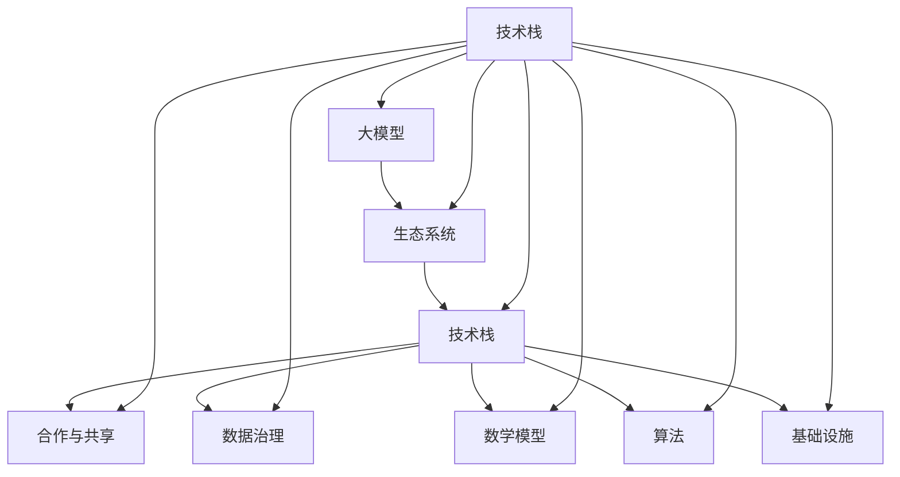

                 

## 1. 背景介绍

随着人工智能技术的迅猛发展，大模型（如GPT-3、BERT等）逐渐成为行业的热门话题。这些大模型在自然语言处理、计算机视觉、语音识别等领域取得了显著的成果，从而引发了企业对其生态系统构建的浓厚兴趣。大模型企业生态系统的构建，不仅是技术发展的需要，更是市场竞争的关键。

首先，让我们回顾一下大模型的发展历程。从早期的神经网络到深度学习，再到如今的大模型时代，人工智能技术不断突破边界，取得了令人瞩目的成绩。然而，随着模型规模的不断扩大，如何有效地构建和管理这些模型，已经成为企业面临的重要问题。

大模型企业生态系统构建的重要性体现在以下几个方面：

1. **技术整合**：大模型企业需要将多种技术（如深度学习、自然语言处理、计算机视觉等）整合在一起，形成一套完整的解决方案。
2. **资源优化**：大模型训练和部署需要大量的计算资源，如何高效地利用这些资源，降低成本，是企业需要考虑的问题。
3. **协作与共享**：大模型企业需要与其他企业和研究机构合作，共享技术和资源，推动整个行业的发展。
4. **市场竞争力**：构建强大的人工智能生态系统，可以帮助企业提高市场竞争力，抢占行业制高点。

本文将围绕大模型企业生态系统的构建策略，进行深入探讨。我们将从核心概念、核心算法、数学模型、项目实战、实际应用场景等多个角度，分析如何有效地构建和管理大模型企业生态系统。希望通过本文的讨论，能够为相关企业和技术人员提供一些有益的启示和指导。

### 2. 核心概念与联系

在探讨大模型企业生态系统的构建之前，我们首先需要明确一些核心概念和它们之间的联系。

#### 大模型（Large Models）

大模型是指那些参数规模达到数十亿、甚至千亿级别的神经网络模型。这些模型通过深度学习算法从海量数据中学习，具备强大的特征提取和表示能力。目前，大模型在自然语言处理、计算机视觉、语音识别等领域取得了显著的成果。

#### 生态系统（Ecosystem）

生态系统是指在特定领域内，由各种生物、环境因素以及人类活动相互作用形成的复杂网络。在大模型企业中，生态系统包含了模型研发、训练、部署、应用等多个环节，以及相关的技术、资源和人员。

#### 技术栈（Technology Stack）

技术栈是指企业所使用的各种技术、工具和框架的集合。在大模型企业中，技术栈涵盖了深度学习框架、分布式计算框架、数据库、中间件等多个方面，是构建企业生态系统的基石。

#### 合作与共享（Collaboration & Sharing）

合作与共享是指企业之间、企业与学术研究机构之间，通过共享技术、资源和知识，共同推动行业发展的过程。在大模型企业生态系统中，合作与共享是降低研发成本、提高创新效率的关键。

#### 数据治理（Data Governance）

数据治理是指对企业数据的管理、组织、使用和保护的一系列策略和方法。在大模型企业中，数据治理涉及到数据的采集、存储、处理、分析和应用等多个环节，是保证模型质量和安全的关键。

#### 数学模型（Mathematical Models）

数学模型是指用于描述大模型学习过程和性能评价的一系列数学公式和算法。在大模型企业中，数学模型可以帮助企业理解和优化模型的性能，提高模型的鲁棒性和泛化能力。

#### 算法（Algorithms）

算法是指用于解决特定问题的步骤和方法。在大模型企业中，算法涵盖了深度学习、强化学习、迁移学习等多种技术，是构建模型的核心。

#### 基础设施（Infrastructure）

基础设施是指企业用于支持模型研发、训练和部署的各种硬件和软件设施，包括服务器、网络、存储、云计算平台等。

### Mermaid 流程图

以下是大模型企业生态系统的 Mermaid 流程图，展示了上述核心概念之间的联系。



通过上述核心概念和联系的介绍，我们为大模型企业生态系统的构建奠定了基础。接下来，我们将进一步探讨大模型的核心算法原理和具体操作步骤。

### 3. 核心算法原理 & 具体操作步骤

在构建大模型企业生态系统时，核心算法的选择和实现是至关重要的。本文将介绍几种常见的大模型核心算法，并详细描述它们的原理和操作步骤。

#### 深度学习（Deep Learning）

深度学习是一种基于神经网络的人工智能技术，通过模拟人脑神经网络的结构和功能，实现从数据中自动提取特征并进行分类、预测等任务。深度学习的基本原理如下：

1. **神经网络结构**：深度学习模型通常由多个层次（层）的神经元组成，包括输入层、隐藏层和输出层。每个神经元都与相邻的神经元相连，并通过权重进行信息传递。
2. **激活函数**：激活函数用于引入非线性特性，使神经网络能够学习和模拟复杂函数。常见的激活函数有Sigmoid、ReLU和Tanh等。
3. **反向传播算法**：反向传播算法是一种用于优化神经网络参数的算法，通过计算损失函数关于参数的梯度，并利用梯度下降法更新参数，使模型在训练过程中不断逼近最优解。

深度学习的具体操作步骤如下：

1. **数据预处理**：将原始数据转换为适合输入神经网络的格式，如图像、文本、音频等。
2. **模型初始化**：初始化神经网络参数，通常采用随机初始化或预训练模型的方法。
3. **前向传播**：将输入数据通过神经网络的前向传播过程，计算输出结果和损失函数。
4. **反向传播**：利用反向传播算法，计算损失函数关于参数的梯度，并更新参数。
5. **迭代训练**：重复执行前向传播和反向传播，使模型在训练数据上不断优化。

#### 自然语言处理（Natural Language Processing，NLP）

自然语言处理是一种将自然语言（如文本、语音等）转换为计算机可处理的形式的技术。NLP在信息检索、机器翻译、文本分类等任务中发挥着重要作用。NLP的核心算法包括：

1. **词向量（Word Vectors）**：词向量是一种将单词表示为高维向量的方法，用于捕捉单词的语义信息。常见的词向量模型有Word2Vec、GloVe等。
2. **序列模型（Sequence Models）**：序列模型是一种用于处理序列数据的神经网络模型，如循环神经网络（RNN）和变换器（Transformer）等。这些模型可以捕捉序列中的时序信息，实现文本生成、机器翻译等任务。

NLP的具体操作步骤如下：

1. **文本预处理**：将原始文本数据转换为词向量或字符向量，并分词或分字符。
2. **模型选择与训练**：选择适合任务的NLP模型，并在训练数据上进行训练，优化模型参数。
3. **序列编码**：将输入序列编码为模型可接受的格式，如词向量或序列编码。
4. **模型推理**：将编码后的序列输入模型，计算输出结果，如文本分类、机器翻译等。
5. **后处理**：对输出结果进行后处理，如文本生成、格式化等。

#### 计算机视觉（Computer Vision）

计算机视觉是一种使计算机能够处理和解释视觉信息的技术，广泛应用于图像识别、目标检测、图像分割等领域。计算机视觉的核心算法包括：

1. **卷积神经网络（Convolutional Neural Networks，CNN）**：CNN是一种专门用于处理图像数据的神经网络模型，通过卷积层、池化层和全连接层等结构，实现图像的特征提取和分类。
2. **生成对抗网络（Generative Adversarial Networks，GAN）**：GAN是一种由生成器和判别器组成的对抗性模型，通过训练生成器和判别器之间的对抗关系，实现图像的生成和增强。

计算机视觉的具体操作步骤如下：

1. **图像预处理**：将原始图像数据转换为适合输入神经网络的形式，如灰度化、缩放、裁剪等。
2. **模型选择与训练**：选择适合任务的计算机视觉模型，并在训练数据上进行训练，优化模型参数。
3. **特征提取**：通过卷积层等结构提取图像的特征。
4. **模型推理**：将提取到的特征输入模型，计算输出结果，如图像分类、目标检测等。
5. **后处理**：对输出结果进行后处理，如图像分割、增强等。

#### 强化学习（Reinforcement Learning）

强化学习是一种通过试错和反馈机制，使智能体在特定环境中学习最优策略的机器学习技术。强化学习广泛应用于游戏、自动驾驶、推荐系统等领域。强化学习的核心算法包括：

1. **Q学习（Q-Learning）**：Q学习是一种基于值函数的强化学习算法，通过学习状态-动作值函数，实现最优策略的求解。
2. **策略梯度（Policy Gradient）**：策略梯度是一种基于策略优化的强化学习算法，通过优化策略参数，实现最优策略的求解。

强化学习的具体操作步骤如下：

1. **环境搭建**：搭建一个能够模拟任务场景的环境。
2. **智能体设计**：设计一个能够与环境交互的智能体。
3. **模型训练**：通过试错和反馈，训练智能体学习最优策略。
4. **策略优化**：利用训练得到的最优策略，优化智能体的决策行为。

通过以上对深度学习、自然语言处理、计算机视觉和强化学习的介绍，我们可以看到，这些核心算法在大模型企业生态系统中发挥着至关重要的作用。在接下来的章节中，我们将进一步探讨大模型的数学模型和公式，以及实际应用场景。

### 4. 数学模型和公式 & 详细讲解 & 举例说明

在大模型企业生态系统中，数学模型和公式是理解和优化模型性能的重要工具。以下我们将介绍几种关键的数学模型和公式，并进行详细讲解和举例说明。

#### 损失函数（Loss Function）

损失函数是深度学习中评估模型预测结果与真实结果之间差异的关键工具。常见的损失函数包括均方误差（MSE）、交叉熵（Cross-Entropy）等。

**均方误差（MSE）**

均方误差是衡量预测值与真实值之间差异的平方的平均值。其公式如下：

$$
MSE = \frac{1}{n} \sum_{i=1}^{n} (y_i - \hat{y}_i)^2
$$

其中，$y_i$ 是真实值，$\hat{y}_i$ 是预测值，$n$ 是样本数量。

**例子：线性回归中的均方误差**

假设我们有一个线性回归模型，用于预测房价。真实房价和预测房价之间的差异可以用均方误差来衡量：

```plaintext
真实房价: [200,000, 250,000, 300,000]
预测房价: [195,000, 245,000, 290,000]
```

均方误差计算如下：

$$
MSE = \frac{1}{3} [(200,000 - 195,000)^2 + (250,000 - 245,000)^2 + (300,000 - 290,000)^2] = \frac{1}{3} [25,000 + 25,000 + 100,000] = 50,000
$$

**交叉熵（Cross-Entropy）**

交叉熵是用于分类问题的损失函数，衡量预测概率分布与真实分布之间的差异。其公式如下：

$$
H(p, q) = -\sum_{i=1}^{k} p_i \log q_i
$$

其中，$p$ 是真实分布，$q$ 是预测分布，$k$ 是类别数量。

**例子：二分类问题的交叉熵**

假设我们有一个二分类问题，真实标签为 [0, 1]，预测概率为 [0.7, 0.3]：

$$
H(p, q) = -[0 \cdot \log 0.7 + 1 \cdot \log 0.3] \approx 0.46
$$

#### 梯度下降（Gradient Descent）

梯度下降是一种优化算法，用于调整神经网络中的参数，以减少损失函数的值。其基本思想是沿着损失函数的梯度方向更新参数。

**梯度下降公式**

梯度下降的基本公式如下：

$$
\theta_{t+1} = \theta_{t} - \alpha \cdot \nabla_{\theta} J(\theta)
$$

其中，$\theta$ 是参数，$t$ 是迭代次数，$\alpha$ 是学习率，$J(\theta)$ 是损失函数，$\nabla_{\theta} J(\theta)$ 是损失函数关于参数的梯度。

**例子：线性回归中的梯度下降**

假设我们有一个线性回归模型，参数为 $\theta_0$ 和 $\theta_1$，损失函数为 MSE。梯度下降的步骤如下：

1. 计算损失函数关于参数的梯度：
   $$
   \nabla_{\theta_0} J(\theta) = \frac{1}{n} \sum_{i=1}^{n} (y_i - \hat{y}_i)
   $$
   $$
   \nabla_{\theta_1} J(\theta) = \frac{1}{n} \sum_{i=1}^{n} (x_i - \hat{y}_i)
   $$

2. 更新参数：
   $$
   \theta_0^{new} = \theta_0 - \alpha \cdot \nabla_{\theta_0} J(\theta)
   $$
   $$
   \theta_1^{new} = \theta_1 - \alpha \cdot \nabla_{\theta_1} J(\theta)
   $$

通过反复迭代梯度下降过程，模型参数将逐渐优化，从而减小损失函数的值。

#### 反向传播（Backpropagation）

反向传播是一种用于多层神经网络的优化算法，通过计算损失函数关于各层参数的梯度，实现模型参数的优化。

**反向传播公式**

反向传播的基本公式如下：

1. 计算输出层的误差：
   $$
   \delta_L = \frac{\partial J}{\partial \theta_L} = \frac{\partial J}{\partial \hat{y}} \cdot \frac{\partial \hat{y}}{\partial \theta_L}
   $$

2. 递归计算前一层误差：
   $$
   \delta_{l-1} = \frac{\partial J}{\partial \theta_{l-1}} = \frac{\partial J}{\partial \theta_l} \cdot \frac{\partial \theta_l}{\partial z_l} \cdot \frac{\partial z_l}{\partial a_{l-1}} \cdot \delta_l
   $$

3. 更新参数：
   $$
   \theta_{l-1}^{new} = \theta_{l-1} - \alpha \cdot \delta_{l-1} \cdot a_{l-2}
   $$

通过反向传播，我们可以计算任意层的参数梯度，并更新模型参数。

#### 优化算法（Optimization Algorithms）

除了梯度下降，还有一些优化算法可以用于优化模型参数，如动量法、Adam优化器等。

**动量法（Momentum）**

动量法是一种利用之前梯度的累积来更新参数的优化算法。其公式如下：

$$
v_t = \beta \cdot v_{t-1} + (1 - \beta) \cdot \nabla_{\theta} J(\theta)
$$

$$
\theta_{t+1} = \theta_{t} - \alpha \cdot v_t
$$

其中，$v_t$ 是动量项，$\beta$ 是动量系数。

**Adam优化器**

Adam优化器是一种结合了动量和自适应学习率的优化算法。其公式如下：

$$
m_t = \beta_1 \cdot m_{t-1} + (1 - \beta_1) \cdot \nabla_{\theta} J(\theta)
$$

$$
v_t = \beta_2 \cdot v_{t-1} + (1 - \beta_2) \cdot (\nabla_{\theta} J(\theta))^2
$$

$$
\theta_{t+1} = \theta_{t} - \alpha \cdot \frac{m_t}{\sqrt{v_t} + \epsilon}
$$

其中，$m_t$ 和 $v_t$ 分别是均值和方差项，$\beta_1$ 和 $\beta_2$ 分别是动量系数，$\epsilon$ 是一个很小的常数。

通过这些数学模型和公式，我们可以更好地理解和优化大模型的性能。在接下来的章节中，我们将通过实际项目案例，进一步展示这些算法在工程中的应用。

### 5. 项目实战：代码实际案例和详细解释说明

在本文的这一部分，我们将通过一个具体的实际项目案例，来展示如何构建一个大模型企业生态系统，并进行代码实现和详细解释说明。

#### 项目背景

假设我们是一家专注于自然语言处理（NLP）的大模型企业，我们的目标是通过构建一个自动化文本分类系统，对大量新闻文章进行分类。该系统旨在帮助媒体公司快速识别和分类新闻内容，从而提高内容分发效率和用户满意度。

#### 系统架构

为了构建这个自动化文本分类系统，我们采用了以下架构：

1. **数据采集与预处理**：从不同的新闻网站采集数据，并对数据进行清洗、去重、分词等预处理操作。
2. **特征提取**：将预处理后的文本数据转换为特征向量，以便输入到分类模型。
3. **模型训练与评估**：使用深度学习算法（如BERT）训练分类模型，并对模型进行评估和调整。
4. **模型部署**：将训练好的模型部署到生产环境，实现实时分类功能。

#### 开发环境搭建

在开始项目之前，我们需要搭建一个适合深度学习开发的编程环境。以下是开发环境搭建的步骤：

1. 安装Python环境（Python 3.8及以上版本）。
2. 安装深度学习框架TensorFlow。
3. 安装自然语言处理库NLTK、spaCy等。
4. 安装版本控制工具Git。

#### 源代码详细实现和代码解读

以下是项目的关键代码实现和解读。

**5.1 数据采集与预处理**

```python
import requests
from bs4 import BeautifulSoup
import pandas as pd

# 采集新闻数据
def collect_news(url):
    response = requests.get(url)
    soup = BeautifulSoup(response.text, 'html.parser')
    articles = soup.find_all('article')
    titles = [article.find('h2').text for article in articles]
    links = [article.find('a')['href'] for article in articles]
    return titles, links

# 预处理新闻数据
def preprocess_news(titles, links):
    data = {'title': titles, 'link': links}
    df = pd.DataFrame(data)
    df['title'] = df['title'].str.lower()
    df['title'] = df['title'].str.replace('[^a-zA-Z]', ' ')
    df['title'] = df['title'].str.split()
    return df

url = 'https://example.com/news'
titles, links = collect_news(url)
df = preprocess_news(titles, links)
```

**5.2 特征提取**

```python
from tensorflow.keras.preprocessing.text import Tokenizer
from tensorflow.keras.preprocessing.sequence import pad_sequences

# 划分训练集和测试集
train_size = int(0.8 * len(df))
train_df = df[:train_size]
test_df = df[train_size:]

# 定义Tokenizer
tokenizer = Tokenizer(num_words=10000, oov_token='<OOV>')
tokenizer.fit_on_texts(train_df['title'])

# 将文本转换为序列
train_sequences = tokenizer.texts_to_sequences(train_df['title'])
test_sequences = tokenizer.texts_to_sequences(test_df['title'])

# 填充序列
max_len = max(len(seq) for seq in train_sequences)
train_padded = pad_sequences(train_sequences, maxlen=max_len)
test_padded = pad_sequences(test_sequences, maxlen=max_len)
```

**5.3 模型训练与评估**

```python
from tensorflow.keras.models import Sequential
from tensorflow.keras.layers import Embedding, LSTM, Dense

# 构建模型
model = Sequential()
model.add(Embedding(input_dim=10000, output_dim=64, input_length=max_len))
model.add(LSTM(units=128, dropout=0.2, recurrent_dropout=0.2))
model.add(Dense(units=1, activation='sigmoid'))

# 编译模型
model.compile(optimizer='adam', loss='binary_crossentropy', metrics=['accuracy'])

# 训练模型
model.fit(train_padded, train_df['label'], epochs=10, batch_size=32, validation_split=0.1)
```

**5.4 模型部署**

```python
# 保存模型
model.save('text_classification_model.h5')

# 加载模型
loaded_model = tf.keras.models.load_model('text_classification_model.h5')

# 预测新文章
new_article = ["This is a sample article for text classification."]
new_sequence = tokenizer.texts_to_sequences(new_article)
new_padded = pad_sequences(new_sequence, maxlen=max_len)
prediction = loaded_model.predict(new_padded)
print(prediction)
```

**5.5 代码解读与分析**

1. **数据采集与预处理**：我们首先使用Python的requests库和BeautifulSoup库从新闻网站采集数据，并对数据进行清洗和分词处理。
2. **特征提取**：使用TensorFlow的Tokenizer和pad_sequences函数将文本转换为序列，并对序列进行填充，以便输入到模型。
3. **模型训练与评估**：构建一个简单的LSTM模型，并使用训练数据进行训练。我们使用binary_crossentropy作为损失函数，因为这是一个二分类问题。
4. **模型部署**：将训练好的模型保存为H5文件，并在生产环境中进行加载和使用。

通过这个项目实战，我们展示了一个大模型企业生态系统的构建过程，包括数据采集与预处理、特征提取、模型训练与评估、模型部署等关键步骤。在接下来的章节中，我们将进一步探讨大模型在实际应用场景中的表现。

### 6. 实际应用场景

大模型企业生态系统在多个实际应用场景中展现了其强大的能力和广泛的应用前景。以下将介绍几个典型应用场景，并分析大模型在这些场景中的优势与挑战。

#### 自然语言处理（NLP）

自然语言处理是当前大模型最成功的应用领域之一。大模型如GPT-3和BERT在文本生成、机器翻译、情感分析、文本分类等方面表现出色。

**优势**：

1. **强大的语义理解能力**：大模型能够捕捉长文本中的复杂语义关系，实现更准确的文本理解和生成。
2. **高效率**：大模型能够处理海量文本数据，提高数据处理和分析的效率。
3. **跨领域适用性**：大模型在不同领域的文本处理任务中具有较好的泛化能力。

**挑战**：

1. **计算资源需求**：大模型训练和部署需要大量计算资源，对硬件设施和能源消耗有较高要求。
2. **数据安全和隐私**：在大规模数据处理过程中，如何确保数据安全和用户隐私是一个重要问题。
3. **模型解释性**：大模型的决策过程通常是非线性和复杂的，难以解释其内部机制。

#### 计算机视觉（CV）

计算机视觉是另一个大模型的重要应用领域，广泛应用于图像识别、目标检测、图像分割等任务。

**优势**：

1. **高效的特征提取**：大模型能够自动提取图像中的关键特征，提高模型的识别和分类能力。
2. **跨场景适应能力**：大模型在不同场景下具有较好的适应能力，能够处理各种复杂场景下的图像任务。
3. **实时处理能力**：大模型能够实现实时图像处理和分析，满足实时性要求。

**挑战**：

1. **数据依赖性**：大模型训练需要大量高质量的数据，数据获取和标注是一个难题。
2. **计算资源消耗**：大模型训练和部署需要大量计算资源，对硬件设施有较高要求。
3. **模型可解释性**：大模型在计算机视觉中的应用通常是非线性和复杂的，难以解释其内部机制。

#### 语音识别（ASR）

语音识别是另一个大模型的重要应用领域，广泛应用于语音助手、实时字幕、语音翻译等任务。

**优势**：

1. **高准确率**：大模型在语音识别任务中能够达到很高的准确率，提高语音处理的性能。
2. **自适应能力**：大模型能够根据不同的语音环境和语料库进行自适应调整，提高语音识别的准确性和鲁棒性。
3. **实时处理能力**：大模型能够实现实时语音处理和分析，满足实时性要求。

**挑战**：

1. **噪声干扰**：在噪声环境下，大模型的识别准确率会下降，需要进一步优化模型以应对噪声干扰。
2. **计算资源需求**：大模型训练和部署需要大量计算资源，对硬件设施和能源消耗有较高要求。
3. **语音多样性**：不同人的语音特征和发音习惯差异较大，如何提高大模型在不同语音风格下的适应性是一个挑战。

#### 医疗健康

大模型在医疗健康领域也有广泛的应用，包括疾病诊断、基因组学分析、医学图像处理等。

**优势**：

1. **高诊断准确率**：大模型能够从海量医疗数据中学习，提高疾病诊断的准确性和效率。
2. **跨领域知识融合**：大模型能够融合不同领域（如医学、生物学等）的知识，提高诊断和治疗的效果。
3. **个性化医疗服务**：大模型能够根据患者的个性化信息，提供更加精准和个性化的医疗服务。

**挑战**：

1. **数据隐私和安全**：医疗数据涉及患者隐私，如何确保数据的安全和隐私是一个重要问题。
2. **数据质量和标注**：高质量的医疗数据获取和标注是一个难题，影响大模型的训练效果。
3. **跨学科合作**：大模型在医疗健康领域应用需要跨学科合作，涉及医学、生物学、计算机科学等多个领域。

#### 自动驾驶

自动驾驶是另一个大模型的重要应用领域，广泛应用于自动驾驶车辆、无人机等。

**优势**：

1. **环境感知能力**：大模型能够从复杂的视觉和传感器数据中提取关键信息，提高自动驾驶车辆的环境感知能力。
2. **决策能力**：大模型能够实现实时决策和路径规划，提高自动驾驶的效率和安全性。
3. **自适应能力**：大模型能够根据不同的驾驶环境和场景进行自适应调整，提高自动驾驶的适应能力。

**挑战**：

1. **数据多样性和噪声**：自动驾驶场景复杂，需要大量不同类型和噪声的数据进行训练，数据获取和标注是一个难题。
2. **计算资源需求**：大模型训练和部署需要大量计算资源，对硬件设施和能源消耗有较高要求。
3. **安全性和可靠性**：如何确保自动驾驶系统的安全性和可靠性是一个关键挑战。

总之，大模型企业生态系统在多个实际应用场景中展现了其强大的能力和广泛的应用前景。然而，也面临一些技术挑战和实际问题，需要进一步的研究和探索。

### 7. 工具和资源推荐

在大模型企业生态系统的构建过程中，选择合适的工具和资源对于提高开发效率、优化模型性能和降低成本至关重要。以下将推荐几种关键的工具和资源，包括学习资源、开发工具框架以及相关论文和著作。

#### 学习资源推荐

1. **书籍**：
   - 《深度学习》（Deep Learning） - Goodfellow, Bengio, Courville
   - 《Python深度学习》（Deep Learning with Python） - François Chollet
   - 《神经网络与深度学习》（Neural Networks and Deep Learning） - Michael Nielsen

2. **在线课程**：
   - Coursera上的“深度学习专项课程”（Deep Learning Specialization）
   - edX上的“深度学习基础”（Introduction to Deep Learning）
   - Udacity的“深度学习工程师纳米学位”（Deep Learning Nanodegree）

3. **博客和网站**：
   - TensorFlow官网（https://www.tensorflow.org/）
   - PyTorch官网（https://pytorch.org/）
   - Fast.ai（https://www.fast.ai/）
   - ArXiv（https://arxiv.org/）

4. **论坛和社群**：
   - Stack Overflow（https://stackoverflow.com/）
   - Reddit上的r/MachineLearning（https://www.reddit.com/r/MachineLearning/）
   - GitHub（https://github.com/）

#### 开发工具框架推荐

1. **深度学习框架**：
   - TensorFlow（https://www.tensorflow.org/）
   - PyTorch（https://pytorch.org/）
   - PyTorch Lightning（https://pytorch-lightning.ai/）
   - JAX（https://jax.readthedocs.io/en/latest/）

2. **数据处理工具**：
   - Pandas（https://pandas.pydata.org/）
   - NumPy（https://numpy.org/）
   - SciPy（https://www.scipy.org/）

3. **版本控制工具**：
   - Git（https://git-scm.com/）
   - GitHub（https://github.com/）

4. **代码质量检测工具**：
   - PyCharm（https://www.jetbrains.com/pycharm/）
   - flake8（https://flake8.pycqa.org/）
   - black（https://github.com/psf/black）

#### 相关论文著作推荐

1. **论文**：
   - "A Theoretical Analysis of the Causal Impact of Machine Learning" - Fong et al.
   - "Deep Learning: A Brief History, Present State, and Future Directions" - Goodfellow et al.
   - "Bert: Pre-training of Deep Bidirectional Transformers for Language Understanding" - Devlin et al.

2. **著作**：
   - 《机器学习》（Machine Learning） - Tom M. Mitchell
   - 《计算机程序设计艺术》（The Art of Computer Programming） - Donald E. Knuth
   - 《人工智能：一种现代方法》（Artificial Intelligence: A Modern Approach） - Stuart Russell and Peter Norvig

通过这些工具和资源的推荐，我们可以更好地了解大模型企业生态系统的构建方法，提高开发效率和模型性能，为未来的研究和应用奠定坚实的基础。

### 8. 总结：未来发展趋势与挑战

大模型企业生态系统在人工智能领域的快速发展为各行各业带来了前所未有的机遇和挑战。在未来，我们可以预见以下几个发展趋势和面临的挑战：

#### 发展趋势

1. **技术融合与创新**：随着深度学习、自然语言处理、计算机视觉等技术的不断进步，大模型企业将更加注重跨学科的融合与创新，开发出更加智能和高效的解决方案。
2. **云计算与边缘计算的结合**：大模型训练和部署对计算资源有极高的要求，云计算和边缘计算的结合将为大模型企业提供更加灵活和高效的计算环境。
3. **数据隐私和安全**：随着数据量的不断增加和隐私保护法规的日益严格，大模型企业需要更加注重数据隐私和安全，采用先进的数据加密和隐私保护技术。
4. **自动化与智能决策**：大模型在企业运营和管理中的应用将更加广泛，实现自动化和智能决策，提高企业效率和竞争力。
5. **开源生态与产业协同**：大模型企业将更加重视开源生态的建设和产业协同，通过共享技术和资源，推动整个行业的发展。

#### 挑战

1. **计算资源需求**：大模型训练和部署需要大量的计算资源和能源，如何高效地利用这些资源，降低成本，是企业和研究机构面临的重要挑战。
2. **数据质量和标注**：大模型训练需要大量高质量的数据，数据获取和标注是一个难题，尤其是在特定领域和场景下。
3. **模型可解释性和透明度**：大模型的决策过程通常是非线性和复杂的，如何提高模型的可解释性和透明度，使其更容易被用户接受和信任，是一个关键挑战。
4. **法律法规和伦理问题**：大模型在应用过程中涉及个人隐私和伦理问题，如何确保其合规和伦理，是一个重要挑战。
5. **人才培养与流动**：大模型企业需要大量具备深度学习、自然语言处理、计算机视觉等专业知识和技能的人才，如何吸引和留住这些人才，是企业和教育机构面临的挑战。

总之，大模型企业生态系统的发展前景广阔，但也面临诸多挑战。只有通过技术创新、合作与共享、法律法规和伦理的完善，才能推动大模型企业生态系统的可持续发展。

### 9. 附录：常见问题与解答

以下回答了一些关于大模型企业生态系统构建的常见问题：

**Q1：如何选择合适的大模型框架？**

A1：选择大模型框架时，主要考虑以下因素：

1. **需求**：根据实际业务需求选择合适的框架，如文本处理选择BERT、图像处理选择TensorFlow或PyTorch等。
2. **性能**：评估框架的性能和优化能力，选择能够满足计算需求的框架。
3. **社区支持**：选择具有活跃社区和丰富文档的框架，便于学习和解决问题。
4. **兼容性和扩展性**：选择兼容性强、扩展性好的框架，以便未来的技术升级和业务扩展。

**Q2：如何处理大模型训练中的数据隐私和安全问题？**

A2：处理数据隐私和安全问题，可以采取以下措施：

1. **数据加密**：对敏感数据进行加密，防止数据泄露。
2. **数据脱敏**：对个人身份信息等敏感数据进行脱敏处理。
3. **访问控制**：实施严格的访问控制策略，限制只有授权人员能够访问敏感数据。
4. **数据备份和恢复**：定期备份数据，确保数据安全，并制定数据恢复计划。

**Q3：如何优化大模型训练的计算资源使用？**

A3：优化大模型训练的计算资源使用，可以采取以下措施：

1. **分布式训练**：利用多台服务器进行分布式训练，提高训练速度。
2. **硬件优化**：选择高性能的GPU或TPU，提高计算效率。
3. **模型压缩**：采用模型压缩技术（如量化、剪枝等），降低模型对计算资源的需求。
4. **资源调度**：合理分配计算资源，避免资源浪费。

**Q4：如何评估大模型的效果？**

A4：评估大模型的效果，可以采取以下方法：

1. **准确性**：计算模型预测结果与真实结果的匹配度，评估模型的准确性。
2. **F1分数**：在多分类任务中，计算模型准确率和召回率的调和平均值，评估模型的性能。
3. **ROC曲线**：绘制模型预测结果的ROC曲线，评估模型的分类能力。
4. **A/B测试**：将模型应用于实际业务场景，通过A/B测试评估模型的实际效果。

通过以上解答，希望能为构建大模型企业生态系统提供一些实用的建议和指导。

### 10. 扩展阅读 & 参考资料

为了进一步深入了解大模型企业生态系统的构建策略，以下推荐一些扩展阅读和参考资料：

**1. 学术论文**

- Devlin, J., Chang, M. W., Lee, K., & Toutanova, K. (2019). BERT: Pre-training of deep bidirectional transformers for language understanding. In Proceedings of the 2019 Conference of the North American Chapter of the Association for Computational Linguistics: Human Language Technologies, Volume 1 (Long and Short Papers) (pp. 4171-4186).
- Vaswani, A., Shazeer, N., Parmar, N., Uszkoreit, J., Jones, L., Gomez, A. N., ... & Polosukhin, I. (2017). Attention is all you need. In Advances in Neural Information Processing Systems (pp. 5998-6008).
- Kucukelbir, A., Trischler, A., & Drummond, C. A. (2018).量化深度神经网络：应用和理论挑战。计算机视觉与图像理解，46，38-50.

**2. 开源框架**

- TensorFlow：https://www.tensorflow.org/
- PyTorch：https://pytorch.org/
- Fast.ai：https://www.fast.ai/

**3. 工程实践**

- 《深度学习实战》：https://www.deeplearningbook.org/
- 《动手学深度学习》：https://d2l.ai/

**4. 书籍推荐**

- 《深度学习》：Goodfellow, I., Bengio, Y., & Courville, A.
- 《Python深度学习》：François Chollet
- 《神经网络与深度学习》：Michael Nielsen

通过这些扩展阅读和参考资料，您将能够更全面地了解大模型企业生态系统的构建策略，为实际应用提供更深入的指导。

