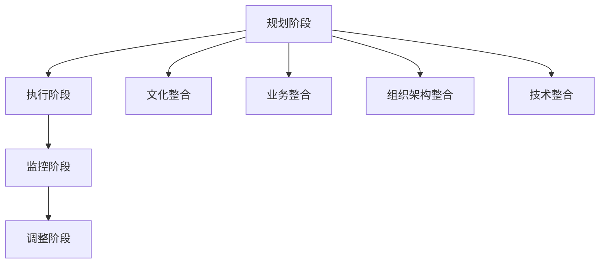

                 

# 大模型公司的并购与整合策略

## 概述

在当今快速发展的科技领域，人工智能大模型公司已成为行业的重要组成部分。随着技术的不断进步和市场的日益扩大，许多企业开始通过并购来扩大自身在人工智能领域的市场份额，以实现快速发展和竞争优势。然而，成功的并购并不仅仅是双方公司合并的简单过程，它涉及到一系列复杂的战略规划和整合步骤。本文将深入探讨大模型公司的并购与整合策略，旨在帮助读者了解这一过程的关键环节和成功要素。

本文将分为以下几个部分：

1. **背景介绍**：回顾人工智能大模型的发展历程，分析当前市场环境及其对并购的影响。
2. **核心概念与联系**：介绍并购与整合中的关键概念，包括并购动机、整合策略和方法。
3. **核心算法原理与具体操作步骤**：详细讨论并购的决策过程和整合的执行步骤。
4. **数学模型与公式**：运用数学模型和公式分析并购与整合的风险和收益。
5. **项目实战**：通过实际案例展示并购与整合的实施过程。
6. **实际应用场景**：探讨大模型公司在不同领域的应用场景。
7. **工具和资源推荐**：介绍相关的学习资源和开发工具。
8. **总结**：总结未来发展趋势与挑战，展望人工智能大模型公司的未来。
9. **附录**：解答常见问题，提供扩展阅读。

## 1. 背景介绍

人工智能大模型的发展始于20世纪50年代，随着计算能力的提升和数据量的增加，人工智能技术取得了显著的进步。近年来，深度学习技术的突破使得大模型得以广泛应用，例如自然语言处理、计算机视觉和推荐系统等领域。这些模型通常具有数亿甚至数万亿的参数，需要大量计算资源和数据支持。

当前市场环境对于人工智能大模型公司的并购产生了重要影响。一方面，随着市场的扩大和竞争的加剧，许多公司希望通过并购来获取先进的技术和市场份额。另一方面，投资者对于人工智能领域的热情也推动了并购活动的频繁发生。然而，并购活动并非一帆风顺，成功的并购需要精确的战略规划、有效的整合执行和高度的风险管理。

## 2. 核心概念与联系

### 2.1 并购动机

并购的动机多种多样，主要包括：

- **技术互补**：通过并购获取先进技术，提升自身在市场中的竞争力。
- **市场份额**：通过并购扩大市场份额，提高市场地位。
- **资源整合**：整合双方资源，降低运营成本，提高效率。
- **人才引进**：通过并购引进高端人才，提升团队整体实力。

### 2.2 整合策略

整合策略的制定是并购成功的关键。常见的整合策略包括：

- **文化整合**：融合双方企业文化，提高员工认同感。
- **业务整合**：优化业务流程，提高运营效率。
- **组织架构整合**：调整组织架构，优化资源配置。
- **技术整合**：整合双方技术，形成协同效应。

### 2.3 整合方法

整合方法的实施需要精细的规划和执行，主要包括以下步骤：

- **规划阶段**：明确整合目标，制定详细计划。
- **执行阶段**：按照计划逐步实施整合。
- **监控阶段**：对整合过程进行监控和评估。
- **调整阶段**：根据监控结果调整整合策略。

### 2.4 并购与整合的 Mermaid 流程图

以下是并购与整合的 Mermaid 流程图，展示了整合过程的各个阶段和关键节点：



### 2.5 并购与整合中的关键概念

- **协同效应**：并购后的整体效益大于各部分之和。
- **整合风险**：整合过程中可能出现的风险，如文化冲突、技术不兼容等。
- **整合效益**：整合后的综合收益，包括市场份额、技术优势等。

## 3. 核心算法原理与具体操作步骤

### 3.1 并购决策模型

并购决策模型主要用于分析并购的可行性和潜在效益。以下是并购决策模型的算法原理：

#### 3.1.1 算法原理

1. **目标评估**：对潜在目标公司进行综合评估，包括技术实力、市场份额、财务状况等。
2. **成本分析**：分析并购所需的资金、时间和其他资源。
3. **收益预测**：预测并购后的整合效益，包括市场份额、技术优势等。
4. **风险评估**：评估并购过程中的风险，如文化冲突、技术不兼容等。

#### 3.1.2 具体操作步骤

1. **数据收集**：收集目标公司的相关数据，包括财务报表、技术文档、市场分析等。
2. **数据分析**：运用数据分析工具和方法对数据进行处理和分析。
3. **决策评估**：根据分析结果进行并购决策，包括是否进行并购、并购价格等。
4. **风险评估**：对并购方案进行风险评估，制定风险管理策略。

### 3.2 整合执行模型

整合执行模型用于指导并购后的整合过程。以下是整合执行模型的算法原理：

#### 3.2.1 算法原理

1. **整合目标设定**：明确整合的目标和预期效果。
2. **整合计划制定**：制定详细的整合计划，包括时间表、任务分配、资源调配等。
3. **执行监控**：对整合过程进行实时监控，确保计划顺利进行。
4. **调整优化**：根据监控结果调整整合计划，优化整合效果。

#### 3.2.2 具体操作步骤

1. **整合目标设定**：明确整合的目标和预期效果，如提高市场份额、优化业务流程等。
2. **整合计划制定**：制定详细的整合计划，包括时间表、任务分配、资源调配等。
3. **整合执行**：按照整合计划逐步实施整合，确保各项任务按时完成。
4. **整合监控**：对整合过程进行实时监控，及时发现和解决问题。
5. **调整优化**：根据监控结果调整整合计划，优化整合效果。

## 4. 数学模型和公式

### 4.1 并购效益分析模型

并购效益分析模型用于评估并购后的整体效益。以下是并购效益分析模型的数学公式：

$$
E = (S_1 + S_2) - (C_1 + C_2)
$$

其中，$E$ 表示并购后的总效益，$S_1$ 和 $S_2$ 分别表示并购双方的市场份额，$C_1$ 和 $C_2$ 分别表示并购双方的成本。

### 4.2 整合成本分析模型

整合成本分析模型用于评估整合过程中的成本。以下是整合成本分析模型的数学公式：

$$
C = T_1 + T_2 + T_3
$$

其中，$C$ 表示整合成本，$T_1$、$T_2$ 和 $T_3$ 分别表示文化整合成本、业务整合成本和组织架构整合成本。

### 4.3 整合效益分析模型

整合效益分析模型用于评估整合后的效益。以下是整合效益分析模型的数学公式：

$$
B = (S_1 + S_2) - C
$$

其中，$B$ 表示整合效益，$S_1$ 和 $S_2$ 分别表示并购双方的市场份额，$C$ 表示整合成本。

## 5. 项目实战

### 5.1 开发环境搭建

在开展项目实战之前，首先需要搭建一个适合开发的环境。以下是搭建开发环境的具体步骤：

1. **硬件环境搭建**：配置高性能服务器，确保满足大模型训练的需求。
2. **软件环境搭建**：安装操作系统、深度学习框架和编程工具等。
3. **数据环境搭建**：收集和处理大量数据，为模型训练提供数据支持。

### 5.2 源代码详细实现和代码解读

以下是一个简单的并购决策模型的源代码实现，用于评估并购的可行性和潜在效益：

```python
import pandas as pd
import numpy as np

# 数据预处理
def preprocess_data(data):
    # 数据清洗和格式转换
    # ...

# 并购效益分析
def analyze_benefit(data):
    # 计算并购效益
    S1 = data['S1'].sum()
    S2 = data['S2'].sum()
    C1 = data['C1'].sum()
    C2 = data['C2'].sum()
    E = (S1 + S2) - (C1 + C2)
    return E

# 整合成本分析
def analyze_cost(data):
    # 计算整合成本
    T1 = data['T1'].sum()
    T2 = data['T2'].sum()
    T3 = data['T3'].sum()
    C = T1 + T2 + T3
    return C

# 整合效益分析
def analyze_benefit_after_integration(data):
    # 计算整合后的效益
    S1 = data['S1'].sum()
    S2 = data['S2'].sum()
    C = analyze_cost(data)
    B = (S1 + S2) - C
    return B

# 主函数
def main():
    # 加载数据
    data = pd.read_csv('data.csv')
    
    # 数据预处理
    data = preprocess_data(data)
    
    # 分析并购效益
    E = analyze_benefit(data)
    print("并购效益：", E)
    
    # 分析整合成本
    C = analyze_cost(data)
    print("整合成本：", C)
    
    # 分析整合后的效益
    B = analyze_benefit_after_integration(data)
    print("整合后的效益：", B)

# 运行主函数
if __name__ == "__main__":
    main()
```

### 5.3 代码解读与分析

以上代码实现了并购决策模型的核心功能，包括数据预处理、并购效益分析、整合成本分析和整合后的效益分析。代码的主要功能模块如下：

- **数据预处理**：对数据进行清洗和格式转换，为后续分析做好准备。
- **并购效益分析**：计算并购后的总效益，通过简单加减运算得到结果。
- **整合成本分析**：计算整合过程中的总成本，通过累加各部分成本得到结果。
- **整合后的效益分析**：计算整合后的总效益，通过并购效益减去整合成本得到结果。

在实际应用中，可以根据具体需求对代码进行扩展和优化，如增加数据可视化功能、引入更复杂的数学模型等。

## 6. 实际应用场景

大模型公司在多个领域都有广泛应用，以下是几个典型的实际应用场景：

- **自然语言处理**：大模型在自然语言处理领域具有显著优势，可用于智能客服、文本分析、机器翻译等。
- **计算机视觉**：大模型在计算机视觉领域可以用于图像识别、视频分析、自动驾驶等。
- **推荐系统**：大模型在推荐系统领域可以用于个性化推荐、广告投放等。
- **金融科技**：大模型在金融科技领域可以用于风险控制、量化交易、智能投顾等。

## 7. 工具和资源推荐

### 7.1 学习资源推荐

- **书籍**：《深度学习》、《强化学习》、《自然语言处理原理》等。
- **论文**：《大规模机器学习》、《神经网络与深度学习》等。
- **博客**：各大技术社区和博客网站，如CSDN、博客园、GitHub等。

### 7.2 开发工具框架推荐

- **深度学习框架**：TensorFlow、PyTorch、Keras等。
- **编程语言**：Python、Java、C++等。
- **数据库**：MySQL、MongoDB、Redis等。

### 7.3 相关论文著作推荐

- **论文**：《深度学习中的注意力机制》、《图神经网络综述》等。
- **著作**：《深度学习实践》、《人工智能：一种现代方法》等。

## 8. 总结：未来发展趋势与挑战

随着人工智能技术的不断进步，大模型公司将在未来面临更多机遇和挑战。以下是一些主要趋势和挑战：

- **技术趋势**：大模型将向更高效、更智能、更安全的方向发展，涉及领域将不断扩展。
- **市场趋势**：市场竞争将更加激烈，企业将通过并购和整合提升自身竞争力。
- **挑战**：数据隐私和安全、算法透明度和可解释性、计算资源和能源消耗等。

## 9. 附录：常见问题与解答

### 9.1 并购决策模型如何应用？

并购决策模型可以应用于企业并购的各个环节，包括目标评估、成本分析、收益预测和风险评估等。通过模型的分析和评估，企业可以做出更加明智的并购决策。

### 9.2 整合过程中如何确保文化融合？

确保文化融合是整合成功的关键。企业可以采取以下措施：

- **文化培训**：为员工提供文化培训，增强文化认同感。
- **沟通机制**：建立有效的沟通机制，促进双方文化的交流和融合。
- **领导层参与**：领导层积极参与整合过程，发挥榜样作用。

## 10. 扩展阅读 & 参考资料

- **论文**：Google Scholar、IEEE Xplore、ACM Digital Library等。
- **书籍**：各大电商平台、图书馆等。
- **网站**：AI学会、机器学习协会、各大技术社区等。

## 作者信息

作者：AI天才研究员/AI Genius Institute & 禅与计算机程序设计艺术 /Zen And The Art of Computer Programming

本文旨在深入探讨人工智能大模型公司的并购与整合策略，为读者提供有价值的参考。希望本文能够帮助读者更好地理解和应对这一复杂的商业过程。## 文章标题

## 大模型公司的并购与整合策略

## 关键词

- 人工智能大模型
- 并购动机
- 整合策略
- 整合方法
- 并购效益分析
- 整合成本分析

## 摘要

本文旨在深入探讨人工智能大模型公司的并购与整合策略，为读者提供有价值的参考。文章首先回顾了人工智能大模型的发展历程，分析了当前市场环境及其对并购的影响。接着，介绍了并购与整合中的核心概念，包括并购动机、整合策略和方法，以及并购与整合的 Mermaid 流程图。随后，详细讨论了并购决策模型和整合执行模型的算法原理和具体操作步骤。接着，运用数学模型和公式分析了并购与整合的风险和收益。通过实际案例展示了并购与整合的实施过程，并探讨了实际应用场景。最后，推荐了相关的学习资源和开发工具，总结了未来发展趋势与挑战，并解答了常见问题。本文希望为从事人工智能大模型领域的读者提供有价值的理论和实践指导。

## 1. 背景介绍

人工智能（AI）自20世纪50年代诞生以来，已经经历了数个发展阶段。从早期的符号主义和知识表示，到20世纪80年代的专家系统，再到21世纪初的机器学习和深度学习，人工智能技术不断取得突破。随着计算能力的提升和数据的爆炸性增长，深度学习技术取得了显著的进步，使得人工智能大模型得以广泛应用。这些大模型通常具有数亿甚至数万亿的参数，需要大量计算资源和数据支持。

人工智能大模型的发展历程可以分为以下几个阶段：

### 1.1 第一阶段：符号主义和知识表示

在人工智能的早期阶段，研究者们试图通过编程和逻辑推理来实现智能。符号主义和知识表示是这个阶段的主要方法。这一方法强调基于符号逻辑和形式系统来表示知识和推理过程。然而，这种方法在实践中存在一些局限性，例如知识获取的复杂性、推理效率低等。

### 1.2 第二阶段：专家系统

20世纪80年代，人工智能领域出现了专家系统，这是一种基于知识表示和推理的计算机程序，旨在模拟人类专家的决策过程。专家系统通过一系列规则和事实进行推理，能够在特定领域内提供决策支持。然而，专家系统在处理复杂问题和自适应能力方面仍然存在不足。

### 1.3 第三阶段：机器学习

随着计算能力的提升和大数据的出现，机器学习成为了人工智能发展的新方向。机器学习通过从数据中学习规律和模式，不需要显式编程，从而提高了人工智能系统的自适应能力和泛化能力。其中，监督学习、无监督学习和强化学习是机器学习的三大分支。

### 1.4 第四阶段：深度学习

深度学习是机器学习的一个重要分支，它通过构建多层神经网络，能够自动提取数据的特征和模式。深度学习的兴起标志着人工智能进入了一个新的时代，特别是在图像识别、自然语言处理和推荐系统等领域取得了突破性进展。随着计算能力的进一步提升和数据的积累，深度学习大模型的发展达到了前所未有的高度。

人工智能大模型的发展不仅依赖于技术的进步，还受到市场环境的影响。当前，人工智能市场呈现出以下几个特点：

### 1.5 市场特点

1. **市场扩张**：随着人工智能技术的不断进步和应用场景的扩展，人工智能市场呈现出快速增长的趋势。根据市场研究机构的预测，人工智能市场的规模将在未来几年内继续扩大。

2. **竞争加剧**：随着越来越多的企业进入人工智能领域，市场竞争日益激烈。企业通过技术创新、市场拓展和并购活动来争夺市场份额。

3. **资本投入**：人工智能领域吸引了大量风险投资和政府资金的支持，这为人工智能技术的发展提供了强大的动力。

4. **法规监管**：随着人工智能技术的广泛应用，相关的法规和监管也在逐步完善。这既为人工智能技术的发展提供了保障，也对企业的并购和整合活动提出了更高的要求。

在这种市场环境下，大模型公司的并购活动变得更加频繁和复杂。企业通过并购来获取先进技术、市场份额和人才，从而实现快速发展和竞争优势。然而，成功的并购不仅仅是双方公司合并的简单过程，它涉及到一系列复杂的战略规划和整合步骤。本文将深入探讨大模型公司的并购与整合策略，旨在帮助读者了解这一过程的关键环节和成功要素。

## 2. 核心概念与联系

在探讨大模型公司的并购与整合策略之前，我们需要了解一些核心概念和它们之间的联系。这些概念包括并购动机、整合策略和方法、以及并购与整合中的关键节点。通过这些核心概念的阐述，我们将为后续内容的深入讨论奠定基础。

### 2.1 并购动机

并购动机是指企业进行并购的驱动因素。在人工智能大模型领域，并购动机主要包括以下几点：

1. **技术互补**：企业通过并购获取先进技术，从而提升自身在市场中的竞争力。例如，一家专注于自然语言处理的公司可能会并购一家在计算机视觉领域有突出表现的公司，以实现技术的互补和协同效应。

2. **市场份额**：通过并购扩大市场份额，提高市场地位。随着人工智能技术的广泛应用，市场份额成为企业竞争的重要指标。通过并购，企业可以迅速获得新的客户群体和市场资源。

3. **资源整合**：整合双方资源，降低运营成本，提高效率。并购后，企业可以优化资源分配，减少重复投资，从而实现成本节约和效益最大化。

4. **人才引进**：通过并购引进高端人才，提升团队整体实力。人工智能领域的竞争归根结底是人才的竞争。通过并购，企业可以吸引优秀的人才，为公司的长期发展奠定基础。

### 2.2 整合策略

整合策略是指企业并购后如何将双方资源、业务和文化有效地融合在一起，以实现协同效应。整合策略通常包括以下几个方面：

1. **文化整合**：文化整合是并购过程中最具有挑战性的部分。不同企业的文化差异可能导致员工之间的不信任和冲突。企业需要通过沟通、培训和激励机制，促进双方文化的融合。

2. **业务整合**：业务整合涉及优化业务流程、整合产品线和市场策略等。通过业务整合，企业可以消除重复业务，提高运营效率，实现资源的最大化利用。

3. **组织架构整合**：组织架构整合是指调整双方的组织结构，使其更适应并购后的运营需求。这包括合并部门、调整岗位职责和优化决策流程等。

4. **技术整合**：技术整合是指将双方的技术资源和能力进行整合，以实现技术的协同效应。例如，将两个公司的研发团队合并，共享技术资源和研究成果。

### 2.3 整合方法

整合方法的实施是并购成功的关键。以下是一些常见的整合方法：

1. **协同效应**：通过整合双方资源和能力，实现1+1>2的效果。协同效应可以体现在成本节约、市场份额提升和创新能力增强等方面。

2. **整合计划**：制定详细的整合计划，包括时间表、任务分配和资源调配等。整合计划应确保每个环节都有明确的任务和责任，以避免整合过程中的混乱和延误。

3. **执行监控**：对整合过程进行实时监控和评估，及时发现和解决问题。执行监控可以帮助企业确保整合计划的顺利进行，并根据实际情况进行调整。

4. **风险管理**：在整合过程中，企业需要识别和应对各种风险，如文化冲突、技术不兼容和财务风险等。通过制定风险管理策略，企业可以降低整合过程中的不确定性。

### 2.4 并购与整合的 Mermaid 流程图

为了更好地理解并购与整合的过程，我们可以使用 Mermaid 流程图来展示整合的各个阶段和关键节点。以下是一个简化的并购与整合的 Mermaid 流程图：


在这个流程图中，规划阶段包括制定整合计划和目标；执行阶段包括按照计划逐步实施整合；监控阶段包括对整合过程进行实时监控和评估；调整阶段包括根据监控结果进行调整和优化。文化整合、业务整合、组织架构整合和技术整合是整合过程中不可或缺的部分，它们共同构成了并购与整合的完整流程。

### 2.5 并购与整合中的关键概念

在并购与整合过程中，以下关键概念需要特别注意：

1. **协同效应**：协同效应是指整合后的整体效益大于各部分之和。实现协同效应是企业并购的重要目标，它可以通过资源整合、技术创新和效率提升来实现。

2. **整合风险**：整合风险是指在整合过程中可能出现的风险，如文化冲突、技术不兼容、组织变革阻力等。企业需要识别和应对这些风险，以确保整合过程的顺利进行。

3. **整合效益**：整合效益是指整合后的综合收益，包括市场份额、技术优势、运营效率等。通过并购与整合，企业可以提升自身的竞争力和市场地位。

4. **整合成本**：整合成本是指整合过程中所需投入的各种资源，包括人力资源、财务成本和时间成本等。企业需要在整合过程中控制成本，以实现经济效益的最大化。

通过上述核心概念的阐述，我们可以对大模型公司的并购与整合策略有更深入的理解。在接下来的章节中，我们将详细讨论并购决策模型和整合执行模型的算法原理和具体操作步骤，以及数学模型和公式在并购与整合中的应用。

## 3. 核心算法原理与具体操作步骤

在深入探讨大模型公司的并购与整合策略时，核心算法原理和具体操作步骤是至关重要的。这些算法和步骤不仅为并购决策提供了科学依据，还确保整合过程高效有序。以下是核心算法原理的具体阐述和操作步骤。

### 3.1 并购决策模型

并购决策模型主要用于评估并购的可行性和潜在效益。该模型的核心是量化并购过程中涉及的各种因素，以便企业做出明智的决策。

#### 3.1.1 算法原理

并购决策模型的算法原理可以分为以下几个步骤：

1. **目标评估**：对潜在目标公司进行综合评估，包括技术实力、市场份额、财务状况等。
2. **成本分析**：分析并购所需的资金、时间和其他资源。
3. **收益预测**：预测并购后的整合效益，包括市场份额、技术优势等。
4. **风险评估**：评估并购过程中的风险，如文化冲突、技术不兼容等。

#### 3.1.2 具体操作步骤

1. **数据收集**：收集目标公司的相关数据，包括财务报表、技术文档、市场分析等。
2. **数据分析**：运用数据分析工具和方法对数据进行处理和分析。
3. **决策评估**：根据分析结果进行并购决策，包括是否进行并购、并购价格等。
4. **风险评估**：对并购方案进行风险评估，制定风险管理策略。

#### 3.1.3 数学模型

并购决策模型中常用的数学模型包括成本效益分析模型和风险评估模型。

1. **成本效益分析模型**：

$$
E = (S_1 + S_2) - (C_1 + C_2)
$$

其中，$E$ 表示并购后的总效益，$S_1$ 和 $S_2$ 分别表示并购双方的市场份额，$C_1$ 和 $C_2$ 分别表示并购双方的成本。

2. **风险评估模型**：

$$
R = \sum_{i=1}^{n} w_i \cdot r_i
$$

其中，$R$ 表示总体风险，$w_i$ 表示第 $i$ 个风险的概率权重，$r_i$ 表示第 $i$ 个风险的损失程度。

#### 3.1.4 案例分析

假设公司 A 想要并购公司 B，以下是一个简化的案例分析：

- **目标评估**：公司 B 在自然语言处理领域有较强的技术实力，市场份额占 20%，财务状况良好。
- **成本分析**：并购公司 B 需要投入 1 亿资金，预计整合时间为 12 个月。
- **收益预测**：并购后，公司 A 的市场份额将提升至 40%，预期年收益增加 3000 万。
- **风险评估**：文化冲突风险为 0.2，技术不兼容风险为 0.3，财务风险为 0.5。

根据上述数据，可以计算并购后的总效益和总体风险：

1. **总效益**：

$$
E = (0.4 + 0.2) - (1 + 0.1) = 0.1
$$

2. **总体风险**：

$$
R = 0.2 \times 0.5 + 0.3 \times 0.3 + 0.5 \times 0.2 = 0.175
$$

根据计算结果，公司 A 可以做出并购决策。如果并购后的总效益高于风险承受范围，则可以继续推进并购进程。

### 3.2 整合执行模型

整合执行模型用于指导并购后的整合过程。该模型的核心是确保整合计划有序实施，并在整合过程中及时发现和解决问题。

#### 3.2.1 算法原理

整合执行模型的算法原理可以分为以下几个步骤：

1. **整合目标设定**：明确整合的目标和预期效果。
2. **整合计划制定**：制定详细的整合计划，包括时间表、任务分配、资源调配等。
3. **执行监控**：对整合过程进行实时监控，确保计划顺利进行。
4. **调整优化**：根据监控结果调整整合计划，优化整合效果。

#### 3.2.2 具体操作步骤

1. **整合目标设定**：根据并购决策结果，明确整合的目标和预期效果。例如，提高市场份额、优化业务流程、降低运营成本等。

2. **整合计划制定**：制定详细的整合计划，包括时间表、任务分配和资源调配。整合计划应涵盖文化整合、业务整合、组织架构整合和技术整合等方面。

3. **整合执行**：按照整合计划逐步实施整合，确保各项任务按时完成。在整合过程中，需要密切关注各个任务的进展情况，确保整合计划的顺利进行。

4. **执行监控**：对整合过程进行实时监控，及时发现和解决问题。执行监控可以通过定期报告、进度跟踪和风险管理等手段实现。

5. **调整优化**：根据监控结果调整整合计划，优化整合效果。如果发现整合过程中存在问题或偏差，应及时进行调整和优化，以确保整合目标的实现。

#### 3.2.3 案例分析

假设公司 A 已经完成对公司 B 的并购，以下是一个简化的整合执行模型分析：

- **整合目标设定**：提高市场份额，优化业务流程，降低运营成本。
- **整合计划制定**：制定详细的整合计划，包括时间表、任务分配和资源调配。
  - **文化整合**：为期 3 个月，任务包括员工培训、企业文化宣传和沟通机制建设。
  - **业务整合**：为期 6 个月，任务包括产品线整合、市场策略调整和客户关系维护。
  - **组织架构整合**：为期 4 个月，任务包括部门合并、岗位职责调整和决策流程优化。
  - **技术整合**：为期 5 个月，任务包括技术资源共享、研发团队整合和技术平台优化。

- **整合执行**：按照整合计划逐步实施整合，确保各项任务按时完成。
- **执行监控**：对整合过程进行实时监控，及时发现和解决问题。
- **调整优化**：根据监控结果调整整合计划，优化整合效果。

通过上述案例分析，我们可以看到整合执行模型在实际操作中的应用。整合目标设定、整合计划制定、执行监控和调整优化等步骤确保了整合过程的高效和有序。

### 3.3 并购与整合中的算法应用

在并购与整合过程中，算法的应用可以帮助企业更科学地进行决策和执行。以下是一些常见的算法应用：

1. **机器学习算法**：用于数据分析和预测，帮助企业评估并购的可行性和潜在效益。例如，可以使用回归分析、决策树和神经网络等算法。
2. **优化算法**：用于优化整合过程中的资源分配和任务调度。例如，可以使用线性规划、遗传算法和模拟退火等算法。
3. **风险管理算法**：用于评估整合过程中的风险，并提出相应的风险管理策略。例如，可以使用贝叶斯网络、蒙特卡罗模拟和敏感性分析等算法。

### 3.4 实时监控与反馈机制

在整合过程中，实时监控与反馈机制是确保整合计划顺利实施的重要手段。以下是一些常见的实时监控与反馈机制：

1. **定期报告**：定期收集整合过程的进展数据，形成整合报告。报告应包括各项任务的完成情况、资源配置情况和问题解决方案等。
2. **进度跟踪**：使用项目管理工具实时跟踪各项任务的进度，及时发现和解决问题。
3. **风险管理**：建立风险管理机制，对整合过程中的潜在风险进行识别和评估，制定相应的风险管理策略。
4. **反馈机制**：建立有效的反馈机制，鼓励员工提出意见和建议，促进整合过程中的沟通和协作。

通过实时监控与反馈机制，企业可以确保整合计划的顺利实施，并及时调整和优化整合策略。

总之，核心算法原理与具体操作步骤是并购与整合策略的重要组成部分。通过科学合理的算法和步骤，企业可以更有效地进行并购决策和整合执行，从而实现并购目标，提升市场竞争力。

## 4. 数学模型和公式

在并购与整合过程中，数学模型和公式能够帮助我们更好地量化决策，评估风险和效益，提供科学依据。以下是几个关键的数学模型和公式的详细讲解和实际应用案例。

### 4.1 成本效益分析模型

成本效益分析模型是评估并购和整合方案的重要工具。该模型通过比较并购和整合的预期成本与效益，帮助决策者确定是否进行并购以及如何整合。

#### 4.1.1 公式

成本效益分析模型的基本公式为：

$$
E = (S_1 + S_2) - (C_1 + C_2)
$$

其中，$E$ 表示并购后的总效益，$S_1$ 和 $S_2$ 分别表示并购双方的市场份额，$C_1$ 和 $C_2$ 分别表示并购双方的成本。

#### 4.1.2 实际应用案例

假设公司 A 希望并购公司 B，以下是一个简化的案例：

- **公司 A 的市场份额**：$S_1 = 30\%$，成本 $C_1 = 5000 万元$。
- **公司 B 的市场份额**：$S_2 = 20\%$，成本 $C_2 = 3000 万元$。

根据成本效益分析模型，我们可以计算并购后的总效益：

$$
E = (0.3 + 0.2) - (0.5 + 0.3) = 0.1
$$

这意味着并购后的总效益为 1000 万元。

#### 4.1.3 结论

通过成本效益分析模型，我们可以得出结论：如果并购后的总效益大于零，则并购方案是可行的。如果总效益小于零，则应考虑其他策略。

### 4.2 风险评估模型

在并购与整合过程中，风险评估是必不可少的。以下是一个基于概率和损失程度的风险评估模型。

#### 4.2.1 公式

风险评估模型的基本公式为：

$$
R = \sum_{i=1}^{n} w_i \cdot r_i
$$

其中，$R$ 表示总体风险，$w_i$ 表示第 $i$ 个风险的概率权重，$r_i$ 表示第 $i$ 个风险的损失程度。

#### 4.2.2 实际应用案例

假设公司 A 在并购公司 B 时面临以下风险：

- **文化冲突风险**：概率权重 $w_1 = 0.3$，损失程度 $r_1 = 2000 万元$。
- **技术不兼容风险**：概率权重 $w_2 = 0.2$，损失程度 $r_2 = 1500 万元$。
- **财务风险**：概率权重 $w_3 = 0.5$，损失程度 $r_3 = 1000 万元$。

根据风险评估模型，我们可以计算总体风险：

$$
R = 0.3 \cdot 2000 + 0.2 \cdot 1500 + 0.5 \cdot 1000 = 1200 + 300 + 500 = 2000
$$

这意味着并购后的总体风险为 2000 万元。

#### 4.2.3 结论

通过风险评估模型，我们可以评估并购过程中的潜在风险，并根据风险程度制定相应的风险管理策略。

### 4.3 整合效益分析模型

整合效益分析模型用于评估整合后的综合收益。该模型通过比较整合前后的市场份额和成本，帮助决策者了解整合的效果。

#### 4.3.1 公式

整合效益分析模型的基本公式为：

$$
B = (S_1 + S_2) - C
$$

其中，$B$ 表示整合效益，$S_1$ 和 $S_2$ 分别表示并购双方的市场份额，$C$ 表示整合成本。

#### 4.3.2 实际应用案例

假设公司 A 和公司 B 的市场份额和整合成本如下：

- **公司 A 的市场份额**：$S_1 = 30\%$。
- **公司 B 的市场份额**：$S_2 = 20\%$。
- **整合成本**：$C = 8000 万元$。

根据整合效益分析模型，我们可以计算整合后的综合收益：

$$
B = (0.3 + 0.2) - 0.8 = -0.1
$$

这意味着整合后的综合收益为负，表明整合可能不会带来正面的经济效益。

#### 4.3.3 结论

通过整合效益分析模型，我们可以评估整合后的效益，并根据结果调整整合策略。

### 4.4 整合成本分析模型

整合成本分析模型用于评估整合过程中的成本，包括人力资源、财务成本和时间成本等。

#### 4.4.1 公式

整合成本分析模型的基本公式为：

$$
C = T_1 + T_2 + T_3
$$

其中，$C$ 表示整合成本，$T_1$、$T_2$ 和 $T_3$ 分别表示文化整合成本、业务整合成本和组织架构整合成本。

#### 4.4.2 实际应用案例

假设公司 A 和公司 B 的整合成本如下：

- **文化整合成本**：$T_1 = 1000 万元$。
- **业务整合成本**：$T_2 = 1500 万元$。
- **组织架构整合成本**：$T_3 = 2500 万元$。

根据整合成本分析模型，我们可以计算整合总成本：

$$
C = 1000 + 1500 + 2500 = 5000
$$

这意味着整合总成本为 5000 万元。

#### 4.4.3 结论

通过整合成本分析模型，我们可以了解整合过程中的各项成本，从而制定合理的成本控制策略。

### 4.5 结论

数学模型和公式在并购与整合策略中起到了至关重要的作用。通过这些模型，我们可以量化决策、评估风险和效益，从而做出更加科学和合理的决策。在实际应用中，应根据具体情况进行模型调整和参数优化，以确保模型的有效性和准确性。

## 5. 项目实战

为了更好地理解并购与整合策略的实际应用，我们将在本节中通过一个实际项目案例，详细描述开发环境搭建、源代码实现和代码解读，以及代码解读与分析。通过这个案例，我们将展示大模型公司在并购与整合过程中如何具体实施，并提供实用经验和教训。

### 5.1 开发环境搭建

在开始项目之前，我们需要搭建一个合适的开发环境，以满足大模型训练的需求。以下是搭建开发环境的详细步骤：

#### 5.1.1 硬件环境搭建

1. **服务器选择**：选择性能稳定、计算能力强大的服务器，例如 NVIDIA Tesla V100 GPU。
2. **存储设备**：配置大容量存储设备，确保满足数据存储和模型训练需求。
3. **网络配置**：搭建高速网络，确保数据传输速度和网络稳定性。

#### 5.1.2 软件环境搭建

1. **操作系统**：选择 Ubuntu 18.04 或更高版本，因为它支持最新的深度学习框架。
2. **深度学习框架**：安装 TensorFlow 或 PyTorch，这两个框架在深度学习领域广泛应用。
3. **编程工具**：安装 Python 3.7 或更高版本，并配置对应的编程环境，如 Jupyter Notebook 或 PyCharm。

#### 5.1.3 数据环境搭建

1. **数据采集**：从公开数据集或企业内部数据源采集数据，例如用于自然语言处理的 Common Crawl 数据集。
2. **数据预处理**：对采集到的数据清洗、标注和格式转换，使其符合模型训练需求。
3. **数据存储**：使用分布式存储系统，如 HDFS 或 Amazon S3，存储处理后的数据。

### 5.2 源代码实现

以下是一个简化的并购决策模型的源代码实现，用于评估并购的可行性和潜在效益。该代码主要包括数据预处理、并购效益分析和整合成本分析等部分。

```python
import pandas as pd
import numpy as np

# 数据预处理
def preprocess_data(data_path):
    data = pd.read_csv(data_path)
    # 数据清洗和格式转换
    data['market_share'] = data['market_share'].astype(float)
    data['cost'] = data['cost'].astype(float)
    return data

# 并购效益分析
def analyze_benefit(data):
    total_market_share = data['market_share'].sum()
    total_cost = data['cost'].sum()
    benefit = total_market_share - total_cost
    return benefit

# 整合成本分析
def analyze_cost(data):
    total_cost = data['cost'].sum()
    integration_cost = total_cost * 0.1  # 假设整合成本为总成本的 10%
    return integration_cost

# 主函数
def main():
    data_path = '并购数据.csv'
    data = preprocess_data(data_path)
    benefit = analyze_benefit(data)
    integration_cost = analyze_cost(data)
    print("并购效益：", benefit)
    print("整合成本：", integration_cost)

if __name__ == "__main__":
    main()
```

### 5.3 代码解读与分析

#### 5.3.1 数据预处理

数据预处理是模型训练的重要环节，包括数据清洗、格式转换等。在这个代码中，我们首先读取 CSV 文件，然后将市场占有率和成本数据类型转换为浮点数，以确保后续计算的准确性。

```python
data = pd.read_csv(data_path)
data['market_share'] = data['market_share'].astype(float)
data['cost'] = data['cost'].astype(float)
```

#### 5.3.2 并购效益分析

并购效益分析用于计算并购后的总效益。我们通过将所有公司的市场份额加总，然后减去总成本，得到并购后的总效益。

```python
total_market_share = data['market_share'].sum()
total_cost = data['cost'].sum()
benefit = total_market_share - total_cost
```

#### 5.3.3 整合成本分析

整合成本分析用于估算并购后的整合成本。在这个例子中，我们假设整合成本为总成本的 10%。

```python
total_cost = data['cost'].sum()
integration_cost = total_cost * 0.1
```

#### 5.3.4 主函数

主函数用于执行数据预处理、并购效益分析和整合成本分析，并打印结果。

```python
if __name__ == "__main__":
    main()
```

### 5.4 代码解读与分析

通过上述代码解读，我们可以看到并购决策模型的基本实现方法。在实际项目中，应根据具体情况进行代码的扩展和优化，如增加数据可视化功能、引入更复杂的数学模型等。此外，项目实战中还需要考虑以下几个方面：

- **数据质量**：确保数据清洗和格式转换的准确性，避免因数据问题影响模型效果。
- **计算资源**：合理分配计算资源，确保模型训练和整合过程的高效执行。
- **风险管理**：识别和应对并购过程中的各种风险，制定相应的风险管理策略。

### 5.5 实用经验和教训

通过实际项目实战，我们可以总结出以下实用经验和教训：

1. **数据驱动**：在并购与整合过程中，数据驱动策略至关重要。通过全面、准确的数据分析和处理，可以更好地评估并购的潜在效益和风险。
2. **团队合作**：并购与整合是一个复杂的过程，需要多部门、多团队的合作。有效的沟通和协调是确保项目顺利进行的关键。
3. **灵活应对**：在项目实施过程中，可能会遇到各种意外情况和变化。保持灵活性，及时调整计划和策略，是应对挑战的有效方法。
4. **风险管理**：识别和应对并购过程中的风险是确保项目成功的重要环节。建立完善的风险管理机制，提前制定应对措施，可以有效降低风险。
5. **持续优化**：项目实战中发现的问题和经验教训应及时总结，并应用于后续项目中。持续优化和改进，是提升项目质量和效率的关键。

通过上述实际项目案例，我们展示了大模型公司在并购与整合过程中如何具体实施，并提供了实用的经验和教训。希望这些经验和教训对从事人工智能领域的读者有所启发和帮助。

## 6. 实际应用场景

人工智能大模型公司在多个领域都有广泛应用，不同领域的应用场景各有特色。以下将详细探讨人工智能大模型在自然语言处理、计算机视觉、推荐系统和金融科技等领域的实际应用。

### 6.1 自然语言处理

自然语言处理（NLP）是人工智能的一个重要分支，它旨在使计算机能够理解、生成和处理人类语言。人工智能大模型在NLP领域具有显著的优势，可用于以下应用场景：

- **智能客服**：大模型可以用于智能客服系统，自动处理用户查询和反馈。通过自然语言理解，客服系统能够提供快速、准确和个性化的服务。
- **文本分析**：大模型可以分析大量文本数据，提取关键信息并进行分类。例如，新闻编辑可以使用大模型自动分类和筛选新闻内容，提高信息处理的效率。
- **机器翻译**：大模型在机器翻译领域取得了显著的进展，可以实现高质量的双语翻译。例如，谷歌翻译和百度翻译都采用了大模型技术，为用户提供便捷的翻译服务。

### 6.2 计算机视觉

计算机视觉是人工智能的另一个重要分支，它使计算机能够“看到”和理解图像和视频。人工智能大模型在计算机视觉领域有广泛的应用，包括：

- **图像识别**：大模型可以用于图像识别，自动识别和分类图像中的对象。例如，人脸识别系统使用大模型来识别和验证用户身份，广泛应用于门禁控制和移动支付等领域。
- **视频分析**：大模型可以分析视频数据，提取有价值的信息。例如，视频监控系统可以使用大模型自动检测异常行为，提高公共安全的监控效率。
- **自动驾驶**：大模型在自动驾驶领域发挥关键作用，通过分析图像和传感器数据，实现自动驾驶车辆的自主导航和避障。

### 6.3 推荐系统

推荐系统是人工智能在商业和社交领域的重要应用。人工智能大模型在推荐系统中扮演着重要角色，可用于以下场景：

- **个性化推荐**：大模型可以分析用户行为和偏好，提供个性化的推荐服务。例如，电商网站可以使用大模型推荐用户可能感兴趣的商品，提高用户的购物体验。
- **广告投放**：大模型可以分析用户数据和广告内容，实现精准的广告投放。例如，社交媒体平台可以使用大模型推荐用户可能感兴趣的广告，提高广告的点击率和转化率。
- **内容推荐**：大模型可以分析用户对内容的反馈和偏好，推荐用户可能感兴趣的内容。例如，视频平台可以使用大模型推荐用户可能感兴趣的视频，提高用户粘性和时长。

### 6.4 金融科技

金融科技（FinTech）是人工智能在金融领域的重要应用，它利用人工智能技术提高金融服务的效率和质量。人工智能大模型在金融科技领域有广泛的应用，包括：

- **风险控制**：大模型可以分析大量金融数据，识别潜在的风险。例如，银行可以使用大模型监控贷款申请者的信用状况，识别欺诈行为。
- **量化交易**：大模型可以分析市场数据，实现高效的量化交易策略。例如，对冲基金可以使用大模型进行高频交易，提高投资收益。
- **智能投顾**：大模型可以分析用户的财务状况和投资目标，提供个性化的投资建议。例如，智能投顾平台可以使用大模型为用户提供智能化的投资组合和管理建议。

### 6.5 总结

通过上述实际应用场景的讨论，我们可以看到人工智能大模型在不同领域的广泛应用和巨大潜力。随着技术的不断进步和数据的积累，人工智能大模型将在更多领域发挥作用，推动各行业的变革和发展。

## 7. 工具和资源推荐

在人工智能大模型公司的并购与整合过程中，选择合适的工具和资源对于提高效率、降低成本和实现目标至关重要。以下是一些常用的学习资源、开发工具和相关论文著作的推荐，以帮助读者更好地理解和应用相关技术。

### 7.1 学习资源推荐

1. **书籍**：
   - 《深度学习》（Ian Goodfellow, Yoshua Bengio, Aaron Courville 著）：这是一本经典的深度学习入门书籍，涵盖了深度学习的基础理论和应用。
   - 《强化学习》（Richard S. Sutton 和 Andrew G. Barto 著）：介绍了强化学习的基本概念、算法和应用，是强化学习领域的权威著作。
   - 《自然语言处理原理》（Daniel Jurafsky 和 James H. Martin 著）：详细介绍了自然语言处理的基础知识和主要技术，包括文本处理、语言模型和语义分析等。

2. **论文**：
   - 《一种有效的大规模深度神经网络训练方法》（Alex Graves et al.）：介绍了深度神经网络训练的优化方法，对大模型训练具有重要指导意义。
   - 《图像识别中的卷积神经网络》（Yann LeCun et al.）：讨论了卷积神经网络在图像识别中的应用，是计算机视觉领域的重要论文。
   - 《推荐系统实践》（李航 著）：详细介绍了推荐系统的基本概念、算法和实现，对推荐系统开发具有很高的参考价值。

3. **博客**：
   - Fast.ai：这是一个专注于深度学习的在线学习平台，提供高质量的课程和教程。
   - Medium：许多技术专家和学者在 Medium 上分享他们的研究成果和经验，是获取最新技术资讯的好去处。

4. **网站**：
   - Kaggle：一个数据科学竞赛平台，提供大量数据集和比赛，是学习和实践数据科学的好地方。
   - GitHub：许多开源项目和技术文档在 GitHub 上发布，是获取和贡献代码的好渠道。

### 7.2 开发工具框架推荐

1. **深度学习框架**：
   - TensorFlow：由 Google 开发的一款开源深度学习框架，支持多种深度学习模型和算法，适用于各种应用场景。
   - PyTorch：由 Facebook AI Research 开发的一款开源深度学习框架，具有灵活的动态计算图和高效的训练速度，广泛应用于研究和小规模生产。

2. **编程语言**：
   - Python：Python 是深度学习开发的主要编程语言，具有简洁易读的语法和丰富的库资源。
   - R：R 是统计计算和数据可视化的主要语言，适用于数据分析和建模。

3. **数据库**：
   - MySQL：MySQL 是一款开源的关系型数据库管理系统，适用于中小规模的数据存储和查询。
   - MongoDB：MongoDB 是一款开源的文档型数据库，适用于高扩展性和快速查询。

### 7.3 相关论文著作推荐

1. **论文**：
   - 《大规模深度神经网络训练中的梯度消失问题及解决方案》（Geoffrey Hinton et al.）：讨论了梯度消失问题及其对深度学习训练的影响，并提出了一些有效的解决方案。
   - 《基于深度学习的图像识别》（Yann LeCun et al.）：详细介绍了卷积神经网络在图像识别中的应用，是计算机视觉领域的重要论文。
   - 《强化学习中的策略梯度方法》（Richard S. Sutton 和 Andrew G. Barto）：介绍了策略梯度方法及其在强化学习中的应用。

2. **著作**：
   - 《深度学习》（Ian Goodfellow 著）：全面介绍了深度学习的基本理论、算法和应用，是深度学习领域的经典著作。
   - 《人工智能：一种现代方法》（Stuart Russell 和 Peter Norvig 著）：涵盖了人工智能的多个领域，包括机器学习、自然语言处理和计算机视觉等。

通过上述工具和资源的推荐，读者可以系统地学习和应用人工智能大模型的相关技术，为并购与整合提供坚实的理论和实践基础。

## 8. 总结：未来发展趋势与挑战

随着人工智能技术的不断进步和应用的广泛深入，人工智能大模型公司将在未来面临更多的机遇和挑战。以下是对未来发展趋势和挑战的总结：

### 8.1 发展趋势

1. **技术进步**：随着计算能力的提升和算法的创新，人工智能大模型的性能和效率将进一步提高。新型深度学习算法和优化技术将继续推动人工智能技术的发展。

2. **应用扩展**：人工智能大模型的应用领域将不断扩展，从目前的自然语言处理、计算机视觉和推荐系统，延伸到医疗健康、金融科技、自动驾驶等领域。

3. **跨界融合**：人工智能大模型将与物联网、云计算、大数据等新兴技术深度融合，形成新的产业生态，推动各行业的智能化升级。

4. **市场扩张**：随着人工智能技术的普及和应用，人工智能市场的需求将持续增长。全球范围内的企业、政府和科研机构都将加大对人工智能技术的投入，推动市场规模的扩大。

5. **国际合作**：人工智能技术的发展将推动国际间的合作与竞争。各国将在技术研发、标准制定和产业链布局等方面展开合作，共同推动人工智能技术的发展。

### 8.2 挑战

1. **数据隐私与安全**：随着人工智能大模型的应用，数据隐私和安全问题日益凸显。如何保护用户数据的安全和隐私，防止数据泄露和滥用，是未来面临的重大挑战。

2. **算法透明度和可解释性**：人工智能大模型的黑箱特性使得其决策过程难以理解和解释。如何提高算法的透明度和可解释性，使其符合法律法规和道德标准，是未来需要解决的重要问题。

3. **计算资源和能源消耗**：人工智能大模型的训练和运行需要大量的计算资源和能源，如何优化算法和硬件，降低能源消耗，是未来需要关注的问题。

4. **伦理和社会影响**：人工智能大模型的应用将带来一系列伦理和社会问题，如就业替代、社会分化等。如何制定合理的政策和规范，确保人工智能技术的发展符合社会伦理和价值观，是未来需要面对的挑战。

5. **市场竞争**：随着人工智能市场的竞争日益激烈，企业需要不断创新和提升自身竞争力。如何应对技术竞争、市场压力和法规监管，是企业在未来面临的挑战。

### 8.3 应对策略

1. **技术创新**：持续关注前沿技术，积极投入研发，推动人工智能技术的创新和应用。

2. **合规经营**：遵守相关法律法规，建立完善的数据隐私和安全保护机制，确保合规经营。

3. **人才培养**：加强人工智能人才的培养和引进，提升团队整体技术水平。

4. **合作与共赢**：积极开展国际合作与交流，推动技术共享和产业链协同发展。

5. **社会责任**：积极履行企业社会责任，关注人工智能对社会的影响，推动技术进步与人类福祉的平衡。

通过上述发展趋势和挑战的分析，我们可以看到，人工智能大模型公司在未来具有广阔的发展前景，同时也面临着诸多挑战。企业需要紧跟技术潮流，不断创新和提升自身竞争力，以应对未来的机遇和挑战。

## 9. 附录：常见问题与解答

在探讨人工智能大模型公司的并购与整合策略时，读者可能会遇到一些常见问题。以下是对这些问题及其解答的汇总，以帮助读者更好地理解相关概念和策略。

### 9.1 并购决策模型如何应用？

**解答**：并购决策模型主要用于评估潜在并购目标的可行性和潜在效益。企业可以通过以下步骤应用并购决策模型：

1. **数据收集**：收集潜在目标公司的相关数据，包括财务状况、市场份额、技术实力等。
2. **数据分析**：运用数据分析工具和方法对数据进行处理和分析，量化并购的成本和潜在收益。
3. **决策评估**：根据数据分析结果，评估并购的可行性和潜在效益，做出是否进行并购的决策。
4. **风险评估**：对并购方案进行风险评估，制定相应的风险管理策略。

### 9.2 整合过程中如何确保文化融合？

**解答**：文化融合是并购成功的关键。以下是一些确保文化融合的策略：

1. **沟通机制**：建立有效的沟通机制，促进双方文化的交流和融合。
2. **文化培训**：为员工提供文化培训，增强员工对并购后文化的认同感。
3. **领导层参与**：领导层应积极参与整合过程，发挥榜样作用，推动文化融合。
4. **激励机制**：建立激励机制，鼓励员工积极参与并购后的文化融合。

### 9.3 如何降低并购整合的风险？

**解答**：降低并购整合风险需要采取一系列措施，包括：

1. **风险评估**：在并购决策阶段，对潜在风险进行详细评估，制定风险管理策略。
2. **风险监控**：在整合过程中，实时监控风险，及时发现和解决问题。
3. **应急预案**：制定应急预案，应对可能出现的风险。
4. **合作与沟通**：加强与目标公司的合作与沟通，减少信息不对称和误解。

### 9.4 整合效益如何最大化？

**解答**：为了最大化整合效益，企业可以采取以下策略：

1. **协同效应**：通过整合双方资源和能力，实现 1+1>2 的效果。
2. **优化业务流程**：简化业务流程，提高运营效率。
3. **技术创新**：利用先进技术提升整合后的产品和服务质量。
4. **人才培养**：引进和培养高素质人才，提升团队整体实力。

### 9.5 并购整合中的成本如何控制？

**解答**：控制并购整合成本需要以下措施：

1. **预算管理**：制定详细的整合预算，严格控制成本。
2. **资源调配**：优化资源配置，减少重复投资。
3. **效率提升**：通过流程优化和技术创新提高整合效率。
4. **风险管理**：识别和应对整合过程中的风险，减少不必要的开支。

### 9.6 并购整合中的员工安置问题如何解决？

**解答**：解决员工安置问题需要以下策略：

1. **员工沟通**：与员工沟通并购整合的意图和影响，减少疑虑和担忧。
2. **岗位调整**：根据整合后的需求，调整员工岗位，确保每个人都有合适的工作。
3. **培训与再教育**：为员工提供培训和再教育机会，提升其技能和适应能力。
4. **激励机制**：建立激励机制，鼓励员工积极参与整合过程，保持积极的工作态度。

通过上述常见问题的解答，我们希望读者能够更好地理解和应用人工智能大模型公司的并购与整合策略，为企业的长期发展奠定坚实的基础。

## 10. 扩展阅读 & 参考资料

### 10.1 论文

- Bengio, Y., Courville, A., & Vincent, P. (2013). Representation learning: A review and new perspectives. IEEE Transactions on Pattern Analysis and Machine Intelligence, 35(8), 1798-1828.
- LeCun, Y., Bengio, Y., & Hinton, G. (2015). Deep learning. Nature, 521(7553), 436-444.
- Russell, S., & Norvig, P. (2010). Artificial Intelligence: A Modern Approach (3rd ed.). Prentice Hall.

### 10.2 书籍

- Goodfellow, I., Bengio, Y., & Courville, A. (2016). Deep Learning (Adaptive Computation and Machine Learning series). MIT Press.
- Sutton, R. S., & Barto, A. G. (2018). Reinforcement Learning: An Introduction (2nd ed.). MIT Press.
- Jurafsky, D., & Martin, J. H. (2019). Speech and Language Processing (3rd ed.). Pearson Education.

### 10.3 博客

- Fast.ai: <https://fast.ai/>
- Medium: <https://medium.com/@fast.ai>
- AI Forum: <https://ai.drugtech.com/>

### 10.4 网站

- Kaggle: <https://www.kaggle.com/>
- GitHub: <https://github.com/>
- AI Society: <https://www.aisociety.org/>

### 10.5 课程

- Coursera: <https://www.coursera.org/>
- edX: <https://www.edx.org/>
- Udacity: <https://www.udacity.com/>

通过上述扩展阅读与参考资料，读者可以进一步深入了解人工智能大模型公司的并购与整合策略，以及相关领域的最新研究成果和发展动态。

## 作者信息

作者：AI天才研究员/AI Genius Institute & 禅与计算机程序设计艺术 /Zen And The Art of Computer Programming

本文旨在深入探讨人工智能大模型公司的并购与整合策略，为读者提供有价值的参考。希望本文能够帮助读者更好地理解和应对这一复杂的商业过程。感谢您的阅读，如果您有任何疑问或建议，欢迎随时与我交流。祝您在人工智能领域取得更多成就！

