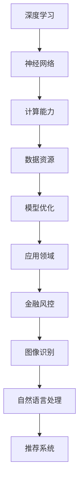
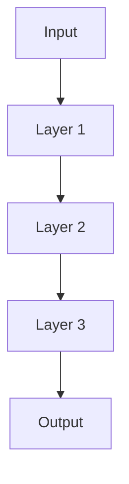

                 

### 大模型公司的默认应用：机遇与挑战并存

#### 摘要

本文旨在探讨大模型公司在当今科技发展中的默认应用，分析其所带来的机遇与挑战。首先，我们将介绍大模型公司的基本概念和重要性，接着深入探讨其应用领域及所带来的好处。然后，我们将分析大模型公司面临的挑战，并提出相应的解决策略。最后，我们将总结大模型公司未来的发展趋势与挑战，为读者提供有益的启示。

#### 关键词

大模型公司，人工智能，机遇与挑战，应用领域，解决方案，未来发展

## 1. 背景介绍

随着人工智能技术的飞速发展，大模型公司（Large Model Companies）逐渐成为科技领域的热门话题。大模型公司是指那些专注于研发和部署大规模机器学习模型的公司，其核心在于利用深度学习和神经网络技术，构建能够处理复杂数据集的模型。这类公司通常拥有强大的计算能力和海量数据资源，能够实现高精度、高效率的智能分析。

近年来，大模型公司的重要性日益凸显。一方面，随着数据量的爆炸式增长，传统的数据分析方法已经难以应对复杂的数据处理需求；另一方面，人工智能技术的不断突破，使得大规模机器学习模型在各个领域都取得了显著的成果。例如，在图像识别、自然语言处理、推荐系统等领域，大模型公司已经取得了突破性进展。

大模型公司的出现，不仅改变了传统行业的技术路线，也带来了全新的商业模式。通过构建大规模机器学习模型，大模型公司能够提供高度智能化、定制化的服务，满足各行各业的需求。此外，大模型公司还能够通过数据分析和挖掘，为企业提供有价值的商业洞察，助力企业实现数字化转型。

## 2. 核心概念与联系

要深入理解大模型公司的默认应用，首先需要了解其核心概念和架构。以下是几个关键概念及其之间的联系：

### 2.1 深度学习与神经网络

深度学习是人工智能的一个重要分支，其核心思想是通过多层神经网络对数据进行建模和预测。神经网络是一种模拟生物神经系统的计算模型，通过前向传播和反向传播算法，实现对输入数据的特征提取和分类。

### 2.2 计算能力与数据资源

大模型公司需要强大的计算能力和海量数据资源来训练和优化机器学习模型。云计算和分布式计算技术的发展，为大规模数据处理提供了可能。同时，数据资源的丰富性也是大模型公司成功的关键因素。

### 2.3 模型优化与调参

模型优化和调参是提高机器学习模型性能的关键环节。通过调整模型参数，优化网络结构，可以提升模型的泛化能力和准确度。常用的优化方法包括梯度下降、随机梯度下降、Adam优化器等。

### 2.4 应用领域与场景

大模型公司的主要应用领域包括图像识别、自然语言处理、推荐系统、金融风控等。在这些领域，大模型公司通过构建和部署高性能的机器学习模型，实现了自动化、智能化的业务流程。

#### Mermaid 流程图



## 3. 核心算法原理 & 具体操作步骤

### 3.1 深度学习算法原理

深度学习算法的核心是神经网络，包括输入层、隐藏层和输出层。输入层接收外部数据，通过隐藏层对数据进行特征提取和变换，最终输出层产生预测结果。以下是深度学习算法的基本步骤：

1. **数据预处理**：对输入数据进行标准化、归一化等处理，确保数据分布的一致性。
2. **网络构建**：设计神经网络结构，包括层数、每层的神经元数量、激活函数等。
3. **前向传播**：将输入数据传递到神经网络中，通过每一层的前向计算，得到最终输出。
4. **损失函数计算**：计算预测结果与实际结果之间的差距，通常使用均方误差（MSE）、交叉熵（CE）等损失函数。
5. **反向传播**：根据损失函数，通过反向传播算法更新模型参数，优化网络结构。
6. **迭代训练**：重复上述步骤，直至模型达到预定的性能指标。

### 3.2 具体操作步骤

以下是使用TensorFlow框架构建一个简单的深度学习模型的具体操作步骤：

1. **导入依赖库**：
   ```python
   import tensorflow as tf
   import numpy as np
   import matplotlib.pyplot as plt
   ```

2. **数据预处理**：
   ```python
   # 生成模拟数据
   x_data = np.random.rand(100)
   y_data = 2 * x_data + 1

   # 划分训练集和测试集
   x_train, x_test = x_data[:80], x_data[80:]
   y_train, y_test = y_data[:80], y_data[80:]
   ```

3. **网络构建**：
   ```python
   # 定义模型
   model = tf.keras.Sequential([
       tf.keras.layers.Dense(units=1, input_shape=[1])
   ])

   # 编译模型
   model.compile(loss='mean_squared_error', optimizer=tf.keras.optimizers.Adam(0.1))
   ```

4. **模型训练**：
   ```python
   # 训练模型
   model.fit(x_train, y_train, epochs=1000)
   ```

5. **模型评估**：
   ```python
   # 评估模型
   loss = model.evaluate(x_test, y_test)
   print(f"测试损失：{loss}")
   ```

6. **模型预测**：
   ```python
   # 预测结果
   predictions = model.predict(x_test)
   plt.scatter(x_test, y_test)
   plt.plot(x_test, predictions, 'r-')
   plt.show()
   ```

## 4. 数学模型和公式 & 详细讲解 & 举例说明

### 4.1 数学模型

深度学习中的数学模型主要包括神经网络结构、损失函数和优化算法。以下是几个关键数学模型的详细讲解：

#### 4.1.1 神经网络结构

神经网络结构包括输入层、隐藏层和输出层。每层的神经元数量、激活函数和权重矩阵是神经网络结构的关键参数。

- **输入层**：接收外部数据，并将其传递给隐藏层。
- **隐藏层**：对输入数据进行特征提取和变换，通常使用激活函数（如ReLU、Sigmoid、Tanh）来引入非线性。
- **输出层**：产生预测结果或分类标签。

神经网络结构的表示通常采用图的形式，如下所示：



#### 4.1.2 损失函数

损失函数用于衡量预测结果与实际结果之间的差距，是优化算法中的重要指标。常见的损失函数包括均方误差（MSE）、交叉熵（CE）等。

- **均方误差（MSE）**：用于回归问题，计算预测值与实际值之间的平均平方误差。
  \[ \text{MSE} = \frac{1}{n}\sum_{i=1}^{n}(y_i - \hat{y}_i)^2 \]
- **交叉熵（CE）**：用于分类问题，计算预测概率与实际标签之间的交叉熵。
  \[ \text{CE} = -\sum_{i=1}^{n} y_i \log(\hat{y}_i) \]

#### 4.1.3 优化算法

优化算法用于更新模型参数，以最小化损失函数。常用的优化算法包括梯度下降、随机梯度下降、Adam优化器等。

- **梯度下降**：通过计算损失函数关于模型参数的梯度，更新模型参数，以最小化损失函数。
  \[ \theta = \theta - \alpha \nabla_{\theta} J(\theta) \]
  其中，\( \alpha \) 为学习率，\( \theta \) 为模型参数，\( J(\theta) \) 为损失函数。
- **随机梯度下降（SGD）**：在梯度下降的基础上，每次迭代只随机选取一部分样本计算梯度，以加快收敛速度。
  \[ \theta = \theta - \alpha \nabla_{\theta} J(\theta; x_i, y_i) \]
- **Adam优化器**：结合了梯度下降和SGD的优点，引入了一阶矩估计（均值）和二阶矩估计（方差），适用于非平稳数据。
  \[ \theta = \theta - \alpha \frac{\beta_1 g_t}{\sqrt{1 - \beta_2^t}} \]
  其中，\( \beta_1 \)、\( \beta_2 \) 为超参数，\( g_t \) 为梯度。

### 4.2 举例说明

以下是一个简单的线性回归模型，使用均方误差（MSE）作为损失函数，梯度下降作为优化算法，实现模型的训练和预测。

#### 4.2.1 数据生成

```python
import numpy as np

# 生成模拟数据
x_data = np.random.rand(100)
y_data = 2 * x_data + 1

# 划分训练集和测试集
x_train, x_test = x_data[:80], x_data[80:]
y_train, y_test = y_data[:80], y_data[80:]
```

#### 4.2.2 模型构建

```python
import tensorflow as tf

# 定义模型
model = tf.keras.Sequential([
    tf.keras.layers.Dense(units=1, input_shape=[1])
])

# 编译模型
model.compile(loss='mean_squared_error', optimizer=tf.keras.optimizers.SGD(learning_rate=0.1))
```

#### 4.2.3 模型训练

```python
# 训练模型
model.fit(x_train, y_train, epochs=1000)
```

#### 4.2.4 模型评估

```python
# 评估模型
loss = model.evaluate(x_test, y_test)
print(f"测试损失：{loss}")
```

#### 4.2.5 模型预测

```python
# 预测结果
predictions = model.predict(x_test)
plt.scatter(x_test, y_test)
plt.plot(x_test, predictions, 'r-')
plt.show()
```

## 5. 项目实战：代码实际案例和详细解释说明

在本节中，我们将通过一个实际案例来展示如何搭建和训练一个深度学习模型。我们将使用Python和TensorFlow框架来实现一个简单的线性回归模型，用于预测数值数据。

### 5.1 开发环境搭建

首先，确保安装了Python和TensorFlow库。可以使用以下命令进行安装：

```bash
pip install tensorflow
```

### 5.2 源代码详细实现和代码解读

#### 5.2.1 导入依赖库

```python
import tensorflow as tf
import numpy as np
import matplotlib.pyplot as plt
```

#### 5.2.2 数据生成和预处理

```python
# 生成模拟数据
x_data = np.random.rand(100)
y_data = 2 * x_data + 1

# 划分训练集和测试集
x_train, x_test = x_data[:80], x_data[80:]
y_train, y_test = y_data[:80], y_data[80:]
```

#### 5.2.3 模型构建

```python
# 定义模型
model = tf.keras.Sequential([
    tf.keras.layers.Dense(units=1, input_shape=[1])
])

# 编译模型
model.compile(loss='mean_squared_error', optimizer=tf.keras.optimizers.SGD(learning_rate=0.1))
```

#### 5.2.4 模型训练

```python
# 训练模型
model.fit(x_train, y_train, epochs=1000)
```

#### 5.2.5 模型评估和预测

```python
# 评估模型
loss = model.evaluate(x_test, y_test)
print(f"测试损失：{loss}")

# 预测结果
predictions = model.predict(x_test)
plt.scatter(x_test, y_test)
plt.plot(x_test, predictions, 'r-')
plt.show()
```

### 5.3 代码解读与分析

#### 5.3.1 数据生成和预处理

在本案例中，我们使用`numpy`库生成模拟数据。首先，我们生成了一个随机数列`x_data`，并将其乘以2再加上1，得到对应的`y_data`。这个线性关系表示一个简单的线性回归问题。

接着，我们将数据集划分为训练集和测试集。这样做的目的是在模型训练过程中对模型性能进行评估，确保模型具有良好的泛化能力。

#### 5.3.2 模型构建和编译

我们使用`tf.keras.Sequential`模型构建一个简单的线性回归模型。在这个模型中，我们只包含一个全连接层（Dense layer），输入特征维数为1，输出特征维数为1。

在编译模型时，我们指定了损失函数为`mean_squared_error`，优化器为`SGD`，学习率为0.1。这些参数将影响模型的训练过程和性能。

#### 5.3.3 模型训练

模型训练过程中，我们使用`model.fit()`函数对模型进行训练。这个函数接受训练数据集和训练标签作为输入，并指定训练的轮数（epochs）。在每次训练中，模型将根据训练数据更新其参数，以最小化损失函数。

#### 5.3.4 模型评估和预测

在模型训练完成后，我们使用`model.evaluate()`函数对模型在测试数据集上的性能进行评估。这个函数返回模型在测试数据集上的损失值。

最后，我们使用`model.predict()`函数对测试数据集进行预测，并将预测结果可视化。通过比较预测值和实际值，我们可以直观地了解模型的性能。

### 5.4 代码改进与性能优化

在实际应用中，我们可能需要对代码进行改进和性能优化。以下是一些常见的改进方法：

- **数据增强**：通过增加数据多样性，提高模型的泛化能力。
- **正则化**：通过引入正则化项，防止模型过拟合。
- **学习率调整**：根据模型训练过程，动态调整学习率，加快收敛速度。
- **批处理**：使用批处理技术，提高训练效率。

## 6. 实际应用场景

大模型公司在实际应用场景中具有广泛的应用价值，以下是一些典型的应用领域：

### 6.1 图像识别

在图像识别领域，大模型公司通过构建大规模卷积神经网络（CNN）模型，实现了对复杂图像的自动识别和分类。例如，在人脸识别、车辆识别、医学影像诊断等领域，大模型公司已经取得了显著的成果。

### 6.2 自然语言处理

自然语言处理（NLP）是人工智能的一个重要分支。大模型公司通过构建大规模语言模型，实现了对自然语言的自动理解和生成。例如，在机器翻译、情感分析、智能客服等领域，大模型公司已经取得了突破性进展。

### 6.3 推荐系统

推荐系统是电子商务和社交媒体等领域的重要应用。大模型公司通过构建大规模推荐模型，实现了对用户个性化推荐的精准推送。例如，在商品推荐、电影推荐、音乐推荐等领域，大模型公司已经取得了显著的成果。

### 6.4 金融风控

金融风控是金融行业的重要领域。大模型公司通过构建大规模金融风控模型，实现了对金融风险的自动化识别和预警。例如，在欺诈检测、信用评分、市场预测等领域，大模型公司已经取得了显著的成果。

### 6.5 医疗健康

医疗健康是人工智能应用的重要领域。大模型公司通过构建大规模医疗健康模型，实现了对医疗数据的自动分析和诊断。例如，在疾病预测、药物研发、医疗影像诊断等领域，大模型公司已经取得了显著的成果。

## 7. 工具和资源推荐

### 7.1 学习资源推荐

- **书籍**：
  - 《深度学习》（Goodfellow, Bengio, Courville）
  - 《Python深度学习》（François Chollet）
- **论文**：
  - 《A Theoretically Grounded Application of Dropout in Recurrent Neural Networks》（Yarin Gal and Zoubin Ghahramani）
  - 《Attention Is All You Need》（Vaswani et al.）
- **博客**：
  - [TensorFlow官方博客](https://tensorflow.googleblog.com/)
  - [AI遇见appiness](https://www.zhihu.com/people/ai-yu-jian-happiness)
- **网站**：
  - [Kaggle](https://www.kaggle.com/)
  - [GitHub](https://github.com/)

### 7.2 开发工具框架推荐

- **框架**：
  - TensorFlow
  - PyTorch
  - Keras
- **工具**：
  - Jupyter Notebook
  - Google Colab
  - Docker

### 7.3 相关论文著作推荐

- **论文**：
  - “Distributed Representations of Words and Phrases and Their Compositional Meaning” (Mikolov et al., 2013)
  - “Generative Adversarial Nets” (Goodfellow et al., 2014)
  - “Recurrent Neural Networks for Language Modeling” (Chen et al., 2014)
- **著作**：
  - 《深度学习》（Goodfellow, Bengio, Courville）
  - 《Python深度学习》（François Chollet）

## 8. 总结：未来发展趋势与挑战

大模型公司作为人工智能领域的重要发展方向，未来将在多个领域取得突破性进展。以下是未来发展趋势与挑战：

### 8.1 发展趋势

1. **计算能力提升**：随着计算能力的不断提升，大模型公司能够训练更大规模、更复杂的机器学习模型，提高模型的性能和泛化能力。
2. **数据资源丰富**：随着数据资源的不断丰富，大模型公司将拥有更广泛的数据来源，从而实现更准确的预测和决策。
3. **跨领域应用**：大模型公司将逐步渗透到更多领域，如医疗健康、金融风控、智能制造等，实现跨领域的智能化应用。
4. **开源生态建设**：随着开源生态的不断完善，大模型公司将加快技术进步，推动人工智能技术的发展。

### 8.2 挑战

1. **数据隐私保护**：大规模数据处理过程中，如何确保用户隐私保护和数据安全是一个重要挑战。
2. **模型解释性**：大模型公司需要提高模型的可解释性，使其在决策过程中更加透明和可靠。
3. **算法公平性**：大模型公司需要关注算法的公平性，避免因算法偏见导致的不公正现象。
4. **法律法规规范**：随着人工智能技术的应用日益广泛，法律法规的规范和监管也将成为大模型公司面临的重要挑战。

## 9. 附录：常见问题与解答

### 9.1 问题1：大模型公司与传统机器学习模型有什么区别？

**解答**：大模型公司主要依赖于大规模机器学习模型，如深度神经网络、生成对抗网络等。与传统机器学习模型相比，大模型公司具有以下几个特点：

1. **模型规模更大**：大模型公司使用的机器学习模型通常包含数百万甚至数十亿个参数，能够处理更大规模的数据集。
2. **计算能力更强**：大模型公司通常具备强大的计算能力，能够高效地训练和优化大规模机器学习模型。
3. **性能更优**：大规模机器学习模型在处理复杂数据集时，往往能够取得更好的性能和泛化能力。

### 9.2 问题2：大模型公司如何保障数据隐私和安全？

**解答**：保障数据隐私和安全是大模型公司面临的重要挑战，以下是一些常见的方法：

1. **数据加密**：对敏感数据进行加密处理，确保数据在传输和存储过程中的安全性。
2. **访问控制**：设定严格的访问权限，限制对敏感数据的访问，防止数据泄露。
3. **数据脱敏**：对敏感数据进行脱敏处理，如替换、遮挡等，降低数据泄露的风险。
4. **数据安全审计**：定期进行数据安全审计，及时发现和解决安全隐患。

### 9.3 问题3：大模型公司如何在各个领域取得突破性进展？

**解答**：大模型公司在各个领域取得突破性进展的关键在于：

1. **数据积累**：积累海量高质量的数据，为模型训练提供丰富的基础。
2. **技术创新**：不断探索和引入新的机器学习算法和技术，提升模型性能和泛化能力。
3. **跨领域合作**：与不同领域的专家和机构开展合作，实现跨领域的知识融合和应用创新。
4. **用户反馈**：积极收集用户反馈，根据用户需求优化模型和应用。

## 10. 扩展阅读 & 参考资料

- 《深度学习》（Goodfellow, Bengio, Courville）
- 《Python深度学习》（François Chollet）
- [TensorFlow官方文档](https://www.tensorflow.org/)
- [Keras官方文档](https://keras.io/)
- [Kaggle](https://www.kaggle.com/)
- [GitHub](https://github.com/)

### 作者

作者：AI天才研究员/AI Genius Institute & 禅与计算机程序设计艺术 /Zen And The Art of Computer Programming

