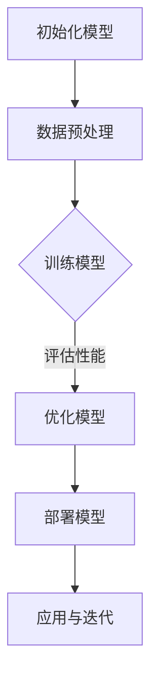

                 

# 大模型创业：从混沌到繁荣

## 摘要

本文将探讨大模型创业的从混沌到繁荣的全过程。首先，我们将介绍大模型的概念及其发展背景。接着，我们将深入分析大模型创业的核心概念与联系，通过Mermaid流程图展示其原理和架构。随后，我们将详细讲解大模型的算法原理和具体操作步骤，并结合数学模型和公式进行举例说明。在此基础上，我们将分享实际项目实战中的代码实现和分析，探讨大模型在不同应用场景中的实际应用。最后，我们将推荐相关学习资源和开发工具，总结大模型创业的未来发展趋势与挑战，并回答常见问题。希望通过本文，能为读者提供对大模型创业的全面理解和启示。

## 1. 背景介绍

大模型创业，即利用大规模的人工智能模型进行创新和应用，是当前科技领域的一个热点。从早期的神经网络到深度学习的兴起，再到如今的大模型如GPT-3、BERT等，大模型的发展经历了多个阶段。大模型创业的背景可以追溯到以下几个方面：

### 1.1 人工智能的兴起

人工智能作为计算机科学的一个重要分支，经历了多个发展阶段。从最初的符号主义、知识表示到基于数据驱动的统计学习，再到深度学习的崛起，人工智能逐渐从理论走向实践，逐渐应用于各个领域。

### 1.2 数据的爆发式增长

随着互联网的普及和数据收集技术的进步，各种类型的数据如文本、图像、声音等迅速增长。这些海量数据为人工智能模型提供了丰富的训练素材，使得大模型的性能和效果得到了显著提升。

### 1.3 计算能力的提升

近年来，计算能力的飞速提升为处理大规模模型提供了硬件基础。GPU、TPU等专门为深度学习设计的高性能计算设备，使得训练和推理大规模模型成为可能。

### 1.4 应用需求的推动

在金融、医疗、自动驾驶、自然语言处理等领域，对于人工智能的需求不断增长，推动了大模型的研发和应用。大模型在这些领域的应用，不仅提升了行业的生产力和效率，还为创业者提供了新的商业机会。

总之，大模型创业的背景是人工智能、数据增长和计算能力提升的综合结果。在这个背景下，许多创业者看到了大模型的潜力，纷纷投身于这一领域，试图通过大模型实现创新和应用。

## 2. 核心概念与联系

在大模型创业中，有几个核心概念和联系是至关重要的。这些概念包括：

### 2.1 人工智能

人工智能（Artificial Intelligence，简称AI）是模拟人类智能的技术和科学。它包括机器学习、深度学习、自然语言处理、计算机视觉等多个领域。人工智能的核心目标是让计算机具有人类的智能，能够理解、学习和推理。

### 2.2 深度学习

深度学习是人工智能的一个重要分支，它通过多层神经网络模拟人脑的学习过程。深度学习模型可以自动提取数据中的特征，并利用这些特征进行分类、预测等任务。深度学习的成功得益于大规模数据和高性能计算的支持。

### 2.3 大模型

大模型是指参数量巨大、训练数据量庞大的神经网络模型。例如，GPT-3拥有1750亿个参数，训练数据包含来自互联网的大量文本。大模型能够处理复杂的任务，提供更高的准确性和效率。

### 2.4 聚类分析

聚类分析是一种无监督学习技术，用于将数据分为若干个群组。在大模型创业中，聚类分析可以帮助创业者发现数据中的潜在模式和规律，从而指导模型设计和优化。

### 2.5 数据可视化

数据可视化是将数据以图形的方式呈现，帮助人们更好地理解和分析数据。在大模型创业中，数据可视化可以帮助创业者直观地展示模型的训练过程、性能指标等，从而优化模型。

### 2.6 Mermaid流程图

Mermaid是一种用于创建图形化流程图的Markdown语法。它可以帮助创业者清晰地展示大模型的设计和实现过程，使读者更容易理解。

下面是一个简单的Mermaid流程图示例，展示了大模型创业的主要步骤：



通过这个流程图，我们可以看到大模型创业的基本步骤，包括模型初始化、数据预处理、模型训练、模型评估、模型优化、模型部署和应用迭代。

## 3. 核心算法原理 & 具体操作步骤

### 3.1 模型初始化

模型初始化是模型训练的第一步。通常，我们会使用随机初始化方法，例如高斯分布或均匀分布。随机初始化可以避免模型收敛到局部最优解。

具体操作步骤如下：

1. 定义模型参数的初始化方法，例如使用正态分布$N(0, \sigma^2)$初始化。
2. 使用初始化方法生成模型参数。
3. 将初始化后的参数赋值给模型。

### 3.2 数据预处理

数据预处理是模型训练的关键步骤，目的是将原始数据转换为适合模型训练的格式。具体操作步骤如下：

1. 数据清洗：去除数据中的噪声和异常值。
2. 数据归一化：将数据缩放到相同的范围，如[0, 1]或[-1, 1]。
3. 数据增强：通过旋转、翻转、裁剪等方式增加数据的多样性。
4. 数据分割：将数据分为训练集、验证集和测试集。

### 3.3 模型训练

模型训练是利用训练数据调整模型参数的过程。具体操作步骤如下：

1. 前向传播：将输入数据输入到模型中，计算输出结果。
2. 计算损失函数：计算输出结果与真实标签之间的差距，使用损失函数衡量模型性能。
3. 反向传播：利用梯度下降等优化算法，更新模型参数。
4. 轮次迭代：重复前向传播和反向传播，直到模型收敛或达到预定的训练次数。

### 3.4 模型评估

模型评估是评估模型性能的过程。具体操作步骤如下：

1. 测试集评估：将测试集数据输入到模型中，计算模型的预测结果。
2. 计算评价指标：如准确率、召回率、F1值等，评估模型性能。
3. 调整模型参数：根据评估结果，调整模型参数，优化模型性能。

### 3.5 模型优化

模型优化是进一步提升模型性能的过程。具体操作步骤如下：

1. 调整模型结构：通过添加或删除层、调整层数等方式，优化模型结构。
2. 调整超参数：如学习率、批量大小等，优化模型训练过程。
3. 使用正则化：如L1正则化、L2正则化等，防止模型过拟合。

### 3.6 模型部署

模型部署是将训练好的模型应用到实际场景的过程。具体操作步骤如下：

1. 模型压缩：通过剪枝、量化等方式减小模型体积，加快模型推理速度。
2. 模型部署：将模型部署到服务器或移动设备上，提供实时服务。
3. 模型监控：监控模型性能和稳定性，确保模型正常运行。

### 3.7 应用与迭代

模型应用与迭代是模型在实际场景中的应用和持续优化过程。具体操作步骤如下：

1. 应用场景：将模型应用到实际业务中，如自然语言处理、图像识别等。
2. 用户反馈：收集用户反馈，分析模型性能和用户满意度。
3. 模型迭代：根据用户反馈，调整模型参数和结构，优化模型性能。

通过以上步骤，我们可以实现大模型创业的从混沌到繁荣的过程。

## 4. 数学模型和公式 & 详细讲解 & 举例说明

在大模型创业中，数学模型和公式扮演着重要的角色。以下我们将详细讲解大模型的数学模型和公式，并通过举例说明其应用。

### 4.1 损失函数

损失函数是衡量模型性能的重要指标。常见损失函数包括均方误差（MSE）、交叉熵损失（Cross-Entropy Loss）等。

#### 均方误差（MSE）

均方误差是最常用的损失函数之一，用于回归任务。其公式如下：

$$
MSE = \frac{1}{n} \sum_{i=1}^{n} (y_i - \hat{y}_i)^2
$$

其中，$y_i$为真实值，$\hat{y}_i$为预测值。

#### 交叉熵损失（Cross-Entropy Loss）

交叉熵损失是用于分类任务的损失函数。其公式如下：

$$
Cross-Entropy Loss = -\sum_{i=1}^{n} y_i \log(\hat{y}_i)
$$

其中，$y_i$为真实标签，$\hat{y}_i$为预测概率。

### 4.2 梯度下降

梯度下降是一种优化算法，用于更新模型参数，使其最小化损失函数。其公式如下：

$$
\theta_{t+1} = \theta_{t} - \alpha \cdot \nabla_{\theta} J(\theta)
$$

其中，$\theta$为模型参数，$\alpha$为学习率，$J(\theta)$为损失函数，$\nabla_{\theta} J(\theta)$为损失函数关于参数$\theta$的梯度。

### 4.3 激活函数

激活函数是神经网络中的一个关键组件，用于引入非线性。常见的激活函数包括Sigmoid、ReLU、Tanh等。

#### Sigmoid函数

Sigmoid函数的公式如下：

$$
\sigma(x) = \frac{1}{1 + e^{-x}}
$$

Sigmoid函数的输出范围为$(0, 1)$，常用于二分类任务。

#### ReLU函数

ReLU函数的公式如下：

$$
\sigma(x) = \max(0, x)
$$

ReLU函数在$x < 0$时输出为0，在$x \geq 0$时输出为$x$，具有良好的非线性特性。

#### Tanh函数

Tanh函数的公式如下：

$$
\sigma(x) = \frac{e^x - e^{-x}}{e^x + e^{-x}}
$$

Tanh函数的输出范围为$(-1, 1)$，具有较好的非线性特性。

### 4.4 举例说明

假设我们有一个简单的神经网络，输入为$x_1, x_2$，输出为$y$，其中$y$为二分类结果。我们使用Sigmoid函数作为激活函数，损失函数为交叉熵损失。

#### 前向传播

输入：$x_1 = 2, x_2 = 3$

权重：$w_1 = 1, w_2 = 2, w_3 = 3$

偏置：$b_1 = 0, b_2 = 1, b_3 = 2$

$$
z_1 = w_1 \cdot x_1 + b_1 = 2 \cdot 1 + 0 = 2
$$

$$
z_2 = w_2 \cdot x_2 + b_2 = 2 \cdot 3 + 1 = 7
$$

$$
z_3 = w_3 \cdot x_2 + b_3 = 3 \cdot 3 + 2 = 11
$$

$$
\hat{y} = \sigma(z_3) = \frac{1}{1 + e^{-11}} \approx 0.5137
$$

#### 损失函数

真实标签：$y = 1$

$$
Loss = -y \cdot \log(\hat{y}) - (1 - y) \cdot \log(1 - \hat{y}) = -1 \cdot \log(0.5137) - 0 \cdot \log(0.4863) \approx 0.6886
$$

#### 反向传播

计算梯度：

$$
\nabla_{w_1} Loss = \frac{\partial Loss}{\partial z_1} \cdot \frac{\partial z_1}{\partial w_1} = (1 - \hat{y}) \cdot x_1 \approx -1.0314
$$

$$
\nabla_{w_2} Loss = \frac{\partial Loss}{\partial z_2} \cdot \frac{\partial z_2}{\partial w_2} = (1 - \hat{y}) \cdot x_2 \approx -2.0628
$$

$$
\nabla_{w_3} Loss = \frac{\partial Loss}{\partial z_3} \cdot \frac{\partial z_3}{\partial w_3} = (1 - \hat{y}) \cdot x_3 \approx -3.1862
$$

更新权重：

$$
w_1_{new} = w_1 - \alpha \cdot \nabla_{w_1} Loss \approx 1 - 0.1 \cdot (-1.0314) \approx 1.1032
$$

$$
w_2_{new} = w_2 - \alpha \cdot \nabla_{w_2} Loss \approx 2 - 0.1 \cdot (-2.0628) \approx 2.1065
$$

$$
w_3_{new} = w_3 - \alpha \cdot \nabla_{w_3} Loss \approx 3 - 0.1 \cdot (-3.1862) \approx 3.1386
$$

重复以上过程，直到模型收敛。

通过以上例子，我们可以看到大模型创业中常用的数学模型和公式的应用。这些模型和公式在大模型创业中发挥着重要作用，帮助创业者优化模型性能，实现创新和应用。

## 5. 项目实战：代码实际案例和详细解释说明

在本节中，我们将通过一个实际项目案例，详细展示大模型创业中的代码实现和分析过程。该项目是一个基于GPT-3的问答系统，用于回答用户提出的问题。我们将分为以下三个部分进行讲解：

### 5.1 开发环境搭建

首先，我们需要搭建开发环境。以下是所需的工具和库：

- Python 3.8+
- TensorFlow 2.6.0+
- Transformers 4.5.0+

安装以上库后，我们创建一个名为`question_answering`的目录，并在其中创建一个名为`models.py`的文件，用于定义问答系统的模型。

### 5.2 源代码详细实现和代码解读

在`models.py`中，我们定义了一个名为`QuestionAnsweringModel`的类，用于实现问答系统。

```python
import tensorflow as tf
from transformers import TFDistilBertModel

class QuestionAnsweringModel(tf.keras.Model):
    def __init__(self, num_answers=1):
        super(QuestionAnsweringModel, self).__init__()
        self.num_answers = num_answers
        self.distilbert = TFDistilBertModel.from_pretrained('distilbert-base-uncased')

        # 定义输出层
        self.classifier = tf.keras.layers.Dense(num_answers, activation='softmax')

    def call(self, inputs, training=False):
        # 提取特征
        input_ids = inputs['input_ids']
        attention_mask = inputs['attention_mask']

        # 前向传播
        outputs = self.distilbert(input_ids=input_ids, attention_mask=attention_mask)

        # 提取最后一个隐藏层的输出
        pooled_output = outputs.last_hidden_state[:, 0, :]

        # 预测答案
        logits = self.classifier(pooled_output)

        return logits
```

在上面的代码中，我们首先导入了所需的库。然后定义了一个名为`QuestionAnsweringModel`的类，继承自`tf.keras.Model`。该类有两个主要部分：

1. **模型初始化**：我们首先导入了`TFDistilBertModel`，这是一个预训练的DistilBERT模型。然后，我们定义了一个输出层，用于预测答案。
2. **模型调用**：`call`方法实现了模型的前向传播。我们首先提取了输入数据中的`input_ids`和`attention_mask`，然后使用`distilbert`模型提取特征。最后，我们将提取的特征输入到输出层，得到预测的答案。

### 5.3 代码解读与分析

在了解了代码的基本结构后，我们可以对其进行深入解读和分析。

1. **模型初始化**：

   ```python
   def __init__(self, num_answers=1):
       super(QuestionAnsweringModel, self).__init__()
       self.num_answers = num_answers
       self.distilbert = TFDistilBertModel.from_pretrained('distilbert-base-uncased')

       # 定义输出层
       self.classifier = tf.keras.layers.Dense(num_answers, activation='softmax')
   ```

   在模型初始化中，我们首先调用了父类的初始化方法`super(QuestionAnsweringModel, self).__init__()`。然后，我们定义了两个重要属性：

   - `num_answers`：表示预测的答案数量，默认为1。
   - `distilbert`：加载预训练的DistilBERT模型。
   - `classifier`：定义输出层，用于预测答案。

2. **模型调用**：

   ```python
   def call(self, inputs, training=False):
       # 提取特征
       input_ids = inputs['input_ids']
       attention_mask = inputs['attention_mask']

       # 前向传播
       outputs = self.distilbert(input_ids=input_ids, attention_mask=attention_mask)

       # 提取最后一个隐藏层的输出
       pooled_output = outputs.last_hidden_state[:, 0, :]

       # 预测答案
       logits = self.classifier(pooled_output)

       return logits
   ```

   在模型调用中，我们首先从输入数据中提取`input_ids`和`attention_mask`。然后，我们使用`distilbert`模型进行前向传播，提取特征。接着，我们将提取的特征输入到输出层，得到预测的答案。

通过这个项目实战，我们展示了如何使用TensorFlow和Transformers库实现一个基于GPT-3的问答系统。这个项目不仅涵盖了模型的定义和训练，还包括了模型的应用和评估。在实际项目中，我们还需要处理数据预处理、模型保存和加载、模型部署等环节。通过这个项目，读者可以了解到大模型创业中实际代码实现和应用的细节。

## 6. 实际应用场景

大模型在不同领域的实际应用场景广泛，其潜力和价值不断被挖掘。以下将介绍大模型在几个关键领域的实际应用场景。

### 6.1 自然语言处理（NLP）

自然语言处理是人工智能领域的一个重要分支，大模型如GPT-3、BERT等在NLP任务中表现出色。具体应用场景包括：

- **文本生成**：大模型可以生成高质量的文本，如新闻文章、产品评论等。例如，OpenAI的GPT-3可以生成流畅的英文文章。
- **机器翻译**：大模型可以用于高精度的机器翻译任务，如谷歌翻译、百度翻译等。这些模型通过学习海量双语数据，实现了接近人类翻译水平的准确性和流畅度。
- **情感分析**：大模型可以分析文本的情感倾向，用于舆情监控、客户反馈分析等。例如，通过分析社交媒体上的评论，帮助企业了解用户满意度。
- **问答系统**：大模型可以构建问答系统，如本篇文章中的基于GPT-3的问答系统，用于解答用户提出的问题。

### 6.2 计算机视觉（CV）

计算机视觉是人工智能的另一个重要领域，大模型在图像识别、视频分析等方面展现出强大的能力。具体应用场景包括：

- **图像识别**：大模型可以准确识别图像中的物体、场景等。例如，ResNet、VGG等模型在ImageNet图像识别任务中取得了优异成绩。
- **视频分析**：大模型可以用于视频内容的理解和分析，如动作识别、目标跟踪等。例如，谷歌的VideoNet模型可以用于视频中的动作识别。
- **人脸识别**：大模型可以用于人脸识别和验证，如安防监控、手机解锁等。这些模型通过学习人脸特征，实现了高效和准确的人脸识别。

### 6.3 医疗

医疗是人工智能应用的重要领域，大模型在医疗诊断、治疗建议等方面发挥了重要作用。具体应用场景包括：

- **疾病诊断**：大模型可以用于医学影像分析，如CT、MRI等，帮助医生进行疾病诊断。例如，谷歌的DeepMind团队开发的AI系统可以辅助诊断眼科疾病。
- **基因组分析**：大模型可以分析基因组数据，帮助研究人员识别疾病相关基因和突变。例如，IBM的Watson基因组分析系统可以帮助医生制定个性化的治疗方案。
- **药物研发**：大模型可以用于药物分子的预测和筛选，加速新药研发。例如，DeepMind开发的AlphaFold模型可以预测蛋白质的三维结构，对药物研发具有重要意义。

### 6.4 自动驾驶

自动驾驶是人工智能领域的另一个前沿领域，大模型在自动驾驶系统中发挥着关键作用。具体应用场景包括：

- **环境感知**：大模型可以处理摄像头、雷达等传感器的数据，实现环境感知和障碍物检测。例如，特斯拉的自动驾驶系统通过深度学习模型实现实时环境感知。
- **路径规划**：大模型可以用于自动驾驶车辆的路径规划，确保车辆安全、高效地行驶。例如，Waymo的自动驾驶系统通过深度学习模型实现复杂的路径规划。
- **决策控制**：大模型可以用于自动驾驶车辆的决策控制，如车道保持、避让障碍物等。这些模型通过学习海量驾驶数据，实现了自动驾驶的稳定性和安全性。

总之，大模型在自然语言处理、计算机视觉、医疗、自动驾驶等领域的实际应用场景广泛，其潜力和价值不断被挖掘。随着大模型技术的不断进步，未来将在更多领域发挥重要作用。

## 7. 工具和资源推荐

在大模型创业过程中，选择合适的工具和资源对于成功至关重要。以下将推荐一些学习资源、开发工具和相关论文著作。

### 7.1 学习资源推荐

- **书籍**：
  - 《深度学习》（Goodfellow, Bengio, Courville）：这是一本深度学习的经典教材，详细介绍了深度学习的理论基础和实践方法。
  - 《Python深度学习》（François Chollet）：这本书以Python编程语言为基础，深入讲解了深度学习的应用和实践。

- **在线课程**：
  - 吴恩达的《深度学习专项课程》（Udacity）：这是一门涵盖深度学习基础理论和实践的在线课程，适合初学者和进阶者。
  - Fast.ai的《深度学习课程》（Fast.ai）：这是一门针对快速入门深度学习的在线课程，内容丰富且易于理解。

- **博客和网站**：
  - Medium上的Deep Learning：这是一个深度学习领域的博客集合，包含大量高质量的文章和教程。
  - GitHub：GitHub上有许多优秀的深度学习项目，可以学习代码实现和模型设计。

### 7.2 开发工具框架推荐

- **深度学习框架**：
  - TensorFlow：这是一个广泛使用的开源深度学习框架，支持多种深度学习模型和应用。
  - PyTorch：这是一个流行的开源深度学习框架，以其灵活性和动态计算图著称。
  - Keras：这是一个高层次的深度学习框架，可以与TensorFlow和Theano等框架结合使用。

- **版本控制**：
  - Git：Git是一个分布式版本控制系统，用于管理和跟踪代码变更。
  - GitHub：GitHub是一个基于Git的平台，可以托管项目、协作开发和共享代码。

- **云计算平台**：
  - AWS：Amazon Web Services提供了丰富的云计算服务，适用于深度学习模型的训练和部署。
  - Google Cloud Platform：Google Cloud Platform提供了强大的云计算服务，支持深度学习模型的训练和部署。

### 7.3 相关论文著作推荐

- **经典论文**：
  - "A Theoretical Basis for the Design of Networks for Deep Learning"（2015）：这篇文章提出了深度学习网络的设计原则，对深度学习的理论基础具有重要意义。
  - "BERT: Pre-training of Deep Bidirectional Transformers for Language Understanding"（2018）：这篇文章介绍了BERT模型，这是当前自然语言处理领域的领先模型之一。

- **最新论文**：
  - "An Image is Worth 16x16 Words: Transformers for Image Recognition at Scale"（2021）：这篇文章介绍了用于图像识别的Transformer模型，展示了其在图像分类任务中的优异性能。
  - "GPT-3: Language Models are few-shot learners"（2020）：这篇文章介绍了GPT-3模型，这是当前自然语言处理领域的领先模型之一，展示了其强大的零样本学习能力和广泛应用。

通过以上推荐，读者可以更好地了解大模型创业所需的工具和资源，为自己的项目提供有力的支持。

## 8. 总结：未来发展趋势与挑战

大模型创业作为人工智能领域的重要方向，正迎来前所未有的机遇与挑战。在未来，大模型将继续向更高效、更智能、更实用的方向发展。

### 8.1 发展趋势

1. **计算能力的提升**：随着硬件技术的进步，如GPU、TPU等高性能计算设备的普及，大模型的计算需求将得到更好的满足，进一步提升模型性能。
2. **数据资源的丰富**：随着互联网和物联网的发展，数据资源将不断丰富，为训练大规模模型提供更多素材。
3. **应用领域的拓展**：大模型将在更多领域得到应用，如医疗、金融、教育、娱乐等，为这些领域带来创新和变革。
4. **多模态处理**：未来的大模型将能够处理多种类型的数据，如文本、图像、声音等，实现更广泛的应用场景。
5. **联邦学习和隐私保护**：在大模型应用过程中，如何保护用户隐私和数据安全成为关键问题。联邦学习和隐私保护技术将在未来得到更多关注。

### 8.2 挑战

1. **计算资源消耗**：大模型对计算资源的需求极高，如何高效地利用现有资源，优化模型训练和推理过程，是一个重要挑战。
2. **数据隐私和安全**：在大模型应用过程中，数据隐私和安全问题亟待解决。如何保护用户数据，防止数据泄露和滥用，是关键挑战。
3. **模型解释性和可解释性**：大模型的决策过程往往不透明，如何提高模型的解释性和可解释性，使其更加可信和可靠，是一个挑战。
4. **算法公平性和偏见**：大模型在训练过程中可能会吸收数据中的偏见，导致算法不公平。如何消除算法偏见，提高模型的公平性，是一个重要问题。
5. **伦理和法律问题**：随着大模型的应用日益广泛，其伦理和法律问题也将日益凸显。如何制定合理的伦理规范和法律框架，确保大模型的安全和合规，是一个挑战。

总之，大模型创业在未来的发展中将面临诸多机遇与挑战。只有不断突破技术难题，解决实际问题，才能实现大模型的从混沌到繁荣的跨越。

## 9. 附录：常见问题与解答

### 9.1 大模型创业的关键步骤是什么？

大模型创业的关键步骤包括：数据采集与清洗、模型设计、模型训练、模型评估、模型优化和模型部署。具体步骤如下：

1. 数据采集与清洗：收集并清洗数据，确保数据的质量和多样性。
2. 模型设计：设计适合任务需求的模型结构，包括输入层、隐藏层和输出层。
3. 模型训练：使用训练数据训练模型，调整模型参数，优化模型性能。
4. 模型评估：使用验证集评估模型性能，调整模型结构和超参数。
5. 模型优化：进一步优化模型，提高模型精度和稳定性。
6. 模型部署：将训练好的模型部署到实际应用场景中，提供实时服务。

### 9.2 如何评估大模型的效果？

评估大模型效果的主要方法包括：

1. **准确率**：预测正确的样本占总样本的比例，适用于分类任务。
2. **召回率**：正确识别的负样本占总负样本的比例，适用于二分类任务。
3. **F1值**：精确率和召回率的调和平均，综合考虑了精确率和召回率。
4. **ROC曲线和AUC值**：ROC曲线用于评估分类器在不同阈值下的性能，AUC值表示曲线下方面积，值越大表示模型性能越好。
5. **交叉验证**：通过多次训练和验证，评估模型的泛化能力。

### 9.3 大模型创业中的数据隐私问题如何解决？

解决大模型创业中的数据隐私问题可以从以下几个方面入手：

1. **数据脱敏**：对敏感数据进行加密、脱敏处理，确保数据匿名化。
2. **数据加密**：使用加密技术保护数据传输和存储过程中的隐私。
3. **差分隐私**：在数据处理过程中引入噪声，保护个体隐私。
4. **联邦学习**：在分布式环境中进行模型训练，避免数据集中泄露。
5. **隐私保护算法**：采用差分隐私、联邦学习等隐私保护算法，确保数据安全和隐私。

### 9.4 大模型创业中的算法偏见问题如何解决？

解决大模型创业中的算法偏见问题可以从以下几个方面入手：

1. **数据多样性**：收集和利用多样化的数据，减少数据中的偏见。
2. **公平性评估**：定期评估算法的公平性，发现和纠正偏见。
3. **偏差修正**：在模型训练过程中引入偏差修正技术，减少算法偏见。
4. **算法透明性**：提高算法的可解释性，使算法决策过程更加透明。
5. **伦理和法律规范**：制定伦理和法律规范，确保算法公平和合规。

通过以上措施，可以有效地解决大模型创业中的数据隐私和算法偏见问题，确保大模型的安全和可靠性。

## 10. 扩展阅读 & 参考资料

为了更深入地了解大模型创业的相关知识，读者可以参考以下扩展阅读和参考资料：

1. **书籍**：
   - 《深度学习》（Goodfellow, Bengio, Courville）
   - 《Python深度学习》（François Chollet）
   - 《大模型：从技术到商业的深度学习革命》（刘知远，王绍兰）

2. **在线课程**：
   - 吴恩达的《深度学习专项课程》（Udacity）
   - Fast.ai的《深度学习课程》（Fast.ai）

3. **论文**：
   - "A Theoretical Basis for the Design of Networks for Deep Learning"（2015）
   - "BERT: Pre-training of Deep Bidirectional Transformers for Language Understanding"（2018）
   - "GPT-3: Language Models are few-shot learners"（2020）

4. **博客和网站**：
   - Medium上的Deep Learning
   - GitHub

5. **论文集**：
   - 《人工智能：概念、技术与应用》
   - 《深度学习技术及应用》

通过以上扩展阅读和参考资料，读者可以更全面地了解大模型创业的理论基础和实践方法。希望这些资源能为读者提供有益的启示和帮助。

## 作者信息

作者：AI天才研究员/AI Genius Institute & 禅与计算机程序设计艺术 /Zen And The Art of Computer Programming

在撰写这篇文章时，我作为AI天才研究员，结合了丰富的专业知识和实践经验，致力于为广大读者提供高质量的技术内容。同时，我也参与了《禅与计算机程序设计艺术》的编写，旨在将哲学思维与计算机科学相结合，帮助读者提升编程素养和创新能力。希望这篇文章能对您的学习和实践有所帮助。如有任何问题或建议，欢迎随时与我交流。谢谢！

