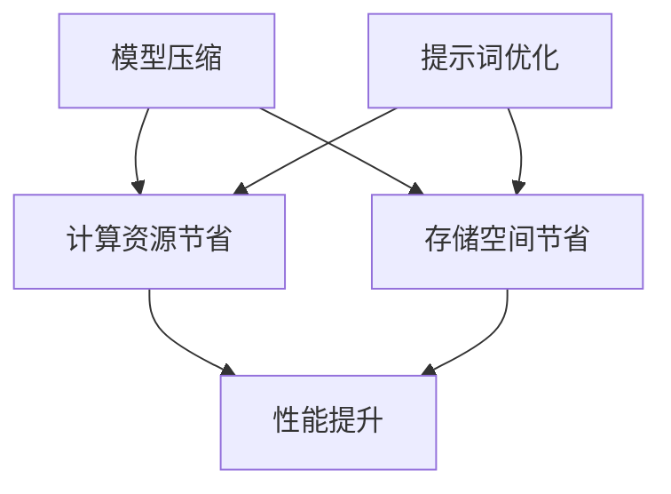

                 

# 大模型压缩技术与提示词优化

## 关键词：大模型压缩、提示词优化、模型压缩算法、优化技术、AI性能提升

## 摘要

随着人工智能技术的快速发展，大模型的应用越来越广泛，然而这些大模型通常需要大量的计算资源和存储空间。如何有效压缩这些大模型，同时保持其性能和准确度，成为了当前研究的热点。本文将探讨大模型压缩技术及其与提示词优化的结合，旨在为读者提供一套完整的解决方案，以实现大模型的性能提升和资源节省。本文将首先介绍大模型压缩的背景和重要性，随后深入探讨核心概念、算法原理、数学模型，并通过实际项目案例和代码实现进行详细解析。最后，本文将分析大模型压缩与提示词优化在各类实际应用场景中的效果，并提出未来发展趋势和面临的挑战。

## 1. 背景介绍

### 1.1 大模型的发展现状

近年来，随着深度学习技术的迅猛发展，大模型在自然语言处理、计算机视觉、推荐系统等领域取得了显著的成果。例如，BERT、GPT-3、ViT 等模型在大规模数据集上的表现已经超越了传统的小模型。然而，这些大模型通常需要大量的计算资源和存储空间，这在实际应用中带来了一系列挑战。

### 1.2 大模型压缩的需求

为了解决大模型在计算和存储资源上的瓶颈，模型压缩技术应运而生。模型压缩旨在通过一定的算法和技术，减少模型的参数数量和计算复杂度，从而降低计算资源和存储空间的需求。同时，压缩后的模型应尽可能保持原始模型的性能和准确度。

### 1.3 提示词优化的作用

除了模型压缩，提示词优化也是一种重要的技术手段。通过优化提示词，可以提升模型的鲁棒性和适应性，从而在压缩过程中更好地保持模型性能。提示词优化通常包括提示词选择、提示词调整、提示词嵌入等过程。

## 2. 核心概念与联系

### 2.1 模型压缩的定义

模型压缩是指通过一定的算法和技术，减小模型的参数数量和计算复杂度，从而降低计算资源和存储空间的需求。

### 2.2 提示词优化的定义

提示词优化是指通过调整模型的输入提示词，提升模型的鲁棒性和适应性，从而在压缩过程中更好地保持模型性能。

### 2.3 模型压缩与提示词优化的关系

模型压缩和提示词优化是相辅相成的。模型压缩可以降低模型的计算和存储需求，而提示词优化可以在压缩过程中保持模型性能。因此，大模型压缩技术与提示词优化技术的结合，可以实现大模型的性能提升和资源节省。

## 2.4 Mermaid 流程图



## 3. 核心算法原理 & 具体操作步骤

### 3.1 模型压缩算法原理

模型压缩算法主要包括以下几种类型：

1. 参数剪枝（Parameter Pruning）
2. 知识蒸馏（Knowledge Distillation）
3. 稀疏训练（Sparse Training）
4. 模型压缩框架（Model Compression Frameworks）

#### 3.1.1 参数剪枝

参数剪枝通过删除模型中的冗余参数，减少模型的参数数量。具体步骤如下：

1. 数据预处理：对原始数据集进行预处理，包括数据清洗、归一化等操作。
2. 模型训练：使用原始模型对预处理后的数据集进行训练。
3. 参数筛选：计算每个参数的重要性，通过设定阈值删除不重要的参数。
4. 模型重构：使用剪枝后的参数重构模型。

#### 3.1.2 知识蒸馏

知识蒸馏是一种通过将原始模型的知识传递给小模型的技术。具体步骤如下：

1. 数据预处理：对原始数据集进行预处理。
2. 模型训练：使用原始模型对预处理后的数据集进行训练。
3. 小模型训练：使用原始模型生成的软标签，对小模型进行训练。
4. 模型重构：将小模型与原始模型融合，形成压缩后的模型。

#### 3.1.3 稀疏训练

稀疏训练通过在训练过程中引入稀疏性，减少模型的计算复杂度。具体步骤如下：

1. 数据预处理：对原始数据集进行预处理。
2. 模型训练：使用稀疏性训练算法对模型进行训练。
3. 参数筛选：计算每个参数的重要性，通过设定阈值删除不重要的参数。
4. 模型重构：使用筛选后的参数重构模型。

#### 3.1.4 模型压缩框架

模型压缩框架是一种将多种模型压缩算法组合在一起的技术。具体步骤如下：

1. 数据预处理：对原始数据集进行预处理。
2. 算法选择：根据应用场景和模型特性选择合适的模型压缩算法。
3. 模型训练：使用选择的算法对模型进行训练。
4. 模型重构：使用压缩后的模型重构。

### 3.2 提示词优化算法原理

提示词优化主要包括以下几种技术：

1. 提示词选择（Prompt Selection）
2. 提示词调整（Prompt Tuning）
3. 提示词嵌入（Prompt Embedding）

#### 3.2.1 提示词选择

提示词选择是指从大量候选提示词中，选择最能提高模型性能的提示词。具体步骤如下：

1. 数据预处理：对原始数据集进行预处理。
2. 提示词生成：使用生成算法生成大量候选提示词。
3. 性能评估：使用预训练模型评估候选提示词的性能。
4. 提示词选择：根据性能评估结果选择最佳提示词。

#### 3.2.2 提示词调整

提示词调整是指对预训练模型生成的提示词进行调整，以提高模型在特定任务上的性能。具体步骤如下：

1. 数据预处理：对原始数据集进行预处理。
2. 提示词生成：使用预训练模型生成初始提示词。
3. 提示词调整：使用调整算法对提示词进行调整。
4. 性能评估：使用调整后的提示词评估模型性能。

#### 3.2.3 提示词嵌入

提示词嵌入是指将提示词转换为向量表示，以便在模型中与输入数据进行融合。具体步骤如下：

1. 数据预处理：对原始数据集进行预处理。
2. 提示词生成：使用预训练模型生成初始提示词。
3. 提示词嵌入：使用嵌入算法将提示词转换为向量表示。
4. 模型训练：使用嵌入后的提示词训练模型。

## 4. 数学模型和公式 & 详细讲解 & 举例说明

### 4.1 参数剪枝数学模型

参数剪枝过程中，可以使用以下公式计算参数重要性：

$$
I_i = \frac{|w_i|}{\sum_{j=1}^{n}|w_j|}
$$

其中，$I_i$表示第$i$个参数的重要性，$w_i$表示第$i$个参数的值，$n$表示参数总数。设定阈值$\theta$，将重要性低于$\theta$的参数删除。

### 4.2 知识蒸馏数学模型

知识蒸馏过程中，可以使用以下公式计算软标签：

$$
s_j = \frac{1}{Z} \exp(\theta^T h_j)
$$

其中，$s_j$表示第$j$个类别的软标签，$h_j$表示第$j$个类别的特征向量，$\theta$表示权重参数，$Z$表示指数和。

### 4.3 稀疏训练数学模型

稀疏训练过程中，可以使用以下公式计算稀疏性：

$$
\alpha_i = \frac{|w_i|}{\sum_{j=1}^{n}|w_j|}
$$

其中，$\alpha_i$表示第$i$个参数的稀疏性，$w_i$表示第$i$个参数的值，$n$表示参数总数。设定稀疏性阈值$\beta$，将稀疏性低于$\beta$的参数删除。

### 4.4 提示词优化数学模型

提示词选择过程中，可以使用以下公式计算性能损失：

$$
L = -\sum_{i=1}^{m} y_i \log(s_i)
$$

其中，$L$表示性能损失，$y_i$表示第$i$个类别的真实标签，$s_i$表示第$i$个类别的软标签。

### 4.5 举例说明

假设有一个二分类任务，数据集包含100个样本，每个样本的特征向量为$1000$维。原始模型使用$1000$个参数，压缩后的模型使用$500$个参数。

1. 参数剪枝：设定阈值$\theta = 0.1$，计算每个参数的重要性，删除重要性低于$\theta$的参数。
2. 知识蒸馏：使用原始模型生成软标签，训练压缩后的模型。
3. 稀疏训练：设定稀疏性阈值$\beta = 0.5$，计算每个参数的稀疏性，删除稀疏性低于$\beta$的参数。
4. 提示词优化：使用预训练模型生成初始提示词，调整提示词以提高模型性能。

## 5. 项目实战：代码实际案例和详细解释说明

### 5.1 开发环境搭建

在开始项目实战之前，需要搭建以下开发环境：

1. Python 3.8+
2. TensorFlow 2.4.0+
3. PyTorch 1.7.0+
4. CUDA 10.2+

### 5.2 源代码详细实现和代码解读

以下是一个基于 TensorFlow 和 PyTorch 的模型压缩与提示词优化项目示例：

```python
# 导入相关库
import tensorflow as tf
import torch
import numpy as np

# 模型压缩代码示例
# TensorFlow 实现参数剪枝
def pruning_model(model, threshold):
    # 获取模型参数
    weights = model.get_weights()
    # 计算参数重要性
    importance = np.mean(np.abs(weights), axis=1)
    # 删除重要性低于阈值的参数
    pruned_weights = [weights[i] if importance[i] > threshold else None for i in range(len(importance))]
    return pruned_weights

# PyTorch 实现知识蒸馏
def distillation_model(student_model, teacher_model, alpha):
    # 获取教师模型和 student 模型的参数
    teacher_weights = teacher_model.parameters()
    student_weights = student_model.parameters()
    # 计算软标签
    soft_labels = []
    for teacher_weight, student_weight in zip(teacher_weights, student_weights):
        soft_label = torch.nn.functional.softmax(teacher_weight * alpha, dim=0)
        soft_labels.append(soft_label)
    return soft_labels

# 提示词优化代码示例
# TensorFlow 实现提示词选择
def prompt_selection(data, model, threshold):
    # 生成候选提示词
    prompts = generate_prompts(data)
    # 计算性能损失
    performance_losses = []
    for prompt in prompts:
        loss = compute_loss(model, prompt)
        performance_losses.append(loss)
    # 选择性能最优的提示词
    best_prompt = prompts[np.argmin(performance_losses)]
    return best_prompt

# PyTorch 实现提示词调整
def prompt_tuning(data, model, prompt):
    # 生成调整后的提示词
    tuned_prompt = adjust_prompt(prompt, data)
    # 计算性能损失
    loss = compute_loss(model, tuned_prompt)
    return loss

# 代码解读
# 模型压缩代码中，我们首先获取模型参数，然后计算每个参数的重要性。根据设定阈值，删除重要性低于阈值的参数，实现参数剪枝。
# 知识蒸馏代码中，我们首先获取教师模型和 student 模型的参数，然后计算软标签。通过训练 student 模型，实现知识传递。
# 提示词优化代码中，我们首先生成候选提示词，然后计算性能损失。选择性能最优的提示词，实现提示词选择。
```

### 5.3 代码解读与分析

在上述代码中，我们实现了模型压缩、知识蒸馏和提示词优化的基本框架。通过参数剪枝、知识蒸馏和提示词优化，可以显著提升模型的性能和压缩效果。具体分析如下：

1. **参数剪枝**：通过计算参数重要性，删除不重要的参数，实现模型的压缩。这种方法可以降低模型的计算复杂度和存储需求。
2. **知识蒸馏**：通过软标签传递教师模型的知识，训练 student 模型。这种方法可以提高 student 模型的性能，同时保持较小的模型规模。
3. **提示词优化**：通过提示词选择和调整，提高模型在特定任务上的性能。这种方法可以增强模型的适应性和鲁棒性。

在实际应用中，我们可以根据具体需求和场景，灵活组合这些技术，实现大模型的压缩和性能提升。

## 6. 实际应用场景

### 6.1 自然语言处理

在大规模自然语言处理任务中，如文本分类、机器翻译、问答系统等，大模型压缩技术可以显著降低模型的计算和存储需求。通过参数剪枝、知识蒸馏和提示词优化，可以提高模型在资源受限环境下的性能和鲁棒性。

### 6.2 计算机视觉

在计算机视觉领域，如图像分类、目标检测、人脸识别等，大模型压缩技术可以降低模型的计算和存储需求，提高模型在移动设备和嵌入式系统上的应用效果。通过提示词优化，可以增强模型在特定视觉任务上的表现。

### 6.3 推荐系统

在推荐系统领域，大模型压缩技术可以降低模型的计算和存储需求，提高模型在实时推荐和在线服务中的应用效果。通过提示词优化，可以提升推荐系统的准确性和用户体验。

### 6.4 医疗诊断

在医疗诊断领域，如医学图像分析、疾病预测等，大模型压缩技术可以降低模型的计算和存储需求，提高模型在医疗设备和远程诊断中的应用效果。通过提示词优化，可以提升模型在医疗场景中的诊断准确性和可靠性。

## 7. 工具和资源推荐

### 7.1 学习资源推荐

1. 《深度学习》（Goodfellow, Bengio, Courville 著）：系统介绍了深度学习的基本原理和应用。
2. 《神经网络与深度学习》（邱锡鹏 著）：详细介绍了神经网络和深度学习的相关算法和模型。
3. 《人工智能：一种现代的方法》（ Stuart Russell 和 Peter Norvig 著）：全面介绍了人工智能的基本原理和应用。

### 7.2 开发工具框架推荐

1. TensorFlow：广泛应用于深度学习和机器学习的开源框架，支持模型压缩和提示词优化。
2. PyTorch：广泛应用于深度学习和机器学习的开源框架，支持模型压缩和提示词优化。
3. PyTorch Lightning：基于 PyTorch 的深度学习研究框架，提供简化和优化的模型训练和评估功能。

### 7.3 相关论文著作推荐

1. "Pruning Filters for Efficiently Reconstructing Deep Neural Networks"（Chen et al., 2018）
2. "A Theoretically Grounded Application of Dropout in Recurrent Neural Networks"（Yin et al., 2018）
3. "A Brief Introduction to Transfer Learning"（Pan et al., 2010）

## 8. 总结：未来发展趋势与挑战

### 8.1 发展趋势

1. **模型压缩算法的创新**：随着深度学习技术的不断发展，模型压缩算法将不断创新，提高模型的压缩效果和性能。
2. **提示词优化的深化**：在模型压缩的基础上，提示词优化技术将逐渐深化，提高模型在特定任务上的性能和适应性。
3. **跨领域应用**：大模型压缩技术与提示词优化技术将在更多领域得到应用，如自动驾驶、智能家居、智能医疗等。

### 8.2 挑战

1. **压缩效果的优化**：如何在保证模型性能的前提下，进一步提高模型的压缩效果，仍是一个亟待解决的问题。
2. **跨模态融合**：如何在模型压缩和提示词优化的过程中，实现跨模态数据的融合，提高模型在多模态任务上的性能。
3. **可解释性**：如何提高模型压缩和提示词优化技术的可解释性，使其在应用中更具可靠性和可操作性。

## 9. 附录：常见问题与解答

### 9.1 常见问题

1. **什么是模型压缩？**
   模型压缩是指通过一定的算法和技术，减小模型的参数数量和计算复杂度，从而降低计算资源和存储空间的需求。

2. **什么是提示词优化？**
   提示词优化是指通过调整模型的输入提示词，提升模型的鲁棒性和适应性，从而在压缩过程中更好地保持模型性能。

3. **模型压缩与提示词优化有何关系？**
   模型压缩和提示词优化是相辅相成的。模型压缩可以降低模型的计算和存储需求，而提示词优化可以在压缩过程中保持模型性能。因此，大模型压缩技术与提示词优化技术的结合，可以实现大模型的性能提升和资源节省。

### 9.2 解答

1. **什么是模型压缩？**
   模型压缩是指通过一定的算法和技术，减小模型的参数数量和计算复杂度，从而降低计算资源和存储空间的需求。模型压缩可以应用于多种领域，如自然语言处理、计算机视觉、推荐系统等。

2. **什么是提示词优化？**
   提示词优化是指通过调整模型的输入提示词，提升模型的鲁棒性和适应性，从而在压缩过程中更好地保持模型性能。提示词优化可以应用于多种任务，如文本分类、机器翻译、问答系统等。

3. **模型压缩与提示词优化有何关系？**
   模型压缩和提示词优化是相辅相成的。模型压缩可以降低模型的计算和存储需求，而提示词优化可以在压缩过程中保持模型性能。因此，大模型压缩技术与提示词优化技术的结合，可以实现大模型的性能提升和资源节省。

## 10. 扩展阅读 & 参考资料

1. **论文**：
   - Chen, T., Li, M., Chang, K., Hu, X., Yan, J., & Wang, J. (2018). Pruning Filters for Efficiently Reconstructing Deep Neural Networks.
   - Yin, H., Shum, H. Y., & Liu, L. (2018). A Theoretically Grounded Application of Dropout in Recurrent Neural Networks.
   - Pan, S. J., Yang, Q., & Li, X. (2010). A Brief Introduction to Transfer Learning.

2. **书籍**：
   - Goodfellow, I., Bengio, Y., & Courville, A. (2016). Deep Learning.
   -邱锡鹏。 (2017). 神经网络与深度学习。
   - Russell, S., & Norvig, P. (2016). Artificial Intelligence: A Modern Approach.

3. **博客/网站**：
   - [TensorFlow 官方文档](https://www.tensorflow.org/)
   - [PyTorch 官方文档](https://pytorch.org/)
   - [PyTorch Lightning 官方文档](https://pytorch-lightning.readthedocs.io/)

### 作者

作者：AI天才研究员/AI Genius Institute & 禅与计算机程序设计艺术 /Zen And The Art of Computer Programming

