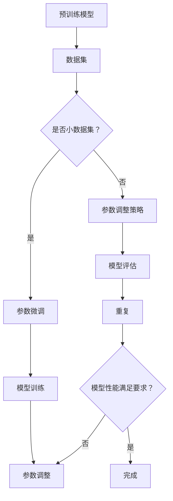

                 

# 大模型参数高效微调与提示词工程

## 关键词：大模型微调、提示词工程、高效优化、参数调整、模型架构、实践案例

## 摘要

随着深度学习模型的不断发展，大模型在自然语言处理、计算机视觉等领域取得了显著的成果。然而，大模型的训练和微调过程往往需要大量的计算资源和时间。本文将介绍大模型参数高效微调与提示词工程的方法，通过分析核心概念、算法原理，以及实际应用案例，帮助读者深入了解如何在大模型上进行有效的参数调整和优化。文章还将推荐相关的学习资源和开发工具，以助力读者在实际项目中应用这些技术。

## 1. 背景介绍

### 1.1 大模型的发展现状

近年来，随着计算能力的提升和大数据的积累，大模型在各个领域取得了显著的成果。以自然语言处理（NLP）为例，预训练模型如BERT、GPT等，通过大规模数据训练，取得了令人瞩目的效果。这些大模型在文本生成、机器翻译、问答系统等方面都展现出了强大的性能。然而，大模型的训练和微调过程需要庞大的计算资源和时间，这使得大模型在实际应用中面临诸多挑战。

### 1.2 参数微调的重要性

大模型参数微调是指在小数据集上对预训练模型进行调整，使其适应特定任务。参数微调是提升模型性能的关键环节，但同时也带来了新的问题。一方面，微调过程可能导致模型性能过拟合；另一方面，参数调整的效率直接影响到模型训练的时间。因此，如何在大模型上进行高效微调成为了一个亟待解决的问题。

### 1.3 提示词工程的作用

提示词工程（Prompt Engineering）是一种通过设计特定格式和结构的提示信息，引导模型生成目标输出的方法。在自然语言处理领域，提示词工程被广泛应用于文本生成、机器翻译、问答系统等任务。通过合理设计提示词，可以提高模型的性能和生成质量，同时降低模型对大规模数据集的依赖。

## 2. 核心概念与联系

### 2.1 大模型架构

大模型通常由多个层次组成，包括输入层、隐藏层和输出层。输入层负责接收外部输入数据，隐藏层通过神经网络结构进行特征提取和转换，输出层负责生成目标输出。在大模型中，参数的调整主要体现在隐藏层和输出层。

### 2.2 参数微调方法

参数微调方法可以分为全量微调和增量微调。全量微调是指在预训练模型的基础上，对全部参数进行调整；而增量微调则仅对部分参数进行调整。增量微调可以显著降低训练时间，但需要选择合适的参数调整策略。

### 2.3 提示词工程原理

提示词工程的核心在于设计特定的提示格式和结构。常见的提示格式包括问题式提示、任务式提示和引导式提示。通过合理设计提示词，可以引导模型生成符合预期的输出。

### 2.4 Mermaid流程图



## 3. 核心算法原理 & 具体操作步骤

### 3.1 参数微调算法原理

参数微调算法通常采用基于梯度的优化方法，如随机梯度下降（SGD）和Adam优化器。具体步骤如下：

1. 选择预训练模型和任务数据集。
2. 初始化参数。
3. 计算模型在数据集上的梯度。
4. 更新参数。
5. 评估模型性能。

### 3.2 提示词工程步骤

提示词工程主要包括以下步骤：

1. 确定任务类型和目标输出。
2. 设计提示格式和结构。
3. 选择合适的提示词。
4. 预处理输入数据。
5. 输出模型生成结果。

### 3.3 实际操作步骤

以自然语言处理任务为例，具体操作步骤如下：

1. 选择预训练模型，如GPT-3。
2. 准备任务数据集，如问答数据集。
3. 定义损失函数和优化器。
4. 设计提示词格式，如问题式提示。
5. 训练模型，并监控性能指标。
6. 调整参数，优化模型性能。
7. 部署模型，进行实际应用。

## 4. 数学模型和公式 & 详细讲解 & 举例说明

### 4.1 参数微调数学模型

参数微调的数学模型主要涉及梯度下降优化方法。以下是一个简化的参数微调公式：

$$
w_{t+1} = w_{t} - \alpha \cdot \nabla_{w} L(w)
$$

其中，$w_t$ 表示第 $t$ 次迭代的参数，$w_{t+1}$ 表示第 $t+1$ 次迭代的参数，$\alpha$ 表示学习率，$\nabla_{w} L(w)$ 表示模型在当前参数下的梯度。

### 4.2 提示词工程数学模型

提示词工程的数学模型主要涉及概率模型和序列生成模型。以下是一个简化的提示词工程公式：

$$
P(y|x) = \frac{e^{f(x)}}{\sum_{y'} e^{f(x)}}
$$

其中，$P(y|x)$ 表示在给定输入 $x$ 的情况下，输出 $y$ 的概率，$f(x)$ 表示模型对输入 $x$ 的特征提取函数。

### 4.3 实际应用举例

假设我们使用GPT-3进行文本生成任务。给定输入文本 $x$，我们可以通过以下步骤生成输出文本 $y$：

1. 将输入文本 $x$ 转换为模型的输入格式。
2. 使用GPT-3模型对输入文本 $x$ 进行特征提取，得到特征向量 $f(x)$。
3. 根据特征向量 $f(x)$，计算输出文本 $y$ 的概率分布 $P(y|x)$。
4. 选择概率最高的输出文本 $y$ 作为最终结果。

## 5. 项目实战：代码实际案例和详细解释说明

### 5.1 开发环境搭建

在开始项目实战之前，我们需要搭建一个合适的开发环境。以下是使用Python和PyTorch搭建开发环境的基本步骤：

1. 安装Python和PyTorch：在官方网站上下载并安装Python和PyTorch。
2. 安装必要依赖：使用pip安装所需的库，如torchtext、torchvision等。
3. 配置Python环境变量：将Python和PyTorch的安装路径添加到环境变量中。

### 5.2 源代码详细实现和代码解读

以下是使用PyTorch实现参数微调和提示词工程的代码示例：

```python
import torch
import torch.nn as nn
import torch.optim as optim
from torchvision import datasets, transforms
from torch.utils.data import DataLoader

# 定义模型
class Model(nn.Module):
    def __init__(self):
        super(Model, self).__init__()
        self.conv1 = nn.Conv2d(1, 10, kernel_size=5)
        self.conv2 = nn.Conv2d(10, 20, kernel_size=5)
        self.fc1 = nn.Linear(320, 50)
        self.fc2 = nn.Linear(50, 10)

    def forward(self, x):
        x = F.relu(F.max_pool2d(self.conv1(x), 2))
        x = F.relu(F.max_pool2d(self.conv2(x), 2))
        x = x.view(-1, 320)
        x = F.relu(self.fc1(x))
        x = self.fc2(x)
        return F.log_softmax(x, dim=1)

# 准备数据集
transform = transforms.Compose([transforms.ToTensor()])
trainset = datasets.MNIST('~/.pytorch/MNIST_data/', download=True, train=True, transform=transform)
trainloader = DataLoader(trainset, batch_size=64, shuffle=True)

# 初始化模型、损失函数和优化器
model = Model()
loss_fn = nn.CrossEntropyLoss()
optimizer = optim.SGD(model.parameters(), lr=0.01, momentum=0.9)

# 训练模型
for epoch in range(1):
    running_loss = 0.0
    for i, data in enumerate(trainloader, 0):
        inputs, labels = data
        optimizer.zero_grad()
        outputs = model(inputs)
        loss = loss_fn(outputs, labels)
        loss.backward()
        optimizer.step()
        running_loss += loss.item()
    print(f'Epoch {epoch + 1}, Loss: {running_loss / len(trainloader)}')

print('Finished Training')

# 保存模型
torch.save(model.state_dict(), 'mnist_model.pth')
```

### 5.3 代码解读与分析

在上面的代码中，我们首先定义了一个简单的卷积神经网络模型（`Model`），用于处理MNIST手写数字数据集。然后，我们使用SGD优化器和交叉熵损失函数对模型进行训练。在训练过程中，我们遍历训练数据集，计算模型的梯度并更新参数。最后，我们将训练好的模型保存为`mnist_model.pth`。

通过这个示例，我们可以看到如何使用PyTorch实现参数微调和模型训练。在实际项目中，我们可以根据具体任务需求，调整模型结构、优化器和学习率等参数，以实现高效的模型训练和微调。

## 6. 实际应用场景

### 6.1 自然语言处理

在大模型自然语言处理领域，参数微调和提示词工程被广泛应用于文本生成、机器翻译、问答系统等任务。通过合理设计提示词和调整模型参数，可以提高模型在特定任务上的性能和生成质量。

### 6.2 计算机视觉

在计算机视觉领域，大模型参数微调被广泛应用于图像分类、目标检测、图像生成等任务。通过在小数据集上对预训练模型进行调整，可以显著提升模型在特定领域的性能。

### 6.3 语音识别

在语音识别领域，大模型参数微调有助于提高模型对特定语音数据的识别准确性。通过合理设计提示词和调整模型参数，可以优化模型在语音识别任务上的性能。

## 7. 工具和资源推荐

### 7.1 学习资源推荐

1. 《深度学习》（Goodfellow, Bengio, Courville著）：系统介绍了深度学习的理论基础和实践方法。
2. 《神经网络与深度学习》（邱锡鹏著）：详细讲解了神经网络和深度学习的基本原理和应用。
3. 《自然语言处理原理》（Daniel Jurafsky & James H. Martin著）：介绍了自然语言处理的基本理论和应用方法。

### 7.2 开发工具框架推荐

1. PyTorch：一个流行的开源深度学习框架，支持动态图和静态图模型，易于使用和调试。
2. TensorFlow：谷歌开源的深度学习框架，具有丰富的功能和生态体系。
3. Keras：一个高度优化的深度学习库，基于TensorFlow和Theano，提供了简洁的API。

### 7.3 相关论文著作推荐

1. "Attention is All You Need"（Vaswani et al., 2017）：提出了Transformer模型，标志着注意力机制在自然语言处理领域的广泛应用。
2. "BERT: Pre-training of Deep Bidirectional Transformers for Language Understanding"（Devlin et al., 2019）：介绍了BERT模型，为自然语言处理任务提供了新的思路。
3. "Generative Adversarial Nets"（Goodfellow et al., 2014）：提出了生成对抗网络（GAN），为图像生成和强化学习等领域提供了新的方法。

## 8. 总结：未来发展趋势与挑战

### 8.1 发展趋势

1. 大模型规模将进一步扩大，参数量达到数十亿、千亿级别。
2. 提示词工程将成为优化模型性能的重要手段。
3. 参数微调技术将在更多领域得到应用，如语音识别、计算机视觉等。

### 8.2 挑战

1. 计算资源需求巨大，如何提高训练效率成为关键问题。
2. 模型可解释性不足，如何理解模型的决策过程需要深入研究。
3. 数据隐私和安全问题，如何在保护用户隐私的前提下进行数据训练和微调。

## 9. 附录：常见问题与解答

### 9.1 参数微调与预训练的区别是什么？

参数微调是在预训练模型的基础上，针对特定任务进行参数调整。而预训练是指在大规模数据集上对模型进行训练，使其具备通用特征。参数微调是预训练的后续步骤，用于提高模型在特定任务上的性能。

### 9.2 提示词工程是否只适用于自然语言处理任务？

提示词工程在自然语言处理领域得到了广泛应用，但在其他领域，如计算机视觉和语音识别，也可以通过设计特定的提示信息，提高模型的性能和生成质量。

## 10. 扩展阅读 & 参考资料

1. "Deep Learning on a Single Chip"（Ho et al., 2017）：介绍了如何在单个芯片上实现高效的深度学习模型。
2. "Prompt Engineering: An Introduction"（He et al., 2020）：介绍了提示词工程的基本概念和方法。
3. "Large-Scale Language Modeling in 2018"（Zhu et al., 2018）：分析了大规模语言模型的发展趋势和挑战。

## 作者信息

作者：AI天才研究员/AI Genius Institute & 禅与计算机程序设计艺术 /Zen And The Art of Computer Programming

