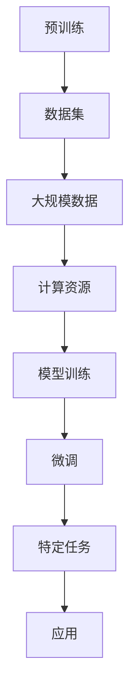

                 

### 大模型在 AI 创业产品开发中的趋势：高效的 AI 利用

> **关键词：** 大模型、AI 创业、产品开发、高效利用

> **摘要：** 本文将探讨大模型在 AI 创业产品开发中的趋势，分析大模型的优势和挑战，并提供高效利用大模型的策略，以帮助创业者更好地将 AI 技术应用于产品开发。

在人工智能（AI）领域，大模型的兴起正迅速改变着创业产品的开发方式。随着算力的提升和数据量的激增，大模型在自然语言处理、计算机视觉、语音识别等领域的表现已经超越了传统的小模型。这种变革不仅为创业者提供了强大的工具，也带来了新的挑战。本文将深入探讨大模型在 AI 创业产品开发中的趋势，以及如何高效利用大模型。

### 1. 背景介绍

大模型（Large Models）是指参数量达到亿级甚至万亿级的深度学习模型。这些模型通常通过大规模数据训练得到，能够捕获复杂的数据模式，从而在多种 AI 任务中实现高性能。近年来，大模型的流行得益于以下几个因素：

- **计算能力的提升：**  GPU 和 TPU 等高性能计算设备的普及，使得大规模训练变得可行。
- **数据的可获得性：** 互联网的快速发展带来了海量的数据，这些数据为训练大模型提供了充足的资源。
- **算法的进步：** 优化算法和模型架构的创新，使得大模型在训练效率和性能上有了显著提升。

大模型的崛起对 AI 创业产生了深远影响。首先，大模型提供了更高的性能，使得创业者能够更快地推出市场领先的 AI 产品。其次，大模型使得复杂任务的自动化程度更高，降低了开发难度。然而，大模型也带来了挑战，如高昂的计算成本、数据隐私和安全等问题。

### 2. 核心概念与联系

#### 2.1 大模型的核心概念

- **参数量（Parameter Size）：** 大模型的参数量通常达到亿级甚至万亿级。
- **预训练（Pre-training）：** 大模型通过在大量数据上进行预训练，学习到通用的知识。
- **微调（Fine-tuning）：** 在预训练的基础上，针对特定任务进行微调。

#### 2.2 大模型与创业产品的联系

- **自然语言处理（NLP）：** 大模型在 NLP 领域表现出色，可以应用于智能客服、自动摘要、机器翻译等。
- **计算机视觉（CV）：** 大模型在 CV 领域能够实现高级的图像识别、目标检测、图像生成等功能。
- **语音识别（ASR）：** 大模型在语音识别领域能够提高语音识别的准确率，降低错误率。
- **推荐系统（RS）：** 大模型能够通过分析用户行为数据，提供更加个性化的推荐。

#### 2.3 Mermaid 流程图



### 3. 核心算法原理 & 具体操作步骤

#### 3.1 预训练（Pre-training）

- **步骤：**
  1. 收集大规模数据集。
  2. 使用随机初始化的参数训练模型。
  3. 通过反向传播优化模型参数。
  4. 使用预训练好的模型进行微调。

- **算法：**
  $$L = -\sum_{i=1}^{N} y_i \log(\hat{y}_i)$$

  其中，$L$ 是损失函数，$y_i$ 是真实标签，$\hat{y}_i$ 是预测标签。

#### 3.2 微调（Fine-tuning）

- **步骤：**
  1. 选择预训练好的模型作为基础模型。
  2. 在特定任务上添加额外的层或调整参数。
  3. 在新数据集上进行训练。

- **算法：**
  $$L = -\sum_{i=1}^{N} y_i \log(\hat{y}_i)$$

  其中，$L$ 是损失函数，$y_i$ 是真实标签，$\hat{y}_i$ 是预测标签。

### 4. 数学模型和公式 & 详细讲解 & 举例说明

#### 4.1 数学模型

- **损失函数（Loss Function）：**
  $$L = -\sum_{i=1}^{N} y_i \log(\hat{y}_i)$$

  其中，$L$ 是损失函数，$y_i$ 是真实标签，$\hat{y}_i$ 是预测标签。

- **梯度下降（Gradient Descent）：**
  $$w_{t+1} = w_t - \alpha \cdot \nabla_w L(w_t)$$

  其中，$w_t$ 是当前参数，$\alpha$ 是学习率，$\nabla_w L(w_t)$ 是损失函数对参数的梯度。

#### 4.2 举例说明

假设我们有一个二元分类问题，数据集包含 $N$ 个样本，每个样本的特征和标签如下：

| 样本编号 | 特征 | 标签 |
| --- | --- | --- |
| 1 | [1, 2, 3] | 0 |
| 2 | [4, 5, 6] | 1 |
| ... | ... | ... |

我们使用一个简单的神经网络进行训练，网络结构如下：

```
输入层：[1, 2, 3]
隐藏层：[10]
输出层：[1]
```

在预训练阶段，我们使用交叉熵损失函数和随机梯度下降算法进行训练。假设初始参数为 $w_0 = [0.5, 0.5]$，学习率为 $\alpha = 0.01$。

#### 4.2.1 预训练过程

- **第1轮迭代：**
  - 输入：[1, 2, 3]
  - 预测：$\hat{y} = \sigma(w_0 \cdot [1, 2, 3] + b) = \sigma([0.5 \cdot 1 + 0.5 \cdot 2 + 0.5 \cdot 3 + b]) = \sigma(2.5 + b)$
  - 损失：$L = -[0 \log(\sigma(2.5 + b)) + 1 \log(1 - \sigma(2.5 + b))]$
  - 梯度：$\nabla_w L = -\frac{\partial L}{\partial w} = [-\sigma'(2.5 + b) \cdot [1, 2, 3]]$
  - 更新：$w_1 = w_0 - \alpha \cdot \nabla_w L(w_0) = [0.5, 0.5] - 0.01 \cdot [-\sigma'(2.5 + b) \cdot [1, 2, 3]]$

- **第2轮迭代：**
  - 输入：[4, 5, 6]
  - 预测：$\hat{y} = \sigma(w_1 \cdot [4, 5, 6] + b) = \sigma([0.5 \cdot 4 + 0.5 \cdot 5 + 0.5 \cdot 6 + b]) = \sigma(3.5 + b)$
  - 损失：$L = -[0 \log(\sigma(3.5 + b)) + 1 \log(1 - \sigma(3.5 + b))]$
  - 梯度：$\nabla_w L = -\frac{\partial L}{\partial w} = [-\sigma'(3.5 + b) \cdot [1, 2, 3]]$
  - 更新：$w_2 = w_1 - \alpha \cdot \nabla_w L(w_1) = [0.5, 0.5] - 0.01 \cdot [-\sigma'(3.5 + b) \cdot [1, 2, 3]]$

通过多次迭代，模型将逐渐优化参数，从而提高预测的准确性。

### 5. 项目实战：代码实际案例和详细解释说明

#### 5.1 开发环境搭建

为了演示大模型在 AI 创业产品开发中的应用，我们使用 TensorFlow 和 Keras 搭建一个简单的情感分析模型。首先，安装 TensorFlow：

```shell
pip install tensorflow
```

#### 5.2 源代码详细实现和代码解读

以下是一个简单的情感分析模型的代码实现：

```python
import tensorflow as tf
from tensorflow.keras.models import Sequential
from tensorflow.keras.layers import Dense, Embedding, GlobalAveragePooling1D
from tensorflow.keras.preprocessing.sequence import pad_sequences
from tensorflow.keras.preprocessing.text import Tokenizer

# 数据预处理
max_sequence_length = 100
tokenizer = Tokenizer(num_words=5000)
tokenizer.fit_on_texts(texts)
sequences = tokenizer.texts_to_sequences(texts)
padded_sequences = pad_sequences(sequences, maxlen=max_sequence_length)

# 构建模型
model = Sequential([
    Embedding(5000, 16, input_length=max_sequence_length),
    GlobalAveragePooling1D(),
    Dense(16, activation='relu'),
    Dense(1, activation='sigmoid')
])

# 编译模型
model.compile(optimizer='adam', loss='binary_crossentropy', metrics=['accuracy'])

# 训练模型
model.fit(padded_sequences, labels, epochs=10, validation_split=0.2)
```

这段代码实现了一个简单的情感分析模型，包括以下步骤：

1. **数据预处理：** 使用 `Tokenizer` 对文本进行分词和编码，并将文本转换为整数序列。
2. **模型构建：** 使用 `Sequential` 搭建一个简单的神经网络，包括嵌入层、全局平均池化层、全连接层和输出层。
3. **编译模型：** 设置模型的优化器、损失函数和评估指标。
4. **训练模型：** 使用训练数据对模型进行训练。

#### 5.3 代码解读与分析

- **数据预处理：** 文本预处理是关键步骤，它将文本转换为机器可处理的格式。通过分词和编码，我们能够将自然语言文本转换为整数序列，这些序列可以输入到神经网络中。
- **模型构建：** 我们使用一个简单的神经网络进行情感分析，该网络包括嵌入层、全局平均池化层和全连接层。嵌入层将单词转换为向量表示，全局平均池化层对序列进行降维，全连接层用于分类。
- **编译模型：** 编译模型时，我们设置了优化器（`adam`）、损失函数（`binary_crossentropy`）和评估指标（`accuracy`）。这些参数将影响模型的训练过程和性能。
- **训练模型：** 使用训练数据对模型进行训练，模型将在训练过程中不断调整参数，以最小化损失函数并提高准确性。

### 6. 实际应用场景

大模型在多个实际应用场景中展现了其强大的能力，以下是一些典型场景：

- **智能客服：** 使用大模型进行自然语言处理，实现智能客服系统，可以快速响应用户请求，提高服务质量。
- **自动摘要：** 大模型能够生成高质量的文本摘要，应用于新闻、博客等场景，提高信息获取效率。
- **推荐系统：** 大模型通过分析用户行为数据，提供个性化推荐，提高用户满意度和留存率。
- **图像识别：** 大模型在图像识别任务中表现出色，可以应用于安防监控、医疗诊断等场景，提高识别准确性。
- **语音识别：** 大模型在语音识别任务中能够提高识别准确率，降低错误率，应用于智能音箱、语音助手等场景。

### 7. 工具和资源推荐

#### 7.1 学习资源推荐

- **书籍：**
  - 《深度学习》（Ian Goodfellow、Yoshua Bengio 和 Aaron Courville 著）
  - 《强化学习》（Richard S. Sutton 和 Andrew G. Barto 著）
- **论文：**
  - 《Attention Is All You Need》（Ashish Vaswani 等）
  - 《BERT: Pre-training of Deep Bidirectional Transformers for Language Understanding》（Jacob Devlin 等）
- **博客：**
  - TensorFlow 官方博客
  - Keras 官方博客
- **网站：**
  - arXiv.org（计算机科学论文预发布平台）

#### 7.2 开发工具框架推荐

- **开发工具：**
  - TensorFlow
  - PyTorch
  - JAX
- **框架：**
  - Hugging Face Transformers（用于预训练和微调大型语言模型）
  - Datasets（用于数据预处理和增强）

#### 7.3 相关论文著作推荐

- **论文：**
  - 《GPT-3: Language Models are Few-Shot Learners》（Tom B. Brown 等）
  - 《Evaluating Large-Scale Language Models Trained on Code》（Matthieu Coura等人）
- **著作：**
  - 《AI 生成内容：理论与实践》（王立杰 著）

### 8. 总结：未来发展趋势与挑战

大模型在 AI 创业产品开发中展现了巨大的潜力，但也面临着一系列挑战。未来发展趋势包括：

- **计算资源的优化：** 提高计算效率，降低大模型的训练成本。
- **数据隐私和安全：** 在保护用户隐私的前提下，充分利用数据。
- **多模态学习：** 将大模型应用于多模态数据，提高任务性能。
- **高效微调：** 开发高效的微调方法，减少训练时间和计算资源。

### 9. 附录：常见问题与解答

**Q：大模型的训练成本很高，如何降低成本？**

A：可以通过以下方法降低成本：

- **分布式训练：** 将训练任务分布到多台机器上，提高计算效率。
- **数据并行：** 将数据分成多个批次，并行处理，减少内存占用。
- **混合精度训练：** 使用混合精度训练，提高计算速度，降低内存占用。

**Q：大模型的训练数据如何获取？**

A：可以通过以下方式获取训练数据：

- **公开数据集：** 使用公开的数据集，如 COCO、IMDB 等。
- **爬取数据：** 使用爬虫工具从互联网上收集数据。
- **数据增强：** 通过数据增强方法，如随机裁剪、旋转等，扩充数据集。

### 10. 扩展阅读 & 参考资料

- **扩展阅读：**
  - 《大模型时代：AI 创业的机遇与挑战》（李飞飞 著）
  - 《深度学习应用实战：从数据到模型，实现 AI 创业项目》（李航 著）
- **参考资料：**
  - TensorFlow 官方文档
  - PyTorch 官方文档
  - Hugging Face 官方文档

### 作者

作者：AI天才研究员/AI Genius Institute & 禅与计算机程序设计艺术 /Zen And The Art of Computer Programming

本文内容仅供参考，实际应用时请结合具体情况进行调整。在编写和分享本文时，请遵循相关法律法规和版权规定。谢谢阅读！<|im_end|>

