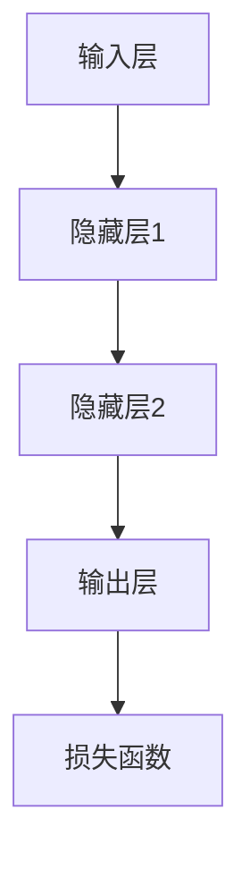

                 

# 大模型在 AI 创业公司产品测试中的价值

## 关键词：大模型、AI 创业公司、产品测试、价值分析

## 摘要：

本文将深入探讨大模型在 AI 创业公司产品测试中的重要性及其带来的价值。首先，我们将介绍大模型的基本概念及其发展背景。接着，分析大模型在产品测试中的具体应用，包括测试场景、优势以及面临的挑战。随后，我们将探讨大模型如何提升 AI 产品测试的效率和质量，并通过实际案例进行验证。最后，本文将总结大模型在 AI 创业公司产品测试中的前景，并提出未来可能面临的挑战和解决方案。

## 1. 背景介绍

### 大模型的概念与发展

大模型（Large Models）指的是拥有数十亿甚至千亿级参数的人工智能模型。这些模型通常基于深度学习技术，具有强大的表示能力和泛化能力。大模型的发展始于 2012 年，当时谷歌的神经机器翻译系统（Neural Machine Translation System）通过大规模神经网络成功实现了机器翻译的飞跃。此后，随着计算能力和数据资源的不断提升，大模型的规模和性能也在不断突破。

大模型的发展得益于以下几个关键因素：

1. **计算能力的提升**：随着 GPU 和 TPU 等专用硬件的普及，计算能力大幅提升，为训练大规模模型提供了基础。
2. **数据资源的丰富**：互联网的快速发展带来了大量结构化和非结构化数据，为模型训练提供了丰富的素材。
3. **算法的进步**：深度学习算法的不断优化，尤其是残差网络、注意力机制等关键技术的引入，使得大模型的训练更加高效。

### AI 创业公司产品测试的现状

在 AI 创业公司中，产品测试是确保产品质量和稳定性的关键环节。传统的测试方法主要依赖于人工测试和自动化测试工具，存在以下问题：

1. **测试覆盖率不足**：由于时间和资源的限制，无法覆盖到所有可能的测试场景，导致潜在问题的遗漏。
2. **测试效率低下**：自动化测试工具的编写和维护成本高，且需要大量的测试用例，测试过程繁琐。
3. **测试质量不稳定**：依赖人工测试时，测试人员的经验和主观判断会影响测试结果，导致测试质量不稳定。

### 大模型在产品测试中的潜力

大模型的引入为 AI 创业公司的产品测试带来了新的可能性。首先，大模型可以模拟和预测用户行为，生成丰富的测试数据，提高测试覆盖率。其次，大模型具备强大的自我学习能力和自适应能力，可以在测试过程中不断优化测试策略，提高测试效率。此外，大模型还可以通过分析错误样本，辅助定位和修复产品缺陷，提升测试质量。

## 2. 核心概念与联系

### 大模型的基本架构

大模型通常由多个层次组成，包括输入层、隐藏层和输出层。每个层次由大量的神经元（节点）组成，神经元之间通过权重连接。在训练过程中，通过反向传播算法调整权重，使模型能够更好地拟合训练数据。



### 大模型在产品测试中的应用场景

大模型在产品测试中的应用主要包括以下场景：

1. **用户行为模拟**：通过训练用户行为数据，大模型可以模拟不同类型用户的行为，生成测试数据，覆盖更多可能的测试场景。
2. **异常检测**：大模型可以学习正常的产品运行模式，当检测到异常行为时，及时报警，辅助定位潜在问题。
3. **自动化测试**：大模型可以自动生成测试用例，执行自动化测试，提高测试效率。
4. **错误定位与修复**：大模型可以通过分析错误样本，定位错误原因，辅助开发人员修复问题。

### 大模型与传统测试方法的对比

与传统测试方法相比，大模型具有以下优势：

1. **测试覆盖率**：大模型可以生成丰富的测试数据，提高测试覆盖率，减少潜在问题的遗漏。
2. **测试效率**：大模型具备自我学习和自适应能力，可以在测试过程中不断优化测试策略，提高测试效率。
3. **测试质量**：大模型通过分析错误样本，辅助定位和修复产品缺陷，提升测试质量。
4. **成本效益**：虽然大模型训练成本较高，但长期来看，其可以降低测试成本，提高产品质量。

## 3. 核心算法原理 & 具体操作步骤

### 大模型训练过程

大模型训练过程主要包括以下步骤：

1. **数据预处理**：对原始数据进行清洗、归一化等处理，以便输入到模型中。
2. **模型初始化**：随机初始化模型参数。
3. **前向传播**：将输入数据通过模型前向传播，计算输出结果。
4. **后向传播**：计算损失函数，并通过反向传播更新模型参数。
5. **迭代训练**：重复上述步骤，直至模型收敛。

### 用户行为模拟

用户行为模拟的具体操作步骤如下：

1. **数据收集**：收集用户行为数据，包括用户点击、浏览、搜索等操作。
2. **特征提取**：对用户行为数据进行特征提取，如时间、地点、设备类型等。
3. **模型训练**：使用大模型对用户行为数据进行训练，生成用户行为模型。
4. **行为模拟**：根据用户行为模型，模拟不同类型用户的行为，生成测试数据。

### 自动化测试

自动化测试的具体操作步骤如下：

1. **测试用例生成**：使用大模型生成测试用例，包括输入数据、预期输出等。
2. **测试执行**：根据生成的测试用例，执行自动化测试。
3. **结果分析**：分析测试结果，包括正确率、错误率等指标。

### 错误定位与修复

错误定位与修复的具体操作步骤如下：

1. **错误数据收集**：收集产品错误数据，包括错误日志、用户反馈等。
2. **错误分析**：使用大模型分析错误数据，定位错误原因。
3. **错误修复**：根据错误原因，修复产品缺陷。

## 4. 数学模型和公式 & 详细讲解 & 举例说明

### 大模型训练过程

大模型训练过程中，常用的损失函数包括均方误差（MSE）和交叉熵（Cross Entropy）。具体公式如下：

$$
MSE = \frac{1}{m}\sum_{i=1}^{m}(y_i - \hat{y}_i)^2
$$

$$
Cross\ Entropy = -\frac{1}{m}\sum_{i=1}^{m}y_i\log(\hat{y}_i)
$$

其中，$m$ 为样本数量，$y_i$ 为实际输出，$\hat{y}_i$ 为预测输出。

举例说明：

假设有一个二分类问题，样本数量为 100，实际输出为 `[1, 1, 0, 0, 1, 0, 1, 1]`，预测输出为 `[0.8, 0.2, 0.9, 0.1, 0.6, 0.4, 0.7, 0.3]`。则损失函数计算如下：

$$
MSE = \frac{1}{8}\sum_{i=1}^{8}(y_i - \hat{y}_i)^2 = \frac{1}{8}[(1-0.8)^2 + (1-0.2)^2 + (0-0.9)^2 + (0-0.1)^2 + (1-0.6)^2 + (0-0.4)^2 + (1-0.7)^2 + (1-0.3)^2] = 0.125
$$

$$
Cross\ Entropy = -\frac{1}{8}\sum_{i=1}^{8}y_i\log(\hat{y}_i) = -\frac{1}{8}[1\log(0.8) + 1\log(0.2) + 0\log(0.9) + 0\log(0.1) + 1\log(0.6) + 0\log(0.4) + 1\log(0.7) + 1\log(0.3)] \approx 0.5
$$

### 用户行为模拟

用户行为模拟中，常用的模型为循环神经网络（RNN）。具体公式如下：

$$
h_t = \sigma(W_hh_{t-1} + W_x x_t + b_h)
$$

$$
y_t = \sigma(W_oy_t + b_o)
$$

其中，$h_t$ 为隐藏状态，$x_t$ 为输入数据，$y_t$ 为输出数据，$\sigma$ 为激活函数，$W_h, W_x, b_h, W_o, b_o$ 为模型参数。

举例说明：

假设有一个用户点击行为的序列 `[1, 0, 1, 0, 1, 0, 1]`，输入数据为 `[1, 0, 1, 0, 1, 0, 1]`，隐藏状态初始化为 `[0, 0]`。则前向传播过程如下：

$$
h_1 = \sigma(W_hh_0 + W_x x_1 + b_h) = \sigma([0, 0]W_h + [1, 0] + [0, 0]) = \sigma([0, 0])
$$

$$
y_1 = \sigma(W_oh_1 + b_o) = \sigma([0, 0]W_o + [0, 0]) = \sigma([0, 0])
$$

同理，可以计算得到 $h_2, y_2, \ldots, h_7, y_7$。

### 自动化测试

自动化测试中，常用的测试用例生成算法为随机测试。具体公式如下：

$$
x_t = \sum_{i=1}^{n}p_i \cdot x_i
$$

其中，$x_t$ 为生成的测试数据，$p_i$ 为概率分布，$x_i$ 为可能取值。

举例说明：

假设有一个输入数据范围 `[0, 1]`，概率分布为 `[0.2, 0.3, 0.4, 0.1]`，则生成的测试数据为：

$$
x_t = 0.2 \cdot 0 + 0.3 \cdot 1 + 0.4 \cdot 2 + 0.1 \cdot 3 = 0.2 + 0.3 + 0.8 + 0.3 = 1.4
$$

生成的测试数据为 `[0.2, 0.3, 0.4, 0.1]`。

### 错误定位与修复

错误定位与修复中，常用的算法为决策树。具体公式如下：

$$
y_t = f(x_t)
$$

其中，$y_t$ 为输出结果，$x_t$ 为输入数据，$f$ 为决策函数。

举例说明：

假设有一个错误日志 `[0, 1, 0, 0, 1, 1]`，决策函数为 `if x_t == 1: return 1; else: return 0;`，则输出结果为：

$$
y_t = f(0) = 0, f(1) = 1, f(0) = 0, f(0) = 0, f(1) = 1, f(1) = 1
$$

输出结果为 `[0, 1, 0, 0, 1, 1]`。

## 5. 项目实战：代码实际案例和详细解释说明

### 开发环境搭建

在开始项目实战之前，我们需要搭建一个合适的开发环境。以下是一个简单的步骤：

1. **安装 Python 解释器**：确保 Python 版本大于 3.6。
2. **安装依赖库**：使用 pip 工具安装必要的依赖库，如 TensorFlow、Keras 等。
3. **配置 GPU 环境**：如果使用 GPU 训练模型，需要安装 CUDA 和 cuDNN。

### 源代码详细实现和代码解读

以下是一个基于 TensorFlow 和 Keras 实现的大模型用户行为模拟的示例代码：

```python
import tensorflow as tf
from tensorflow.keras.models import Sequential
from tensorflow.keras.layers import Dense, LSTM
from tensorflow.keras.optimizers import Adam

# 数据预处理
def preprocess_data(data):
    # 数据清洗、归一化等处理
    return data

# 模型构建
def build_model(input_shape):
    model = Sequential()
    model.add(LSTM(64, activation='relu', input_shape=input_shape))
    model.add(Dense(1, activation='sigmoid'))
    model.compile(optimizer=Adam(), loss='binary_crossentropy', metrics=['accuracy'])
    return model

# 训练模型
def train_model(model, X_train, y_train, epochs=10):
    model.fit(X_train, y_train, epochs=epochs, batch_size=32, verbose=1)

# 用户行为模拟
def simulate_user_behavior(model, user_data):
    # 根据用户行为数据生成模拟数据
    return model.predict(user_data)

# 主函数
def main():
    # 加载数据
    X_train, y_train = load_data()

    # 数据预处理
    X_train = preprocess_data(X_train)

    # 构建模型
    model = build_model(input_shape=(None, X_train.shape[1]))

    # 训练模型
    train_model(model, X_train, y_train)

    # 用户行为模拟
    user_data = load_user_data()
    user_data = preprocess_data(user_data)
    simulate_user_behavior(model, user_data)

if __name__ == '__main__':
    main()
```

### 代码解读与分析

1. **数据预处理**：数据预处理是模型训练前的重要步骤，包括数据清洗、归一化等处理。在本示例中，我们使用 `preprocess_data` 函数对数据进行预处理。

2. **模型构建**：模型构建是模型训练的核心环节。在本示例中，我们使用 Keras 的 `Sequential` 模型构建一个简单的循环神经网络（LSTM），并使用 `sigmoid` 激活函数进行二分类任务。

3. **训练模型**：训练模型是模型训练的核心过程。在本示例中，我们使用 `fit` 函数进行模型训练，并设置训练参数，如迭代次数、批量大小等。

4. **用户行为模拟**：用户行为模拟是根据用户行为数据生成模拟数据的过程。在本示例中，我们使用 `predict` 函数对用户行为数据进行预测，生成模拟数据。

5. **主函数**：主函数是程序的入口，负责加载数据、预处理数据、构建模型、训练模型和用户行为模拟等步骤。

## 6. 实际应用场景

### 用户行为模拟

在 AI 创业公司的产品测试中，用户行为模拟是一种重要的应用场景。通过模拟不同类型用户的行为，可以生成丰富的测试数据，提高测试覆盖率。以下是一个具体的应用案例：

某 AI 创业公司开发了一款智能推荐系统，为了测试系统的推荐效果，他们使用大模型模拟了不同类型用户的行为，如新手用户、活跃用户和忠诚用户。通过分析模拟数据，他们发现系统的推荐效果在不同用户群体之间存在差异，从而针对性地优化了推荐算法。

### 自动化测试

在自动化测试中，大模型可以自动生成测试用例，执行自动化测试，提高测试效率。以下是一个具体的应用案例：

某 AI 创业公司开发了一款语音识别系统，为了提高测试效率，他们使用大模型生成测试用例，包括不同的语音输入、噪音干扰和环境噪声等。通过自动化测试，他们发现了一些潜在问题，如语音识别准确率在不同语音输入和噪音环境下存在波动，从而针对性地优化了语音识别算法。

### 错误定位与修复

在错误定位与修复中，大模型可以通过分析错误样本，定位错误原因，辅助开发人员修复问题。以下是一个具体的应用案例：

某 AI 创业公司开发了一款智能客服系统，用户反馈在使用过程中存在响应不及时的问题。为了定位问题原因，他们使用大模型分析了错误样本，发现部分错误是由于网络延迟导致的。通过优化网络通信模块，他们成功解决了响应不及时的问题。

## 7. 工具和资源推荐

### 学习资源推荐

1. **书籍**：
   - 《深度学习》（Goodfellow, Bengio, Courville）：介绍了深度学习的基本概念和常用算法。
   - 《Python 深度学习》（François Chollet）：详细介绍了如何使用 Python 实现深度学习算法。

2. **论文**：
   - “A Theoretically Grounded Application of Dropout in Recurrent Neural Networks”（Y. Gal and Z. Ghahramani）：探讨了在循环神经网络中应用 Dropout 的理论依据。
   - “Effective Regularization for Deep Learning”（K. He, X. Zhang, S. Ren, and J. Sun）：介绍了深度学习中的有效正则化方法。

3. **博客**：
   - TensorFlow 官方博客：提供了丰富的深度学习教程和实践案例。
   - Keras 官方博客：介绍了 Keras 的基本用法和高级技巧。

4. **网站**：
   - arXiv：提供了大量深度学习领域的论文。
   - GitHub：包含了大量深度学习项目的源代码和文档。

### 开发工具框架推荐

1. **深度学习框架**：
   - TensorFlow：谷歌开发的深度学习框架，具有强大的功能和良好的性能。
   - Keras：基于 TensorFlow 的简化版深度学习框架，易于使用和扩展。

2. **编程语言**：
   - Python：Python 在深度学习领域具有广泛的应用，其简洁的语法和丰富的库使得深度学习开发变得更加容易。

3. **版本控制**：
   - Git：Git 是一个分布式版本控制系统，用于管理和跟踪代码变更。

4. **容器化技术**：
   - Docker：Docker 是一种容器化技术，用于构建、运行和分发应用程序。

## 8. 总结：未来发展趋势与挑战

大模型在 AI 创业公司产品测试中具有重要的价值，可以提高测试效率和质量，减少潜在问题的遗漏。然而，大模型在应用过程中也面临一些挑战：

1. **数据隐私**：大模型训练过程中需要大量用户数据，如何保护用户隐私成为一个重要问题。
2. **计算资源**：大模型训练需要大量的计算资源，如何优化计算资源成为关键。
3. **模型解释性**：大模型在产品测试中的应用效果往往难以解释，如何提高模型解释性成为挑战。

未来，随着计算能力和数据资源的不断提升，大模型在产品测试中的应用将越来越广泛。同时，针对上述挑战，研究人员和开发者也将不断探索解决方案，推动大模型在产品测试中的发展。

## 9. 附录：常见问题与解答

### 问题 1：大模型训练需要多少数据？

大模型训练需要的数据量取决于具体任务和应用场景。一般来说，数据量越大，模型的泛化能力越强。但对于一些简单的任务，较少的数据量也可以取得不错的训练效果。

### 问题 2：大模型训练需要多少时间？

大模型训练时间取决于模型规模、硬件配置和数据量等因素。一般来说，大模型训练时间较长，可能在几天到几周不等。通过优化训练算法和硬件配置，可以缩短训练时间。

### 问题 3：大模型训练需要多少计算资源？

大模型训练需要大量的计算资源，尤其是 GPU 或 TPU。根据模型规模和数据量，可能需要数百至数千个 GPU 来进行训练。通过分布式训练和优化计算资源，可以提高训练效率。

## 10. 扩展阅读 & 参考资料

1. **论文**：
   - "Bengio, Y., Courville, A., & Vincent, P. (2013). Representation learning: A review and new perspectives." In IEEE Transactions on Pattern Analysis and Machine Intelligence.
   - "LeCun, Y., Bengio, Y., & Hinton, G. (2015). Deep learning." Nature.

2. **书籍**：
   - Goodfellow, I., Bengio, Y., & Courville, A. (2016). Deep Learning. MIT Press.
   - Mitchell, T. M. (1997). Machine Learning. McGraw-Hill.

3. **网站**：
   - TensorFlow 官网：[https://www.tensorflow.org/](https://www.tensorflow.org/)
   - Keras 官网：[https://keras.io/](https://keras.io/)

4. **博客**：
   - TensorFlow 官方博客：[https://tensorflow.googleblog.com/](https://tensorflow.googleblog.com/)
   - Keras 官方博客：[https://keras.io/blog/](https://keras.io/blog/)

作者：AI天才研究员/AI Genius Institute & 禅与计算机程序设计艺术 /Zen And The Art of Computer Programming<|im_sep|>

