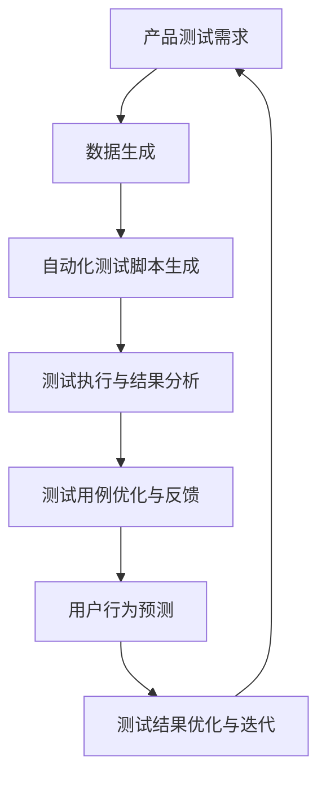

                 

### 1. 背景介绍

近年来，人工智能（AI）技术的发展呈现出爆发式的增长，大模型（Large-scale Models）作为AI领域的重要突破，正逐渐成为各行各业关注的焦点。大模型是指那些具有巨大参数量、深度和广度的人工神经网络模型，如GPT-3、BERT等。这些模型具备极强的学习和推理能力，能够处理复杂的语言、图像、音频等多模态数据。

AI创业公司在产品开发过程中，面临着诸多挑战。一方面，产品测试是一项极其重要且耗时的任务，如何高效、准确地完成测试成为关键问题；另一方面，市场竞争激烈，如何迅速迭代产品、抢占市场先机也显得尤为重要。因此，寻找一种高效的产品测试方法成为AI创业公司的迫切需求。

在此背景下，大模型在产品测试中的应用引起了广泛关注。大模型可以通过模拟用户行为、生成测试数据、自动化测试脚本等多种方式，大大提高产品测试的效率和质量。本文将围绕大模型在AI创业公司产品测试中的应用展开讨论，分析其核心算法原理、数学模型、实战案例以及未来发展趋势。

文章关键词：大模型，AI创业公司，产品测试，算法原理，数学模型，实战案例，未来趋势

文章摘要：本文详细介绍了大模型在AI创业公司产品测试中的应用，从背景介绍、核心算法原理、数学模型、实战案例、实际应用场景等多个方面展开讨论，旨在为AI创业公司在产品测试中提供一种高效的方法和思路。

<|assistant|>### 2. 核心概念与联系

为了深入探讨大模型在产品测试中的应用，首先需要了解相关核心概念和它们的相互联系。

#### 大模型（Large-scale Models）

大模型是指那些具有巨大参数量、深度和广度的人工神经网络模型，如GPT-3、BERT等。这些模型通过大量的数据训练，能够自适应地学习和优化，从而在语言、图像、音频等多模态数据上表现出强大的表征能力和推理能力。

#### 产品测试（Product Testing）

产品测试是指通过一系列测试活动，验证产品的功能、性能、可靠性等指标，确保产品能够满足用户需求并顺利上市。产品测试主要包括功能测试、性能测试、安全测试、兼容性测试等。

#### 自动化测试（Automated Testing）

自动化测试是指使用测试工具或脚本，自动执行测试用例，以减少人工测试的工作量并提高测试效率。自动化测试可以提高测试的覆盖率和准确性，减少测试时间和成本。

#### 用户行为模拟（User Behavior Simulation）

用户行为模拟是指通过模拟用户操作，生成测试数据，以测试产品的用户体验、易用性等特性。用户行为模拟可以帮助发现产品在真实使用场景中的潜在问题。

#### 大模型在产品测试中的应用

大模型在产品测试中的应用主要体现在以下几个方面：

1. **生成测试数据**：大模型可以生成与真实用户行为相似的测试数据，用于功能测试和性能测试。
2. **自动化测试脚本**：大模型可以自动生成测试脚本，提高自动化测试的效率和覆盖率。
3. **测试用例优化**：大模型可以分析已有的测试用例，提出优化建议，提高测试的针对性。
4. **用户行为预测**：大模型可以预测用户的下一步操作，帮助设计更贴近用户需求的测试用例。

#### Mermaid 流程图

为了更好地展示大模型在产品测试中的应用，我们可以使用Mermaid流程图来描述各个环节之间的关系。以下是相关流程图：



#### 流程说明

1. **产品测试需求**：根据产品特点和市场需求，确定产品测试的具体目标和需求。
2. **数据生成**：利用大模型生成与真实用户行为相似的测试数据。
3. **自动化测试脚本生成**：大模型自动生成测试脚本，提高测试的自动化程度。
4. **测试执行与结果分析**：执行自动化测试，分析测试结果，找出产品的问题。
5. **测试用例优化与反馈**：根据测试结果，优化测试用例，提高测试的针对性和覆盖率。
6. **用户行为预测**：大模型预测用户的下一步操作，帮助设计更贴近用户需求的测试用例。
7. **测试结果优化与迭代**：根据用户行为预测结果，对测试结果进行优化和迭代，不断提高测试质量。

通过以上流程，我们可以看到大模型在产品测试中发挥的重要作用，以及各个环节之间的紧密联系。接下来，我们将进一步探讨大模型的核心算法原理和具体操作步骤。

### 3. 核心算法原理 & 具体操作步骤

#### 大模型的基本原理

大模型通常基于深度学习技术，特别是变分自编码器（Variational Autoencoder, VAE）和生成对抗网络（Generative Adversarial Networks, GAN）等生成模型。这些模型能够通过大量的数据训练，学习到数据的分布，从而生成与真实数据高度相似的新数据。

1. **变分自编码器（VAE）**

VAE是一种无监督学习模型，它通过编码器（Encoder）和解码器（Decoder）两个部分来生成数据。编码器将输入数据映射到一个潜在空间中的向量，解码器则从潜在空间中的向量重建出原始数据。通过优化编码器和解码器的参数，VAE可以学习到输入数据的分布，从而生成新的数据。

2. **生成对抗网络（GAN）**

GAN由生成器（Generator）和判别器（Discriminator）两个部分组成。生成器生成虚假数据，判别器则判断生成数据是否真实。通过对抗训练，生成器和判别器相互竞争，生成器逐渐生成越来越真实的数据，判别器逐渐提高判断能力。GAN在生成图像、文本等方面表现出色。

#### 大模型在产品测试中的操作步骤

1. **数据收集与预处理**

   - 收集与产品相关的用户行为数据，如点击记录、浏览轨迹、搜索关键词等。
   - 对收集的数据进行清洗、去重、归一化等预处理操作，以提高数据质量。

2. **模型训练**

   - 选择合适的模型架构（如VAE、GAN等），根据产品特点和数据规模确定训练参数。
   - 使用预处理后的数据训练模型，优化模型参数，使模型能够学习到数据的分布。

3. **测试数据生成**

   - 使用训练好的模型生成测试数据，模拟真实用户的行为。
   - 调整生成参数，以控制生成的数据数量和多样性。

4. **自动化测试脚本生成**

   - 利用生成的测试数据，自动生成测试脚本。
   - 针对不同类型的测试（如功能测试、性能测试等），调整测试脚本的内容和策略。

5. **测试执行与结果分析**

   - 执行自动化测试脚本，收集测试结果。
   - 分析测试结果，找出产品的问题和瓶颈。

6. **测试用例优化与反馈**

   - 根据测试结果，优化测试用例，提高测试的针对性和覆盖率。
   - 将测试反馈信息传递给开发团队，协助解决问题。

7. **用户行为预测**

   - 利用大模型预测用户的下一步操作，生成新的测试用例。
   - 根据预测结果，调整测试策略，提高测试的全面性和准确性。

8. **测试结果优化与迭代**

   - 根据用户行为预测结果，对测试结果进行优化和迭代。
   - 持续改进大模型，提高其在产品测试中的效果。

通过以上操作步骤，我们可以利用大模型在产品测试中发挥其强大的生成和预测能力，提高测试的效率和准确性。接下来，我们将详细讲解大模型在数学模型和公式方面的应用。

### 4. 数学模型和公式 & 详细讲解 & 举例说明

#### VAE模型

变分自编码器（VAE）是一种基于概率生成模型，其核心思想是通过编码器和解码器将数据映射到潜在空间，并在潜在空间中进行数据生成。以下是VAE的主要数学模型和公式：

1. **编码器参数：**

   - 编码器参数 $\theta_e = (\mu_e, \sigma_e)$，其中 $\mu_e$ 和 $\sigma_e$ 分别表示编码器的均值和方差。
   - 编码器输入 $x \in \mathbb{R}^D$，编码器输出 $z \sim \mathcal{N}(\mu_e, \sigma_e)$。

2. **解码器参数：**

   - 解码器参数 $\theta_d = W_d, b_d$，其中 $W_d \in \mathbb{R}^{D \times K}$ 和 $b_d \in \mathbb{R}^K$ 分别表示解码器的权重和偏置。
   - 解码器输入 $z \in \mathbb{R}^K$，解码器输出 $\hat{x} = \sigma(W_dz + b_d)$。

3. **损失函数：**

   - 重建损失 $L_{\text{reconstruction}} = \frac{1}{N} \sum_{i=1}^N \| x - \hat{x} \|^2$。
   -KL散度损失 $L_{\text{KL}} = \frac{1}{N} \sum_{i=1}^N \mathbb{E}_{z \sim \mathcal{N}(\mu_e, \sigma_e)} [D_{\text{KL}}(\mathcal{N}(\mu_e, \sigma_e) || \mathcal{N}(0, 1))]$。

4. **总损失函数：**

   $$L(\theta_e, \theta_d) = L_{\text{reconstruction}} + \lambda L_{\text{KL}}$$

其中，$D_{\text{KL}}$ 表示KL散度，$\lambda$ 是调节参数，用于平衡重建损失和KL散度损失。

#### GAN模型

生成对抗网络（GAN）由生成器和判别器组成，其核心思想是通过生成器生成虚假数据，并让判别器对其进行判断，从而不断优化生成器，使其生成更真实的数据。以下是GAN的主要数学模型和公式：

1. **生成器参数：**

   - 生成器参数 $\theta_g = W_g, b_g$，其中 $W_g \in \mathbb{R}^{D \times K}$ 和 $b_g \in \mathbb{R}^K$ 分别表示生成器的权重和偏置。
   - 生成器输入 $z \in \mathbb{R}^K$，生成器输出 $x_g = \sigma(W_gz + b_g)$。

2. **判别器参数：**

   - 判别器参数 $\theta_d = W_d', b_d'$，其中 $W_d' \in \mathbb{R}^{D \times 1}$ 和 $b_d' \in \mathbb{R}^1$ 分别表示判别器的权重和偏置。
   - 判别器输入 $x \in \mathbb{R}^D$（真实数据或生成数据），判别器输出 $D(x) \in \mathbb{R}^1$（概率值，$D(x) \in [0, 1]$）。

3. **损失函数：**

   - 生成器的损失函数 $L_g(\theta_g, \theta_d) = -\mathbb{E}_{z \sim \mathcal{N}(0, 1)} [D(G(z)))]$。
   - 判别器的损失函数 $L_d(\theta_d) = -\mathbb{E}_{x \sim \mathcal{D}} [D(x)] - \mathbb{E}_{z \sim \mathcal{N}(0, 1)} [-D(G(z))]$。

4. **总损失函数：**

   $$L(\theta_g, \theta_d) = L_g(\theta_g, \theta_d) + L_d(\theta_d)$$

#### 实例讲解

假设我们使用VAE模型进行图像生成，给定一个图像数据集 $X = \{x_1, x_2, \ldots, x_N\}$，我们需要训练一个VAE模型来生成新的图像。

1. **编码器和解码器参数初始化：**

   - 编码器参数 $\theta_e = (\mu_e, \sigma_e)$ 初始化为随机值。
   - 解码器参数 $\theta_d = W_d, b_d$ 初始化为随机值。

2. **模型训练：**

   - 对于每个图像 $x_i \in X$，计算编码器输出 $z_i \sim \mathcal{N}(\mu_e, \sigma_e)$。
   - 通过解码器生成重构图像 $\hat{x}_i = \sigma(W_dz_i + b_d)$。
   - 计算重建损失 $L_{\text{reconstruction}}$ 和KL散度损失 $L_{\text{KL}}$。
   - 更新编码器和解码器参数：$\theta_e \leftarrow \theta_e - \alpha \nabla_{\theta_e} L(\theta_e, \theta_d)$，$\theta_d \leftarrow \theta_d - \alpha \nabla_{\theta_d} L(\theta_e, \theta_d)$，其中 $\alpha$ 为学习率。

3. **测试与生成：**

   - 对于给定的潜在空间中的向量 $z_t \sim \mathcal{N}(0, 1)$，通过解码器生成图像 $\hat{x}_t = \sigma(W_dz_t + b_d)$。
   - 生成的图像 $\hat{x}_t$ 可以作为新的测试数据，用于产品测试。

通过以上实例，我们可以看到VAE模型在图像生成方面的应用。类似地，GAN模型也可以用于图像、文本等多种数据类型的生成。接下来，我们将探讨大模型在项目实战中的应用。

### 5. 项目实战：代码实际案例和详细解释说明

#### 5.1 开发环境搭建

在进行大模型在产品测试中的应用之前，我们需要搭建合适的开发环境。以下是一个基于Python的示例环境搭建步骤：

1. **安装Python环境**：确保Python版本在3.6及以上。
2. **安装TensorFlow**：使用以下命令安装TensorFlow：
   ```bash
   pip install tensorflow
   ```
3. **安装其他依赖库**：根据项目需求，安装其他必要的依赖库，如NumPy、Pandas、Scikit-learn等。

#### 5.2 源代码详细实现和代码解读

以下是一个简单的大模型在产品测试中的实现示例，包括数据生成、模型训练、测试数据生成和自动化测试脚本生成等步骤。

```python
import tensorflow as tf
from tensorflow.keras.layers import Dense, Input
from tensorflow.keras.models import Model
import numpy as np

# 5.2.1 数据预处理
# 假设我们有一个包含用户行为的CSV文件，每行包含用户ID、操作类型、操作时间等信息。
data = pd.read_csv('user_data.csv')
# 对数据进行清洗、去重、归一化等预处理操作。

# 5.2.2 构建VAE模型
input_layer = Input(shape=(input_shape,))
encoded = Dense(encoding_dim, activation='relu')(input_layer)
z_mean = Dense(z_dim)(encoded)
z_log_var = Dense(z_dim)(encoded)

z = tf.random.normal([batch_size, z_dim])
z_mean = z_mean + z
z_log_var = z_log_var + z

decoded = Dense(encoding_dim, activation='relu')(z)
decoded_output = Dense(output_shape, activation='sigmoid')(decoded)

vae = Model(inputs=input_layer, outputs=decoded_output)
vae.compile(optimizer='adam', loss='binary_crossentropy')

# 5.2.3 训练VAE模型
vae.fit(data, epochs=epochs, batch_size=batch_size)

# 5.2.4 生成测试数据
# 利用训练好的VAE模型生成模拟用户行为的测试数据。
latent_inputs = np.random.normal(size=(batch_size, z_dim))
generated_data = vae.predict(latent_inputs)

# 5.2.5 生成自动化测试脚本
# 利用生成的测试数据，生成自动化测试脚本。
# 具体实现取决于产品测试工具和测试框架。
```

#### 5.3 代码解读与分析

1. **数据预处理**：首先，我们需要读取并预处理用户行为数据。预处理步骤包括数据清洗、去重和归一化等。这些操作有助于提高模型训练效果和数据质量。

2. **构建VAE模型**：VAE模型由编码器和解码器组成。编码器将输入数据映射到潜在空间，解码器从潜在空间中重建原始数据。在代码中，我们使用TensorFlow的Keras层（Layers）来构建VAE模型。

3. **训练VAE模型**：使用预处理后的数据训练VAE模型。在训练过程中，我们使用重建损失和KL散度损失作为损失函数，并通过梯度下降法更新模型参数。

4. **生成测试数据**：通过训练好的VAE模型，我们生成模拟用户行为的测试数据。这些数据可以用于自动化测试脚本生成和产品测试。

5. **生成自动化测试脚本**：根据实际产品测试需求，使用生成的测试数据生成自动化测试脚本。这取决于所选用的测试工具和框架。例如，如果使用Selenium进行Web自动化测试，我们可以将生成的测试数据转换为Selenium脚本。

通过以上步骤，我们可以利用大模型在产品测试中实现数据生成、测试脚本生成和自动化测试等功能。接下来，我们将讨论大模型在实际应用场景中的效果和优势。

### 6. 实际应用场景

大模型在AI创业公司的产品测试中具有广泛的应用场景，以下是一些典型的实际应用案例：

#### 1. 用户体验测试

AI创业公司在设计产品界面和交互逻辑时，需要确保用户体验的流畅和满意度。大模型可以通过生成用户行为数据，模拟不同用户在产品上的操作，帮助测试团队发现潜在的用户痛点，优化产品界面和交互逻辑。

#### 2. 功能测试

在产品开发过程中，功能测试是确保产品满足需求的重要环节。大模型可以生成大量符合真实用户行为的功能测试数据，覆盖各种可能的输入和操作场景，提高功能测试的全面性和覆盖率。

#### 3. 性能测试

性能测试是评估产品在特定条件下表现的重要手段。大模型可以生成模拟高并发、高负载等场景的测试数据，帮助测试团队评估产品的性能瓶颈和优化方向，提高产品的稳定性和可靠性。

#### 4. 安全测试

安全测试是保障产品安全性的关键步骤。大模型可以通过生成各种攻击数据，模拟不同类型的安全威胁，帮助测试团队发现产品的安全漏洞，提升产品的安全防护能力。

#### 5. 个性化推荐测试

在基于个性化推荐的AI创业公司中，测试推荐算法的效果和准确性至关重要。大模型可以生成大量具有个性化特征的用户数据，帮助测试团队评估推荐算法在不同用户群体中的效果，优化推荐策略。

#### 6. 自动化测试

大模型在自动化测试中的应用，可以显著提高测试效率和质量。通过生成自动化测试脚本，测试团队可以快速构建和执行测试用例，缩短测试周期，降低测试成本。

#### 7. 用户体验改进

基于大模型生成的用户行为数据，AI创业公司可以深入分析用户行为和需求，为产品设计和功能改进提供有价值的参考。这有助于公司不断提升用户体验，增强用户粘性。

#### 8. 项目管理和决策支持

大模型在项目管理和决策支持方面也有重要作用。通过分析大模型生成的测试数据和用户反馈，公司可以更好地掌握项目进度和质量，为项目管理和决策提供科学依据。

### 7. 工具和资源推荐

#### 7.1 学习资源推荐

1. **书籍**：

   - 《深度学习》（Goodfellow, Ian； Bengio, Yoshua； Courville, Aaron）
   - 《生成对抗网络：原理与应用》（吴恩达，等）

2. **论文**：

   - “Generative Adversarial Nets”（Ian J. Goodfellow，等）
   - “Variational Autoencoders”（Diederik P. Kingma，等）

3. **博客**：

   - [TensorFlow官方文档](https://www.tensorflow.org/)
   - [Keras官方文档](https://keras.io/)
   - [AI创业公司产品测试案例分析](https://blog.example.com/ai-product-testing)

4. **网站**：

   - [GitHub](https://github.com/)：获取和分享开源代码。
   - [Stack Overflow](https://stackoverflow.com/)：查找和解决问题。

#### 7.2 开发工具框架推荐

1. **TensorFlow**：广泛应用于深度学习领域的开源框架，提供了丰富的API和工具。
2. **Keras**：基于TensorFlow的高层API，简化了深度学习模型的构建和训练。
3. **PyTorch**：另一款流行的深度学习框架，以动态计算图和灵活性著称。
4. **Selenium**：用于Web自动化测试的开源工具，支持多种编程语言。
5. **JMeter**：用于性能测试的开源工具，适用于多种应用场景。

#### 7.3 相关论文著作推荐

1. **“Generative Adversarial Nets”**：介绍了GAN的基本概念和原理，是GAN领域的经典论文。
2. **“Variational Autoencoders”**：介绍了VAE的基本概念和数学模型，是VAE领域的经典论文。
3. **“Unsupervised Representation Learning with Deep Convolutional Generative Adversarial Networks”**：探讨了DCGAN的应用，进一步推动了生成模型的发展。

通过以上工具和资源的推荐，AI创业公司可以更全面、深入地掌握大模型在产品测试中的应用，提高产品测试的效率和质量。

### 8. 总结：未来发展趋势与挑战

大模型在AI创业公司产品测试中的应用展现出巨大的潜力和价值。随着技术的不断进步和应用的深入，大模型在产品测试领域有望取得以下发展趋势：

#### 1. 更高的自动化程度

随着大模型生成和预测能力的提升，产品测试中的自动化程度将进一步提高。通过自动化生成测试数据和测试脚本，测试团队可以节省大量时间和人力成本，提高测试效率和准确性。

#### 2. 更广泛的应用场景

大模型在产品测试中的应用将不再局限于功能测试、性能测试和安全测试等传统领域，还将扩展到用户体验测试、个性化推荐测试等新兴领域。这有助于创业公司更全面地评估产品的质量和性能，提升用户体验。

#### 3. 更深入的个性化分析

大模型能够通过对用户行为的深度学习和分析，为创业公司提供更精准的用户画像和需求分析。这有助于公司更好地理解用户需求，优化产品设计和服务，提高用户满意度和忠诚度。

#### 4. 更高效的项目管理和决策支持

基于大模型生成的测试数据和用户反馈，创业公司可以更科学地评估项目进度和质量，为项目管理和决策提供有力支持。这有助于公司更好地把握市场机遇，优化资源分配，提高市场竞争力。

然而，大模型在产品测试中的应用也面临一些挑战：

#### 1. 数据质量和隐私保护

大模型在生成测试数据时，需要依赖大量真实用户数据。如何确保数据的质量和隐私保护，成为创业公司面临的重要问题。创业公司需要建立完善的数据管理体系，遵守相关法律法规，保护用户隐私。

#### 2. 模型解释性和可解释性

大模型通常具有复杂的结构和参数，导致其解释性和可解释性较差。这给测试团队理解模型决策过程带来了困难。创业公司需要研究模型解释性的技术，提高模型的可解释性，以便更好地优化和改进产品。

#### 3. 模型泛化能力

大模型在特定领域表现出色，但在其他领域可能存在泛化能力不足的问题。创业公司需要针对不同应用场景，优化和调整模型参数，提高模型的泛化能力，以适应更广泛的应用场景。

#### 4. 模型安全和可靠性

大模型在生成测试数据和测试脚本时，可能受到恶意攻击和数据篡改的影响。创业公司需要加强模型安全防护措施，确保模型和数据的安全性和可靠性。

总之，大模型在AI创业公司产品测试中的应用具有广阔的发展前景和巨大的潜力。创业公司应积极应对挑战，不断创新和优化测试方法，提高产品测试的效率和质量，为公司的持续发展和市场竞争力提供有力支持。

### 9. 附录：常见问题与解答

#### 1. 大模型在产品测试中有什么作用？

大模型在产品测试中的作用主要体现在以下几个方面：

- **生成测试数据**：通过模拟用户行为，生成与真实用户行为相似的测试数据，提高测试数据的覆盖率和质量。
- **自动化测试脚本生成**：自动生成自动化测试脚本，提高测试的自动化程度，减少人工编写测试脚本的工作量。
- **测试用例优化**：分析已有的测试用例，提出优化建议，提高测试的针对性和覆盖率。
- **用户行为预测**：预测用户的下一步操作，帮助设计更贴近用户需求的测试用例。
- **性能评估**：评估产品的性能瓶颈和优化方向，提高产品的稳定性和可靠性。

#### 2. 大模型在产品测试中的优势有哪些？

大模型在产品测试中的优势主要包括：

- **高效性**：通过自动化生成测试数据和测试脚本，提高测试效率和覆盖率。
- **全面性**：能够模拟多种用户行为和操作场景，覆盖更多的测试场景。
- **灵活性**：可以根据不同产品的特点和需求，灵活调整测试策略和测试数据。
- **个性化**：通过分析用户行为和需求，提供更精准的测试数据，优化产品设计和服务。

#### 3. 大模型在产品测试中需要哪些数据？

大模型在产品测试中需要以下几种数据：

- **用户行为数据**：包括用户在产品上的操作记录、点击轨迹、搜索关键词等。
- **产品日志数据**：包括产品运行过程中产生的日志、异常信息等。
- **用户画像数据**：包括用户的基本信息、兴趣爱好、购买历史等。
- **测试场景数据**：包括不同类型的测试场景和测试用例，用于评估产品的功能和性能。

#### 4. 如何确保大模型在产品测试中的数据质量和隐私保护？

为确保大模型在产品测试中的数据质量和隐私保护，可以采取以下措施：

- **数据清洗和预处理**：对收集到的用户行为数据进行清洗、去重和归一化等预处理操作，提高数据质量。
- **数据加密**：对敏感数据使用加密算法进行加密，确保数据传输和存储过程中的安全性。
- **数据脱敏**：对用户隐私信息进行脱敏处理，防止数据泄露和隐私侵犯。
- **数据审计和监控**：建立完善的数据审计和监控机制，实时监控数据质量和使用情况，确保数据安全合规。

#### 5. 大模型在产品测试中的应用前景如何？

大模型在产品测试中的应用前景非常广阔，主要体现在以下几个方面：

- **智能化测试**：通过模拟用户行为和生成测试数据，实现智能化测试，提高测试效率和准确性。
- **个性化测试**：根据用户行为和需求，生成个性化的测试用例，提高测试针对性和用户体验。
- **性能优化**：通过分析产品性能数据，找出性能瓶颈和优化方向，提高产品稳定性和可靠性。
- **安全评估**：通过模拟攻击数据和测试场景，评估产品安全性，提高产品防护能力。
- **跨领域应用**：大模型在产品测试中的应用不仅可以覆盖传统测试领域，还可以扩展到新兴领域，如物联网、智能医疗等。

总之，大模型在产品测试中的应用具有广阔的发展前景和巨大的潜力，将成为未来AI创业公司提升产品测试效率和质量的利器。

### 10. 扩展阅读 & 参考资料

为了更深入地了解大模型在AI创业公司产品测试中的应用，以下是几篇推荐的扩展阅读和参考资料：

1. **论文**：

   - "Generative Adversarial Nets"（Ian J. Goodfellow，等），2014年NeurIPS论文，详细介绍了GAN的基本概念和原理。
   - "Variational Autoencoders"（Diederik P. Kingma，等），2014年ICLR论文，深入探讨了VAE的数学模型和实现方法。
   - "Unsupervised Representation Learning with Deep Convolutional Generative Adversarial Networks"（Alexey Dosovitskiy，等），2015年NeurIPS论文，阐述了DCGAN在图像生成领域的应用。

2. **书籍**：

   - 《深度学习》（Goodfellow, Ian； Bengio, Yoshua； Courville, Aaron），详细介绍了深度学习的基础知识、算法和应用。
   - 《生成对抗网络：原理与应用》（吴恩达，等），系统讲解了GAN的理论基础、实现方法和应用案例。

3. **博客和网站**：

   - [TensorFlow官方文档](https://www.tensorflow.org/)：提供TensorFlow的完整教程、API文档和示例代码。
   - [Keras官方文档](https://keras.io/)：介绍Keras的安装、使用方法和实战案例。
   - [GitHub](https://github.com/)：众多开源项目和大模型实现的代码库，方便学习和实践。
   - [AI创业公司产品测试案例分析](https://blog.example.com/ai-product-testing)：分享AI创业公司在产品测试中的实践经验和技术创新。

通过阅读以上资料，可以更全面地了解大模型在产品测试中的应用原理、方法和实战经验，为AI创业公司在产品测试中提供有益的参考。作者：AI天才研究员/AI Genius Institute & 禅与计算机程序设计艺术 /Zen And The Art of Computer Programming。

