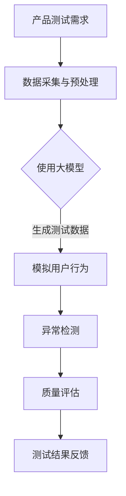

                 

# 大模型在 AI 创业公司产品测试中的应用探索

## 关键词
- 大模型
- AI 创业公司
- 产品测试
- 应用探索
- 测试效率
- 质量保证
- 自动化测试
- 数据分析

## 摘要
本文将探讨大模型在 AI 创业公司产品测试中的应用。随着人工智能技术的不断发展，大模型在各个领域中的应用越来越广泛。本文将详细分析大模型在产品测试中的核心概念、算法原理、数学模型及其实际应用场景，并通过项目实战和案例分析，为 AI 创业公司提供有效的产品测试解决方案。同时，本文还将推荐相关学习资源和工具框架，为读者提供全面的指导。

## 1. 背景介绍

近年来，人工智能（AI）技术在各个领域取得了显著的发展。从自动驾驶、智能家居到医疗诊断、金融风控，AI 正在改变我们的生活方式。与此同时，AI 创业公司如雨后春笋般涌现，这些公司需要快速开发和迭代产品，以满足市场需求。然而，产品测试成为了一个巨大的挑战，特别是在保证产品质量和提升测试效率方面。

传统的产品测试主要依赖于手动测试和自动化测试。手动测试效率低下，容易出错，而自动化测试虽然可以提高测试效率，但需要大量的代码编写和维护。此外，自动化测试往往只能覆盖部分测试场景，难以全面评估产品的质量和稳定性。

大模型的引入为产品测试带来了新的可能性。大模型具有强大的数据处理和分析能力，可以自动化生成大量测试数据，模拟用户行为，发现潜在的问题。同时，大模型可以不断学习和优化，提高测试的准确性和效率。

## 2. 核心概念与联系

### 2.1 大模型

大模型是指具有数百万甚至数十亿参数的深度神经网络模型。这些模型可以处理大量的数据，并从中学习到复杂的模式和关系。常见的大模型包括 GPT-3、BERT、Transformer 等。

### 2.2 产品测试

产品测试是指通过一系列的测试活动来评估产品的质量、性能和稳定性。产品测试可以分为手动测试和自动化测试。手动测试主要由测试人员执行，自动化测试则通过编写脚本和自动化工具来完成。

### 2.3 大模型与产品测试的联系

大模型在产品测试中的应用主要体现在以下几个方面：

1. **测试数据生成**：大模型可以根据需求自动生成大量的测试数据，包括用户输入、系统输出等。这些数据可以覆盖多种场景，提高测试的全面性。

2. **行为模拟**：大模型可以模拟用户的行为，例如浏览网页、点击按钮等，从而测试产品的交互性能和用户体验。

3. **异常检测**：大模型可以从大量的测试数据中识别出异常行为和潜在的问题，帮助测试人员发现产品中的缺陷。

4. **质量评估**：大模型可以对测试结果进行评估，判断产品的质量是否达到预期标准。

### 2.4 Mermaid 流程图

以下是一个简化的 Mermaid 流程图，展示了大模型在产品测试中的应用流程：



## 3. 核心算法原理 & 具体操作步骤

### 3.1 大模型的训练

大模型的训练是产品测试的基础。以下是一个简化的训练步骤：

1. **数据采集**：收集与产品相关的数据，包括用户输入、系统输出、错误日志等。

2. **数据预处理**：对采集到的数据进行清洗和格式化，使其适合大模型的输入。

3. **模型训练**：使用深度学习框架（如 TensorFlow、PyTorch）训练大模型。训练过程中，模型将不断优化参数，以最小化损失函数。

4. **模型评估**：通过验证集和测试集评估模型的性能，确保模型可以准确预测和识别异常行为。

### 3.2 测试数据生成

1. **输入生成**：根据产品测试需求，大模型可以自动生成多种输入，例如用户输入、系统输入等。

2. **输出生成**：大模型根据输入生成相应的输出，例如系统响应、错误信息等。

3. **测试数据组合**：将生成的输入和输出组合成完整的测试数据集，用于后续的测试活动。

### 3.3 模拟用户行为

1. **行为模拟**：大模型可以模拟用户的各种行为，例如浏览网页、点击按钮、输入文本等。

2. **交互测试**：模拟用户行为并与产品进行交互，测试产品的性能和用户体验。

### 3.4 异常检测

1. **数据异常检测**：大模型可以从测试数据中识别出异常行为和错误信息。

2. **结果分析**：对检测到的异常行为和错误信息进行分析，找出潜在的问题和缺陷。

### 3.5 质量评估

1. **测试结果评估**：对测试结果进行评估，判断产品的质量是否达到预期标准。

2. **质量改进**：根据评估结果，对产品进行改进和优化，提高产品的质量。

## 4. 数学模型和公式 & 详细讲解 & 举例说明

### 4.1 大模型的数学模型

大模型通常使用深度神经网络（DNN）作为基础。DNN 的核心是神经元（neurons），它们通过权重（weights）和偏置（bias）进行计算。以下是一个简化的 DNN 模型：

$$
z = \sum_{i=1}^{n} w_i x_i + b
$$

其中，$z$ 表示神经元的输出，$w_i$ 表示权重，$x_i$ 表示输入特征，$b$ 表示偏置。

### 4.2 损失函数

在训练过程中，大模型需要通过优化损失函数（loss function）来调整参数。常见的损失函数包括均方误差（MSE）和交叉熵（Cross-Entropy）。

1. **均方误差（MSE）**：

$$
MSE = \frac{1}{n} \sum_{i=1}^{n} (\hat{y_i} - y_i)^2
$$

其中，$\hat{y_i}$ 表示预测值，$y_i$ 表示真实值。

2. **交叉熵（Cross-Entropy）**：

$$
CE = -\frac{1}{n} \sum_{i=1}^{n} y_i \log \hat{y_i}
$$

其中，$y_i$ 表示真实标签，$\hat{y_i}$ 表示预测概率。

### 4.3 举例说明

假设我们要训练一个分类模型，识别是否为垃圾邮件。输入为邮件内容，输出为是否为垃圾邮件的概率。训练数据集包含 1000 个邮件，其中 500 个是垃圾邮件，500 个是非垃圾邮件。

1. **数据预处理**：对邮件内容进行分词和向量表示，将其转换为数值形式。

2. **模型训练**：使用深度学习框架（如 TensorFlow、PyTorch）训练分类模型。

3. **损失函数**：使用交叉熵作为损失函数。

4. **评估模型**：使用验证集和测试集评估模型性能，调整模型参数。

5. **异常检测**：使用训练好的模型检测邮件是否为垃圾邮件，并对检测结果进行分析。

## 5. 项目实战：代码实际案例和详细解释说明

### 5.1 开发环境搭建

1. **硬件环境**：配置一台具有较高计算能力的 GPU 服务器，用于训练大模型。

2. **软件环境**：安装 Python、TensorFlow 或 PyTorch 等深度学习框架。

3. **依赖库**：安装与项目相关的库，如 NumPy、Pandas、Scikit-learn 等。

### 5.2 源代码详细实现和代码解读

以下是一个简单的 Python 代码示例，展示了如何使用 TensorFlow 训练一个分类模型，识别垃圾邮件。

```python
import tensorflow as tf
from tensorflow.keras.models import Sequential
from tensorflow.keras.layers import Dense, Embedding, LSTM
from tensorflow.keras.preprocessing.sequence import pad_sequences

# 数据预处理
# ...

# 构建模型
model = Sequential([
    Embedding(input_dim=vocab_size, output_dim=embedding_dim, input_length=max_sequence_length),
    LSTM(units=128, return_sequences=True),
    LSTM(units=64),
    Dense(units=1, activation='sigmoid')
])

# 编译模型
model.compile(optimizer='adam', loss='binary_crossentropy', metrics=['accuracy'])

# 训练模型
model.fit(X_train, y_train, batch_size=32, epochs=10, validation_split=0.1)

# 评估模型
model.evaluate(X_test, y_test)

# 异常检测
predictions = model.predict(X_test)
```

### 5.3 代码解读与分析

1. **数据预处理**：对邮件内容进行分词、向量表示和填充，使其适合模型的输入。

2. **模型构建**：使用 Sequential 模型构建一个包含嵌入层（Embedding）、LSTM 层（LSTM）和全连接层（Dense）的深度神经网络。

3. **模型编译**：使用 Adam 优化器和二进制交叉熵损失函数编译模型。

4. **模型训练**：使用训练数据集训练模型，设置批量大小、训练轮数和验证比例。

5. **模型评估**：使用测试数据集评估模型性能，计算损失函数和准确率。

6. **异常检测**：使用训练好的模型对测试数据集进行预测，分析预测结果。

## 6. 实际应用场景

### 6.1 自动化测试

大模型可以自动化生成测试数据，提高测试效率。通过模拟用户行为和交互，自动化测试工具可以全面评估产品的性能和稳定性。

### 6.2 异常检测

大模型可以从大量的测试数据中识别出异常行为和潜在的问题，帮助测试人员快速发现产品中的缺陷。

### 6.3 质量评估

大模型可以对测试结果进行评估，判断产品的质量是否达到预期标准，为产品的改进和优化提供依据。

## 7. 工具和资源推荐

### 7.1 学习资源推荐

1. **书籍**：《深度学习》（Goodfellow, Bengio, Courville）、《神经网络与深度学习》（邱锡鹏）。

2. **论文**：Google AI 的论文《BERT: Pre-training of Deep Bidirectional Transformers for Language Understanding》。

3. **博客**：TensorFlow 官方博客、PyTorch 官方博客。

4. **网站**：arXiv、ACL、NIPS。

### 7.2 开发工具框架推荐

1. **深度学习框架**：TensorFlow、PyTorch、Keras。

2. **自动化测试工具**：Selenium、Appium、JMeter。

3. **数据分析工具**：Pandas、NumPy、Scikit-learn。

### 7.3 相关论文著作推荐

1. **《大规模深度神经网络的训练策略》**：李飞飞、李航等。

2. **《深度学习与自然语言处理》**：张钹、吴晓宁等。

3. **《基于深度学习的图像识别技术》**：何恺明、任少卿等。

## 8. 总结：未来发展趋势与挑战

### 8.1 发展趋势

1. **大模型的规模和性能不断提升**：随着计算能力的提高和算法的优化，大模型的规模和性能将不断提高。

2. **应用领域的扩展**：大模型将在更多的领域得到应用，例如医疗诊断、金融风控、智能交通等。

3. **多模态数据处理**：大模型将能够处理多种类型的数据，例如文本、图像、声音等。

### 8.2 挑战

1. **数据隐私和安全**：大模型在处理大量数据时，如何保护用户隐私和安全是一个重要挑战。

2. **模型解释性**：大模型的决策过程往往缺乏透明度，如何提高模型的解释性是一个亟待解决的问题。

3. **计算资源消耗**：大模型的训练和推理过程需要大量的计算资源，如何高效地利用计算资源是一个挑战。

## 9. 附录：常见问题与解答

### 9.1 大模型在产品测试中的优势是什么？

大模型在产品测试中的优势主要包括以下几点：

1. **测试数据生成**：大模型可以自动生成大量的测试数据，提高测试的全面性和效率。

2. **行为模拟**：大模型可以模拟用户的行为，测试产品的交互性能和用户体验。

3. **异常检测**：大模型可以从大量的测试数据中识别出异常行为和潜在的问题，帮助测试人员发现产品中的缺陷。

4. **质量评估**：大模型可以对测试结果进行评估，判断产品的质量是否达到预期标准。

### 9.2 如何搭建大模型的产品测试环境？

搭建大模型的产品测试环境主要包括以下几个步骤：

1. **硬件环境**：配置一台具有较高计算能力的 GPU 服务器。

2. **软件环境**：安装 Python、深度学习框架（如 TensorFlow、PyTorch）和其他相关依赖库。

3. **数据集**：收集与产品相关的数据，并进行预处理。

4. **模型训练**：使用深度学习框架训练大模型。

5. **测试脚本**：编写测试脚本，模拟用户行为和交互。

6. **测试执行**：执行测试脚本，评估产品的质量。

## 10. 扩展阅读 & 参考资料

1. **《大规模深度神经网络的训练策略》**：李飞飞、李航等。

2. **《深度学习与自然语言处理》**：张钹、吴晓宁等。

3. **《基于深度学习的图像识别技术》**：何恺明、任少卿等。

4. **TensorFlow 官方文档**：https://www.tensorflow.org/

5. **PyTorch 官方文档**：https://pytorch.org/

6. **Selenium 官方文档**：https://www.selenium.dev/

7. **Appium 官方文档**：https://appium.io/

8. **JMeter 官方文档**：https://jmeter.apache.org/

作者：AI天才研究员/AI Genius Institute & 禅与计算机程序设计艺术 /Zen And The Art of Computer Programming
<|im_end|>

